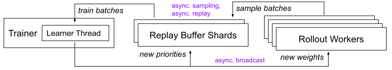
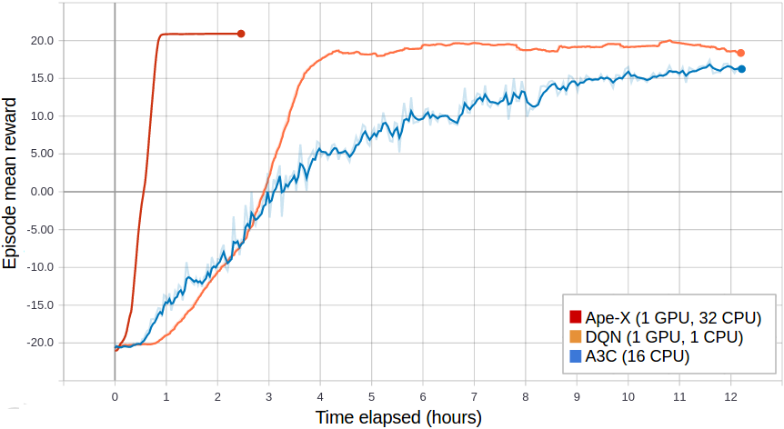

RLlib Algorithms
================

.. tip::

    Check out the `environments <rllib-env.html>`__ page to learn more about different environment types.

Feature Compatibility Matrix
~~~~~~~~~~~~~~~~~~~~~~~~~~~~

=================== ========== ======================= ================== =========== =====================
Algorithm           Frameworks Discrete Actions        Continuous Actions Multi-Agent Model Support
=================== ========== ======================= ================== =========== =====================
`A2C, A3C`_         tf + torch **Yes** `+parametric`_  **Yes**            **Yes**     `+RNN`_, `+autoreg`_
`ARS`_              tf + torch **Yes**                 **Yes**            No
`ES`_               tf + torch **Yes**                 **Yes**            No
`DDPG`_, `TD3`_     tf + torch No                      **Yes**            **Yes**
`APEX-DDPG`_        tf + torch No                      **Yes**            **Yes**
`DQN`_, `Rainbow`_  tf + torch **Yes** `+parametric`_  No                 **Yes**
`APEX-DQN`_         tf + torch **Yes** `+parametric`_  No                 **Yes**
`IMPALA`_           tf + torch **Yes** `+parametric`_  **Yes**            **Yes**     `+RNN`_, `+autoreg`_
`MAML`_             tf + torch No                      **Yes**            No
`MARWIL`_           tf + torch **Yes** `+parametric`_  **Yes**            **Yes**     `+RNN`_
`PG`_               tf + torch **Yes** `+parametric`_  **Yes**            **Yes**     `+RNN`_, `+autoreg`_
`PPO`_, `APPO`_     tf + torch **Yes** `+parametric`_  **Yes**            **Yes**     `+RNN`_, `+autoreg`_
`QMIX`_             torch      **Yes** `+parametric`_  No                 **Yes**     `+RNN`_
`SAC`_              tf + torch **Yes**                 **Yes**            **Yes**
------------------- ---------- ----------------------- ------------------ ----------- ---------------------
`AlphaZero`_        torch      **Yes** `+parametric`_  No                 No
`LinUCB`_, `LinTS`_ torch      **Yes** `+parametric`_  No                 **Yes**
`MADDPG`_           tf         **Yes**                 Partial            **Yes**
=================== ========== ======================= ================== =========== =====================

.. _`+parametric`: rllib-models.html#variable-length-parametric-action-spaces
.. _`+RNN`: rllib-models.html#recurrent-models
.. _`+autoreg`: rllib-models.html#autoregressive-action-distributions
.. _`A2C, A3C`: rllib-algorithms.html#a3c
.. _`Rainbow`: rllib-algorithms.html#dqn
.. _`TD3`: rllib-algorithms.html#ddpg
.. _`APEX-DQN`: rllib-algorithms.html#apex
.. _`APEX-DDPG`: rllib-algorithms.html#apex

High-throughput architectures
~~~~~~~~~~~~~~~~~~~~~~~~~~~~~

.. _apex:

Distributed Prioritized Experience Replay (Ape-X)
-------------------------------------------------
|pytorch| |tensorflow|
`[paper] <https://arxiv.org/abs/1803.00933>`__
`[implementation] <https://github.com/ray-project/ray/blob/master/rllib/agents/dqn/apex.py>`__
Ape-X variations of DQN and DDPG (`APEX_DQN <https://github.com/ray-project/ray/blob/master/rllib/agents/dqn/apex.py>`__, `APEX_DDPG <https://github.com/ray-project/ray/blob/master/rllib/agents/ddpg/apex.py>`__) use a single GPU learner and many CPU workers for experience collection. Experience collection can scale to hundreds of CPU workers due to the distributed prioritization of experience prior to storage in replay buffers.

    Ape-X architecture

Tuned examples: `PongNoFrameskip-v4 <https://github.com/ray-project/ray/blob/master/rllib/tuned_examples/dqn/pong-apex.yaml>`__, `Pendulum-v0 <https://github.com/ray-project/ray/blob/master/rllib/tuned_examples/ddpg/pendulum-apex-ddpg.yaml>`__, `MountainCarContinuous-v0 <https://github.com/ray-project/ray/blob/master/rllib/tuned_examples/ddpg/mountaincarcontinuous-apex-ddpg.yaml>`__, `{BeamRider,Breakout,Qbert,SpaceInvaders}NoFrameskip-v4 <https://github.com/ray-project/ray/blob/master/rllib/tuned_examples/dqn/atari-apex.yaml>`__.

**Atari results @10M steps**: `more details <https://github.com/ray-project/rl-experiments>`__

=============  ================================  ========================================
 Atari env     RLlib Ape-X 8-workers             Mnih et al Async DQN 16-workers
=============  ================================  ========================================
BeamRider      6134                              ~6000
Breakout       123                               ~50
Qbert          15302                             ~1200
SpaceInvaders  686                               ~600
=============  ================================  ========================================

**Scalability**:

=============  ================================  ========================================
 Atari env     RLlib Ape-X 8-workers @1 hour     Mnih et al Async DQN 16-workers @1 hour
=============  ================================  ========================================
BeamRider      4873                              ~1000
Breakout       77                                ~10
Qbert          4083                              ~500
SpaceInvaders  646                               ~300
=============  ================================  ========================================

    Ape-X using 32 workers in RLlib vs vanilla DQN (orange) and A3C (blue) on PongNoFrameskip-v4.

**Ape-X specific configs** (see also `common configs <rllib-training.html#common-parameters>`__):

.. literalinclude:: ../../rllib/agents/dqn/apex.py
   :language: python
   :start-after: __sphinx_doc_begin__
   :end-before: __sphinx_doc_end__

.. _impala:

Importance Weighted Actor-Learner Architecture (IMPALA)
-------------------------------------------------------
|pytorch| |tensorflow|
`[paper] <https://arxiv.org/abs/1802.01561>`__
`[implementation] <https://github.com/ray-project/ray/blob/master/rllib/agents/impala/impala.py>`__
In IMPALA, a central learner runs SGD in a tight loop while asynchronously pulling sample batches from many actor processes. RLlib's IMPALA implementation uses DeepMind's reference `V-trace code <https://github.com/deepmind/scalable_agent/blob/master/vtrace.py>`__. Note that we do not provide a deep residual network out of the box, but one can be plugged in as a `custom model <rllib-models.html#custom-models-tensorflow>`__. Multiple learner GPUs and experience replay are also supported.

.. figure:: impala-arch.svg

    IMPALA architecture

Tuned examples: `PongNoFrameskip-v4 <https://github.com/ray-project/ray/blob/master/rllib/tuned_examples/impala/pong-impala.yaml>`__, `vectorized configuration <https://github.com/ray-project/ray/blob/master/rllib/tuned_examples/impala/pong-impala-vectorized.yaml>`__, `multi-gpu configuration <https://github.com/ray-project/ray/blob/master/rllib/tuned_examples/impala/pong-impala-fast.yaml>`__, `{BeamRider,Breakout,Qbert,SpaceInvaders}NoFrameskip-v4 <https://github.com/ray-project/ray/blob/master/rllib/tuned_examples/impala/atari-impala.yaml>`__

**Atari results @10M steps**: `more details <https://github.com/ray-project/rl-experiments>`__

=============  ==================================  ====================================
 Atari env     RLlib IMPALA 32-workers             Mnih et al A3C 16-workers
=============  ==================================  ====================================
BeamRider      2071                                ~3000
Breakout       385                                 ~150
Qbert          4068                                ~1000
SpaceInvaders  719                                 ~600
=============  ==================================  ====================================

**Scalability:**

=============  ===============================  =================================
 Atari env     RLlib IMPALA 32-workers @1 hour  Mnih et al A3C 16-workers @1 hour
=============  ===============================  =================================
BeamRider      3181                             ~1000
Breakout       538                              ~10
Qbert          10850                            ~500
SpaceInvaders  843                              ~300
=============  ===============================  =================================

.. figure:: impala.png

   Multi-GPU IMPALA scales up to solve PongNoFrameskip-v4 in ~3 minutes using a pair of V100 GPUs and 128 CPU workers.
   The maximum training throughput reached is ~30k transitions per second (~120k environment frames per second).

**IMPALA-specific configs** (see also `common configs <rllib-training.html#common-parameters>`__):

.. literalinclude:: ../../rllib/agents/impala/impala.py
   :language: python
   :start-after: __sphinx_doc_begin__
   :end-before: __sphinx_doc_end__

.. _appo:

Asynchronous Proximal Policy Optimization (APPO)
------------------------------------------------
|pytorch| |tensorflow|
`[paper] <https://arxiv.org/abs/1707.06347>`__
`[implementation] <https://github.com/ray-project/ray/blob/master/rllib/agents/ppo/appo.py>`__
We include an asynchronous variant of Proximal Policy Optimization (PPO) based on the IMPALA architecture. This is similar to IMPALA but using a surrogate policy loss with clipping. Compared to synchronous PPO, APPO is more efficient in wall-clock time due to its use of asynchronous sampling. Using a clipped loss also allows for multiple SGD passes, and therefore the potential for better sample efficiency compared to IMPALA. V-trace can also be enabled to correct for off-policy samples.

.. tip::

    APPO is not always more efficient; it is often better to use :ref:`standard PPO <ppo>` or :ref:`IMPALA <impala>`.

.. figure:: impala-arch.svg

    APPO architecture (same as IMPALA)

Tuned examples: `PongNoFrameskip-v4 <https://github.com/ray-project/ray/blob/master/rllib/tuned_examples/ppo/pong-appo.yaml>`__

**APPO-specific configs** (see also `common configs <rllib-training.html#common-parameters>`__):

.. literalinclude:: ../../rllib/agents/ppo/appo.py
   :language: python
   :start-after: __sphinx_doc_begin__
   :end-before: __sphinx_doc_end__

.. _ddppo:

Decentralized Distributed Proximal Policy Optimization (DD-PPO)
---------------------------------------------------------------
|pytorch|
`[paper] <https://arxiv.org/abs/1911.00357>`__
`[implementation] <https://github.com/ray-project/ray/blob/master/rllib/agents/ppo/ddppo.py>`__
Unlike APPO or PPO, with DD-PPO policy improvement is no longer done centralized in the trainer process. Instead, gradients are computed remotely on each rollout worker and all-reduced at each mini-batch using `torch distributed <https://pytorch.org/docs/stable/distributed.html>`__. This allows each worker's GPU to be used both for sampling and for training.

.. tip::

    DD-PPO is best for envs that require GPUs to function, or if you need to scale out SGD to multiple nodes. If you don't meet these requirements, `standard PPO <#proximal-policy-optimization-ppo>`__ will be more efficient.

.. figure:: ddppo-arch.svg

    DD-PPO architecture (both sampling and learning are done on worker GPUs)

Tuned examples: `CartPole-v0 <https://github.com/ray-project/ray/blob/master/rllib/tuned_examples/ppo/cartpole-ddppo.yaml>`__, `BreakoutNoFrameskip-v4 <https://github.com/ray-project/ray/blob/master/rllib/tuned_examples/ppo/atari-ddppo.yaml>`__

**DDPPO-specific configs** (see also `common configs <rllib-training.html#common-parameters>`__):

.. literalinclude:: ../../rllib/agents/ppo/ddppo.py
   :language: python
   :start-after: __sphinx_doc_begin__
   :end-before: __sphinx_doc_end__

Gradient-based
~~~~~~~~~~~~~~

.. _a3c:

Advantage Actor-Critic (A2C, A3C)
---------------------------------
|pytorch| |tensorflow|
`[paper] <https://arxiv.org/abs/1602.01783>`__ `[implementation] <https://github.com/ray-project/ray/blob/master/rllib/agents/a3c/a3c.py>`__
RLlib implements both A2C and A3C. These algorithms scale to 16-32+ worker processes depending on the environment.

A2C also supports microbatching (i.e., gradient accumulation), which can be enabled by setting the ``microbatch_size`` config. Microbatching allows for training with a ``train_batch_size`` much larger than GPU memory.

.. figure:: a2c-arch.svg

    A2C architecture

Tuned examples: `PongDeterministic-v4 <https://github.com/ray-project/ray/blob/master/rllib/tuned_examples/a3c/pong-a3c.yaml>`__, `PyTorch version <https://github.com/ray-project/ray/blob/master/rllib/tuned_examples/a3c/pong-a3c-pytorch.yaml>`__, `{BeamRider,Breakout,Qbert,SpaceInvaders}NoFrameskip-v4 <https://github.com/ray-project/ray/blob/master/rllib/tuned_examples/a3c/atari-a2c.yaml>`__

.. tip::
    Consider using `IMPALA <#importance-weighted-actor-learner-architecture-impala>`__ for faster training with similar timestep efficiency.

**Atari results @10M steps**: `more details <https://github.com/ray-project/rl-experiments>`__

=============  ========================  ==============================
 Atari env     RLlib A2C 5-workers       Mnih et al A3C 16-workers
=============  ========================  ==============================
BeamRider      1401                      ~3000
Breakout       374                       ~150
Qbert          3620                      ~1000
SpaceInvaders  692                       ~600
=============  ========================  ==============================

**A3C-specific configs** (see also `common configs <rllib-training.html#common-parameters>`__):

.. literalinclude:: ../../rllib/agents/a3c/a3c.py
   :language: python
   :start-after: __sphinx_doc_begin__
   :end-before: __sphinx_doc_end__

.. _ddpg:

Deep Deterministic Policy Gradients (DDPG, TD3)
-----------------------------------------------
|pytorch| |tensorflow|
`[paper] <https://arxiv.org/abs/1509.02971>`__ `[implementation] <https://github.com/ray-project/ray/blob/master/rllib/agents/ddpg/ddpg.py>`__
DDPG is implemented similarly to DQN (below). The algorithm can be scaled by increasing the number of workers or using Ape-X. The improvements from `TD3 <https://spinningup.openai.com/en/latest/algorithms/td3.html>`__ are available as ``TD3``.

.. figure:: dqn-arch.svg

    DDPG architecture (same as DQN)

Tuned examples: `Pendulum-v0 <https://github.com/ray-project/ray/blob/master/rllib/tuned_examples/ddpg/pendulum-ddpg.yaml>`__, `MountainCarContinuous-v0 <https://github.com/ray-project/ray/blob/master/rllib/tuned_examples/ddpg/mountaincarcontinuous-ddpg.yaml>`__, `HalfCheetah-v2 <https://github.com/ray-project/ray/blob/master/rllib/tuned_examples/ddpg/halfcheetah-ddpg.yaml>`__, `TD3 Pendulum-v0 <https://github.com/ray-project/ray/blob/master/rllib/tuned_examples/pendulum-td3.yaml>`__, `TD3 InvertedPendulum-v2 <https://github.com/ray-project/ray/blob/master/rllib/tuned_examples/invertedpendulum-td3.yaml>`__, `TD3 Mujoco suite (Ant-v2, HalfCheetah-v2, Hopper-v2, Walker2d-v2) <https://github.com/ray-project/ray/blob/master/rllib/tuned_examples/mujoco-td3.yaml>`__.

**DDPG-specific configs** (see also `common configs <rllib-training.html#common-parameters>`__):

.. literalinclude:: ../../rllib/agents/ddpg/ddpg.py
   :language: python
   :start-after: __sphinx_doc_begin__
   :end-before: __sphinx_doc_end__

.. _dqn:

Deep Q Networks (DQN, Rainbow, Parametric DQN)
----------------------------------------------
|pytorch| |tensorflow|
`[paper] <https://arxiv.org/abs/1312.5602>`__ `[implementation] <https://github.com/ray-project/ray/blob/master/rllib/agents/dqn/dqn.py>`__
DQN can be scaled by increasing the number of workers or using Ape-X. Memory usage is reduced by compressing samples in the replay buffer with LZ4. All of the DQN improvements evaluated in `Rainbow <https://arxiv.org/abs/1710.02298>`__ are available, though not all are enabled by default. See also how to use `parametric-actions in DQN <rllib-models.html#variable-length-parametric-action-spaces>`__.

.. figure:: dqn-arch.svg

    DQN architecture

Tuned examples: `PongDeterministic-v4 <https://github.com/ray-project/ray/blob/master/rllib/tuned_examples/dqn/pong-dqn.yaml>`__, `Rainbow configuration <https://github.com/ray-project/ray/blob/master/rllib/tuned_examples/dqn/pong-rainbow.yaml>`__, `{BeamRider,Breakout,Qbert,SpaceInvaders}NoFrameskip-v4 <https://github.com/ray-project/ray/blob/master/rllib/tuned_examples/dqn/atari-dqn.yaml>`__, `with Dueling and Double-Q <https://github.com/ray-project/ray/blob/master/rllib/tuned_examples/dqn/atari-duel-ddqn.yaml>`__, `with Distributional DQN <https://github.com/ray-project/ray/blob/master/rllib/tuned_examples/dqn/atari-dist-dqn.yaml>`__.

.. tip::
    Consider using `Ape-X <#distributed-prioritized-experience-replay-ape-x>`__ for faster training with similar timestep efficiency.

.. hint::
    For a complete `rainbow <https://arxiv.org/pdf/1710.02298.pdf>`__ setup,
    make the following changes to the default DQN config:
    ``"n_step": [between 1 and 10],
    "noisy": True,
    "num_atoms": [more than 1],
    "v_min": -10.0,
    "v_max": 10.0``
    (set ``v_min`` and ``v_max`` according to your expected range of returns).

**Atari results @10M steps**: `more details <https://github.com/ray-project/rl-experiments>`__

=============  ========================  =============================  ==============================  ===============================
 Atari env     RLlib DQN                 RLlib Dueling DDQN             RLlib Dist. DQN                 Hessel et al. DQN
=============  ========================  =============================  ==============================  ===============================
BeamRider      2869                      1910                           4447                            ~2000
Breakout       287                       312                            410                             ~150
Qbert          3921                      7968                           15780                           ~4000
SpaceInvaders  650                       1001                           1025                            ~500
=============  ========================  =============================  ==============================  ===============================

**DQN-specific configs** (see also `common configs <rllib-training.html#common-parameters>`__):

.. literalinclude:: ../../rllib/agents/dqn/dqn.py
   :language: python
   :start-after: __sphinx_doc_begin__
   :end-before: __sphinx_doc_end__

.. _pg:

Policy Gradients
----------------
|pytorch| |tensorflow|
`[paper] <https://papers.nips.cc/paper/1713-policy-gradient-methods-for-reinforcement-learning-with-function-approximation.pdf>`__ `[implementation] <https://github.com/ray-project/ray/blob/master/rllib/agents/pg/pg.py>`__ We include a vanilla policy gradients implementation as an example algorithm.

.. figure:: a2c-arch.svg

    Policy gradients architecture (same as A2C)

Tuned examples: `CartPole-v0 <https://github.com/ray-project/ray/blob/master/rllib/tuned_examples/pg/cartpole-pg.yaml>`__

**PG-specific configs** (see also `common configs <rllib-training.html#common-parameters>`__):

.. literalinclude:: ../../rllib/agents/pg/pg.py
   :language: python
   :start-after: __sphinx_doc_begin__
   :end-before: __sphinx_doc_end__

.. _ppo:

Proximal Policy Optimization (PPO)
----------------------------------
|pytorch| |tensorflow|
`[paper] <https://arxiv.org/abs/1707.06347>`__ `[implementation] <https://github.com/ray-project/ray/blob/master/rllib/agents/ppo/ppo.py>`__
PPO's clipped objective supports multiple SGD passes over the same batch of experiences. RLlib's multi-GPU optimizer pins that data in GPU memory to avoid unnecessary transfers from host memory, substantially improving performance over a naive implementation. PPO scales out using multiple workers for experience collection, and also to multiple GPUs for SGD.

.. tip::

    If you need to scale out with GPUs on multiple nodes, consider using `decentralized PPO <#decentralized-distributed-proximal-policy-optimization-dd-ppo>`__.

.. figure:: ppo-arch.svg

    PPO architecture

Tuned examples:
`Unity3D Soccer (multi-agent: Strikers vs Goalie) <https://github.com/ray-project/ray/blob/master/rllib/tuned_examples/ppo/unity3d-soccer-strikers-vs-goalie-ppo.yaml>`__,
`Humanoid-v1 <https://github.com/ray-project/ray/blob/master/rllib/tuned_examples/ppo/humanoid-ppo-gae.yaml>`__,
`Hopper-v1 <https://github.com/ray-project/ray/blob/master/rllib/tuned_examples/ppo/hopper-ppo.yaml>`__,
`Pendulum-v0 <https://github.com/ray-project/ray/blob/master/rllib/tuned_examples/ppo/pendulum-ppo.yaml>`__,
`PongDeterministic-v4 <https://github.com/ray-project/ray/blob/master/rllib/tuned_examples/ppo/pong-ppo.yaml>`__,
`Walker2d-v1 <https://github.com/ray-project/ray/blob/master/rllib/tuned_examples/ppo/walker2d-ppo.yaml>`__,
`HalfCheetah-v2 <https://github.com/ray-project/ray/blob/master/rllib/tuned_examples/ppo/halfcheetah-ppo.yaml>`__,
`{BeamRider,Breakout,Qbert,SpaceInvaders}NoFrameskip-v4 <https://github.com/ray-project/ray/blob/master/rllib/tuned_examples/ppo/atari-ppo.yaml>`__

**Atari results**: `more details <https://github.com/ray-project/rl-experiments>`__

=============  ==============  ==============  ==================
 Atari env     RLlib PPO @10M  RLlib PPO @25M  Baselines PPO @10M
=============  ==============  ==============  ==================
BeamRider      2807            4480            ~1800
Breakout       104             201             ~250
Qbert          11085           14247           ~14000
SpaceInvaders  671             944             ~800
=============  ==============  ==============  ==================

**Scalability:** `more details <https://github.com/ray-project/rl-experiments>`__

=============  =========================  =============================
MuJoCo env     RLlib PPO 16-workers @ 1h  Fan et al PPO 16-workers @ 1h
=============  =========================  =============================
HalfCheetah    9664                       ~7700
=============  =========================  =============================

.. figure:: ppo.png
   :width: 500px

   RLlib's multi-GPU PPO scales to multiple GPUs and hundreds of CPUs on solving the Humanoid-v1 task. Here we compare against a reference MPI-based implementation.

**PPO-specific configs** (see also `common configs <rllib-training.html#common-parameters>`__):

.. literalinclude:: ../../rllib/agents/ppo/ppo.py
   :language: python
   :start-after: __sphinx_doc_begin__
   :end-before: __sphinx_doc_end__

.. _sac:

Soft Actor Critic (SAC)
------------------------
|pytorch| |tensorflow|
`[paper] <https://arxiv.org/pdf/1801.01290>`__ `[implementation] <https://github.com/ray-project/ray/blob/master/rllib/agents/sac/sac.py>`__

.. figure:: dqn-arch.svg

    SAC architecture (same as DQN)

RLlib's soft-actor critic implementation is ported from the `official SAC repo <https://github.com/rail-berkeley/softlearning>`__ to better integrate with RLlib APIs. Note that SAC has two fields to configure for custom models: ``policy_model`` and ``Q_model``.

Tuned examples: `Pendulum-v0 <https://github.com/ray-project/ray/blob/master/rllib/tuned_examples/sac/pendulum-sac.yaml>`__, `HalfCheetah-v3 <https://github.com/ray-project/ray/blob/master/rllib/tuned_examples/sac/halfcheetah-sac.yaml>`__

**MuJoCo results @3M steps:** `more details <https://github.com/ray-project/rl-experiments>`__

=============  ==========  ===================
MuJoCo env     RLlib SAC   Haarnoja et al SAC
=============  ==========  ===================
HalfCheetah    13000       ~15000
=============  ==========  ===================

**SAC-specific configs** (see also `common configs <rllib-training.html#common-parameters>`__):

.. literalinclude:: ../../rllib/agents/sac/sac.py
   :language: python
   :start-after: __sphinx_doc_begin__
   :end-before: __sphinx_doc_end__

.. _maml:

Model-Agnostic Meta-Learning (MAML)
-----------------------------------
|pytorch| |tensorflow|
`[paper] <https://arxiv.org/abs/1703.03400>`__ `[implementation] <https://github.com/ray-project/ray/blob/master/rllib/agents/maml/maml.py>`__

RLlib's MAML implementation is a meta-learning method for learning and quick adaptation across different tasks for continuous control. Code here is adapted from https://github.com/jonasrothfuss, which outperforms vanilla MAML and avoids computation of the higher order gradients during the meta-update step. MAML is evaluated on custom environments that are described in greater detail `here <https://github.com/ray-project/ray/blob/master/rllib/env/meta_env.py>`__.

MAML uses additional metrics to measure performance; ``episode_reward_mean`` measures the agent's returns before adaptation, ``episode_reward_mean_adapt_N`` measures the agent's returns after N gradient steps of inner adaptation, and ``adaptation_delta`` measures the difference in performance before and after adaptation. Examples can be seen `here <https://github.com/ray-project/rl-experiments/tree/master/maml>`__.

Tuned examples: HalfCheetahRandDirecEnv (`Env <https://github.com/ray-project/ray/blob/master/rllib/examples/env/halfcheetah_rand_direc.py>`__, `Config <https://github.com/ray-project/ray/blob/master/rllib/tuned_examples/maml/halfcheetah-rand-direc-maml.yaml>`__), AntRandGoalEnv (`Env <https://github.com/ray-project/ray/blob/master/rllib/examples/env/ant_rand_goal.py>`__, `Config <https://github.com/ray-project/ray/blob/master/rllib/tuned_examples/maml/ant-rand-goal-maml.yaml>`__), PendulumMassEnv (`Env <https://github.com/ray-project/ray/blob/master/rllib/examples/env/pendulum_mass.py>`__, `Config <https://github.com/ray-project/ray/blob/master/rllib/tuned_examples/maml/pendulum-mass-maml.yaml>`__)

**MAML-specific configs** (see also `common configs <rllib-training.html#common-parameters>`__):

.. literalinclude:: ../../rllib/agents/maml/maml.py
   :language: python
   :start-after: __sphinx_doc_begin__
   :end-before: __sphinx_doc_end__

Derivative-free
~~~~~~~~~~~~~~~

.. _ars:

Augmented Random Search (ARS)
-----------------------------
|pytorch| |tensorflow|
`[paper] <https://arxiv.org/abs/1803.07055>`__ `[implementation] <https://github.com/ray-project/ray/blob/master/rllib/agents/ars/ars.py>`__
ARS is a random search method for training linear policies for continuous control problems. Code here is adapted from https://github.com/modestyachts/ARS to integrate with RLlib APIs.

Tuned examples: `CartPole-v0 <https://github.com/ray-project/ray/blob/master/rllib/tuned_examples/ars/cartpole-ars.yaml>`__, `Swimmer-v2 <https://github.com/ray-project/ray/blob/master/rllib/tuned_examples/ars/swimmer-ars.yaml>`__

**ARS-specific configs** (see also `common configs <rllib-training.html#common-parameters>`__):

.. literalinclude:: ../../rllib/agents/ars/ars.py
   :language: python
   :start-after: __sphinx_doc_begin__
   :end-before: __sphinx_doc_end__

.. _es:

Evolution Strategies
--------------------
|pytorch| |tensorflow|
`[paper] <https://arxiv.org/abs/1703.03864>`__ `[implementation] <https://github.com/ray-project/ray/blob/master/rllib/agents/es/es.py>`__
Code here is adapted from https://github.com/openai/evolution-strategies-starter to execute in the distributed setting with Ray.

Tuned examples: `Humanoid-v1 <https://github.com/ray-project/ray/blob/master/rllib/tuned_examples/es/humanoid-es.yaml>`__

**Scalability:**

.. figure:: es.png
   :width: 500px

   RLlib's ES implementation scales further and is faster than a reference Redis implementation on solving the Humanoid-v1 task.

**ES-specific configs** (see also `common configs <rllib-training.html#common-parameters>`__):

.. literalinclude:: ../../rllib/agents/es/es.py
   :language: python
   :start-after: __sphinx_doc_begin__
   :end-before: __sphinx_doc_end__

.. _qmix:

QMIX Monotonic Value Factorisation (QMIX, VDN, IQN)
---------------------------------------------------
|pytorch|
`[paper] <https://arxiv.org/abs/1803.11485>`__ `[implementation] <https://github.com/ray-project/ray/blob/master/rllib/agents/qmix/qmix.py>`__ Q-Mix is a specialized multi-agent algorithm. Code here is adapted from https://github.com/oxwhirl/pymarl_alpha  to integrate with RLlib multi-agent APIs. To use Q-Mix, you must specify an agent `grouping <rllib-env.html#grouping-agents>`__ in the environment (see the `two-step game example <https://github.com/ray-project/ray/blob/master/rllib/examples/two_step_game.py>`__). Currently, all agents in the group must be homogeneous. The algorithm can be scaled by increasing the number of workers or using Ape-X.

Tuned examples: `Two-step game <https://github.com/ray-project/ray/blob/master/rllib/examples/two_step_game.py>`__

**QMIX-specific configs** (see also `common configs <rllib-training.html#common-parameters>`__):

.. literalinclude:: ../../rllib/agents/qmix/qmix.py
   :language: python
   :start-after: __sphinx_doc_begin__
   :end-before: __sphinx_doc_end__

.. _maddpg:

Multi-Agent Deep Deterministic Policy Gradient (contrib/MADDPG)
---------------------------------------------------------------
|tensorflow|
`[paper] <https://arxiv.org/abs/1706.02275>`__ `[implementation] <https://github.com/ray-project/ray/blob/master/rllib/contrib/maddpg/maddpg.py>`__ MADDPG is a DDPG centralized critic algorithm. Code here is adapted from https://github.com/openai/maddpg to integrate with RLlib multi-agent APIs. Please check `justinkterry/maddpg-rllib <https://github.com/justinkterry/maddpg-rllib>`__ for examples and more information. Note that the implementation here is based on OpenAI's, and is intended for use with the discrete MPE environments. Please also note that people typically find this method difficult to get to work, even with all applicable optimizations for their environment applied. This method should be viewed as for research purposes, and for reproducing the results of the paper introducing it.

**MADDPG-specific configs** (see also `common configs <rllib-training.html#common-parameters>`__):

Tuned examples: `Multi-Agent Particle Environment <https://github.com/wsjeon/maddpg-rllib/tree/master/plots>`__, `Two-step game <https://github.com/ray-project/ray/blob/master/rllib/examples/two_step_game.py>`__

.. literalinclude:: ../../rllib/contrib/maddpg/maddpg.py
   :language: python
   :start-after: __sphinx_doc_begin__
   :end-before: __sphinx_doc_end__

.. _marwil:

Advantage Re-Weighted Imitation Learning (MARWIL)
-------------------------------------------------
|pytorch| |tensorflow|
`[paper] <http://papers.nips.cc/paper/7866-exponentially-weighted-imitation-learning-for-batched-historical-data>`__ `[implementation] <https://github.com/ray-project/ray/blob/master/rllib/agents/marwil/marwil.py>`__ MARWIL is a hybrid imitation learning and policy gradient algorithm suitable for training on batched historical data. When the ``beta`` hyperparameter is set to zero, the MARWIL objective reduces to vanilla imitation learning. MARWIL requires the `offline datasets API <rllib-offline.html>`__ to be used.

Tuned examples: `CartPole-v0 <https://github.com/ray-project/ray/blob/master/rllib/tuned_examples/marwil/cartpole-marwil.yaml>`__

**MARWIL-specific configs** (see also `common configs <rllib-training.html#common-parameters>`__):

.. literalinclude:: ../../rllib/agents/marwil/marwil.py
   :language: python
   :start-after: __sphinx_doc_begin__
   :end-before: __sphinx_doc_end__

.. _alphazero:

Single-Player Alpha Zero (contrib/AlphaZero)
--------------------------------------------
|pytorch|
`[paper] <https://arxiv.org/abs/1712.01815>`__ `[implementation] <https://github.com/ray-project/ray/blob/master/rllib/contrib/alpha_zero>`__ AlphaZero is an RL agent originally designed for two-player games. This version adapts it to handle single player games. The code can be sscaled to any number of workers. It also implements the ranked rewards `(R2) <https://arxiv.org/abs/1807.01672>`__ strategy to enable self-play even in the one-player setting. The code is mainly purposed to be used for combinatorial optimization.

Tuned examples: `CartPole-v0 <https://github.com/ray-project/ray/blob/master/rllib/contrib/alpha_zero/examples/train_cartpole.py>`__

**AlphaZero-specific configs** (see also `common configs <rllib-training.html#common-parameters>`__):

.. literalinclude:: ../../rllib/contrib/alpha_zero/core/alpha_zero_trainer.py
   :language: python
   :start-after: __sphinx_doc_begin__
   :end-before: __sphinx_doc_end__

Contextual Bandits (contrib/bandits)
~~~~~~~~~~~~~~~~~~~~~~~~~~~~~~~~~~~~

The Multi-armed bandit (MAB) problem provides a simplified RL setting that
involves learning to act under one situation only, i.e. the state is fixed.
Contextual bandit is extension of the MAB problem, where at each
round the agent has access not only to a set of bandit arms/actions but also
to a context (state) associated with this iteration. The context changes
with each iteration, but, is not affected by the action that the agent takes.
The objective of the agent is to maximize the cumulative rewards, by
collecting  enough information about how the context and the rewards of the
arms are related to each other. The agent does this by balancing the
trade-off between exploration and exploitation.

Contextual bandit algorithms typically consist of an action-value model (Q
model) and an exploration strategy (e-greedy, UCB, Thompson Sampling etc.)
RLlib supports the following online contextual bandit algorithms,
named after the exploration strategies that they employ:

.. _linucb:

Linear Upper Confidence Bound (contrib/LinUCB)
----------------------------------------------
|pytorch|
`[paper] <http://rob.schapire.net/papers/www10.pdf>`__ `[implementation]
<https://github.com/ray-project/ray/blob/master/rllib/contrib/bandits/agents/lin_ucb.py>`__
LinUCB assumes a linear dependency between the expected reward of an action and
its context. It estimates the Q value of each action using ridge regression.
It constructs a confidence region around the weights of the linear
regression model and uses this confidence ellipsoid to estimate the
uncertainty of action values.

Tuned examples: `SimpleContextualBandit <https://github.com/ray-project/ray/blob/master/rllib/contrib/bandits/examples/simple_context_bandit.py>`__, `ParametricItemRecoEnv <https://github.com/ray-project/ray/blob/master/rllib/contrib/bandits/examples/tune_LinUCB_train_recommendation.py>`__.

**LinUCB-specific configs** (see also `common configs <rllib-training
.html#common-parameters>`__):

.. literalinclude:: ../../rllib/contrib/bandits/agents/lin_ucb.py
   :language: python
   :start-after: __sphinx_doc_begin__
   :end-before: __sphinx_doc_end__

.. _lints:

Linear Thompson Sampling (contrib/LinTS)
----------------------------------------
|pytorch|
`[paper] <http://proceedings.mlr.press/v28/agrawal13.pdf>`__ `[implementation]
<https://github.com/ray-project/ray/blob/master/rllib/contrib/bandits/agents/lin_ts.py>`__
Like LinUCB, LinTS also assumes a linear dependency between the expected
reward of an action and its context and uses online ridge regression to
estimate the Q values of actions given the context. It assumes a Gaussian
prior on the weights and a Gaussian likelihood function. For deciding which
action to take, the agent samples weights for each arm, using
the posterior distributions, and plays the arm that produces the highest reward.

Tuned examples: `SimpleContextualBandit <https://github.com/ray-project/ray/blob/master/rllib/contrib/bandits/examples/simple_context_bandit.py>`__, `WheelBandit <https://github.com/ray-project/ray/blob/master/rllib/contrib/bandits/examples/tune_LinTS_train_wheel_env.py>`__.

**LinTS-specific configs** (see also `common configs <rllib-training
.html#common-parameters>`__):

.. literalinclude:: ../../rllib/contrib/bandits/agents/lin_ts.py
   :language: python
   :start-after: __sphinx_doc_begin__
   :end-before: __sphinx_doc_end__

.. |pytorch| image:: pytorch.png
    :width: 24
