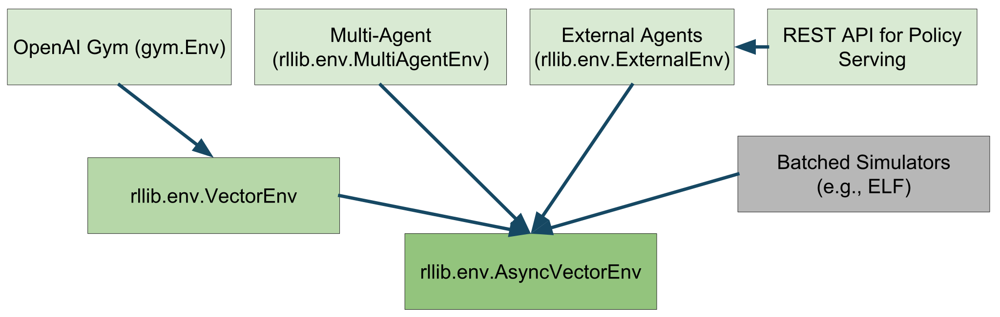
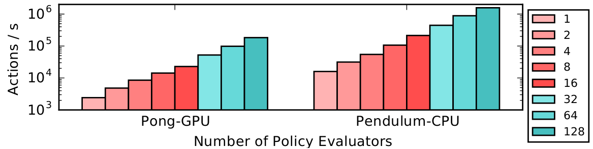
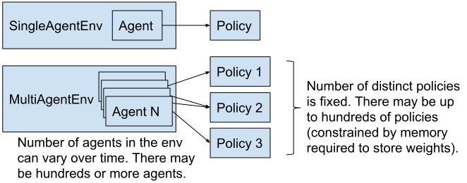

RLlib Environments
==================

RLlib works with several different types of environments, including `OpenAI Gym <https://gym.openai.com/>`__, user-defined, multi-agent, and also batched environments.

**Compatibility matrix**:

=============  =======================  ==================  ===========  ==================
Algorithm      Discrete Actions         Continuous Actions  Multi-Agent  Recurrent Policies
=============  =======================  ==================  ===========  ==================
A2C, A3C        **Yes** `+parametric`_  **Yes**             **Yes**      **Yes**
PPO, APPO       **Yes** `+parametric`_  **Yes**             **Yes**      **Yes**
PG              **Yes** `+parametric`_  **Yes**             **Yes**      **Yes**
IMPALA          **Yes** `+parametric`_  **Yes**             **Yes**      **Yes**
DQN, Rainbow    **Yes** `+parametric`_  No                  **Yes**      No
DDPG, TD3       No                      **Yes**             **Yes**      No
APEX-DQN        **Yes** `+parametric`_  No                  **Yes**      No
APEX-DDPG       No                      **Yes**             **Yes**      No
SAC             (todo)                  **Yes**             **Yes**      No
ES              **Yes**                 **Yes**             No           No
ARS             **Yes**                 **Yes**             No           No
QMIX            **Yes**                 No                  **Yes**      **Yes**
MARWIL          **Yes** `+parametric`_  **Yes**             **Yes**      **Yes**
=============  =======================  ==================  ===========  ==================

.. _`+parametric`: rllib-models.html#variable-length-parametric-action-spaces

You can pass either a string name or a Python class to specify an environment. By default, strings will be interpreted as a gym `environment name <https://gym.openai.com/envs>`__. Custom env classes passed directly to the trainer must take a single ``env_config`` parameter in their constructor:

.. code-block:: python

    import gym, ray
    from ray.rllib.agents import ppo

    class MyEnv(gym.Env):
        def __init__(self, env_config):
            self.action_space = <gym.Space>
            self.observation_space = <gym.Space>
        def reset(self):
            return <obs>
        def step(self, action):
            return <obs>, <reward: float>, <done: bool>, <info: dict>

    ray.init()
    trainer = ppo.PPOTrainer(env=MyEnv, config={
        "env_config": {},  # config to pass to env class
    })

    while True:
        print(trainer.train())

You can also register a custom env creator function with a string name. This function must take a single ``env_config`` parameter and return an env instance:

.. code-block:: python

    from ray.tune.registry import register_env

    def env_creator(env_config):
        return MyEnv(...)  # return an env instance

    register_env("my_env", env_creator)
    trainer = ppo.PPOTrainer(env="my_env")

For a full runnable code example using the custom environment API, see `custom_env.py <https://github.com/ray-project/ray/blob/master/python/ray/rllib/examples/custom_env.py>`__.

.. warning::

   The gym registry is not compatible with Ray. Instead, always use the registration flows documented above to ensure Ray workers can access the environment.

Configuring Environments
------------------------

In the above example, note that the ``env_creator`` function takes in an ``env_config`` object. This is a dict containing options passed in through your trainer. You can also access ``env_config.worker_index`` and ``env_config.vector_index`` to get the worker id and env id within the worker (if ``num_envs_per_worker > 0``). This can be useful if you want to train over an ensemble of different environments, for example:

.. code-block:: python

    class MultiEnv(gym.Env):
        def __init__(self, env_config):
            # pick actual env based on worker and env indexes
            self.env = gym.make(
                choose_env_for(env_config.worker_index, env_config.vector_index))
            self.action_space = self.env.action_space
            self.observation_space = self.env.observation_space
        def reset(self):
            return self.env.reset()
        def step(self, action):
            return self.env.step(action)

    register_env("multienv", lambda config: MultiEnv(config))

OpenAI Gym
----------

RLlib uses Gym as its environment interface for single-agent training. For more information on how to implement a custom Gym environment, see the `gym.Env class definition <https://github.com/openai/gym/blob/master/gym/core.py>`__. You may find the `SimpleCorridor <https://github.com/ray-project/ray/blob/master/python/ray/rllib/examples/custom_env.py>`__ example useful as a reference.

Performance
~~~~~~~~~~~

There are two ways to scale experience collection with Gym environments:

    1. **Vectorization within a single process:** Though many envs can achieve high frame rates per core, their throughput is limited in practice by policy evaluation between steps. For example, even small TensorFlow models incur a couple milliseconds of latency to evaluate. This can be worked around by creating multiple envs per process and batching policy evaluations across these envs.

      You can configure ``{"num_envs_per_worker": M}`` to have RLlib create ``M`` concurrent environments per worker. RLlib auto-vectorizes Gym environments via `VectorEnv.wrap() <https://github.com/ray-project/ray/blob/master/python/ray/rllib/env/vector_env.py>`__.

    2. **Distribute across multiple processes:** You can also have RLlib create multiple processes (Ray actors) for experience collection. In most algorithms this can be controlled by setting the ``{"num_workers": N}`` config.

You can also combine vectorization and distributed execution, as shown in the above figure. Here we plot just the throughput of RLlib policy evaluation from 1 to 128 CPUs. PongNoFrameskip-v4 on GPU scales from 2.4k to ∼200k actions/s, and Pendulum-v0 on CPU from 15k to 1.5M actions/s. One machine was used for 1-16 workers, and a Ray cluster of four machines for 32-128 workers. Each worker was configured with ``num_envs_per_worker=64``.

Expensive Environments
~~~~~~~~~~~~~~~~~~~~~~

Some environments may be very resource-intensive to create. RLlib will create ``num_workers + 1`` copies of the environment since one copy is needed for the driver process. To avoid paying the extra overhead of the driver copy, which is needed to access the env's action and observation spaces, you can defer environment initialization until ``reset()`` is called.

Vectorized
----------

RLlib will auto-vectorize Gym envs for batch evaluation if the ``num_envs_per_worker`` config is set, or you can define a custom environment class that subclasses `VectorEnv <https://github.com/ray-project/ray/blob/master/python/ray/rllib/env/vector_env.py>`__ to implement ``vector_step()`` and ``vector_reset()``.

Note that auto-vectorization only applies to policy inference by default. This means that policy inference will be batched, but your envs will still be stepped one at a time. If you would like your envs to be stepped in parallel, you can set ``"remote_worker_envs": True``. This will create env instances in Ray actors and step them in parallel. These remote processes introduce communication overheads, so this only helps if your env is very expensive to step / reset.

When using remote envs, you can control the batching level for inference with ``remote_env_batch_wait_ms``. The default value of 0ms means envs execute asynchronously and inference is only batched opportunistically. Setting the timeout to a large value will result in fully batched inference and effectively synchronous environment stepping. The optimal value depends on your environment step / reset time, and model inference speed.

Multi-Agent and Hierarchical
----------------------------

.. note::

   Learn more about multi-agent reinforcement learning in RLlib by checking out some of the `code examples <rllib-examples.html#multi-agent-and-hierarchical>`__ or reading the `blog post <https://bair.berkeley.edu/blog/2018/12/12/rllib/>`__.

A multi-agent environment is one which has multiple acting entities per step, e.g., in a traffic simulation, there may be multiple "car" and "traffic light" agents in the environment. The model for multi-agent in RLlib as follows: (1) as a user you define the number of policies available up front, and (2) a function that maps agent ids to policy ids. This is summarized by the below figure:

The environment itself must subclass the `MultiAgentEnv <https://github.com/ray-project/ray/blob/master/python/ray/rllib/env/multi_agent_env.py>`__ interface, which can returns observations and rewards from multiple ready agents per step:

.. code-block:: python

    # Example: using a multi-agent env
    > env = MultiAgentTrafficEnv(num_cars=20, num_traffic_lights=5)

    # Observations are a dict mapping agent names to their obs. Not all agents
    # may be present in the dict in each time step.
    > print(env.reset())
    {
        "car_1": [[...]],
        "car_2": [[...]],
        "traffic_light_1": [[...]],
    }

    # Actions should be provided for each agent that returned an observation.
    > new_obs, rewards, dones, infos = env.step(actions={"car_1": ..., "car_2": ...})

    # Similarly, new_obs, rewards, dones, etc. also become dicts
    > print(rewards)
    {"car_1": 3, "car_2": -1, "traffic_light_1": 0}

    # Individual agents can early exit; env is done when "__all__" = True
    > print(dones)
    {"car_2": True, "__all__": False}

If all the agents will be using the same algorithm class to train, then you can setup multi-agent training as follows:

.. code-block:: python

    trainer = pg.PGAgent(env="my_multiagent_env", config={
        "multiagent": {
            "policies": {
                # the first tuple value is None -> uses default policy
                "car1": (None, car_obs_space, car_act_space, {"gamma": 0.85}),
                "car2": (None, car_obs_space, car_act_space, {"gamma": 0.99}),
                "traffic_light": (None, tl_obs_space, tl_act_space, {}),
            },
            "policy_mapping_fn":
                lambda agent_id:
                    "traffic_light"  # Traffic lights are always controlled by this policy
                    if agent_id.startswith("traffic_light_")
                    else random.choice(["car1", "car2"])  # Randomly choose from car policies
        },
    })

    while True:
        print(trainer.train())

RLlib will create three distinct policies and route agent decisions to its bound policy. When an agent first appears in the env, ``policy_mapping_fn`` will be called to determine which policy it is bound to. RLlib reports separate training statistics for each policy in the return from ``train()``, along with the combined reward.

Here is a simple `example training script <https://github.com/ray-project/ray/blob/master/python/ray/rllib/examples/multiagent_cartpole.py>`__ in which you can vary the number of agents and policies in the environment. For how to use multiple training methods at once (here DQN and PPO), see the `two-trainer example <https://github.com/ray-project/ray/blob/master/python/ray/rllib/examples/multiagent_two_trainers.py>`__. Metrics are reported for each policy separately, for example:

.. code-block:: bash
   :emphasize-lines: 6,14,22

    Result for PPO_multi_cartpole_0:
      episode_len_mean: 34.025862068965516
      episode_reward_max: 159.0
      episode_reward_mean: 86.06896551724138
      info:
        policy_0:
          cur_lr: 4.999999873689376e-05
          entropy: 0.6833480000495911
          kl: 0.010264254175126553
          policy_loss: -11.95590591430664
          total_loss: 197.7039794921875
          vf_explained_var: 0.0010995268821716309
          vf_loss: 209.6578826904297
        policy_1:
          cur_lr: 4.999999873689376e-05
          entropy: 0.6827034950256348
          kl: 0.01119876280426979
          policy_loss: -8.787769317626953
          total_loss: 88.26161193847656
          vf_explained_var: 0.0005457401275634766
          vf_loss: 97.0471420288086
      policy_reward_mean:
        policy_0: 21.194444444444443
        policy_1: 21.798387096774192

To scale to hundreds of agents, MultiAgentEnv batches policy evaluations across multiple agents internally. It can also be auto-vectorized by setting ``num_envs_per_worker > 1``.

Rock Paper Scissors Example
~~~~~~~~~~~~~~~~~~~~~~~~~~~

The `rock_paper_scissors_multiagent.py <https://github.com/ray-project/ray/blob/master/python/ray/rllib/examples/rock_paper_scissors_multiagent.py>`__ example demonstrates several types of policies competing against each other: heuristic policies of repeating the same move, beating the last opponent move, and learned LSTM and feedforward policies.

.. figure:: rock-paper-scissors.png

    TensorBoard output of running the rock-paper-scissors example, where a learned policy faces off between a random selection of the same-move and beat-last-move heuristics. Here the performance of heuristic policies vs the learned policy is compared with LSTM enabled (blue) and a plain feed-forward policy (red). While the feedforward policy can easily beat the same-move heuristic by simply avoiding the last move taken, it takes a LSTM policy to distinguish between and consistently beat both policies.

Hierarchical Environments
~~~~~~~~~~~~~~~~~~~~~~~~~

Hierarchical training can sometimes be implemented as a special case of multi-agent RL. For example, consider a three-level hierarchy of policies, where a top-level policy issues high level actions that are executed at finer timescales by a mid-level and low-level policy. The following timeline shows one step of the top-level policy, which corresponds to two mid-level actions and five low-level actions:

.. code-block:: text

   top_level ---------------------------------------------------------------> top_level --->
   mid_level_0 -------------------------------> mid_level_0 ----------------> mid_level_1 ->
   low_level_0 -> low_level_0 -> low_level_0 -> low_level_1 -> low_level_1 -> low_level_2 ->

This can be implemented as a multi-agent environment with three types of agents. Each higher-level action creates a new lower-level agent instance with a new id (e.g., ``low_level_0``, ``low_level_1``, ``low_level_2`` in the above example). These lower-level agents pop in existence at the start of higher-level steps, and terminate when their higher-level action ends. Their experiences are aggregated by policy, so from RLlib's perspective it's just optimizing three different types of policies. The configuration might look something like this:

.. code-block:: python

    "multiagent": {
        "policies": {
            "top_level": (custom_policy or None, ...),
            "mid_level": (custom_policy or None, ...),
            "low_level": (custom_policy or None, ...),
        },
        "policy_mapping_fn":
            lambda agent_id:
                "low_level" if agent_id.startswith("low_level_") else
                "mid_level" if agent_id.startswith("mid_level_") else "top_level"
        "policies_to_train": ["top_level"],
    },

In this setup, the appropriate rewards for training lower-level agents must be provided by the multi-agent env implementation. The environment class is also responsible for routing between the agents, e.g., conveying `goals <https://arxiv.org/pdf/1703.01161.pdf>`__ from higher-level agents to lower-level agents as part of the lower-level agent observation.

See this file for a runnable example: `hierarchical_training.py <https://github.com/ray-project/ray/blob/master/python/ray/rllib/examples/hierarchical_training.py>`__.

Variable-Sharing Between Policies
~~~~~~~~~~~~~~~~~~~~~~~~~~~~~~~~~

.. note::

    With `ModelV2 <rllib-models.html#tensorflow-models>`__, you can put layers in global variables and straightforwardly share those layer objects between models instead of using variable scopes.

RLlib will create each policy's model in a separate ``tf.variable_scope``. However, variables can still be shared between policies by explicitly entering a globally shared variable scope with ``tf.VariableScope(reuse=tf.AUTO_REUSE)``:

.. code-block:: python

        with tf.variable_scope(
                tf.VariableScope(tf.AUTO_REUSE, "name_of_global_shared_scope"),
                reuse=tf.AUTO_REUSE,
                auxiliary_name_scope=False):
            <create the shared layers here>

There is a full example of this in the `example training script <https://github.com/ray-project/ray/blob/master/python/ray/rllib/examples/multiagent_cartpole.py>`__.

Implementing a Centralized Critic
~~~~~~~~~~~~~~~~~~~~~~~~~~~~~~~~~

Implementing a centralized critic that takes as input the observations and actions of other concurrent agents requires the definition of custom policies. It can be done as follows:

1. Querying the critic: this can be done in the ``postprocess_trajectory`` method of a custom policy, which has full access to the policies and observations of concurrent agents via the ``other_agent_batches`` and ``episode`` arguments. The batch of critic predictions can then be added to the postprocessed trajectory. Here's an example:

.. code-block:: python

    def postprocess_trajectory(policy, sample_batch, other_agent_batches, episode):
        agents = ["agent_1", "agent_2", "agent_3"]  # simple example of 3 agents
        global_obs_batch = np.stack(
            [other_agent_batches[agent_id][1]["obs"] for agent_id in agents],
            axis=1)
        # add the global obs and global critic value
        sample_batch["global_obs"] = global_obs_batch
        sample_batch["central_vf"] = self.sess.run(
            self.critic_network, feed_dict={"obs": global_obs_batch})
        return sample_batch

2. Updating the critic: the centralized critic loss can be added to the loss of the custom policy, the same as with any other value function. For an example of defining loss inputs, see the `PGPolicy example <https://github.com/ray-project/ray/blob/master/python/ray/rllib/agents/pg/pg_policy.py>`__.

Grouping Agents
~~~~~~~~~~~~~~~

It is common to have groups of agents in multi-agent RL. RLlib treats agent groups like a single agent with a Tuple action and observation space. The group agent can then be assigned to a single policy for centralized execution, or to specialized multi-agent policies such as `Q-Mix <rllib-algorithms.html#qmix-monotonic-value-factorisation-qmix-vdn-iqn>`__ that implement centralized training but decentralized execution. You can use the ``MultiAgentEnv.with_agent_groups()`` method to define these groups:

.. literalinclude:: ../../python/ray/rllib/env/multi_agent_env.py
   :language: python
   :start-after: __grouping_doc_begin__
   :end-before: __grouping_doc_end__

For environments with multiple groups, or mixtures of agent groups and individual agents, you can use grouping in conjunction with the policy mapping API described in prior sections.

Interfacing with External Agents
--------------------------------

In many situations, it does not make sense for an environment to be "stepped" by RLlib. For example, if a policy is to be used in a web serving system, then it is more natural for an agent to query a service that serves policy decisions, and for that service to learn from experience over time. This case also naturally arises with **external simulators** that run independently outside the control of RLlib, but may still want to leverage RLlib for training.

RLlib provides the `ExternalEnv <https://github.com/ray-project/ray/blob/master/python/ray/rllib/env/external_env.py>`__ class for this purpose. Unlike other envs, ExternalEnv has its own thread of control. At any point, agents on that thread can query the current policy for decisions via ``self.get_action()`` and reports rewards via ``self.log_returns()``. This can be done for multiple concurrent episodes as well.

ExternalEnv can be used to implement a simple REST policy `server <https://github.com/ray-project/ray/tree/master/python/ray/rllib/examples/serving>`__ that learns over time using RLlib. In this example RLlib runs with ``num_workers=0`` to avoid port allocation issues, but in principle this could be scaled by increasing ``num_workers``.

Logging off-policy actions
~~~~~~~~~~~~~~~~~~~~~~~~~~

ExternalEnv also provides a ``self.log_action()`` call to support off-policy actions. This allows the client to make independent decisions, e.g., to compare two different policies, and for RLlib to still learn from those off-policy actions. Note that this requires the algorithm used to support learning from off-policy decisions (e.g., DQN).

Data ingest
~~~~~~~~~~~

The ``log_action`` API of ExternalEnv can be used to ingest data from offline logs. The pattern would be as follows: First, some policy is followed to produce experience data which is stored in some offline storage system. Then, RLlib creates a number of workers that use a ExternalEnv to read the logs in parallel and ingest the experiences. After a round of training completes, the new policy can be deployed to collect more experiences.

Note that envs can read from different partitions of the logs based on the ``worker_index`` attribute of the `env context <https://github.com/ray-project/ray/blob/master/python/ray/rllib/env/env_context.py>`__ passed into the environment constructor.

.. seealso::

    `Offline Datasets <rllib-offline.html>`__ provide higher-level interfaces for working with offline experience datasets.

Advanced Integrations
---------------------

For more complex / high-performance environment integrations, you can instead extend the low-level `BaseEnv <https://github.com/ray-project/ray/blob/master/python/ray/rllib/env/base_env.py>`__ class. This low-level API models multiple agents executing asynchronously in multiple environments. A call to ``BaseEnv:poll()`` returns observations from ready agents keyed by their environment and agent ids, and actions for those agents are sent back via ``BaseEnv:send_actions()``. BaseEnv is used to implement all the other env types in RLlib, so it offers a superset of their functionality. For example, ``BaseEnv`` is used to implement dynamic batching of observations for inference over `multiple simulator actors <https://github.com/ray-project/ray/blob/master/python/ray/rllib/env/remote_vector_env.py>`__.
