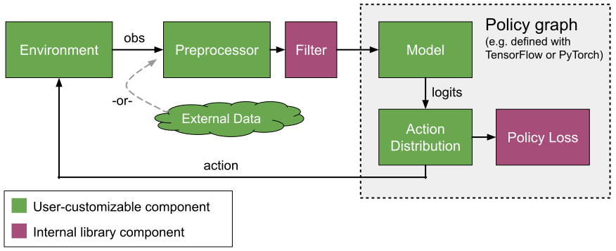

RLlib Models and Preprocessors
==============================

The following diagram provides a conceptual overview of data flow between different components in RLlib. We start with an ``Environment``, which given an action produces an observation. The observation is preprocessed by a ``Preprocessor`` and ``Filter`` (e.g. for running mean normalization) before being sent to a neural network ``Model``. The model output is in turn interpreted by an ``ActionDistribution`` to determine the next action.

The components highlighted in green can be replaced with custom user-defined implementations, as described in the next sections. The purple components are RLlib internal, which means they can only be modified by changing the algorithm source code.

Default Behaviours
------------------

Built-in Models and Preprocessors
~~~~~~~~~~~~~~~~~~~~~~~~~~~~~~~~~

RLlib picks default models based on a simple heuristic: a `vision network <https://github.com/ray-project/ray/blob/master/python/ray/rllib/models/tf/visionnet_v1.py>`__ for image observations, and a `fully connected network <https://github.com/ray-project/ray/blob/master/python/ray/rllib/models/tf/fcnet_v1.py>`__ for everything else. These models can be configured via the ``model`` config key, documented in the model `catalog <https://github.com/ray-project/ray/blob/master/python/ray/rllib/models/catalog.py>`__. Note that you'll probably have to configure ``conv_filters`` if your environment observations have custom sizes, e.g., ``"model": {"dim": 42, "conv_filters": [[16, [4, 4], 2], [32, [4, 4], 2], [512, [11, 11], 1]]}`` for 42x42 observations.

In addition, if you set ``"model": {"use_lstm": true}``, then the model output will be further processed by a `LSTM cell <https://github.com/ray-project/ray/blob/master/python/ray/rllib/models/tf/lstm.py>`__. More generally, RLlib supports the use of recurrent models for its policy gradient algorithms (A3C, PPO, PG, IMPALA), and RNN support is built into its policy evaluation utilities.

For preprocessors, RLlib tries to pick one of its built-in preprocessor based on the environment's observation space. Discrete observations are one-hot encoded, Atari observations downscaled, and Tuple and Dict observations flattened (these are unflattened and accessible via the ``input_dict`` parameter in custom models). Note that for Atari, RLlib defaults to using the `DeepMind preprocessors <https://github.com/ray-project/ray/blob/master/python/ray/rllib/env/atari_wrappers.py>`__, which are also used by the OpenAI baselines library.

Built-in Model Parameters
~~~~~~~~~~~~~~~~~~~~~~~~~

The following is a list of the built-in model hyperparameters:

.. literalinclude:: ../../python/ray/rllib/models/catalog.py
   :language: python
   :start-after: __sphinx_doc_begin__
   :end-before: __sphinx_doc_end__

TensorFlow Models
-----------------

.. note::

    TFModelV2 replaces the previous ``rllib.models.Model`` class, which did not support Keras-style reuse of variables. The ``rllib.models.Model`` class is deprecated and should not be used.

Custom TF models should subclass `TFModelV2 <https://github.com/ray-project/ray/blob/master/python/ray/rllib/models/tf/tf_modelv2.py>`__ to implement the ``__init__()`` and ``forward()`` methods. Forward takes in a dict of tensor inputs (the observation ``obs``, ``prev_action``, and ``prev_reward``, ``is_training``), optional RNN state, and returns the model output of size ``num_outputs`` and the new state. You can also override extra methods of the model such as ``value_function`` to implement a custom value branch. Additional supervised / self-supervised losses can be added via the ``custom_loss`` method:

.. autoclass:: ray.rllib.models.tf.tf_modelv2.TFModelV2

    .. automethod:: __init__
    .. automethod:: forward
    .. automethod:: value_function
    .. automethod:: custom_loss
    .. automethod:: metrics
    .. automethod:: update_ops
    .. automethod:: register_variables
    .. automethod:: variables
    .. automethod:: trainable_variables

Once implemented, the model can then be registered and used in place of a built-in model:

.. code-block:: python

    import ray
    import ray.rllib.agents.ppo as ppo
    from ray.rllib.models import ModelCatalog
    from ray.rllib.models.tf.tf_modelv2 import TFModelV2

    class MyModelClass(TFModelV2):
        def __init__(self, obs_space, action_space, num_outputs, model_config, name): ...
        def forward(self, input_dict, state, seq_lens): ...
        def value_function(self): ...

    ModelCatalog.register_custom_model("my_model", MyModelClass)

    ray.init()
    trainer = ppo.PPOTrainer(env="CartPole-v0", config={
        "model": {
            "custom_model": "my_model",
            "custom_options": {},  # extra options to pass to your model
        },
    })

For a full example of a custom model in code, see the `keras model example <https://github.com/ray-project/ray/blob/master/python/ray/rllib/examples/custom_keras_model.py>`__. You can also reference the `unit tests <https://github.com/ray-project/ray/blob/master/python/ray/rllib/tests/test_nested_spaces.py>`__ for Tuple and Dict spaces, which show how to access nested observation fields.

Recurrent Models
~~~~~~~~~~~~~~~~

Instead of using the ``use_lstm: True`` option, it can be preferable use a custom recurrent model. This provides more control over postprocessing of the LSTM output and can also allow the use of multiple LSTM cells to process different portions of the input. For a RNN model it is preferred to subclass ``RecurrentTFModelV2`` to implement ``__init__()``, ``get_initial_state()``, and ``forward_rnn()``. You can check out the `custom_keras_rnn_model.py <https://github.com/ray-project/ray/blob/master/python/ray/rllib/examples/custom_keras_rnn_model.py>`__ model as an example to implement your own model:

.. autoclass:: ray.rllib.models.tf.recurrent_tf_modelv2.RecurrentTFModelV2

    .. automethod:: __init__
    .. automethod:: forward_rnn
    .. automethod:: get_initial_state

Batch Normalization
~~~~~~~~~~~~~~~~~~~

You can use ``tf.layers.batch_normalization(x, training=input_dict["is_training"])`` to add batch norm layers to your custom model: `code example <https://github.com/ray-project/ray/blob/master/python/ray/rllib/examples/batch_norm_model.py>`__. RLlib will automatically run the update ops for the batch norm layers during optimization (see `tf_policy.py <https://github.com/ray-project/ray/blob/master/python/ray/rllib/policy/tf_policy.py>`__ and `multi_gpu_impl.py <https://github.com/ray-project/ray/blob/master/python/ray/rllib/optimizers/multi_gpu_impl.py>`__ for the exact handling of these updates).

In case RLlib does not properly detect the update ops for your custom model, you can override the ``update_ops()`` method to return the list of ops to run for updates.

PyTorch Models
--------------

Similarly, you can create and register custom PyTorch models for use with PyTorch-based algorithms (e.g., A2C, PG, QMIX). See these examples of `fully connected <https://github.com/ray-project/ray/blob/master/python/ray/rllib/models/torch/fcnet.py>`__, `convolutional <https://github.com/ray-project/ray/blob/master/python/ray/rllib/models/torch/visionnet.py>`__, and `recurrent <https://github.com/ray-project/ray/blob/master/python/ray/rllib/agents/qmix/model.py>`__ torch models.

.. autoclass:: ray.rllib.models.torch.torch_modelv2.TorchModelV2

    .. automethod:: __init__
    .. automethod:: forward
    .. automethod:: value_function
    .. automethod:: custom_loss
    .. automethod:: metrics
    .. automethod:: get_initial_state

Once implemented, the model can then be registered and used in place of a built-in model:

.. code-block:: python

    import torch.nn as nn

    import ray
    from ray.rllib.agents import a3c
    from ray.rllib.models import ModelCatalog
    from ray.rllib.models.torch.torch_modelv2 import TorchModelV2

    class CustomTorchModel(nn.Module, TorchModelV2):
        def __init__(self, obs_space, action_space, num_outputs, model_config, name): ...
        def forward(self, input_dict, state, seq_lens): ...
        def value_function(self): ...

    ModelCatalog.register_custom_model("my_model", CustomTorchModel)

    ray.init()
    trainer = a3c.A2CTrainer(env="CartPole-v0", config={
        "use_pytorch": True,
        "model": {
            "custom_model": "my_model",
            "custom_options": {},  # extra options to pass to your model
        },
    })

Custom Preprocessors
--------------------

Custom preprocessors should subclass the RLlib `preprocessor class <https://github.com/ray-project/ray/blob/master/python/ray/rllib/models/preprocessors.py>`__ and be registered in the model catalog. Note that you can alternatively use `gym wrapper classes <https://github.com/openai/gym/tree/master/gym/wrappers>`__ around your environment instead of preprocessors.

.. code-block:: python

    import ray
    import ray.rllib.agents.ppo as ppo
    from ray.rllib.models.preprocessors import Preprocessor

    class MyPreprocessorClass(Preprocessor):
        def _init_shape(self, obs_space, options):
            return new_shape  # can vary depending on inputs

        def transform(self, observation):
            return ...  # return the preprocessed observation

    ModelCatalog.register_custom_preprocessor("my_prep", MyPreprocessorClass)

    ray.init()
    trainer = ppo.PPOTrainer(env="CartPole-v0", config={
        "model": {
            "custom_preprocessor": "my_prep",
            "custom_options": {},  # extra options to pass to your preprocessor
        },
    })

Supervised Model Losses
-----------------------

You can mix supervised losses into any RLlib algorithm through custom models. For example, you can add an imitation learning loss on expert experiences, or a self-supervised autoencoder loss within the model. These losses can be defined over either policy evaluation inputs, or data read from `offline storage <rllib-offline.html#input-pipeline-for-supervised-losses>`__.

**TensorFlow**: To add a supervised loss to a custom TF model, you need to override the ``custom_loss()`` method. This method takes in the existing policy loss for the algorithm, which you can add your own supervised loss to before returning. For debugging, you can also return a dictionary of scalar tensors in the ``metrics()`` method. Here is a `runnable example <https://github.com/ray-project/ray/blob/master/python/ray/rllib/examples/custom_loss.py>`__ of adding an imitation loss to CartPole training that is defined over a `offline dataset <rllib-offline.html#input-pipeline-for-supervised-losses>`__.

**PyTorch**: There is no explicit API for adding losses to custom torch models. However, you can modify the loss in the policy definition directly. Like for TF models, offline datasets can be incorporated by creating an input reader and calling ``reader.next()`` in the loss forward pass.

Variable-length / Parametric Action Spaces
------------------------------------------

Custom models can be used to work with environments where (1) the set of valid actions `varies per step <https://neuro.cs.ut.ee/the-use-of-embeddings-in-openai-five>`__, and/or (2) the number of valid actions is `very large <https://arxiv.org/abs/1811.00260>`__. The general idea is that the meaning of actions can be completely conditioned on the observation, i.e., the ``a`` in ``Q(s, a)`` becomes just a token in ``[0, MAX_AVAIL_ACTIONS)`` that only has meaning in the context of ``s``. This works with algorithms in the `DQN and policy-gradient families <rllib-env.html>`__ and can be implemented as follows:

1. The environment should return a mask and/or list of valid action embeddings as part of the observation for each step. To enable batching, the number of actions can be allowed to vary from 1 to some max number:

.. code-block:: python

   class MyParamActionEnv(gym.Env):
       def __init__(self, max_avail_actions):
           self.action_space = Discrete(max_avail_actions)
           self.observation_space = Dict({
               "action_mask": Box(0, 1, shape=(max_avail_actions, )),
               "avail_actions": Box(-1, 1, shape=(max_avail_actions, action_embedding_sz)),
               "real_obs": ...,
           })

2. A custom model can be defined that can interpret the ``action_mask`` and ``avail_actions`` portions of the observation. Here the model computes the action logits via the dot product of some network output and each action embedding. Invalid actions can be masked out of the softmax by scaling the probability to zero:

.. code-block:: python

    class ParametricActionsModel(TFModelV2):
        def __init__(self,
                     obs_space,
                     action_space,
                     num_outputs,
                     model_config,
                     name,
                     true_obs_shape=(4,),
                     action_embed_size=2):
            super(ParametricActionsModel, self).__init__(
                obs_space, action_space, num_outputs, model_config, name)
            self.action_embed_model = FullyConnectedNetwork(...)

        def forward(self, input_dict, state, seq_lens):
            # Extract the available actions tensor from the observation.
            avail_actions = input_dict["obs"]["avail_actions"]
            action_mask = input_dict["obs"]["action_mask"]

            # Compute the predicted action embedding
            action_embed, _ = self.action_embed_model({
                "obs": input_dict["obs"]["cart"]
            })

            # Expand the model output to [BATCH, 1, EMBED_SIZE]. Note that the
            # avail actions tensor is of shape [BATCH, MAX_ACTIONS, EMBED_SIZE].
            intent_vector = tf.expand_dims(action_embed, 1)

            # Batch dot product => shape of logits is [BATCH, MAX_ACTIONS].
            action_logits = tf.reduce_sum(avail_actions * intent_vector, axis=2)

            # Mask out invalid actions (use tf.float32.min for stability)
            inf_mask = tf.maximum(tf.log(action_mask), tf.float32.min)
            return action_logits + inf_mask, state

Depending on your use case it may make sense to use just the masking, just action embeddings, or both. For a runnable example of this in code, check out `parametric_action_cartpole.py <https://github.com/ray-project/ray/blob/master/python/ray/rllib/examples/parametric_action_cartpole.py>`__. Note that since masking introduces ``tf.float32.min`` values into the model output, this technique might not work with all algorithm options. For example, algorithms might crash if they incorrectly process the ``tf.float32.min`` values. The cartpole example has working configurations for DQN (must set ``hiddens=[]``), PPO (must disable running mean and set ``vf_share_layers=True``), and several other algorithms.

Model-Based Rollouts
~~~~~~~~~~~~~~~~~~~~

With a custom policy, you can also perform model-based rollouts and optionally incorporate the results of those rollouts as training data. For example, suppose you wanted to extend PGPolicy for model-based rollouts. This involves overriding the ``compute_actions`` method of that policy:

.. code-block:: python

        class ModelBasedPolicy(PGPolicy):
             def compute_actions(self,
                                 obs_batch,
                                 state_batches,
                                 prev_action_batch=None,
                                 prev_reward_batch=None,
                                 episodes=None):
                # compute a batch of actions based on the current obs_batch
                # and state of each episode (i.e., for multiagent). You can do
                # whatever is needed here, e.g., MCTS rollouts.
                return action_batch

If you want take this rollouts data and append it to the sample batch, use the ``add_extra_batch()`` method of the `episode objects <https://github.com/ray-project/ray/blob/master/python/ray/rllib/evaluation/episode.py>`__ passed in. For an example of this, see the ``testReturningModelBasedRolloutsData`` `unit test <https://github.com/ray-project/ray/blob/master/python/ray/rllib/tests/test_multi_agent_env.py>`__.
