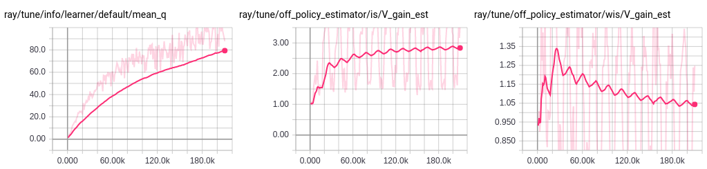

RLlib Offline Data Input / Output
=================================

.. note::

    RLlib I/O is currently *experimental*. Please report any `issues <https://github.com/ray-project/ray/issues>`__ you encounter.

Working with Offline Experiences
--------------------------------

RLlib's I/O APIs enable you to work with datasets of experiences read from offline storage (e.g., disk, cloud storage, streaming systems, HDFS). For example, you might want to read experiences saved from previous training runs, or gathered from policies deployed in `web applications <https://arxiv.org/abs/1811.00260>`__. You can also log new agent experiences produced during training for future use.

RLlib represents trajectory sequences (i.e., ``(s, a, r, s')`` tuples) with `SampleBatch <https://github.com/ray-project/ray/blob/master/python/ray/rllib/evaluation/sample_batch.py>`__ objects. Using a batch format enables efficient encoding and compression of experiences during training. During online training, RLlib uses `policy evaluation <rllib-concepts.html#policy-evaluation>`__ actors to generate batches of experiences in parallel using the current policy. RLlib also uses this same batch format for reading and writing experiences to offline storage.

Example: Training on previously saved experiences
~~~~~~~~~~~~~~~~~~~~~~~~~~~~~~~~~~~~~~~~~~~~~~~~~
In this example, we will save batches of experiences to disk, and then leverage those batches to train a policy using DQN. First, we run a simple policy gradient algorithm for 100k steps with ``"output": "/tmp/cartpole-out"`` to tell RLlib to write simulation outputs to the ``/tmp/cartpole-out`` directory.

.. code-block:: bash

    $ rllib train
        --run=PG \
        --env=CartPole-v0 \
        --config='{"output": "/tmp/cartpole-out", "output_max_file_size": 5000000}' \
        --stop='{"timesteps_total": 100000}'

The experiences will be saved in compressed JSON batch format:

.. code-block:: text

    $ ls -l /tmp/cartpole-out
    total 11636
    -rw-rw-r-- 1 eric eric 5022257 output-2019-01-01_15-58-57_worker-0_0.json
    -rw-rw-r-- 1 eric eric 5002416 output-2019-01-01_15-59-22_worker-0_1.json
    -rw-rw-r-- 1 eric eric 1881666 output-2019-01-01_15-59-47_worker-0_2.json

Then, we can tell DQN to train using these previously generated experiences with ``"input": "/tmp/cartpole-out"``. We disable exploration since it has no effect on the input:

.. code-block:: bash

    $ rllib train \
        --run=DQN \
        --env=CartPole-v0 \
        --config='{
            "input": "/tmp/cartpole-out",
            "exploration_final_eps": 0,
            "exploration_fraction": 0}'

Since the input experiences are not from running simulations, RLlib cannot report the true policy performance during training. However, you can use ``tensorboard --logdir=~/ray_results`` to monitor training progress via other metrics such as estimated Q-value:

In offline input mode, no simulations are run, though you still need to specify the environment in order to define the action and observation spaces. If true simulation is also possible (i.e., your env supports ``step()``), you can also set ``"input_evaluation": "simulation"`` to tell RLlib to run background simulations to estimate current policy performance. The output of these simulations will not be used for learning.

Example: Converting external experiences to batch format
~~~~~~~~~~~~~~~~~~~~~~~~~~~~~~~~~~~~~~~~~~~~~~~~~~~~~~~~

When the env does not support simulation, it is necessary to generate the ``*.json`` experience batch files outside of RLlib. This can be done by using the `JsonWriter <https://github.com/ray-project/ray/blob/master/python/ray/rllib/offline/json_writer.py>`__ class to write out batches.
This `runnable example <https://github.com/ray-project/ray/blob/master/python/ray/rllib/examples/saving_experiences.py>`__ shows how to generate and save experience batches for CartPole-v0 to ``/tmp/demo-out``:

.. literalinclude:: ../../python/ray/rllib/examples/saving_experiences.py
   :language: python
   :start-after: __sphinx_doc_begin__
   :end-before: __sphinx_doc_end__

On-policy algorithms and experience postprocessing
~~~~~~~~~~~~~~~~~~~~~~~~~~~~~~~~~~~~~~~~~~~~~~~~~~

RLlib assumes that input batches are of `postprocessed experiences <https://github.com/ray-project/ray/blob/b8a9e3f1064c6f8d754884fd9c75e0b2f88df4d6/python/ray/rllib/evaluation/policy_graph.py#L103>`__. This isn't typically critical for off-policy algorithms (e.g., DQN's `post-processing <https://github.com/ray-project/ray/blob/b8a9e3f1064c6f8d754884fd9c75e0b2f88df4d6/python/ray/rllib/agents/dqn/dqn_policy_graph.py#L514>`__ is only needed if ``n_step > 1`` or ``worker_side_prioritization: True``). For off-policy algorithms, you can also safely set the ``postprocess_inputs: True`` config.

However, for on-policy algorithms like PPO, you'll need to pass in the extra values added during policy evaluation and postprocessing to ``batch_builder.add_values()``, e.g., ``logits``, ``vf_preds``, ``value_target``, and ``advantages`` for PPO. This is needed since the calculation of these values depends on the weights of the *behaviour* policy, which RLlib does not have access to in the offline setting (in online training, these values are automatically added during policy evaluation).

For on-policy algorithms, you'll also have to throw away experiences generated by prior versions of the policy. This greatly reduces sample efficiency, which is typically undesirable when simulation is not possible, but can make sense for certain applications.

Mixing simulation and offline data
~~~~~~~~~~~~~~~~~~~~~~~~~~~~~~~~~~

RLlib supports multiplexing inputs from multiple data sources, including simulation. For example, in the following example we read 40% of our experiences from ``/tmp/cartpole-out``, 30% from ``hdfs:/archive/cartpole``, and the last 30% is produced via policy evaluation. Data sources are multiplexed using `np.random.choice <https://docs.scipy.org/doc/numpy-1.15.0/reference/generated/numpy.random.choice.html>`__:

.. code-block:: bash

    $ rllib train \
        --run=DQN \
        --env=CartPole-v0 \
        --config='{
            "input": {
                "/tmp/cartpole-out": 0.4,
                "hdfs:/archive/cartpole": 0.3,
                "sampler": 0.3,
            },
            "exploration_final_eps": 0,
            "exploration_fraction": 0}'

Scaling I/O throughput
~~~~~~~~~~~~~~~~~~~~~~

Similar to scaling online training, you can scale offline I/O throughput by increasing the number of RLlib workers via the ``num_workers`` config. Each worker accesses offline storage independently in parallel, for linear scaling of I/O throughput.

Input API
---------

You can configure experience input for an agent using the following agent config:

.. literalinclude:: ../../python/ray/rllib/agents/agent.py
   :language: python
   :start-after: __sphinx_doc_input_begin__
   :end-before: __sphinx_doc_input_end__

The interface for a custom input reader is as follows:

.. code-block:: python

    class InputReader(object):
        """Input object for loading experiences in policy evaluation."""

        def next(self):
            """Return the next batch of experiences read."""

            raise NotImplementedError

Output API
----------

You can configure experience output for an agent using the following agent config:

.. literalinclude:: ../../python/ray/rllib/agents/agent.py
   :language: python
   :start-after: __sphinx_doc_output_begin__
   :end-before: __sphinx_doc_output_end__

The interface for a custom output writer is as follows:

.. code-block:: python

    class OutputWriter(object):
        """Writer object for saving experiences from policy evaluation."""

        def write(self, sample_batch):
            """Save a batch of experiences.

            Arguments:
                sample_batch: SampleBatch or MultiAgentBatch to save.
            """
            raise NotImplementedError
