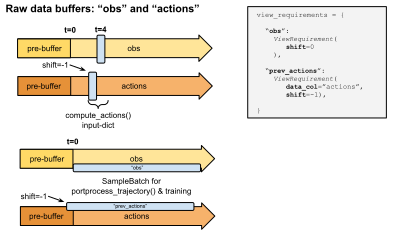

RLlib Sample Collection and Trajectory Views
============================================

The SampleCollector Class is Used to Store and Retrieve Temporary Data
----------------------------------------------------------------------

RLlib's `RolloutWorkers <https://github.com/ray-project/ray/blob/master/rllib/evaluation/rollout_worker.py>`__,
when running against a live environment, use the ``SamplerInput`` class to interact
with that environment and thereby produce batches of experiences.
The two implemented sub-classes of ``SamplerInput`` are ``SyncSampler`` and ``AsyncSampler``
(residing under the ``RolloutWorker.sampler`` property).

In case the "_use_trajectory_view_api" top-level config key is set to True
(by default since version >=1.2.0), every such sampler object will use the
``SampleCollector`` API to store and retrieve temporary environment-, model-, and other data
during rollouts (see figure below).

.. Edit figure below at: https://docs.google.com/drawings/d/1ZdNUU3ChwiUeT-DBRxvLAsbEPEqEFWSPZcOyVy3KxVg/edit
.. figure:: images/rllib-sample-collection.svg

    **Sample collection process implemented by RLlib:**
    The Policy's model tells the Sampler and its SampleCollector object, which data to store and
    how to present it back to the dependent methods (e.g. `Model.compute_actions()`).
    This is done using a dict that maps strings (column names) to `ViewRequirement` objects (details see below).

The exact behavior for a single such rollout and the number of environment transitions therein
are determined by the following Trainer config keys:

**batch_mode [truncate_episodes|complete_episodes]**:
    *truncated_episodes (default value)*:
     Rollouts are performed
     over exactly ``rollout_fragment_length`` (see below) number of steps. Thereby, steps are
     counted as either environment steps or as individual agent steps (see ``count_steps_as`` below).
     It does not matter, whether one or more episodes end within this rollout or whether
     the rollout starts in the middle of an already ongoing episode.
    *complete_episodes*:
     Each rollout is exactly one episode long and always starts
     at the beginning of an episode. It does not matter how long an episode lasts.
     The ``rollout_fragment_length`` setting will be ignored. Note that you have to be
     careful when chosing ``complete_episodes`` as batch_mode: If your environment does not
     terminate easily, this setting could lead to enormous batch sizes.

**rollout_fragment_length [int]**:
  The exact number of environment- or agent steps to
  be performed per rollout, if the ``batch_mode`` setting (see above) is "truncate_episodes".
  If ``batch_mode`` is "complete_episodes", ``rollout_fragment_length`` is ignored,
  The unit to count fragments in is set via ``multiagent.count_steps_by=[env_steps|agent_steps]``
  (within the ``multiagent`` config dict).

.. Edit figure below at: https://docs.google.com/drawings/d/1uRNGImBNq8gv3bBoFX_HernGyeovtCB3wKpZ71c0VE4/edit
.. figure:: images/rllib-batch-modes.svg

    **Above:** The two supported batch modes in RLlib. For "truncated_episodes",
    batches can a) span over more than one episode, b) end in the middle of an episode, and
    c) start in the middle of an episode. Also, `Policy.postprocess_trajectory()` is always
    called at the end of a rollout-fragment (red lines on right side) as well as at the end
    of each episode (arrow heads). This way, RLlib makes sure that the
    `Policy.postprocess_trajectory()` method never sees data from more than one episode.

**multiagent.count_steps_by [env_steps|agent_steps]**:
    Within the Trainer's ``multiagent`` config dict, you can set the unit, by which RLlib will count a) rollout fragment lengths as well as b) the size of the final train_batch (see below).
    *env_steps (default)*:
     Each call to ``[Env].step()`` is counted as one. It does not
     matter, how many individual agents are stepping simultaneously in this very call
     (not all existing agents in the environment may step at the same time).
    *agent_steps*:
     In a multi-agent environment, count each individual agent's step
     as one. For example, if N agents are in an environment and all these N agents
     always step at the same time, a single env step corresponds to N agent steps.

**horizon [int]**:
  Some environments are limited by default in the number of maximum timesteps
  an episode can last. This limit is called the "horizon" of an episode.
  For example, for CartPole-v0, the maximum number of steps per episode is 200 by default.
  You can overwrite this setting, however, by using the ``horizon`` config.
  If provided, RLlib will first try to increase the environment's built-in horizon
  setting (e.g. openAI gym Envs have a ``spec.max_episode_steps`` property), if the user
  provided horizon is larger than this env-specific setting. In either case, no episode
  is allowed to exceed the given ``horizon`` number of timesteps (RLlib will
  artificially terminate an episode if this limit is hit).

**soft_horizon [bool]**:
  False by default. If set to True, the environment will
  a) not be reset when reaching ``horizon`` and b) no ``done=True`` will be set
  in the trajectory data sent to the postprocessors and training (``done`` will remain
  False at the horizon).

**no_done_at_end [bool]**:
  Never set ``done=True``, at the end of an episode or when any
  artificial horizon is reached.

To trigger a single rollout, RLlib calls ``RolloutWorker.sample()``, which returns
a SampleBatch or MultiAgentBatch object representing all the data collected during that
rollout. These batches are then usually further concatenated (from the ``num_workers``
parallelized RolloutWorkers) to form a final train batch. The size of that train batch is determined
by the ``train_batch_size`` config parameter. Train batches are usually sent to the Policy's
``learn_on_batch`` method, which handles loss- and gradient calculations, and optimizer stepping.

RLlib's default collector is the ``SimpleListCollector``, which appends single timestep data (e.g. actions)
to lists, then builds SampleBatches from these and sends them to the downstream processing functions.
It thereby tries to avoid collecting duplicate data separately (OBS and NEXT_OBS use the same underlying list).
If you want to implement your own collection logic and data structures, you can sub-class ``SampleCollector``
and specify that new class under the Trainer's "sample_collector" config key.

Let's now look at how the Policy's Model lets the RolloutWorker and its SampleCollector
know, what data in the ongoing episode/trajectory to use for the different required method calls
during rollouts. These method calls in particular are:
``Policy.compute_actions_from_input_dict()`` to compute actions to be taken in an episode.
``Policy.postprocess_trajectory()``, which is called after an episode ends or a rollout hit its
``rollout_fragment_length`` limit (in ``batch_mode=truncated_episodes``), and ``Policy.learn_on_batch()``,
which is called with a "train_batch" to improve the policy.

Trajectory View API
-------------------

The trajectory view API allows custom models to define what parts of the trajectory they
require in order to execute the forward pass. For example, in the simplest case a model might
only look at the latest observation. However, an RNN- or attention based model could look
at previous states emitted by the model, or require an entire range of previous observations.
The trajectory view API lets models define these requirements and lets RLlib gather the required
data for the forward pass in an efficient way.

Since the following methods all call into the model class, they are all indirectly using the trajectory view API.
It is important to note that only the model class is aware of the trajectory view, the policy and loss etc. components of the policy do not need to be aware of the trajectory view.
In particular, the methods receiving inputs that depend on trajectory view rules are:

a) ``Policy.compute_actions_from_input_dict()``
b) ``Policy.postprocess_trajectory()`` and
c) ``Policy.learn_on_batch()`` (and consecutively: the Policy's loss function).

The input data to these methods can stem from either the environment (observations, rewards, and env infos),
the model itself (previously computed actions, internal state outputs, action-probs, etc..)
or the Sampler (e.g. agent index, env ID, episode ID, timestep, etc..).
All data has an associated time axis, which is 0-based (the first action taken or the first reward
received in an episode has t=0). #TODO: observations are different, the initial obs has t=-1, the first observation seen after action0 is obs0: We should probably change this as it breaks RL conventions.

The idea is to allow more flexibility and standardization in how a model defines required
"views" on the ongoing trajectory (during action computations/inference), past episodes (training
on a batch), or even trajectories of other agents in the same episode, some of which
may even use a different policy.  #TODO <- this is not done yet.

Such a "view requirements" formalism is helpful when having to support more complex model
setups like RNNs, attention nets, observation image framestacking (e.g. for Atari),
and building multi-agent communication channels.

The way to define a set of rules used for making Policies and Models see certain
data is through a "view requirements dict". Both Policy and Model hold such a dict
and the Model's view requirements dict is usually a subset of the Policy's one.
View requirements dicts map strings (column names), such as "obs" or "actions" to
a ``ViewRequirement`` object, which defines the exact conditions by which this column
should be populated with data.

View Requirement Dictionaries
~~~~~~~~~~~~~~~~~~~~~~~~~~~~~

View requirements for Models (``Model.forward()``) and Policies
(``Policy.compute_actions_from_input_dict()`` and `Policy.learn_on_batch`) are stored
within the ``view_requirements`` properties of the ``ModelV2`` and ``Policy`` base classes:

You can acccess these properties like this:

.. code-block:: python

    my_simple_model = ModelV2(...)
    print(my_simple_model.view_requirements)
    >>>{"obs": ViewRequirement(shift=0, space=[observation space])}

    my_lstm_model = LSTMModel(...)
    print(my_lstm_model.view_requirements)
    >>>{
    >>>    "obs": ViewRequirement(shift=0, space=[observation space]),
    >>>    "prev_actions": ViewRequirement(shift=-1, data_col="actions", space=[action space]),
    >>>    "prev_rewards": ViewRequirement(shift=-1, data_col="rewards"),
    >>>}

The ``view_requirements`` property holds a dictionary mapping
string keys (e.g. "actions", "rewards", "next_obs", etc..)
to a ViewRequirement object. This ViewRequirement object determines what exact data to
provide under the given key in case a SampleBatch or an input_dict needs to be build and fed into
one of the above ModelV2- or Policy methods.

.. Edit figure below at: https://docs.google.com/drawings/d/1YEPUtMrRXmWfvM0E6mD3VsOaRlLV7DtctF-yL96VHGg/edit

    **Above:** An example `ViewRequirements` dict that causes the current observation
    and the previous action to be available in each compute_action call, as
    well as for the Policy's `postprocess_trajectory()` function (and train batch).
    A similar setup is often used by LSTM/RNN-based models.

The ViewRequirement class
~~~~~~~~~~~~~~~~~~~~~~~~~

Here is a description of the constructor-settable properties of a ViewRequirement object and
what each of these properties controls.

**data_col**:
  An optional string key referencing the underlying data to use to
  create the view. If not provided, assumes that there is data under the
  dict-key under which this ViewRequirement resides.

  Examples:

  Policy.view_requirements = {"rewards": ViewRequirements(shift=0)} implies that the underlying data to use are the collected rewards from the environment.

  Policy.view_requirements = {"prev_rewards": ViewRequirements(data_col="rewards", shift=-1)}
  means that the actual data used to create the "prev_rewards" column is the "rewards" data
  from the environment (shifted by 1 timestep).

**space**:
  An optional gym.Space used as a hint for the SampleCollector to know,
  how to fill timesteps before the episode actually started (e.g. if
  shift=-2, we need dummy data at timesteps -2 and -1).

**shift [int]**:
  An int, a list of ints, or a range string (e.g. "-50:-1") to indicate
  which time offsets or ranges of the underlying data to use for the view.
  Examples:
  shift=0 -> Use the data under ``data_col`` as is.
  shift=1 -> Use the data under ``data_col``, but shifted by +1 timestep (used by e.g. next_obs views).
  shift=-1 -> Use the data under ``data_col``, but shifted by -1 timestep (used by e.g. prev_actions views).
  shift=[-2, -1] -> Use the data under ``data_col``, but always provide 2 values at each timestep (the two previous ones). Could be used e.g. to feed the last two actions or rewards into an LSTM.
  shift="-50:-1" -> Use the data under ``data_col``, but always provide a range of the last 50 timesteps.

**used_for_training [bool]**:
  True by default. If False, the column will not be available inside the train batch (arriving in the
  Policy's loss function).
  RLlib will automatically switch this to False for a given column, if it detects during
  Policy initialization that that column is not accessed inside the loss function (see below).

How does RLlib determine, which Views are required?
~~~~~~~~~~~~~~~~~~~~~~~~~~~~~~~~~~~~~~~~~~~~~~~~~~~

Normally, the ViewRequirement dicts for your Policy and Model are built automatically
by RLlib during the Policy initialization phase. Thereby, the Policy sends dummy batches
through its ``compute_actions_from_input_dict``, ``postprocess_trajectory``, and loss functions to
determine, which fields in that dummy batch get accessed, overwritten, deleted or even added.
Based on these observations, the Policy then throws out those ViewRequirements from an initial
very broad list, that it thinks are not needed. This procedure saves a lot of data copying
during later rollouts, batch transfers (via ray) and loss calculations and makes things like
manually deleting columns from a SampleBatch (e.g. PPO used to delete the "next_obs" column
inside the postprocessing function) unnecessary.
Note that the "rewards" and "dones" columns are never discarded and thus should always
arrive in your loss function's SampleBatch (``train_batch`` arg).

Setting ViewRequirements manually in your Model
~~~~~~~~~~~~~~~~~~~~~~~~~~~~~~~~~~~~~~~~~~~~~~~

If you need to specify special view requirements for your model, you can add
columns to the Model's ``view_requirements`` dict in the
Model's constructor. For example, our auto-LSTM wrapper class has these additional
lines in its constructor:

.. literalinclude:: ../../rllib/models/torch/recurrent_net.py
   :language: python
   :start-after: __sphinx_doc_begin__
   :end-before: __sphinx_doc_end__

This makes sure that, if the users requires this via the model config, previous rewards
and/or previous actions are added properly to the ``compute_actions`` input-dicts and SampleBatches
used for postprocessing and training.

Setting ViewRequirements manually after Policy construction
~~~~~~~~~~~~~~~~~~~~~~~~~~~~~~~~~~~~~~~~~~~~~~~~~~~~~~~~~~~

Here is a simple example, of how you can modify and add to the ViewRequirements dict
even after policy (or RolloutWorker) creation:

.. code-block:: python

        action_space = Discrete(2)
        rollout_worker = RolloutWorker(
            env_creator=lambda _: gym.make("CartPole-v0"),
            policy_config=ppo.DEFAULT_CONFIG,
            policy_spec=ppo.PPOTorchPolicy,
        )
        # Add the next action to the view reqs of the policy.
        # This should be visible then in postprocessing and train batches.
        rollout_worker.policy_map["default_policy"].view_requirements[
            "next_actions"] = ViewRequirement(
                SampleBatch.ACTIONS, shift=1, space=action_space)
        # Check, whether a sampled batch has the requested `next_actions` view.
        batch = rollout_worker.sample()
        self.assertTrue("next_actions" in batch.data)

The above adds a "next_action" view to those SampleBatches needed by the Policy
(postprocess_trajectory and loss function batches). It will not feed the "next_action"
to the Model's ``compute_action`` calls (it can't b/c the next action is of course not known
at that point).
