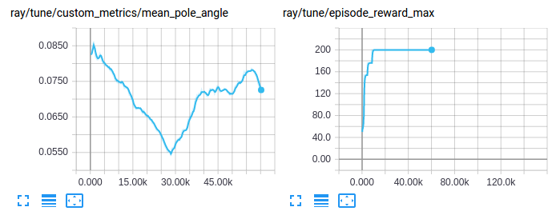

RLlib Training APIs
===================

Getting Started
---------------

At a high level, RLlib provides an ``Agent`` class which
holds a policy for environment interaction. Through the agent interface, the policy can
be trained, checkpointed, or an action computed.

.. image:: rllib-api.svg

You can train a simple DQN agent with the following command

.. code-block:: bash

    python ray/python/ray/rllib/train.py --run DQN --env CartPole-v0

By default, the results will be logged to a subdirectory of ``~/ray_results``.
This subdirectory will contain a file ``params.json`` which contains the
hyperparameters, a file ``result.json`` which contains a training summary
for each episode and a TensorBoard file that can be used to visualize
training process with TensorBoard by running

.. code-block:: bash

     tensorboard --logdir=~/ray_results

The ``train.py`` script has a number of options you can show by running

.. code-block:: bash

    python ray/python/ray/rllib/train.py --help

The most important options are for choosing the environment
with ``--env`` (any OpenAI gym environment including ones registered by the user
can be used) and for choosing the algorithm with ``--run``
(available options are ``PPO``, ``PG``, ``A2C``, ``A3C``, ``IMPALA``, ``ES``, ``DDPG``, ``DQN``, ``APEX``, and ``APEX_DDPG``).

Evaluating Trained Agents
~~~~~~~~~~~~~~~~~~~~~~~~~

In order to save checkpoints from which to evaluate agents,
set ``--checkpoint-freq`` (number of training iterations between checkpoints)
when running ``train.py``.

An example of evaluating a previously trained DQN agent is as follows:

.. code-block:: bash

    python ray/python/ray/rllib/rollout.py \
          ~/ray_results/default/DQN_CartPole-v0_0upjmdgr0/checkpoint-1 \
          --run DQN --env CartPole-v0 --steps 10000

The ``rollout.py`` helper script reconstructs a DQN agent from the checkpoint
located at ``~/ray_results/default/DQN_CartPole-v0_0upjmdgr0/checkpoint-1``
and renders its behavior in the environment specified by ``--env``.

Configuration
-------------

Specifying Parameters
~~~~~~~~~~~~~~~~~~~~~

Each algorithm has specific hyperparameters that can be set with ``--config``, in addition to a number of `common hyperparameters <https://github.com/ray-project/ray/blob/master/python/ray/rllib/agents/agent.py>`__. See the
`algorithms documentation <rllib-algorithms.html>`__ for more information.

In an example below, we train A2C by specifying 8 workers through the config flag.

.. code-block:: bash

    python ray/python/ray/rllib/train.py --env=PongDeterministic-v4 \
        --run=A2C --config '{"num_workers": 8}'

.. image:: rllib-config.svg

Specifying Resources
~~~~~~~~~~~~~~~~~~~~

You can control the degree of parallelism used by setting the ``num_workers`` hyperparameter for most agents. Many agents also provide a ``num_gpus`` or ``gpu`` option. In addition, you can allocate a fraction of a GPU by setting ``gpu_fraction: f``. For example, with DQN you can pack five agents onto one GPU by setting ``gpu_fraction: 0.2``. Note that in Ray < 0.6.0 fractional GPU support requires setting the environment variable ``RAY_USE_XRAY=1``.

Common Parameters
~~~~~~~~~~~~~~~~~

The following is a list of the common agent hyperparameters:

.. literalinclude:: ../../python/ray/rllib/agents/agent.py
   :language: python
   :start-after: __sphinx_doc_begin__
   :end-before: __sphinx_doc_end__

Tuned Examples
~~~~~~~~~~~~~~

Some good hyperparameters and settings are available in
`the repository <https://github.com/ray-project/ray/blob/master/python/ray/rllib/tuned_examples>`__
(some of them are tuned to run on GPUs). If you find better settings or tune
an algorithm on a different domain, consider submitting a Pull Request!

You can run these with the ``train.py`` script as follows:

.. code-block:: bash

    python ray/python/ray/rllib/train.py -f /path/to/tuned/example.yaml

Python API
----------

The Python API provides the needed flexibility for applying RLlib to new problems. You will need to use this API if you wish to use `custom environments, preprocessors, or models <rllib-models.html>`__ with RLlib.

Here is an example of the basic usage:

.. code-block:: python

    import ray
    import ray.rllib.agents.ppo as ppo
    from ray.tune.logger import pretty_print

    ray.init()
    config = ppo.DEFAULT_CONFIG.copy()
    config["num_gpus"] = 0
    config["num_workers"] = 1
    agent = ppo.PPOAgent(config=config, env="CartPole-v0")

    # Can optionally call agent.restore(path) to load a checkpoint.

    for i in range(1000):
       # Perform one iteration of training the policy with PPO
       result = agent.train()
       print(pretty_print(result))

       if i % 100 == 0:
           checkpoint = agent.save()
           print("checkpoint saved at", checkpoint)

.. note::

    It's recommended that you run RLlib agents with `Tune <tune.html>`__, for easy experiment management and visualization of results. Just set ``"run": AGENT_NAME, "env": ENV_NAME`` in the experiment config.

All RLlib agents are compatible with the `Tune API <tune-usage.html>`__. This enables them to be easily used in experiments with `Tune <tune.html>`__. For example, the following code performs a simple hyperparam sweep of PPO:

.. code-block:: python

    import ray
    import ray.tune as tune

    ray.init()
    tune.run_experiments({
        "my_experiment": {
            "run": "PPO",
            "env": "CartPole-v0",
            "stop": {"episode_reward_mean": 200},
            "config": {
                "num_gpus": 0,
                "num_workers": 1,
                "sgd_stepsize": tune.grid_search([0.01, 0.001, 0.0001]),
            },
        },
    })

Tune will schedule the trials to run in parallel on your Ray cluster:

::

    == Status ==
    Using FIFO scheduling algorithm.
    Resources requested: 4/4 CPUs, 0/0 GPUs
    Result logdir: ~/ray_results/my_experiment
    PENDING trials:
     - PPO_CartPole-v0_2_sgd_stepsize=0.0001:	PENDING
    RUNNING trials:
     - PPO_CartPole-v0_0_sgd_stepsize=0.01:	RUNNING [pid=21940], 16 s, 4013 ts, 22 rew
     - PPO_CartPole-v0_1_sgd_stepsize=0.001:	RUNNING [pid=21942], 27 s, 8111 ts, 54.7 rew

Accessing Policy State
~~~~~~~~~~~~~~~~~~~~~~
It is common to need to access an agent's internal state, e.g., to set or get internal weights. In RLlib an agent's state is replicated across multiple *policy evaluators* (Ray actors) in the cluster. However, you can easily get and update this state between calls to ``train()`` via ``agent.optimizer.foreach_evaluator()`` or ``agent.optimizer.foreach_evaluator_with_index()``. These functions take a lambda function that is applied with the evaluator as an arg. You can also return values from these functions and those will be returned as a list.

You can also access just the "master" copy of the agent state through ``agent.local_evaluator``, but note that updates here may not be immediately reflected in remote replicas if you have configured ``num_workers > 0``. For example, to access the weights of a local TF policy, you can run ``agent.local_evaluator.policy_map["default"].get_weights()``. This is also equivalent to ``agent.local_evaluator.for_policy(lambda p: p.get_weights())``:

.. code-block:: python

    # Get weights of the local policy
    agent.local_evaluator.policy_map["default"].get_weights()

    # Same as above
    agent.local_evaluator.for_policy(lambda p: p.get_weights())

    # Get list of weights of each evaluator, including remote replicas
    agent.optimizer.foreach_evaluator(
        lambda ev: ev.for_policy(lambda p: p.get_weights()))

    # Same as above
    agent.optimizer.foreach_evaluator_with_index(
        lambda ev, i: ev.for_policy(lambda p: p.get_weights()))

Global Coordination
~~~~~~~~~~~~~~~~~~~
Sometimes, it is necessary to coordinate between pieces of code that live in different processes managed by RLlib. For example, it can be useful to maintain a global average of a certain variable, or centrally control a hyperparameter used by policies. Ray provides a general way to achieve this through *named actors* (learn more about Ray actors `here <actors.html>`__). As an example, consider maintaining a shared global counter that is incremented by environments and read periodically from your driver program:

.. code-block:: python

    from ray.experimental import named_actors

    @ray.remote
    class Counter:
       def __init__(self):
          self.count = 0
       def inc(self, n):
          self.count += n
       def get(self):
          return self.count

    # on the driver
    counter = Counter.remote()
    named_actors.register_actor("global_counter", counter)
    print(ray.get(counter.get.remote()))  # get the latest count

    # in your envs
    counter = named_actors.get_actor("global_counter")
    counter.inc.remote(1)  # async call to increment the global count

Ray actors provide high levels of performance, so in more complex cases they can be used implement communication patterns such as parameter servers and allreduce.

Debugging
---------

Gym Monitor
~~~~~~~~~~~

The ``"monitor": true`` config can be used to save Gym episode videos to the result dir. For example:

.. code-block:: bash

    python ray/python/ray/rllib/train.py --env=PongDeterministic-v4 \
        --run=A2C --config '{"num_workers": 2, "monitor": true}'

    # videos will be saved in the ~/ray_results/<experiment> dir, for example
    openaigym.video.0.31401.video000000.meta.json
    openaigym.video.0.31401.video000000.mp4
    openaigym.video.0.31403.video000000.meta.json
    openaigym.video.0.31403.video000000.mp4

Log Verbosity
~~~~~~~~~~~~~

You can control the agent log level via the ``"log_level"`` flag. Valid values are "INFO" (default), "DEBUG", "WARN", and "ERROR". This can be used to increase or decrease the verbosity of internal logging. For example:

.. code-block:: bash

    python ray/python/ray/rllib/train.py --env=PongDeterministic-v4 \
        --run=A2C --config '{"num_workers": 2, "log_level": "DEBUG"}'

Callbacks and Custom Metrics
~~~~~~~~~~~~~~~~~~~~~~~~~~~~

You can provide callback functions to be called at points during policy evaluation. These functions have access to an info dict containing state for the current `episode <https://github.com/ray-project/ray/blob/master/python/ray/rllib/evaluation/episode.py>`__. Custom state can be stored for the `episode <https://github.com/ray-project/ray/blob/master/python/ray/rllib/evaluation/episode.py>`__ in the ``info["episode"].user_data`` dict, and custom scalar metrics reported by saving values to the ``info["episode"].custom_metrics`` dict. These custom metrics will be averaged and reported as part of training results. The following example (full code `here <https://github.com/ray-project/ray/blob/master/python/ray/rllib/examples/custom_metrics_and_callbacks.py>`__) logs a custom metric from the environment:

.. code-block:: python

    def on_episode_start(info):
        print(info.keys())  # -> "env", 'episode"
        episode = info["episode"]
        print("episode {} started".format(episode.episode_id))
        episode.user_data["pole_angles"] = []

    def on_episode_step(info):
        episode = info["episode"]
        pole_angle = abs(episode.last_observation_for()[2])
        episode.user_data["pole_angles"].append(pole_angle)

    def on_episode_end(info):
        episode = info["episode"]
        mean_pole_angle = np.mean(episode.user_data["pole_angles"])
        print("episode {} ended with length {} and pole angles {}".format(
            episode.episode_id, episode.length, mean_pole_angle))
        episode.custom_metrics["mean_pole_angle"] = mean_pole_angle

    ray.init()
    trials = tune.run_experiments({
        "test": {
            "env": "CartPole-v0",
            "run": "PG",
            "config": {
                "callbacks": {
                    "on_episode_start": tune.function(on_episode_start),
                    "on_episode_step": tune.function(on_episode_step),
                    "on_episode_end": tune.function(on_episode_end),
                },
            },
        }
    })

Custom metrics can be accessed and visualized like any other training result:

REST API
--------

In some cases (i.e., when interacting with an external environment) it makes more sense to interact with RLlib as if were an independently running service, rather than RLlib hosting the simulations itself. This is possible via RLlib's serving env `interface <rllib-env.html#agent-driven>`__.

.. autoclass:: ray.rllib.utils.policy_client.PolicyClient
    :members:

.. autoclass:: ray.rllib.utils.policy_server.PolicyServer
    :members:

For a full client / server example that you can run, see the example `client script <https://github.com/ray-project/ray/blob/master/python/ray/rllib/examples/serving/cartpole_client.py>`__ and also the corresponding `server script <https://github.com/ray-project/ray/blob/master/python/ray/rllib/examples/serving/cartpole_server.py>`__, here configured to serve a policy for the toy CartPole-v0 environment.
