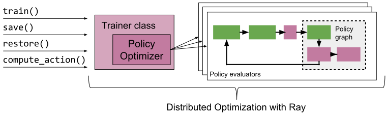
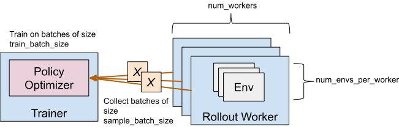

RLlib Training APIs
===================

Getting Started
---------------

At a high level, RLlib provides an ``Trainer`` class which
holds a policy for environment interaction. Through the trainer interface, the policy can
be trained, checkpointed, or an action computed. In multi-agent training, the trainer manages the querying and optimization of multiple policies at once.

You can train a simple DQN trainer with the following command:

.. code-block:: bash

    rllib train --run DQN --env CartPole-v0  # add --eager for eager execution

By default, the results will be logged to a subdirectory of ``~/ray_results``.
This subdirectory will contain a file ``params.json`` which contains the
hyperparameters, a file ``result.json`` which contains a training summary
for each episode and a TensorBoard file that can be used to visualize
training process with TensorBoard by running

.. code-block:: bash

     tensorboard --logdir=~/ray_results

The ``rllib train`` command (same as the ``train.py`` script in the repo) has a number of options you can show by running:

.. code-block:: bash

    rllib train --help
    -or-
    python ray/rllib/train.py --help

The most important options are for choosing the environment
with ``--env`` (any OpenAI gym environment including ones registered by the user
can be used) and for choosing the algorithm with ``--run``
(available options are ``SAC``, ``PPO``, ``PG``, ``A2C``, ``A3C``, ``IMPALA``, ``ES``, ``DDPG``, ``DQN``, ``MARWIL``, ``APEX``, and ``APEX_DDPG``).

Evaluating Trained Policies
~~~~~~~~~~~~~~~~~~~~~~~~~~~

In order to save checkpoints from which to evaluate policies,
set ``--checkpoint-freq`` (number of training iterations between checkpoints)
when running ``rllib train``.

An example of evaluating a previously trained DQN policy is as follows:

.. code-block:: bash

    rllib rollout \
        ~/ray_results/default/DQN_CartPole-v0_0upjmdgr0/checkpoint_1/checkpoint-1 \
        --run DQN --env CartPole-v0 --steps 10000

The ``rollout.py`` helper script reconstructs a DQN policy from the checkpoint
located at ``~/ray_results/default/DQN_CartPole-v0_0upjmdgr0/checkpoint_1/checkpoint-1``
and renders its behavior in the environment specified by ``--env``.

Configuration
-------------

Specifying Parameters
~~~~~~~~~~~~~~~~~~~~~

Each algorithm has specific hyperparameters that can be set with ``--config``, in addition to a number of `common hyperparameters <https://github.com/ray-project/ray/blob/master/rllib/agents/trainer.py>`__. See the
`algorithms documentation <rllib-algorithms.html>`__ for more information.

In an example below, we train A2C by specifying 8 workers through the config flag.

.. code-block:: bash

    rllib train --env=PongDeterministic-v4 --run=A2C --config '{"num_workers": 8}'

Specifying Resources
~~~~~~~~~~~~~~~~~~~~

You can control the degree of parallelism used by setting the ``num_workers`` hyperparameter for most algorithms. The number of GPUs the driver should use can be set via the ``num_gpus`` option. Similarly, the resource allocation to workers can be controlled via ``num_cpus_per_worker``, ``num_gpus_per_worker``, and ``custom_resources_per_worker``. The number of GPUs can be a fractional quantity to allocate only a fraction of a GPU. For example, with DQN you can pack five trainers onto one GPU by setting ``num_gpus: 0.2``.

Common Parameters
~~~~~~~~~~~~~~~~~

The following is a list of the common algorithm hyperparameters:

.. literalinclude:: ../../rllib/agents/trainer.py
   :language: python
   :start-after: __sphinx_doc_begin__
   :end-before: __sphinx_doc_end__

Tuned Examples
~~~~~~~~~~~~~~

Some good hyperparameters and settings are available in
`the repository <https://github.com/ray-project/ray/blob/master/rllib/tuned_examples>`__
(some of them are tuned to run on GPUs). If you find better settings or tune
an algorithm on a different domain, consider submitting a Pull Request!

You can run these with the ``rllib train`` command as follows:

.. code-block:: bash

    rllib train -f /path/to/tuned/example.yaml

Python API
----------

The Python API provides the needed flexibility for applying RLlib to new problems. You will need to use this API if you wish to use `custom environments, preprocessors, or models <rllib-models.html>`__ with RLlib.

Here is an example of the basic usage (for a more complete example, see `custom_env.py <https://github.com/ray-project/ray/blob/master/rllib/examples/custom_env.py>`__):

.. code-block:: python

    import ray
    import ray.rllib.agents.ppo as ppo
    from ray.tune.logger import pretty_print

    ray.init()
    config = ppo.DEFAULT_CONFIG.copy()
    config["num_gpus"] = 0
    config["num_workers"] = 1
    config["eager"] = False
    trainer = ppo.PPOTrainer(config=config, env="CartPole-v0")

    # Can optionally call trainer.restore(path) to load a checkpoint.

    for i in range(1000):
       # Perform one iteration of training the policy with PPO
       result = trainer.train()
       print(pretty_print(result))

       if i % 100 == 0:
           checkpoint = trainer.save()
           print("checkpoint saved at", checkpoint)

.. note::

    It's recommended that you run RLlib trainers with `Tune <tune.html>`__, for easy experiment management and visualization of results. Just set ``"run": ALG_NAME, "env": ENV_NAME`` in the experiment config.

All RLlib trainers are compatible with the `Tune API <tune-usage.html>`__. This enables them to be easily used in experiments with `Tune <tune.html>`__. For example, the following code performs a simple hyperparam sweep of PPO:

.. code-block:: python

    import ray
    from ray import tune

    ray.init()
    tune.run(
        "PPO",
        stop={"episode_reward_mean": 200},
        config={
            "env": "CartPole-v0",
            "num_gpus": 0,
            "num_workers": 1,
            "lr": tune.grid_search([0.01, 0.001, 0.0001]),
            "eager": False,
        },
    )

Tune will schedule the trials to run in parallel on your Ray cluster:

::

    == Status ==
    Using FIFO scheduling algorithm.
    Resources requested: 4/4 CPUs, 0/0 GPUs
    Result logdir: ~/ray_results/my_experiment
    PENDING trials:
     - PPO_CartPole-v0_2_lr=0.0001:	PENDING
    RUNNING trials:
     - PPO_CartPole-v0_0_lr=0.01:	RUNNING [pid=21940], 16 s, 4013 ts, 22 rew
     - PPO_CartPole-v0_1_lr=0.001:	RUNNING [pid=21942], 27 s, 8111 ts, 54.7 rew

Custom Training Workflows
~~~~~~~~~~~~~~~~~~~~~~~~~

In the `basic training example <https://github.com/ray-project/ray/blob/master/rllib/examples/custom_env.py>`__, Tune will call ``train()`` on your trainer once per iteration and report the new training results. Sometimes, it is desirable to have full control over training, but still run inside Tune. Tune supports `custom trainable functions <tune-usage.html#training-api>`__ that can be used to implement `custom training workflows (example) <https://github.com/ray-project/ray/blob/master/rllib/examples/custom_train_fn.py>`__.

For even finer-grained control over training, you can use RLlib's lower-level `building blocks <rllib-concepts.html>`__ directly to implement `fully customized training workflows <https://github.com/ray-project/ray/blob/master/rllib/examples/rollout_worker_custom_workflow.py>`__.

Accessing Policy State
~~~~~~~~~~~~~~~~~~~~~~
It is common to need to access a trainer's internal state, e.g., to set or get internal weights. In RLlib trainer state is replicated across multiple *rollout workers* (Ray actors) in the cluster. However, you can easily get and update this state between calls to ``train()`` via ``trainer.workers.foreach_worker()`` or ``trainer.workers.foreach_worker_with_index()``. These functions take a lambda function that is applied with the worker as an arg. You can also return values from these functions and those will be returned as a list.

You can also access just the "master" copy of the trainer state through ``trainer.get_policy()`` or ``trainer.workers.local_worker()``, but note that updates here may not be immediately reflected in remote replicas if you have configured ``num_workers > 0``. For example, to access the weights of a local TF policy, you can run ``trainer.get_policy().get_weights()``. This is also equivalent to ``trainer.workers.local_worker().policy_map["default_policy"].get_weights()``:

.. code-block:: python

    # Get weights of the default local policy
    trainer.get_policy().get_weights()

    # Same as above
    trainer.workers.local_worker().policy_map["default_policy"].get_weights()

    # Get list of weights of each worker, including remote replicas
    trainer.workers.foreach_worker(lambda ev: ev.get_policy().get_weights())

    # Same as above
    trainer.workers.foreach_worker_with_index(lambda ev, i: ev.get_policy().get_weights())

Global Coordination
~~~~~~~~~~~~~~~~~~~
Sometimes, it is necessary to coordinate between pieces of code that live in different processes managed by RLlib. For example, it can be useful to maintain a global average of a certain variable, or centrally control a hyperparameter used by policies. Ray provides a general way to achieve this through *named actors* (learn more about Ray actors `here <actors.html>`__). As an example, consider maintaining a shared global counter that is incremented by environments and read periodically from your driver program:

.. code-block:: python

    from ray.experimental import named_actors

    @ray.remote
    class Counter:
       def __init__(self):
          self.count = 0
       def inc(self, n):
          self.count += n
       def get(self):
          return self.count

    # on the driver
    counter = Counter.remote()
    named_actors.register_actor("global_counter", counter)
    print(ray.get(counter.get.remote()))  # get the latest count

    # in your envs
    counter = named_actors.get_actor("global_counter")
    counter.inc.remote(1)  # async call to increment the global count

Ray actors provide high levels of performance, so in more complex cases they can be used implement communication patterns such as parameter servers and allreduce.

Callbacks and Custom Metrics
~~~~~~~~~~~~~~~~~~~~~~~~~~~~

You can provide callback functions to be called at points during policy evaluation. These functions have access to an info dict containing state for the current `episode <https://github.com/ray-project/ray/blob/master/rllib/evaluation/episode.py>`__. Custom state can be stored for the `episode <https://github.com/ray-project/ray/blob/master/rllib/evaluation/episode.py>`__ in the ``info["episode"].user_data`` dict, and custom scalar metrics reported by saving values to the ``info["episode"].custom_metrics`` dict. These custom metrics will be aggregated and reported as part of training results. The following example (full code `here <https://github.com/ray-project/ray/blob/master/rllib/examples/custom_metrics_and_callbacks.py>`__) logs a custom metric from the environment:

.. code-block:: python

    def on_episode_start(info):
        print(info.keys())  # -> "env", 'episode"
        episode = info["episode"]
        print("episode {} started".format(episode.episode_id))
        episode.user_data["pole_angles"] = []

    def on_episode_step(info):
        episode = info["episode"]
        pole_angle = abs(episode.last_observation_for()[2])
        episode.user_data["pole_angles"].append(pole_angle)

    def on_episode_end(info):
        episode = info["episode"]
        pole_angle = np.mean(episode.user_data["pole_angles"])
        print("episode {} ended with length {} and pole angles {}".format(
            episode.episode_id, episode.length, pole_angle))
        episode.custom_metrics["pole_angle"] = pole_angle

    def on_train_result(info):
        print("trainer.train() result: {} -> {} episodes".format(
            info["trainer"].__name__, info["result"]["episodes_this_iter"]))

    def on_postprocess_traj(info):
        episode = info["episode"]
        batch = info["post_batch"]  # note: you can mutate this
        print("postprocessed {} steps".format(batch.count))

    ray.init()
    analysis = tune.run(
        "PG",
        config={
            "env": "CartPole-v0",
            "callbacks": {
                "on_episode_start": tune.function(on_episode_start),
                "on_episode_step": tune.function(on_episode_step),
                "on_episode_end": tune.function(on_episode_end),
                "on_train_result": tune.function(on_train_result),
                "on_postprocess_traj": tune.function(on_postprocess_traj),
            },
        },
    )

Visualizing Custom Metrics
~~~~~~~~~~~~~~~~~~~~~~~~~~

Custom metrics can be accessed and visualized like any other training result:

.. image:: custom_metric.png

Rewriting Trajectories
~~~~~~~~~~~~~~~~~~~~~~

Note that in the ``on_postprocess_batch`` callback you have full access to the trajectory batch (``post_batch``) and other training state. This can be used to rewrite the trajectory, which has a number of uses including:
 * Backdating rewards to previous time steps (e.g., based on values in ``info``).
 * Adding model-based curiosity bonuses to rewards (you can train the model with a `custom model supervised loss <rllib-models.html#supervised-model-losses>`__).

Example: Curriculum Learning
~~~~~~~~~~~~~~~~~~~~~~~~~~~~

Let's look at two ways to use the above APIs to implement `curriculum learning <https://bair.berkeley.edu/blog/2017/12/20/reverse-curriculum/>`__. In curriculum learning, the agent task is adjusted over time to improve the learning process. Suppose that we have an environment class with a ``set_phase()`` method that we can call to adjust the task difficulty over time:

Approach 1: Use the Trainer API and update the environment between calls to ``train()``. This example shows the trainer being run inside a Tune function:

.. code-block:: python

    import ray
    from ray import tune
    from ray.rllib.agents.ppo import PPOTrainer

    def train(config, reporter):
        trainer = PPOTrainer(config=config, env=YourEnv)
        while True:
            result = trainer.train()
            reporter(**result)
            if result["episode_reward_mean"] > 200:
                phase = 2
            elif result["episode_reward_mean"] > 100:
                phase = 1
            else:
                phase = 0
            trainer.workers.foreach_worker(
                lambda ev: ev.foreach_env(
                    lambda env: env.set_phase(phase)))

    ray.init()
    tune.run(
        train,
        config={
            "num_gpus": 0,
            "num_workers": 2,
        },
        resources_per_trial={
            "cpu": 1,
            "gpu": lambda spec: spec.config.num_gpus,
            "extra_cpu": lambda spec: spec.config.num_workers,
        },
    )

Approach 2: Use the callbacks API to update the environment on new training results:

.. code-block:: python

    import ray
    from ray import tune

    def on_train_result(info):
        result = info["result"]
        if result["episode_reward_mean"] > 200:
            phase = 2
        elif result["episode_reward_mean"] > 100:
            phase = 1
        else:
            phase = 0
        trainer = info["trainer"]
        trainer.workers.foreach_worker(
            lambda ev: ev.foreach_env(
                lambda env: env.set_phase(phase)))

    ray.init()
    tune.run(
        "PPO",
        config={
            "env": YourEnv,
            "callbacks": {
                "on_train_result": tune.function(on_train_result),
            },
        },
    )

Debugging
---------

Gym Monitor
~~~~~~~~~~~

The ``"monitor": true`` config can be used to save Gym episode videos to the result dir. For example:

.. code-block:: bash

    rllib train --env=PongDeterministic-v4 \
        --run=A2C --config '{"num_workers": 2, "monitor": true}'

    # videos will be saved in the ~/ray_results/<experiment> dir, for example
    openaigym.video.0.31401.video000000.meta.json
    openaigym.video.0.31401.video000000.mp4
    openaigym.video.0.31403.video000000.meta.json
    openaigym.video.0.31403.video000000.mp4

TensorFlow Eager
~~~~~~~~~~~~~~~~

Policies built with ``build_tf_policy`` can be also run in eager mode by setting the ``"eager": True`` config option or using ``rllib train --eager``. This will tell RLlib to execute the model forward pass, action distribution, loss, and stats functions in eager mode.

Eager mode makes debugging much easier, since you can now use normal Python functions such as ``print()`` to inspect intermediate tensor values. However, it is slower than graph mode.

Episode Traces
~~~~~~~~~~~~~~

You can use the `data output API <rllib-offline.html>`__ to save episode traces for debugging. For example, the following command will run PPO while saving episode traces to ``/tmp/debug``.

.. code-block:: bash

    rllib train --run=PPO --env=CartPole-v0 \
        --config='{"output": "/tmp/debug", "output_compress_columns": []}'

    # episode traces will be saved in /tmp/debug, for example
    output-2019-02-23_12-02-03_worker-2_0.json
    output-2019-02-23_12-02-04_worker-1_0.json

Log Verbosity
~~~~~~~~~~~~~

You can control the trainer log level via the ``"log_level"`` flag. Valid values are "INFO" (default), "DEBUG", "WARN", and "ERROR". This can be used to increase or decrease the verbosity of internal logging. For example:

.. code-block:: bash

    rllib train --env=PongDeterministic-v4 \
        --run=A2C --config '{"num_workers": 2, "log_level": "DEBUG"}'

Stack Traces
~~~~~~~~~~~~

You can use the ``ray stack`` command to dump the stack traces of all the Python workers on a single node. This can be useful for debugging unexpected hangs or performance issues.

REST API
--------

In some cases (i.e., when interacting with an externally hosted simulator or production environment) it makes more sense to interact with RLlib as if were an independently running service, rather than RLlib hosting the simulations itself. This is possible via RLlib's external agents `interface <rllib-env.html#interfacing-with-external-agents>`__.

.. autoclass:: ray.rllib.utils.policy_client.PolicyClient
    :members:

.. autoclass:: ray.rllib.utils.policy_server.PolicyServer
    :members:

For a full client / server example that you can run, see the example `client script <https://github.com/ray-project/ray/blob/master/rllib/examples/serving/cartpole_client.py>`__ and also the corresponding `server script <https://github.com/ray-project/ray/blob/master/rllib/examples/serving/cartpole_server.py>`__, here configured to serve a policy for the toy CartPole-v0 environment.
