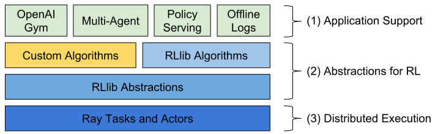

RLlib: Scalable Reinforcement Learning
======================================

RLlib is an open-source library for reinforcement learning that offers both high scalability and a unified API for a variety of applications.

To get started, take a look over the `custom env example <https://github.com/ray-project/ray/blob/master/python/ray/rllib/examples/custom_env.py>`__ and the `API documentation <rllib-training.html>`__. If you're looking to develop custom algorithms with RLlib, also check out `concepts and custom algorithms <rllib-concepts.html>`__.

Installation
------------

RLlib has extra dependencies on top of ``ray``. First, you'll need to install either `PyTorch <http://pytorch.org/>`__ or `TensorFlow <https://www.tensorflow.org>`__. Then, install the RLlib module:

.. code-block:: bash

  pip install tensorflow  # or tensorflow-gpu
  pip install ray[rllib]  # also recommended: ray[debug]

You might also want to clone the `Ray repo <https://github.com/ray-project/ray>`__ for convenient access to RLlib helper scripts:

.. code-block:: bash

  git clone https://github.com/ray-project/ray
  cd ray/python/ray/rllib

Training APIs
-------------
* `Command-line <rllib-training.html>`__
* `Configuration <rllib-training.html#configuration>`__
* `Python API <rllib-training.html#python-api>`__
* `Debugging <rllib-training.html#debugging>`__
* `REST API <rllib-training.html#rest-api>`__

Environments
------------
* `RLlib Environments Overview <rllib-env.html>`__
* `OpenAI Gym <rllib-env.html#openai-gym>`__
* `Vectorized <rllib-env.html#vectorized>`__
* `Multi-Agent and Hierarchical <rllib-env.html#multi-agent-and-hierarchical>`__
* `Interfacing with External Agents <rllib-env.html#interfacing-with-external-agents>`__
* `Advanced Integrations <rllib-env.html#advanced-integrations>`__

Models and Preprocessors
------------------------
* `RLlib Models and Preprocessors Overview <rllib-models.html>`__
* `TensorFlow Models <rllib-models.html#tensorflow-models>`__
* `PyTorch Models <rllib-models.html#pytorch-models>`__
* `Custom Preprocessors <rllib-models.html#custom-preprocessors>`__
* `Supervised Model Losses <rllib-models.html#supervised-model-losses>`__
* `Variable-length / Parametric Action Spaces <rllib-models.html#variable-length-parametric-action-spaces>`__

Algorithms
----------

*  High-throughput architectures

   -  `Distributed Prioritized Experience Replay (Ape-X) <rllib-algorithms.html#distributed-prioritized-experience-replay-ape-x>`__

   -  `Importance Weighted Actor-Learner Architecture (IMPALA) <rllib-algorithms.html#importance-weighted-actor-learner-architecture-impala>`__

   -  `Asynchronous Proximal Policy Optimization (APPO) <rllib-algorithms.html#asynchronous-proximal-policy-optimization-appo>`__

*  Gradient-based

   -  `Advantage Actor-Critic (A2C, A3C) <rllib-algorithms.html#advantage-actor-critic-a2c-a3c>`__

   -  `Deep Deterministic Policy Gradients (DDPG, TD3) <rllib-algorithms.html#deep-deterministic-policy-gradients-ddpg-td3>`__

   -  `Deep Q Networks (DQN, Rainbow, Parametric DQN) <rllib-algorithms.html#deep-q-networks-dqn-rainbow-parametric-dqn>`__

   -  `Policy Gradients <rllib-algorithms.html#policy-gradients>`__

   -  `Proximal Policy Optimization (PPO) <rllib-algorithms.html#proximal-policy-optimization-ppo>`__

*  Derivative-free

   -  `Augmented Random Search (ARS) <rllib-algorithms.html#augmented-random-search-ars>`__

   -  `Evolution Strategies <rllib-algorithms.html#evolution-strategies>`__

*  Multi-agent specific

   -  `QMIX Monotonic Value Factorisation (QMIX, VDN, IQN) <rllib-algorithms.html#qmix-monotonic-value-factorisation-qmix-vdn-iqn>`__

*  Offline

   -  `Advantage Re-Weighted Imitation Learning (MARWIL) <rllib-algorithms.html#advantage-re-weighted-imitation-learning-marwil>`__

Offline Datasets
----------------
* `Working with Offline Datasets <rllib-offline.html>`__
* `Input Pipeline for Supervised Losses <rllib-offline.html#input-pipeline-for-supervised-losses>`__
* `Input API <rllib-offline.html#input-api>`__
* `Output API <rllib-offline.html#output-api>`__

Concepts and Custom Algorithms
------------------------------
*  `Policies <rllib-concepts.html>`__

   -  `Building Policies in TensorFlow <rllib-concepts.html#building-policies-in-tensorflow>`__

   -  `Building Policies in TensorFlow Eager <rllib-concepts.html#building-policies-in-tensorflow-eager>`__

   -  `Building Policies in PyTorch <rllib-concepts.html#building-policies-in-pytorch>`__

   -  `Extending Existing Policies <rllib-concepts.html#extending-existing-policies>`__

*  `Policy Evaluation <rllib-concepts.html#policy-evaluation>`__
*  `Policy Optimization <rllib-concepts.html#policy-optimization>`__
*  `Trainers <rllib-concepts.html#trainers>`__

Examples
--------

* `Tuned Examples <rllib-examples.html#tuned-examples>`__
* `Training Workflows <rllib-examples.html#training-workflows>`__
* `Custom Envs and Models <rllib-examples.html#custom-envs-and-models>`__
* `Serving and Offline <rllib-examples.html#serving-and-offline>`__
* `Multi-Agent and Hierarchical <rllib-examples.html#multi-agent-and-hierarchical>`__
* `Community Examples <rllib-examples.html#community-examples>`__

Development
-----------

* `Development Install <rllib-dev.html#development-install>`__
* `API Stability <rllib-dev.html#api-stability>`__
* `Features <rllib-dev.html#feature-development>`__
* `Benchmarks <rllib-dev.html#benchmarks>`__
* `Contributing Algorithms <rllib-dev.html#contributing-algorithms>`__

Package Reference
-----------------
* `ray.rllib.agents <rllib-package-ref.html#module-ray.rllib.agents>`__
* `ray.rllib.env <rllib-package-ref.html#module-ray.rllib.env>`__
* `ray.rllib.evaluation <rllib-package-ref.html#module-ray.rllib.evaluation>`__
* `ray.rllib.models <rllib-package-ref.html#module-ray.rllib.models>`__
* `ray.rllib.optimizers <rllib-package-ref.html#module-ray.rllib.optimizers>`__
* `ray.rllib.utils <rllib-package-ref.html#module-ray.rllib.utils>`__

Troubleshooting
---------------

If you encounter errors like
`blas_thread_init: pthread_create: Resource temporarily unavailable` when using many workers,
try setting ``OMP_NUM_THREADS=1``. Similarly, check configured system limits with
`ulimit -a` for other resource limit errors.

If you encounter out-of-memory errors, consider setting ``redis_max_memory`` and ``object_store_memory`` in ``ray.init()`` to reduce memory usage.

For debugging unexpected hangs or performance problems, you can run ``ray stack`` to dump
the stack traces of all Ray workers on the current node, and ``ray timeline`` to dump
a timeline visualization of tasks to a file.
