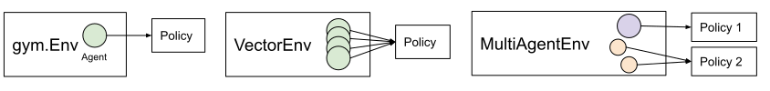
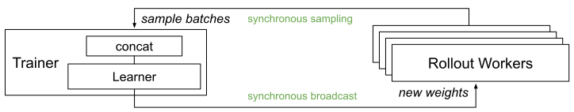

RLlib: Scalable Reinforcement Learning
======================================

RLlib is an open-source library for reinforcement learning that offers both high scalability and a unified API for a variety of applications. RLlib natively supports TensorFlow, TensorFlow Eager, and PyTorch, but most of its internals are framework agnostic.

.. image:: rllib-stack.svg

To get started, take a look over the `custom env example <https://github.com/ray-project/ray/blob/master/rllib/examples/custom_env.py>`__ and the `API documentation <rllib-training.html>`__. If you're looking to develop custom algorithms with RLlib, also check out `concepts and custom algorithms <rllib-concepts.html>`__.

RLlib in 60 seconds
-------------------

The following is a whirlwind overview of RLlib. See also the full `table of contents <rllib-toc.html>`__ for a more in-depth guide including the `list of built-in algorithms <rllib-toc.html#algorithms>`__.

Running RLlib
~~~~~~~~~~~~~

RLlib has extra dependencies on top of ``ray``. First, you'll need to install either `PyTorch <http://pytorch.org/>`__ or `TensorFlow <https://www.tensorflow.org>`__. Then, install the RLlib module:

.. code-block:: bash

  pip install ray[rllib]  # also recommended: ray[debug]

Then, you can try out training in the following equivalent ways:

.. code-block:: bash

  rllib train --run=PPO --env=CartPole-v0  # add --eager for eager execution

.. code-block:: python

  from ray import tune
  from ray.rllib.agents.ppo import PPOTrainer
  tune.run(PPOTrainer, config={"env": "CartPole-v0"})  # "eager": True for eager execution

Next, we'll cover three key concepts in RLlib: Policies, Samples, and Trainers.

Policies
~~~~~~~~

`Policies <rllib-concepts.html#policies>`__ are a core concept in RLlib. In a nutshell, policies are Python classes that define how an agent acts in an environment. `Rollout workers <rllib-concepts.html#policy-evaluation>`__ query the policy to determine agent actions. In a `gym <rllib-env.html#openai-gym>`__ environment, there is a single agent and policy. In `vector envs <rllib-env.html#vectorized>`__, policy inference is for multiple agents at once, and in `multi-agent <rllib-env.html#multi-agent-and-hierarchical>`__, there may be multiple policies, each controlling one or more agents:

Policies can be implemented using `any framework <https://github.com/ray-project/ray/blob/master/rllib/policy/policy.py>`__. However, for TensorFlow and PyTorch, RLlib has `build_tf_policy <rllib-concepts.html#building-policies-in-tensorflow>`__ and `build_torch_policy <rllib-concepts.html#building-policies-in-pytorch>`__ helper functions that let you define a trainable policy with a functional-style API, for example:

.. code-block:: python

  def policy_gradient_loss(policy, model, dist_class, train_batch):
      logits, _ = model.from_batch(train_batch)
      action_dist = dist_class(logits, model)
      return -tf.reduce_mean(
          action_dist.logp(train_batch["actions"]) * train_batch["rewards"])

    # <class 'ray.rllib.policy.tf_policy_template.MyTFPolicy'>
    MyTFPolicy = build_tf_policy(
        name="MyTFPolicy",
        loss_fn=policy_gradient_loss)

Sample Batches
~~~~~~~~~~~~~~

Whether running in a single process or `large cluster <rllib-training.html#specifying-resources>`__, all data interchange in RLlib is in the form of `sample batches <https://github.com/ray-project/ray/blob/master/rllib/policy/sample_batch.py>`__. Sample batches encode one or more fragments of a trajectory. Typically, RLlib collects batches of size ``sample_batch_size`` from rollout workers, and concatenates one or more of these batches into a batch of size ``train_batch_size`` that is the input to SGD.

A typical sample batch looks something like the following when summarized. Since all values are kept in arrays, this allows for efficient encoding and transmission across the network:

.. code-block:: python

 { 'action_logp': np.ndarray((200,), dtype=float32, min=-0.701, max=-0.685, mean=-0.694),
   'actions': np.ndarray((200,), dtype=int64, min=0.0, max=1.0, mean=0.495),
   'dones': np.ndarray((200,), dtype=bool, min=0.0, max=1.0, mean=0.055),
   'infos': np.ndarray((200,), dtype=object, head={}),
   'new_obs': np.ndarray((200, 4), dtype=float32, min=-2.46, max=2.259, mean=0.018),
   'obs': np.ndarray((200, 4), dtype=float32, min=-2.46, max=2.259, mean=0.016),
   'rewards': np.ndarray((200,), dtype=float32, min=1.0, max=1.0, mean=1.0),
   't': np.ndarray((200,), dtype=int64, min=0.0, max=34.0, mean=9.14)}

In `multi-agent mode <rllib-concepts.html#policies-in-multi-agent>`__, sample batches are collected separately for each individual policy.

Training
~~~~~~~~

Policies each define a ``learn_on_batch()`` method that improves the policy given a sample batch of input. For TF and Torch policies, this is implemented using a `loss function` that takes as input sample batch tensors and outputs a scalar loss. Here are a few example loss functions:

- Simple `policy gradient loss <https://github.com/ray-project/ray/blob/master/rllib/agents/pg/pg_policy.py>`__
- Simple `Q-function loss <https://github.com/ray-project/ray/blob/a1d2e1762325cd34e14dc411666d63bb15d6eaf0/rllib/agents/dqn/simple_q_policy.py#L136>`__
- Importance-weighted `APPO surrogate loss <https://github.com/ray-project/ray/blob/master/rllib/agents/ppo/appo_policy.py>`__

RLlib `Trainer classes <rllib-concepts.html#trainers>`__ coordinate the distributed workflow of running rollouts and optimizing policies. They do this by leveraging `policy optimizers <rllib-concepts.html#policy-optimization>`__ that implement the desired computation pattern. The following figure shows *synchronous sampling*, the simplest of `these patterns <rllib-algorithms.html>`__:

    Synchronous Sampling (e.g., A2C, PG, PPO)

RLlib uses `Ray actors <actors.html>`__ to scale training from a single core to many thousands of cores in a cluster. You can `configure the parallelism <rllib-training.html#specifying-resources>`__ used for training by changing the ``num_workers`` parameter.

Customization
~~~~~~~~~~~~~

RLlib provides ways to customize almost all aspects of training, including the `environment <rllib-env.html#configuring-environments>`__, `neural network model <rllib-models.html#tensorflow-models>`__, `action distribution <rllib-models.html#custom-action-distributions>`__, and `policy definitions <rllib-concepts.html#policies>`__:

.. image:: rllib-components.svg

To learn more, proceed to the `table of contents <rllib-toc.html>`__.
