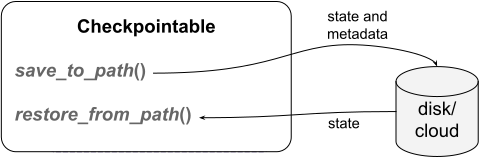
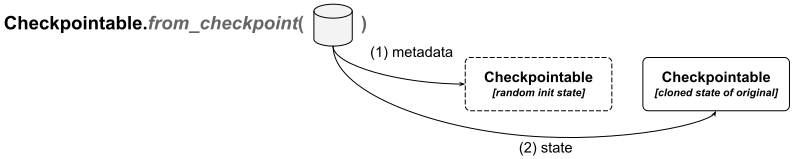

.. include:: /_includes/rllib/we_are_hiring.rst

.. _rllib-checkpoints-docs:

Checkpointing
=============

.. include:: /_includes/rllib/new_api_stack.rst

RLlib offers a powerful checkpointing system for all its major classes, allowing you to save the
states of :py:class:`~ray.rllib.algorithms.algorithm.Algorithm` instances and their subcomponents
to local disk or cloud storage, and restore previously run experiment states and individual subcomponents.
This system allows you to continue training models from a previous state or deploy bare-bones PyTorch
models into production.

    **Saving to and restoring from disk or cloud storage**: Use the :py:meth:`~ray.rllib.utils.checkpoints.Checkpointable.save_to_path` method
    to write the current state of any :py:meth:`~ray.rllib.utils.checkpoints.Checkpointable` component or your entire Algorithm to
    disk or cloud storage. To load a saved state back into a running component or into your Algorithm, use
    the :py:meth:`~ray.rllib.utils.checkpoints.Checkpointable.restore_from_path` method.

A checkpoint is a directory on disk or some `PyArrow <https://arrow.apache.org/>`__-supported cloud location, like
`gcs <https://cloud.google.com/storage>`__ or `S3 <https://aws.amazon.com/de/s3/>`__.
It contains architecture information, such as the class and the constructor arguments for creating a new instance,
a ``pickle`` or ``msgpack`` file with state information, and a human readable ``metadata.json`` file with information about the Ray version,
git commit, and checkpoint version.

You can generate a new :py:class:`~ray.rllib.algorithms.algorithm.Algorithm` instance or other subcomponent,
like an :py:class:`~ray.rllib.core.rl_module.rl_module.RLModule`, from an existing checkpoint using
the :py:meth:`~ray.rllib.utils.checkpoints.Checkpointable.from_checkpoint` method.
For example, you can deploy a previously trained :py:class:`~ray.rllib.core.rl_module.rl_module.RLModule`, without
any of the other RLlib components, into production.

    **Creating a new instance directly from a checkpoint**: Use the ``classmethod``
    :py:meth:`~ray.rllib.utils.checkpoints.Checkpointable.from_checkpoint` to instantiate objects directly
    from a checkpoint. RLlib first uses the saved meta data to create a bare-bones instance of the originally
    checkpointed object, and then restores its state from the state information in the checkpoint dir.

Another possibility is to load only a certain subcomponent's state into the containing
higher-level object. For example, you may want to load only the state of your :py:class:`~ray.rllib.core.rl_module.rl_module.RLModule`,
located inside your :py:class:`~ray.rllib.algorithms.algorithm.Algorithm`, but leave all the other components
as-is.

Checkpointable API
------------------

RLlib manages checkpointing through the :py:class:`~ray.rllib.utils.checkpoints.Checkpointable` API,
which exposes the following three main methods:

- :py:meth:`~ray.rllib.utils.checkpoints.Checkpointable.save_to_path` for creating a new checkpoint
- :py:meth:`~ray.rllib.utils.checkpoints.Checkpointable.restore_from_path` for loading a state from a checkpoint into a running object
- :py:meth:`~ray.rllib.utils.checkpoints.Checkpointable.from_checkpoint` for creating a new object from a checkpoint

RLlib classes, which thus far support the :py:class:`~ray.rllib.utils.checkpoints.Checkpointable` API are:

- :py:class:`~ray.rllib.algorithms.algorithm.Algorithm`
- :py:class:`~ray.rllib.core.rl_module.rl_module.RLModule` (and :py:class:`~ray.rllib.core.rl_module.multi_rl_module.MultiRLModule`)
- :py:class:`~ray.rllib.env.env_runner.EnvRunner` (thus, also :py:class:`~ray.rllib.env.single_agent_env_runner.SingleAgentEnvRunner` and :py:class:`~ray.rllib.env.multi_agent_env_runner.MultiAgentEnvRunner`)
- :py:class:`~ray.rllib.connectors.connector_v2.ConnectorV2` (thus, also :py:class:`~ray.rllib.connectors.connector_pipeline_v2.ConnectorPipelineV2`)
- :py:class:`~ray.rllib.core.learner.learner_group.LearnerGroup`
- :py:class:`~ray.rllib.core.learner.learner.Learner`

.. _rllib-checkpoints-save-to-path:

Creating a new checkpoint with `save_to_path()`
~~~~~~~~~~~~~~~~~~~~~~~~~~~~~~~~~~~~~~~~~~~~~~~

You create a new checkpoint from an instantiated RLlib object through the
:py:meth:`~ray.rllib.utils.checkpoints.Checkpointable.save_to_path` method.

The following are two examples, single- and multi-agent, using the :py:class:`~ray.rllib.algorithms.algorithm.Algorithm` class, showing
how to create checkpoints:

.. tab-set::

    .. tab-item:: Single-agent setup

        .. testcode::

            from ray.rllib.algorithms.ppo import PPOConfig

            # Configure and build an initial algorithm.
            config = (
                PPOConfig()
                .environment("Pendulum-v1")
            )
            ppo = config.build()

            # Train for one iteration, then save to a checkpoint.
            print(ppo.train())
            checkpoint_dir = ppo.save_to_path()
            print(f"saved algo to {checkpoint_dir}")

        .. testcode::
            :hide:

            _weights_check = ppo.get_module("default_policy").get_state()
            ppo.stop()

    .. tab-item:: Multi-agent setup

        .. testcode::

            from ray.rllib.algorithms.ppo import PPOConfig
            from ray.rllib.examples.envs.classes.multi_agent import MultiAgentPendulum
            from ray.tune import register_env

            register_env("multi-pendulum", lambda cfg: MultiAgentPendulum({"num_agents": 2}))

            # Configure and build an initial algorithm.
            multi_agent_config = (
                PPOConfig()
                .environment("multi-pendulum")
                .multi_agent(
                    policies={"p0", "p1"},
                    # Agent IDs are 0 and 1 -> map to p0 and p1, respectively.
                    policy_mapping_fn=lambda aid, eps, **kw: f"p{aid}"
                )
            )
            ppo = multi_agent_config.build()

            # Train for one iteration, then save to a checkpoint.
            print(ppo.train())
            multi_agent_checkpoint_dir = ppo.save_to_path()
            print(f"saved multi-agent algo to {multi_agent_checkpoint_dir}")

        .. testcode::
            :hide:

            ppo.stop()

.. note::
    When running your experiments with `Ray Tune <https://docs.ray.io/en/latest/tune/index.html>`__,
    Tune calls the :py:meth:`~ray.rllib.utils.checkpoints.Checkpointable.save_to_path`
    method automatically on the :py:class:`~ray.rllib.algorithms.algorithm.Algorithm` instance, whenever the training
    iteration matches the checkpoint frequency configured through Tune. The default location where Tune creates these checkpoints
    is ``~/ray_results/[your experiment name]/[Tune trial name]/checkpoint_[sequence number]``.

Checkpoint versions
+++++++++++++++++++

RLlib uses a checkpoint versioning system to figure out how to restore an Algorithm or any
subcomponent from a given directory.

From Ray 2.40 on, you can find the checkpoint version in the human readable ``metadata.json``
file inside all checkpoint directories.

Also starting from `Ray 2.40`, RLlib checkpoints are backward compatible. This means that
a checkpoint created with Ray `2.x` can be read and handled by `Ray 2.x+n`, as long as `x >= 40`.
The Ray team ensures backward compatibility with
`comprehensive CI tests on checkpoints taken with previous Ray versions <https://github.com/ray-project/ray/tree/master/rllib/utils/tests/test_checkpointable.py>`__.

.. _rllib-checkpoints-structure-of-checkpoint-dir:

Structure of a checkpoint directory
+++++++++++++++++++++++++++++++++++

After saving your PPO's state in the ``checkpoint_dir`` directory, or somewhere in ``~/ray_results/`` if you use Ray Tune,
the directory looks like the following:

.. code-block:: shell

    $ cd [your algo checkpoint dir]
    $ ls -la
        .
        ..
        env_runner/
        learner_group/
        algorithm_state.pkl
        class_and_ctor_args.pkl
        metadata.json

Subdirectories inside a checkpoint dir, like ``env_runner/``, hint at a subcomponent's own checkpoint data.
For example, an :py:class:`~ray.rllib.algorithms.algorithm.Algorithm` always also saves its
:py:class:`~ray.rllib.env.env_runner.EnvRunner` state and :py:class:`~ray.rllib.core.learner.learner_group.LearnerGroup` state.

.. note::
    Each of the subcomponent's directories themselves contain a ``metadata.json`` file, a ``class_and_ctor_args.pkl`` file,
    and a ``pickle`` or ``msgpack`` state file, all serving the same purpose as their counterparts in the main algorithm checkpoint directory.
    For example, inside the ``learner_group/`` subdirectory, you would find the :py:class:`~ray.rllib.core.learner.learner_group.LearnerGroup`'s own
    architecture, state, and meta information:

    .. code-block:: shell

        $ cd env_runner/
        $ ls -la
        .
        ..
        state.pkl
        class_and_ctor_args.pkl
        metadata.json

    See :ref:`RLlib component tree <rllib-checkpoints-component-tree>` for details.

The ``metadata.json`` file exists for your convenience only and RLlib doesn't need it.

.. note::
    The ``metadata.json`` file contains information about the Ray version used to create the checkpoint,
    the Ray commit, the RLlib checkpoint version, and the names of the state- and constructor-information
    files in the same directory.

    .. code-block:: shell

        $ more metadata.json
        {
            "class_and_ctor_args_file": "class_and_ctor_args.pkl",
            "state_file": "state",
            "ray_version": ..,
            "ray_commit": ..,
            "checkpoint_version": "2.1"
        }

The ``class_and_ctor_args.pkl`` file stores meta information needed to construct a "fresh" object, without any particular state.
This information, as the filename suggests, contains the class of the saved object and its constructor arguments and keyword arguments.
RLlib uses this file to create the initial new object when calling :py:meth:`~ray.rllib.utils.checkpoints.Checkpointable.from_checkpoint`.

Finally, the ``.._state.[pkl|msgpack]`` file contains the pickled or msgpacked state dict of the saved object.
RLlib obtains this state dict, when saving a checkpoint, through calling the object's
:py:meth:`~ray.rllib.utils.checkpoints.Checkpointable.get_state` method.

.. note::
    Support for ``msgpack`` based checkpoints is experimental, but might become the default in the future.
    Unlike ``pickle``, ``msgpack`` has the advantage of being independent of the python-version, thus allowing
    users to recover experiment and model states from old checkpoints they have generated with older python
    versions.

    The Ray team is working on completely separating state from architecture within checkpoints, meaning all state
    information should go into the ``state.msgpack`` file, which is python-version independent,
    whereas all architecture information should go into the ``class_and_ctor_args.pkl`` file, which still depends on
    the python version. At the time of loading from checkpoint, the user would have to provide the latter/architecture part
    of the checkpoint.

    `See here for an example that illustrates this in more detail <https://github.com/ray-project/ray/tree/master/rllib/examples/checkpoints/change_config_during_training.py>`__.

.. _rllib-checkpoints-component-tree:

RLlib component tree
+++++++++++++++++++++++

The following is the structure of the RLlib component tree, showing under which name you can
access a subcomponent's own checkpoint within the higher-level checkpoint. At the highest level
is the :py:class:`~ray.rllib.algorithms.algorithm.Algorithm` class:

.. code-block:: shell

    algorithm/
        learner_group/
            learner/
                rl_module/
                    default_policy/  # <- single-agent case
                    [module ID 1]/  # <- multi-agent case
                    [module ID 2]/  # ...
        env_runner/
            env_to_module_connector/
            module_to_env_connector/

.. note::
    The ``env_runner/`` subcomponent currently doesn't hold a copy of the :py:class:`~ray.rllib.core.rl_module.rl_module.RLModule`
    checkpoint because it's already saved under ``learner/``. The Ray team is working on resolving
    this issue, probably through soft-linking to avoid duplicate files and unnecessary disk usage.

.. _rllib-checkpoints-from-checkpoint:

Creating instances from a checkpoint with `from_checkpoint`
~~~~~~~~~~~~~~~~~~~~~~~~~~~~~~~~~~~~~~~~~~~~~~~~~~~~~~~~~~~

Once you have a checkpoint of either a trained :py:class:`~ray.rllib.algorithms.algorithm.Algorithm` or
any of its :ref:`subcomponents <rllib-checkpoints-component-tree>`, you can recreate new objects directly
from this checkpoint.

The following are two examples:

.. tab-set::

    .. tab-item:: Create a new Algorithm from a checkpoint

        To recreate an entire :py:class:`~ray.rllib.algorithms.algorithm.Algorithm`
        instance from a checkpoint, you can do the following:

        .. testcode::

            # Import the correct class to create from scratch using the checkpoint.
            from ray.rllib.algorithms.algorithm import Algorithm

            # Use the already existing checkpoint in `checkpoint_dir`.
            new_ppo = Algorithm.from_checkpoint(checkpoint_dir)
            # Confirm the `new_ppo` matches the originally checkpointed one.
            assert new_ppo.config.env == "Pendulum-v1"

            # Continue training.
            new_ppo.train()

        .. testcode::
            :hide:

            new_ppo.stop()

    .. tab-item:: Create a new RLModule from an Algorithm checkpoint

        Creating a new RLModule from an Algorithm checkpoint is useful when deploying trained models
        into production or evaluating them in a separate process while training is ongoing.
        To recreate only the :py:class:`~ray.rllib.core.rl_module.rl_module.RLModule` from
        the algorithm's checkpoint, you can do the following.

        .. testcode::

            from pathlib import Path
            import torch

            # Import the correct class to create from scratch using the checkpoint.
            from ray.rllib.core.rl_module.rl_module import RLModule

            # Use the already existing checkpoint in `checkpoint_dir`, but go further down
            # into its subdirectory for the single RLModule.
            # See the preceding section on "RLlib component tree" for the various elements in the RLlib
            # component tree.
            rl_module_checkpoint_dir = Path(checkpoint_dir) / "learner_group" / "learner" / "rl_module" / "default_policy"

            # Now that you have the correct subdirectory, create the actual RLModule.
            rl_module = RLModule.from_checkpoint(rl_module_checkpoint_dir)

            # Run a forward pass to compute action logits.
            # Use a dummy Pendulum observation tensor (3d) and add a batch dim (B=1).
            results = rl_module.forward_inference(
                {"obs": torch.tensor([0.5, 0.25, -0.3]).unsqueeze(0).float()}
            )
            print(results)

See this `example of how to run policy inference after training <https://github.com/ray-project/ray/blob/master/rllib/examples/inference/policy_inference_after_training.py>`__
and this `example of how to run policy inference with an LSTM <https://github.com/ray-project/ray/blob/master/rllib/examples/inference/policy_inference_after_training_w_connector.py>`__.

.. hint::
    Because your :py:class:`~ray.rllib.core.rl_module.rl_module.RLModule` is also a
    `PyTorch Module <https://pytorch.org/docs/stable/generated/torch.nn.Module.html#torch.nn.Module>`__,
    you can easily export your model to `ONNX <https://onnx.ai/>`__, `IREE <https://iree.dev/>`__,
    or other deployment-friendly formats.
    See this `example script supporting ONNX <https://github.com/ray-project/ray/blob/master/rllib/examples/inference/policy_inference_after_training.py>`__ for more details.

Restoring state from a checkpoint with `restore_from_path`
~~~~~~~~~~~~~~~~~~~~~~~~~~~~~~~~~~~~~~~~~~~~~~~~~~~~~~~~~~

Normally, the :py:meth:`~ray.rllib.utils.checkpoints.Checkpointable.save_to_path` and
:py:meth:`~ray.rllib.utils.checkpoints.Checkpointable.from_checkpoint` methods are all you need to create
checkpoints and re-create instances from them.

However, sometimes, you already have an instantiated object up and running and would like to "load" another
state into it. For example, consider training two :py:class:`~ray.rllib.core.rl_module.rl_module.RLModule` networks
through multi-agent training, playing against each other in a self-play fashion. After a while, you would like to swap out,
without interrupting your experiment, one of the ``RLModules`` with a third one that you have saved to disk or cloud storage a while back.

This is where the :py:meth:`~ray.rllib.utils.checkpoints.Checkpointable.restore_from_path` method comes in handy.
It loads a state into an already running object, for example your Algorithm, or into a subcomponent of that object,
for example a particular :py:class:`~ray.rllib.core.rl_module.rl_module.RLModule` within your :py:class:`~ray.rllib.algorithms.algorithm.Algorithm`.

.. tab-set::

    .. tab-item:: Continue training

        When using RLlib directly, meaning without Ray Tune, the problem of loading a state
        into a running instance is straightforward:

        .. testcode::

            # Recreate the preceding PPO from the config.
            new_ppo = config.build()

            # Load the state stored previously in `checkpoint_dir` into the
            # running algorithm instance.
            new_ppo.restore_from_path(checkpoint_dir)

            # Run another training iteration.
            new_ppo.train()

        .. testcode::
            :hide:

            new_ppo.stop()

    .. tab-item:: Continue training with Ray Tune

        However, when running through Ray Tune, you don't have direct access to the
        Algorithm object or any of its subcomponents.
        You can use :ref:`RLlib's callbacks APIs <rllib-callback-docs>` to inject custom code and solve for this.

        Also, see here for an
        `example on how to continue training with a different config <https://github.com/ray-project/ray/blob/master/rllib/examples/checkpoints/change_config_during_training.py>`__.

        .. testcode::

            from ray import tune

            # Reuse the preceding PPOConfig (`config`).
            # Inject custom callback code that runs right after algorithm's initialization.
            config.callbacks(
                on_algorithm_init=(
                    lambda algorithm, _dir=checkpoint_dir, **kw: algorithm.restore_from_path(_dir)
                ),
            )

            # Run the experiment, continuing from the checkpoint, through Ray Tune.
            results = tune.Tuner(
                config.algo_class,
                param_space=config,
                run_config=tune.RunConfig(stop={"num_env_steps_sampled_lifetime": 8000})
            ).fit()

    .. tab-item:: Swap out one RLModule and continue multi-agent training

        In the :ref:`preceding section on save_to_path <rllib-checkpoints-save-to-path>`, you created
        a single-agent checkpoint with the ``default_policy`` ModuleID, and a multi-agent checkpoint with two ModuleIDs,
        ``p0`` and ``p1``.

        Here is how you can continue training the multi-agent experiment, but swap out ``p1`` with
        the state of the ``default_policy`` from the single-agent experiment.
        You can use :ref:`RLlib's callbacks APIs <rllib-callback-docs>` to inject custom
        code into a Ray Tune experiment:

        .. testcode::

            # Reuse the preceding multi-agent PPOConfig (`multi_agent_config`).

            # But swap out ``p1`` with the state of the ``default_policy`` from the
            # single-agent run, using a callback and the correct path through the
            # RLlib component tree:
            multi_rl_module_component_tree = "learner_group/learner/rl_module"

            # Inject custom callback code that runs right after algorithm's initialization.

            def _on_algo_init(algorithm, **kwargs):
                algorithm.restore_from_path(
                    # Checkpoint was single-agent (has "default_policy" subdir).
                    path=Path(checkpoint_dir) / multi_rl_module_component_tree / "default_policy",
                    # Algo is multi-agent (has "p0" and "p1" subdirs).
                    component=multi_rl_module_component_tree + "/p1",
                )

            # Inject callback.
            multi_agent_config.callbacks(on_algorithm_init=_on_algo_init)

            # Run the experiment through Ray Tune.
            results = tune.Tuner(
                multi_agent_config.algo_class,
                param_space=multi_agent_config,
                run_config=tune.RunConfig(stop={"num_env_steps_sampled_lifetime": 8000})
            ).fit()

        .. testcode::
            :hide:

            from ray.rllib.utils.test_utils import check

            _weights_check_2 = multi_agent_config.build().get_module("p1").get_state()
            check(_weights_check, _weights_check_2)
