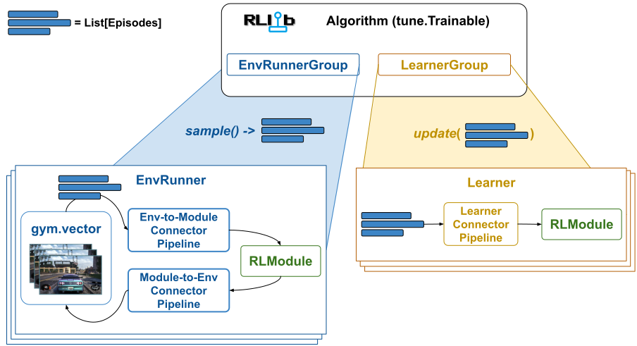
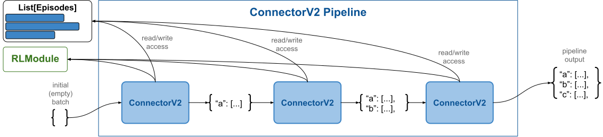
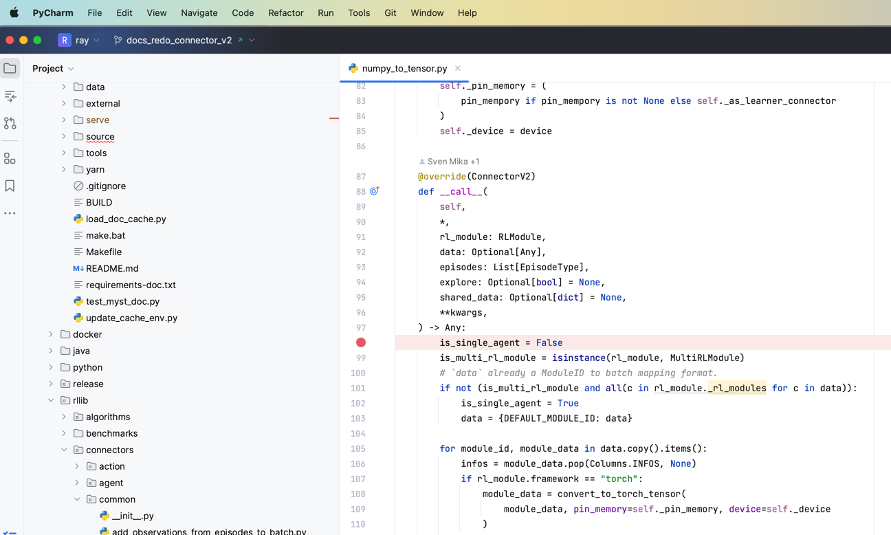

.. include:: /_includes/rllib/we_are_hiring.rst

.. include:: /_includes/rllib/new_api_stack.rst

.. TODO (sven): Write an extra page on multi-agent specific cases.

.. _connector-v2-docs:

ConnectorV2 and ConnectorV2 Pipelines
=====================================

As explained in the :ref:`section on Episodes <single-agent-episode-docs>`, RLlib stores and
transports all trajectory data in the form of `Episodes` (single- or multi-agent) and only translates
this data into NN-readable tensor batches right before the model forward pass.

The components that perform such translations (from episodes to batches or from model outputs to
action tensors) are called **connector pipelines**. There are three different types of connector pipelines
in RLlib, 1) env-to-module connector pipelines, 2) module-to-env connector pipelines,
and 3) Learner connector pipelines.

.. tip::

    The :py:class:`~ray.rllib.connectors.connector_v2.ConnectorV2` API is an extremely powerful tool for
    customizing your RLlib experiments and algorithms. It allows you to take full control over accessing, changing, and re-assembling
    the data collected from your RL environments or your offline RL input files as well as controlling the exact
    nature and shape of the tensor batches that are fed into your NN models for computing either actions or losses.

    **ConnectorV2 Pipelines**: Connector pipelines convert episodes into batched data
    to be processed by a neural network (env-to-module and Learner) or convert model outputs into actions to be sent
    to an RL environment (module-to-env).
    An env-to-module pipeline (on an :py:class:`~ray.rllib.env.env_runner.EnvRunner`) takes a list of
    episodes as input and outputs the forward batch used in the :py:class:`~ray.rllib.core.rl_module.rl_module.RLModule`
    on the :py:class:`~ray.rllib.env.env_runner.EnvRunner` to compute the next action. A module-to-env pipeline
    (on the same :py:class:`~ray.rllib.env.env_runner.EnvRunner`) takes the RLModule's output and converts it into actions
    for the next `step()` call on the RL environment.
    Lastly, a Learner connector pipeline (on a :py:class:`~ray.rllib.core.learner.learner.Learner`
    worker) converts episodes into a train batch for the :py:class:`~ray.rllib.core.rl_module.rl_module.RLModule`.

.. hint::

    RLlib is currently in a transition state from old- to :ref:`new API stack <rllib-new-api-stack-guide>`.
    This page only covers the new API stack's :py:class:`~ray.rllib.connectors.connector_v2.ConnectorV2`
    and :py:class:`~ray.rllib.connectors.connector_pipeline_v2.ConnectorPipelineV2` classes. Thus the term "connector" here
    refers to this `ConnectorV2` class and should not be confused with the old API stack's `Connector` and `ConnectorPipeline` classes.

The three pipeline types are discussed in more detail further below, however, all three have the following in common:

* All connector pipelines are sequences of one or more :py:class:`~ray.rllib.connectors.connector_v2.ConnectorV2` pieces (nesting is supported, meaning some pieces may be pipelines themselves).
* All connector pieces and -pipelines are Python callables, overriding the :py:meth:`~ray.rllib.connectors.connector_v2.ConnectorV2.__call__` method.
* The call signatures always consist of the same arguments: A list of episodes, a batch to-be-built, and an RLModule instance. See the :py:meth:`~ray.rllib.connectors.connector_v2.ConnectorV2.__call__` method for more details.
* All connector pipelines can read from and write to the provided list of episodes and thereby manipulate any episode as required.

Three ConnectorV2 Pipeline Types
================================

In the following, the three pipeline types (:ref:`env-to-module <env-to-module-pipeline>`,
:ref:`module-to-env <module-to-env-pipeline>`, and :ref:`learner <learner-pipeline>`) are described in more detail.

.. _env-to-module-pipeline:

Env-to-module Pipeline
----------------------

One env-to-module pipeline is located on each :py:class:`~ray.rllib.env.env_runner.EnvRunner` (see figure below) and is responsible for connecting the `gymnasium.Env` with
the EnvRunner's :py:class:`~ray.rllib.core.rl_module.rl_module.RLModule`.
When calling the env-to-module pipeline, a translation from a list of ongoing :ref:`Episode objects <single-agent-episode-docs>` to an
RLModule-readable tensor batch takes place and the output of the pipeline is directly sent into the RLModule's
:py:meth:`~ray.rllib.core.rl_module.rl_module.RLModule.forward_inference` or :py:meth:`~ray.rllib.core.rl_module.rl_module.RLModule.forward_exploration`
method (depending on the user's exploration settings).

.. hint::

    Set `config.exploration(explore=True)` in your :py:class:`~ray.rllib.algorithms.algorithm_config.AlgorithmConfig` to make sure your RLModule's
    :py:meth:`~ray.rllib.core.rl_module.rl_module.RLModule.forward_exploration` method is called with the connector's output.
    Otherwise, the EnvRunner calls :py:meth:`~ray.rllib.core.rl_module.rl_module.RLModule.forward_inference`.
    Note also that usually these two methods only differ in that actions are sampled when `explore=True` and
    greedily picked when `explore=False`. However, the exact behavior in each case depends on
    your :ref:`RLModule's implementation <rlmodule-guide>`.

.. figure:: images/connector_v2/env_runner_connector_pipelines.svg
    :width: 1000
    :align: left

    **EnvRunner ConnectorV2 Pipelines**: Both env-to-module and module-to-env pipelines are located on the EnvRunner workers.
    The env-to-module pipeline sits between the RL environment (gymnasium.Env) and the :py:class:`~ray.rllib.core.rl_module.rl_module.RLModule`,
    translating ongoing episodes into RLModule-readable batches (for the model's `forward_...()` methods).
    The module-to-env pipeline serves the other direction, converting the RLModule's outputs (action logits,
    action distribution parameters, etc..) to actual actions understandable by the `gymnasium.Env` and used in the next `step()` call.

.. _default-env-to-module-pipeline:

**Default Env-to-Module Behavior:** By default (if the user doesn't configure anything else), an env-to-module pipeline is populated with the following
built-in connector pieces, which perform the following tasks:

* :py:class:`~ray.rllib.connectors.common.add_observations_from_episodes_to_batch.AddObservationsFromEpisodesToBatch`: Places the most recent observation from each ongoing episode into the batch. Note that if you have a vector of `N` environments per `EnvRunner`, your batch size (number of observations) will also be `N`.
* *For stateful models only:* :py:class:`~ray.rllib.connectors.common.add_states_from_episodes_to_batch.AddStatesFromEpisodesToBatch`: Places the most recent state outputs of your module (as new state inputs) into the batch and adds a 1 timestep second axis (axis=1) to all data to make it sequential.
* *For multi-agent only:* :py:class:`~ray.rllib.connectors.common.agent_to_module_mapping.AgentToModuleMapping`: Maps per-agent data to the respective per-module data depending on the user defined agent-to-module mapping function.
* :py:class:`~ray.rllib.connectors.common.batch_individual_items.BatchIndividualItems`: Now that all data has been placed in the batch, convert the individual batch items into batched data structures (lists of individual items are converted to numpy arrays).
* :py:class:`~ray.rllib.connectors.common.numpy_to_tensor.NumpyToTensor`: Converts all numpy arrays in the batch into actual framework specific tensors and moves these to the GPU, if required.

It's discussed further below :ref:`how users can customize the behavior of the env-to-module pipeline <customizing-connector-v2-pipelines>` by adding any number of `ConnectorV2` pieces to it.

.. _module-to-env-pipeline:

Module-to-env Pipeline
----------------------
One module-to-env pipeline is located on each :py:class:`~ray.rllib.env.env_runner.EnvRunner` (see preceding figure) and is responsible for connecting the
EnvRunner's :py:class:`~ray.rllib.core.rl_module.rl_module.RLModule` with the `gymnasium.Env`.
When calling the module-to-env pipeline, a translation takes place from a model output dict - possibly containing action logits or distribution parameters -
to actual env-readable actions. Note that a model-to-env connector has access to the same list of ongoing :ref:`Episode objects <single-agent-episode-docs>`
that the env-to-module connector already saw, however, there is usually no need to access them (or write to them) in this pipeline.

The output of the module-to-env pipeline is directly sent to the RL environment (`gymnasium.Env`) for its next `step()` call.

.. _default-module-to-env-pipeline:

**Default Module-to-Env Behavior:** By default (if the user doesn't configure anything else), an module-to-env pipeline is populated with the following
built-in connector pieces, which perform the following tasks:

* :py:class:`~ray.rllib.connectors.module_to_env.get_actions.GetActions`: Checks, whether the "actions" key is already part of the RLModule's output and if not, tries to sample actions using the obligatory "action_dist_inputs" key in the RLModule's output.
* :py:class:`~ray.rllib.connectors.common.tensor_to_numpy.TensorToNumpy`: Converts all framework specific tensors in the batch to numpy arrays.
* :py:class:`~ray.rllib.connectors.module_to_env.unbatch_to_individual_items.UnBatchToIndividualItems`: Un-batches all data, meaning converts from NumPy arrays with a batch axis=0 to lists of individual batch items w/o such batch axis.
* *For multi-agent only:* :py:class:`~ray.rllib.connectors.common.module_to_agent_unmapping.ModuleToAgentUnmapping`: Maps per-module data back to the respective per-agent data depending on the previously performed agent-to-module mapping.
* *For stateful models only:* :py:class:`~ray.rllib.connectors.module_to_env.remove_single_ts_time_rank_from_batch.RemoveSingleTsTimeRankFromBatch`: Removes a previously added 1-timestep second axis (axis=1) from all data (meaning, undoes the transformation by the `AddStatesFromEpisodesToBatch` piece in the env-to-module pipeline).
* :py:class:`~ray.rllib.connectors.module_to_env.normalize_and_clip_actions.NormalizeAndClipActions`: Translates the computed/sampled actions from their neural-network form (assumed to be somewhat within a small range) to the `gymnasium.Env`'s action space or - alternatively - clips the computed/sampled actions to the env's action ranges. Note that this step is only relevant for non-Discrete action spaces.
* :py:class:`~ray.rllib.connectors.module_to_env.listify_data_for_vector_env.NormalizeAndClipActions`: Converts data from the connector pipeline specific format into plain lists, matching the `gymnasium.Env` vector in size.

It's discussed further below :ref:`how users can customize the behavior of the module-to-env pipeline <customizing-connector-v2-pipelines>` by adding any number of `ConnectorV2` pieces to it.

.. _learner-pipeline:

Learner Pipeline
----------------
One learner pipeline is located on each :py:class:`~ray.rllib.core.learner.learner.Learner` worker (see figure below) and is responsible for
compiling the train batch for the :py:class:`~ray.rllib.core.rl_module.rl_module.RLModule` from a list of episodes (trajectory data).

.. figure:: images/connector_v2/learner_connector_pipeline.svg
    :width: 1000
    :align: left

    **Learner ConnectorV2 Pipelines**: A learner connector pipeline sits between the input training data into the Learner worker and its RLModule.
    It translates the input data (episodes) into a train batch (tensor data), readable by the RLModule (`forward_train()` method).

When calling the Learner connector pipeline, a translation from a list of :ref:`Episode objects <single-agent-episode-docs>` to an
RLModule-readable tensor batch (the "train batch") takes place and the output of the pipeline is directly sent into the RLModule's
`forward_train` method.

.. _default-learner-pipeline:

**Default Learner Pipeline Behavior:** By default (if the user doesn't configure anything else), a Learner connector pipeline is
populated with the following built-in connector pieces, which perform the following tasks:

* :py:class:`~ray.rllib.connectors.common.add_observations_from_episodes_to_batch.AddObservationsFromEpisodesToBatch`: Places all observations from the incoming episodes into the batch. For example, if you have 2 incoming episodes of length 10 and 20, your resulting train batch size is 30 (10 + 20).
* :py:class:`~ray.rllib.connectors.learner.add_columns_from_episodes_to_batch.AddColumnsFromEpisodesToBatch`: Places all other columns (rewards, actions, terminated flags, etc..) from the incoming episodes into the batch.
* *For stateful models only:* :py:class:`~ray.rllib.connectors.common.add_states_from_episodes_to_batch.AddStatesFromEpisodesToBatch`: Adds a time-dimension of size `max_seq_len` at axis=1 to all data in the batch and (right) zero-pads in cases where episodes end at timesteps non-dividable by `max_seq_len`. You can change `max_seq_len` through your RLModule's `model_config_dict` (call `config.rl_module(model_config_dict={'max_seq_len': ...})` on your :py:class:`~ray.rllib.algorithms.algorithm_config.AlgorithmConfig` object). Also places every `max_seq_len`th state output of your module from the incoming episodes into the train batch (as new state inputs).
* *For multi-agent only:* :py:class:`~ray.rllib.connectors.common.agent_to_module_mapping.AgentToModuleMapping`: Maps per-agent data to the respective per-module data depending on the already determined agent-to-module mapping stored in each (multi-agent) episode.
* :py:class:`~ray.rllib.connectors.common.batch_individual_items.BatchIndividualItems`: Now that all data has been placed in the batch, convert the individual batch items into batched data structures (lists of individual items are converted to numpy arrays).
* :py:class:`~ray.rllib.connectors.common.numpy_to_tensor.NumpyToTensor`: Converts all numpy arrays in the batch into actual framework specific tensors and moves these to the GPU if required.

It's discussed further below :ref:`how users can customize the behavior of the Learner pipeline <customizing-connector-v2-pipelines>` by adding any number of `ConnectorV2` pieces to it.

.. _customizing-connector-v2-pipelines:

Customizing ConnectorV2 Pipelines
=================================

Configuring custom ConnectorV2 pieces in the AlgorithmConfig
------------------------------------------------------------

Any of the three pipeline types (:ref:`env-to-module <env-to-module-pipeline>`,
:ref:`module-to-env <module-to-env-pipeline>`, and :ref:`learner <learner-pipeline>`) can be customized by users through providing a
connector builder function through their :py:class:`~ray.rllib.algorithms.algorithm_config.AlgorithmConfig`. That function should return a single
ConnectorV2 piece or a list of ConnectorV2 pieces.

Adding custom env-to-module connectors
~~~~~~~~~~~~~~~~~~~~~~~~~~~~~~~~~~~~~~

For example, to add a custom ConnectorV2 piece to the env-to-module pipeline,
users should do this in their config:

.. testcode::
    :skipif: True

    from ray.rllib.algorithms.ppo import PPOConfig

    config = PPOConfig()

    # Add a env-to-module connector piece to the default env-to-module pipeline.
    # Note that the lambda takes the `gymnasium.Env` as only argument.
    config.env_runners(
        env_to_module_connector=lambda env: MyEnvToModuleConnector(..),
    )
    # If you want to add multiple custom pieces to the pipeline, return them as a list:
    config.env_runners(
        env_to_module_connector=lambda env: [
            MyEnvToModuleConnector(..),
            MyOtherEnvToModuleConnector(..),
            AndOneMoreConnector(..),
        ],
    )

Adding custom module-to-env connectors
~~~~~~~~~~~~~~~~~~~~~~~~~~~~~~~~~~~~~~

Similarly, you can add a custom module-to-env piece to your pipeline (or several
by returning a list from your lambda).

.. testcode::
    :skipif: True

    # Add a module-to-env connector piece to the default module-to-env pipeline.
    # Note that the lambda takes the `gymnasium.Env` as only argument.
    config.env_runners(
        module_to_env_connector=lambda env: MyModuleToEnvConnector(..),
    )
    # Return a list of module-to-env connector instances from the `lambda`, if you would like to add more
    # than one connector piece to the custom pipeline.

Adding custom Learner connectors
~~~~~~~~~~~~~~~~~~~~~~~~~~~~~~~~

To add custom Learner connector pieces, you need to call the
:py:meth:`~ray.rllib.algorithms.algorithm_config.AlgorithmConfig.learners` method of the algorithm config:

.. testcode::
    :skipif: True

    # Add a Learner connector piece to the default Learner pipeline.
    # Note that the lambda takes the input observation- and input action spaces as
    # arguments.
    config.learners(
        learner_connector=lambda obs_space, act_space: MyLearnerConnector(..),
    )
    # Return a list of Learner instances from the `lambda`, if you would like to add more
    # than one connector piece to the custom pipeline.

Observation Preprocessors
-------------------------

.. from old rllib-model.rst
Built-in Preprocessors
~~~~~~~~~~~~~~~~~~~~~~
RLlib tries to pick one of its built-in preprocessors based on the environment's
observation space. Thereby, the following simple rules apply:
- Discrete observations are one-hot encoded, e.g. ``Discrete(3) and value=1 -> [0, 1, 0]``.
- MultiDiscrete observations are encoded by one-hot encoding each discrete element
  and then concatenating the respective one-hot encoded vectors.
  e.g. ``MultiDiscrete([3, 4]) and value=[1, 3] -> [0 1 0 0 0 0 1]`` because
  the first ``1`` is encoded as ``[0 1 0]`` and the second ``3`` is encoded as
  ``[0 0 0 1]``; these two vectors are then concatenated to ``[0 1 0 0 0 0 1]``.
- Tuple and Dict observations are flattened, thereby, Discrete and MultiDiscrete
  sub-spaces are handled as described above.
  Also, the original dict/tuple observations are still available inside a) the Model via the input
  dict's "obs" key (the flattened observations are in "obs_flat"), as well as b) the Policy
  via the following line of code (e.g. put this into your loss function to access the original
  observations: ``dict_or_tuple_obs = restore_original_dimensions(input_dict["obs"], self.obs_space, "tf|torch")``
For Atari observation spaces, RLlib defaults to using the `DeepMind preprocessors <https://github.com/ray-project/ray/blob/master/rllib/env/wrappers/atari_wrappers.py>`__
(``preprocessor_pref=deepmind``). However, if the Algorithm's config key ``preprocessor_pref`` is set to "rllib",
the following mappings apply for Atari-type observation spaces:
- Images of shape ``(210, 160, 3)`` are downscaled to ``dim x dim``, where
  ``dim`` is a model config key (see default Model config below). Also, you can set
  ``grayscale=True`` for reducing the color channel to 1, or ``zero_mean=True`` for
  producing -1.0 to 1.0 values (instead of 0.0 to 1.0 values by default).
- Atari RAM observations (1D space of shape ``(128, )``) are zero-averaged
  (values between -1.0 and 1.0).
In all other cases, no preprocessor will be used and the raw observations from the environment
will be sent directly into your model.
Custom Preprocessors and Environment Filters
~~~~~~~~~~~~~~~~~~~~~~~~~~~~~~~~~~~~~~~~~~~~
 .. warning::
    Custom preprocessors have been fully deprecated, since they sometimes conflict with the built-in preprocessors for handling complex observation spaces.
    Please use `wrapper classes <https://github.com/Farama-Foundation/Gymnasium/tree/main/gymnasium/wrappers>`__ around your environment instead of preprocessors.
    Note that the built-in **default** Preprocessors described above will still be used and won't be deprecated.
Instead of using the deprecated custom Preprocessors, you should use ``gym.Wrappers`` to preprocess your environment's output (observations and rewards),
but also your Model's computed actions before sending them back to the environment.
For example, for manipulating your env's observations or rewards, do:
 .. code-block:: python
    import gymnasium as gym
    from ray.rllib.utils.numpy import one_hot
    class OneHotEnv(gym.core.ObservationWrapper):
        # Override `observation` to custom process the original observation
        # coming from the env.
        def observation(self, observation):
            # E.g. one-hotting a float obs [0.0, 5.0[.
            return one_hot(observation, depth=5)
    class ClipRewardEnv(gym.core.RewardWrapper):
        def __init__(self, env, min_, max_):
            super().__init__(env)
            self.min = min_
            self.max = max_
        # Override `reward` to custom process the original reward coming
        # from the env.
        def reward(self, reward):
            # E.g. simple clipping between min and max.
            return np.clip(reward, self.min, self.max)

The simplest way of customizing an env-to-module pipeline is to write an
:py:class:`~ray.rllib.connectors.env_to_module.observation_preprocessor.ObservationPreprocessor` and plug
it into the :py:class:`~ray.rllib.algorithms.algorithm_config.AlgorithmConfig`. All you have to do in this case is implement
2 methods:

.. testcode::

    import gymnasium as gym
    import numpy as np

    from ray.rllib.connectors.env_to_module.observation_preprocessor import ObservationPreprocessor

    class OneHot(ObservationPreprocessor):
        # Converts int observations (Discrete) into one-hot tensors (Box).
        def recompute_output_observation_space(self, in_obs_space, in_act_space):
            # Based on the input observation space (), return the output observation
            # space. Implementing this method is crucial for the pipeline to know its output
            # spaces, which are an important piece of information to construct the succeeding
            # RLModule.
            return gym.spaces.Box(0.0, 1.0, (in_obs_space.n,), np.float32)

        def preprocess(self, observation):
            # Convert an input observation (int) into a one-hot (float) tensor.
            # Note that 99% of all connectors in RLlib operator in the "numpy space".
            new_obs = np.zeros(shape=self.observation_space.shape, dtype=np.float32)
            new_obs[observation] = 1.0
            return new_obs

Now that the preprocessor is written, you can plug it into your :py:class:`~ray.rllib.algorithms.algorithm_config.AlgorithmConfig`
object and run an experiment with a Discrete observation env (observations are integers), for
example `FrozenLake-v1 <https://gymnasium.farama.org/environments/toy_text/frozen_lake/>`__.

.. testcode::

    from ray.rllib.algorithms.ppo import PPOConfig

    config = (
        PPOConfig()

        # Configure a simple 2x2 grid-world.
        # ____
        # |S |  <- S=start position
        # | G|  <- G=goal position
        # ----
        .environment("FrozenLake-v1", env_config={"desc": ["SF", "FG"]})

        # Plug our custom connector piece into the env-to-module pipeline.
        .env_runners(env_to_module_connector=lambda env: OneHot())
    )
    algo = config.build()
    # Train one iteration.
    print(algo.train())

ConnectorV2 pipelines in more detail
------------------------------------

Before diving into more complex and more powerful customization options of the different
pipeline types (and walking through more examples), the generic inner workings of a
ConnectorV2 pipeline should be explained in more detail.

    **Generic ConnectorV2 Pipeline**: All pipelines consist of one or more :py:class:`~ray.rllib.connectors.connector_v2.ConnectorV2` pieces.
    When the pipeline is called (for example by an :py:class:`~ray.rllib.env.env_runner.EnvRunner` or a :py:class:`~ray.rllib.core.learner.learner.Learner`),
    a list of Episodes and the :py:class:`~ray.rllib.core.rl_module.rl_module.RLModule` instance are provided.
    Each :py:class:`~ray.rllib.connectors.connector_v2.ConnectorV2` in the pipeline takes its predecessor's output
    (starting on the left side with an initial, empty batch), performs some transformations on the data and passes it on to the next
    piece in the pipeline. Thereby, all :py:class:`~ray.rllib.connectors.connector_v2.ConnectorV2` pieces can read from and write into the
    provided episodes, add any data from these episodes to the batch, or change the data already in the batch.
    The pipeline then returns the last piece's batch output (right side).

Very importantly, note that the batch output of the pipeline always only lives as long as
the following :py:class:`~ray.rllib.core.rl_module.rl_module.RLModule` forward pass and is discarded right after that.
However, the list of episodes might survive longer. For example
if a env-to-module pipeline reads an observation from one episode, changes that observation, and then writes it
back into the episode, the subsequent module-to-env pipeline is able to see this change.
The same is true for the Learner pipeline: The episodes that it operates on
have already been through both env-to-module and module-to-env pipelines and might have been changed by these.

Writing more complex custom ConnectorV2s
----------------------------------------

Besides simply transforming one observation at a time in a preprocessor-style setup as shown preceding,
here are four more examples showcasing more complex customizations of the different :py:class:`~ray.rllib.connectors.connector_v2.ConnectorV2` pipelines:

* How to add rewards and or actions to the batch.
* How to stack the N most recent observations.
* How to manipulate the action logits coming from the :py:class:`~ray.rllib.core.rl_module.rl_module.RLModule`.

Adding past rewards to the Model's input
~~~~~~~~~~~~~~~~~~~~~~~~~~~~~~~~~~~~~~~~

If you want to add the most recent reward to be part of the next observation going into your
:py:class:`~ray.rllib.core.rl_module.rl_module.RLModule`, you can write a custom
env-to-module :py:class:`~ray.rllib.connectors.connector_v2.ConnectorV2` piece like so:

.. testcode::

    import gymnasium as gym
    import numpy as np
    from ray.rllib.connectors.connector_v2 import ConnectorV2

    class AddLastRewardToObservations(ConnectorV2):

        # Define how the observation space will change because of this connector piece.
        def recompute_output_observation_space(self, in_obs_space, in_act_space):
            # For simplicity, assert input obs space is a 1D Box
            assert isinstance(in_obs_space, gym.spaces.Box) and len(in_obs_space.shape) == 1
            return gym.spaces.Box(
                low=list(in_obs_space.low) + [float("-inf")],
                high=list(in_obs_space.high) + [float("inf")],
                shape=(in_obs_space.shape[0] + 1,),
                dtype=in_obs_space.dtype,
            )

        # Define the actual transformation.
        def __call__(self, *, rl_module, batch, episodes, **kwargs):
            # Loop through all `episodes`.
            for single_agent_episode in self.single_agent_episode_iterator(episodes):
                # Get last reward (or 0.0 if right after `env.reset`).
                reward = single_agent_episode.get_reward(-1, fill=0.0)
                # Get last observation.
                obs = single_agent_episode.get_observation(-1)
                # Append reward to obs array.
                new_obs = np.append(obs, reward)

                # Write new observation back into the episode.
                single_agent_episode.set_observation(new_value=new_obs, at_index=-1)

            return batch

.. tip::
    There is already an off-the-shelf ConnectorV2 piece available for users, which performs the task of
    adding the `N` most recent rewards and/or `M` most recent actions to the observations:

    .. code-block:: python

        from ray.rllib.connectors.env_to_module.prev_actions_prev_rewards import PrevActionsPrevRewards

        config.env_runners(
            env_to_module_connector=lambda env: PrevActionsPrevRewards(n_prev_rewards=N, n_prev_actions=M),
        )

If you plug in this custom :py:class:`~ray.rllib.connectors.connector_v2.ConnectorV2` class into your algorithm config
(`config.env_runners(env_to_module_connector=lambda env: AddLastRewardToObservations())`),
your model should receive observations that have the most recent reward "attached" to it.

Notice that in the example here, the transformed observations were written right back into the given episodes
and not placed into the `batch`. This strategy of writing back those data that was pulled from episodes right back
into the same episodes makes sure that from this point on, only the changed data is visible to all subsequent components (for example
other ConnectorV2 pieces in the same pipeline or other ConnectorV2 pipelines). It does not touch the `batch`.
However, knowing that one of the subsequent :ref:`default env-to-module pieces <default-env-to-module-pipeline>`
is going to do exactly that, we can defer this task (of populating the batch with our changed data) to these default pieces.

The next example, however, demonstrates a specific case - observation stacking - where this strategy fails and in
which users should instead manipulate the `batch` directly.

Stacking the N most recent observations
~~~~~~~~~~~~~~~~~~~~~~~~~~~~~~~~~~~~~~~

If users would like to write a custom env-to-module connector that stacks the `N` most recent observations and feeds
this stack of observations into their RLModule (for example in an attention/transformer architecture), they can
achieve this, too, by subclassing `ConnectorV2` and overriding the `__call__` method.

However, in this case, the implementation shouldn't write back the stacked observations into the episode
(as updated observation), because doing so would make the next call to the same ConnectorV2 piece to look back onto
an already stacked previous observation. Instead, users should manipulate the `batch` directly, as in this example:

.. testcode::

    import gymnasium as gym
    import numpy as np
    from ray.rllib.connectors.connector_v2 import ConnectorV2
    from ray.rllib.core.columns import Columns

    class StackLast10Observations(ConnectorV2):

        def recompute_output_observation_space(self, in_obs_space, in_act_space):
            # Assume the input observation space is a Box of shape (N,).
            assert (
                isinstance(input_observation_space, gym.spaces.Box)
                and len(input_observation_space.shape) == 1
            )

            # This connector concatenates the last 10 observations at axis=0, so the
            # output space has a shape of (10*N,).
            return gym.spaces.Box(
                low=input_observation_space.low,
                high=input_observation_space.high,
                shape=(input_observation_space.shape[0] * 10,),
                dtype=input_observation_space.dtype,
            )

        def __call__(self, *, rl_module, batch, episodes, **kwargs):
            # Assume that the input `batch` is empty. Note that this may not be the case
            # if you have other custom connector pieces before this one.
            assert not batch

            # Loop through all (single-agent) episodes.
            for single_agent_episode in self.single_agent_episode_iterator(episodes):
                # Get the 10 most recent observations from the episodes.
                last_10_obs = single_agent_episode.get_observations(
                    indices=[-10, -9, -8, -7, -6, -5, -4, -3, -2, -1], fill=0.0
                )
                # Concatenate the two observations.
                new_obs = np.concatenate(last_10_obs, axis=0)

                # Add the new observation to the `batch` using the
                # `ConnectorV2.add_batch_item()` utility.
                self.add_batch_item(
                    batch=batch,
                    column=Columns.OBS,
                    item_to_add=new_obs,
                    single_agent_episode=single_agent_episode,
                )

                # Note that we do not write the stacked observations back into the episode
                # as this would interfere with the next call of this same connector (it
                # would try to stack already stacked observations and thus produce a shape error).

            # Return batch (with stacked observations).
            return batch

Now since the returned `batch` in the above env-to-module piece is discarded after the model forward pass
(and not stored in the episodes), we have to make sure to perform the framestacking again on the Learner
side of things.

.. tip::
    There are already off-the-shelf ConnectorV2 pieces available to users. These perform the task of
    stacking the last `N` observations in both the env-to-module and Learner pipelines:

    .. code-block:: python

        from ray.rllib.connectors.common.frame_stacking import FrameStacking

        # Framestacking on the EnvRunner side.
        config.env_runners(
            env_to_module_connector=lambda env: FrameStacking(num_frames=N),
        )
        # Then again on the Learner side.
        config.training(
            learner_connector=lambda obs_space, act_space: FrameStacking(num_frames=N, as_learner_conector=True),
        )

Point to more examples in the `examples/connectors` folder.

Debugging ConnectorV2 Pipelines
===============================

.. TODO (sven): Move the following to the "how to contribute to RLlib" page and rename that page "how to develop, debug and contribute to RLlib?"

You can debug your custom ConnectorV2 pipelines (and any RLlib component in general) through the following simple steps:

* Run without any remote :py:class:`~ray.rllib.env.env_runner.EnvRunner` workers. After defining your :py:class:`~ray.rllib.algorithms.algorithm_config.AlgorithmConfig` object, do: `config.env_runners(num_env_runners=0)`.
* Run without any remote :py:class:`~ray.rllib.core.learner.learner.Learner` workers. After defining your :py:class:`~ray.rllib.algorithms.algorithm_config.AlgorithmConfig` object, do: `config.learners(num_learners=0)`.
* Switch off Ray Tune, if applicable. After defining your :py:class:`~ray.rllib.algorithms.algorithm_config.AlgorithmConfig` object, do: `algo = config.build()`, then `while True: algo.train()`.
* Set a breakpoint in the ConnectorV2 piece (or any other RLlib component) you would like to debug and start the experiment script in your favorite IDE in debugging mode.

