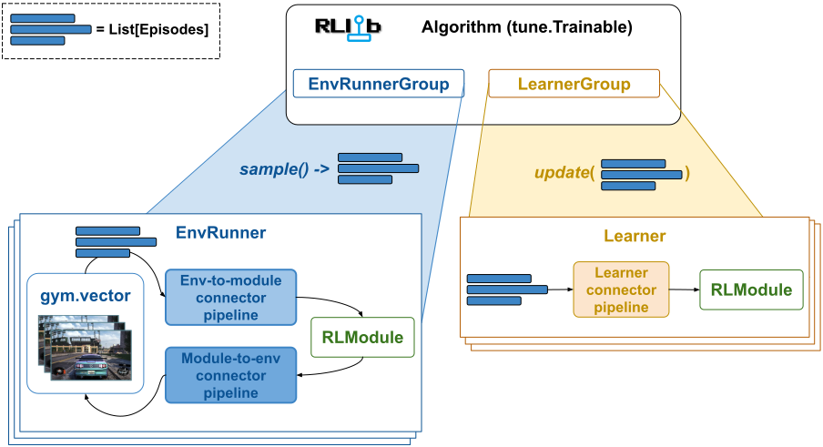

.. include:: /_includes/rllib/we_are_hiring.rst

.. _connector-v2-docs:

ConnectorV2 and ConnectorV2 Pipelines
=====================================

.. toctree::
    :hidden:

    env-to-module-connector
    module-to-env-connector
    learner-connector

.. include:: /_includes/rllib/new_api_stack.rst

.. grid:: 1 2 3 4
    :gutter: 1
    :class-container: container pb-3

    .. grid-item-card::
        :img-top: /rllib/images/connector_v2/connector_v2.svg
        :class-img-top: pt-2 w-75 d-block mx-auto fixed-height-img

        .. button-ref:: connector-v2-docs

            ConnectorV2 overview (this page)

    .. grid-item-card::
        :img-top: /rllib/images/connector_v2/env_to_module_connector.svg
        :class-img-top: pt-2 w-75 d-block mx-auto fixed-height-img

        .. button-ref:: env-to-module-connector-docs

            Env-to-module pipelines

    .. grid-item-card::
        :img-top: /rllib/images/connector_v2/module_to_env_connector.svg
        :class-img-top: pt-2 w-75 d-block mx-auto fixed-height-img

        .. button-ref:: module-to-env-connector-docs

            Module-to-env pipelines

    .. grid-item-card::
        :img-top: /rllib/images/connector_v2/learner_connector.svg
        :class-img-top: pt-2 w-75 d-block mx-auto fixed-height-img

        .. button-ref:: learner-connector-docs

            Learner connector pipelines

RLlib stores and transports all trajectory data in the form of :py:class:`~ray.rllib.env.single_agent_episode.SingleAgentEpisode`
or :py:class:`~ray.rllib.env.multi_agent_episode.MultiAgentEpisode` objects and only translates
this data into tensor batches readable by neural network models right before the model forward pass.

**Connector pipelines** are the components that perform these translations from episodes to batches.

.. figure:: images/connector_v2/generic_connector_pipeline.svg
    :width: 1000
    :align: left

    **Generic ConnectorV2 Pipeline**: All pipelines consist of one or more :py:class:`~ray.rllib.connectors.connector_v2.ConnectorV2` pieces.
    When calling the pipeline, you pass in a list of Episodes, the :py:class:`~ray.rllib.core.rl_module.rl_module.RLModule` instance,
    and a batch, which may be an empty dict at the beginning.
    Each :py:class:`~ray.rllib.connectors.connector_v2.ConnectorV2` piece in the pipeline takes its predecessor's output,
    starting on the left side with the initial empty batch, performs some transformations on the episodes and batch and passes everything
    on to the next piece. Thereby, all :py:class:`~ray.rllib.connectors.connector_v2.ConnectorV2` pieces can read from and write to the
    provided episodes, add any data from these episodes to the batch, or change the data that's already in the batch.
    The pipeline then returns the output batch of the last piece.

Note that the batch output of the pipeline lives only as long as the succeeding
:py:class:`~ray.rllib.core.rl_module.rl_module.RLModule` forward pass or `Env.step()` call. RLlib discards the data afterwards.
The list of episodes, however, may persist longer. For example, if a env-to-module pipeline reads an observation from one episode,
changes that observation, and then writes it back into the episode, the subsequent module-to-env pipeline is able to see this change.
Also, the Learner pipeline operates on those episodes that have already passed through both env-to-module and module-to-env pipelines
and might have undergone changes.

Three ConnectorV2 Pipeline Types
--------------------------------

There are three different types of connector pipelines in RLlib:

1) Env-to-module pipeline, which creates tensor batches for action computing forward passes.
2) Module-to-env pipeline, which translates a model's output into RL environment actions.
3) Learner connector pipeline, which creates the train batch for a model update.

.. tip::

    The :py:class:`~ray.rllib.connectors.connector_v2.ConnectorV2` API is an extremely powerful tool for
    customizing your RLlib experiments and algorithms. It allows you to take full control over accessing, changing, and re-assembling
    the episode data collected from your RL environments or your offline RL input files as well as controlling the exact
    nature and shape of the tensor batches that are fed into your models for computing actions or losses.

    **ConnectorV2 Pipelines**: Connector pipelines convert episodes into batched data
    to be processed by a neural network (env-to-module and Learner) or convert your model's output into actions readable
    by your RL environment (module-to-env).
    The env-to-module pipeline, located on an :py:class:`~ray.rllib.env.env_runner.EnvRunner`, takes a list of
    episodes as input and outputs a batch for an :py:class:`~ray.rllib.core.rl_module.rl_module.RLModule` forward pass
    that computes the next action. The module-to-env pipeline on the same :py:class:`~ray.rllib.env.env_runner.EnvRunner`
    takes the output of that :py:class:`~ray.rllib.core.rl_module.rl_module.RLModule` and converts it into actions
    for the next call to your RL environment's `step()` method.
    Lastly, a Learner connector pipeline, located on a :py:class:`~ray.rllib.core.learner.learner.Learner`
    worker, converts a list of episodes into a train batch for the next :py:class:`~ray.rllib.core.rl_module.rl_module.RLModule` update.

The three pipeline types are discussed in more detail further below, however, all three have in common:

* All connector pipelines are sequences of one or more :py:class:`~ray.rllib.connectors.connector_v2.ConnectorV2` pieces. Nesting is supported, meaning some of the pieces may be connector pipelines themselves.
* All connector pieces and -pipelines are Python callables, overriding the :py:meth:`~ray.rllib.connectors.connector_v2.ConnectorV2.__call__` method.
* The call signatures are uniform across the different pipeline types. The main arguments are the list of episodes, the batch to-be-built, and the :py:class:`~ray.rllib.core.rl_module.rl_module.RLModule` instance. See the :py:meth:`~ray.rllib.connectors.connector_v2.ConnectorV2.__call__` method for more details.
* All connector pipelines can read from and write to the provided list of episodes as well as the batch and thereby perform data transforms as required.

.. Debugging ConnectorV2 Pipelines
.. ===============================

.. TODO (sven): Move the following to the "how to contribute to RLlib" page and rename that page "how to develop, debug and contribute to RLlib?"

.. You can debug your custom ConnectorV2 pipelines (and any RLlib component in general) through the following simple steps:

.. Run without any remote :py:class:`~ray.rllib.env.env_runner.EnvRunner` workers. After defining your :py:class:`~ray.rllib.algorithms.algorithm_config.AlgorithmConfig` object, do: `config.env_runners(num_env_runners=0)`.
.. Run without any remote :py:class:`~ray.rllib.core.learner.learner.Learner` workers. After defining your :py:class:`~ray.rllib.algorithms.algorithm_config.AlgorithmConfig` object, do: `config.learners(num_learners=0)`.
.. Switch off Ray Tune, if applicable. After defining your :py:class:`~ray.rllib.algorithms.algorithm_config.AlgorithmConfig` object, do: `algo = config.build()`, then `while True: algo.train()`.
.. Set a breakpoint in the ConnectorV2 piece (or any other RLlib component) you would like to debug and start the experiment script in your favorite IDE in debugging mode.

.. .. figure:: images/debugging_rllib_in_ide.png
