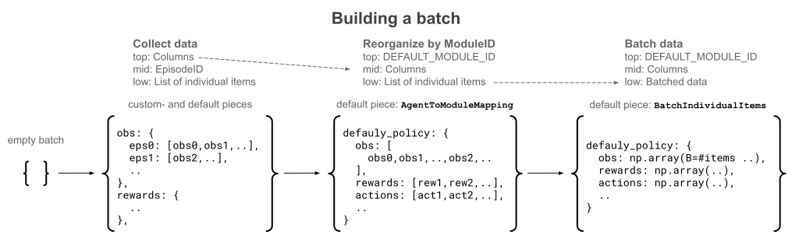
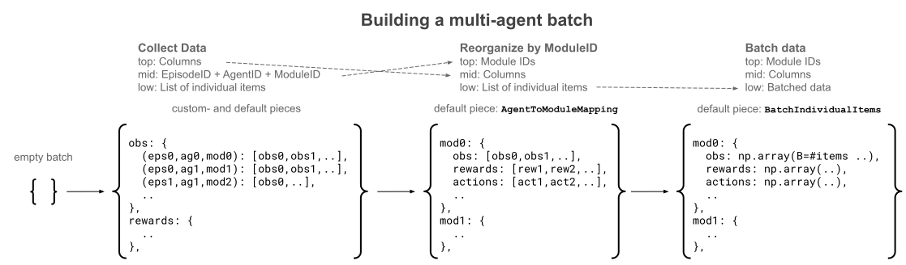
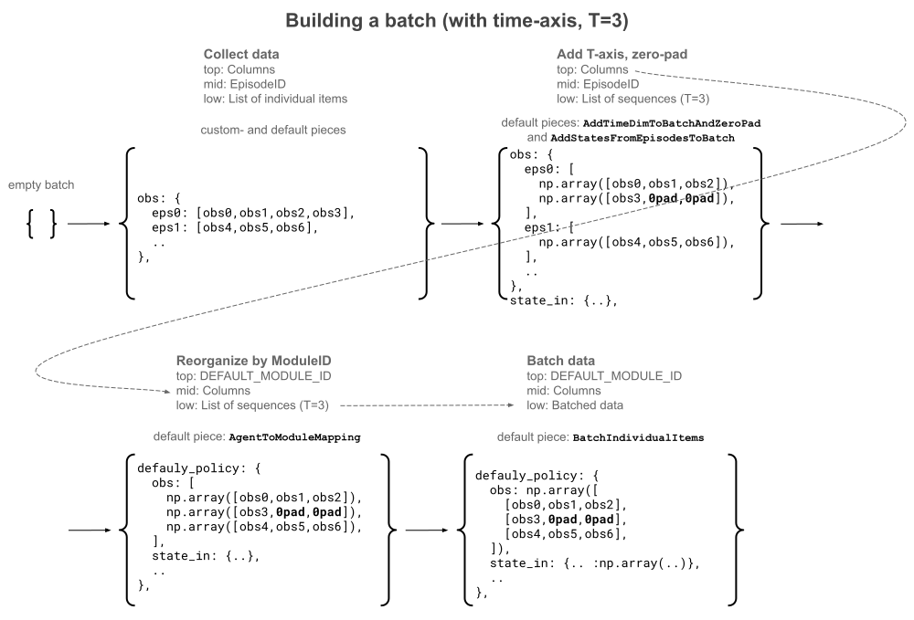

.. include:: /_includes/rllib/we_are_hiring.rst

.. _connector-v2-docs:

.. grid:: 1 2 3 4
    :gutter: 1
    :class-container: container pb-3

    .. grid-item-card::
        :img-top: /rllib/images/connector_v2/connector_generic.svg
        :class-img-top: pt-2 w-75 d-block mx-auto fixed-height-img

        .. button-ref:: connector-v2-docs

            ConnectorV2 overview (this page)

    .. grid-item-card::
        :img-top: /rllib/images/connector_v2/env_to_module_connector.svg
        :class-img-top: pt-2 w-75 d-block mx-auto fixed-height-img

        .. button-ref:: env-to-module-pipeline-docs

            Env-to-module pipelines

    .. grid-item-card::
        :img-top: /rllib/images/connector_v2/learner_connector.svg
        :class-img-top: pt-2 w-75 d-block mx-auto fixed-height-img

        .. button-ref:: learner-pipeline-docs

            Learner connector pipelines

ConnectorV2 and ConnectorV2 pipelines
=====================================

.. toctree::
    :hidden:

    env-to-module-connector
    learner-connector

.. include:: /_includes/rllib/new_api_stack.rst

RLlib stores and transports all trajectory data in the form of :py:class:`~ray.rllib.env.single_agent_episode.SingleAgentEpisode`
or :py:class:`~ray.rllib.env.multi_agent_episode.MultiAgentEpisode` objects.
**Connector pipelines** are the components that translate this episode data into tensor batches
readable by neural network models right before the model forward pass.

.. figure:: images/connector_v2/generic_connector_pipeline.svg
    :width: 1000
    :align: left

    **Generic ConnectorV2 Pipeline**: All pipelines consist of one or more :py:class:`~ray.rllib.connectors.connector_v2.ConnectorV2` pieces.
    When calling the pipeline, you pass in a list of Episodes, the :py:class:`~ray.rllib.core.rl_module.rl_module.RLModule` instance,
    and a batch, which initially might be an empty dict.
    Each :py:class:`~ray.rllib.connectors.connector_v2.ConnectorV2` piece in the pipeline takes its predecessor's output,
    starting on the left side with the batch, performs some transformations on the episodes, the batch, or both, and passes everything
    on to the next piece. Thereby, all :py:class:`~ray.rllib.connectors.connector_v2.ConnectorV2` pieces can read from and write to the
    provided episodes, add any data from these episodes to the batch, or change the data that's already in the batch.
    The pipeline then returns the output batch of the last piece.

.. note::
    Note that the batch output of the pipeline lives only as long as the succeeding
    :py:class:`~ray.rllib.core.rl_module.rl_module.RLModule` forward pass or `Env.step()` call. RLlib discards the data afterwards.
    The list of episodes, however, may persist longer. For example, if a env-to-module pipeline reads an observation from an episode,
    mutates that observation, and then writes it back into the episode, the subsequent module-to-env pipeline is able to see the changed observation.
    Also, the Learner pipeline operates on the same episodes that have already passed through both env-to-module and module-to-env pipelines
    and thus might have undergone changes.

Three ConnectorV2 pipeline types
--------------------------------

There are three different types of connector pipelines in RLlib:

1) :ref:`Env-to-module pipeline <env-to-module-pipeline-docs>`, which creates tensor batches for action computing forward passes.
2) Module-to-env pipeline (documentation pending), which translates a model's output into RL environment actions.
3) :ref:`Learner connector pipeline <learner-pipeline-docs>`, which creates the train batch for a model update.

The :py:class:`~ray.rllib.connectors.connector_v2.ConnectorV2` API is an extremely powerful tool for
customizing your RLlib experiments and algorithms. It allows you to take full control over accessing, changing, and re-assembling
the episode data collected from your RL environments or your offline RL input files as well as controlling the exact
nature and shape of the tensor batches that RLlib feeds into your models for computing actions or losses.

.. figure:: images/connector_v2/location_of_connector_pipelines_in_rllib.svg
    :width: 900
    :align: left

    **ConnectorV2 Pipelines**: Connector pipelines convert episodes into batched data, which your model can process
    (env-to-module and Learner) or convert your model's output into action batches, which your possibly vectorized RL environment needs for
    stepping (module-to-env).
    The env-to-module pipeline, located on an :py:class:`~ray.rllib.env.env_runner.EnvRunner`, takes a list of
    episodes as input and outputs a batch for an :py:class:`~ray.rllib.core.rl_module.rl_module.RLModule` forward pass
    that computes the next action. The module-to-env pipeline on the same :py:class:`~ray.rllib.env.env_runner.EnvRunner`
    takes the output of that :py:class:`~ray.rllib.core.rl_module.rl_module.RLModule` and converts it into actions
    for the next call to your RL environment's `step()` method.
    Lastly, a Learner connector pipeline, located on a :py:class:`~ray.rllib.core.learner.learner.Learner`
    worker, converts a list of episodes into a train batch for the next :py:class:`~ray.rllib.core.rl_module.rl_module.RLModule` update.

The succeeding pages discuss the three pipeline types in more detail, however, all three have in common:

* All connector pipelines are sequences of one or more :py:class:`~ray.rllib.connectors.connector_v2.ConnectorV2` pieces. You can nest these as well, meaning some of the pieces may be connector pipelines themselves.
* All connector pieces and -pipelines are Python callables, overriding the :py:meth:`~ray.rllib.connectors.connector_v2.ConnectorV2.__call__` method.
* The call signatures are uniform across the different pipeline types. The main, mandatory arguments are the list of episodes, the batch to-be-built, and the :py:class:`~ray.rllib.core.rl_module.rl_module.RLModule` instance. See the :py:meth:`~ray.rllib.connectors.connector_v2.ConnectorV2.__call__` method for more details.
* All connector pipelines can read from and write to the provided list of episodes as well as the batch and thereby perform data transforms as required.

Batch construction phases and formats
-------------------------------------

When you push a list of input episodes through a connector pipeline, the pipeline constructs a batch from the given data.
This batch always starts as an empty python dictionary and undergoes different formats and phases while passing through the different
pieces of the pipeline.

The following applies to all :ref:`env-to-module <env-to-module-pipeline-docs>` and learner connector pipelines (documentation in progress).

    **Batch construction phases and formats**: In the standard single-agent case, where only one ModuleID (``DEFAULT_MODULE_ID``) exists,
    the batch starts as an empty dictionary (left) and then undergoes a "collect data" phase, in which connector pieces add individual items
    to the batch by storing them under a) the column name, for example ``obs`` or ``rewards``, and b) under the episode ID, from which they extracted
    the item.
    In most cases, your custom connector pieces operate during this phase. Once all custom pieces have performed their data insertions and transforms,
    the :py:class:`~ray.rllib.connectors.common.agent_to_module_mapping.AgentToModuleMapping` default piece performs a
    "reorganize by ModuleID" operation (center), during which the batch's dictionary hierarchy changes to having the ModuleID (``DEFAULT_MODULE_ID``) at
    the top level and the column names thereunder. On the lowest level in the batch, data items still reside in python lists.
    Finally, the :py:class:`~ray.rllib.connectors.common.batch_individual_items.BatchIndividualItems`  default piece creates NumPy arrays
    out of the python lists, thereby batching all data (right).

For multi-agent setups, where there are more than one ModuleIDs the
:py:class:`~ray.rllib.connectors.common.agent_to_module_mapping.AgentToModuleMapping` default connector piece makes sure that
the constructed output batch maps module IDs to the respective module's forward batch:

    **Batch construction for multi-agent**: In a multi-agent setup, the default :py:class:`~ray.rllib.connectors.common.agent_to_module_mapping.AgentToModuleMapping`
    connector piece reorganizes the batch by ``ModuleID``, then column names, such that a
    :py:class:`~ray.rllib.core.rl_module.multi_rl_module.MultiRLModule` can loop through its sub-modules and provide each with a batch
    for the forward pass.

RLlib's :py:class:`~ray.rllib.core.rl_module.multi_rl_module.MultiRLModule` can split up the forward passes into
individual submodules' forward passes using the individual batches under the respective ``ModuleIDs``.
See :ref:`here for how to write your own multi-module or multi-agent forward logic <implementing-custom-multi-rl-modules>`
and override this default behavior of :py:class:`~ray.rllib.core.rl_module.multi_rl_module.MultiRLModule`.

Finally, if you have a stateful :py:class:`~ray.rllib.core.rl_module.rl_module.RLModule`, for example an LSTM, RLlib adds two additional
default connector pieces to the pipeline, :py:class:`~ray.rllib.connectors.common.add_time_dim_to_batch_and_zero_pad.AddTimeDimToBatchAndZeroPad`
and :py:class:`~ray.rllib.connectors.common.add_states_from_episodes_to_batch.AddStatesFromEpisodesToBatch`:

    **Batch construction for stateful models**: For stateful :py:class:`~ray.rllib.core.rl_module.rl_module.RLModule` instances,
    RLlib automatically adds additional two default connector pieces to the pipeline. The
    :py:class:`~ray.rllib.connectors.common.add_time_dim_to_batch_and_zero_pad.AddTimeDimToBatchAndZeroPad` piece converts all lists of individual data
    items on the lowest batch level into sequences of a fixed length (``max_seq_len``, see note below for how to set this) and automatically zero-pads
    these if it encounters an episode end.
    The :py:class:`~ray.rllib.connectors.common.add_states_from_episodes_to_batch.AddStatesFromEpisodesToBatch` piece adds the previously generated
    ``state_out`` values of your :py:class:`~ray.rllib.core.rl_module.rl_module.RLModule` under the ``state_in`` column name to the batch. Note that
    RLlib only adds the ``state_in`` values for the first timestep in each sequence and therefore also doesn't add a time dimension to the data in the
    ``state_in`` column.

.. note::

    To change the zero-padded sequence length for the :py:class:`~ray.rllib.connectors.common.add_time_dim_to_batch_and_zero_pad.AddTimeDimToBatchAndZeroPad`
    connector, set in your config for custom models:

    .. code-block:: python

        config.rl_module(model_config={"max_seq_len": ...})

    And for RLlib's default models:

    .. code-block:: python

        from ray.rllib.core.rl_module.default_model_config import DefaultModelConfig

        config.rl_module(model_config=DefaultModelConfig(max_seq_len=...))

.. Debugging ConnectorV2 Pipelines
.. ===============================

.. TODO (sven): Move the following to the "how to contribute to RLlib" page and rename that page "how to develop, debug and contribute to RLlib?"

.. You can debug your custom ConnectorV2 pipelines (and any RLlib component in general) through the following simple steps:

.. Run without any remote :py:class:`~ray.rllib.env.env_runner.EnvRunner` workers. After defining your :py:class:`~ray.rllib.algorithms.algorithm_config.AlgorithmConfig` object, do: `config.env_runners(num_env_runners=0)`.
.. Run without any remote :py:class:`~ray.rllib.core.learner.learner.Learner` workers. After defining your :py:class:`~ray.rllib.algorithms.algorithm_config.AlgorithmConfig` object, do: `config.learners(num_learners=0)`.
.. Switch off Ray Tune, if applicable. After defining your :py:class:`~ray.rllib.algorithms.algorithm_config.AlgorithmConfig` object, do: `algo = config.build()`, then `while True: algo.train()`.
.. Set a breakpoint in the ConnectorV2 piece (or any other RLlib component) you would like to debug and start the experiment script in your favorite IDE in debugging mode.

.. .. figure:: images/debugging_rllib_in_ide.png
