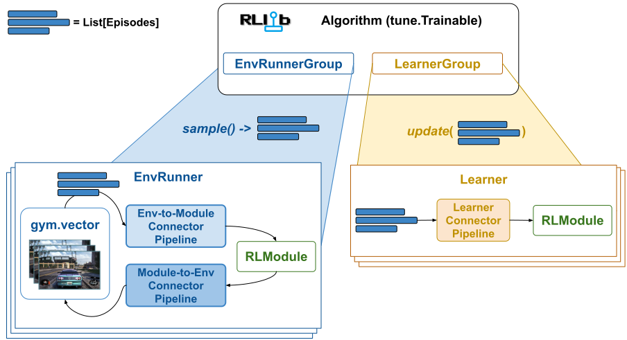

.. include:: /_includes/rllib/we_are_hiring.rst

.. include:: /_includes/rllib/new_api_stack.rst

.. include:: /_includes/rllib/new_api_stack_component.rst

.. _connector-v2-docs:

ConnectorV2 and Connector Pipelines
===================================

As explained in the :ref:`section on Episodes <single-agent-episode-docs>`, RLlib stores and
transports all trajectory data in the form of `Episodes` (single- or multi-agent) and only translates
this data into NN-readable tensor batches right before the model forward pass.

The components that perform such translations (from episodes to batches or from model outputs to
action tensors) are called `connector pipelines`. There are three different types of `connector pipelines`
in RLlib, 1) env-to-module connector pipelines, 2) module-to-env connector pipelines,
and 3) Learner connector pipelines.

.. tip::

    The :py:class:`~ray.rllib.connectors.connector_v2.ConnectorV2` API is an extremely powerful tool for
    customizing your RLlib experiments and algorithms. It allows you to take full control over accessing, changing, and re-assembling
    the data collected from your RL environments or your offline RL input files as well as controlling the exact
    nature and shape of the tensor batches that are fed into your NN models.

    **ConnectorV2 Pipelines**: Connector pipelines convert episode data into batched data
    for processing by a neural network or convert model outputs to actions to be sent to an RL environment.
    An env-to-module pipeline (on an :py:class:`~ray.rllib.env.env_runner.EnvRunner`) takes a list of
    episodes as input and outputs the forward batch used in the :py:class:`~ray.rllib.core.rl_module.rl_module.RLModule`
    on the :py:class:`~ray.rllib.env.env_runner.EnvRunner` to compute the next action. A module-to-env pipeline takes
    an RLModule's output and converts it into actions for the next `step()` call on the RL environment. Lastly,
    a Learner connector pipeline takes a list of episodes as input and outputs the train batch(es) for the
    :py:class:`~ray.rllib.core.rl_module.rl_module.RLModule` sitting on a :py:class:`~ray.rllib.core.learner.learner.Learner`
    worker.

.. hint::

    RLlib is currently in a transition state from old- to new API stack.
    This page only covers the new API stack's :py:class:`~ray.rllib.connectors.connector_v2.ConnectorV2`
    and :py:class:`~ray.rllib.connectors.connector_pipeline_v2.ConnectorPipelineV2` classes. Thus the term "connector" here
    refers to this `ConnectorV2` class and should not be confused with the old API stack's `Connector` and `ConnectorPipeline` classes.

These three pipelines types are discussed further below in more detail, however, all have the following things in common:

* All connector pipelines are sequences of one or more :py:class:`~ray.rllib.connectors.connector_v2.ConnectorV2` pieces, some of which may be another pipeline (nesting is supported).
* All connector pieces (and also any pipeline) are callable overriding the python `__call__` method. When a pipeline is called, the individual pieces therein receive input data and hand their output data to the subsequent piece in the pipeline.
* All connector pipelines are callable and they're called with the same set of arguments, the main ones being a list of episodes, a batch or action tensor to-be-built, and an RLModule instance. See the :py:meth:`~ray.rllib.connectors.connector_v2.ConnectorV2.__call__` method for more details.
* All connector pipelines can read from and write to all the provided episodes and thereby manipulate these episodes as required. The visibility on those episodes is complete, meaning the connector can access any data inside the episode (observations, actions, rewards, RNN-states, etc..) at any timestep.

Three ConnectorV2 Pipeline Types
================================

In the following, the three pipeline types (env-to-module, module-to-env, and learner) are described in more detail.

Env-to-module Pipeline
----------------------

One env-to-module pipeline is located on each :py:class:`~ray.rllib.env.env_runner.EnvRunner` (see figure below) and is responsible for connecting the `gymnasium.Env` with
the EnvRunner's :py:class:`~ray.rllib.core.rl_module.rl_module.RLModule`.
When calling the env-to-module pipeline, a translation from a list of ongoing :ref:`Episode objects <single-agent-episode-docs>` to an
RLModule-readable tensor batch takes place and the output of the pipeline is directly sent into the RLModule's
`forward_inference` or `forward_exploration` method (depending on the user's exploration settings).

.. hint::

    Set `config.exploration(explore=True)` in your :py:class:`~ray.rllib.algorithms.algorithm_config.AlgorithmConfig` to make sure your RLModule's
    :py:meth:`~ray.rllib.core.rl_module.rl_module.RLModule.forward_exploration` method is called with the connector's output.
    Otherwise, the EnvRunner calls :py:meth:`~ray.rllib.core.rl_module.rl_module.RLModule.forward_inference`.
    Note also that usually these two methods only differ in that actions are sampled when `explore=True` and
    greedily picked when `explore=False`. the exact behavior depends on your :ref:`RLModule's implementation <rlmodule-guide>`.

.. figure:: images/connector_v2/env_runner_connector_pipelines.svg
    :width: 1000
    :align: left

    **EnvRunner ConnectorV2 Pipelines**: The env-to-module pipeline sits between the RL environment (gymnasium.Env) and the :py:class:`~ray.rllib.core.rl_module.rl_module.RLModule`,
    translating ongoing episodes into RLModule-readable batches (for the model's `forward_...()` methods).
    The module-to-env pipeline serves the other direction converting the RLModule's outputs (that's action logits,
    action distribution parameters, etc..) to actual actions understandable by the `gymnasium.Env` (for the next `step()` call).

**Default Env-to-Module Behavior:** By default (if the user doesn't configure anything else), an env-to-module pipeline is populated with the following
built-in connector pieces, which perform the following tasks:

* :py:class:`~ray.rllib.connectors.common.add_observations_from_episodes_to_batch.AddObservationsFromEpisodesToBatch`: Places the most recent observation from each ongoing episode into the batch. Note that if you have a vector of `N` environments per `EnvRunner`, your batch size (number of observations) will also be `N`.
* *For stateful models only:* :py:class:`~ray.rllib.connectors.common.add_states_from_episodes_to_batch.AddStatesFromEpisodesToBatch`: Places the most recent state outputs of your module (as new state inputs) into the batch and adds a 1 timestep second axis (axis=1) to all data (to make it sequential).
* *For multi-agent only:* :py:class:`~ray.rllib.connectors.common.agent_to_module_mapping.AgentToModuleMapping`: Maps per-agent data to the respective per-module data depending on the user defined agent-to-module mapping function.
* :py:class:`~ray.rllib.connectors.common.batch_individual_items.BatchIndividualItems`: Now that all data has been placed in the batch, convert the individual batch items into batched data structures.
* :py:class:`~ray.rllib.connectors.common.numpy_to_tensor.NumpyToTensor`: Converts all numpy arrays in the batch into actual framework specific tensors and moves these to the GPU if required.

It's discussed further below :ref:`how users can customize the behavior of the env-to-module pipeline <customizing-connector-v2-pipelines>` by adding any number of `ConnectorV2` pieces to it.

Module-to-env Pipeline
----------------------
One module-to-env pipeline is located on each :py:class:`~ray.rllib.env.env_runner.EnvRunner` (see preceding figure) and is responsible for connecting the
EnvRunner's :py:class:`~ray.rllib.core.rl_module.rl_module.RLModule` with the `gymnasium.Env`.
When calling the module-to-env pipeline, a translation from a model output dict - possibly containing action logits or distribution parameters -
to actual env-readable actions takes place. Note that a model-to-env connector also has access to the same list of ongoing :ref:`Episode objects <single-agent-episode-docs>`
that the env-to-module connector already saw, however, there is usually no need to access them (or write to them) in this pipeline.

The output of the module-to-env pipeline is directly sent to the RL environment (`gymnasium.Env`) for its next `step()` call.

**Default Module-to-Env Behavior:** By default (if the user doesn't configure anything else), an module-to-env pipeline is populated with the following
built-in connector pieces, which perform the following tasks:

* :py:class:`~ray.rllib.connectors.module_to_env.get_actions.GetActions`: Checks, whether the "actions" key is already part of the output data and if not, tries to sample actions from the obligatory "action_dist_inputs" key in the output data.
* :py:class:`~ray.rllib.connectors.common.tensor_to_numpy.TensorToNumpy`: Converts all framework specific tensors in the batch into numpy arrays.
* :py:class:`~ray.rllib.connectors.module_to_env.unbatch_to_individual_items.UnBatchToIndividualItems`: Un-batches all data, meaning converts from NumPy arrays with a batch axis=0 to lists of NumPy arrays w/o such batch axis.
* *For multi-agent only:* :py:class:`~ray.rllib.connectors.common.module_to_agent_unmapping.ModuleToAgentUnmapping`: Maps per-module data back to the respective per-agent data depending on the previously performed agent-to-module mapping.
* *For stateful models only:* :py:class:`~ray.rllib.connectors.module_to_env.remove_single_ts_time_rank_from_batch.RemoveSingleTsTimeRankFromBatch`: Removes a previously added 1 timestep second axis (axis=1) from all data again (done by the `AddStatesFromEpisodesToBatch` piece in the env-to-module pipeline).
* :py:class:`~ray.rllib.connectors.module_to_env.normalize_and_clip_actions.NormalizeAndClipActions`: Translates the computed/sampled actions from their NN range (assumed to be normalized) to the `gymnasium.Env`'s action space or - alternatively - clips the computed/sampled actions to the env's action ranges. Note that this step is only relevant for non-Discrete action spaces.
* :py:class:`~ray.rllib.connectors.module_to_env.listify_data_for_vector_env.NormalizeAndClipActions`: Converts data from the connector pipeline specific format into plain lists, matching in size the `gymnasium.Env` vector.

It's discussed further below :ref:`how users can customize the behavior of the module-to-env pipeline <customizing-connector-v2-pipelines>` by adding any number of `ConnectorV2` pieces to it.

Learner Pipeline
----------------
One learner pipeline is located on each :py:class:`~ray.rllib.core.learner.learner.Learner` worker (see figure below) and is responsible for
compiling the train batch for the :py:class:`~ray.rllib.core.rl_module.rl_module.RLModule` from a list of episodes (trajectory data).

.. figure:: images/connector_v2/learner_connector_pipeline.svg
    :width: 1000
    :align: left

    **Learner ConnectorV2 Pipelines**: A learner connector pipeline sits between the input training data into the Learner worker and its RLModule.
    It translates the input data (episodes) into a train batch (tensor data), readable by the RLModule (`forward_train()` method).

When calling the Learner connector pipeline, a translation from a list of :ref:`Episode objects <single-agent-episode-docs>` to an
RLModule-readable tensor batch (the "train batch") takes place and the output of the pipeline is directly sent into the RLModule's
`forward_train` method.

**Default Learner Pipeline Behavior:** By default (if the user doesn't configure anything else), a Learner connector =pipeline is populated with the following
built-in connector pieces, which perform the following tasks:

* :py:class:`~ray.rllib.connectors.common.add_observations_from_episodes_to_batch.AddObservationsFromEpisodesToBatch`: Places all observations from the incoming episodes into the batch. For example, if you have 2 incoming episodes of length 10 and 20, your resulting train batch size is 30 (10 + 20).
* :py:class:`~ray.rllib.connectors.learner.add_columns_from_episodes_to_batch.AddColumnsFromEpisodesToBatch`: Places all other columns (rewards, actions, terminated flags, etc..) from the incoming episodes into the batch.
* *For stateful models only:* :py:class:`~ray.rllib.connectors.common.add_states_from_episodes_to_batch.AddStatesFromEpisodesToBatch`: Adds a time-dimension of size `max_seq_len` at axis=1 to all data in the batch and (right) zero-pads in cases where episodes end at timesteps non-dividable by `max_seq_len`. You can change `max_seq_len` through your RLModule's `model_config_dict` (call `config.rl_module(model_config_dict={'max_seq_len': ...})` on your :py:class:`~ray.rllib.algorithms.algorithm_config.AlgorithmConfig` object). Also places every `max_seq_len`th state output of your module from the incoming episodes into the train batch (as new state inputs).
* *For multi-agent only:* :py:class:`~ray.rllib.connectors.common.agent_to_module_mapping.AgentToModuleMapping`: Maps per-agent data to the respective per-module data depending on the already determined agent-to-module mapping stored in each (multi-agent) episode.
* :py:class:`~ray.rllib.connectors.common.batch_individual_items.BatchIndividualItems`: Now that all data has been placed in the batch, convert the individual batch items into batched data structures.
* :py:class:`~ray.rllib.connectors.common.numpy_to_tensor.NumpyToTensor`: Converts all numpy arrays in the batch into actual framework specific tensors and moves these to the GPU if required.

It's discussed further below :ref:`how users can customize the behavior of the Learner pipeline <customizing-connector-v2-pipelines>` by adding any number of `ConnectorV2` pieces to it.

.. _customizing-connector-v2-pipelines:

Customizing ConnectorV2 Pipelines
=================================

Any of the three pipeline types can be customized by users through providing a connector
builder function in the main :py:class:`~ray.rllib.algorithms.algorithm_config.AlgorithmConfig` that returns one or more (list of) ConnectorV2 pieces.

Observation Preprocessors
-------------------------

The simplest way of customizing an env-to-module pipeline is to write an
:py:class:`~ray.rllib.connectors.env_to_module.observation_preprocessor.ObservationPreprocessor` and plug
it into the :py:class:`~ray.rllib.algorithms.algorithm_config.AlgorithmConfig`. All you have to do in this case is implement
2 methods:

.. testcode::

    import gymnasium as gym
    import numpy as np

    from ray.rllib.algorithms.ppo import PPOConfig
    from ray.rllib.connectors.env_to_module.observation_preprocessor import ObservationPreprocessor

    class OneHot(ObservationPreprocessor):
        # Converts int observations (Discrete) into one-hot tensors (Box).
        def recompute_observation_space_from_input_spaces(self):
            # Based on the input observation space (), we return the output observation
            # space. Implementing this method is crucial for the pipeline to know its output
            # spaces, which are an important piece of information to construct the succeeding
            # RLModule.
            return gym.spaces.Box(0.0, 1.0, (self.input_observation_space.n), np.float32)

        def preprocess(self, observation):
            # Convert an input observation (int) into a one-hot (float) tensor.
            # Note that 99% of all connectors in RLlib operator in the "numpy space".
            new_obs = np.zeros(shape=(self.input_observation_space.n,), dtype=np.float32)
            new_obs[observation] = 1.0
            return new_obs

    config = (
        PPOConfig()
        # Configure a simple 2x2 frozen lake world.
        # See: https://gymnasium.farama.org/environments/toy_text/frozen_lake/
        .environment("FrozenLake-v1", env_config={"desc": ["SF", "FG"]})
        # Plug our custom connector piece into the env-to-module pipeline.
        .env_runners(env_to_module_connector=lambda env: OneHot())
    )
    algo = config.build()
    # Train one iteration.
    print(algo.train())

Understanding ConnectorV2 Pipelines
-----------------------------------

Before diving into more complex and more powerful customization options of the different
pipeline types, the generic inner workings of a ConnectorV2 pipeline should be explained in more detail first.

    **Generic ConnectorV2 Pipeline**: All pipelines consist of one or more :py:class:`~ray.rllib.connectors.connector_v2.ConnectorV2` pieces.
    When the pipeline is called (for example by an :py:class:`~ray.rllib.env.env_runner.EnvRunner`), a list of Episodes and the
    :py:class:`~ray.rllib.core.rl_module.rl_module.RLModule` instance are provided.
    Each :py:class:`~ray.rllib.connectors.connector_v2.ConnectorV2` in the pipeline takes its predecessor's output
    (starting on the left with an empty batch), performs some transformations on the data and passes it on to the next
    piece in the pipeline. Thereby, all :py:class:`~ray.rllib.connectors.connector_v2.ConnectorV2` pieces can read from and write into the
    provided episodes and add data to the batch. The pipeline then returns the last piece's batch output.

Very importantly, note that the batch output of the pipeline always only lives as long as
the following :py:class:`~ray.rllib.core.rl_module.rl_module.RLModule` forward pass and is discarded right after that.
However, the list of episodes accessible to all :py:class:`~ray.rllib.connectors.connector_v2.ConnectorV2` pieces might survive longer. For example
if a env-to-module pipeline reads an observation from one episodes, changes it, and writes the changed observation
back into the episode, the subsequent module-to-env pipeline sees this change (if it does look at the same
episode and its observations). The same is true for the Learner pipeline: The episodes that it operates on
have already been through both env-to-module and module-to-env pipelines and might have been changed by these.

Writing a more complex custom ConnectorV2
-----------------------------------------

