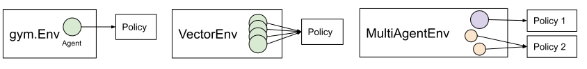

.. include:: /_includes/rllib/announcement.rst

.. include:: /_includes/rllib/we_are_hiring.rst

.. TODO: We need trainers, environments, algorithms, policies, models here. Likely in that order.
    Execution plans are not a "core" concept for users. Sample batches should probably also be left out.

.. _rllib-core-concepts:

Key Concepts
============

On this page, we'll cover the key concepts to help you understand how RLlib works and how to use it.
In RLlib you use `trainers` to train `algorithms`.
These algorithms use `policies` to select actions for your agents.
Given a policy, `evaluation` of a policy produces `sample batches` of experiences.
You can also customize the `execution plans` of your RL experiments.

Trainers
--------

Trainers bring all RLlib components together, making algorithms accessible via RLlib's Python API and its command line interface (CLI).
They manage algorithm configuration, setup of the rollout workers and optimizer, and collection of training metrics.
Trainers also implement the :ref:`Tune Trainable API <tune-60-seconds>` for easy experiment management.

You have three ways to interact with a trainer. You can use the basic Python API or the command line to train it, or you
can use Ray Tune to tune hyperparameters of your reinforcement learning algorithm.
The following example shows three equivalent ways of interacting with the ``PPOTrainer``,
which implements the proximal policy optimization algorithm in RLlib.

.. tabbed:: Basic RLlib Trainer

    .. code-block:: python

        trainer = PPOTrainer(env="CartPole-v0", config={"train_batch_size": 4000})
        while True:
            print(trainer.train())

.. tabbed:: RLlib Command Line

    .. code-block:: bash

        rllib train --run=PPO --env=CartPole-v0 --config='{"train_batch_size": 4000}'

.. tabbed:: RLlib Tune Trainer

    .. code-block:: python

        from ray import tune
        tune.run(PPOTrainer, config={"env": "CartPole-v0", "train_batch_size": 4000})

RLlib `Trainer classes <rllib-concepts.html#trainers>`__ coordinate the distributed workflow of running rollouts and optimizing policies.
Trainer classes leverage parallel iterators to implement the desired computation pattern.
The following figure shows *synchronous sampling*, the simplest of `these patterns <rllib-algorithms.html>`__:

.. figure:: images/a2c-arch.svg

    Synchronous Sampling (e.g., A2C, PG, PPO)

RLlib uses `Ray actors <actors.html>`__ to scale training from a single core to many thousands of cores in a cluster.
You can `configure the parallelism <rllib-training.html#specifying-resources>`__ used for training by changing the ``num_workers`` parameter.
Check out our `scaling guide <rllib-training.html#scaling-guide>`__ for more details here.

Policies
--------

`Policies <rllib-concepts.html#policies>`__ are a core concept in RLlib. In a nutshell, policies are
Python classes that define how an agent acts in an environment.
`Rollout workers <rllib-concepts.html#policy-evaluation>`__ query the policy to determine agent actions.
In a `gym <rllib-env.html#openai-gym>`__ environment, there is a single agent and policy.
In `vector envs <rllib-env.html#vectorized>`__, policy inference is for multiple agents at once,
and in `multi-agent <rllib-env.html#multi-agent-and-hierarchical>`__, there may be multiple policies,
each controlling one or more agents:

Policies can be implemented using `any framework <https://github.com/ray-project/ray/blob/master/rllib/policy/policy.py>`__.
However, for TensorFlow and PyTorch, RLlib has
`build_tf_policy <rllib-concepts.html#building-policies-in-tensorflow>`__ and
`build_torch_policy <rllib-concepts.html#building-policies-in-pytorch>`__ helper functions that let you
define a trainable policy with a functional-style API, for example:

.. TODO: test this code snippet

.. code-block:: python

  def policy_gradient_loss(policy, model, dist_class, train_batch):
      logits, _ = model.from_batch(train_batch)
      action_dist = dist_class(logits, model)
      return -tf.reduce_mean(
          action_dist.logp(train_batch["actions"]) * train_batch["rewards"])

  # <class 'ray.rllib.policy.tf_policy_template.MyTFPolicy'>
  MyTFPolicy = build_tf_policy(
      name="MyTFPolicy",
      loss_fn=policy_gradient_loss)

Policy Evaluation
-----------------

Given an environment and policy, policy evaluation produces `batches <https://github.com/ray-project/ray/blob/master/rllib/policy/sample_batch.py>`__ of experiences. This is your classic "environment interaction loop". Efficient policy evaluation can be burdensome to get right, especially when leveraging vectorization, RNNs, or when operating in a multi-agent environment. RLlib provides a `RolloutWorker <https://github.com/ray-project/ray/blob/master/rllib/evaluation/rollout_worker.py>`__ class that manages all of this, and this class is used in most RLlib algorithms.

You can use rollout workers standalone to produce batches of experiences. This can be done by calling ``worker.sample()`` on a worker instance, or ``worker.sample.remote()`` in parallel on worker instances created as Ray actors (see `WorkerSet <https://github.com/ray-project/ray/blob/master/rllib/evaluation/worker_set.py>`__).

Here is an example of creating a set of rollout workers and using them gather experiences in parallel. The trajectories are concatenated, the policy learns on the trajectory batch, and then we broadcast the policy weights to the workers for the next round of rollouts:

.. code-block:: python

    # Setup policy and rollout workers.
    env = gym.make("CartPole-v0")
    policy = CustomPolicy(env.observation_space, env.action_space, {})
    workers = WorkerSet(
        policy_class=CustomPolicy,
        env_creator=lambda c: gym.make("CartPole-v0"),
        num_workers=10)

    while True:
        # Gather a batch of samples.
        T1 = SampleBatch.concat_samples(
            ray.get([w.sample.remote() for w in workers.remote_workers()]))

        # Improve the policy using the T1 batch.
        policy.learn_on_batch(T1)

        # The local worker acts as a "parameter server" here.
        # We put the weights of its `policy` into the Ray object store once (`ray.put`)...
        weights = ray.put({"default_policy": policy.get_weights()})
        for w in workers.remote_workers():
            # ... so that we can broacast these weights to all rollout-workers once.
            w.set_weights.remote(weights)

Sample Batches
--------------

Whether running in a single process or a `large cluster <rllib-training.html#specifying-resources>`__,
all data in RLlib is interchanged in the form of `sample batches <https://github.com/ray-project/ray/blob/master/rllib/policy/sample_batch.py>`__.
Sample batches encode one or more fragments of a trajectory.
Typically, RLlib collects batches of size ``rollout_fragment_length`` from rollout workers, and concatenates one or
more of these batches into a batch of size ``train_batch_size`` that is the input to SGD.

A typical sample batch looks something like the following when summarized.
Since all values are kept in arrays, this allows for efficient encoding and transmission across the network:

.. code-block:: python

    sample_batch = { 'action_logp': np.ndarray((200,), dtype=float32, min=-0.701, max=-0.685, mean=-0.694),
        'actions': np.ndarray((200,), dtype=int64, min=0.0, max=1.0, mean=0.495),
        'dones': np.ndarray((200,), dtype=bool, min=0.0, max=1.0, mean=0.055),
        'infos': np.ndarray((200,), dtype=object, head={}),
        'new_obs': np.ndarray((200, 4), dtype=float32, min=-2.46, max=2.259, mean=0.018),
        'obs': np.ndarray((200, 4), dtype=float32, min=-2.46, max=2.259, mean=0.016),
        'rewards': np.ndarray((200,), dtype=float32, min=1.0, max=1.0, mean=1.0),
        't': np.ndarray((200,), dtype=int64, min=0.0, max=34.0, mean=9.14)
    }

In `multi-agent mode <rllib-concepts.html#policies-in-multi-agent>`__,
sample batches are collected separately for each individual policy.
These batches are wrapped up together in a ``MultiAgentBatch``,
serving as a container for the individual agents' sample batches.

Execution Plans
---------------

.. TODO all four execution plan snippets below must be tested

Execution plans let you easily express the execution of an RL algorithm as a sequence of steps that
occur either sequentially in the learner, or in parallel across many actors.
Under the hood, RLlib *translates* these plans into ``ray.get()`` and ``ray.wait()`` operations over Ray actors,
so you easily write high-performance algorithms without needing to manage individual low-level Ray actor calls.

Execution plans represent the **dataflow of the RL training job**. For example, the A2C algorithm can be thought
of a sequence of repeating steps, or *dataflow*, of:

 1. ``ParallelRollouts``: Generate experiences from many envs in parallel using rollout workers.
 2. ``ConcatBatches``: The experiences are concatenated into one batch for training.
 3. ``TrainOneStep``: Take a gradient step with respect to the policy loss, and update the worker weights.

In code, this dataflow can be expressed as the following execution plan, which is a static method that can be overridden in your custom Trainer sub-classes to define new algorithms.
It takes in a ``WorkerSet`` and config, and returns an iterator over training results:

.. code-block:: python

    @staticmethod
    def execution_plan(workers: WorkerSet, config: TrainerConfigDict):
        # type: LocalIterator[SampleBatchType]
        rollouts = ParallelRollouts(workers, mode="bulk_sync")

        # type: LocalIterator[(SampleBatchType, List[LearnerStatsDict])]
        train_op = rollouts \
            .combine(ConcatBatches(
                min_batch_size=config["train_batch_size"])) \
            .for_each(TrainOneStep(workers))

        # type: LocalIterator[ResultDict]
        return StandardMetricsReporting(train_op, workers, config)

As you can see, each step returns an *iterator* over objects (if you're unfamiliar with distributed iterators, see Ray's `parallel iterators implementation <https://github.com/ray-project/ray/blob/master/python/ray/util/iter.py>`__).
The reason it is a ``LocalIterator`` is that, though it is based on a parallel computation, the iterator has been turned into one that can be consumed locally in sequence by the program.
A couple other points to note:

 - The reason the plan returns an iterator over training results, is that ``trainer.train()`` is pulling results from this iterator to return as the result of the train call.
 - The rollout workers have been already created ahead of time in the ``WorkerSet``, so the execution plan function is only defining a sequence of operations over the results of the rollouts.

These iterators represent the infinite stream of data items that can be produced from the dataflow.
Each operator (e.g., ``ConcatBatches``, ``TrainOneStep``), executes an operation over each item and returns a transformed item (e.g., concatenated batches, learner stats from training). Finally, some operators such as TrainOneStep have the *side-effect* of updating the rollout worker weights (that's why ``TrainOneStep`` takes the list of worker actors ``workers`` as an argument).

Understanding and Debugging Execution Plans
~~~~~~~~~~~~~~~~~~~~~~~~~~~~~~~~~~~~~~~~~~~

Execution plans are based on Ray `parallel iterators <https://github.com/ray-project/ray/blob/master/python/ray/util/iter.py>`__ and can be inspected similarly. For example, suppose you wanted to print out the intermediate data items during training. This can be done by inserting a print function into the dataflow, e.g., for A2C:

.. code-block:: python

    def debug_print(item):
        print("I saw", type(item))
        return item

    train_op = rollouts \
        .combine(ConcatBatches(
            min_batch_size=config["train_batch_size"])) \
        .for_each(debug_print) \
        .for_each(TrainOneStep(workers))

You'll see output like this on the console:

.. code-block:: bash

    (pid=6555) I saw <class 'ray.rllib.policy.sample_batch.SampleBatch'>
    (pid=6555) I saw <class 'ray.rllib.policy.sample_batch.SampleBatch'>
    (pid=6555) I saw <class 'ray.rllib.policy.sample_batch.SampleBatch'>
    (pid=6555) I saw <class 'ray.rllib.policy.sample_batch.SampleBatch'>

It is important to understand that the iterators of an execution plan are evaluated *lazily*. This means that no computation happens until the `trainer <#trainers>`__ tries to read the next item from the iterator (i.e., get the next training result for a ``Trainer.train()`` call).

Execution Plan Concepts
~~~~~~~~~~~~~~~~~~~~~~~

RLlib provides a library of operators `(GitHub link) <https://github.com/ray-project/ray/tree/master/rllib/execution>`__ that can be used in execution plans.
You can of course write your own operators (which are just normal Python functions).
As a reminder, operators are simply functions (or stateful function objects) that can be chained on the iterator (e.g., the ``debug_print`` operator above).
A few categories of operators are summarized below:

**Rollout ops** (`rollout_ops.py <https://github.com/ray-project/ray/blob/master/rllib/execution/rollout_ops.py>`__):
These are functions for generating and working with experiences, including ``ParallelRollouts`` (for generating experiences synchronously or asynchronously), ``ConcatBatches`` (for combining batches together), ``SelectExperiences`` (for selecting relevant experiences in a multi-agent setting), and ``AsyncGradients`` (for computing gradients over new experiences on the fly, asynchronously, as in A3C).

**Train ops** (`train_ops.py <https://github.com/ray-project/ray/blob/master/rllib/execution/train_ops.py>`__):
These are functions that improve the policy and update workers. The most basic operator, ``TrainOneStep``, take in as input a batch of experiences and emit metrics as output.
Important operators here include ``TrainOneStep``, ``TrainTFMultiGPU`` (for multi-GPU optimization), ``ComputeGradients`` (to compute gradients without updating the policy), and ``ApplyGradients`` (to apply computed gradients to a policy).

**Replay ops** (`replay_ops.py <https://github.com/ray-project/ray/blob/master/rllib/execution/replay_ops.py>`__):
The main operator provided here is ``StoreToReplayBuffer``, which can save experiences batches to either a local replay buffer or a set of distributed replay actors.
It has a counterpart, ``Replay``, that produces a new stream of experiences replayed from one of the aforementioned replay buffers.
Algorithms that use ``StoreToReplayBuffer`` and ``Replay`` are necessarily composed of *multiple sub-dataflows* (different iterators), that are combined with *concurrency ops*.

**Concurrency ops** (`concurrency_ops.py <https://github.com/ray-project/ray/blob/master/rllib/execution/concurrency_ops.py>`__):
The main operator provided here is ``Concurrently``, which composes multiple iterators (dataflows) into a single dataflow by executing them in an interleaved fashion.
The output can be defined to be the mixture of the two dataflows, or filtered to that of one of the sub-dataflows. It has two modes:

    - ``round_robin``: Alternate taking items from each input dataflow.
      This ensures a fixed ratio of computations between, e.g., experience generation and experience replay.
      The ratio can be adjusted by setting ``round_robin_weights``.
    - ``async``: Execute each input dataflow as fast as possible without blocking.
      You might want to use this when, e.g., you want replay to proceed as fast as possible irregardless of how fast experiences are being generated.

**Metric ops** (`metric_ops.py <https://github.com/ray-project/ray/blob/master/rllib/execution/metric_ops.py>`__):
Finally, we provide a ``StandardMetricsReporting`` operator that collects training metrics from the rollout workers in a unified fashion, and returns a stream of training result dicts.
Execution plans should always end with this operator.
This metrics op also reports various internal performance metrics stored by other operators in the shared metrics context accessible via ``_get_shared_metrics()``.

Examples
~~~~~~~~

.. dropdown::  **Example: Asynchrony**

    Suppose we wanted to make the above A2C example asynchronous (i.e., A3C). We would switch the synchronous ``ParallelRollouts`` operator with ``AsyncGradients``, and use ``ApplyGradients`` to apply gradient updates as fast as they are collected. The ``AsyncGradients`` operator is going to execute rollouts in parallel, compute the policy gradient over the new batches (of size ``rollout_fragment_length``) on the remote workers, and then return a stream of the computed gradients:

    .. code-block:: python

        def execution_plan(workers: WorkerSet, config: TrainerConfigDict):
            # type: LocalIterator[(ModelGradients, int)]
            grads = AsyncGradients(workers)

            # type: LocalIterator[_]
            train_op = grads.for_each(ApplyGradients(workers, update_all=False))

            # type: LocalIterator[ResultDict]
            return StandardMetricsReporting(train_op, workers, config)

    See also the `actual A3C implementation <https://github.com/ray-project/ray/blob/master/rllib/agents/a3c/a3c.py>`__.

.. dropdown:: **Example: Replay**

    Let's try adding a replay buffer to A2C. This can be done as follows by inserting store / replay ops and using ``Concurrently`` to compose them together:

    .. code-block:: python

        def execution_plan(workers: WorkerSet, config: TrainerConfigDict):
            # Construct a replay buffer.
            replay_buffer = LocalReplayBuffer(...)

            # type: LocalIterator[_]
            store_op = ParallelRollouts(workers, mode="bulk_sync") \
                .for_each(StoreToReplayBuffer(local_buffer=replay_buffer))

            # type: LocalIterator[(SampleBatchType, List[LearnerStatsDict])]
            replay_op = Replay(local_buffer=replay_buffer) \
                .for_each(TrainOneStep(workers))

            # type: LocalIterator[(SampleBatchType, List[LearnerStatsDict])]
            train_op = Concurrently(
                [store_op, replay_op], mode="round_robin", output_indexes=[1])

            # type: LocalIterator[ResultDict]
            return StandardMetricsReporting(train_op, workers, config)

    Note that here we set ``output_indexes=[1]`` for the ``Concurrently`` operator, which makes it only return results from the replay op. See also the `DQN implementation of replay <https://github.com/ray-project/ray/blob/master/rllib/agents/dqn/dqn.py>`__ for a complete example including the implementation of options such as *training intensity*.

.. dropdown:: **Example: Multi-agent**

    One of the primary motivations behind execution plans, beyond their conciseness, is to enable complex multi-agent training workflows to be easily composed.
    For example, suppose one wanted to, in a multi-agent environment, concurrently train one set of agents with ``DQN``, and another set with ``PPO``.
    This requires stitching together two entirely different distributed dataflows. Fortunately, as we've seen earlier, this is quite simple with the ``Concurrently`` operator.

    Check out the `PPO + DQN multi-agent workflow example <https://github.com/ray-project/ray/blob/master/rllib/examples/two_trainer_workflow.py>`__ for more details.
    One line to pay particular attention to in this example is the use of ``LocalIterator.duplicate()`` to clone the iterator of experiences into two separate iterators,
    which are filtered via ``SelectExperiences`` and then consumed by PPO and DQN sub-dataflows respectively.

.. include:: /_includes/rllib/announcement_bottom.rst
