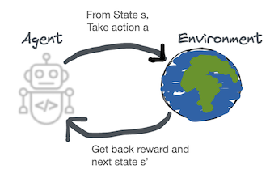
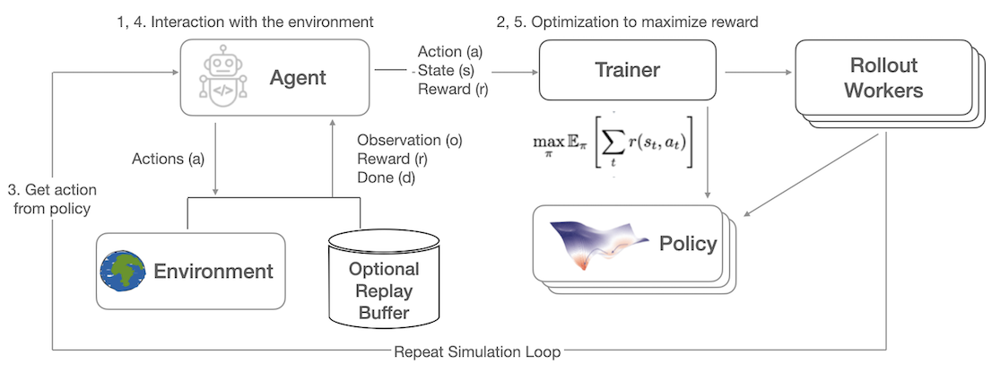

.. include:: /_includes/rllib/announcement.rst

.. include:: /_includes/rllib/we_are_hiring.rst

.. TODO: We need algorithms, environments, policies, models here. Likely in that order.
    Execution plans are not a "core" concept for users. Sample batches should probably also be left out.

.. _rllib-core-concepts:

Key Concepts
============

On this page, we'll cover the key concepts to help you understand how RLlib works and
how to use it. In RLlib, you use ``Algorithm``'s to learn how to solve problem ``environments``.
The algorithms use ``policies`` to select actions. Given a policy,
``rollouts`` throughout an ``environment`` produce
``sample batches`` (or ``trajectories``) of experiences.
You can also customize the ``training_step``\s of your RL experiments.

.. _environments:

Environments
------------

Solving a problem in RL begins with an **environment**. In the simplest definition of RL:

  An **agent** interacts with an **environment** and receives a reward.

An environment in RL is the agent's world, it is a simulation of the problem to be solved.

An RLlib environment consists of: 

1. all possible actions (**action space**)
2. a complete description of the environment, nothing hidden (**state space**)
3. an observation by the agent of certain parts of the state (**observation space**)
4. **reward**, which is the only feedback the agent receives per action.

The model that tries to maximize the expected sum over all future rewards is called a **policy**. The policy is a function mapping the environment's observations to an action to take, usually written **π** (s(t)) -> a(t). Below is a diagram of the RL iterative learning process.

The RL simulation feedback loop repeatedly collects data, for one (single-agent case) or multiple (multi-agent case) policies, trains the policies on these collected data, and makes sure the policies' weights are kept in synch. Thereby, the collected environment data contains observations, taken actions, received rewards and so-called **done** flags, indicating the boundaries of different episodes the agents play through in the simulation.

The simulation iterations of action -> reward -> next state -> train -> repeat, until the end state, is called an **episode**, or in RLlib, a **rollout**.

.. _algorithms:

Algorithms
----------

Algorithms bring all RLlib components together, making learning of different tasks
accessible via RLlib's Python API and its command line interface (CLI).
Each ``Algorithm`` class is managed by its respective ``AlgorithmConfig``, for example to
configure a ``PPO`` instance, you should use the ``PPOConfig`` class.
An ``Algorithm`` sets up its rollout workers and optimizers, and collects training metrics.
``Algorithms`` also implement the :ref:`Tune Trainable API <tune-60-seconds>` for
easy experiment management.

You have three ways to interact with an algorithm. You can use the basic Python API or the command line to train it, or you
can use Ray Tune to tune hyperparameters of your reinforcement learning algorithm.
The following example shows three equivalent ways of interacting with ``PPO``,
which implements the proximal policy optimization algorithm in RLlib.

.. tabbed:: Basic RLlib Algorithm

    .. code-block:: python

        # Configure.
        from ray.rllib.algorithms.ppo import PPOConfig
        config = PPOConfig().environment(env="CartPole-v0").training(train_batch_size=4000)

        # Build.
        algo = config.build()

        # Train.
        while True:
            print(algo.train())

.. tabbed:: RLlib Algorithms and Tune

    .. code-block:: python

        from ray import tune

        # Configure.
        from ray.rllib.algorithms.ppo import PPOConfig
        config = PPOConfig().environment(env="CartPole-v0").training(train_batch_size=4000)

        # Train via Ray Tune.
        tune.run("PPO", config=config)

.. tabbed:: RLlib Command Line

    .. code-block:: bash

        rllib train --run=PPO --env=CartPole-v0 --config='{"train_batch_size": 4000}'

RLlib `Algorithm classes <rllib-concepts.html#algorithms>`__ coordinate the distributed workflow of running rollouts and optimizing policies.
Algorithm classes leverage parallel iterators to implement the desired computation pattern.
The following figure shows *synchronous sampling*, the simplest of `these patterns <rllib-algorithms.html>`__:

.. figure:: images/a2c-arch.svg

    Synchronous Sampling (e.g., A2C, PG, PPO)

RLlib uses `Ray actors <actors.html>`__ to scale training from a single core to many thousands of cores in a cluster.
You can `configure the parallelism <rllib-training.html#specifying-resources>`__ used for training by changing the ``num_workers`` parameter.
Check out our `scaling guide <rllib-training.html#scaling-guide>`__ for more details here.

Policies
--------

`Policies <rllib-concepts.html#policies>`__ are a core concept in RLlib. In a nutshell, policies are
Python classes that define how an agent acts in an environment.
`Rollout workers <rllib-concepts.html#policy-evaluation>`__ query the policy to determine agent actions.
In a `gym <rllib-env.html#openai-gym>`__ environment, there is a single agent and policy.
In `vector envs <rllib-env.html#vectorized>`__, policy inference is for multiple agents at once,
and in `multi-agent <rllib-env.html#multi-agent-and-hierarchical>`__, there may be multiple policies,
each controlling one or more agents:

.. image:: images/multi-flat.svg

Policies can be implemented using `any framework <https://github.com/ray-project/ray/blob/master/rllib/policy/policy.py>`__.
However, for TensorFlow and PyTorch, RLlib has
`build_tf_policy <rllib-concepts.html#building-policies-in-tensorflow>`__ and
`build_torch_policy <rllib-concepts.html#building-policies-in-pytorch>`__ helper functions that let you
define a trainable policy with a functional-style API, for example:

.. TODO: test this code snippet

.. code-block:: python

  def policy_gradient_loss(policy, model, dist_class, train_batch):
      logits, _ = model.from_batch(train_batch)
      action_dist = dist_class(logits, model)
      return -tf.reduce_mean(
          action_dist.logp(train_batch["actions"]) * train_batch["rewards"])

  # <class 'ray.rllib.policy.tf_policy_template.MyTFPolicy'>
  MyTFPolicy = build_tf_policy(
      name="MyTFPolicy",
      loss_fn=policy_gradient_loss)

Policy Evaluation
-----------------

Given an environment and policy, policy evaluation produces `batches <https://github.com/ray-project/ray/blob/master/rllib/policy/sample_batch.py>`__ of experiences. This is your classic "environment interaction loop". Efficient policy evaluation can be burdensome to get right, especially when leveraging vectorization, RNNs, or when operating in a multi-agent environment. RLlib provides a `RolloutWorker <https://github.com/ray-project/ray/blob/master/rllib/evaluation/rollout_worker.py>`__ class that manages all of this, and this class is used in most RLlib algorithms.

You can use rollout workers standalone to produce batches of experiences. This can be done by calling ``worker.sample()`` on a worker instance, or ``worker.sample.remote()`` in parallel on worker instances created as Ray actors (see `WorkerSet <https://github.com/ray-project/ray/blob/master/rllib/evaluation/worker_set.py>`__).

Here is an example of creating a set of rollout workers and using them gather experiences in parallel. The trajectories are concatenated, the policy learns on the trajectory batch, and then we broadcast the policy weights to the workers for the next round of rollouts:

.. code-block:: python

    # Setup policy and rollout workers.
    env = gym.make("CartPole-v0")
    policy = CustomPolicy(env.observation_space, env.action_space, {})
    workers = WorkerSet(
        policy_class=CustomPolicy,
        env_creator=lambda c: gym.make("CartPole-v0"),
        num_workers=10)

    while True:
        # Gather a batch of samples.
        T1 = SampleBatch.concat_samples(
            ray.get([w.sample.remote() for w in workers.remote_workers()]))

        # Improve the policy using the T1 batch.
        policy.learn_on_batch(T1)

        # The local worker acts as a "parameter server" here.
        # We put the weights of its `policy` into the Ray object store once (`ray.put`)...
        weights = ray.put({"default_policy": policy.get_weights()})
        for w in workers.remote_workers():
            # ... so that we can broacast these weights to all rollout-workers once.
            w.set_weights.remote(weights)

Sample Batches
--------------

Whether running in a single process or a `large cluster <rllib-training.html#specifying-resources>`__,
all data in RLlib is interchanged in the form of `sample batches <https://github.com/ray-project/ray/blob/master/rllib/policy/sample_batch.py>`__.
Sample batches encode one or more fragments of a trajectory.
Typically, RLlib collects batches of size ``rollout_fragment_length`` from rollout workers, and concatenates one or
more of these batches into a batch of size ``train_batch_size`` that is the input to SGD.

A typical sample batch looks something like the following when summarized.
Since all values are kept in arrays, this allows for efficient encoding and transmission across the network:

.. code-block:: python

    sample_batch = { 'action_logp': np.ndarray((200,), dtype=float32, min=-0.701, max=-0.685, mean=-0.694),
        'actions': np.ndarray((200,), dtype=int64, min=0.0, max=1.0, mean=0.495),
        'dones': np.ndarray((200,), dtype=bool, min=0.0, max=1.0, mean=0.055),
        'infos': np.ndarray((200,), dtype=object, head={}),
        'new_obs': np.ndarray((200, 4), dtype=float32, min=-2.46, max=2.259, mean=0.018),
        'obs': np.ndarray((200, 4), dtype=float32, min=-2.46, max=2.259, mean=0.016),
        'rewards': np.ndarray((200,), dtype=float32, min=1.0, max=1.0, mean=1.0),
        't': np.ndarray((200,), dtype=int64, min=0.0, max=34.0, mean=9.14)
    }

In `multi-agent mode <rllib-concepts.html#policies-in-multi-agent>`__,
sample batches are collected separately for each individual policy.
These batches are wrapped up together in a ``MultiAgentBatch``,
serving as a container for the individual agents' sample batches.

Training Step Method (``Algorithm.training_step()``)
----------------------------------------------------

.. TODO all training_step snippets below must be tested
.. note::
    It's important to have a good understanding of the basic :ref:`ray core methods <core-walkthrough>` before reading this section.
    Furthermore, we utilize concepts such as the ``SampleBatch`` (and its more advanced sibling: the ``MultiAgentBatch``),
    ``RolloutWorker``, and ``Algorithm``, which can be read about on this page
    and the :ref:`rollout worker reference docs <rolloutworker-reference-docs>`.

    Finally, developers who are looking to implement custom algorithms should familiarize themselves with the :ref:`Policy <rllib-policy-walkthrough>` and
    :ref:`Model <rllib-models-walkthrough>` classes.

What is it?
~~~~~~~~~~~

The ``training_step()`` method of the ``Algorithm`` class defines the repeatable
execution logic that sits at the core of any algorithm. Think of it as the python implementation
of an algorithm's pseudocode you can find in research papers.
You can use ``training_step()`` to express how you want to
coordinate the collection of samples from the environment(s), the movement of this data to other
parts of the algorithm, and the updates and management of your policy's weights
across the different distributed components.

**In short, a developer will need to override/modify the ``training_step`` method if they want to
make custom changes to an existing algorithm, write their own algo from scratch, or implement some algorithm from a paper.**

When is ``training_step()`` invoked?
~~~~~~~~~~~~~~~~~~~~~~~~~~~~~~~~~~~~

The ``Algorithm``'s ``training_step()`` method is called:

 1. when the ``train()`` method of ``Algorithm`` is called (e.g. "manually" by a user that has constructed an ``Algorithm`` instance).
 2. when an RLlib Algorithm is being run by Ray Tune. ``training_step()`` will be continuously called till the
    :ref:`ray tune stop criteria <tune-run-ref>` is met.

Key Subconcepts
~~~~~~~~~~~~~~~

In the following, using the example of VPG ("vanilla policy gradient"), we will try to illustrate
how to use the ``training_step()`` method to implement this algorithm in RLlib.
The "vanilla policy gradient" algo can be thought of as a sequence of repeating steps, or *dataflow*, of:

 1. Sampling (to collect data from an env)
 2. Updating the Policy (to learn a behavior)
 3. Broadcasting the updated Policy's weights (to make sure all distributed units have the same weights again)
 4. Metrics reporting (returning relevant stats from all the above operations with regards to performance and runtime)

An example implementation of VPG could look like the following:

.. code-block:: python

    def training_step(self) -> ResultDict:
        # 1. Sampling.
        train_batch = synchronous_parallel_sample(
                        worker_set=self.workers,
                        max_env_steps=self.config["train_batch_size"]
                    )

        # 2. Updating the Policy.
        train_results = train_one_step(self, train_batch)

        # 3. Synchronize worker weights.
        self.workers.sync_weights()

        # 4. Return results.
        return train_results

.. note::
    Note that the ``training_step`` method is deep learning framework agnostic.
    This means that you should not write PyTorch- or TensorFlow specific code inside this module,
    allowing for a strict separation of concerns and enabling us to use the same ``training_step()``
    method for both TF- and PyTorch versions of your algorithms.
    DL framework specific code should only be added to the
    :ref:`Policy <rllib-policy-walkthrough>` (e.g. in its loss function(s)) and
    :ref:`Model <rllib-models-walkthrough>` (e.g. tf.keras or torch.nn neural network code) classes.

Let's further break down our above ``training_step()`` code.
In the first step, we collect trajectory data from the environment(s):

.. code-block:: python

    train_batch = synchronous_parallel_sample(
                        worker_set=self.workers,
                        max_env_steps=self.config["train_batch_size"]
                    )

Here, ``self.workers`` is a set of ``RolloutWorkers`` that are created in the ``Algorithm``'s ``setup()`` method
(prior to calling ``training_step()``).
This ``WorkerSet`` is covered in greater depth on the :ref:`WorkerSet documentation page <workerset-reference-docs>`.
The utilify function ``synchronous_parallel_sample`` can be used for parallel sampling in a blocking
fashion across multiple rollout workers (returns once all rollout workers are sone sampling).
It returns one final MultiAgentBatch resulting from concatenating n smaller MultiagentBatches
(exactly one from each remote rollout worker).

RLlib includes other utilities, such as the ``AsyncRequestsManager``,
for facilitating the dataflow between various components in parallel, asyncronous fashion.
These utilities are covered in the :ref:`parallel requests documentation <parallel-requests-docs>`.

The ``train_batch`` is then passed to another utility function: ``train_one_step``.

.. code-block:: python

    train_results = train_one_step(self, train_batch)

Methods like ``train_one_step`` and ``multi_gpu_train_one_step`` are used for training our Policy.
Further documentation with examples can be found on the :ref:`train ops documentation page <train-ops-docs>`.

The training updates on the policy are only applied to its version inside ``self.workers.local_worker``.
Note that each WorkerSet has n remote workers and exactly one "local worker" and that each worker (remote and local ones)
holds a copy of the policy.

Now that we updated the local policy (the copy in self.workers.local_worker), we need to make sure
that the copies in all remote workers (self.workers.remote_workers) have their weights synchronized
(from the local one):

.. code-block:: python

    self.workers.sync_weights()

By calling ``self.workers.sync_weights()``,
weights are broadcasted from the local worker to the remote workers. See :ref:`rollout worker
reference docs <rolloutworker-reference-docs>` for further details.

.. code-block:: python

    return train_results

A dictionary is expected to be returned that contains the results of the training update.
It maps keys of type ``str`` to values that are of type ``float`` or to dictionaries of
the same form, allowing for a nested structure.

For example, a results dictionary could map policy_ids to learning and sampling statistics for that policy:

.. code-block:: python

     {
        'policy_1': {
                      'learner_stats': {'policy_loss': 6.7291455},
                      'num_agent_steps_trained': 32
                   },
        'policy_2': {
                     'learner_stats': {'policy_loss': 3.554927},
                     'num_agent_steps_trained': 32
                   },
     }

Training Step Method Utilities
~~~~~~~~~~~~~~~~~~~~~~~~~~~~~~

RLlib provides a collection of utilities that abstract away common tasks in RL training.
In particular, if you would like to work with the various ``training_step`` methods or implement your
own, it's recommended to familiarize yourself first with these following concepts here:

`Sample Batch <core-concepts.html#sample-batches>`__:
``SampleBatch`` and ``MultiAgentBatch`` are the two types that we use for storing trajectory data in RLlib. All of our
RLlib abstractions (policies, replay buffers, etc.) operate on these two types.

:ref:`Rollout Workers <rolloutworker-reference-docs>`:
Rollout workers are an abstraction that wraps a policy (or policies in the case of multi-agent) and an environment.
From a high level, we can use rollout workers to collect experiences from the environment by calling
their ``sample()`` method and we can train their policies by calling their ``learn_on_batch()`` method.
By default, in RLlib, we create a set of workers that can be used for sampling and training.
We create a ``WorkerSet`` object inside of ``setup`` which is called when an RLlib algorithm is created. The ``WorkerSet`` has a ``local_worker``
and ``remote_workers`` if ``num_workers > 0`` in the experiment config. In RLlib we typically use ``local_worker``
for training and ``remote_workers`` for sampling.

:ref:`Train Ops <train-ops-docs>`:
These are methods that improve the policy and update workers. The most basic operator, ``train_one_step``, takes in as
input a batch of experiences and emits a ``ResultDict`` with metrics as output. For training with GPUs, use
``multi_gpu_train_one_step``. These methods use the ``learn_on_batch`` method of rollout workers to complete the
training update.

:ref:`Replay Buffers <replay-buffer-reference-docs>`:
RLlib provides `a collection <https://github.com/ray-project/ray/tree/master/rllib/utils/replay_buffers>`__ of replay
buffers that can be used for storing and sampling experiences.

:ref:`Parallel Request Utilities <parallel-requests-docs>`:
RLlib provides a collection of concurrency ops that can be asynchronous and synchronous operations in the training loop.
``AsyncRequestsManager`` is used for launching and managing asynchronous requests on actors. Currently, in RLlib, it is
used for asynchronous sampling on rollout workers and asynchronously adding to and sampling from replay buffer actors.
``synchronous_parallel_sample`` has a more narrow but common usage of synchronously sampling from a set of rollout workers.

