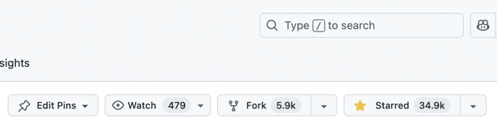

.. include:: /_includes/rllib/we_are_hiring.rst

.. _rllib-developing-and-debugging-docs:

Developing with RLlib and debugging
===================================

.. include:: /_includes/rllib/new_api_stack.rst

This page teaches you how to set up Ray RLlib for development. It walks you through cloning your own github fork,
installing Ray, setting up RLlib so you can modify and customize your own code, creating a pull request (PR),
debugging RLlib code, and clearing and re-installing Ray and RLlib in case of problems with your installation or setup.

Forking the git repository
--------------------------

First, create your own repository fork using your github account.

    Click on the "fork" button to create your own Ray repository fork under your git username.
    You have to create a git account first in order to do so.

Then, download the forked files to your local computer and change into the automatically created ``ray`` directory.

.. code-block:: bash

    git clone https://github.com/<your git username>/ray
    cd ray

The RLlib team recommends using a python environment management tool, like `Anaconda <https://www.anaconda.com/download>`__ to easily
switch between different python and package versions. Take a moment to make sure you are using such a tool
and have activate the correct development environment, including your preferred python version.

Pip installing Ray and RLlib
----------------------------

Next, pip install `Ray <https://docs.ray.io/en/latest/>`__, `PyTorch <https://pytorch.org>`__,
and a few `Farama <https://gymnasium.farama.org>`__ dependencies to be able to run most of RLlib's examples and benchmarks:

.. code-block:: bash

    pip install "ray[rllib]" torch "gymnasium[atari,accept-rom-license,mujoco]"

The preceding commands install the latest stable release of Ray on your system. To further advance to Ray's master branch,
copy the correct `installation link from here <https://docs.ray.io/en/master/ray-overview/installation.html#daily-releases-nightlies>`__,
depending on your system and python version and run the following commands:

.. code-block:: bash

    pip install -U <copied link from https://docs.ray.io/en/master/ray-overview/installation.html#daily-releases-nightlies>

.. note::
    You now have installed Ray through ``pip``, however, the installed package has no connection whatsoever with the
    downloaded source files from your github fork. To link them into one installation, in which you can edit source files
    and immediately see the effects of your changes for development and debugging purposes,
    :ref:`see the next paragraph here<rllib-developing-and-debugging-setup-dev>`.

.. _rllib-developing-and-debugging-setup-dev:

Setting up RLlib for development
--------------------------------

You can develop RLlib and edit its source files locally without compiling Ray through using the
`setup-dev.py script <https://github.com/ray-project/ray/blob/master/python/ray/setup-dev.py>`__:

.. code-block:: bash

    $ python python/ray/setup-dev.py
    NOTE: Use '-y' to override all python files without confirmation.
    This will replace:
    /Users/sven/anaconda3/envs/ray2/lib/python3.11/site-packages/ray/rllib
    with a symlink to:
    /Users/sven/Dropbox/Projects/ray/rllib [Y/n]:

Enter `Y` on the prompt, then abort the script through pressing ``CTRL + C`` repeatedly until you return to the command prompt.

This sets up symbolic links between the ``ray/rllib`` dir of your local git clone and the respective directory bundled with the pip-installed ``ray`` package.
This way, every change you make in the source files in your local git clone will immediately be reflected in your installed ``ray`` as well.

.. note::
    If you have installed ray from source using `these instructions here <https://docs.ray.io/en/master/ray-overview/installation.html>`__,
    don't run the ``setup-dev.py`` script, because this should have already created the necessary symbolic links.

Testing your installation
~~~~~~~~~~~~~~~~~~~~~~~~~

Run a quick check on whether the above pip-installation and git repository symbolic linking  was successful:

.. code-block:: bash

    $ python

    >>> from ray.rllib.algorithms.ppo import PPOConfig
    >>> ppo = PPOConfig().environment("CartPole-v1").build()
    >>> ppo.train()

The above should result in a large print out of training results in your console.

Keeping your master-branch and installation up to date
~~~~~~~~~~~~~~~~~~~~~~~~~~~~~~~~~~~~~~~~~~~~~~~~~~~~~~

When using the `setup-dev.py script <https://github.com/ray-project/ray/blob/master/python/ray/setup-dev.py>`__,
make sure that your git branch is in sync with the installed Ray binaries, meaning you are up-to-date on `master <https://github.com/ray-project/ray>`__
and have the latest `wheel <https://docs.ray.io/en/master/ray-overview/installation.html#daily-releases-nightlies>`__ installed.

The Ray team recommends to set up your own Ray fork on your local computer as ``origin`` and the Ray team's main repository as ``upstream``:

.. code-block:: bash

    git remote add origin https://github.com/[your git username]/ray
    git remote add upstream https://github.com/ray-project/ray
    git fetch

From time to time you should pull from the Ray team's `master branch <https://github.com/ray-project/ray>`__, no matter, which
PR or branch you are currently developing in. The Ray repository moves very fast and several dozen changes may be merged into it every day:

Run the following whenever you want to continue developing on your current branch or PR:

.. code-block:: bash

    git pull upstream master

Cleaning up and reinstalling your setup
+++++++++++++++++++++++++++++++++++++++

In case you observe strange error messages that are coming from parts of the code you have not altered, you may have to clean up and reinstall
Ray in your environment. These errors might come from Ray libraries, other than RLlib, that the Ray team has recently changed and that are now
conflicting with either the pip-installed Ray or with RLlib's source code.

.. warning::
    Before you perform the following steps, make sure you have everything committed and pushed to git. Your local branch should be free
    of any uncommitted changes!

.. code-block:: bash

    pip uninstall -y ray
    rm -rf <your pip-installed ray directory>  # only, if it's still there for some reason after the uninstall
    pip install -U <pick right wheel from https://docs.ray.io/en/master/ray-overview/installation.html#daily-releases-nightlies>
    git stash
    python python/ray/setup-dev.py  # <- only say `Y` to linking RLlib, then press CTRL+C to abort the script

Modifying your own RLlib branch
-------------------------------

To create a new branch

You can now start coding and modifying your own against RLlib

API Stability
+++++++++++++

Objects and methods annotated with ``@PublicAPI``, ``@DeveloperAPI``, or ``@OldAPIStack`` have the following
API compatibility guarantees:

.. autofunction:: ray.util.annotations.PublicAPI
    :noindex:

.. autofunction:: ray.util.annotations.DeveloperAPI
    :noindex:

.. autofunction:: ray.rllib.utils.annotations.OldAPIStack
    :noindex:

Contributing to RLlib and creating a pull request
-------------------------------------------------

The Ray team is grateful for any external help we can get from the open-source community in maintaining and developing RLlib.

To create a pull request, branch out from ``master``, give your new branch a meaningful name:

.. code-block:: bash

    git checkout -b <name of your new branch>
    git branch  # verify your new branch

Then start editing RLlib's source files and run your scripts.
When you are done coding, commit your changes and push them back to your forked repository of Ray (``origin``).

.. code-block:: bash

    git push -u origin <name of your new branch>

Click this link here to `create a new pull request on the github website <https://github.com/ray-project/ray/pulls/>`__.
Your pushed branch should be highlighted in yellow:

Contributing Fixes and Enhancements
~~~~~~~~~~~~~~~~~~~~~~~~~~~~~~~~~~~

Feel free to file new RLlib-related PRs through `Ray's github repo <https://github.com/ray-project/ray/pulls>`__.
If you are unsure about how to structure your bug-fix or enhancement-PRs, create a small PR first,
then ask questions to the team within its conversation section.

See here for an `example of a good first community PR <https://github.com/ray-project/ray/pull/46317>`__.

New Features
++++++++++++

New feature developments, discussions, and upcoming priorities are tracked on the
`GitHub issues page <https://github.com/ray-project/ray/issues>`__ (note that this may not include all development efforts).

Contributing Algorithms
+++++++++++++++++++++++

These are the guidelines for merging new algorithms into RLlib.
We distinguish between two levels of contributions: As an `example script <https://github.com/ray-project/ray/tree/master/rllib/examples>`__
(possibly with additional classes in other files)
or as a fully-integrated RLlib Algorithm in `rllib/algorithms <https://github.com/ray-project/ray/tree/master/rllib/algorithms>`__.

* Example Algorithms:
    - must subclass Algorithm and implement the ``training_step()`` method
    - must include the main example script, in which the algo is demoed, in a CI test, which proves that the algo is learning a certain task.
    - should offer functionality not present in existing algorithms

* Fully integrated Algorithms have the following additional requirements:
    - must offer substantial new functionality not possible to add to other algorithms
    - should support custom RLModules
    - should use RLlib abstractions and support distributed execution
    - should include at least one `tuned hyperparameter example <https://github.com/ray-project/ray/tree/master/rllib/tuned_examples>`__, testing of which is part of the CI

Both integrated and contributed algorithms ship with the ``ray`` PyPI package, and are tested as part of Ray's automated tests.

Debugging RLlib
---------------

The fastest way to find and fix bugs in RLlib and your custom code is to use a locally installed IDE,
such as `PyCharm <https://www.jetbrains.com/pycharm/>`__ or `VS Code <https://code.visualstudio.com/>`__.

We strongly recommend to install either one of these software first, before you start your journey into developing
with RLlib. Even though, Ray and RLlib are distributed and best unfold all of their potential in production on large,
multi-node clusters, it's often helpful to start running your programs locally on your laptop or desktop machine and see,
whether - roughly - it works as intended. Even if your local setup doesn't have some compute resources that are absolutely
crucial for the actual training rund to succeed (and not take forever), most bugs already surface in the simplest of
setups, for example in a single, local process running on the CPU.

To change your config, such that your RLlib program runs in such local setup, you should - before anything else -try
the following settings.

Finding memory leaks in EnvRunner actors
~~~~~~~~~~~~~~~~~~~~~~~~~~~~~~~~~~~~~~~~

Keeping the memory usage of long running workers stable can be challenging. The ``MemoryTrackingCallbacks`` class can be used to track memory usage of workers.

.. autoclass:: ray.rllib.algorithms.callbacks.MemoryTrackingCallbacks

The objects with the top 20 memory usage in the workers are added as custom metrics. These can then be monitored using tensorboard or other metrics integrations like Weights & Biases:

.. image:: images/MemoryTrackingCallbacks.png

Episode traces
~~~~~~~~~~~~~~

You can use the `data output API <rllib-offline.html>`__ to save episode traces
for debugging. For example, the following command will run PPO while saving episode
traces to ``/tmp/debug``.

.. code-block:: bash

    cd rllib/tuned_examples/ppo
    python cartpole_ppo.py --output /tmp/debug

    # episode traces will be saved in /tmp/debug, for example
    output-2019-02-23_12-02-03_worker-2_0.json
    output-2019-02-23_12-02-04_worker-1_0.json

Log verbosity
~~~~~~~~~~~~~

You can control the log level through the ``--log_level`` command line argument in most of RLlib's example and tuned example scripts.
Valid values are "DEBUG", "INFO", "WARN", and "ERROR". This can be used to increase or decrease the verbosity of internal logging.

The default log level is ``WARN``, but you should use at least the ``INFO`` level logging for development.

For example:

.. code-block:: bash

    cd rllib/tuned_examples/ppo
    python atari_ppo.py --env ALE/Pong-v5 --log-level DEBUG

To set the log level in your :py:class:`~ray.rllib.algorithms.algorithm.Algorithm.AlgorithmConfig` instance,
use the :py:meth:`~ray.rllib.algorithms.algorithm.Algorithm.AlgorithmConfig.debugging` method and set the ``log_level`` argument in there:

.. code-block:: python

    config.debugging(log_level="INFO")

Stack traces
~~~~~~~~~~~~

You can use the ``ray stack`` command to dump the stack traces of all the Python workers on a single node. This can be useful for debugging unexpected
hangs or performance issues.

Troubleshooting
~~~~~~~~~~~~~~~

If you encounter errors like
`blas_thread_init: pthread_create: Resource temporarily unavailable` when using many workers,
try setting ``OMP_NUM_THREADS=1``. Similarly, check configured system limits with
`ulimit -a` for other resource limit errors.

For debugging unexpected hangs or performance problems, you can run ``ray stack`` to dump
the stack traces of all Ray workers on the current node, ``ray timeline`` to dump
a timeline visualization of tasks to a file, and ``ray memory`` to list all object
references in the cluster.

Next steps
----------

- To check how your application is doing, you can use the :ref:`Ray dashboard <observability-getting-started>`.
