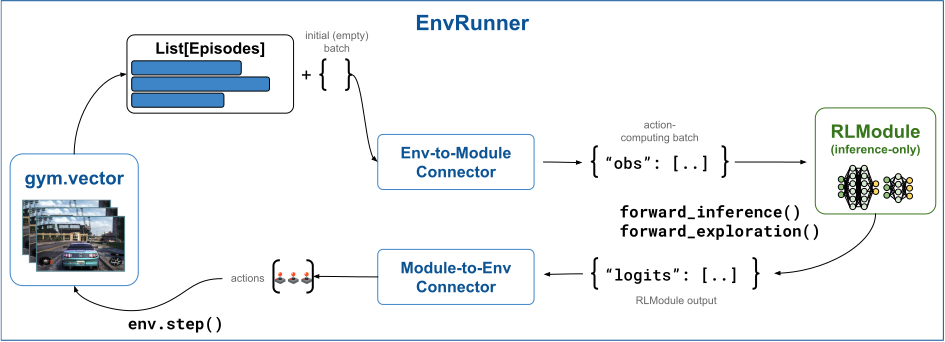
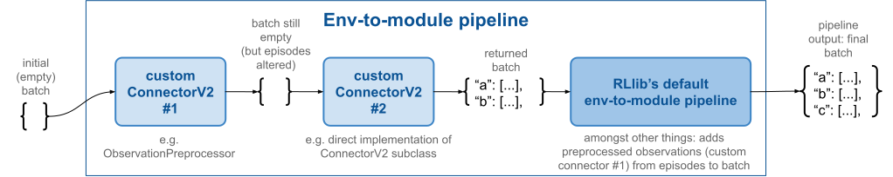

.. include:: /_includes/rllib/we_are_hiring.rst

.. _env-to-module-pipeline-docs:

.. grid:: 1 2 3 4
    :gutter: 1
    :class-container: container pb-3

    .. grid-item-card::
        :img-top: /rllib/images/connector_v2/connector_generic.svg
        :class-img-top: pt-2 w-75 d-block mx-auto fixed-height-img

        .. button-ref:: connector-v2-docs

            ConnectorV2 overview

    .. grid-item-card::
        :img-top: /rllib/images/connector_v2/env_to_module_connector.svg
        :class-img-top: pt-2 w-75 d-block mx-auto fixed-height-img

        .. button-ref:: env-to-module-pipeline-docs

            Env-to-module pipelines (this page)

    .. grid-item-card::
        :img-top: /rllib/images/connector_v2/learner_connector.svg
        :class-img-top: pt-2 w-75 d-block mx-auto fixed-height-img

        .. button-ref:: learner-pipeline-docs

            Learner pipelines

Env-to-module pipelines
=======================

.. include:: /_includes/rllib/new_api_stack.rst

On each :py:class:`~ray.rllib.env.env_runner.EnvRunner` resides one env-to-module pipeline
responsible for handling the data flow from the `gymnasium.Env <https://gymnasium.farama.org/api/env/>`__ to the :py:class:`~ray.rllib.core.rl_module.rl_module.RLModule`.

    **EnvRunner ConnectorV2 Pipelines**: Both env-to-module and module-to-env pipelines are located on the :py:class:`~ray.rllib.env.env_runner.EnvRunner`
    workers. The env-to-module pipeline sits between the RL environment, a `gymnasium.Env <https://gymnasium.farama.org/api/env/>`__, and the
    :py:class:`~ray.rllib.core.rl_module.rl_module.RLModule`, and translates ongoing episodes into batches for the model's `forward_...()` methods.

.. The module-to-env pipeline serves the other direction, converting the output of the :py:class:`~ray.rllib.core.rl_module.rl_module.RLModule`, such as action logits and action distribution parameters, to actual actions understandable by the `gymnasium.Env <https://gymnasium.farama.org/api/env/>`__ and used in the env's next `step()` call.

The env-to-module pipeline, when called, performs transformations from a list of ongoing :ref:`Episode objects <single-agent-episode-docs>` to an
``RLModule``-readable tensor batch and RLlib passes this generated batch as the first argument into the
:py:meth:`~ray.rllib.core.rl_module.rl_module.RLModule.forward_inference` or :py:meth:`~ray.rllib.core.rl_module.rl_module.RLModule.forward_exploration`
methods of the :py:class:`~ray.rllib.core.rl_module.rl_module.RLModule`, depending on your exploration settings.

.. hint::

    Set `config.exploration(explore=True)` in your :py:class:`~ray.rllib.algorithms.algorithm_config.AlgorithmConfig` to have RLlib call the
    :py:meth:`~ray.rllib.core.rl_module.rl_module.RLModule.forward_exploration` method with the connector's output.
    Otherwise, RLlib calls :py:meth:`~ray.rllib.core.rl_module.rl_module.RLModule.forward_inference`.
    Note also that normally these two methods only differ in that actions are sampled when ``explore=True`` and
    greedily picked when ``explore=False``. However, the exact behavior in each case depends on your :ref:`RLModule's implementation <rlmodule-guide>`.

.. _default-env-to-module-pipeline:

Default env-to-module behavior
------------------------------

By default RLlib populates every env-to-module pipeline with the following built-in connector pieces.

* :py:class:`~ray.rllib.connectors.common.add_observations_from_episodes_to_batch.AddObservationsFromEpisodesToBatch`: Places the most recent observation from each ongoing episode into the batch. The column name is ``obs``. Note that if you have a vector of ``N`` environments per :py:class:`~ray.rllib.env.env_runner.EnvRunner`, your batch size is also ``N``.
* *Relevant for stateful models only:* :py:class:`~ray.rllib.connectors.common.add_time_dim_to_batch_and_zero_pad.AddTimeDimToBatchAndZeroPad`: If the :py:class:`~ray.rllib.core.rl_module.rl_module.RLModule` is stateful, adds a single timestep, second axis to all data to make it sequential.
* *Relevant for stateful models only:* :py:class:`~ray.rllib.connectors.common.add_states_from_episodes_to_batch.AddStatesFromEpisodesToBatch`: If the :py:class:`~ray.rllib.core.rl_module.rl_module.RLModule` is stateful, places the most recent state outputs of the module as new state inputs into the batch. The column name is ``state_in`` and the values don't have a time-dimension.
* *For multi-agent only:* :py:class:`~ray.rllib.connectors.common.agent_to_module_mapping.AgentToModuleMapping`: Maps per-agent data to the respective per-module data depending on your defined agent-to-module mapping function.
* :py:class:`~ray.rllib.connectors.common.batch_individual_items.BatchIndividualItems`: Converts all data in the batch, which thus far are lists of individual items, into batched structures meaning NumPy arrays, whose 0th axis is the batch axis.
* :py:class:`~ray.rllib.connectors.common.numpy_to_tensor.NumpyToTensor`: Converts all NumPy arrays in the batch into framework specific tensors and moves these to the GPU, if required.

You can disable all the preceding default connector pieces by setting `config.env_runners(add_default_connectors_to_env_to_module_pipeline=False)`
in your :ref:`algorithm config <rllib-algo-configuration-docs>`.

Note that the order of these transforms is very relevant for the functionality of the pipeline.
See :ref:`here on how to write and add your own connector pieces <writing_custom_env_to_module_connectors>` to the pipeline.

Constructing an env-to-module connector
---------------------------------------

Normally, you wouldn't have to construct the env-to-module connector pipeline yourself. RLlib's :py:class:`~ray.rllib.env.env_runner.EnvRunner`
actors initially perform this operation. However, if you would like to test or debug either the default pipeline or a custom one,
use the following code snippet as a starting point:

.. testcode::

    import gymnasium as gym

    from ray.rllib.algorithms.ppo import PPOConfig
    from ray.rllib.env.single_agent_episode import SingleAgentEpisode

    # Start with an algorithm config.
    config = (
        PPOConfig()
        .environment("CartPole-v1")
    )
    # Create an env to generate some episode data.
    env = gym.make("CartPole-v1")

    # Build the env-to-module connector through the config object.
    env_to_module = config.build_env_to_module_connector(env=env, spaces=None)

Alternatively, in case there is no ``env`` object available, you should pass in the ``spaces`` argument instead.
RLlib requires either of these pieces of information to compute the correct output observation space of the pipeline, so that the
:py:class:`~ray.rllib.core.rl_module.rl_module.RLModule` can receive the correct input space for its own setup procedure.
The structure of the `spaces` argument should ideally be:

.. code-block:: python

    spaces = {
        "__env__": ([env observation space], [env action space]),  # <- may be vectorized
        "__env_single__": ([env observation space], [env action space]),  # <- never vectorized!
        "[module ID, e.g. 'default_policy']": ([module observation space], [module action space]),
        ...  # <- more modules in multi-agent case
    }

However, for single-agent cases, it may be enough to provide the non-vectorized, single observation-
and action spaces only:

.. testcode::

    # No `env` available? Use `spaces` instead:
    env_to_module = config.build_env_to_module_connector(
        env=None,
        spaces={
            # At minimum, pass in a 2-tuple of the single, non-vectorized
            # observation- and action spaces:
            "__env_single__": (env.observation_space, env.action_space),
        },
    )

To test the actual behavior or the created pipeline, look at these code snippets
for stateless- and stateful :py:class:`~ray.rllib.core.rl_module.rl_module.RLModule` cases:

.. tab-set::

    .. tab-item:: Stateless RLModule

        .. testcode::

            from ray.rllib.env.single_agent_episode import SingleAgentEpisode

            # Create two SingleAgentEpisode instances. You pass these to the connector pipeline
            # as input.
            episode1 = SingleAgentEpisode()
            episode2 = SingleAgentEpisode()

            # Fill episodes with some data, as if we were currently stepping through them
            # to collect samples.
            # - episode 1 (two timesteps)
            obs, _ = env.reset()
            episode1.add_env_reset(observation=obs)
            action = 0
            obs, _, _, _, _ = env.step(action)
            episode1.add_env_step(observation=obs, action=action, reward=1.0)
            # - episode 2 (just one timestep)
            obs, _ = env.reset()
            episode2.add_env_reset(observation=obs)

            # Call the connector on the two running episodes.
            batch = {}
            batch = env_to_module(
                episodes=[episode1, episode2],
                batch=batch,
                rl_module=None,  # in stateless case, RLModule is not strictly required
                explore=True,
            )
            # Print out the resulting batch.
            print(batch)

    .. tab-item:: Stateful RLModule (RNN)

        .. testcode::

            from ray.rllib.core.rl_module.default_model_config import DefaultModelConfig
            from ray.rllib.env.single_agent_episode import SingleAgentEpisode

            # Alter the config to use the default LSTM model of RLlib.
            config.rl_module(model_config=DefaultModelConfig(use_lstm=True))

            # For stateful RLModules, we do need to pass in the RLModule to every call to the
            # connector. so construct an instance here.
            rl_module_spec = config.get_rl_module_spec(env=env)
            rl_module = rl_module_spec.build()

            # Create a SingleAgentEpisode instance. You pass this to the connector pipeline
            # as input.
            episode = SingleAgentEpisode()

            # Initialize episode with first (reset) observation.
            obs, _ = env.reset()
            episode.add_env_reset(observation=obs)

            # Call the connector on the running episode.
            batch = {}
            batch = env_to_module(
                episodes=[episode],
                batch=batch,
                rl_module=rl_module,  # in stateful case, RLModule is required
                explore=True,
            )
            # Print out the resulting batch.
            print(batch)

You can see that the pipeline extracted the current observations from the two
running episodes and placed them under the ``obs`` column into the forward batch.
The batch has a size of two, because we had two episodes, and should look similar to this:

.. code-block:: text

    {'obs': tensor([[ 0.0212, -0.1996, -0.0414,  0.2848],
            [ 0.0292,  0.0259, -0.0322, -0.0004]])}

In the stateful case, you can also expect the ``STATE_IN`` columns to be present.
Note that because of the LSTM layer, the internal state of the module consists of two components, ``c`` and ``h``:

.. code-block:: text

    {
        'obs': tensor(
            [[ 0.0212, -0.1996, -0.0414,  0.2848],
            [ 0.0292,  0.0259, -0.0322, -0.0004]]
        ),
        'state_in': {
            # Note: The shape of each state tensor here is
            # (B=2, [num LSTM-layers=1], [LSTM cell size]).
            'h': tensor([[[0., 0., .., 0.]]]),
            'c': tensor([[[0., 0., ... 0.]]]),
        },
    }

.. hint::

    You are free to design the internal states of your custom :py:class:`~ray.rllib.core.rl_module.rl_module.RLModule` classes
    however you like. You only need to override the :py:meth:`~ray.rllib.core.rl_module.rl_module.RLModule.get_initial_state` method and make sure
    you return a new state of any nested structure and shape from your `forward_..()` methods under the fixed ``state_out`` key.
    See `here for an example <https://github.com/ray-project/ray/blob/master/rllib/examples/rl_modules/classes/lstm_containing_rlm.py>`__
    of an RLModule class with a custom LSTM layer in it.

.. _writing_custom_env_to_module_connectors:

Writing custom env-to-module connectors
---------------------------------------

You can customize the default env-to-module pipeline that RLlib creates through specifying a function in your
:py:class:`~ray.rllib.algorithms.algorithm_config.AlgorithmConfig`, which takes an optional RL environment object (`env`) and an optional `spaces`
dictionary as input arguments and returns a single :py:class:`~ray.rllib.connectors.connector_v2.ConnectorV2` piece or a list thereof.
RLlib prepends these :py:class:`~ray.rllib.connectors.connector_v2.ConnectorV2` instances to the
:ref:`default env-to-module pipeline <default-env-to-module-pipeline>` in the order returned,
unless you set `add_default_connectors_to_env_to_module_pipeline=False` in your config, in which case RLlib exclusively uses the provided
:py:class:`~ray.rllib.connectors.connector_v2.ConnectorV2` pieces without any automatically added default behavior.

For example, to prepend a custom ConnectorV2 piece to the env-to-module pipeline, you can do this in your config:

.. testcode::
    :skipif: True

    # Your builder function must accept an optional `gymnasium.Env` and an optional `spaces` dict
    # as arguments.
    config.env_runners(
        env_to_module_connector=lambda env, spaces, device: MyEnvToModuleConnector(..),
    )

If you want to add multiple custom pieces to the pipeline, return them as a list:

.. testcode::
    :skipif: True

    # Return a list of connector pieces to make RLlib add all of them to your
    # env-to-module pipeline.
    config.env_runners(
        env_to_module_connector=lambda env, spaces, device: [
            MyEnvToModuleConnector(..),
            MyOtherEnvToModuleConnector(..),
            AndOneMoreConnector(..),
        ],
    )

RLlib adds the connector pieces returned by your function to the beginning of the env-to-module pipeline,
before the previously described default connector pieces that RLlib provides automatically:

    **Inserting custom ConnectorV2 pieces into the env-to-module pipeline**: RLlib inserts custom connector pieces, such
    as observation preprocessors, before the default pieces. This way, if your custom connectors alter the input episodes
    in any way, for example by changing the observations as in an :ref:`ObservationPreprocessor <observation-preprocessors>`,
    the tailing default pieces automatically add these changed observations to the batch.

.. _observation-preprocessors:

Observation preprocessors
~~~~~~~~~~~~~~~~~~~~~~~~~

The simplest way of customizing an env-to-module pipeline is to write your own
:py:class:`~ray.rllib.connectors.env_to_module.observation_preprocessor.SingleAgentObservationPreprocessor` subclass, implement two methods,
and point your config to the new class:

.. testcode::

    import gymnasium as gym
    import numpy as np

    from ray.rllib.connectors.env_to_module.observation_preprocessor import SingleAgentObservationPreprocessor

    class IntObservationToOneHotTensor(SingleAgentObservationPreprocessor):
        """Converts int observations (Discrete) into one-hot tensors (Box)."""

        def recompute_output_observation_space(self, in_obs_space, in_act_space):
            # Based on the input observation space, either from the preceding connector piece or
            # directly from the environment, return the output observation space of this connector
            # piece.
            # Implementing this method is crucial for the pipeline to know its output
            # spaces, which are an important piece of information to construct the succeeding
            # RLModule.
            return gym.spaces.Box(0.0, 1.0, (in_obs_space.n,), np.float32)

        def preprocess(self, observation, episode):
            # Convert an input observation (int) into a one-hot (float) tensor.
            # Note that 99% of all connectors in RLlib operate on NumPy arrays.
            new_obs = np.zeros(shape=self.observation_space.shape, dtype=np.float32)
            new_obs[observation] = 1.0
            return new_obs

Note that any observation preprocessor actually changes the underlying episodes object in place, but and doesn't contribute anything to
the batch under construction. Because RLlib always inserts any user defined preprocessor (and other custom
:py:class:`~ray.rllib.connectors.connector_v2.ConnectorV2`
pieces) before the default pieces, the :py:class:`~ray.rllib.connectors.common.add_observations_from_episodes_to_batch.AddObservationsFromEpisodesToBatch`
default piece then automatically takes care of adding the preprocessed and updated observation from the episode to the batch:

Now you can use the custom preprocessor in environments with integer observations, for example the
`FrozenLake <https://gymnasium.farama.org/environments/toy_text/frozen_lake/>`__ RL environment:

.. testcode::

    from ray.rllib.algorithms.ppo import PPOConfig

    config = (
        PPOConfig()

        # Configure a simple 2x2 grid-world.
        # ____
        # |S |  <- S=start position
        # | G|  <- G=goal position
        # ----
        .environment("FrozenLake-v1", env_config={"desc": ["SF", "FG"]})

        # Plug your custom connector piece into the env-to-module pipeline.
        .env_runners(
            env_to_module_connector=(
                lambda env, spaces, device: IntObservationToOneHotTensor()
            ),
        )
    )
    algo = config.build()
    # Train one iteration.
    print(algo.train())

.. _observation-preprocessors-adding-rewards-to-obs:

Example: Adding recent rewards to the batch
~~~~~~~~~~~~~~~~~~~~~~~~~~~~~~~~~~~~~~~~~~~

Assume you wrote a custom :ref:`RLModule <rlmodule-guide>` that requires the last three received
rewards as input in the calls to any of its `forward_..()` methods.

You can use the same :py:class:`~ray.rllib.connectors.env_to_module.observation_preprocessor.SingleAgentObservationPreprocessor`
API to achieve this.

In the following example, you extract the last three rewards from the ongoing episode and concatenate
them with the observation to form a new observation tensor.
Note that you also have to change the observation space returned by the connector, since
there are now three more values in each observation:

.. testcode::

    import gymnasium as gym
    import numpy as np

    from ray.rllib.connectors.env_to_module.observation_preprocessor import SingleAgentObservationPreprocessor

    class AddPastThreeRewards(SingleAgentObservationPreprocessor):
        """Extracts last three rewards from episode and concatenates them to the observation tensor."""

        def recompute_output_observation_space(self, in_obs_space, in_act_space):
            # Based on the input observation space (), return the output observation
            # space. Implementing this method is crucial for the pipeline to know its output
            # spaces, which are an important piece of information to construct the succeeding
            # RLModule.

            assert isinstance(in_obs_space, gym.spaces.Box) and len(in_obs_space.shape) == 1
            return gym.spaces.Box(-100.0, 100.0, (in_obs_space.shape[0] + 3,), np.float32)

        def preprocess(self, observation, episode):
            # Extract the last 3 rewards from the ongoing episode using a python `slice` object.
            # Alternatively, you can also pass in a list of indices, [-3, -2, -1].
            past_3_rewards = episode.get_rewards(indices=slice(-3, None))

            # Concatenate the rewards to the actual observation.
            new_observation = np.concatenate([
                observation, np.array(past_3_rewards, np.float32)
            ])

            # Return the new observation.
            return new_observation

.. note::

    Note that the preceding example should work without any further action required on your model,
    whether it's a custom one or a default one provided by RLlib, as long as the model determines its input layer's
    size through its own ``self.observation_space`` attribute. The connector pipeline correctly captures the observation
    space changes, from the environment's 1D-Box to the reward-enhanced, larger 1D-Box and
    passes this new observation space to your RLModule's :py:meth:`~ray.rllib.core.rl_module.rl_module.RLModule.setup`
    method.

Example: Preprocessing observations in multi-agent setups
~~~~~~~~~~~~~~~~~~~~~~~~~~~~~~~~~~~~~~~~~~~~~~~~~~~~~~~~~

In multi-agent setups, you have two options for preprocessing your agents' individual observations
through customizing your env-to-module pipeline:

1) Agent-by-agent: Using the same API as in the previous examples,
   :py:class:`~ray.rllib.connectors.env_to_module.observation_preprocessor.SingleAgentObservationPreprocessor`,
   you can apply a single preprocessing logic across all agents. However, in case you need one distinct preprocessing
   logic per ``AgentID``, lookup the agent information from the provided ``episode`` argument in the
   :py:meth:`~ray.rllib.connectors.env_to_module.observation_preprocessor.SingleAgentObservationPreprocessor.preprocess` method:

   .. testcode::
        :skipif: True

        def recompute_output_observation_space(self, in_obs_space, in_act_space):
            # `in_obs_space` is a `Dict` space, mapping agent IDs to individual agents' spaces.
            # Alter this dict according to which agents you want to preprocess observations for
            # and return the new `Dict` space.

            # For example:
            return gym.spaces.Dict({
                "some_agent_id": [obs space],
                "other_agent_id": [another obs space],
                ...
            })

        def preprocess(self, observation, episode):

            # Skip preprocessing for certain agent ID(s).
            if episode.agent_id != "some_agent_id":
                return observation

            # Preprocess other agents' observations.
            ...

1) Multi-agent preprocessor with access to the entire multi-agent observation dict: Alternatively, you can subclass the
   :py:class:`~ray.rllib.connectors.env_to_module.observation_preprocessor.MultiAgentObservationPreprocessor` API and
   override the same two methods, ``recompute_output_observation_space`` and ``preprocess``.

   See here for a `2-agent observation preprocessor example <https://github.com/ray-project/ray/blob/master/rllib/examples/connectors/multi_agent_observation_preprocessor.py>`__
   showing how to enhance each agents' observations through adding information from the respective other agent to the observations.

   Use :py:class:`~ray.rllib.connectors.env_to_module.observation_preprocessor.MultiAgentObservationPreprocessor` whenever you need to
   preprocess observations of an agent by lookup information from other agents, for example their own observations, but also rewards and
   previous actions.

Example: Adding new columns to the batch
~~~~~~~~~~~~~~~~~~~~~~~~~~~~~~~~~~~~~~~~

So far, you have altered the observations in the input episodes, either by
:ref:`manipulating them directly <observation-preprocessors>` or
:ref:`adding additional information like rewards to them <observation-preprocessors-adding-rewards-to-obs>`.

RLlib's default env-to-module connectors add the observations found in the episodes to the batch under the ``obs`` column.
If you would like to create a new column in the batch, you can subclass :py:class:`~ray.rllib.connectors.connector_v2.ConnectorV2` directly
and implement its :py:meth:`~ray.rllib.connectors.connector_v2.ConnectorV2.__call__` method. This way, if you have an
:py:class:`~ray.rllib.core.rl_module.rl_module.RLModule` that requires certain custom columns to be present in the input batch,
write a custom connector piece following this example here:

.. testcode::

    import numpy as np
    from ray.rllib.connectors.connector_v2 import ConnectorV2

    class AddNewColumnToBatch(ConnectorV2):

        def __init__(
            self,
            input_observation_space=None,
            input_action_space=None,
            *,
            col_name: str = "last_3_rewards_mean",
        ):
            super().__init__(input_observation_space, input_action_space)

            self.col_name = col_name

        def __call__(self, *, episodes, batch, rl_module, explore, shared_data, **kwargs):

            # Use the convenience `single_agent_episode_iterator` to loop through given episodes.
            # Even if `episodes` are a list of MultiAgentEpisodes, RLlib splits them up into
            # their single-agent subcomponents.

            for sa_episode in self.single_agent_episode_iterator(episodes):

                # Compute some example new-data item for your `batch` (to be added
                # under a new column).
                # Here, we compile the average over the last 3 rewards.
                last_3_rewards = sa_episode.get_rewards(
                    indices=[-3, -2, -1],
                    fill=0.0,  # at beginning of episode, fill with 0s
                )
                new_data_item = np.mean(last_3_rewards)
                # Use the convenience utility: `add_item_to_batch` to add a new value to
                # a new or existing column.
                self.add_batch_item(
                    batch=batch,
                    column=self.col_name,
                    item_to_add=new_data_item,
                    single_agent_episode=sa_episode,
                )

            # Return the altered batch (with the new column in it).
            return batch

.. testcode::
    :hide:

    config = (
        PPOConfig()
        .environment("CartPole-v1")
        .env_runners(
            env_to_module_connector=lambda env, spaces, device: AddNewColumnToBatch()
        )
    )
    env = gym.make("CartPole-v1")
    env_to_module = config.build_env_to_module_connector(env=env, spaces=None)
    episode = SingleAgentEpisode()
    obs, _ = env.reset()
    episode.add_env_reset(observation=obs)
    action = 0
    obs, _, _, _, _ = env.step(action)
    episode.add_env_step(observation=obs, action=action, reward=1.0)
    batch = {}
    batch = env_to_module(
        episodes=[episode],
        batch=batch,
        rl_module=None,  # in stateless case, RLModule is not strictly required
        explore=True,
    )
    # Print out the resulting batch.
    print(batch)

You should see the new column in the batch, after running through this connector piece.

Note, though, that if your :py:class:`~ray.rllib.core.rl_module.rl_module.RLModule` also requires the new information
in the train batch, you would also need to add the same custom connector piece to your Algorithm's
:py:class:`~ray.rllib.connectors.learner.learner_connector_pipeline.LearnerConnectorPipeline`.

See :ref:`the Learner connector pipeline documentation <learner-pipeline-docs>` for more details on how to customize it.
