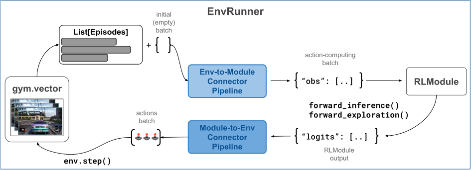

.. include:: /_includes/rllib/we_are_hiring.rst

.. include:: /_includes/rllib/new_api_stack.rst

.. _env-to-module-pipeline-docs:

Env-to-module Pipelines
=======================

One env-to-module pipeline resides on each :py:class:`~ray.rllib.env.env_runner.EnvRunner` and is responsible
for handling the data flow from the `gymnasium.Env <https://gymnasium.farama.org/api/env/>`__ to
the :py:class:`~ray.rllib.core.rl_module.rl_module.RLModule`.

    **EnvRunner ConnectorV2 Pipelines**: Both env-to-module and module-to-env pipelines are located on the :py:class:`~ray.rllib.env.env_runner.EnvRunner`
    workers. The env-to-module pipeline sits between the RL environment, a `gymnasium.Env <https://gymnasium.farama.org/api/env/>`__, and the
    :py:class:`~ray.rllib.core.rl_module.rl_module.RLModule`, and translates ongoing episodes into batches for the model's `forward_...()` methods.
    The module-to-env pipeline serves the other direction, converting the output of the :py:class:`~ray.rllib.core.rl_module.rl_module.RLModule`, such as
    action logits and action distribution parameters, to actual actions understandable by the `gymnasium.Env <https://gymnasium.farama.org/api/env/>`__
    and used in the env's next `step()` call.

The env-to-module pipeline, when called, performs translations from a list of ongoing :ref:`Episode objects <single-agent-episode-docs>` to an
RLModule-readable tensor batch and RLlib passes this generated batch as the first argument into the
:py:meth:`~ray.rllib.core.rl_module.rl_module.RLModule.forward_inference` or :py:meth:`~ray.rllib.core.rl_module.rl_module.RLModule.forward_exploration`
methods of the :py:class:`~ray.rllib.core.rl_module.rl_module.RLModule`, depending on your exploration settings.

.. hint::

    Set `config.exploration(explore=True)` in your :py:class:`~ray.rllib.algorithms.algorithm_config.AlgorithmConfig` to have RLlib call the
    :py:meth:`~ray.rllib.core.rl_module.rl_module.RLModule.forward_exploration` method with the connector's output.
    Otherwise, RLlib calls :py:meth:`~ray.rllib.core.rl_module.rl_module.RLModule.forward_inference`.
    Note also that normally these two methods only differ in that actions are sampled when ``explore=True`` and
    greedily picked when ``explore=False``. However, the exact behavior in each case depends on your :ref:`RLModule's implementation <rlmodule-guide>`.

Default env-to-module behavior
------------------------------

**Default Env-to-Module Behavior:** By default an env-to-module pipeline is populated with the following built-in connector pieces:

* :py:class:`~ray.rllib.connectors.common.add_observations_from_episodes_to_batch.AddObservationsFromEpisodesToBatch`: Places the most recent observation from each ongoing episode into the batch. Note that if you have a vector of ``N`` environments per :py:class:`~ray.rllib.env.env_runner.EnvRunner`, your batch size is also ``N``.
* *Relevant for stateful models only:* :py:class:`~ray.rllib.connectors.common.add_time_dim_to_batch_and_zero_pad.AddTimeDimToBatchAndZeroPad`: If the :py:class:`~ray.rllib.core.rl_module.rl_module.RLModule` is a stateful one, adds a single timestep, second axis to all data to make it sequential.
* *Relevant for stateful models only:* :py:class:`~ray.rllib.connectors.common.add_states_from_episodes_to_batch.AddStatesFromEpisodesToBatch`: If the :py:class:`~ray.rllib.core.rl_module.rl_module.RLModule` is a stateful one, places the most recent state outputs of the module as new state inputs into the batch.
* *For multi-agent only:* :py:class:`~ray.rllib.connectors.common.agent_to_module_mapping.AgentToModuleMapping`: Maps per-agent data to the respective per-module data depending on your defined agent-to-module mapping function.
* :py:class:`~ray.rllib.connectors.common.batch_individual_items.BatchIndividualItems`: Converts all data in the batch, which thus far are lists of individual items, into batched structures meaning NumPy arrays, whose zeroth axis is the batch axis.
* :py:class:`~ray.rllib.connectors.common.numpy_to_tensor.NumpyToTensor`: Converts all NumPy arrays in the batch into framework specific tensors and moves these to the GPU, if required.

You can disable the preceding default connector pieces by setting `config.env_runners(add_default_connectors_to_env_to_module_pipeline=False)`
in your :ref:`algorithm config <rllib-algo-configuration-docs>`.

Constructing an env-to-module connector
---------------------------------------

Normally, you wouldn't have to construct the env-to-module connector pipeline yourself. RLlib's :py:class:`~ray.rllib.env.env_runner.EnvRunner`
actors initially perform this operation. However, if you would like to test or debug either the default pipeline or a custom one,
use the following code snippet as a starting point:

.. testcode::

    import gymnasium as gym

    from ray.rllib.algorithms.ppo import PPOConfig
    from ray.rllib.env.single_agent_episode import SingleAgentEpisode

    # Start with an algorithm config.
    config = (
        PPOConfig()
        .environment("CartPole-v1")
    )
    # Create the env to generate some episode data.
    env = gym.make("CartPole-v1")

    # Build the env-to-module connector through the config object.
    env_to_module = config.build_env_to_module_connector(env=env, spaces=None)

    # Alternatively, in case there is no `env` object available,
    # you should pass in the `spaces` argument:
    env_to_module = config.build_env_to_module_connector(
        env=None,  # no env available?
        spaces={
            # At minimum, pass in the single, non-vectorized observation- and
            # action spaces:
            "__env_single__": (env.observation_space, env.action_space),
        },
    )

To test the actual behavior or the created pipeline, look at these code snippets
for stateless- and stateful :py:class:`~ray.rllib.core.rl_module.rl_module.RLModule` cases:

.. tab-set::

    .. tab-item:: Stateless RLModule

        .. testcode::

            from ray.rllib.env.single_agent_episode import SingleAgentEpisode

            # Create two SingleAgentEpisode instances. You pass these to the connector pipeline
            # as input.
            episode1 = SingleAgentEpisode()
            episode2 = SingleAgentEpisode()

            # Fill episodes with some data, as if we were currently stepping through them
            # to collect samples.
            # - episode 1 (two timesteps)
            obs, _ = env.reset()
            episode1.add_env_reset(observation=obs)
            action = 0
            obs, _, _, _, _ = env.step(action)
            episode1.add_env_step(observation=obs, action=action, reward=1.0)
            # - episode 2 (just one timestep)
            obs, _ = env.reset()
            episode2.add_env_reset(observation=obs)

            # Call the connector on the two running episodes.
            batch = {}
            batch = env_to_module(
                episodes=[episode1, episode2],
                batch=batch,
                rl_module=None,  # in stateless case, RLModule is not strictly required
                explore=True,
            )
            # Print out the resulting batch.
            print(batch)

    .. tab-item:: Stateful RLModule (RNN)

        .. testcode::

            from ray.rllib.core.rl_module.default_model_config import DefaultModelConfig
            from ray.rllib.env.single_agent_episode import SingleAgentEpisode

            # Alter the config to use the default LSTM model of RLlib.
            config.rl_module(model_config=DefaultModelConfig(use_lstm=True))

            # For stateful RLModules, we do need to pass in the RLModule to every call to the
            # connector. so construct an instance here.
            rl_module_spec = config.get_rl_module_spec(env=env)
            rl_module = rl_module_spec.build()

            # Create a SingleAgentEpisode instance. You pass this to the connector pipeline
            # as input.
            episode = SingleAgentEpisode()

            # Initialize episode with first (reset) observation.
            obs, _ = env.reset()
            episode.add_env_reset(observation=obs)

            # Call the connector on the running episode.
            batch = {}
            batch = env_to_module(
                episodes=[episode],
                batch=batch,
                rl_module=rl_module,  # in stateful case, RLModule is required
                explore=True,
            )
            # Print out the resulting batch.
            print(batch)

You can see that the pipeline extracted the two current observations from the two
running episodes and placed them under the "obs" column into the forward batch.
The batch should look similar to this:

.. code-block:: txt

    {'obs': tensor([[ 0.0212, -0.1996, -0.0414,  0.2848],
            [ 0.0292,  0.0259, -0.0322, -0.0004]])}

Or in the stateful case, the ``STATE_IN`` columns should also be set.
Note that because of the LSTM layer used, the internal state of the module consists
of two components, ``c`` and ``h``.

.. code-block:: txt

    {
        'obs': tensor(
            [[ 0.0212, -0.1996, -0.0414,  0.2848],
            [ 0.0292,  0.0259, -0.0322, -0.0004]]
        ),
        'state_in': {
            'h': tensor([[[0., 0., .., 0.]]]),
            'c': tensor([[[0., 0., ... 0.]]]),
        },
    }

.. hint::

    You are free to design the internal states of your custom :py:class:`~ray.rllib.core.rl_module.rl_module.RLModule` classes
    however you like. You only need to override the :py:meth:`` method and make sure you return a new state of any nested structure and
    shape from your `forward_..()` methods under the fixed ``state_out`` key.
    See `here for an example <https://github.com/ray-project/ray/blob/master/rllib/examples/rl_modules/classes/lstm_containing_rlm.py>`__
    of an RLModule class with a custom LSTM layer in it.

Configuring custom env-to-module connectors
-------------------------------------------

You can customize the default env-to-module pipeline that RLlib creates through specifying a function in your
:py:class:`~ray.rllib.algorithms.algorithm_config.AlgorithmConfig`, which takes an optional RL environment object (`env`) and an optional `spaces`
dictionary as input arguments and returns a single :py:class:`~ray.rllib.connectors.connector_v2.ConnectorV2` piece or a list thereof.
RLlib prepends the provided :py:class:`~ray.rllib.connectors.connector_v2.ConnectorV2` instances to the
:ref:`default env-to-module pipeline <default-env-to-module-pipeline>` in the order returned,
unless you set `add_default_connectors_to_env_to_module_pipeline=False` in your config, in which case RLlib exclusively uses the provided
:py:class:`~ray.rllib.connectors.connector_v2.ConnectorV2` pieces without any automatically added default behavior.

Note that the structure of the `spaces` argument is expected to be:

.. code-block:: python

    spaces = {
        "__env__": ([env observation space], [env action space]),  # <- may be vectorized
        "__env_single__": ([env observation space], [env action space]),  # <- never vectorized!
        "[module ID, e.g. 'default_policy']": ([module observation space], [module action space]),
        ...  # <- more modules in multi-agent case
    }

For example, to prepend a custom ConnectorV2 piece to the env-to-module pipeline, you can do this in your config:

.. testcode::
    :skipif: True

    # Your builder function must accept an optional `gymnasium.Env` and an optional `spaces` dict
    # as arguments.
    config.env_runners(
        env_to_module_connector=lambda env=None, spaces=None: MyEnvToModuleConnector(..),
    )

If you want to add multiple custom pieces to the pipeline, return them as a list:

.. testcode::
    :skipif: True

    # Return a list of connector pieces to make RLlib add all of them to your
    # env-to-module pipeline.
    config.env_runners(
        env_to_module_connector=lambda env=None, spaces=None: [
            MyEnvToModuleConnector(..),
            MyOtherEnvToModuleConnector(..),
            AndOneMoreConnector(..),
        ],
    )

.. _observation-preprocessors:

Observation Preprocessors
~~~~~~~~~~~~~~~~~~~~~~~~~

The simplest way of customizing an env-to-module pipeline is to write an
:py:class:`~ray.rllib.connectors.env_to_module.observation_preprocessor.ObservationPreprocessor` and plug
it into the :py:class:`~ray.rllib.algorithms.algorithm_config.AlgorithmConfig`. You only have to subclass then from
:py:class:`~ray.rllib.connectors.env_to_module.observation_preprocessor.ObservationPreprocessor`
and override two methods:

.. testcode::

    import gymnasium as gym
    import numpy as np

    from ray.rllib.connectors.env_to_module.observation_preprocessor import ObservationPreprocessor

    class OneHot(ObservationPreprocessor):
        """Converts int observations (Discrete) into one-hot tensors (Box)."""

        def recompute_output_observation_space(self, in_obs_space, in_act_space):
            # Based on the input observation space (), return the output observation
            # space. Implementing this method is crucial for the pipeline to know its output
            # spaces, which are an important piece of information to construct the succeeding
            # RLModule.
            return gym.spaces.Box(0.0, 1.0, (in_obs_space.n,), np.float32)

        def preprocess(self, observation):
            # Convert an input observation (int) into a one-hot (float) tensor.
            # Note that 99% of all connectors in RLlib operator in the "numpy space".
            new_obs = np.zeros(shape=self.observation_space.shape, dtype=np.float32)
            new_obs[observation] = 1.0
            return new_obs

Now that you defined your preprocessor, you can plug it into your :py:class:`~ray.rllib.algorithms.algorithm_config.AlgorithmConfig`
object and run an experiment with a Discrete observation env, where observations are integers, for
example `FrozenLake-v1 <https://gymnasium.farama.org/environments/toy_text/frozen_lake/>`__:

.. testcode::

    from ray.rllib.algorithms.ppo import PPOConfig

    config = (
        PPOConfig()

        # Configure a simple 2x2 grid-world.
        # ____
        # |S |  <- S=start position
        # | G|  <- G=goal position
        # ----
        .environment("FrozenLake-v1", env_config={"desc": ["SF", "FG"]})

        # Plug your custom connector piece into the env-to-module pipeline.
        .env_runners(
            env_to_module_connector=(
                lambda env=None, spaces=None, device=None: OneHot()
            ),
        )
    )
    algo = config.build()
    # Train one iteration.
    print(algo.train())

Adding recent rewards to the batch
~~~~~~~~~~~~~~~~~~~~~~~~~~~~~~~~~~

Assume you wrote a custom :ref:`RLModule <rlmodule-guide>` that requires to see the last
three received rewards as input in calls to any of its `forward_..()` methods.

* Through a custom Preprocessor that merges the reward information with the observations and thereby creates new observations.
* Through adding a new column to the forward batch, for example ``past_rewards`` and properly putting the last three rewards as a ``(3,)``-shaped tensor into this new column.

The solution you should chose depends on the implementation of your :py:class:`~ray.rllib.core.rl_module.rl_module.RLModule`.
If your RLModule knows how to extract the ``past_rewards`` column from the input and feed it into its layers

.. tab-set::

    .. tab-item:: Preprocessor solution

        .. testcode::

            import gymnasium as gym
            import numpy as np

            from ray.rllib.connectors.env_to_module.observation_preprocessor import ObservationPreprocessor

            class AddPast3Rewards(ObservationPreprocessor):
                """Extracts last 3 rewards from episode and concats them to observation tensor."""

                def recompute_output_observation_space(self, in_obs_space, in_act_space):
                    # Based on the input observation space (), return the output observation
                    # space. Implementing this method is crucial for the pipeline to know its output
                    # spaces, which are an important piece of information to construct the succeeding
                    # RLModule.

                    assert isinstance(in_obs_space, gym.spaces.Box) and len(in_obs_space.shape) == 1
                    return gym.spaces.Box(-100.0, 100.0, (in_obs_space.shape[0] + 3,), np.float32)

                def preprocess(self, observation):

    .. tab-item:: New column solution

        .. testcode::

Writing more complex custom ConnectorV2s
----------------------------------------

Besides simply transforming one observation at a time in a preprocessor-style setup as shown preceding,
here are two more examples showcasing more complex customizations of the different :py:class:`~ray.rllib.connectors.connector_v2.ConnectorV2` pipelines:

* How to stack the N most recent observations.

Stacking the N most recent observations
~~~~~~~~~~~~~~~~~~~~~~~~~~~~~~~~~~~~~~~

If you would like to write a custom env-to-module connector that stacks the `N` most recent observations and feeds
this stack of observations into your RLModule (for example in an attention/transformer architecture), you can
achieve this, too, by subclassing `ConnectorV2` and overriding the `__call__` method.

However, in this case, the implementation shouldn't write back the stacked observations into the episode
(as updated observation), because doing so would make the next call to the same ConnectorV2 piece to look back onto
an already stacked previous observation. Instead, you should manipulate the `batch` directly, as in this example:

.. testcode::

    import gymnasium as gym
    import numpy as np
    from ray.rllib.connectors.connector_v2 import ConnectorV2
    from ray.rllib.core.columns import Columns

    class StackLast10Observations(ConnectorV2):

        def recompute_output_observation_space(self, in_obs_space, in_act_space):
            # Assume the input observation space is a Box of shape (N,).
            assert (
                isinstance(input_observation_space, gym.spaces.Box)
                and len(input_observation_space.shape) == 1
            )

            # This connector concatenates the last 10 observations at axis=0, so the
            # output space has a shape of (10*N,).
            return gym.spaces.Box(
                low=input_observation_space.low,
                high=input_observation_space.high,
                shape=(input_observation_space.shape[0] * 10,),
                dtype=input_observation_space.dtype,
            )

        def __call__(self, *, rl_module, batch, episodes, **kwargs):
            # Assume that the input `batch` is empty. Note that this may not be the case
            # if you have other custom connector pieces before this one.
            assert not batch

            # Loop through all (single-agent) episodes.
            for single_agent_episode in self.single_agent_episode_iterator(episodes):
                # Get the 10 most recent observations from the episodes.
                last_10_obs = single_agent_episode.get_observations(
                    indices=[-10, -9, -8, -7, -6, -5, -4, -3, -2, -1], fill=0.0
                )
                # Concatenate the two observations.
                new_obs = np.concatenate(last_10_obs, axis=0)

                # Add the new observation to the `batch` using the
                # `ConnectorV2.add_batch_item()` utility.
                self.add_batch_item(
                    batch=batch,
                    column=Columns.OBS,
                    item_to_add=new_obs,
                    single_agent_episode=single_agent_episode,
                )

                # Note that we do not write the stacked observations back into the episode
                # as this would interfere with the next call of this same connector (it
                # would try to stack already stacked observations and thus produce a shape error).

            # Return batch (with stacked observations).
            return batch

Now since the returned `batch` in the preceding env-to-module piece is discarded after the model forward pass
(and not stored in the episodes), we have to make sure to perform the framestacking again on the Learner
side of things.

.. tip::
    There are already off-the-shelf ConnectorV2 pieces available to you. These perform the task of
    stacking the last `N` observations in both the env-to-module and Learner pipelines:

    .. code-block:: python

        from ray.rllib.connectors.common.frame_stacking import FrameStacking

        # Framestacking on the EnvRunner side.
        config.env_runners(
            env_to_module_connector=lambda env: FrameStacking(num_frames=N),
        )
        # Then again on the Learner side.
        config.training(
            learner_connector=lambda obs_space, act_space: FrameStacking(num_frames=N, as_learner_conector=True),
        )

