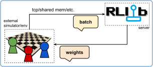

.. include:: /_includes/rllib/we_are_hiring.rst

.. _rllib-external-env-setups-doc:

External Environments and Applications
======================================

.. include:: /_includes/rllib/new_api_stack.rst

In many situations, it doesn't make sense for an RL environment to be "stepped" by RLlib.
For example, if you train a policy inside a complex simulator that operates its own execution loop,
like a game engine or a robotics simulation. A natural and user friendly approach is to flip this setup around
and - instead of RLlib "stepping" the env - allow the agents in the simulation to fully control
their own stepping. An external RLlib-powered service would be available for either querying
individual actions or for accepting batched sample data. The service would cover the task
of training the policies, but wouldn't pose any restrictions on when and how often per second the simulation
should step.

    **External application with client-side inference**: An external simulator (for example a game engine)
    connects to RLlib, which runs as a server through a tcp-cabable, custom EnvRunner.
    The simulator sends batches of data from time to time to the server and in turn receives weights updates.
    For better performance, actions are computed locally on the client side.

.. todo (sven): show new image here with UE5
.. .. figure:: images/rllib-training-inside-a-unity3d-env.png
.. scale: 75 %
..    A Unity3D soccer game being learnt by RLlib via the ExternalEnv API.

RLlib provides an `external messaging protocol <https://github.com/ray-project/ray/blob/master/rllib/env/external/rllink.py>`__
called :ref:`RLlink <rllink-protocol-docs>` for this purpose as well as the option to customize your :py:class:`~ray.rllib.env.env_runner.EnvRunner` class
toward communicating through :ref:`RLlink <rllink-protocol-docs>` with one or more clients.
An example, `tcp-based EnvRunner implementation with RLlink is available here <https://github.com/ray-project/ray/blob/master/rllib/examples/envs/env_connecting_to_rllib_w_tcp_client.py>`__.
It also contains a dummy (CartPole) client that can be used for testing and as a template for how your external application or simulator should
utilize the :ref:`RLlink <rllink-protocol-docs>` protocol.

.. note::
    External application support is still work-in-progress on RLlib's new API stack. The Ray team
    is working on more examples for custom EnvRunner implementations (besides
    `the already available tcp-based one <https://github.com/ray-project/ray/blob/master/rllib/env/tcp_client_inference_env_runner.py>`__)
    as well as various client-side, non-python RLlib-adapters, for example for popular game engines and other
    simulation software.

.. _rllink-protocol-docs:

The RLlink Protocol
-------------------

RLlink is a simple, stateful protocol designed for communication between a reinforcement learning (RL) server (ex., RLlib) and an
external client acting as an environment simulator. The protocol enables seamless exchange of RL-specific data such as episodes,
configuration, and model weights, while also facilitating on-policy training workflows.

Key Features
~~~~~~~~~~~~

- **Stateful Design**: The protocol maintains some state through sequences of message exchanges (ex., request-response pairs like `GET_CONFIG` -> `SET_CONFIG`).
- **Strict Request-Response Design**: The protocol is strictly (client) request -> (server) response based. Due to the necessity to let the client simulation run in its own execution loop, the server side refrains from sending any unsolicited messages to the clients.
- **RL-Specific Capabilities**: Tailored for RL workflows, including episode handling, model weight updates, and configuration management.
- **Flexible Sampling**: Supports both on-policy and off-policy data collection modes.
- **JSON**: For reasons of better debugging and faster iterations, the first versions of RLlink are entirely JSON-based, non-encrypted, and non-secure.

Message Structure
~~~~~~~~~~~~~~~~~

RLlink messages consist of a header and a body:

  - **Header**: 8-byte length field indicating the size of the body, for example `00000016` for a body of length 16 (thus, in total, the message size).
  - **Body**: JSON-encoded content with a `type` field indicating the message type.

Example Messages: PING and EPISODES_AND_GET_STATE
+++++++++++++++++++++++++++++++++++++++++++++++++

Here is a complete simple example message for the `PING` message. Note the 8-byte header
encoding the size of the following body to be of length `16`, followed by the message body with the mandatory "type" field.

.. code-block::

    00000016{"type": "PING"}

The `PING` message should be sent by the client after initiation of a new connection. The server
then responds with:

.. code-block::

    00000016{"type": "PONG"}

Here is an example of an `EPISODES_AND_GET_STATE` message sent by the client to the server and carrying
a batch of sampling data. With the same message, the client asks the server to send back the updated model weights.

.. _example-rllink-episode-and-get-state-msg:

.. code-block:: javascript

    {
      "type": "EPISODES_AND_GET_STATE",
      "episodes": [
        {
          "obs": [[...]],  // List of observations
          "actions": [...],  // List of actions
          "rewards": [...],  // List of rewards
          "is_terminated": false,
          "is_truncated": false
        }
      ],
      "env_steps": 128
    }

Overview of all Message Types
~~~~~~~~~~~~~~~~~~~~~~~~~~~~~

Requests: Client → Server
+++++++++++++++++++++++++

- **``PING``**

  - Example: ``{"type": "PING"}``
  - Purpose: Initial handshake to establish communication.
  - Expected Response: ``{"type": "PONG"}``.

- **``GET_CONFIG``**

  - Example: ``{"type": "GET_CONFIG"}``
  - Purpose: Request the relevant configuration (for example, how many timesteps to collect for a single `EPISODES_AND_GET_STATE` message; see below).
  - Expected Response: ``{"type": "SET_CONFIG", "env_steps_per_sample": 500, "force_on_policy": true}``.

- **``EPISODES_AND_GET_STATE``**

  - Example: :ref:`See here for an example message <example-rllink-episode-and-get-state-msg>`
  - Purpose: Combine ``EPISODES`` and ``GET_STATE`` into a single request. This is useful for workflows requiring on-policy (synchronous) updates to model weights after data collection.
  - Body:

    - ``episodes``: A list of JSON objects (dicts), each with mandatory keys "obs" (list of observations in the episode), "actions" (list of actions in the episode), "rewards" (list of rewards in the episode), "is_terminated" (bool), and "is_truncated" (bool). Note that the "obs" list has one item more than the lists for "actions" and "rewards" due to the initial "reset" observation.
    - ``weights_seq_no``: Sequence number for the model weights version, ensuring synchronization.

  - Expected Response: ``{"type": "SET_STATE", "weights_seq_no": 123, "mlir_file": ".. [b64 encoded string of the binary .mlir file with the model in it] .."}``.

Responses: Server → Client
++++++++++++++++++++++++++

- **``PONG``**

  - Example: ``{"type": "PONG"}``
  - Purpose: Acknowledgment of the ``PING`` request to confirm connectivity.

- **``SET_STATE``**

  - Example: ``{"type": "SET_STATE", "weights_seq_no": 123, "onnx_file": "... [base64 encoded ONNX file] ..."}``
  - Purpose: Provide the client with the current state (for example, model weights).
  - Body:

    - ``onnx_file``: Base64-encoded, compressed ONNX model file.
    - ``weights_seq_no``: Sequence number for the model weights, ensuring synchronization.

- **``SET_CONFIG``**

  - Purpose: Send relevant configuration details to the client.
  - Body:

    - ``env_steps_per_sample``: Number of total env steps collected for one ``EPISODES_AND_GET_STATE`` message.
    - ``force_on_policy``: Whether on-policy sampling is enforced. If true, the client should wait after sending the ``EPISODES_AND_GET_STATE`` message for the ``SET_STATE`` response before continuing to collect the next round of samples.

Workflow Examples
+++++++++++++++++

**Initial Handshake**

1. Client sends ``PING``.
2. Server responds with ``PONG``.

**Configuration Request**

1. Client sends ``GET_CONFIG``.
2. Server responds with ``SET_CONFIG``.

**Training (on-policy)**

1. Client collects on-policy data and sends ``EPISODES_AND_GET_STATE``.
2. Server processes the episodes and responds with ``SET_STATE``.

.. note::
    This protocol is an initial draft of the attempt to develop a widely adapted protocol for communication between an external
    client and a remote RL-service. Expect many changes, enhancements, and upgrades as it moves toward maturity, including
    adding a safety layer and compression.
    For now, however, it offers a lightweight, simple, yet powerful interface for integrating external environments with RL
    frameworks.

Example: External client connecting to tcp-based EnvRunner
----------------------------------------------------------

An example `tcp-based EnvRunner implementation with RLlink is available here <https://github.com/ray-project/ray/blob/master/rllib/env/tcp_client_inference_env_runner.py>`__.
See `here for the full end-to-end example <https://github.com/ray-project/ray/blob/master/rllib/examples/envs/env_connecting_to_rllib_w_tcp_client.py>`__.

Feel free to alter the underlying logic of your custom EnvRunner, for example, you could implement a shared memory based
communication layer (instead of the tcp-based one).
