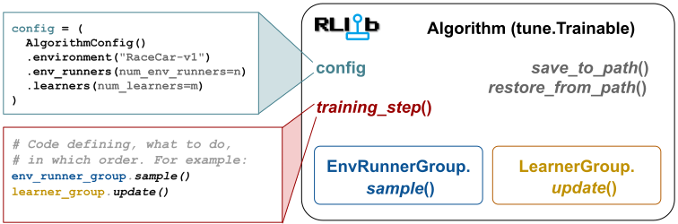

.. include:: /_includes/rllib/we_are_hiring.rst

.. |single_agent| image:: /rllib/images/sigils/single-agent.svg
    :class: inline-figure
    :width: 72

.. |multi_agent| image:: /rllib/images/sigils/multi-agent.svg
    :class: inline-figure
    :width: 72

.. |discr_act| image:: /rllib/images/sigils/discr-actions.svg
    :class: inline-figure
    :width: 72

.. |cont_act| image:: /rllib/images/sigils/cont-actions.svg
    :class: inline-figure
    :width: 72

.. |multi_gpu| image:: /rllib/images/sigils/multi-gpu.svg
    :class: inline-figure
    :width: 72

.. |multi_node_multi_gpu| image:: /rllib/images/sigils/multi-node-multi-gpu.svg
    :class: inline-figure
    :alt: Only on the Anyscale Platform!
    :width: 72

.. _rllib-index:

RLlib: Industry-Grade, Scalable Reinforcement Learning
======================================================

.. include:: /_includes/rllib/new_api_stack.rst

.. image:: images/rllib-logo.png
    :align: center

.. toctree::
    :hidden:

    rllib-training
    key-concepts
    rllib-env
    rllib-algorithms
    user-guides
    rllib-examples
    rllib-new-api-stack
    new-api-stack-migration-guide
    package_ref/index

**RLlib** is an open source library for reinforcement learning (RL), offering support for
production-level, highly scalable, and fault-tolerant RL workloads, while maintaining simple and unified
APIs for a large variety of industry applications.

Whether training policies in a **multi-agent** setup, from historic **offline** data,
or using **externally connected simulators**, RLlib offers simple solutions for each of
these autonomous decision making needs and enables you to start running your experiments within hours.

RLlib is used in production by industry leaders in many different verticals, such as
`gaming <https://www.anyscale.com/events/2021/06/22/using-reinforcement-learning-to-optimize-iap-offer-recommendations-in-mobile-games>`_,
`robotics <https://www.anyscale.com/events/2021/06/23/introducing-amazon-sagemaker-kubeflow-reinforcement-learning-pipelines-for>`_,
`finance <https://www.anyscale.com/events/2021/06/22/a-24x-speedup-for-reinforcement-learning-with-rllib-+-ray>`_,
`climate- and industrial control <https://www.anyscale.com/events/2021/06/23/applying-ray-and-rllib-to-real-life-industrial-use-cases>`_,
`manufacturing and logistics <https://www.anyscale.com/events/2022/03/29/alphadow-leveraging-rays-ecosystem-to-train-and-deploy-an-rl-industrial>`_,
`automobile <https://www.anyscale.com/events/2021/06/23/using-rllib-in-an-enterprise-scale-reinforcement-learning-solution>`_,
and
`boat design <https://www.youtube.com/watch?v=cLCK13ryTpw>`_.

RLlib in 60 seconds
-------------------

.. figure:: images/rllib-index-header.svg

It only takes a few steps to get your first RLlib workload up and running on your laptop.
Install RLlib and `PyTorch <https://pytorch.org>`__, as shown below:

.. code-block:: bash

    pip install "ray[rllib]" torch

.. note::

    For installation on computers running Apple Silicon (such as M1),
    `follow instructions here. <https://docs.ray.io/en/latest/ray-overview/installation.html#m1-mac-apple-silicon-support>`_

.. note::

    To be able to run our Atari or MuJoCo examples, you also need to run:
    `pip install "gymnasium[atari,accept-rom-license,mujoco]"`.

This is all! You can now start coding against RLlib. Here is an example for running the PPO Algorithm on the
`Taxi domain <https://gymnasium.farama.org/environments/toy_text/taxi/>`__.
You first create a `config` for the algorithm, which defines the RL environment (taxi) and
any other needed settings and parameters.

Next, `build` the algorithm and `train` it for a total of 5 iterations.
One training iteration includes parallel (distributed) sample collection by the :py:class:`~ray.rllib.env.env_runner.EnvRunner` actors,
followed by loss calculation on the collected data, and a model update step.

At the end of your script, the trained Algorithm is evaluated:

.. literalinclude:: doc_code/rllib_in_60s.py
    :language: python
    :start-after: __rllib-in-60s-begin__
    :end-before: __rllib-in-60s-end__

You can use any `Farama-Foundation Gymnasium <https://github.com/Farama-Foundation/Gymnasium>`__ registered environment
with the `env` argument.

In `config.env_runners()` you can specify - amongst many other things - the number of parallel
:py:class:`~ray.rllib.env.env_runner.EnvRunner` actors to collect samples from the environment.

You can also tweak the NN architecture used by by tweaking RLlib's `DefaultModelConfig`, as well as, set up a separate
config for the evaluation :py:class:`~ray.rllib.env.env_runner.EnvRunner` actors through the `config.evaluation()` method.

`See here <rllib-training.html#using-the-python-api>`_, if you want to learn more about the RLlib training APIs.
Also, `see here <https://github.com/ray-project/ray/blob/master/rllib/examples/inference/policy_inference_after_training.py>`__
for a simple example on how to write an action inference loop after training.

If you want to get a quick preview of which **algorithms** and **environments** RLlib supports,
click the dropdowns below:

.. dropdown:: **RLlib Algorithms**
    :animate: fade-in-slide-down

    +-------------------------------------------------------------------------+----------------+---------------+-------------+------------+-------------+------------------------+
    | **On-Policy**                                                                                                                                                              |
    +-------------------------------------------------------------------------+----------------+---------------+-------------+------------+-------------+------------------------+
    | :ref:`PPO (Proximal Policy Optimization) <ppo>`                         | |single_agent| | |multi_agent| | |discr_act| | |cont_act| | |multi_gpu| | |multi_node_multi_gpu| |
    +-------------------------------------------------------------------------+----------------+---------------+-------------+------------+-------------+------------------------+
    | **Off-Policy**                                                                                                                                                             |
    +-------------------------------------------------------------------------+----------------+---------------+-------------+------------+-------------+------------------------+
    | :ref:`SAC (Soft Actor Critic) <sac>`                                    | |single_agent| | |multi_agent| |             | |cont_act| | |multi_gpu| | |multi_node_multi_gpu| |
    +-------------------------------------------------------------------------+----------------+---------------+-------------+------------+-------------+------------------------+
    | :ref:`DQN/Rainbow (Deep Q Networks) <dqn>`                              | |single_agent| | |multi_agent| | |discr_act| |            | |multi_gpu| | |multi_node_multi_gpu| |
    +-------------------------------------------------------------------------+----------------+---------------+-------------+------------+-------------+------------------------+
    | **High-throughput Architectures**                                                                                                                                          |
    +-------------------------------------------------------------------------+----------------+---------------+-------------+------------+-------------+------------------------+
    | :ref:`APPO (Asynchronous Proximal Policy Optimization) <appo>`          | |single_agent| | |multi_agent| | |discr_act| | |cont_act| | |multi_gpu| | |multi_node_multi_gpu| |
    +-------------------------------------------------------------------------+----------------+---------------+-------------+------------+-------------+------------------------+
    | :ref:`IMPALA (Importance Weighted Actor-Learner Architecture) <impala>` | |single_agent| | |multi_agent| | |discr_act| |            | |multi_gpu| | |multi_node_multi_gpu| |
    +-------------------------------------------------------------------------+----------------+---------------+-------------+------------+-------------+------------------------+
    | **Model-based RL**                                                                                                                                                         |
    +-------------------------------------------------------------------------+----------------+---------------+-------------+------------+-------------+------------------------+
    | :ref:`DreamerV3 <dreamerv3>`                                            | |single_agent| |               | |discr_act| | |cont_act| | |multi_gpu| | |multi_node_multi_gpu| |
    +-------------------------------------------------------------------------+----------------+---------------+-------------+------------+-------------+------------------------+
    | **Offline RL and Imitation Learning**                                                                                                                                      |
    +-------------------------------------------------------------------------+----------------+---------------+-------------+------------+-------------+------------------------+
    | :ref:`BC (Behavior Cloning) <bc>`                                       | |single_agent| |               | |discr_act| | |cont_act| |             |                        |
    +-------------------------------------------------------------------------+----------------+---------------+-------------+------------+-------------+------------------------+
    | :ref:`CQL (Conservative Q-Learning) <cql>`                              | |single_agent| |               |             | |cont_act| |             |                        |
    +-------------------------------------------------------------------------+----------------+---------------+-------------+------------+-------------+------------------------+
    | :ref:`MARWIL (Advantage Re-Weighted Imitation Learning) <marwil>`       | |single_agent| |               | |discr_act| | |cont_act| |             |                        |
    +-------------------------------------------------------------------------+----------------+---------------+-------------+------------+-------------+------------------------+

.. dropdown:: **RLlib Environments**
    :animate: fade-in-slide-down

    +-------------------------------------------------------------------------------------------+
    | **Farama-Foundation Environments**                                                        |
    +-------------------------------------------------------------------------------------------+
    | `gymnasium <https://gymnasium.farama.org/index.html>`__ |single_agent|                    |
    |                                                                                           |
    | .. code-block:: bash                                                                      |
    |                                                                                           |
    |     pip install "gymnasium[atari,accept-rom-license,mujoco]"``                            |
    |                                                                                           |
    | .. code-block:: python                                                                    |
    |                                                                                           |
    |     config.environment("CartPole-v1")  # Classic Control                                  |
    |     config.environment("ale_py:ALE/Pong-v5")  # Atari                                     |
    |     config.environment("Hopper-v5")  # MuJoCo                                             |
    +-------------------------------------------------------------------------------------------+
    | `PettingZoo <https://pettingzoo.farama.org/index.html>`__ |multi_agent|                   |
    |                                                                                           |
    | .. code-block:: bash                                                                      |
    |                                                                                           |
    |     pip install "pettingzoo[all]"                                                         |
    |                                                                                           |
    | .. code-block:: python                                                                    |
    |                                                                                           |
    |     from ray.tune.registry import register_env                                            |
    |     from ray.rllib.env.wrappers.pettingzoo_env import PettingZooEnv                       |
    |     from pettingzoo.sisl import waterworld_v4                                             |
    |     register_env("env", lambda _: PettingZooEnv(waterworld_v4.env()))                     |
    |     config.environment("env")                                                             |
    +-------------------------------------------------------------------------------------------+
    | **RLlib Multi-Agent**                                                                     |
    +-------------------------------------------------------------------------------------------+
    | `RLlib's MultiAgentEnv API <rllib-env.html#multi-agent-and-hierarchical>`__ |multi_agent| |
    |                                                                                           |
    | .. code-block:: python                                                                    |
    |                                                                                           |
    |     from ray.rllib.examples.envs.classes.multi_agent import MultiAgentCartPole            |
    |     from ray import tune                                                                  |
    |     tune.register_env("env", lambda cfg: MultiAgentCartPole(cfg))                         |
    |     config.environment("env", env_config={"num_agents": 2})                               |
    |     config.multi_agent(                                                                   |
    |         policies={"p0", "p1"},                                                            |
    |         policy_mapping_fn=lambda aid, *a, **kw: f"p{aid}",                                |
    |     )                                                                                     |
    +-------------------------------------------------------------------------------------------+

Why chose RLlib?
----------------

.. dropdown:: **Scalable and Fault-Tolerant**
    :animate: fade-in-slide-down

    RLlib workloads scale along various axes:

    - The number of :py:class:`~ray.rllib.env.env_runner.EnvRunner` actors to use.
      This is configurable through ``config.env_runners(num_env_runners=...)`` and
      allows you to scale the speed of your (simulator) data collection step.
      This `EnvRunner` axis is fully **fault tolerant**, meaning you can train against
      custom environments that are unstable or frequently stall execution and even place all
      your `EnvRunner` actors on spot machines.

    - The number of :py:class:`~ray.rllib.core.learner.Learner` actors to use for **multi-GPU training**.
      This is configurable through ``config.learners(num_learners=...)`` and you normally
      set this to the number of GPUs available (make sure you then also set
      ``config.learners(num_gpus_per_learner=1)``) or - if you do not have GPUs - you can
      use this setting for **DDP-style learning on CPUs** instead.

.. dropdown:: **Multi-Agent Reinforcement Learning (MARL)**
    :animate: fade-in-slide-down

    RLlib natively supports multi-agent reinforcement learning (MARL), thereby allowing you to run
    in any complex configuration.

    - **Independent** multi-agent learning (the default): Every agent collects data for updating its own
      policy network, interpreting other agents as part of the environment.
    - **Collaborative** training: Train a team of agents that either all share the same policy (shared parameters)
      or in which some agents have their own policy network(s). You can also share value functions between all
      members of the team or some of them, as you see fit, thus allowing for global vs local objectives to be
      optimized.
    - **Adversarial** training: Have agents play against other agents in competitive environments. Use self-play,
      or league based self-play to train your agents to learn how to play throughout various stages of
      ever increasing difficulty.
    - **Any combination of the above!** Yes, you can train teams of arbitrary sizes of agents playing against
      other teams where the agents in each team might have individual sub-objectives and there are groups
      of neutral agents not participating in any competition.

.. dropdown:: **Offline RL and Behavior Cloning**
    :animate: fade-in-slide-down

    **Ray.Data** has been integrated into RLlib, enabling **large-scale data ingestion** for offline RL and behavior
    cloning (BC) workloads.

    See here for a basic `tuned example for the behavior cloning algo <https://github.com/ray-project/ray/blob/master/rllib/tuned_examples/bc/cartpole_bc.py>`__
    and here for how to `pre-train a policy with BC, then finetuning it with online PPO <https://github.com/ray-project/ray/blob/master/rllib/examples/offline_rl/train_w_bc_finetune_w_ppo.py>`__.

.. dropdown:: **Support for External Env Clients**
    :animate: fade-in-slide-down

    **Support for externally connecting RL environments** is achieved through customizing the :py:class:`~ray.rllib.env.env_runner.EnvRunner` logic
    from RLlib-owned, internal gymnasium envs to external, TCP-connected Envs that act independently and may even perform their own
    action inference, e.g. through ONNX.

    See here for an example of `RLlib acting as a server with connecting external env TCP-clients <https://github.com/ray-project/ray/blob/master/rllib/examples/envs/env_connecting_to_rllib_w_tcp_client.py>`__.

Learn More
----------

.. grid:: 1 2 3 3
    :gutter: 1
    :class-container: container pb-4

    .. grid-item-card::

        **RLlib Environments**
        ^^^
        Get started with environments supported by RLlib, such as Farama foundation's Gymnasium, Petting Zoo,
        and many custom formats for vectorized and multi-agent environments.
        +++
        .. button-ref:: rllib-environments-doc
            :color: primary
            :outline:
            :expand:

            Environments

    .. grid-item-card::

        **RLlib Key Concepts**
        ^^^
        Learn more about the core concepts of RLlib, such as environments, algorithms and
        policies.
        +++
        .. button-ref:: rllib-core-concepts
            :color: primary
            :outline:
            :expand:

            Key Concepts

    .. grid-item-card::

        **RLlib Algorithms**
        ^^^
        See the many available RL algorithms of RLlib for model-free and model-based
        RL, on-policy and off-policy training, multi-agent RL, and more.
        +++
        .. button-ref:: rllib-algorithms-doc
            :color: primary
            :outline:
            :expand:

            Algorithms

Customizing RLlib
-----------------

RLlib provides powerful, yet easy to use APIs for customizing all aspects of your experimental- and
production training-workflows.
For example, you may code your own `environments <rllib-env.html#configuring-environments>`__
in python using the `Farama Foundation's gymnasium <https://farama.org>`__ or DeepMind's OpenSpiel,
provide custom `PyTorch models <https://github.com/ray-project/ray/blob/master/rllib/examples/rl_modules/custom_cnn_rl_module.py>`_,
write your own `optimizer setups and loss definitions <https://github.com/ray-project/ray/blob/master/rllib/examples/learners/custom_loss_fn_simple.py>`__,
or define custom `exploratory behavior <https://github.com/ray-project/ray/blob/master/rllib/examples/curiosity/count_based_curiosity.py>`_.

    **RLlib's API stack:** Built on top of Ray, RLlib offers off-the-shelf, distributed and fault-tolerant
    algorithms and loss functions, PyTorch default models, multi-GPU training, and multi-agent support.
    User customizations are realized by subclassing the existing abstractions and - by overriding certain
    methods in those subclasses - define custom behavior.
