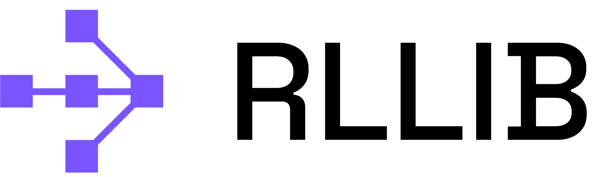

.. include:: /_includes/rllib/announcement.rst

.. include:: /_includes/rllib/we_are_hiring.rst

.. _rllib-index:

RLlib: Industry-Grade Reinforcement Learning
============================================

**RLlib** is an open-source library for reinforcement learning (RL), offering support for
production-level, highly distributed RL workloads while maintaining
unified and simple APIs for a large variety of industry applications.
Whether you would like to train your agents in a multi-agent setup,
purely from offline (historic) datasets, or using externally
connected simulators, RLlib offers a simple solution for each of your decision
making needs.

You **don't need** to be an **RL expert** to use RLlib, nor do you need to learn Ray or any
other of its libraries! If you either have your problem coded (in python) as an
`RL environment <https://medium.com/distributed-computing-with-ray/anatomy-of-a-custom-environment-for-rllib-327157f269e5>`_
or own lots of pre-recorded, historic behavioral data to learn from, you will be
up and running in only a few days.

RLlib is already used in production by industry leaders in many different verticals, such as
`climate control <https://www.anyscale.com/events/2021/06/23/applying-ray-and-rllib-to-real-life-industrial-use-cases>`_,
`manufacturing and logistics <https://www.anyscale.com/events/2021/06/22/offline-rl-with-rllib>`_,
`finance <https://www.anyscale.com/events/2021/06/22/a-24x-speedup-for-reinforcement-learning-with-rllib-+-ray>`_,
`gaming <https://www.anyscale.com/events/2021/06/22/using-reinforcement-learning-to-optimize-iap-offer-recommendations-in-mobile-games>`_,
`automobile <https://www.anyscale.com/events/2021/06/23/using-rllib-in-an-enterprise-scale-reinforcement-learning-solution>`_,
`robotics <https://www.anyscale.com/events/2021/06/23/introducing-amazon-sagemaker-kubeflow-reinforcement-learning-pipelines-for>`_,
`boat design <https://www.youtube.com/watch?v=cLCK13ryTpw>`_,
and many others.

RLlib in 60 seconds
-------------------

It only takes a few steps to get your first RLlib workload up and running on your laptop:

**TensorFlow or PyTorch**:

RLlib does not automatically install a deep-learning framework, but supports
TensorFlow (both 1.x with static-graph and 2.x with eager mode) as well as
PyTorch. Depending on your needs, make sure to install either TensorFlow or
PyTorch (or both as shown below):

.. code-block:: bash

    $ conda create -n rllib python=3.8
    $ conda activate rllib
    $ pip install "ray[rllib]" tensorflow torch

Note, for installation on computers running Apple Silicon (such as M1), please follow instructions
`here <https://docs.ray.io/en/latest/installation.html#m1-mac-apple-silicon-support>`_

To be able to run our Atari examples, you should also install:

.. code-block:: bash

    $ pip install "gym[atari]" "gym[accept-rom-license]" atari_py

After these quick pip installs, you can start coding against RLlib.

Here is an example of running a PPO Trainer on the "`Taxi domain <https://www.gymlibrary.ml/environments/toy_text/taxi/>`_"
for a few training iterations, then perform a single evaluation loop
(with rendering enabled):

.. literalinclude:: ../../../rllib/examples/documentation/rllib_in_60s.py
    :language: python
    :start-after: __rllib-in-60s-begin__
    :end-before: __rllib-in-60s-end__

`See here for a simple example on how to write an action inference loop after training. <https://github.com/ray-project/ray/blob/master/rllib/examples/inference_and_serving/policy_inference_after_training.py>`_

Feature Overview
----------------

The following is a summary of RLlib's most striking features.
Click on the images below to see an example script for each of the listed features:

.. include:: feature_overview.rst

If you want to get a quick preview of which **algorithms** and **environments** RLlib supports,
click on the dropdowns below:

.. dropdown:: **RLlib Algorithms**
    :animate: fade-in-slide-down

    *  High-throughput architectures

       -  |pytorch| |tensorflow| :ref:`Distributed Prioritized Experience Replay (Ape-X) <apex>`

       -  |pytorch| |tensorflow| :ref:`Importance Weighted Actor-Learner Architecture (IMPALA) <impala>`

       -  |pytorch| |tensorflow| :ref:`Asynchronous Proximal Policy Optimization (APPO) <appo>`

       -  |pytorch| :ref:`Decentralized Distributed Proximal Policy Optimization (DD-PPO) <ddppo>`

    *  Gradient-based

       -  |pytorch| |tensorflow| :ref:`Advantage Actor-Critic (A2C, A3C) <a3c>`

       -  |pytorch| |tensorflow| :ref:`Deep Deterministic Policy Gradients (DDPG, TD3) <ddpg>`

       -  |pytorch| |tensorflow| :ref:`Deep Q Networks (DQN, Rainbow, Parametric DQN) <dqn>`

       -  |pytorch| |tensorflow| :ref:`Policy Gradients <pg>`

       -  |pytorch| |tensorflow| :ref:`Proximal Policy Optimization (PPO) <ppo>`

       -  |pytorch| |tensorflow| :ref:`Soft Actor Critic (SAC) <sac>`

       -  |pytorch| :ref:`Slate Q-Learning (SlateQ) <slateq>`

    *  Derivative-free

       -  |pytorch| |tensorflow| :ref:`Augmented Random Search (ARS) <ars>`

       -  |pytorch| |tensorflow| :ref:`Evolution Strategies <es>`

    *  Model-based / Meta-learning / Offline

       -  |pytorch| :ref:`Single-Player AlphaZero (contrib/AlphaZero) <alphazero>`

       -  |pytorch| |tensorflow| :ref:`Model-Agnostic Meta-Learning (MAML) <maml>`

       -  |pytorch| :ref:`Model-Based Meta-Policy-Optimization (MBMPO) <mbmpo>`

       -  |pytorch| :ref:`Dreamer (DREAMER) <dreamer>`

       -  |pytorch| :ref:`Conservative Q-Learning (CQL) <cql>`

    *  Multi-agent

       -  |pytorch| :ref:`QMIX Monotonic Value Factorisation (QMIX, VDN, IQN) <qmix>`
       -  |tensorflow| :ref:`Multi-Agent Deep Deterministic Policy Gradient (MADDPG) <maddpg>`

    *  Offline

       -  |pytorch| |tensorflow| :ref:`Advantage Re-Weighted Imitation Learning (MARWIL) <marwil>`

    *  Contextual bandits

       -  |pytorch| :ref:`Linear Upper Confidence Bound (contrib/LinUCB) <lin-ucb>`
       -  |pytorch| :ref:`Linear Thompson Sampling (contrib/LinTS) <lints>`

    *  Exploration-based plug-ins (can be combined with any algo)

       -  |pytorch| :ref:`Curiosity (ICM: Intrinsic Curiosity Module) <curiosity>`

.. dropdown:: **RLlib Environments**
    :animate: fade-in-slide-down

    *  `RLlib Environments Overview <rllib-env.html>`__
    *  `OpenAI Gym <rllib-env.html#openai-gym>`__
    *  `Vectorized <rllib-env.html#vectorized>`__
    *  `Multi-Agent and Hierarchical <rllib-env.html#multi-agent-and-hierarchical>`__
    *  `External Agents and Applications <rllib-env.html#external-agents-and-applications>`__

       -  `External Application Clients <rllib-env.html#external-application-clients>`__

    *  `Advanced Integrations <rllib-env.html#advanced-integrations>`__

Customizing RLlib
-----------------

RLlib provides simple APIs to customize all aspects of your training- and experimental workflows.
For example, you may code your own `environments <rllib-env.html#configuring-environments>`__
in python using openAI's gym or DeepMind's OpenSpiel, provide custom
`TensorFlow/Keras- <rllib-models.html#tensorflow-models>`__ or ,
`Torch models <rllib-models.html#torch-models>`_, write your own
`policy- and loss definitions <rllib-concepts.html#policies>`__, or define
custom `exploratory behavior <rllib-training.html#exploration-api>`_.

Via mapping one or more agents in your environments to (one or more) policies, multi-agent
RL (MARL) becomes an easy-to-use low-level primitive for our users.

.. figure:: images/rllib-stack.svg
    :align: left
    :width: 650

    **RLlib's API stack:** Built on top of Ray, RLlib offers off-the-shelf, highly distributed
    algorithms, policies, loss functions, and default models (including the option to
    auto-wrap a neural network with an LSTM or an attention net). Furthermore, our library
    comes with a built-in Server/Client setup, allowing you to connect
    hundreds of external simulators (clients) via the network to an RLlib server process,
    which provides learning functionality and serves action queries. User customizations
    are realized via sub-classing the existing abstractions and - by overriding certain
    methods in those sub-classes - define custom behavior.

.. include:: /_includes/rllib/announcement_bottom.rst
