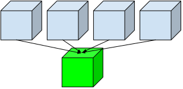

.. important:: The RLlib team at `Anyscale Inc. <https://anyscale.com>`__, the company behind Ray, is hiring interns and full-time **reinforcement learning engineers** to help advance and maintain RLlib.
 If you have a background in ML/RL and are interested in making RLlib **the** industry-leading open-source RL library, `apply here today <https://jobs.lever.co/anyscale/186d9b8d-3fee-4e07-bb8e-49e85cf33d6b>`__.
 We'd be thrilled to welcome you on the team!

.. _rllib-index:

RLlib: Industry-Grade Reinforcement Learning with TF and Torch
==============================================================

.. figure:: ../images/rllib/rllib-index-header.svg

**RLlib** is an open-source library for reinforcement learning (RL), offering support for
production-level, highly distributed RL workloads while maintaining
unified and simple APIs for a large variety of industry applications.
Whether you would like to train your agents in a multi-agent setup,
purely from offline (historic) datasets, or using externally
connected simulators, RLlib offers a simple solution for each of your decision
making needs.

You **don't need** to be an **RL expert**, nor do you need to
learn Ray or any of its other libraries in order to get started with RLlib.
If you either have your problem defined and coded in python as an
"`RL environment <https://github.com/openai/gym>`_" or are in possession of pre-recorded
(historic) data to learn from, you should be up and running with RLlib in a day.

RLlib is already used in production by industry leaders from many different verticals,
such as manufacturing, logistics, finance, gaming, automakers, robotics, and lots of others.

RLlib in 60 seconds
-------------------

It'll only take a few steps to get your first RLlib workload up and running on your laptop:

**TensorFlow or PyTorch**:

RLlib does not automatically install a deep-learning framework, but supports
TensorFlow (both 1.x with static-graph and 2.x with eager mode) as well as
PyTorch. Depending on your needs, make sure to install either TensorFlow or
PyTorch (or both as shown below):

.. code-block:: bash

    $ conda create -n rllib python=3.8
    $ conda activate rllib
    $ pip install "ray[rllib]" tensorflow torch

To be able to run our Atari examples we well, you should also install:

.. code-block:: bash

    $ pip install "gym[atari]" "gym[accept-rom-license]" atari_py

After these quick pip installs, you can start coding against RLlib.

Here is an example of running a PPO Trainer on the "`Taxi domain <https://gym.openai.com/envs/Taxi-v3/>`_"
for a few training iterations, then perform a single evaluation loop
(with rendering enabled):

.. literalinclude:: ../../../rllib/examples/documentation/rllib_in_60s.py
    :language: python
    :start-after: __rllib-in-60s-begin__
    :end-before: __rllib-in-60s-end__

Feature Overview
----------------

The following is a summary of RLlib's most striking features (for an in-depth overview, check out our `documentation <http://docs.ray.io/en/master/rllib.html>`_).

In particular, RLlib offers and supports:

|tf-and-torch| The most **popular deep-learning frameworks**: PyTorch and TensorFlow (tf1.x/2.x static-graph/eager/traced).

|distributed-learning| **Highly distributed learning**: Our RLlib algorithms (such as our "PPO" or "IMPALA") allow you to set the ``num_workers`` config parameter, such that your workloads can run on 100s of CPUs/nodes thus parallelizing and speeding up learning.

**Vectorized (batched) environments**: RLlib auto-vectorizes your (custom) gym.Env classes such that RLlib environment workers can batch and thus significantly speedup the action computing model forward passes.

|multi-agent| **Multi-agent RL** (MARL): Convert your (custom) gym.Env into a multi-agent one via a few simple steps and start training your agents in any of the following possible setups:

   a) Cooperative with shared or separate policies and/or value functions.

   b) Adversarial scenarios using self-play and league-based training.

   c) Independent learning of neutral/co-existing agents.

|external-simulator| **External simulators** connecting to RLlib from the outside (e.g. via http(s)): Don't have your simulation running as a gym.Env in python? No problem, RLlib supports an external environment API and comes with a pluggable, off-the-shelve client/server setup that allows you to run 100s of independent simulators on the "outside" (e.g. a Windows cloud) connecting to a central RLlib PolicyServer that learns and serves actions. Alternatively, actions can be computed on the client side to save on network traffic.

**Offline (batch) RL and imitation learning (behavior cloning)** using historic data: If you don't have a simulator for your particular problem, but tons of historic data recorded by a legacy (maybe non-RL/ML system), this branch of reinforcement learning is for you! RLlib's comes with several offline RL algorithms (*CQL*, *MARWIL*, and *DQfD*), allowing you to either purely behavior-clone the historic system (the one that recorded your historic data) or learn how to improve over that system.

In-Depth Documentation
----------------------

For an in-depth overview of RLlib and everything it has to offer, including
hand-on tutorials of important industry use cases and workflows, head over to
our `documentation pages <https://docs.ray.io/en/master/rllib.html>`_.

Customizations
--------------

RLlib provides ways to customize any aspect of your training- and experimental workflows.
For example, you may code your own `environments <../rllib-env.html#configuring-environments>`__
in python using openAI gym or DeepMind's OpenSpiel APIs, provide a custom
`TensorFlow/Keras- <../rllib-models.html#tensorflow-models>`__ or ,
`Torch model <../rllib-models.html#torch-models>`_, write your own
`policy- and loss definitions <../rllib-concepts.html#policies>`__, define
custom `exploratory behavior <../rllib-training.htmlexploration-api>`_, and many other things.
Via mapping one or more agents in your environments to (one or more) policies, multi-agent
RL (MARL) becomes an easy-to-use low-level primitive for our users.

.. figure:: ../images/rllib/rllib-stack.svg
    :align: left

    **RLlib's API stack:** Built on top of Ray, RLlib offers off-the-shelf, highly distributed
    algorithms, policies, loss functions, and default models (including the option to
    auto-wrap a neural network with an LSTM or an attention net). Furthermore, our library
    comes with a built-in Server/Client setup, allowing you to connect
    hundreds of external simulators (clients) via the network to an RLlib server process,
    which provides learning functionality and serves action queries. User customizations
    are realized via sub-classing the existing abstractions and - by overriding certain
    methods in those sub-classes - define custom behavior.

Policies
~~~~~~~~

`Policies <rllib-concepts.html#policies>`__ are a core concept in RLlib. In a nutshell, policies are
Python classes that define how an agent acts in an environment.
`Rollout workers <rllib-concepts.html#policy-evaluation>`__ query the policy to determine agent actions.
In a `gym <rllib-env.html#openai-gym>`__ environment, there is a single agent and policy.
In `vector envs <rllib-env.html#vectorized>`__, policy inference is for multiple agents at once,
and in `multi-agent <rllib-env.html#multi-agent-and-hierarchical>`__, there may be multiple policies,
each controlling one or more agents:

.. image:: multi-flat.svg

Policies can be implemented using `any framework <https://github.com/ray-project/ray/blob/master/rllib/policy/policy.py>`__.
However, for TensorFlow and PyTorch, RLlib has
`build_tf_policy <rllib-concepts.html#building-policies-in-tensorflow>`__ and
`build_torch_policy <rllib-concepts.html#building-policies-in-pytorch>`__ helper functions that let you
define a trainable policy with a functional-style API, for example:

.. code-block:: python

  def policy_gradient_loss(policy, model, dist_class, train_batch):
      logits, _ = model.from_batch(train_batch)
      action_dist = dist_class(logits, model)
      return -tf.reduce_mean(
          action_dist.logp(train_batch["actions"]) * train_batch["rewards"])

  # <class 'ray.rllib.policy.tf_policy_template.MyTFPolicy'>
  MyTFPolicy = build_tf_policy(
      name="MyTFPolicy",
      loss_fn=policy_gradient_loss)

Sample Batches
~~~~~~~~~~~~~~

Whether running in a single process or `large cluster <rllib-training.html#specifying-resources>`__, all data interchange in RLlib is in the form of `sample batches <https://github.com/ray-project/ray/blob/master/rllib/policy/sample_batch.py>`__. Sample batches encode one or more fragments of a trajectory. Typically, RLlib collects batches of size ``rollout_fragment_length`` from rollout workers, and concatenates one or more of these batches into a batch of size ``train_batch_size`` that is the input to SGD.

A typical sample batch looks something like the following when summarized. Since all values are kept in arrays, this allows for efficient encoding and transmission across the network:

.. code-block:: python

 { 'action_logp': np.ndarray((200,), dtype=float32, min=-0.701, max=-0.685, mean=-0.694),
   'actions': np.ndarray((200,), dtype=int64, min=0.0, max=1.0, mean=0.495),
   'dones': np.ndarray((200,), dtype=bool, min=0.0, max=1.0, mean=0.055),
   'infos': np.ndarray((200,), dtype=object, head={}),
   'new_obs': np.ndarray((200, 4), dtype=float32, min=-2.46, max=2.259, mean=0.018),
   'obs': np.ndarray((200, 4), dtype=float32, min=-2.46, max=2.259, mean=0.016),
   'rewards': np.ndarray((200,), dtype=float32, min=1.0, max=1.0, mean=1.0),
   't': np.ndarray((200,), dtype=int64, min=0.0, max=34.0, mean=9.14)}

In `multi-agent mode <rllib-concepts.html#policies-in-multi-agent>`__, sample batches are collected separately for each individual policy.

Training
~~~~~~~~

Policies each define a ``learn_on_batch()`` method that improves the policy given a sample batch of input. For TF and Torch policies, this is implemented using a `loss function` that takes as input sample batch tensors and outputs a scalar loss. Here are a few example loss functions:

- Simple `policy gradient loss <https://github.com/ray-project/ray/blob/master/rllib/agents/pg/pg_tf_policy.py>`__
- Simple `Q-function loss <https://github.com/ray-project/ray/blob/a1d2e1762325cd34e14dc411666d63bb15d6eaf0/rllib/agents/dqn/simple_q_policy.py#L136>`__
- Importance-weighted `APPO surrogate loss <https://github.com/ray-project/ray/blob/master/rllib/agents/ppo/appo_torch_policy.py>`__

RLlib `Trainer classes <rllib-concepts.html#trainers>`__ coordinate the distributed workflow of running rollouts and optimizing policies. Trainer classes leverage parallel iterators to implement the desired computation pattern. The following figure shows *synchronous sampling*, the simplest of `these patterns <rllib-algorithms.html>`__:

.. figure:: a2c-arch.svg

    Synchronous Sampling (e.g., A2C, PG, PPO)

RLlib uses `Ray actors <actors.html>`__ to scale training from a single core to many thousands of cores in a cluster. You can `configure the parallelism <rllib-training.html#specifying-resources>`__ used for training by changing the ``num_workers`` parameter. Check out our `scaling guide <rllib-training.html#scaling-guide>`__ for more details here.

To learn more, proceed to the `table of contents <rllib-toc.html>`__.

