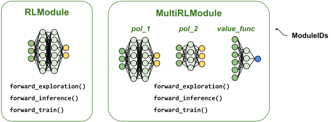
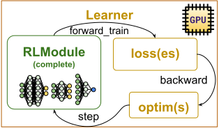

.. include:: /_includes/rllib/we_are_hiring.rst

.. _rllib-key-concepts:

Key concepts
============

.. include:: /_includes/rllib/new_api_stack.rst

To help you get a high-level understanding of how the library works, on this page, you learn about the
key concepts and general architecture of RLlib.

.. figure:: images/rllib_key_concepts.svg
    :width: 750
    :align: left

    **RLlib overview:** The central component of RLlib is the :py:class:`~ray.rllib.algorithms.algorithm.Algorithm`
    class, acting as a runtime for executing your RL experiments.
    Your gateway into using an :ref:`Algorithm <rllib-key-concepts-algorithms>` is the
    :py:class:`~ray.rllib.algorithms.algorithm_config.AlgorithmConfig` (cyan) class, allowing
    you to manage available configuration settings, for example learning rate or model architecture.
    Most :py:class:`~ray.rllib.algorithms.algorithm.Algorithm` objects have
    :py:class:`~ray.rllib.env.env_runner.EnvRunner` actors (blue) to collect training samples
    from the :ref:`RL environment <rllib-key-concepts-environments>` and
    :py:class:`~ray.rllib.core.learner.learner.Learner` actors (yellow)
    to compute gradients and update your :ref:`models <rllib-key-concepts-rl-modules>`.
    The algorithm synchronizes model weights after an update.

.. _rllib-key-concepts-algorithms:

AlgorithmConfig and Algorithm
-----------------------------

.. todo (sven): Change the following link to the actual algorithm and algorithm-config page, once done. Right now, it's pointing to the algos-overview page, instead!

.. tip::
    The following is a quick overview of **RLlib AlgorithmConfigs and Algorithms**.
    See here for a :ref:`detailed description of the Algorithm class <rllib-algorithms-doc>`.

The RLlib :py:class:`~ray.rllib.algorithms.algorithm.Algorithm` class serves as a runtime for your RL experiments,
bringing together all components required for learning an optimal solution to your :ref:`RL environment <rllib-key-concepts-environments>`.
It exposes powerful Python APIs for controlling your experiment runs.

The gateways into using the various RLlib :py:class:`~ray.rllib.algorithms.algorithm.Algorithm` types are the respective
:py:class:`~ray.rllib.algorithms.algorithm_config.AlgorithmConfig` classes, allowing you to configure
available settings in a checked and type-safe manner.
For example, to configure a :py:class:`~ray.rllib.algorithms.ppo.ppo.PPO` ("Proximal Policy Optimization") algorithm instance,
you use the :py:class:`~ray.rllib.algorithms.ppo.ppo.PPOConfig` class.

During its construction, the :py:class:`~ray.rllib.algorithms.algorithm.Algorithm` first sets up its
:py:class:`~ray.rllib.env.env_runner_group.EnvRunnerGroup`, containing ``n``
:py:class:`~ray.rllib.env.env_runner.EnvRunner` `actors <actors.html>`__, and
its :py:class:`~ray.rllib.core.learner.learner_group.LearnerGroup`, containing
``m`` :py:class:`~ray.rllib.core.learner.learner.Learner` `actors <actors.html>`__.
This way, you can scale up sample collection and training, respectively, from a single core to many thousands of cores in a cluster.

.. todo: Separate out our scaling guide into its own page in new PR

See this :ref:`scaling guide <rllib-scaling-guide>` for more details here.

You have two ways to interact with and run an :py:class:`~ray.rllib.algorithms.algorithm.Algorithm`:

- You can create and manage an instance of it directly through the Python API.
- Because the :py:class:`~ray.rllib.algorithms.algorithm.Algorithm` class is a subclass of the :ref:`Tune Trainable API <tune-60-seconds>`,
  you can use `Ray Tune <https://docs.ray.io/en/latest/tune/index.html>`__ to more easily manage your experiment and tune hyperparameters.

The following examples demonstrate this on RLlib's :py:class:`~ray.rllib.algorithms.ppo.PPO` ("Proximal Policy Optimization") algorithm:

.. tab-set::

    .. tab-item:: Manage Algorithm instance directly

        .. testcode::

            from ray.rllib.algorithms.ppo import PPOConfig

            # Configure.
            config = (
                PPOConfig()
                .environment("CartPole-v1")
                .training(
                    train_batch_size_per_learner=2000,
                    lr=0.0004,
                )
            )

            # Build the Algorithm.
            algo = config.build()

            # Train for one iteration, which is 2000 timesteps (1 train batch).
            print(algo.train())

        .. testcode::
            :hide:

            algo.stop()

    .. tab-item:: Run Algorithm through Ray Tune

        .. testcode::

            from ray import tune
            from ray.rllib.algorithms.ppo import PPOConfig

            # Configure.
            config = (
                PPOConfig()
                .environment("CartPole-v1")
                .training(
                    train_batch_size_per_learner=2000,
                    lr=0.0004,
                )
            )

            # Train through Ray Tune.
            results = tune.Tuner(
                "PPO",
                param_space=config,
                # Train for 4000 timesteps (2 iterations).
                run_config=tune.RunConfig(stop={"num_env_steps_sampled_lifetime": 4000}),
            ).fit()

.. _rllib-key-concepts-environments:

RL environments
---------------

.. tip::
    The following is a quick overview of **RL environments**.
    See :ref:`here for a detailed description of how to use RL environments in RLlib <rllib-environments-doc>`.

A reinforcement learning (RL) environment is a structured space, like a simulator or a controlled
section of the real world, in which one or more agents interact and learn to achieve specific goals.
The environment defines an observation space, which is the structure and shape of observable tensors at each timestep,
an action space, which defines the available actions for the agents at each time step, a reward function,
and the rules that govern environment transitions when applying actions.

.. figure:: images/envs/env_loop_concept.svg
    :width: 900
    :align: left

    A simple **RL environment** where an agent starts with an initial observation returned by the ``reset()`` method.
    The agent, possibly controlled by a neural network policy, sends actions, like ``right`` or ``jump``,
    to the environmant's ``step()`` method, which returns a reward. Here, the reward values are +5 for reaching the goal
    and 0 otherwise. The environment also returns a boolean flag indicating whether the episode is complete.

Environments may vary in complexity, from simple tasks, like navigating a grid world, to highly intricate systems, like autonomous
driving simulators, robotic control environments, or multi-agent games.

RLlib interacts with the environment by playing through many :ref:`episodes <rllib-key-concepts-episodes>` during a
training iteration to collect data, such as made observations, taken actions, received rewards and ``done`` flags
(see preceding figure). It then converts this episode data into a train batch for model updating. The goal of these
model updates is to change the agents' behaviors such that it leads to a maximum sum of received rewards over the agents'
lifetimes.

.. _rllib-key-concepts-rl-modules:

RLModules
---------

.. tip::
    The following is a quick overview of **RLlib RLModules**.
    See :ref:`here for a detailed description of the RLModule class <rlmodule-guide>`.

`RLModules <rl-modules.html>`__ are deep-learning framework-specific neural network wrappers.
RLlib's :ref:`EnvRunners <rllib-key-concepts-env-runners>` use them for computing actions when stepping through the
:ref:`RL environment <rllib-key-concepts-environments>` and RLlib's :ref:`Learners <rllib-key-concepts-learners>` use
:py:class:`~ray.rllib.core.rl_module.rl_module.RLModule` instances for computing losses and gradients before updating them.

    **RLModule overview**: *(left)* A minimal :py:class:`~ray.rllib.core.rl_module.rl_module.RLModule` contains a neural network
    and defines its forward exploration-, inference- and training logic.
    *(right)* In more complex setups, a :py:class:`~ray.rllib.core.rl_module.multi_rl_module.MultiRLModule` contains
    many submodules, each itself an :py:class:`~ray.rllib.core.rl_module.rl_module.RLModule` instance and
    identified by a ``ModuleID``, allowing you to implement arbitrarily complex multi-model and multi-agent algorithms.

In a nutshell, an :py:class:`~ray.rllib.core.rl_module.rl_module.RLModule` carries the neural
network models and defines how to use them during the three phases of its RL lifecycle:
**Exploration**, for collecting training data, **inference** when computing actions for evaluation or in production,
and **training** for computing the loss function inputs.

You can chose to use :ref:`RLlib's built-in default models and configure these <rllib-default-rl-modules-docs>` as needed,
for example for changing the number of layers or the activation functions, or
:ref:`write your own custom models in PyTorch <rllib-implementing-custom-rl-modules>`,
allowing you to implement any architecture and computation logic.

.. figure:: images/rl_modules/rl_module_in_env_runner.svg
    :width: 450
    :align: left

    **An RLModule inside an EnvRunner actor**: The :py:class:`~ray.rllib.env.env_runner.EnvRunner` operates on its own copy of an
    inference-only version of the :py:class:`~ray.rllib.core.rl_module.rl_module.RLModule`, using it only to compute actions.

Each :py:class:`~ray.rllib.env.env_runner.EnvRunner` actor, managed by the :py:class:`~ray.rllib.env.env_runner_group.EnvRunnerGroup` of the Algorithm,
has a copy of the user's :py:class:`~ray.rllib.core.rl_module.rl_module.RLModule`.
Also, each :py:class:`~ray.rllib.core.learner.learner.Learner` actor, managed by the
:py:class:`~ray.rllib.core.learner.learner_group.LearnerGroup` of the Algorithm has an :py:class:`~ray.rllib.core.rl_module.rl_module.RLModule` copy.

The :py:class:`~ray.rllib.env.env_runner.EnvRunner` copy is normally in its ``inference_only`` version, meaning that components
not required for bare action computation, for example a value function estimate, are missing to save memory.

    **An RLModule inside a Learner actor**: The :py:class:`~ray.rllib.core.learner.learner.Learner` operates on its own copy of
    an :py:class:`~ray.rllib.core.rl_module.rl_module.RLModule`, computing the loss function inputs, the loss itself,
    and the model's gradients, then updating the :py:class:`~ray.rllib.core.rl_module.rl_module.RLModule`
    through the :py:class:`~ray.rllib.core.learner.learner.Learner`'s optimizers.

.. _rllib-key-concepts-episodes:

Episodes
--------

.. tip::
    The following is a quick overview of **Episode**.
    See :ref:`here for a detailed description of the Episode classes <single-agent-episode-docs>`.

RLlib sends around all training data the form of :ref:`Episodes <single-agent-episode-docs>`.

The :py:class:`~ray.rllib.env.single_agent_episode.SingleAgentEpisode` class describes
single-agent trajectories. The :py:class:`~ray.rllib.env.multi_agent_episode.MultiAgentEpisode` class contains several
such single-agent episodes and describes the stepping times- and patterns of the individual agents with respect to each other.

Both ``Episode`` classes store the entire trajectory data generated while stepping through an :ref:`RL environment <rllib-key-concepts-environments>`.
This data includes the observations, info dicts, actions, rewards, termination signals, and any
model computations along the way, like recurrent states, action logits, or action log probabilities.

.. tip::
    See here for `RLlib's standardized column names <https://github.com/ray-project/ray/blob/master/rllib/core/columns.py>`__.

    Note that episodes conveniently don't have to store any ``next obs`` information as it always overlaps
    with the information under ``obs``. This design saves almost 50% of memory, because
    observations are often the largest piece in a trajectory. The same is true for ``state_in`` and ``state_out``
    information for stateful networks. RLlib only keeps the ``state_out`` key in the episodes.

Typically, RLlib generates episode chunks of size ``config.rollout_fragment_length`` through the :ref:`EnvRunner <rllib-key-concepts-env-runners>`
actors in the Algorithm's :ref:`EnvRunnerGroup <rllib-key-concepts-env-runners>`, and sends as many episode chunks to each
:ref:`Learner <rllib-key-concepts-learners>` actor as required to build one training batch of exactly size
``config.train_batch_size_per_learner``.

A typical :py:class:`~ray.rllib.env.single_agent_episode.SingleAgentEpisode` object roughly looks as follows:

.. code-block:: python

    # A SingleAgentEpisode of length 20 has roughly the following schematic structure.
    # Note that after these 20 steps, you have 20 actions and rewards, but 21 observations and info dicts
    # due to the initial "reset" observation/infos.
    episode = {
        'obs': np.ndarray((21, 4), dtype=float32),  # 21 due to additional reset obs
        'infos': [{}, {}, {}, {}, .., {}, {}],  # infos are always lists of dicts
        'actions': np.ndarray((20,), dtype=int64),  # Discrete(4) action space
        'rewards': np.ndarray((20,), dtype=float32),
        'extra_model_outputs': {
            'action_dist_inputs': np.ndarray((20, 4), dtype=float32),  # Discrete(4) action space
        },
        'is_terminated': False,  # <- single bool
        'is_truncated': True,  # <- single bool
    }

For complex observations, for example ``gym.spaces.Dict``, the episode holds all observations in a struct entirely analogous
to the observation space, with NumPy arrays at the leafs of that dict. For example:

.. code-block:: python

    episode_w_complex_observations = {
        'obs': {
            "camera": np.ndarray((21, 64, 64, 3), dtype=float32),  # RGB images
            "sensors": {
                "front": np.ndarray((21, 15), dtype=float32),  # 1D tensors
                "rear": np.ndarray((21, 5), dtype=float32),  # another batch of 1D tensors
            },
        },
        ...

Because RLlib keeps all values in NumPy arrays, this allows for efficient encoding and
transmission across the network.

In `multi-agent mode <rllib-concepts.html#policies-in-multi-agent>`__, the :py:class:`~ray.rllib.env.env_runner_group.EnvRunnerGroup`
produces :py:class:`~ray.rllib.env.multi_agent_episode.MultiAgentEpisode` instances.

.. note::
    The Ray team is working on a detailed description of the
    :py:class:`~ray.rllib.env.multi_agent_episode.MultiAgentEpisode` class.

.. _rllib-key-concepts-env-runners:

EnvRunner: Combining RL environment and RLModule
------------------------------------------------

Given the :ref:`RL environment <rllib-key-concepts-environments>` and an :ref:`RLModule <rllib-key-concepts-rl-modules>`,
an :py:class:`~ray.rllib.env.env_runner.EnvRunner` produces lists of :ref:`Episodes <rllib-key-concepts-episodes>`.

It does so by executing a classic environment interaction loop. Efficient sample collection
can be burdensome to get right, especially when leveraging environment vectorization,
stateful recurrent neural networks, or when operating in a multi-agent setting.

RLlib provides two built-in :py:class:`~ray.rllib.env.env_runner.EnvRunner` classes,
:py:class:`~ray.rllib.env.single_agent_env_runner.SingleAgentEnvRunner` and
:py:class:`~ray.rllib.env.multi_agent_env_runner.MultiAgentEnvRunner` that
automatically handle these complexities. RLlib picks the correct type based on your
configuration, in particular the `config.environment()` and `config.multi_agent()`
settings.

.. tip::
    Call the :py:meth:`~ray.rllib.algorithms.algorithm_config.AlgorithmConfig.is_multi_agent`
    method to find out, whether your config is multi-agent or not.

RLlib bundles several :py:class:`~ray.rllib.env.env_runner.EnvRunner` actors through the
:py:class:`~ray.rllib.env.env_runner_group.EnvRunnerGroup` API.

You can also use an :py:class:`~ray.rllib.env.env_runner.EnvRunner` standalone to produce lists of Episodes by calling its
:py:meth:`~ray.rllib.env.env_runner.EnvRunner.sample` method.

Here is an example of creating a set of remote :py:class:`~ray.rllib.env.env_runner.EnvRunner` actors
and using them to gather experiences in parallel:

.. testcode::

    import tree  # pip install dm_tree
    import ray
    from ray.rllib.algorithms.ppo import PPOConfig
    from ray.rllib.env.single_agent_env_runner import SingleAgentEnvRunner

    # Configure the EnvRunners.
    config = (
        PPOConfig()
        .environment("Acrobot-v1")
        .env_runners(num_env_runners=2, num_envs_per_env_runner=1)
    )
    # Create the EnvRunner actors.
    env_runners = [
        ray.remote(SingleAgentEnvRunner).remote(config=config)
        for _ in range(config.num_env_runners)
    ]

    # Gather lists of `SingleAgentEpisode`s (each EnvRunner actor returns one
    # such list with exactly two episodes in it).
    episodes = ray.get([
        er.sample.remote(num_episodes=3)
        for er in env_runners
    ])
    # Two remote EnvRunners used.
    assert len(episodes) == 2
    # Each EnvRunner returns three episodes
    assert all(len(eps_list) == 3 for eps_list in episodes)

    # Report the returns of all episodes collected
    for episode in tree.flatten(episodes):
        print("R=", episode.get_return())

.. testcode::
    :hide:

    for er in env_runners:
        er.stop.remote()

.. _rllib-key-concepts-learners:

Learner: Combining RLModule, loss function and optimizer
--------------------------------------------------------

.. tip::
    The following is a quick overview of **RLlib Learners**.
    See :ref:`here for a detailed description of the Learner class <learner-guide>`.

Given the :ref:`RLModule <rllib-key-concepts-rl-modules>` and one or more optimizers and loss functions,
a :py:class:`~ray.rllib.core.learner.learner.Learner` computes losses and gradients, then updates the :py:class:`~ray.rllib.core.rl_module.rl_module.RLModule`.

The input data for such an update step comes in as a list of :ref:`episodes <rllib-key-concepts-episodes>`,
which either the Learner's own connector pipeline or an external one converts into the final train batch.

.. note::
    :py:class:`~ray.rllib.connectors.connector_v2.ConnectorV2` documentation is work in progress.
    The Ray team links to the correct documentation page here, once it has completed this work.

:py:class:`~ray.rllib.core.learner.learner.Learner` instances are algorithm-specific, mostly due to the various
loss functions used by different RL algorithms.

RLlib always bundles several :py:class:`~ray.rllib.core.learner.learner.Learner` actors through
the :py:class:`~ray.rllib.core.learner.learner_group.LearnerGroup` API, automatically applying
distributed data parallelism (``DDP``) on the training data.
You can also use a :py:class:`~ray.rllib.core.learner.learner.Learner` standalone to update your RLModule
with a list of Episodes.

Here is an example of creating a remote :py:class:`~ray.rllib.core.learner.learner.Learner`
actor and calling its :py:meth:`~ray.rllib.core.learner.learner.Learner.update` method.

.. testcode::

    import gymnasium as gym
    import ray
    from ray.rllib.algorithms.ppo import PPOConfig
    from ray.rllib.core.rl_module.default_model_config import DefaultModelConfig

    # Configure the Learner.
    config = (
        PPOConfig()
        .environment("Acrobot-v1")
        .training(lr=0.0001)
        .rl_module(model_config=DefaultModelConfig(fcnet_hiddens=[64, 32]))
    )
    # Get the Learner class.
    ppo_learner_class = config.get_default_learner_class()

    # Create the Learner actor.
    learner_actor = ray.remote(ppo_learner_class).remote(
        config=config,
        module_spec=config.get_multi_rl_module_spec(env=gym.make("Acrobot-v1")),
    )
    # Build the Learner.
    ray.get(learner_actor.build.remote())

    # Perform an update from the list of episodes we got from the `EnvRunners` above.
    learner_results = ray.get(learner_actor.update.remote(
        episodes=tree.flatten(episodes)
    ))
    print(learner_results["default_policy"]["policy_loss"])
