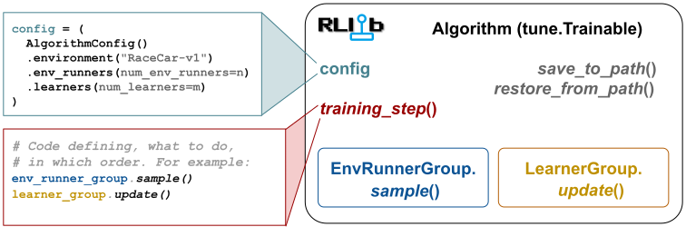

.. include:: /_includes/rllib/we_are_hiring.rst

.. include:: /_includes/rllib/new_api_stack.rst

.. _rllib-key-concepts:

Key concepts
============

To help you get a high-level understanding of how the library works, on this page, you learn about the
key concepts and general architecture of RLlib.

    **RLlib overview:** The central component of RLlib is the :py:class:`~ray.rllib.algorithms.algorithm.Algorithm`
    class, acting as a runtime for executing your RL experiments.
    Your gateway into using an :py:class:`~ray.rllib.algorithms.algorithm.Algorithm` is the
    :py:class:`~ray.rllib.algorithms.algorithm_config.AlgorithmConfig` (**cyan**) class, allowing
    you to manage all available config settings, for example the learning rate.
    Most :py:class:`~ray.rllib.algorithms.algorithm.Algorithm` objects have an
    :py:class:`~ray.rllib.env.env_runner_group.EnvRunnerGroup` (**blue**) to collect training samples
    from the RL environment, a :py:class:`~ray.rllib.core.learner.learner_group.LearnerGroup` (**yellow**)
    to compute gradients and update your models, and a :py:meth:`~ray.rllib.algorithms.algorithm.Algorithm.training_step` method (**red**), defining
    **when** the the algorithm should do **what**.
    Copies of the models being trained are located in both :py:class:`~ray.rllib.env.env_runner_group.EnvRunnerGroup`
    and :py:class:`~ray.rllib.core.learner.learner_group.LearnerGroup` and the model's weights are synchronized after
    model updates.

.. _rllib-key-concepts-algorithms:

Algorithms
----------

The RLlib `Algorithm` class brings all required components together, making learning of different
RL environments accessible through the library's Python APIs.

Each :py:class:`~ray.rllib.algorithms.algorithm.Algorithm` class is managed by its respective
:py:class:`~ray.rllib.algorithms.algorithm_config.AlgorithmConfig` class. For example, to configure a
:py:class:`~ray.rllib.algorithms.ppo.ppo.PPO` ("Proximal Policy Optimization") instance, you should use
the :py:class:`~ray.rllib.algorithms.ppo.ppo.PPOConfig` class.

An algorithm sets up its :py:class:`~ray.rllib.env.env_runner_group.EnvRunnerGroup` and
:py:class:`~ray.rllib.core.learner.learner_group.LearnerGroup`, both of which use `Ray actors <actors.html>`__ to scale sample collection
and training, respectively, from a single core to many thousands of cores in a cluster.

.. TODO: Separate out our scaling guide into its own page in new PR

See this `scaling guide <rllib-training.html#scaling-guide>`__ for more details here.

:py:class:`~ray.rllib.algorithms.algorithm.Algorithm` also subclasses from the :ref:`Tune Trainable API <tune-60-seconds>`
for easy experiment management and hyperparameter tuning.

You have two ways to interact with and run an :py:class:`~ray.rllib.algorithms.algorithm.Algorithm`.

- You can create and manage an instance of it directly through the Python API.
- You can use Ray Tune to more easily tune the hyperparameters for a particular problem.

The following example shows these equivalent ways of interacting with the ``PPO`` ("Proximal Policy Optimization") algorithm of RLlib:

.. tab-set::

    .. tab-item:: Manage ``Algorithm`` instance directly

        .. testcode::

            from ray.rllib.algorithms.ppo import PPOConfig

            # Configure.
            config = (
                PPOConfig()
                .environment("CartPole-v1")
                .training(
                    train_batch_size_per_learner=2000,
                    lr=0.0004,
                )
            )

            # Build the Algorithm.
            algo = config.build()

            # Train for one iteration, which is 2000 timesteps (1 train batch).
            print(algo.train())

    .. tab-item:: Run ``Algorithm`` through Ray Tune

        .. testcode::

            from ray import train, tune
            from ray.rllib.algorithms.ppo import PPOConfig

            # Configure.
            config = (
                PPOConfig()
                .environment("CartPole-v1")
                .training(
                    train_batch_size_per_learner=2000,
                    lr=0.0004,
                )
            )

            # Train through Ray Tune.
            results = tune.Tuner(
                "PPO",
                param_space=config,
                # Train for 4000 timesteps (2 iterations).
                run_config=train.RunConfig(stop={"num_env_steps_sampled_lifetime": 4000}),
            ).fit()

.. _rllib-key-concepts-rl-modules:

RLModules
---------

`RLModules <rllib-rlmodule.html>`__ are framework-specific neural network containers.

.. TODO: update with new RLModule figure in other PR

.. figure:: images/rllib-blabla.png

    **RLModule overview**: *(left)* A minimal :py:class:`~ray.rllib.core.rl_module.rl_module.RLModule` contains a neural network
    and defines its exploration-, inference- and training logic to map observations to actions.
    *(right)* In more complex setups, a :py:class:`~ray.rllib.core.rl_module.multi_rl_module.MultiRLModule` contains
    many submodules, each itself an :py:class:`~ray.rllib.core.rl_module.rl_module.RLModule` instance and
    identified by a ``ModuleID``. This way, arbitrarily complex multi-model and multi-agent algorithms
    can be implemented.

In a nutshell, ``RLModules`` carry the neural networks and define how to use them during the three phases of a model's
reinforcement learning lifecycle: Exploration (collecting training data), inference (production/deployment),
and training (computing loss function inputs).

.. link to new RLModule docs

You can chose to use :ref:`RLlib's built-in default models and configure these <rllib_default_rl_modules_docs>` as needed
(change number of layers and size, activation functions, etc..) or :ref:`write your own custom models in PyTorch <rllib-implementing-custom-rl-modules>`,
allowing you to implement any architecture and computation logic.

.. figure:: images/rl_modules/rl_module_in_env_runner.svg
    :width: 400

    **An RLModule inside an EnvRunner actor**: The :py:class:`~ray.rllib.env.env_runner.EnvRunner` operates on its own copy of your
    (usually inference-only) :py:class:`~ray.rllib.core.rl_module.rl_module.RLModule`, using it to only compute actions.

A copy of the user's RLModule is located inside each :py:class:`~ray.rllib.env.env_runner.EnvRunner` actor
managed by the :py:class:`~ray.rllib.env.env_runner_group.EnvRunnerGroup` of the Algorithm and another one in each
:py:class:`~ray.rllib.core.learner.learner.Learner` actor managed by the :py:class:`~ray.rllib.core.learner.learner_group.LearnerGroup`
of the Algorithm.

.. figure:: images/rl_modules/rl_module_in_learner.svg
    :width: 400

    **An RLModule inside a Learner actor**: The :py:class:`~ray.rllib.core.learner.learner.:Learner` operates on its own copy of your (complete)
    :py:class:`~ray.rllib.core.rl_module.rl_module.RLModule`, computing the loss function inputs, the loss itself,
    and model gradients, then updating your RLModule through its optimizer.

The EnvRunner copy is normally kept in an ``inference_only`` version, meaning those components that aren't
required for pure action computations (for example, a value function) may be missing to save memory.

.. _rllib-key-concepts-environments:

RL environments
---------------

Solving a problem in RL begins with an **environment**. In the simplest definition of RL:

  An **agent** interacts with an **environment** and receives a reward.

An environment in RL is the agent's world, it is a simulation of the problem to be solved.

.. figure:: images/env_key_concept1.png

An RLlib environment consists of:

1. all possible actions (**action space**)
2. a complete description of the environment, nothing hidden (**state space**)
3. an observation by the agent of certain parts of the state (**observation space**)
4. **reward**, which is the only feedback the agent receives per action.

The model that tries to maximize the expected sum over all future rewards is called a **policy**. The policy is a function mapping the environment's observations to an action to take, usually written **π** (s(t)) -> a(t). Below is a diagram of the RL iterative learning process.

.. image:: images/env_key_concept2.png

The RL simulation feedback loop repeatedly collects data, for one (single-agent case) or multiple (multi-agent case) policies, trains the policies on these collected data, and makes sure the policies' weights are kept in sync. Thereby, the collected environment data contains observations, taken actions, received rewards and so-called **done** flags, indicating the boundaries of different episodes the agents play through in the simulation.

The simulation iterations of action -> reward -> next state -> train -> repeat, until the end state, is called an **episode**, or in RLlib, a **rollout**.
The most common API to define environments is the :ref:`Farama-Foundation Gymnasium <gymnasium>` API, which we also use in most of our examples.

.. _rllib-key-concepts-episodes:

Episodes
--------

Whether running in a single process or a `large cluster <rllib-training.html#specifying-resources>`__,
all training data in RLlib is interchanged in the form of :ref:`Episodes <single-agent-episode-docs>`.

The :py:class`~ray.rllib.env.single_agent_episode.SingleAgentEpisode` class is used for
describing single-agent trajectories, whereas the
:py:class`~ray.rllib.env.multi_agent_episode.MultiAgentEpisode` class contains several
such single-agent episodes and also stores information about the stepping times- and patterns of
the individual agents with respect to each other.

Both these ``Episode`` classes store the entire data collected and generated while stepping through an
environment (trajectory). This includes the observations, info dicts, actions taken,
rewards received, and any model computations along the way, such as RNN-states, action logits,
or action log probs.

.. tip::
    See here for `RLlib's standardized columns used across all classes <https://github.com/ray-project/ray/blob/master/rllib/core/columns.py>`__.
    Note also that episodes conveniently don't have to store any "next obs" information as these always overlap
    almost completely with the information in "obs", thus saving about 50% of memory (observations are often the
    largest piece in a trajectory). Same is true for "state_in" and "state_out" information for stateful networks: Only
    the "state_out" information is kept.

Typically, RLlib generates episode (chunks) of size ``config.rollout_fragment_length`` through the :ref:`EnvRunner <rllib-key-concepts-env-runners>`
actors in the Algorithm's :ref:`EnvRunnerGroup <rllib-key-concepts-env-runners>`, and sends as many episode chunks to each
:ref:`Learner <rllib-key-concepts-learners>` actor as required to build a final training batch of exactly size
``config.train_batch_size_per_learner``.

A typical :py:class:`~ray.rllib.env.single_agent_episode.SingleAgentEpisode` object looks something like the following:

.. code-block:: python

    # A SingleAgentEpisode of length 20 has roughly the following schematic structure.
    # Note that after these 20 steps, you have 20 actions and rewards, but 21 observations and info dicts
    # due to the initial "reset" observation/infos.
    episode = {
        'obs': np.ndarray((21, 4), dtype=float32),  # 21 due to reset obs
        'infos': [{}, {}, {}, {}, .., {}, {}],  # infos are always lists of dicts
        'actions': np.ndarray((20,), dtype=int64),  # Discrete(4) action space
        'rewards': np.ndarray((20,), dtype=float32),
        'extra_model_outputs': {
            'action_dist_inputs': np.ndarray((20, 4), dtype=float32),  # Discrete(4) action space
        },
        'is_terminated': False,  # <- single bool
        'is_truncated': True,  # <- single bool
    }

For complex observations, for example ``gym.spaces.Dict``, the episode holds all observations in a struct entirely analogous
to the observation space, with numpy arrays at the leafs of that dict:

.. code-block:: python

    episode_w_complex_observations = {
        'obs': {
            "camera": np.ndarray((21, 64, 64, 3), dtype=float32),  # RGB images
            "sensors": {
                "front": np.ndarray((21, 15), dtype=float32),  # 1D tensors
                "rear": np.ndarray((21, 5), dtype=float32),  # another batch of 1D tensors
            },
        },
        ...

Since all values are kept in numpy arrays, this allows for efficient encoding and transmission across the network.

In `multi-agent mode <rllib-concepts.html#policies-in-multi-agent>`__,
:py:class:`~ray.rllib.env.multi_agent_episode.MultiAgentEpisode` are collected by the EnvRunnerGroup instead.

.. note::
    The Ray team is working on a detailed description of the
    :py:class:`~ray.rllib.env.multi_agent_episode.MultiAgentEpisode` class.

.. _rllib-key-concepts-env-runners:

EnvRunners
----------

Given an RL environment and RLModule, an :py:class`~ray.rllib.env.env_runner.EnvRunner`
produces lists of :ref:`Episodes <single-agent-episode-docs>`.

Thereby, the ``EnvRunner`` executes a classic "environment interaction loop".
Efficient sample collection can be burdensome to get right, especially when leveraging
environment vectorization, stateful (recurrent) neural networks,
or when operating in a multi-agent setting.

RLlib provides two built-in :py:class`~ray.rllib.env.env_runner.EnvRunner` classes,
:py:class`~ray.rllib.env.single_agent_env_runner.SingleAgentEnvRunner` and
:py:class`~ray.rllib.env.multi_agent_env_runner.MultiAgentEnvRunner` that
manage all of this automatically. RLlib picks the correct type based on your
configuration, in particular the `config.environment()` and `config.multi_agent()`
settings.

You can use an :py:class`~ray.rllib.env.env_runner.EnvRunner` standalone to
produce lists of Episodes. This can be done by calling its
:py:meth:`~ray.rllib.env.env_runner.EnvRunner.sample` method (or ``EnvRunner.sample.remote()`` in the distributed Ray actor setup).

Here is an example of creating a set of remote :py:class:`~ray.rllib.env.env_runner.EnvRunner` actors
and using them to gather experiences in parallel:

.. testcode::

    import tree  # pip install dm_tree
    from ray.rllib.algorithms.ppo import PPOConfig
    from ray.rllib.env.env_runner_group import EnvRunnerGroup

    # Configure the EnvRunnerGroup.
    config = (
        PPOConfig()
        .environment("Acrobot-v1")
        .env_runners(num_env_runners=2, num_envs_per_env_runner=1)
    )
    # Create the EnvRunnerGroup.
    env_runner_group = EnvRunnerGroup(config=config)

    # Gather lists of `SingleAgentEpisode`s (each EnvRunner actor returns one
    # such list with exactly two episodes in it).
    episodes = env_runner_group.foreach_env_runner(
        lambda env_runner: env_runner.sample(num_episodes=3),
        local_env_runner=False,  # don't sample with the local EnvRunner instance
    )
    # Two (remote) EnvRunners used.
    assert len(episodes) == 2
    # Each EnvRunner returns three episodes
    assert all(len(eps_list) == 3 for eps_list in episodes)

    # Report the returns of all episodes collected
    for episode in tree.flatten(episodes):
        print("R=", episode.get_return())

    env_runner_group.stop()

.. _rllib-key-concepts-learners:

Learners, loss functions and optimizers
---------------------------------------

TODO !!

.. Training Step Method (``Algorithm.training_step()``)
.. Moved to new rllib-algorithm-api.rst file in other PR (branch: `docs_redo_algorithm_api`)
