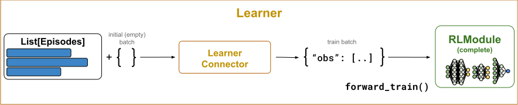
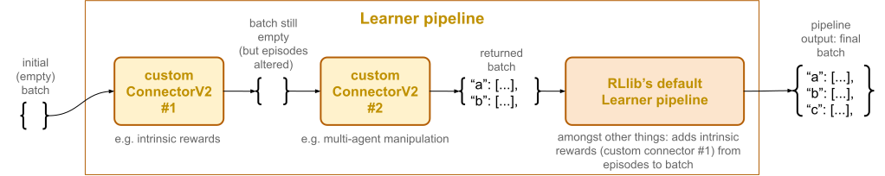
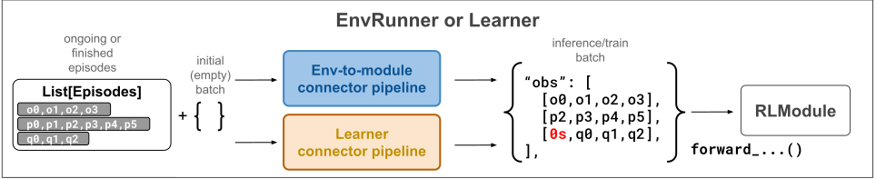

.. include:: /_includes/rllib/we_are_hiring.rst

.. _learner-pipeline-docs:

.. grid:: 1 2 3 4
    :gutter: 1
    :class-container: container pb-3

    .. grid-item-card::
        :img-top: /rllib/images/connector_v2/connector_generic.svg
        :class-img-top: pt-2 w-75 d-block mx-auto fixed-height-img

        .. button-ref:: connector-v2-docs

            ConnectorV2 overview

    .. grid-item-card::
        :img-top: /rllib/images/connector_v2/env_to_module_connector.svg
        :class-img-top: pt-2 w-75 d-block mx-auto fixed-height-img

        .. button-ref:: env-to-module-pipeline-docs

            Env-to-module pipelines

    .. grid-item-card::
        :img-top: /rllib/images/connector_v2/learner_connector.svg
        :class-img-top: pt-2 w-75 d-block mx-auto fixed-height-img

        .. button-ref:: learner-pipeline-docs

            Learner connector pipelines (this page)

Learner connector pipelines
===========================

.. include:: /_includes/rllib/new_api_stack.rst

On each :py:class:`~ray.rllib.core.learner.learner.Learner` actor resides a single Learner connector pipeline (see figure below)
responsible for compiling the train batch for the :py:class:`~ray.rllib.core.rl_module.rl_module.RLModule` from a list of episodes.

    **Learner ConnectorV2 Pipelines**: A learner connector pipeline sits between the input training data, a list of episodes,
    and the :py:class:`~ray.rllib.core.learner.learner.Learner` actor's :py:class:`~ray.rllib.core.rl_module.rl_module.RLModule`.
    The pipeline transforms this input data into a train batch readable by the
    :py:meth:`~ray.rllib.core.rl_module.rl_module.RLModule.forward_train` method of the :py:class:`~ray.rllib.core.rl_module.rl_module.RLModule`.

When calling the Learner connector pipeline, a transformation from a list of :ref:`Episode objects <single-agent-episode-docs>` to an
``RLModule``-readable tensor batch, also referred to as the "train batch", takes place and the :py:class:`~ray.rllib.core.learner.learner.Learner` actor
sends the output of the pipeline directly into the
:py:meth:`~ray.rllib.core.rl_module.rl_module.RLModule.forward_train` method of the :py:class:`~ray.rllib.core.rl_module.rl_module.RLModule`.

.. _default-learner-pipeline:

Default Learner pipeline behavior
---------------------------------

By default RLlib populates every Learner connector pipeline with the following built-in connector pieces.

* :py:class:`~ray.rllib.connectors.common.add_observations_from_episodes_to_batch.AddObservationsFromEpisodesToBatch`: Places all observations from the incoming episodes into the batch. The column name is ``obs``. For example, if you have two incoming episodes of length 10 and 20, your resulting train batch size is 30.
* :py:class:`~ray.rllib.connectors.learner.add_columns_from_episodes_to_batch.AddColumnsFromEpisodesToBatch`: Places all other columns, like rewards, actions, and termination flags, from the incoming episodes into the batch.
* *Relevant for stateful models only:* :py:class:`~ray.rllib.connectors.common.add_time_dim_to_batch_and_zero_pad.AddTimeDimToBatchAndZeroPad`: If the :py:class:`~ray.rllib.core.rl_module.rl_module.RLModule` is stateful, adds a time-dimension of size `max_seq_len` at axis=1 to all data in the batch and (right) zero-pads in cases where episodes end at timesteps non-dividable by `max_seq_len`. You can change `max_seq_len` through your RLModule's `model_config_dict` (call `config.rl_module(model_config_dict={'max_seq_len': ...})` on your :py:class:`~ray.rllib.algorithms.algorithm_config.AlgorithmConfig` object).
* *Relevant for stateful models only:* :py:class:`~ray.rllib.connectors.common.add_states_from_episodes_to_batch.AddStatesFromEpisodesToBatch`: If the :py:class:`~ray.rllib.core.rl_module.rl_module.RLModule` is stateful, places the most recent state outputs of the module as new state inputs into the batch. The column name is ``state_in`` and the values don't have a time-dimension.
* *For multi-agent only:* :py:class:`~ray.rllib.connectors.common.agent_to_module_mapping.AgentToModuleMapping`: Maps per-agent data to the respective per-module data depending on the already determined agent-to-module mapping stored in each multi-agent episode.
* :py:class:`~ray.rllib.connectors.common.batch_individual_items.BatchIndividualItems`: Converts all data in the batch, which thus far are lists of individual items, into batched structures meaning NumPy arrays, whose 0th axis is the batch axis.
* :py:class:`~ray.rllib.connectors.common.numpy_to_tensor.NumpyToTensor`: Converts all NumPy arrays in the batch into framework specific tensors and moves these to the GPU, if required.

You can disable all the preceding default connector pieces by setting `config.learners(add_default_connectors_to_learner_pipeline=False)`
in your :ref:`algorithm config <rllib-algo-configuration-docs>`.

Note that the order of these transforms is very relevant for the functionality of the pipeline.

.. _writing_custom_learner_connectors:

Writing custom Learner connectors
---------------------------------

You can customize the Learner connector pipeline through specifying a function in your
:py:class:`~ray.rllib.algorithms.algorithm_config.AlgorithmConfig`, which takes the observation- and action spaces as input arguments and
returns a single :py:class:`~ray.rllib.connectors.connector_v2.ConnectorV2` piece or a list thereof.

RLlib prepends these :py:class:`~ray.rllib.connectors.connector_v2.ConnectorV2` instances to the
:ref:`default Learner pipeline <default-learner-pipeline>` in the order returned,
unless you set `add_default_connectors_to_learner_pipeline=False` in your config, in which case RLlib exclusively uses the provided
:py:class:`~ray.rllib.connectors.connector_v2.ConnectorV2` pieces without any automatically added default behavior.

For example, to prepend a custom :py:class:`~ray.rllib.connectors.connector_v2.ConnectorV2` piece to the
:py:class:`~ray.rllib.core.learner.learner.Learner` connector pipeline, you can do this in your config:

.. testcode::
    :skipif: True

    config.learners(
        learner_connector=lambda obs_space, act_space: MyLearnerConnector(..),
    )

If you want to add multiple custom pieces to the pipeline, return them as a list:

.. testcode::
    :skipif: True

    # Return a list of connector pieces to make RLlib add all of them to your
    # Learner pipeline.
    config.learners(
        learner_connector=lambda obs_space, act_space: [
            MyLearnerConnector(..),
            MyOtherLearnerConnector(..),
            AndOneMoreConnector(..),
        ],
    )

RLlib adds the connector pieces returned by your function to the beginning of the Learner pipeline,
before the previously described default connector pieces that RLlib provides automatically:

    **Inserting custom ConnectorV2 pieces into the Learner pipeline**: RLlib inserts custom connector pieces, such
    as intrinsic reward computation, before the default pieces. This way, if your custom connectors alter the input episodes
    in any way, for example by changing the rewards as in the succeeding example,
    the default pieces at the end of the pipeline automatically add these changed rewards to the batch.

Example: Reward shaping prior to loss computation
~~~~~~~~~~~~~~~~~~~~~~~~~~~~~~~~~~~~~~~~~~~~~~~~~

A good example of when to write a custom Learner ConnectorV2 piece is reward shaping before computing your algorithm's loss.
The Learner connector's :py:meth:`~ray.rllib.connectors.connector_v2.ConnectorV2.__call__` has full access to the
entire episode data, including observations, actions, other agents' data in multi-agent scenarios, and all rewards.

Here are the most important code snippets for setting up a simple, count-based intrinsic reward signal.
The custom connector computes the intrinsic reward as the inverse number of times an agent has already seen a specific observation.
Thus, the more the agent visits a certain state, the lower the
computed intrinsic reward for that state, motivating the agent to visit new states and show better exploratory behavior.

See `here for the full count-based intrinsic reward example script <https://github.com/ray-project/ray/blob/master/rllib/examples/curiosity/count_based_curiosity.py>`__.

You can write the custom Learner connector by subclassing :py:class:`~ray.rllib.connectors.connector_v2.ConnectorV2` and overriding
the :py:meth:`~ray.rllib.connectors.connector_v2.ConnectorV2.__call__` method:

.. testcode::

    from collections import Counter
    from ray.rllib.connectors.connector_v2 import ConnectorV2

    class CountBasedIntrinsicRewards(ConnectorV2):

        def __init__(self, **kwargs):
            super().__init__(**kwargs)

            # Observation counter to compute state visitation frequencies.
            self._counts = Counter()

In the :py:meth:`~ray.rllib.connectors.connector_v2.ConnectorV2.__call__` method, you then loop through all
single-agent episodes and change the reward stored in these to: ``r(t) = re(t) + 1 / N(ot)``, where ``re`` is the extrinsic reward from the
RL environment and ``N(ot)`` is the number of times the agent has already been to observation ``o(t)``.

.. testcode::

        def __call__(
            self,
            *,
            rl_module,
            batch,
            episodes,
            explore=None,
            shared_data=None,
            **kwargs,
        ):
            for sa_episode in self.single_agent_episode_iterator(
                episodes=episodes, agents_that_stepped_only=False
            ):
                # Loop through all observations, except the last one.
                observations = sa_episode.get_observations(slice(None, -1))
                # Get all respective extrinsic rewards.
                rewards = sa_episode.get_rewards()

                for i, (obs, rew) in enumerate(zip(observations, rewards)):
                    # Add 1 to obs counter.
                    obs = tuple(obs)
                    self._counts[obs] += 1
                    # Compute the count-based intrinsic reward and add it to the extrinsic
                    # reward.
                    rew += 1 / self._counts[obs]
                    # Store the new reward back to the episode (under the correct
                    # timestep/index).
                    sa_episode.set_rewards(new_data=rew, at_indices=i)

            return batch

If you plug in this custom :py:class:`~ray.rllib.connectors.connector_v2.ConnectorV2` piece into the pipeline through
the algorithm config
(`config.learners(learner_connector=lambda env: CountBasedIntrinsicRewards())`),
your loss function should receive the altered reward signals in the ``rewards`` column of the incoming batch.

.. note::
    Your custom logic writes the new rewards right back into the given episodes
    instead of placing them into the train batch. This strategy of writing back those data you pulled from episodes right back
    into the same episodes makes sure that from this point on, only the changed data is visible to the subsequent connector pieces.
    The batch remains unchanged at first. However, one of the subsequent
    :ref:`default Learner connector pieces <default-learner-pipeline>`, :py:class:`~ray.rllib.connectors.learner.add_columns_from_episodes_to_batch.AddColumnsFromEpisodesToBatch`,
    fills the batch with rewards data from the episodes.
    Therefore, RLlib automatically adds to the train batch any changes you make to the episode objects.

Example: Stacking the N most recent observations
~~~~~~~~~~~~~~~~~~~~~~~~~~~~~~~~~~~~~~~~~~~~~~~~

Another application of the Learner connector API, in combination with a
:ref:`custom env-to-module connector piece <writing_custom_env_to_module_connectors>`, is efficient observation frame stacking,
without having to deduplicate the stacked, overlapping observation data and without having to store these additional, overlapping
observations in your episodes or send them through the network for inter-actor communication:

    **ConnectorV2 setup for observation frame-stacking**: An env-to-module connector pipeline, inside an
    :py:class:`~ray.rllib.env.env_runner.EnvRunner`, and a Learner connector pipeline, inside
    a :py:class:`~ray.rllib.core.learner.learner.Learner` actor, both of which contain a
    custom :py:class:`~ray.rllib.connectors.connector_v2.ConnectorV2` piece, which stacks the last four
    observations from either the ongoing (``EnvRunner``) or already collected episodes (``Learner``) and places these
    in the batch. Note that you should use dummy, zero-filled observations (in the batch, in red) where the stacking happens close to the beginning of
    the episode.

Because you aren't overriding the original, non-stacked observations in the collected episodes, you have to apply the same
batch construction logic responsible for the observation stacking twice, once for the action computation
on the :py:class:`~ray.rllib.env.env_runner.EnvRunner` actors and also for the loss computation on the
:py:class:`~ray.rllib.core.learner.learner.Learner` actors.

For better clarity, it may help to remember that batches produced by a connector pipeline are ephemeral and RLlib discards them right
after the :py:class:`~ray.rllib.core.rl_module.rl_module.RLModule` forward pass. Thus, if frame stacking happens directly on
the batch under construction, because you don't want to overload the episodes with deduplicated, stacked observations,
you have to apply the stacking logic twice (in the :ref:`env-to-module pipeline <env-to-module-pipeline-docs>` and the Learner connector pipeline):

The following is an example for implementing such a frame-stacking mechanism using
the :py:class:`~ray.rllib.connectors.connector_v2.ConnectorV2` APIs with an RL environment, in which observations are plain 1D tensors.

See here for a `more complex end-to-end Atari example for PPO <https://github.com/ray-project/ray/blob/master/rllib/tuned_examples/ppo/atari_ppo.py>`__.

You can write a single :py:class:`~ray.rllib.connectors.connector_v2.ConnectorV2` class to cover both the env-to-module as well as
the Learner custom connector part:

.. testcode::

    import gymnasium as gym
    import numpy as np
    from ray.rllib.connectors.connector_v2 import ConnectorV2
    from ray.rllib.core.columns import Columns

    class StackFourObservations(ConnectorV2):
        """A connector piece that stacks the previous four observations into one.

        Works both as Learner connector as well as env-to-module connector.
        """

        def recompute_output_observation_space(
            self,
            input_observation_space,
            input_action_space,
        ):
            # Assume the input observation space is a Box of shape (x,).
            assert (
                isinstance(input_observation_space, gym.spaces.Box)
                and len(input_observation_space.shape) == 1
            )

            # This connector concatenates the last four observations at axis=0, so the
            # output space has a shape of (4*x,).
            return gym.spaces.Box(
                low=input_observation_space.low,
                high=input_observation_space.high,
                shape=(input_observation_space.shape[0] * 4,),
                dtype=input_observation_space.dtype,
            )

        def __init__(
            self,
            input_observation_space,
            input_action_space,
            *,
            as_learner_connector,
            **kwargs,
        ):
            super().__init__(input_observation_space, input_action_space, **kwargs)
            self._as_learner_connector = as_learner_connector

        def __call__(self, *, rl_module, batch, episodes, **kwargs):

            # Loop through all (single-agent) episodes.
            for sa_episode in self.single_agent_episode_iterator(episodes):

                # Get the four most recent observations from the episodes.
                last_4_obs = sa_episode.get_observations(
                    indices=[-4, -3, -2, -1],
                    fill=0.0,  # Left-zero-fill in case you reach beginning of episode.
                )
                # Concatenate all stacked observations.
                new_obs = np.concatenate(last_4_obs, axis=0)

                # Add the stacked observations to the `batch` using the
                # `ConnectorV2.add_batch_item()` utility.

                # Note that you don't change the episode here, which means, if `self` is
                # the env-to-module connector piece (as opposed to the Learner connector
                # piece), the episode collected still has only single, non-stacked
                # observations, which the Learner pipeline must stack again for the
                # `forward_train()` pass through the model.
                self.add_batch_item(
                    batch=batch,
                    column=Columns.OBS,
                    item_to_add=new_obs,
                    single_agent_episode=sa_episode,
                )

            # Return batch (with stacked observations).
            return batch

Then, add these lines to your :py:class:`~ray.rllib.algorithms.algorithm_config.AlgorithmConfig`:

.. testcode::
        :hide:

        from ray.rllib.algorithms.ppo import PPOConfig

        config = PPOConfig()

.. testcode::
        # Enable frame-stacking on the EnvRunner side.
        config.env_runners(
            env_to_module_connector=lambda env, spaces, device: StackFourObservations(),
        )
        # And again on the Learner side.
        config.training(
            learner_connector=lambda obs_space, act_space: StackFourObservations(
                as_learner_connector=True
            ),
        )

Your :py:class:`~ray.rllib.core.rl_module.rl_module.RLModule` automatically receives the correct, adjusted observation space in its :py:meth:`~ray.rllib.core.rl_module.rl_module.RLModule.setup`
method. The :py:class:`~ray.rllib.env.env_runner.EnvRunner` and its :ref:`env-to-module connector pipeline <env-to-module-pipeline-docs>`
conveniently compute this information for you through the :py:meth:`~ray.rllib.connectors.connector_v2.ConnectorV2.recompute_output_observation_space`
methods.
Make sure your :py:class:`~ray.rllib.core.rl_module.rl_module.RLModule` supports stacked observations rather than individual ones.

Note that you don't have to concatenate observations into the same original dimension as you did in the preceding
implementation of the :py:meth:`~ray.rllib.connectors.connector_v2.ConnectorV2.__call__` method, but you may also stack into a new
observation dimension as long as your :py:class:`~ray.rllib.core.rl_module.rl_module.RLModule` knows how to handle the
altered observation shape.

.. tip::
    The preceding code is for demonstration- and explanation purposes only.
    There already exists an off-the-shelf :py:class:`~ray.rllib.connectors.connector_v2.ConnectorV2` piece in RLlib, which
    performs the task of stacking the last `N` observations in both env-to-module- and Learner connector pipelines and
    also supports multi-agent cases. Add these lines here to your config to switch on observation frame stacking:

    .. testcode::

        from ray.rllib.connectors.common.frame_stacking import FrameStacking

        N = 4  # number of frames to stack

        # Framestacking on the EnvRunner side.
        config.env_runners(
            env_to_module_connector=lambda env, spaces, device: FrameStacking(num_frames=N),
        )
        # Then again on the Learner side.
        config.training(
            learner_connector=lambda obs_space, act_space: FrameStacking(num_frames=N, as_learner_connector=True),
        )
