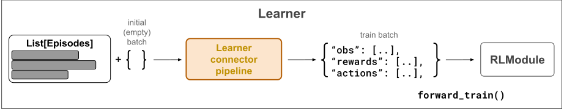

.. include:: /_includes/rllib/we_are_hiring.rst

.. _learner-pipeline-docs:

Learner connector pipelines
===========================

.. include:: /_includes/rllib/new_api_stack.rst

.. grid:: 1 2 3 4
    :gutter: 1
    :class-container: container pb-3

    .. grid-item-card::
        :img-top: /rllib/images/connector_v2/connector_generic.svg
        :class-img-top: pt-2 w-75 d-block mx-auto fixed-height-img

        .. button-ref:: connector-v2-docs

            ConnectorV2 overview

    .. grid-item-card::
        :img-top: /rllib/images/connector_v2/env_to_module_connector.svg
        :class-img-top: pt-2 w-75 d-block mx-auto fixed-height-img

        .. button-ref:: env-to-module-pipeline-docs

            Env-to-module pipelines

    .. grid-item-card::
        :img-top: /rllib/images/connector_v2/module_to_env_connector.svg
        :class-img-top: pt-2 w-75 d-block mx-auto fixed-height-img

        .. button-ref:: module-to-env-connector-docs

            Module-to-env pipelines

    .. grid-item-card::
        :img-top: /rllib/images/connector_v2/learner_connector.svg
        :class-img-top: pt-2 w-75 d-block mx-auto fixed-height-img

        .. button-ref:: learner-pipeline-docs

            Learner connector pipelines (this page)

One learner pipeline resides on each :py:class:`~ray.rllib.core.learner.learner.Learner` worker (see figure below) and is responsible for
compiling the train batch for the :py:class:`~ray.rllib.core.rl_module.rl_module.RLModule` from a list of episodes.

    **Learner ConnectorV2 Pipelines**: A learner connector pipeline sits between the input training data into the
    :py:class:`~ray.rllib.core.learner.learner.Learner` worker and its :py:class:`~ray.rllib.core.rl_module.rl_module.RLModule`.
    It translates the input data, lists of episodes, into a train batch, tensor data, readable by the RLModule's
    :py:meth:`~ray.rllib.core.rl_module.rl_module.RLModule.forward_train` method.

When calling the Learner connector pipeline, a transformation from a list of :ref:`Episode objects <single-agent-episode-docs>` to an
RLModule-readable tensor batch, the train batch, takes place and the output of the pipeline is directly sent into the
:py:meth:`~ray.rllib.core.rl_module.rl_module.RLModule.forward_train` method of the :py:class:`~ray.rllib.core.rl_module.rl_module.RLModule`.

.. _default-learner-pipeline:

Default Learner pipeline behavior
---------------------------------

By default RLlib populates an Learner connector pipeline with the following built-in connector pieces.

* :py:class:`~ray.rllib.connectors.common.add_observations_from_episodes_to_batch.AddObservationsFromEpisodesToBatch`: Places all observations from the incoming episodes into the batch. The column name is ``obs``. For example, if you have 2 incoming episodes of length 10 and 20, your resulting train batch size is 30.
* :py:class:`~ray.rllib.connectors.learner.add_columns_from_episodes_to_batch.AddColumnsFromEpisodesToBatch`: Places all other columns, like rewards, actions, and termination flags, from the incoming episodes into the batch.
* *Relevant for stateful models only:* :py:class:`~ray.rllib.connectors.common.add_time_dim_to_batch_and_zero_pad.AddTimeDimToBatchAndZeroPad`: If the :py:class:`~ray.rllib.core.rl_module.rl_module.RLModule` is stateful, adds a time-dimension of size `max_seq_len` at axis=1 to all data in the batch and (right) zero-pads in cases where episodes end at timesteps non-dividable by `max_seq_len`. You can change `max_seq_len` through your RLModule's `model_config_dict` (call `config.rl_module(model_config_dict={'max_seq_len': ...})` on your :py:class:`~ray.rllib.algorithms.algorithm_config.AlgorithmConfig` object). Also places every `max_seq_len`th state output of your module from the incoming episodes into the train batch as new state inputs.
* *Relevant for stateful models only:* :py:class:`~ray.rllib.connectors.common.add_states_from_episodes_to_batch.AddStatesFromEpisodesToBatch`: If the :py:class:`~ray.rllib.core.rl_module.rl_module.RLModule` is stateful, places the most recent state outputs of the module as new state inputs into the batch. The column name is ``state_in``.
* *For multi-agent only:* :py:class:`~ray.rllib.connectors.common.agent_to_module_mapping.AgentToModuleMapping`: Maps per-agent data to the respective per-module data depending on the already determined agent-to-module mapping stored in each (multi-agent) episode.
* :py:class:`~ray.rllib.connectors.common.batch_individual_items.BatchIndividualItems`: Converts all data in the batch, which thus far are lists of individual items, into batched structures meaning NumPy arrays, whose 0th axis is the batch axis.
* :py:class:`~ray.rllib.connectors.common.numpy_to_tensor.NumpyToTensor`: Converts all NumPy arrays in the batch into framework specific tensors and moves these to the GPU, if required.

You can disable the preceding default connector pieces by setting `config.learners(add_default_connectors_to_learner_pipeline=False)`
in your :ref:`algorithm config <rllib-algo-configuration-docs>`.

Note that the order of these transforms is very relevant for the functionality of the pipeline.
See :ref:`here on how to write and add your own connector pieces <writing_custom_learner_connectors>` to the pipeline.

.. _writing_custom_learner_connectors:

Writing custom Learner connectors
---------------------------------

You can customize the default Learner connector pipeline that RLlib creates through specifying a function in your
:py:class:`~ray.rllib.algorithms.algorithm_config.AlgorithmConfig`, which returns a single :py:class:`~ray.rllib.connectors.connector_v2.ConnectorV2`
piece or a list thereof.
RLlib prepends these :py:class:`~ray.rllib.connectors.connector_v2.ConnectorV2` instances to the
:ref:`default Learner pipeline <default-learner-pipeline>` in the order returned,
unless you set `add_default_connectors_to_learner_pipeline=False` in your config, in which case RLlib exclusively uses the provided
:py:class:`~ray.rllib.connectors.connector_v2.ConnectorV2` pieces without any automatically added default behavior.

For example, to prepend a custom ConnectorV2 piece to the Learner pipeline, you can do this in your config:

.. testcode::
    :skipif: True

    config.learners(
        learner_connector=lambda input_obs_space, input_act_space: MyLearnerConnector(..),
    )

If you want to add multiple custom pieces to the pipeline, return them as a list:

.. testcode::
    :skipif: True

    # Return a list of connector pieces to make RLlib add all of them to your
    # Learner pipeline.
    config.learners(
        learner_connector=lambda input_obs_space, input_act_space: [
            MyLearnerConnector(..),
            MyOtherLearnerConnector(..),
            AndOneMoreConnector(..),
        ],
    )

RLlib adds the connector pieces returned by your function to the beginning of the Learner pipeline,
before the previously described default connector pieces that RLlib provides automatically:

.. figure:: images/connector_v2/custom_pieces_in_learner_pipeline.svg
    :width: 1000
    :align: left

    **Inserting custom ConnectorV2 pieces into the Learner pipeline**: RLlib inserts custom connector pieces, such
    as intrinsic reward computation, before the default pieces. This way, if your custom connectors alter the input episodes
    in any way, for example by changing the rewards as in the below example,
    the tailing default pieces automatically add these changed rewards to the batch, instead of the original ones
    from the environment.

Example: Reward shaping prior to loss computation
~~~~~~~~~~~~~~~~~~~~~~~~~~~~~~~~~~~~~~~~~~~~~~~~~

If you would like to perform any kind of reward shaping on the episode data you receive before computing a loss,
the Learner connector pipeline is the right place to do so. Here you have full access to the entire episode data, including
observations, actions, other agents' data in multi-agent scenarios, and all rewards, of course.

The following are the most important code snippets for setting up a count-based, intrinsic reward signal.
Your connector tracks discrete observations that the agent already visited and computes an intrinsic reward based on the
inverse frequency of the visited observation. Thus, the more often the agent has already seen the observation, the lower the
computed intrinsic reward. The agent is then motivated to visit new states and observations leading to better exploratory behavior.

See `here for the full count-based intrinsic reward example script <https://github.com/ray-project/ray/blob/master/rllib/examples/curiosity/count_based_curiosity.py>`__.

You can write the custom Learner connector by subclassing `ConnectorV2` and overriding the `__call__` method:

.. testcode::

    from collections import Counter
    from ray.rllib.connectors.connector_v2 import ConnectorV2

    class CountBasedIntrinsicRewards(ConnectorV2):

        def __init__(self, **kwargs):
            super().__init__(**kwargs)

            # Observation counter.
            self._counts = Counter()

        def __call__(
            self,
            *,
            rl_module,
            batch,
            episodes,
            explore=None,
            shared_data=None,
            **kwargs,
        ) -> Any:
            # Loop through all episodes and change the reward to: reward + intrinsic_reward
            for sa_episode in self.single_agent_episode_iterator(
                episodes=episodes, agents_that_stepped_only=False
            ):
                # Loop through all observations, except the last one.
                observations = sa_episode.get_observations(slice(None, -1))
                # Get all respective extrinsic rewards.
                rewards = sa_episode.get_rewards()

                for i, (obs, rew) in enumerate(zip(observations, rewards)):
                    # Add 1 to obs counter.
                    obs = tuple(obs)
                    self._counts[obs] += 1
                    # Compute the count-based intrinsic reward and add it to the extrinsic
                    # reward.
                    rew += 1 / self._counts[obs]
                    # Store the new reward back to the episode (under the correct
                    # timestep/index).
                    sa_episode.set_rewards(new_data=rew, at_indices=i)

            return batch

If you plug in this custom :py:class:`~ray.rllib.connectors.connector_v2.ConnectorV2` class into your algorithm config
(`config.learners(learner_connector=lambda env: CountBasedIntrinsicRewards())`),
your loss function should receive the altered reward signals, which are the sums of the
extrinsic reward from the environment and the computed intrinsic reward based on visitation frequencies, in the ``rewards`` column of the batch.

Notice that your custom logic writes the new rewards right back into the given episodes
instead of placing them into the `batch`. This strategy of writing back those data you pulled from episodes right back
into the same episodes makes sure that from this point on, only the changed data is visible to the subsequent connector pieces.
The batch remains unchanged at first. However, knowing that one of the subsequent
:ref:`default Learner connector pieces <default-learner-pipeline>` performs the task of filling the batch with data from the episodes,
you can rely on the information you changed in the episode to end up in the batch in the end.

The succeeding example, however, demonstrates a specific case, observation stacking, where this strategy fails and in
which you should instead manipulate the `batch` directly.

Stacking the N most recent observations
~~~~~~~~~~~~~~~~~~~~~~~~~~~~~~~~~~~~~~~

If you would like to write a custom env-to-module connector that stacks the `N` most recent observations and feeds
this stack of observations into your RLModule (for example in an attention/transformer architecture).

However, in this case, the implementation shouldn't write back the stacked observations into the episode
(as updated observation), because doing so would make the next call to the same ConnectorV2 piece to look back onto
an already stacked previous observation. Instead, you should manipulate the `batch` directly, as in this example:

.. testcode::

    import gymnasium as gym
    import numpy as np
    from ray.rllib.connectors.connector_v2 import ConnectorV2
    from ray.rllib.core.columns import Columns

    class StackTenObservations(ConnectorV2):

        def recompute_output_observation_space(self, in_obs_space, in_act_space):
            # Assume the input observation space is a Box of shape (N,).
            assert (
                isinstance(input_observation_space, gym.spaces.Box)
                and len(input_observation_space.shape) == 1
            )

            # This connector concatenates the last 10 observations at axis=0, so the
            # output space has a shape of (10*N,).
            return gym.spaces.Box(
                low=input_observation_space.low,
                high=input_observation_space.high,
                shape=(input_observation_space.shape[0] * 10,),
                dtype=input_observation_space.dtype,
            )

        def __call__(self, *, rl_module, batch, episodes, **kwargs):

            # Loop through all (single-agent) episodes.
            for single_agent_episode in self.single_agent_episode_iterator(episodes):
                # Get the 10 most recent observations from the episodes.
                last_10_obs = single_agent_episode.get_observations(
                    indices=[-10, -9, -8, -7, -6, -5, -4, -3, -2, -1],
                    fill=0.0,  # Left-zero-fill in case you reach beginning of episode.
                )
                # Concatenate all stacked observations.
                new_obs = np.concatenate(last_10_obs, axis=0)

                # Add the stacked observations to the `batch` using the
                # `ConnectorV2.add_batch_item()` utility.
                self.add_batch_item(
                    batch=batch,
                    column=Columns.OBS,
                    item_to_add=new_obs,
                    single_agent_episode=single_agent_episode,
                )

            # Return batch (with stacked observations).
            return batch

# Note that we do not write the stacked observations back into the episode
# as this would interfere with the next call of this same connector (it
# would try to stack already stacked observations and thus produce a shape error).

Since the returned `batch` in the preceding env-to-module piece is discarded after the model forward pass
and not stored in the episodes, you have to make sure to perform the framestacking again on the Learner
side of things.

.. tip::
    There are already off-the-shelf ConnectorV2 pieces available to you. These perform the task of
    stacking the last `N` observations in both the env-to-module and Learner pipelines:

    .. code-block:: python

        from ray.rllib.connectors.common.frame_stacking import FrameStacking

        # Framestacking on the EnvRunner side.
        config.env_runners(
            env_to_module_connector=lambda env, spaces, device: FrameStacking(num_frames=N),
        )
        # Then again on the Learner side.
        config.training(
            learner_connector=lambda obs_space, act_space: FrameStacking(num_frames=N, as_learner_conector=True),
        )

END (sven)
