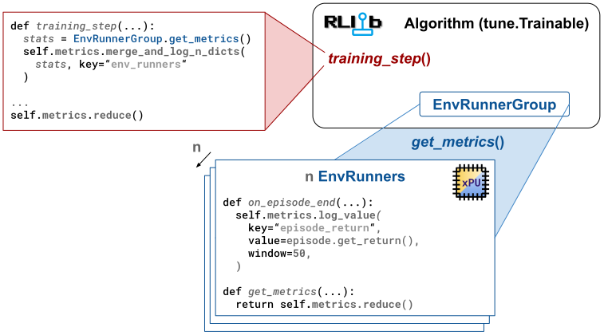

.. include:: /_includes/rllib/we_are_hiring.rst

.. _rllib-metric-logger-docs:

MetricsLogger API
==================

.. include:: /_includes/rllib/new_api_stack.rst

The RLlib team designed the :py:class:`~ray.rllib.utils.metrics.metrics_logger.MetricsLogger` API
to unify and make accessible the logging and processing of stats and metrics during
reinforcement learning (RL) experiments. RLlib's :py:class:`~ray.rllib.algorithms.algorithm.Algorithm`
class and all its sub-components each have one :py:class:`~ray.rllib.utils.metrics.metrics_logger.MetricsLogger`
instance managing metrics and statistics for this component. When a subcomponent reports back to its
parent component, it "reduces" the logged results and sends them upstream.

The RLlib team recommends this API for all your custom code, like in
:py:class:`~ray.rllib.env.env_runner.EnvRunner`-based :ref:`callbacks <rllib-callback-docs>`,
in `custom loss functions <https://github.com/ray-project/ray/blob/master/rllib/examples/learners/classes/custom_ppo_loss_fn_learner.py>`__, or in custom `training_step() <https://github.com/ray-project/ray/blob/master/rllib/examples/metrics/custom_metrics_in_algorithm_training_step.py>`__
implementations.

    **RLlib's MetricsLogger system**: Every subcomponent of an RLlib :py:class:`~ray.rllib.algorithms.algorithm.Algorithm` has-a
    :py:class:`~ray.rllib.utils.metrics.metrics_logger.MetricsLogger` instance
    and uses it to locally log values. When a component completes a distinct task,
    for example, an :py:class:`~ray.rllib.env.env_runner.EnvRunner` finishing a sampling request, the local metrics of the subcomponent
    (``EnvRunner``) are "reduced", and sent upstream to the containing parent component (``Algorithm``).
    The parent component merges the received results into its own :py:class:`~ray.rllib.utils.metrics.metrics_logger.MetricsLogger` and,
    at the end of its own task cycle, "reduces" as well for final reporting to the user or to Ray Tune.

.. note::
    So far, RLlib components owning a :py:class:`~ray.rllib.utils.metrics.metrics_logger.MetricsLogger`
    instance are :py:class:`~ray.rllib.algorithms.algorithm.Algorithm`, :py:class:`~ray.rllib.env.env_runner.EnvRunner`,
    :py:class:`~ray.rllib.core.learner.learner.Learner`, all :py:class:`~ray.rllib.connectors.connector_v2.ConnectorV2` classes,
    and all ``~ray.rllib.utils.replay_buffers.EpisodeReplayBuffer`` classes.
    The Ray team is considering expanding access to this API on other components as well.

Features of MetricsLogger
-------------------------

The :py:class:`~ray.rllib.utils.metrics.metrics_logger.MetricsLogger` API offers the following functionalities:

- Log scalar values over time, such as losses, individual rewards, or episode returns.
- Configure different reduction types, in particular ``mean``, ``min``, ``max``, or ``sum``. Also, users can chose to not
  reduce at all through the ``reduce=None`` setting, leaving the logged values untouched.
  A separate ``clear_on_reduce=True`` setting allows for automatically clearing all logged values on each ``reduce`` event.
- Specify sliding windows, over which reductions take place, for example ``window=100`` to average over the
  last 100 logged values, or specify exponential moving average (EMA) coefficients, through which the weight of older values
  in the computed mean should decay over time.
- Merge ``n`` result dicts from ``n`` parallel subcomponents into the local :py:class:`~ray.rllib.utils.metrics.metrics_logger.MetricsLogger`.
  Each of these ``n`` dicts is the result of a ``reduce`` operation on each subcomponent's own :py:class:`~ray.rllib.utils.metrics.metrics_logger.MetricsLogger`
  instance.
- Log execution times for distinct code blocks through convenient ``with ...`` blocks.
- Add up lifetime counts and automatically compute the corresponding throughput metrics per second along the way.

Built-in usages of MetricsLogger
--------------------------------

RLlib uses the :py:class:`~ray.rllib.utils.metrics.metrics_logger.MetricsLogger` API extensively in the
existing code-base. The following is an overview of a typical information flow resulting from this:

#. The :py:class:`~ray.rllib.algorithms.algorithm.Algorithm` sends parallel sample requests to its ``n`` :py:class:`~ray.rllib.env.env_runner.EnvRunner` actors.
#. Each :py:class:`~ray.rllib.env.env_runner.EnvRunner` collects training data by stepping through its :ref:`RL environment <rllib-key-concepts-environments>` and logs standard stats to its :py:class:`~ray.rllib.utils.metrics.metrics_logger.MetricsLogger`, such as episode return or episode length.
#. Each :py:class:`~ray.rllib.env.env_runner.EnvRunner` calls :py:meth:`~ray.rllib.utils.metrics.metrics_logger.MetricsLogger.reduce` on its own :py:class:`~ray.rllib.utils.metrics.metrics_logger.MetricsLogger` instance and returns the resulting stats dict.
#. The :py:class:`~ray.rllib.algorithms.algorithm.Algorithm` merges the ``n`` received stats dicts into its own :py:class:`~ray.rllib.utils.metrics.metrics_logger.MetricsLogger` instance under the top-level key "env_runners", thereby keeping all log-settings chosen by the :py:class:`~ray.rllib.env.env_runner.EnvRunner` actors.
#. The :py:class:`~ray.rllib.algorithms.algorithm.Algorithm` sends parallel update requests to its ``m`` :py:class:`~ray.rllib.core.learner.learner.Learner` actors.
#. Each :py:class:`~ray.rllib.core.learner.learner.Learner` performs a model update through computing losses and gradients and logs standard stats to its :py:class:`~ray.rllib.utils.metrics.metrics_logger.MetricsLogger`, such as total loss or mean gradients.
#. Each :py:class:`~ray.rllib.core.learner.learner.Learner` calls :py:meth:`~ray.rllib.utils.metrics.metrics_logger.MetricsLogger.reduce` on its own :py:class:`~ray.rllib.utils.metrics.metrics_logger.MetricsLogger` instance and returns the resulting stats dict.
#. The :py:class:`~ray.rllib.algorithms.algorithm.Algorithm` merges the ``m`` received stats dicts into its own :py:class:`~ray.rllib.utils.metrics.metrics_logger.MetricsLogger` instance under the top-level key "learners", thereby keeping all log-settings chosen by the :py:class:`~ray.rllib.core.learner.learner.Learner` actors.
#. The :py:class:`~ray.rllib.algorithms.algorithm.Algorithm` may add standard stats to its own :py:class:`~ray.rllib.utils.metrics.metrics_logger.MetricsLogger` instance, for example the average time of a parallel sample request.
#. The :py:class:`~ray.rllib.algorithms.algorithm.Algorithm` calls :py:meth:`~ray.rllib.utils.metrics.metrics_logger.MetricsLogger.reduce` on its own :py:class:`~ray.rllib.utils.metrics.metrics_logger.MetricsLogger` instance, compiling and returning a complete and final stats dict to the user or Ray Tune.

The MetricsLogger APIs in detail
--------------------------------

Before you can use :py:class:`~ray.rllib.utils.metrics.metrics_logger.MetricsLogger` in your custom code, familiarize
yourself with how to actually use its APIs.

Logging scalar values
~~~~~~~~~~~~~~~~~~~~~

To log a scalar value under some string key in your :py:class:`~ray.rllib.utils.metrics.metrics_logger.MetricsLogger`,
use the :py:meth:`~ray.rllib.utils.metrics.metrics_logger.MetricsLogger.log_value` method:

.. testcode::

    from ray.rllib.utils.metrics.metrics_logger import MetricsLogger

    logger = MetricsLogger()

    # Log a scalar float value under the `loss` key. By default, all logged
    # values under that key are averaged, once `reduce()` is called.
    logger.log_value("loss", 0.01, reduce="mean", window=2)

By default, :py:class:`~ray.rllib.utils.metrics.metrics_logger.MetricsLogger` reduces values through averaging them (``reduce="mean"``).
Other available reduce types are ``reduce="min"``, ``reduce="max"``, and ``reduce="sum"``.

Specifying a ``window`` causes the reduction to take place over the last ``window`` logged values.
For example, you can continue logging new values under the ``loss`` key:

.. testcode::

    logger.log_value("loss", 0.02)  # don't have to repeat `reduce` or `window` args,
                                    # because the key already exists.
    logger.log_value("loss", 0.03)
    logger.log_value("loss", 0.04)
    logger.log_value("loss", 0.05)

Because you specified a window of 2, :py:class:`~ray.rllib.utils.metrics.metrics_logger.MetricsLogger` only uses the last 2 values to compute the reduced result.
You can ``peek()`` at the currently reduced result through the :py:meth:`~ray.rllib.utils.metrics.metrics_logger.MetricsLogger.peek` method:

.. testcode::

    # Peek at the current, reduced value.
    # Note that in the underlying structure, the internal values list still
    # contains all logged values: 0.01, 0.02, 0.03, 0.04, and 0.05.
    print(logger.peek("loss"))  # Expect: 0.045, which is the average over the last 2 values

The :py:meth:`~ray.rllib.utils.metrics.metrics_logger.MetricsLogger.peek` method allows you to
check the current underlying reduced result for some key, without actually having to call
:py:meth:`~ray.rllib.utils.metrics.metrics_logger.MetricsLogger.reduce`.

.. warning::

    **Don't call the reduce() method yourself** on any
    :py:class:`~ray.rllib.utils.metrics.metrics_logger.MetricsLogger` from your custom code.
    The only time RLlib invokes this API is at the end of a task cycle.
    RLlib controls all of these "hand over" points entirely, so unless you write your own subcomponent that reports to a parent component, such as
    :py:class:`~ray.rllib.algorithms.algorithm.Algorithm`, refrain from calling the
    :py:meth:`~ray.rllib.utils.metrics.metrics_logger.MetricsLogger.reduce` method.

    To get the current reduced results, use the :py:meth:`~ray.rllib.utils.metrics.metrics_logger.MetricsLogger.peek` method instead,
    which doesn't alter any underlying values.

Instead of providing a flat key, you can also log a value under some nested key through passing in a tuple:

.. testcode::

    # Log a value under a deeper nested key.
    logger.log_value(("some", "nested", "key"), -1.0)
    print(logger.peek(("some", "nested", "key")))  # expect: -1.0

To use reduce methods, other than "mean", specify the ``reduce`` argument in
:py:meth:`~ray.rllib.utils.metrics.metrics_logger.MetricsLogger.log_value`:

.. testcode::

    # Log a maximum value.
    logger.log_value(key="max_value", value=0.0, reduce="max")

Because you didn't specify a ``window`` and are using ``reduce="max"``, RLlib uses the infinite window,
meaning :py:class:`~ray.rllib.utils.metrics.metrics_logger.MetricsLogger` reports the lifetime maximum value,
whenever reduction takes place or you peek at the current value:

.. testcode::

    for i in range(1000, 0, -1):
        logger.log_value(key="max_value", value=float(i))

    logger.peek("max_value")  # Expect: 1000.0, which is the lifetime max (infinite window)

You can also chose to not reduce at all, but to simply collect individual values, for example a set of images you receive
from your environment over time and for which it doesn't make sense to reduce them in any way.

Use the ``reduce=None`` argument for achieving this. However, it's strongly advised that you should also
set the ``clear_on_reduce=True`` flag, because this setting may cause memory leaks otherwise.
This flag assures that :py:class:`~ray.rllib.utils.metrics.metrics_logger.MetricsLogger` clears out the underlying list of values after every
``reduce()`` handover operation, for example from :py:class:`~ray.rllib.env.env_runner.EnvRunner`
to :py:class:`~ray.rllib.algorithms.algorithm.Algorithm`:

.. testcode::

    logger.log_value("some_items", value="a", reduce=None, clear_on_reduce=True)
    logger.log_value("some_items", value="b")
    logger.log_value("some_items", value="c")
    logger.log_value("some_items", value="d")

    logger.peek("some_items")  # expect a list: ["a", "b", "c", "d"]

    logger.reduce()
    logger.peek("some_items")  # expect an empty list: []

Logging a set of nested scalar values
~~~~~~~~~~~~~~~~~~~~~~~~~~~~~~~~~~~~~

If you're logging a nested structure of values, for example
``{"time_s": 0.1, "lives": 5, "rounds_played": {"player1": 10, "player2": 4}}`` and all values have the exact same log settings
in terms of the ``reduce``, ``clear_on_reduce``, ``window``, etc arguments, you can also call the shortcut
:py:meth:`~ray.rllib.utils.metrics.metrics_logger.MetricsLogger.log_dict` method to do so:

.. testcode::

    from ray.rllib.utils.metrics.metrics_logger import MetricsLogger

    logger = MetricsLogger()

    # Log a bunch of scalar values within a nested dict.
    stats = {"player1": 100.0, "player2": 105.0}
    logger.log_dict(stats, key="mean_scores", reduce="mean", window=10)

    # Later, do the same again.
    stats = {"player1": 150.0, "player2": 110.0}
    logger.log_dict(stats, key="mean_scores")

    print(logger.peek(("mean_scores", "player1")))  # <- expect 125.0

Logging non-scalar data
~~~~~~~~~~~~~~~~~~~~~~~

:py:class:`~ray.rllib.utils.metrics.metrics_logger.MetricsLogger` isn't limited to scalar values.
You can also use it to log images, videos, or any other complex data.

Normally, you would chose the previously described ``reduce=None`` argument. For example, to
log three consecutive image frames from a ``CartPole`` environment, do the following:

.. testcode::

    import gymnasium as gym

    env = gym.make("CartPole-v1")

    # Log three consecutive render frames from the env.
    # Make sure to set ``clear_on_reduce=True`` to avoid memory leaks.
    env.reset()
    logger.log_value("some_images", value=env.render(), reduce=None, clear_on_reduce=True)
    env.step(0)
    logger.log_value("some_images", value=env.render())
    env.step(1)
    logger.log_value("some_images", value=env.render())

Timers
~~~~~~

:py:class:`~ray.rllib.utils.metrics.metrics_logger.MetricsLogger` is context capable and offers the following
simple API to log timer results.
Notice that you can now time all your code blocks of interest inside your custom code through a single ``with-`` line:

.. testcode::

    import time
    from ray.rllib.utils.metrics.metrics_logger import MetricsLogger

    logger = MetricsLogger()

    # First delta measurement:
    with logger.log_time("my_block_to_be_timed", reduce="mean", ema_coeff=0.1):
        time.sleep(1.0)

    # EMA should be ~1sec.
    assert 1.1 > logger.peek("my_block_to_be_timed") > 0.9

    # Second delta measurement:
    with logger.log_time("my_block_to_be_timed"):
        time.sleep(2.0)

    # EMA should be ~1.1sec.
    assert 1.15 > logger.peek("my_block_to_be_timed") > 1.05

.. note::
    The default logging behavior is through exponential mean averaging (EMA), with a default coefficient of 0.01.
    This default is usually a good choice for averaging timer results over the course of the experiment.

    .. TODO: add this paragraph once we properly support lifetime simple average:
      If instead you want to reduce through averaging all logged values over the lifetime,
     use `with logger.log_time([some key], reduce="mean", window=float("inf"))`, instead.

Counters
~~~~~~~~

In case you want to count things, for example the number of environment steps taken in a sample phase, and add up those
counts either over the lifetime or over some particular phase, use the ``reduce="sum"`` argument in the call to
:py:meth:`~ray.rllib.utils.metrics.metrics_logger.MetricsLogger.log_value`.

Combine this with ``clear_on_reduce=True``, if you want the count to only accumulate until the next "reduce" event.
Set ``clear_on_reduce=False``, which is the default, if you want the count to accumulate over the lifetime.

.. testcode::

    from ray.rllib.utils.metrics.metrics_logger import MetricsLogger

    logger = MetricsLogger()

    logger.log_value("my_counter", 50, reduce="sum", window=None)
    logger.log_value("my_counter", 25)
    logger.peek("my_counter")  # expect: 75

    # Even if your logger gets "reduced" from time to time, the counter keeps increasing
    # because we set clear_on_reduce=False (default behavior):
    logger.reduce()
    logger.peek("my_counter")  # still expect: 75

    # To clear the sum after each "reduce" event, set `clear_on_reduce=True`:
    logger.log_value("my_temp_counter", 50, reduce="sum", window=None, clear_on_reduce=True)
    logger.log_value("my_temp_counter", 25)
    logger.peek("my_counter")  # expect: 75
    logger.reduce()
    logger.peek("my_counter")  # expect: 0 (upon reduction, all values are cleared)

Automatic throughput measurements
+++++++++++++++++++++++++++++++++

A metrics logged with the settings ``reduce="sum"`` and ``clear_on_reduce=False`` is considered
a ``lifetime`` counter, accumulating counts over the entire course of the experiment without ever resetting
the value back to 0. If you also add the ``with_throughput=True`` flag, the underlying metric automatically computes the throughput per second
on each ``reduce()`` operation.

The :py:class:`~ray.rllib.algorithms.algorithm.Algorithm` automatically compiles an extra key for each such metric, adding the suffix ``_throughput``
to the original key and assigning it the value for the throughput per second.

You can use the :py:meth:`~ray.rllib.utils.metrics.metrics_logger.MetricsLogger.peek` method with the call argument ``throughput=True``
to access the throughput value. For example:

.. testcode::

    import time
    from ray.rllib.utils.metrics.metrics_logger import MetricsLogger

    logger = MetricsLogger()

    for _ in range(3):
        logger.log_value("lifetime_count", 5, reduce="sum", with_throughput=True)

        # RLlib triggers a new throughput computation at each `reduce()` call
        logger.reduce()
        time.sleep(1.0)

        # Expect the first call to return NaN because we don't have a proper start time for the time delta.
        # From the second call on, expect a value of roughly 5/sec.
        print(logger.peek("lifetime_count", throughput=True))

Example 1: How to use MetricsLogger in EnvRunner callbacks
----------------------------------------------------------

To demonstrate how to use the :py:class:`~ray.rllib.utils.metrics.metrics_logger.MetricsLogger` on an :py:class:`~ray.rllib.env.env_runner.EnvRunner`, take a look at this end-to-end example here, which
makes use of the :py:class:`~ray.rllib.callbacks.callbacks.RLlibCallback` API to inject custom code into the RL environment loop.

The example computes the average "first-joint angle" of the
`Acrobot-v1 RL environment <https://github.com/Farama-Foundation/Gymnasium/blob/main/gymnasium/envs/classic_control/acrobot.py>`__
and logs the results through the :py:class:`~ray.rllib.utils.metrics.metrics_logger.MetricsLogger` API.

Note that this example is :ref:`identical to the one described here <rllib-callback-example-on-episode-step-and-end>`, but the focus has shifted to explain
only the :py:class:`~ray.rllib.utils.metrics.metrics_logger.MetricsLogger` aspects of the code.

.. testcode::

    import math
    import numpy as np
    from ray.rllib.algorithms.ppo import PPOConfig
    from ray.rllib.callbacks.callbacks import RLlibCallback

    # Define a custom RLlibCallback.
    class LogAcrobotAngle(RLlibCallback):
        def on_episode_step(self, *, episode, env, **kwargs):
            # Compute the angle at every episode step and store it temporarily in episode:
            state = env.envs[0].unwrapped.state
            deg_theta1 = math.degrees(math.atan2(state[1], state[0]))
            episode.add_temporary_timestep_data("theta1", deg_theta1)

        def on_episode_end(self, *, episode, metrics_logger, **kwargs):
            theta1s = episode.get_temporary_timestep_data("theta1")
            avg_theta1 = np.mean(theta1s)

            # Log the resulting average angle - per episode - to the MetricsLogger.
            # Report with a sliding window of 50.
            metrics_logger.log_value("theta1_mean", avg_theta1, reduce="mean", window=50)

    config = (
        PPOConfig()
        .environment("Acrobot-v1")
        .callbacks(
            callbacks_class=LogAcrobotAngle,
        )
    )
    ppo = config.build()

    # Train n times. Expect `theta1_mean` to be found in the results under:
    # `env_runners/theta1_mean`
    for i in range(10):
        results = ppo.train()
        print(
            f"iter={i} "
            f"theta1_mean={results['env_runners']['theta1_mean']} "
            f"R={results['env_runners']['episode_return_mean']}"
        )

Also take a look at this more complex example on
`how to generate and log a PacMan heatmap (image) to WandB <https://github.com/ray-project/ray/blob/master/rllib/examples/metrics/custom_metrics_in_env_runners.py>`__ here.

Example 2: How to use MetricsLogger in a custom loss function
-------------------------------------------------------------

You can log metrics inside your custom loss functions. Use the Learner's ``self.metrics`` attribute for this.

.. note::

    When logging loss values, the RLlib team recommends to use ``window=1`` to always report the exact
    current loss value, rather than a smoothened result over time. This way, you notice strange spikes or unstable
    behavior in your loss math right away and can pinpoint problems to a particular iteration.

.. code-block::

    @override(TorchLearner)
    def compute_loss_for_module(self, *, module_id, config, batch, fwd_out):
        ...

        loss_xyz = ...

        # Log a specific loss term.
        self.metrics.log_value("special_loss_term", loss_xyz, window=1)

        total_loss = loss_abc + loss_xyz

        return total_loss

Take a look at this running
`end-to-end example for logging custom values inside a loss function <https://github.com/ray-project/ray/blob/master/rllib/examples/learners/classes/custom_ppo_loss_fn_learner.py>`__ here.

Example 3: How to use MetricsLogger in a custom Algorithm
---------------------------------------------------------

You can log metrics inside your custom Algorithm :py:meth:`~ray.rllib.algorithms.algorithm.Algorithm.training_step` method.
Use the Algorithm's own ``self.metrics`` attribute for this.

.. code-block::

    @override(Algorithm)
    def training_step(self) -> None:
        ...

        # Log some value.
        self.metrics.log_value("some_mean_result", 1.5, window=5)

        ...

        with self.metrics.log_time(("timers", "some_code")):
            ... # time some code

See this running
`end-to-end example for logging inside training_step() <https://github.com/ray-project/ray/blob/master/rllib/examples/metrics/custom_metrics_in_algorithm_training_step.py>`__.
