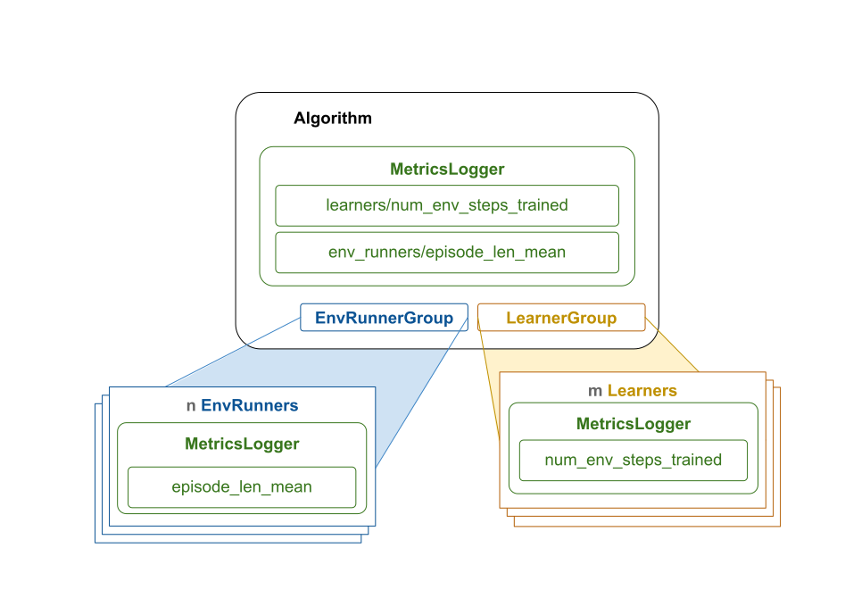

.. include:: /_includes/rllib/we_are_hiring.rst

.. _rllib-metric-logger-docs:

MetricsLogger API
==================

.. include:: /_includes/rllib/new_api_stack.rst

:py:class:`~ray.rllib.utils.metrics.metrics_logger.MetricsLogger` let's RLlib experiments keep track of metrics. 
Most components (example: :py:class:`~ray.rllib.env.env_runner.EnvRunner`, :py:class:`~ray.rllib.core.learner.learner.Learner`) in RLlib keep an instance of MetricsLogger that can be logged to. 
Any logged metrics are aggregated towards to the root MetricsLogger which lives inside the :py:class:`~ray.rllib.algorithms.algorithm.Algorithm` object and is used to report metrics to the user or to Ray Tune.
When a subcomponent reports metrics down the hierarchy, it "reduces" the logged results before sending them. For example, when reducing by summation, subcomponents calculate sums before sending them to the parent component.

We recommend using this API for any metrics that you want RLlib to report, especially if they should be reported to Ray Tune or WandB.
To quickly see how RLlib uses MetricsLogger, check out :py:class:`~ray.rllib.env.env_runner.EnvRunner`-based :ref:`callbacks <rllib-callback-docs>`,
a `custom loss function <https://github.com/ray-project/ray/blob/master/rllib/examples/learners/classes/custom_ppo_loss_fn_learner.py>`__, or a custom 
`training_step <https://github.com/ray-project/ray/blob/master/rllib/examples/metrics/custom_metrics_in_algorithm_training_step.py>`__ implementation.

If your goal is to communicate data between RLlib components (for example, communicate a loss from Learners to EnvRunners), we recommend passing such values around through callbacks or by overriding RLlib components' attributes.
This is mainly because MetricsLogger is designed to aggregate metrics, but not to make them available everywhere and at any time so queryig logged metrics from it can lead to unexpected results.

**RLlib's MetricsLogger aggregation overview**: The diagram illustrates how metrics that are logged in parallel components are aggregated towards the root MetricsLogger. 
Parallel subcomponents of :py:class:`~ray.rllib.algorithms.algorithm.Algorithm` have their own :py:class:`~ray.rllib.utils.metrics.metrics_logger.MetricsLogger` instance and use it to locally log values.
When a component completes a distinct task, for example, an :py:class:`~ray.rllib.env.env_runner.EnvRunner` finishing a sampling request, the local metrics of the subcomponent 
(``EnvRunner`` or ``Learner``) are "reduced", and sent downstream towards the root component (``Algorithm``).
The parent component merges the received results into its own :py:class:`~ray.rllib.utils.metrics.metrics_logger.MetricsLogger`.
Once ``Algorithm`` has completed its own cycle (:py:meth:`~ray.rllib.algorithms.algorithm.Algorithm.step` returns), it "reduces" as well for final reporting to the user or to Ray Tune.

Features of MetricsLogger
-------------------------

The :py:class:`~ray.rllib.utils.metrics.metrics_logger.MetricsLogger` API offers the following functionalities:

- Log scalar values over time, such as losses, individual rewards, or episode returns.
- Configure different reduction types, in particular ``ema``, ``mean``, ``min``, ``max``, or ``sum``. Also, users can choose to not
  reduce at all by using ``item`` or ``item_series``, leaving the logged values untouched.
- Specify sliding windows, over which reductions take place, for example ``window=100`` to average over the
  last 100 logged values per parallel component. Alternatively, specify exponential moving average (EMA) coefficients
- Log execution times for distinct code blocks through convenient ``with MetricsLogger.log_time(...)`` blocks.
- Add up lifetime sums by setting ``reduce="lifetime_sum"`` when logging values.
- For sums and lifetime sums, you can also compute the corresponding throughput metrics per second along the way.

Built-in usages of MetricsLogger
--------------------------------

RLlib uses the :py:class:`~ray.rllib.utils.metrics.metrics_logger.MetricsLogger` API extensively in the
existing code-base. The following is an overview of a typical information flow resulting from this:

#. The :py:class:`~ray.rllib.algorithms.algorithm.Algorithm` sends parallel sample requests to its ``n`` :py:class:`~ray.rllib.env.env_runner.EnvRunner` actors.
#. Each :py:class:`~ray.rllib.env.env_runner.EnvRunner` collects training data by stepping through its :ref:`RL environment <rllib-key-concepts-environments>` and logs standard stats to its :py:class:`~ray.rllib.utils.metrics.metrics_logger.MetricsLogger`, such as episode return or episode length.
#. Each :py:class:`~ray.rllib.env.env_runner.EnvRunner` reduces all collected metrics and returns them to the Algorithm.
#. The :py:class:`~ray.rllib.algorithms.algorithm.Algorithm` aggregates the ``n`` chunks of metrics from the EnvRunners (this depends on the reduce method chosen, an example is averaging if reduce="mean").
#. The :py:class:`~ray.rllib.algorithms.algorithm.Algorithm` sends parallel update requests to its ``m`` :py:class:`~ray.rllib.core.learner.learner.Learner` actors.
#. Each :py:class:`~ray.rllib.core.learner.learner.Learner` performs a model update while logging metrics to its :py:class:`~ray.rllib.utils.metrics.metrics_logger.MetricsLogger`, such as total loss or mean gradients.
#. Each :py:class:`~ray.rllib.core.learner.learner.Learner` reduces all collected metrics and returns them to the Algorithm.
#. The :py:class:`~ray.rllib.algorithms.algorithm.Algorithm` aggregates the ``m`` chunks of metrics from the Learners (this again depends on the reduce method chosen, an example is summing if reduce="sum").
#. The :py:class:`~ray.rllib.algorithms.algorithm.Algorithm` may add standard metrics to its own :py:class:`~ray.rllib.utils.metrics.metrics_logger.MetricsLogger` instance, for example the average time of a parallel sample request.
#. The :py:class:`~ray.rllib.algorithms.algorithm.Algorithm` reduces all collected metrics and returns them to the user or Ray Tune.

.. warning::
    **Don't call the reduce() method yourself**
    Anytime RLlib reduces metrics, it does so by calling :py:meth:`~ray.rllib.utils.metrics.metrics_logger.MetricsLogger.reduce` on the MetricsLogger instance.
    Doing so clears metrics from the MetricsLogger instance. This is why :py:meth:`~ray.rllib.utils.metrics.metrics_logger.MetricsLogger.reduce` should not be called by your custom code.

The MetricsLogger APIs in detail
--------------------------------

**RLlib's MetricsLogger API**: This is how RLlib uses the MetricsLogger API to log and aggregate metrics.
We use the methods :py:meth:`~ray.rllib.utils.metrics.metrics_logger.MetricsLogger.log_time` and :py:meth:`~ray.rllib.utils.metrics.metrics_logger.MetricsLogger.log_value` to log metrics.
Metrics then get reduced with the method :py:meth:`~ray.rllib.utils.metrics.metrics_logger.MetricsLogger.reduce`.
Reduced metrics get aggregated with the method :py:meth:`~ray.rllib.utils.metrics.metrics_logger.MetricsLogger.aggregate`.
All metrics are finally reduced to be reported to the user or Ray Tune by the :py:class:`~ray.rllib.algorithms.algorithm.Algorithm` object.

Logging scalar values
~~~~~~~~~~~~~~~~~~~~~

To log a scalar value under some string key in your :py:class:`~ray.rllib.utils.metrics.metrics_logger.MetricsLogger`,
use the :py:meth:`~ray.rllib.utils.metrics.metrics_logger.MetricsLogger.log_value` method:

.. testcode::

    from ray.rllib.utils.metrics.metrics_logger import MetricsLogger

    logger = MetricsLogger()

    # Log a scalar float value under the `loss` key. By default, all logged
    # values under that key are averaged, once `reduce()` is called.
    logger.log_value("loss", 0.01, reduce="mean", window=2)

By default, :py:class:`~ray.rllib.utils.metrics.metrics_logger.MetricsLogger` reduces values through averaging them (``reduce="mean"``).

Other available reduction methods can be found in the dictionary ``ray.rllib.utils.metrics.metrics_logger.DEFAULT_STATS_CLS_LOOKUP``.

.. note::
    You can also provide your own reduction methods by extending ``ray.rllib.utils.metrics.metrics_logger.DEFAULT_STATS_CLS_LOOKUP`` 
    and passing it to :py:meth:`~ray.rllib.algorithms.algorithm_config.AlgorithmConfig.reporting`.
    These new reduction methods will then be available by their key when logging values during runtime. For example, 
    you can use ``reduce="my_custom_reduce_method"`` when when extending the dictionary with a key ``"my_custom_reduce_method"`` 
    and passing it to :py:meth:`~ray.rllib.algorithms.algorithm_config.AlgorithmConfig.reporting`.

Specifying a ``window`` causes the reduction to take place over the last ``window`` logged values.
For example, you can continue logging new values under the ``loss`` key:

.. testcode::

    logger.log_value("loss", 0.02, reduce="mean", window=2)
    logger.log_value("loss", 0.03, reduce="mean", window=2)
    logger.log_value("loss", 0.04, reduce="mean", window=2)
    logger.log_value("loss", 0.05, reduce="mean", window=2)

Because you specified a window of 2, :py:class:`~ray.rllib.utils.metrics.metrics_logger.MetricsLogger` only uses the last 2 values to compute the reduced result.
You can ``peek()`` at the currently reduced result through the :py:meth:`~ray.rllib.utils.metrics.metrics_logger.MetricsLogger.peek` method:

.. testcode::

    # Peek at the current, reduced value.
    # Note that in the underlying structure, the internal values list still
    # contains all logged values: 0.01, 0.02, 0.03, 0.04, and 0.05.
    print(logger.peek("loss"))  # Expect: 0.045, which is the average over the last 2 values

The :py:meth:`~ray.rllib.utils.metrics.metrics_logger.MetricsLogger.peek` method allows you to
check the current underlying reduced result for some key, without actually having to call
:py:meth:`~ray.rllib.utils.metrics.metrics_logger.MetricsLogger.reduce`.

.. warning::
    A limitation of peeking metrics is that you can often not meaningfully peek metrics if they are aggregated downstream.
    For example, if you log the number of steps you trained on each call to :py:meth:`~ray.rllib.core.learner.learner.Learner.update`, these will be reduced and aggregated
    by the Algorithm's MetricsLogger and peeking them inside :py:class:`~ray.rllib.core.learner.learner.Learner` will not give you the aggregated result.

Instead of providing a flat key, you can also log a value under some nested key through passing in a tuple:

.. testcode::

    # Log a value under a deeper nested key.
    logger.log_value(("some", "nested", "key"), -1.0)
    print(logger.peek(("some", "nested", "key")))  # expect: -1.0

To use reduce methods, other than "mean", specify the ``reduce`` argument in
:py:meth:`~ray.rllib.utils.metrics.metrics_logger.MetricsLogger.log_value`:

.. testcode::

    # Log a maximum value.
    logger.log_value(key="max_value", value=0.0, reduce="max")

The maximum value will be reset after each ``reduce()`` operation.

.. testcode::

    for i in range(1000, 0, -1):
        logger.log_value(key="max_value", value=float(i))

    logger.peek("max_value")  # Expect: 1000.0, which is the lifetime max (infinite window)

You can also choose to not reduce at all, but to simply collect individual values, for example a set of images you receive
from your environment over time and for which it doesn't make sense to reduce them in any way.
Use the ``reduce="item"`` or ``reduce="item_series"`` argument for achieving this.
However, use your best judgement for what you are logging because RLlib will report all logged values unless you clean them up yourself.

.. testcode::

    logger.log_value("some_items", value="a", reduce="item_series")
    logger.log_value("some_items", value="b", reduce="item_series")
    logger.log_value("an_item", value="c", reduce="item")
    logger.log_value("an_item", value="d", reduce="item")

    logger.peek("some_items")  # expect a list: ["a", "b"]
    logger.peek("an_item")  # expect a string: "d"

    logger.reduce()
    logger.peek("some_items")  # expect an empty list: []
    logger.peek("an_item")  # expect None: []

Logging non-scalar data
~~~~~~~~~~~~~~~~~~~~~~~

.. warning::
    You may be tempted to use MetricsLogger as a vehicle to get data from one place in RLlib to another.
    For example to store data between EnvRunner callbacks, or to move videos captured from the environment from EnvRunners to the Algorithm object.
    These cases are to be handled with a lot of caution and we generally advise to find other solutions.
    For example, callbacks can create custom attributes on EnvRunners and you probably don't want your videos to be treated like metrics.
    MetricsLogger is designed and treated by RLlib as a vehicle to collect metrics from parallel components and aggregate them.
    It is supposed to handle metrics and these are supposed to flow in one direction - from the parallel components to the root component.
    If your use-case does not fit this pattern, consider finding another way than using MetricsLogger.

:py:class:`~ray.rllib.utils.metrics.metrics_logger.MetricsLogger` isn't limited to scalar values.
If you decide that you still want to use MetricsLogger to get data from one place in RLlib to another, you use it to log images, videos, or any other complex data.

For example, to log three consecutive image frames from a ``CartPole`` environment, use the ``reduce="item_series"`` argument:

.. testcode::

    import gymnasium as gym

    env = gym.make("CartPole-v1")

    # Log three consecutive render frames from the env.
    env.reset()
    logger.log_value("some_images", value=env.render(), reduce="item_series")
    env.step(0)
    logger.log_value("some_images", value=env.render(), reduce="item_series")
    env.step(1)
    logger.log_value("some_images", value=env.render(), reduce="item_series")

Timers
~~~~~~

You can use :py:class:`~ray.rllib.utils.metrics.metrics_logger.MetricsLogger` as a context manager to log timer results.
You can time all your code blocks inside your custom code through a single ``with MetricsLogger.log_time(...)`` line:

.. testcode::

    import time
    from ray.rllib.utils.metrics.metrics_logger import MetricsLogger

    logger = MetricsLogger()

    # First delta measurement:
    with logger.log_time("my_block_to_be_timed", reduce="ema", ema_coeff=0.1):
        time.sleep(1.0)

    # EMA should be ~1sec.
    assert 1.1 > logger.peek("my_block_to_be_timed") > 0.9

    # Second delta measurement:
    with logger.log_time("my_block_to_be_timed"):
        time.sleep(2.0)

    # EMA should be ~1.1sec.
    assert 1.15 > logger.peek("my_block_to_be_timed") > 1.05

Counters
~~~~~~~~

In case you want to count things, for example the number of environment steps taken in a sample phase, and add up those
counts either over the lifetime or over some particular phase, use the ``reduce="sum"`` or ``reduce="lifetime_sum"`` argument in the call to
:py:meth:`~ray.rllib.utils.metrics.metrics_logger.MetricsLogger.log_value`.

.. testcode::

    from ray.rllib.utils.metrics.metrics_logger import MetricsLogger

    logger = MetricsLogger()

    logger.log_value("my_counter", 50, reduce="sum")
    logger.log_value("my_counter", 25, reduce="sum")
    logger.peek("my_counter")  # expect: 75
    logger.reduce()
    logger.peek("my_counter")  # expect: 0 (upon reduction, all values are cleared)

If you log lifetime metrics with ``reduce="lifetime_sum"``, these will get summed up over the lifetime of the experiment and even after resuming from a checkpoint.
Note that you can not meaningfully peek ``lifetime_sum`` values outside of the root MetricsLogger. Also note that the lifetime sum is summed up at the root MetricsLogger 
whereas we only keep the most recent values in parallel components which are cleared each time we reduce.

Throughput measurements
++++++++++++++++++++++++

A metrics logged with the settings ``reduce="sum"`` or ``reduce="lifetime_sum"`` can also measure throughput.
The throughput is calculated once per metrics reporting cycle.
This means that the throughput is always relative to the speed of the metrics reduction cycle.

You can use the :py:meth:`~ray.rllib.utils.metrics.metrics_logger.MetricsLogger.peek` method to access the throughput value by passing the ``throughput=True`` flag.

.. testcode::

    import time
    from ray.rllib.utils.metrics.metrics_logger import MetricsLogger

    logger = MetricsLogger(root=True)

    for _ in range(3):
        logger.log_value("lifetime_sum", 5, reduce="sum", with_throughput=True)

    
    time.sleep(1.0)
    # Expect the throughput to be roughly 15/sec.
    print(logger.peek("lifetime_sum", throughput=True))

Example 1: How to use MetricsLogger in EnvRunner callbacks
----------------------------------------------------------

To demonstrate how to use the :py:class:`~ray.rllib.utils.metrics.metrics_logger.MetricsLogger` on an :py:class:`~ray.rllib.env.env_runner.EnvRunner`,
take a look at this end-to-end example here, which
makes use of the :py:class:`~ray.rllib.callbacks.callbacks.RLlibCallback` API to inject custom code into the RL environment loop.

The example computes the average "first-joint angle" of the
`Acrobot-v1 RL environment <https://github.com/Farama-Foundation/Gymnasium/blob/main/gymnasium/envs/classic_control/acrobot.py>`__
and logs the results through the :py:class:`~ray.rllib.utils.metrics.metrics_logger.MetricsLogger` API.

Note that this example is :ref:`identical to the one described here <rllib-callback-example-on-episode-step-and-end>`, but the focus has shifted to explain
only the :py:class:`~ray.rllib.utils.metrics.metrics_logger.MetricsLogger` aspects of the code.

.. testcode::

    import math
    import numpy as np
    from ray.rllib.algorithms.ppo import PPOConfig
    from ray.rllib.callbacks.callbacks import RLlibCallback

    # Define a custom RLlibCallback.

    class LogAcrobotAngle(RLlibCallback):

        def on_episode_created(self, *, episode, **kwargs):
            # Initialize an empty list in the `custom_data` property of `episode`.
            episode.custom_data["theta1"] = []

        def on_episode_step(self, *, episode, env, **kwargs):
            # Compute the angle at every episode step and store it temporarily in episode:
            state = env.envs[0].unwrapped.state
            deg_theta1 = math.degrees(math.atan2(state[1], state[0]))
            episode.custom_data["theta1"].append(deg_theta1)

        def on_episode_end(self, *, episode, metrics_logger, **kwargs):
            theta1s = episode.custom_data["theta1"]
            avg_theta1 = np.mean(theta1s)

            # Log the resulting average angle - per episode - to the MetricsLogger.
            # Report with a sliding window of 50.
            metrics_logger.log_value("theta1_mean", avg_theta1, reduce="mean", window=50)

    config = (
        PPOConfig()
        .environment("Acrobot-v1")
        .callbacks(
            callbacks_class=LogAcrobotAngle,
        )
    )
    ppo = config.build()

    # Train n times. Expect `theta1_mean` to be found in the results under:
    # `env_runners/theta1_mean`
    for i in range(10):
        results = ppo.train()
        print(
            f"iter={i} "
            f"theta1_mean={results['env_runners']['theta1_mean']} "
            f"R={results['env_runners']['episode_return_mean']}"
        )

Also take a look at this more complex example on
`how to generate and log a PacMan heatmap (image) to WandB <https://github.com/ray-project/ray/blob/master/rllib/examples/metrics/custom_metrics_in_env_runners.py>`__ here.

Example 2: How to use MetricsLogger in a custom loss function
-------------------------------------------------------------

You can log metrics inside your custom loss functions. Use the Learner's own ``Learner.metrics`` attribute for this.

.. code-block::

    @override(TorchLearner)
    def compute_loss_for_module(self, *, module_id, config, batch, fwd_out):
        ...

        loss_xyz = ...

        # Log a specific loss term.
        # Each learner will sum up the loss_xyz value and send it to the root MetricsLogger.
        self.metrics.log_value("special_loss_term", reduce="sum", value=loss_xyz)

        total_loss = loss_abc + loss_xyz

        return total_loss

Take a look at this running
`end-to-end example for logging custom values inside a loss function <https://github.com/ray-project/ray/blob/master/rllib/examples/learners/classes/custom_ppo_loss_fn_learner.py>`__ here.

Example 3: How to use MetricsLogger in a custom Algorithm
---------------------------------------------------------

You can log metrics inside your custom Algorithm :py:meth:`~ray.rllib.algorithms.algorithm.Algorithm.training_step` method.
Use the Algorithm's own ``Algorithm.metrics`` attribute for this.

.. code-block::

    @override(Algorithm)
    def training_step(self) -> None:
        ...

        # Log some value.
        self.metrics.log_value("some_mean_result", 1.5, reduce="mean", window=5)

        ...

        with self.metrics.log_time(("timers", "some_code")):
            ... # time some code

See this running
`end-to-end example for logging inside training_step() <https://github.com/ray-project/ray/blob/master/rllib/examples/metrics/custom_metrics_in_algorithm_training_step.py>`__.

Migrating to Ray 2.53
---------------------

If you have been using the MetricsLogger API before Ray 2.52, the following needs your attention:

Most importantly:
- **Metrics are now cleared once per MetricsLogger.reduce() call. Peeking them thereafter returns the zero-element for the respective reduce type (np.nan, None or an empty list).**
- Control flow should be based on other variables, rather than peeking metrics.

For MetricsLogger's logging methods (log_value, log_time, etc.):
- The ``clear_on_reduce`` argument is deprecated. (see point above)
- Using ``reduce="sum"`` and ``clear_on_reduce=False`` is now equivalent to ``reduce="lifetime_sum"``.
- The ``throughput_ema_coeff`` is deprecated (we don't use EMA for throughputs anymore).
- The ``reduce_per_index_on_aggregate`` argument is deprecated. All metrics are now aggregated over all values collected from leafs of any reduction cycle.

Other changes:
- Many metrics look more noisy after upgrading to 2.52. This is mostly because they are not smoothed anymore. Smoothing should happen downstream if desired.
- :py:meth:`~ray.rllib.utils.metrics.metrics_logger.MetricsLogger.aggregate` is now the only way to aggregate metrics.
- You can now pass a custom stats class to (AlgorithmConfig.reporting(custom_stats_cls_lookup={...})). This enables you to write your own stats class with its own reduction logic. If your own stats class constitutes a fix or a valuable addition to RLlib, please consider contributing it to the project through a PR.
- When aggregating metrics, we can now peek only the onces that were merged in the most recent reduction cycle with the ``latest_merged_only=True`` argument in :py:meth:`~ray.rllib.utils.metrics.metrics_logger.MetricsLogger.peek`.