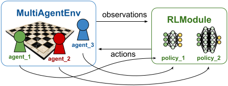

.. include:: /_includes/rllib/we_are_hiring.rst

.. _rllib-multi-agent-environments-doc:

Multi-Agent Environments
========================

.. include:: /_includes/rllib/new_api_stack.rst

In a multi-agent environment, multiple "agents" act simultaneously, in a turn-based
sequence, or through an arbitrary combination of both.

For instance, in a traffic simulation, there might be multiple "car" and
"traffic light" agents interacting simultaneously, whereas in a board game,
two or more agents may act in a turn-based sequence.

Several different policy networks may be used to control the various agents.
Thereby, each of the agents in the environment maps to exactly one particular policy. This mapping is
determined by a user-provided function, called the "mapping function". Note that if there
are ``N`` agents mapping to ``M`` policies, ``N`` is always larger or equal to ``M``,
allowing for any policy to control more than one agent.

    **Multi-agent setup:** ``N`` agents live in the environment and take actions computed by ``M`` policy networks.
    The mapping from agent to policy is flexible and determined by a user-provided mapping function. Here, `agent_1`
    and `agent_3` both map to `policy_1`, whereas `agent_2` maps to `policy_2`.

RLlib's MultiAgentEnv API
-------------------------

.. hint::

    This paragraph describes RLlib's own :py:class:`~ray.rllib.env.multi_agent_env.MultiAgentEnv` API, which is the
    recommended way of defining your own multi-agent environment logic. However, if you are already using a
    third-party multi-agent API, RLlib offers wrappers for :ref:`Farama's PettingZoo API <farama-pettingzoo-api>` as well
    as :ref:`DeepMind's OpenSpiel API <deepmind-openspiel-api>`.

The :py:class:`~ray.rllib.env.multi_agent_env.MultiAgentEnv` API of RLlib closely follows the
conventions and APIs of `Farama's gymnasium (single-agent) <gymnasium.farama.org>`__ envs and even subclasses
from `gymnasium.Env`, however, instead of publishing individual observations, rewards, and termination/truncation flags
from `reset()` and `step()`, a custom :py:class:`~ray.rllib.env.multi_agent_env.MultiAgentEnv` implementation
outputs separate dictionaries for observations, rewards, etc., where each dictionary maps agent IDs to the corresponding values for each agent.

Here is a first draft of an example :py:class:`~ray.rllib.env.multi_agent_env.MultiAgentEnv` implementation:

.. code-block::

    from ray.rllib.env.multi_agent_env import MultiAgentEnv

    class MyMultiAgentEnv(MultiAgentEnv):

        def __init__(self, config=None):
            super().__init__()
            ...

        def reset(self, *, seed=None, options=None):
            ...
            # return observation dict and infos dict.
            return {"agent_1": [obs of agent_1], "agent_2": [obs of agent_2]}, {}

        def step(self, action_dict):
            # return observation dict, rewards dict, termination/truncation dicts, and infos dict
            return {"agent_1": [obs of agent_1]}, {...}, ...

Agent Definitions
~~~~~~~~~~~~~~~~~

The number of agents in your environment and their IDs are entirely controlled by your :py:class:`~ray.rllib.env.multi_agent_env.MultiAgentEnv`
code. Your env decides, which agents start after an episode reset, which agents enter the episode at a later point, which agents
terminate the episode early, and which agents stay in the episode until the entire episode ends.

To define, which agent IDs might even show up in your episodes, set the `self.possible_agents` attribute to a list of
all possible agent ID.

.. code-block::

    def __init__(self, config=None):
        super().__init__()
        ...
        # Define all agent IDs that might even show up in your episodes.
        self.possible_agents = ["agent_1", "agent_2"]
        ...

In case your environment only starts with a subset of agent IDs and/or terminates some agent IDs before the end of the episode,
you also need to permanently adjust the `self.agents` attribute throughout the course of your episode.
If - on the other hand - all agent IDs are static throughout your episodes, you can set `self.agents` to be the same
as `self.possible_agents` and don't change its value throughout the rest of your code:

.. code-block::

    def __init__(self, config=None):
        super().__init__()
        ...
        # If your agents never change throughout the episode, set
        # `self.agents` to the same list as `self.possible_agents`.
        self.agents = self.possible_agents = ["agent_1", "agent_2"]
        # Otherwise, you will have to adjust `self.agents` in `reset()` and `step()` to whatever the
        # currently "alive" agents are.
        ...

Observation- and Action Spaces
~~~~~~~~~~~~~~~~~~~~~~~~~~~~~~

Next, you should set the observation- and action-spaces of each (possible) agent ID in your constructor.
Use the `self.observation_spaces` and `self.action_spaces` attributes to define dictionaries mapping
agent IDs to the individual agents' spaces. For example:

.. code-block::

    import gymnasium as gym
    import numpy as np

    ...

        def __init__(self, config=None):
            super().__init__()
            ...
            self.observation_spaces = {
                "agent_1": gym.spaces.Box(-1.0, 1.0, (4,), np.float32),
                "agent_2": gym.spaces.Box(-1.0, 1.0, (3,), np.float32),
            }
            self.action_spaces = {
                "agent_1": gym.spaces.Discrete(2),
                "agent_2": gym.spaces.Box(0.0, 1.0, (1,), np.float32),
            }
            ...

In case your episodes hosts a lot of agents, some sharing the same observation- or action
spaces, and you don't want to create very large spaces dicts, you can also override the
:py:meth:`~ray.rllib.env.multi_agent_env.MultiAgentEnv.get_observation_space` and
:py:meth:`~ray.rllib.env.multi_agent_env.MultiAgentEnv.get_action_space` methods and implement the mapping logic
from agent ID to space yourself. For example:

.. code-block::

    def get_observation_space(self, agent_id):
        if agent_id.startswith("robot_"):
            return gym.spaces.Box(0, 255, (84, 84, 3), np.uint8)
        elif agent_id.startswith("decision_maker"):
            return gym.spaces.Discrete(2)
        else:
            raise ValueError(f"bad agent id: {agent_id}!")

Observation-, Reward-, and Termination Dictionaries
~~~~~~~~~~~~~~~~~~~~~~~~~~~~~~~~~~~~~~~~~~~~~~~~~~~

The remaining two things you need to implement in your custom :py:class:`~ray.rllib.env.multi_agent_env.MultiAgentEnv`
are the `reset()` and `step()` methods. Equivalently to a single-agent `gymnasium.Env <https://gymnasium.farama.org/_modules/gymnasium/core/#Env>`__,
you have to return observations and infos from `reset()`, and return observations, rewards, termination/truncation flags, and infos
from `step()`, however, instead of individual values, these all have to be dictionaries mapping agent IDs to the respective
individual agents' values.

Let's take a look at an example `reset()` implementation first:

.. code-block::

    def reset(self, *, seed=None, options=None):
        ...
        return {
            "agent_1": np.array([0.0, 1.0, 0.0, 0.0]),
            "agent_2": np.array([0.0, 0.0, 1.0]),
        }, {}  # <- empty info dict

Here, your episode starts with both agents in it, and both expected to compute and send actions
for the following `step()` call.

In general, the returned observations dict must contain those agents (and only those agents)
that should act next. Agent IDs that should NOT act in the next `step()` call must NOT have
their observations in the returned observations dict.

    **Env with simultaneously acting agents:** Both agents receive their observations at each
    time step, including right after `reset()`. Note that an agent must compute and send an action
    into the next `step()` call whenever an observation is present for that agent in the returned
    observations dict.

Note that the rule of observation dicts determining the exact order of agent moves doesn't equally apply to
either reward dicts nor termination/truncation dicts, all of which
may contain any agent ID at any time step regardless of whether that agent ID is expected to act or not
in the next `step()` call. This is so that an action taken by agent A may trigger a reward for agent B, even
though agent B currently isn't acting itself. The same is true for termination flags: Agent A may act in a way
that terminates agent B from the episode without agent B having acted itself.

.. note::
    Use the special agent ID `__all__` in the termination dicts and/or truncation dicts to indicate
    that the episode should end for all agent IDs, regardless of which agents are still active at that point.
    RLlib automatically terminates all agents in this case and ends the episode.

In summary, the exact order and synchronization of agent actions in your multi-agent episode is determined
through the agent IDs contained in (or missing from) your observations dicts.
Only those agent IDs that are expected to compute and send actions into the next `step()` call must be part of the
returned observation dict.

.. figure:: images/envs/multi_agent_episode_turn_based.svg
    :width: 600
    :align: left

    **Env with agents taking turns:** The two agents act by taking alternating turns. `agent_1` receives the
    first observation after the `reset()` and thus has to compute and send an action first. Upon receiving
    this action, the env responds with an observation for `agent_2`, who now has to act. After receiving the action
    for `agent_2`, a next observation for `agent_1` is returned and so on and so forth.

This simple rule allows you to design any type of multi-agent environment, from turn-based games to
environments where all agents always act simultaneously, to any arbitrarily complex combination of these two patterns:

    **Env with a complex order of turns:** Three agents act in a seemingly chaotic order. `agent_1` and `agent_3` receive their
    initial observation after the `reset()` and thus has to compute and send actions first. Upon receiving
    these two actions, the env responds with an observation for `agent_1` and `agent_2`, who now have to act simultaneously.
    After receiving the actions for `agent_1` and `agent_2`, observations for `agent_2` and `agent_3` are returned and so on and
    so forth.

Let's take a look at two specific, complete :py:class:`~ray.rllib.env.multi_agent_env.MultiAgentEnv` example implementations,
one where agents always act simultaneously and one where agents act in a turn-based sequence.

Example: Environment with Simultaneously Stepping Agents
~~~~~~~~~~~~~~~~~~~~~~~~~~~~~~~~~~~~~~~~~~~~~~~~~~~~~~~~

A good and simple example for a multi-agent env, in which all agents always step simultaneously
is the Rock-Paper-Scissors game, in which two agents have to play N moves altogether, each choosing between
the actions "Rock", "Paper", or "Scissors". After each move, the action choices are compared.
Rock beats Scissors, Paper beats Rock, and Scissors beats Paper. The player winning the move receives
a +1 reward, the losing player -1.

Here is the initial class scaffold for your Rock-Paper-Scissors Game:

.. literalinclude:: ../../../rllib/examples/envs/classes/multi_agent/rock_paper_scissors.py
   :language: python
   :start-after: __sphinx_doc_1_begin__
   :end-before: __sphinx_doc_1_end__

.. literalinclude:: ../../../rllib/examples/envs/classes/multi_agent/rock_paper_scissors.py
   :language: python
   :start-after: __sphinx_doc_2_begin__
   :end-before: __sphinx_doc_2_end__

Next, you can implement the constructor of your class:

.. literalinclude:: ../../../rllib/examples/envs/classes/multi_agent/rock_paper_scissors.py
   :language: python
   :start-after: __sphinx_doc_3_begin__
   :end-before: __sphinx_doc_3_end__

Note that we specify `self.agents = self.possible_agents` in the constructor to indicate
that the agents don't change over the course of an episode and stay fixed at `[player1, player2]`.

The `reset` logic is to simply add both players in the returned observations dict (both players are
expected to act simultaneously in the next `step()` call) and reset a `num_moves` counter
that keeps track of the number of moves being played in order to terminate the episode after exactly
10 timesteps (10 actions by either player):

.. literalinclude:: ../../../rllib/examples/envs/classes/multi_agent/rock_paper_scissors.py
   :language: python
   :start-after: __sphinx_doc_4_begin__
   :end-before: __sphinx_doc_4_end__

Finally, your `step` method should handle the next observations (each player observes the action
the opponent just chose), the rewards (+1 or -1 according to the winner/loser rules explained above),
and the termination dict (you set the special `__all__` agent ID to `True` iff the number of moves
has reached 10). The truncateds- and infos dicts always remain empty:

.. literalinclude:: ../../../rllib/examples/envs/classes/multi_agent/rock_paper_scissors.py
   :language: python
   :start-after: __sphinx_doc_5_begin__
   :end-before: __sphinx_doc_5_end__

`See here <https://github.com/ray-project/ray/blob/master/rllib/examples/envs/agents_act_simultaneously.py>`__
for a complete end-to-end example script showing how to run a multi-agent RLlib setup against your
`RockPaperScissors` env.

Example: Turn-Based Environments
~~~~~~~~~~~~~~~~~~~~~~~~~~~~~~~~

Let's now walk through another multi-agent env example implementation, but this time you
implement a turn-based game, in which you have two players (A and B), where A starts the game,
then B makes a move, then again A, and so on and so forth.

We implement the famous Tic-Tac-Toe game (with one slight aberration), played on a 3x3 field.
Each player adds one of their pieces to the field at a time. Pieces can't be moved once placed.
The player that first completes one row (horizontal, diagonal, or vertical) wins the game and
receives +1 reward. The losing player receives a -1 reward.
To make the implementation easier, the aberration from the original game is that trying to
place a piece on an already occupied field results in the board not changing at all, but the
moving player receiving a -5 reward as a penalty (in the original game, this move is
simply not allowed and therefor can never happen).

Here is your initial class scaffold for the Tic-Tac-Toe game:

.. literalinclude:: ../../../rllib/examples/envs/classes/multi_agent/tic_tac_toe.py
   :language: python
   :start-after: __sphinx_doc_1_begin__
   :end-before: __sphinx_doc_1_end__

In your constructor, make sure you define all possible agent IDs that can ever show up
in your game ("player1" and "player2"), the currently active agent IDs (same as all
possible agents), and each agent's observation- and action space.

.. literalinclude:: ../../../rllib/examples/envs/classes/multi_agent/tic_tac_toe.py
   :language: python
   :start-after: __sphinx_doc_2_begin__
   :end-before: __sphinx_doc_2_end__

Now let's implement your `reset()` method, in which you empty the board (set it to all 0s),
pick a random start player, and return this start player's first observation.
Note that you don't return the other player's observation as this player isn't
acting next.

.. literalinclude:: ../../../rllib/examples/envs/classes/multi_agent/tic_tac_toe.py
   :language: python
   :start-after: __sphinx_doc_3_begin__
   :end-before: __sphinx_doc_3_end__

From here on, in each `step()`, you always flip between the two agents (you use the
`self.current_player` attribute for keeping track) and return only the current agent's
observation, because that's the player you want to act next.

You also compute the both agents' rewards based on three criteria:
Did the current player win (the opponent lost)?
Did the current player place a piece on an already occupied field (gets penalized)?
Is the game done because the board is full (both agents receive 0 reward)?

.. literalinclude:: ../../../rllib/examples/envs/classes/multi_agent/tic_tac_toe.py
   :language: python
   :start-after: __sphinx_doc_4_begin__
   :end-before: __sphinx_doc_4_end__

Grouping Agents
~~~~~~~~~~~~~~~

It is common to have groups of agents in multi-agent RL, where each group is treated
like a single agent with Tuple action- and observation spaces (one item in the tuple
for each individual agent in the group).

Such a group of agents can then be assigned to a single policy for centralized execution,
or to specialized multi-agent policies that implement centralized training, but
decentralized execution.

You can use the :py:meth:`~ray.rllib.env.multi_agent_env.MultiAgentEnv.with_agent_groups`
method to define these groups:

.. literalinclude:: ../../../rllib/env/multi_agent_env.py
   :language: python
   :start-after: __grouping_doc_begin__
   :end-before: __grouping_doc_end__

For environments with multiple groups, or mixtures of agent groups and individual agents,
you can use grouping in conjunction with the policy mapping API described in prior sections.

Third Party Multi-Agent Env APIs
--------------------------------

Besides RLlib's own :py:class:`~ray.rllib.env.multi_agent_env.MultiAgentEnv` API, you can also use
various third-party APIs and libraries to implement custom multi-agent envs.

.. _farama-pettingzoo-api:

Farama PettingZoo
~~~~~~~~~~~~~~~~~

`PettingZoo <https://pettingzoo.farama.org>`__ offers a repository of over 50 diverse
multi-agent environments, directly compatible with RLlib through the built-in
:py:class:`~ray.rllib.env.wrappers.pettingzoo_env.PettingZooEnv` wrapper:

.. testcode::

    from pettingzoo.butterfly import pistonball_v6

    from ray.rllib.algorithms.ppo import PPOConfig
    from ray.rllib.env.wrappers.pettingzoo_env import PettingZooEnv
    from ray.tune.registry import register_env

    register_env(
        "pistonball",
        lambda cfg: PettingZooEnv(pistonball_v6.env(num_floors=cfg.get("n_pistons", 20))),
    )

    config = (
        PPOConfig()
        .environment("pistonball", env_config={"n_pistons": 30})
    )

See `this example script here <https://github.com/ray-project/ray/blob/master/rllib/examples/multi_agent/pettingzoo_parameter_sharing.py>`__
for an end-to-env example with the `water world env <https://pettingzoo.farama.org/environments/sisl/waterworld/>`__

Also, `see here for an example on the pistonball env with RLlib <https://github.com/Farama-Foundation/PettingZoo/blob/master/tutorials/Ray/rllib_pistonball.py>`__.

.. _deepmind-openspiel-api:

DeepMind OpenSpiel
~~~~~~~~~~~~~~~~~~

The `OpenSpiel API by DeepMind <https://github.com/google-deepmind/open_spiel>`__ is a comprehensive framework
designed for research and development in multi-agent reinforcement learning, game theory, and decision-making.
The API is directly compatible with RLlib through the built-in
:py:class:`~ray.rllib.env.wrappers.pettingzoo_env.PettingZooEnv` wrapper:

.. testcode::

    import pyspiel  # pip install open_spiel

    from ray.rllib.algorithms.ppo import PPOConfig
    from ray.rllib.env.wrappers.open_spiel import OpenSpielEnv
    from ray.tune.registry import register_env

    register_env(
        "open_spiel_env",
        lambda cfg: OpenSpielEnv(pyspiel.load_game("connect_four")),
    )

    config = PPOConfig().environment("open_spiel_env")

See here for an `end-to-end example with the Connect-4 env <https://github.com/ray-project/ray/blob/master/rllib/examples/multi_agent/self_play_with_open_spiel.py>`__
of OpenSpiel trained by an RLlib algorithm, using a self-play strategy.

Running actual Training Experiments with a MultiAgentEnv
--------------------------------------------------------

If all agents use the same algorithm class to train their policies, configure
multi-agent training as follows:

.. code-block:: python

    from ray.rllib.algorithm.ppo import PPOConfig
    from ray.rllib.core.rl_module.multi_rl_module import MultiRLModuleSpec
    from ray.rllib.core.rl_module.rl_module import RLModuleSpec

    config = (
        PPOConfig()
        .environment(env="my_multiagent_env")
        .multi_agent(
            policy_mapping_fn=lambda agent_id, episode, **kwargs: (
                "traffic_light" if agent_id.startswith("traffic_light_")
                else random.choice(["car1", "car2"])
            ),
            algorithm_config_overrides_per_module={
                "car1": PPOConfig.overrides(gamma=0.85),
                "car2": PPOConfig.overrides(lr=0.00001),
            },
        )
        .rl_module(
            rl_module_spec=MultiRLModuleSpec(rl_module_specs={
                "car1": RLModuleSpec(),
                "car2": RLModuleSpec(),
                "traffic_light": RLModuleSpec(),
            }),
        )
    )

    algo = config.build()
    print(algo.train())

To exclude certain policies from being updated, use the ``config.multi_agent(policies_to_train=[..])`` config setting.
This allows running in multi-agent environments with a mix of non-learning and learning policies:

.. code-block:: python

    def policy_mapping_fn(agent_id, episode, **kwargs):
        agent_idx = int(agent_id[-1])  # 0 (player1) or 1 (player2)
        return "learning_policy" if episode.id_ % 2 == agent_idx else "random_policy"

    config = (
        PPOConfig()
        .environment(env="two_player_game")
        .multi_agent(
            policy_mapping_fn=policy_mapping_fn,
            policies_to_train=["learning_policy"],
        )
        .rl_module(
            rl_module_spec=MultiRLModuleSpec(rl_module_specs={
                "learning_policy": RLModuleSpec(),
                "random_policy": RLModuleSpec(rl_module_class=RandomRLModule),
            }),
        )
    )

    algo = config.build()
    print(algo.train())

RLlib will create and route decisions to each policy based on the provided
``policy_mapping_fn``. Training statistics for each policy are reported
separately in the result-dict returned by ``train()``.

The example scripts `rock_paper_scissors_heuristic_vs_learned.py <https://github.com/ray-project/ray/blob/master/rllib/examples/multi_agent/rock_paper_scissors_heuristic_vs_learned.py>`__
and `rock_paper_scissors_learned_vs_learned.py <https://github.com/ray-project/ray/blob/master/rllib/examples/multi_agent/rock_paper_scissors_learned_vs_learned.py>`__
demonstrate competing policies with heuristic and learned strategies.

Scaling to Many MultiAgentEnvs per EnvRunner
~~~~~~~~~~~~~~~~~~~~~~~~~~~~~~~~~~~~~~~~~~~~

.. note::

    Unlike for single-agent environments, multi-agent setups are not vectorizable yet.
    The Ray team is working on a solution for this restriction by utilizing
    `gymnasium >= 1.x` custom vectorization feature.

Variable-Sharing Between Policies
~~~~~~~~~~~~~~~~~~~~~~~~~~~~~~~~~

RLlib supports variable-sharing across policies.

See the `PettingZoo parameter sharing example <https://github.com/ray-project/ray/blob/master/rllib/examples/multi_agent/pettingzoo_parameter_sharing.py>`__ for details.
