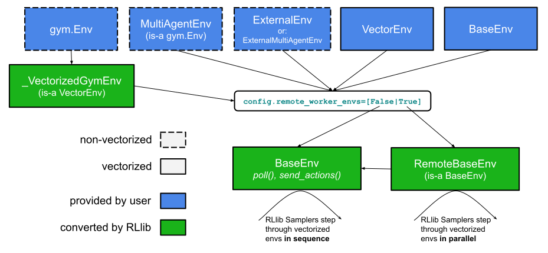

.. _env-reference-docs:

Environments
============

Any environment type provided by you to RLlib (e.g. a user-defined `gym.Env <https://github.com/openai/gym>`_ class),
is converted internally into the :py:class:`~ray.rllib.env.base_env.BaseEnv` API, whose main methods are ``poll()`` and ``send_actions()``:

.. https://docs.google.com/drawings/d/1NtbVk-Mo89liTRx-sHu_7fqi3Kn7Hjdf3i6jIMbxGlY/edit

The :py:class:`~ray.rllib.env.base_env.BaseEnv` API allows RLlib to support:

1) Vectorization of sub-environments (i.e. individual `gym.Env <https://github.com/openai/gym>`_ instances, stacked to form a vector of envs) in order to batch the action computing model forward passes.
2) External simulators requiring async execution (e.g. envs that run on separate machines and independently request actions from a policy server).
3) Stepping through the individual sub-environments in parallel via pre-converting them into separate `@ray.remote` actors.
4) Multi-agent RL via dicts mapping agent IDs to observations/rewards/etc..

For example, if you provide a custom `gym.Env <https://github.com/openai/gym>`_ class to RLlib, auto-conversion to :py:class:`~ray.rllib.env.base_env.BaseEnv` goes as follows:

- User provides a `gym.Env <https://github.com/openai/gym>`_ -> :py:class:`~ray.rllib.env.vector_env._VectorizedGymEnv` (is-a :py:class:`~ray.rllib.env.vector_env.VectorEnv`) -> :py:class:`~ray.rllib.env.base_env.BaseEnv`

Here is a simple example:

.. literalinclude:: ../../../../rllib/examples/documentation/custom_gym_env.py
   :language: python

..   start-after: __sphinx_doc_model_construct_1_begin__
..   end-before: __sphinx_doc_model_construct_1_end__

However, you may also conveniently sub-class any of the other supported RLlib-specific
environment types. The automated paths from those env types (or callables returning instances of those types) to
an RLlib :py:class:`~ray.rllib.env.base_env.BaseEnv` is as follows:

- User provides a custom :py:class:`~ray.rllib.env.multi_agent_env.MultiAgentEnv` (is-a `gym.Env <https://github.com/openai/gym>`_) -> :py:class:`~ray.rllib.env.vector_env.VectorEnv` -> :py:class:`~ray.rllib.env.base_env.BaseEnv`
- User uses a policy client (via an external simulator) -> :py:class:`~ray.rllib.env.external_env.ExternalEnv` | :py:class:`~ray.rllib.env.external_multi_agent_env.ExternalMultiAgentEnv` -> :py:class:`~ray.rllib.env.base_env.BaseEnv`
- User provides a custom :py:class:`~ray.rllib.env.vector_env.VectorEnv` -> :py:class:`~ray.rllib.env.base_env.BaseEnv`
- User provides a custom :py:class:`~ray.rllib.env.base_env.BaseEnv` -> do nothing

Environment API Reference
-------------------------

.. toctree::
   :maxdepth: 1

   env/base_env.rst
   env/multi_agent_env.rst
   env/vector_env.rst
   env/external_env.rst

