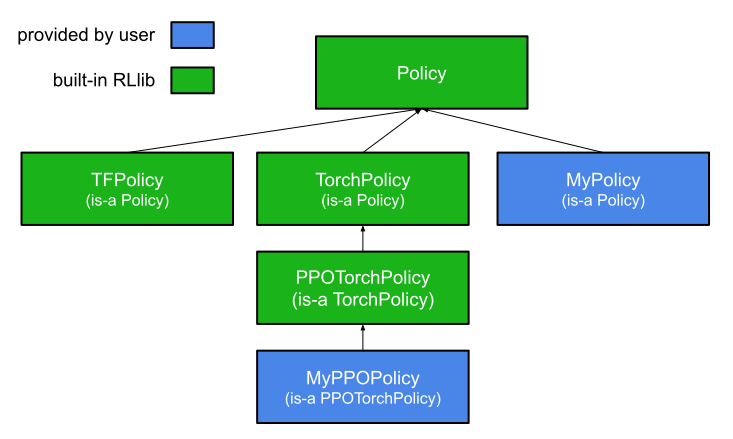

.. include:: /_includes/rllib/we_are_hiring.rst

.. include:: /_includes/rllib/new_api_stack.rst

.. _policy-reference-docs:

Policy API
==========

The :py:class:`~ray.rllib.policy.policy.Policy` class contains functionality to compute
actions for decision making in an environment, as well as computing loss(es) and gradients,
updating a neural network model as well as postprocessing a collected environment trajectory.
One or more :py:class:`~ray.rllib.policy.policy.Policy` objects sit inside a
:py:class:`~ray.rllib.evaluation.rollout_worker.RolloutWorker`'s :py:class:`~ray.rllib.policy.policy_map.PolicyMap` and
are - if more than one - are selected based on a multi-agent ``policy_mapping_fn``,
which maps agent IDs to a policy ID.

.. https://docs.google.com/drawings/d/1eFAVV1aU47xliR5XtGqzQcdvuYs2zlVj1Gb8Gg0gvnc/edit

    **RLlib's Policy class hierarchy:** Policies are deep-learning framework
    specific as they hold functionality to handle a computation graph (e.g. a
    TensorFlow 1.x graph in a session). You can define custom policy behavior
    by sub-classing either of the available, built-in classes, depending on your
    needs.

.. include:: policy/custom_policies.rst

.. currentmodule:: ray.rllib

Base Policy classes
-------------------

.. autosummary::
   :nosignatures:
   :toctree: doc/

    ~policy.policy.Policy

    ~policy.eager_tf_policy_v2.EagerTFPolicyV2

    ~policy.torch_policy_v2.TorchPolicyV2

.. --------------------------------------------

Making models
--------------------

Base Policy
~~~~~~~~~~~~~~~~~~~~
.. autosummary::
    :nosignatures:
    :toctree: doc/

    ~policy.Policy.make_rl_module

Torch Policy
~~~~~~~~~~~~~~~~~~~~
.. autosummary::
    :nosignatures:
    :toctree: doc/

    ~policy.torch_policy_v2.TorchPolicyV2.make_model
    ~policy.torch_policy_v2.TorchPolicyV2.make_model_and_action_dist

Tensorflow Policy
~~~~~~~~~~~~~~~~~~~~
.. autosummary::
    :nosignatures:
    :toctree: doc/

    ~policy.eager_tf_policy_v2.EagerTFPolicyV2.make_model

.. --------------------------------------------

Inference
--------------------

Base Policy
~~~~~~~~~~~~~~~~~~~~
.. autosummary::
    :nosignatures:
    :toctree: doc/

    ~policy.policy.Policy.compute_actions
    ~policy.policy.Policy.compute_actions_from_input_dict
    ~policy.policy.Policy.compute_single_action

Torch Policy
~~~~~~~~~~~~~~~~~~~~
.. autosummary::
    :nosignatures:
    :toctree: doc/

    ~policy.torch_policy_v2.TorchPolicyV2.action_sampler_fn
    ~policy.torch_policy_v2.TorchPolicyV2.action_distribution_fn
    ~policy.torch_policy_v2.TorchPolicyV2.extra_action_out

Tensorflow Policy
~~~~~~~~~~~~~~~~~~~~
.. autosummary::
    :nosignatures:
    :toctree: doc/

    ~policy.eager_tf_policy_v2.EagerTFPolicyV2.action_sampler_fn
    ~policy.eager_tf_policy_v2.EagerTFPolicyV2.action_distribution_fn
    ~policy.eager_tf_policy_v2.EagerTFPolicyV2.extra_action_out_fn

.. --------------------------------------------

Computing, processing, and applying gradients
---------------------------------------------

Base Policy
~~~~~~~~~~~~~~~~~~~~
.. autosummary::
    :nosignatures:
    :toctree: doc/

    ~policy.Policy.compute_gradients
    ~policy.Policy.apply_gradients

Torch Policy
~~~~~~~~~~~~~~~~~~~~
.. autosummary::
    :nosignatures:
    :toctree: doc/

    ~policy.torch_policy_v2.TorchPolicyV2.extra_compute_grad_fetches
    ~policy.torch_policy_v2.TorchPolicyV2.extra_grad_process

Tensorflow Policy
~~~~~~~~~~~~~~~~~~~~
.. autosummary::
    :nosignatures:
    :toctree: doc/

    ~policy.eager_tf_policy_v2.EagerTFPolicyV2.grad_stats_fn
    ~policy.eager_tf_policy_v2.EagerTFPolicyV2.compute_gradients_fn
    ~policy.eager_tf_policy_v2.EagerTFPolicyV2.apply_gradients_fn
    ~policy.eager_tf_policy_v2.EagerTFPolicyV2.extra_learn_fetches_fn

.. --------------------------------------------

Updating the Policy's model
----------------------------

Base Policy
~~~~~~~~~~~~~~~~~~~~
.. autosummary::
    :nosignatures:
    :toctree: doc/

    ~policy.Policy.learn_on_batch
    ~policy.Policy.load_batch_into_buffer
    ~policy.Policy.learn_on_loaded_batch
    ~policy.Policy.learn_on_batch_from_replay_buffer
    ~policy.Policy.get_num_samples_loaded_into_buffer

.. --------------------------------------------

Loss, Logging, optimizers, and trajectory processing
----------------------------------------------------

Base Policy
~~~~~~~~~~~~~~~~~~~~
.. autosummary::
    :nosignatures:
    :toctree: doc/

    ~policy.Policy.loss
    ~policy.Policy.compute_log_likelihoods
    ~policy.Policy.on_global_var_update
    ~policy.Policy.postprocess_trajectory

Torch Policy
~~~~~~~~~~~~~~~~~~~~
.. autosummary::
    :nosignatures:
    :toctree: doc/

    ~policy.torch_policy_v2.TorchPolicyV2.optimizer
    ~policy.torch_policy_v2.TorchPolicyV2.get_tower_stats

Tensorflow Policy
~~~~~~~~~~~~~~~~~~~~
.. autosummary::
    :nosignatures:
    :toctree: doc/

    ~policy.eager_tf_policy_v2.EagerTFPolicyV2.optimizer
    ~policy.eager_tf_policy_v2.EagerTFPolicyV2.stats_fn

.. --------------------------------------------

Saving and restoring
--------------------

Base Policy
~~~~~~~~~~~~~~~~~~~~
.. autosummary::
    :nosignatures:
    :toctree: doc/

    ~policy.Policy.from_checkpoint
    ~policy.Policy.export_checkpoint
    ~policy.Policy.export_model
    ~policy.Policy.from_state
    ~policy.Policy.get_weights
    ~policy.Policy.set_weights
    ~policy.Policy.get_state
    ~policy.Policy.set_state
    ~policy.Policy.import_model_from_h5

.. --------------------------------------------

Recurrent Policies
--------------------

Base Policy
~~~~~~~~~~~~~~~~~~~~
.. autosummary::
    :nosignatures:
    :toctree: doc/

    Policy.get_initial_state
    Policy.num_state_tensors
    Policy.is_recurrent

.. --------------------------------------------

Miscellaneous
--------------------

Base Policy
~~~~~~~~~~~~~~~~~~~~
.. autosummary::
    :nosignatures:
    :toctree: doc/

    ~policy.Policy.apply
    ~policy.Policy.get_session
    ~policy.Policy.init_view_requirements
    ~policy.Policy.get_host
    ~policy.Policy.get_exploration_state

Torch Policy
~~~~~~~~~~~~~~~~~~~~
.. autosummary::
    :nosignatures:
    :toctree: doc/

    ~policy.torch_policy_v2.TorchPolicyV2.get_batch_divisibility_req

Tensorflow Policy
~~~~~~~~~~~~~~~~~~~~~~~~~~~~~
.. autosummary::
    :nosignatures:
    :toctree: doc/

    ~policy.eager_tf_policy_v2.EagerTFPolicyV2.variables
    ~policy.eager_tf_policy_v2.EagerTFPolicyV2.get_batch_divisibility_req
