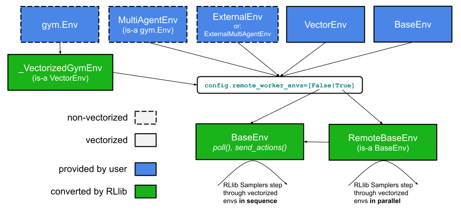

.. _policy-docs:

Policy APIs
===========

.. toctree::
   :maxdepth: 1

   policy/policy.rst
   policy/tf_policies.rst
   policy/torch_policy.rst

Any environment type provided by you to RLlib (e.g. a user-defined ``gym.Env`` class),
is converted internally into the ``BaseEnv`` API, whose main methods are ``poll()`` and ``send_actions()``:

.. https://docs.google.com/drawings/d/1NtbVk-Mo89liTRx-sHu_7fqi3Kn7Hjdf3i6jIMbxGlY/edit

Building Custom Policy Classes
++++++++++++++++++++++++++++++

.. automodule:: ray.rllib.policy.policy_template
    :members:

.. automodule:: ray.rllib.policy.tf_policy_template
    :members:
