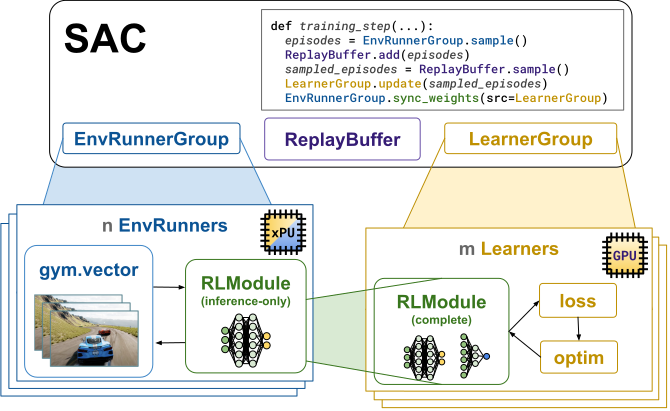
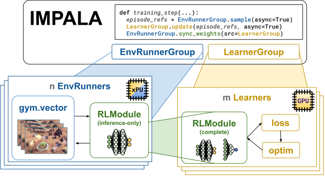
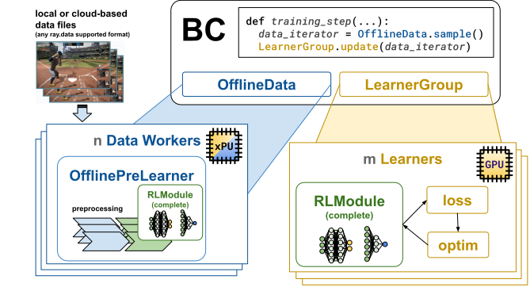

.. include:: /_includes/rllib/we_are_hiring.rst

.. _rllib-algorithms-doc:

Algorithms
==========

.. include:: /_includes/rllib/new_api_stack.rst

The following table is an overview of all available algorithms in RLlib. Note that all algorithms support
multi-GPU training on a single (GPU) node in `Ray (open-source) <https://docs.ray.io/en/latest/index.html>`__ (|multi_gpu|)
as well as multi-GPU training on multi-node (GPU) clusters when using the `Anyscale platform <https://www.anyscale.com/platform>`__
(|multi_node_multi_gpu|).

+-----------------------------------------------------------------------------+------------------------------+------------------------------------+--------------------------------+
| **Algorithm**                                                               | **Single- and Multi-agent**  | **Multi-GPU (multi-node)**         | **Action Spaces**              |
+-----------------------------------------------------------------------------+------------------------------+------------------------------------+--------------------------------+
| **On-Policy**                                                                                                                                                                    |
+-----------------------------------------------------------------------------+------------------------------+------------------------------------+--------------------------------+
| :ref:`PPO (Proximal Policy Optimization) <ppo>`                             | |single_agent| |multi_agent| | |multi_gpu| |multi_node_multi_gpu| | |cont_actions| |discr_actions| |
+-----------------------------------------------------------------------------+------------------------------+------------------------------------+--------------------------------+
| **Off-Policy**                                                                                                                                                                   |
+-----------------------------------------------------------------------------+------------------------------+------------------------------------+--------------------------------+
| :ref:`DQN/Rainbow (Deep Q Networks) <dqn>`                                  | |single_agent| |multi_agent| | |multi_gpu| |multi_node_multi_gpu| |                |discr_actions| |
+-----------------------------------------------------------------------------+------------------------------+------------------------------------+--------------------------------+
| :ref:`SAC (Soft Actor Critic) <sac>`                                        | |single_agent| |multi_agent| | |multi_gpu| |multi_node_multi_gpu| | |cont_actions|                 |
+-----------------------------------------------------------------------------+------------------------------+------------------------------------+--------------------------------+
| **High-throughput on- and off policy**                                                                                                                                           |
+-----------------------------------------------------------------------------+------------------------------+------------------------------------+--------------------------------+
| :ref:`APPO (Asynchronous Proximal Policy Optimization) <appo>`              | |single_agent| |multi_agent| | |multi_gpu| |multi_node_multi_gpu| | |cont_actions| |discr_actions| |
+-----------------------------------------------------------------------------+------------------------------+------------------------------------+--------------------------------+
| :ref:`IMPALA (Importance Weighted Actor-Learner Architecture) <impala>`     | |single_agent| |multi_agent| | |multi_gpu| |multi_node_multi_gpu| |                |discr_actions| |
+-----------------------------------------------------------------------------+------------------------------+------------------------------------+--------------------------------+
| **Model-based RL**                                                                                                                                                               |
+-----------------------------------------------------------------------------+------------------------------+------------------------------------+--------------------------------+
| :ref:`DreamerV3 <dreamerv3>`                                                | |single_agent|               | |multi_gpu| |multi_node_multi_gpu| | |cont_actions| |discr_actions| |
+-----------------------------------------------------------------------------+------------------------------+------------------------------------+--------------------------------+
| **Offline RL and Imitation Learning**                                                                                                                                            |
+-----------------------------------------------------------------------------+------------------------------+------------------------------------+--------------------------------+
| :ref:`BC (Behavior Cloning) <bc>`                                           | |single_agent|               | |multi_gpu| |multi_node_multi_gpu| | |cont_actions| |discr_actions| |
+-----------------------------------------------------------------------------+------------------------------+------------------------------------+--------------------------------+
| :ref:`MARWIL (Monotonic Advantage Re-Weighted Imitation Learning) <marwil>` | |single_agent|               | |multi_gpu| |multi_node_multi_gpu| | |cont_actions| |discr_actions| |
+-----------------------------------------------------------------------------+------------------------------+------------------------------------+--------------------------------+
| **Algorithm Extensions and -Plugins**                                                                                                                                            |
+-----------------------------------------------------------------------------+------------------------------+------------------------------------+--------------------------------+
| :ref:`Curiosity-driven Exploration by Self-supervised Prediction <icm>`     | |single_agent|               | |multi_gpu| |multi_node_multi_gpu| | |cont_actions| |discr_actions| |
+-----------------------------------------------------------------------------+------------------------------+------------------------------------+--------------------------------+

On-policy
~~~~~~~~~

.. _ppo:

Proximal Policy Optimization (PPO)
----------------------------------
`[paper] <https://arxiv.org/abs/1707.06347>`__
`[implementation] <https://github.com/ray-project/ray/blob/master/rllib/algorithms/ppo/ppo.py>`__

.. figure:: images/algos/ppo-architecture.svg
    :width: 750
    :align: left

    **PPO architecture:** In a training iteration, PPO performs three major steps:
    1. Sampling a set of episodes or episode fragments
    1. Converting these into a train batch and updating the model using a clipped objective and multiple SGD passes over this batch
    1. Syncing the weights from the Learners back to the EnvRunners
    PPO scales out on both axes, supporting multiple EnvRunners for sample collection and multiple GPU- or CPU-based Learners
    for updating the model.

**Tuned examples:**
`Pong-v5 <https://github.com/ray-project/ray/blob/master/rllib/tuned_examples/ppo/atari_ppo.py>`__,
`CartPole-v1 <https://github.com/ray-project/ray/blob/master/rllib/tuned_examples/ppo/cartpole_ppo.py>`__.
`Pendulum-v1 <https://github.com/ray-project/ray/blob/master/rllib/tuned_examples/ppo/pendulum_ppo.py>`__.

**PPO-specific configs** (see also :ref:`generic algorithm settings <rllib-algo-configuration-generic-settings>`):

.. autoclass:: ray.rllib.algorithms.ppo.ppo.PPOConfig
   :members: training

Off-Policy
~~~~~~~~~~

.. _dqn:

Deep Q Networks (DQN, Rainbow, Parametric DQN)
----------------------------------------------
`[paper] <https://arxiv.org/abs/1312.5602>`__
`[implementation] <https://github.com/ray-project/ray/blob/master/rllib/algorithms/dqn/dqn.py>`__

    **DQN architecture:** DQN uses a replay buffer to temporarily store episode samples that RLlib collects from the environment.
    Throughout different training iterations, these episodes and episode fragments are re-sampled from the buffer and re-used
    for updating the model, before eventually being discarded when the buffer has reached capacity and new samples keep coming in (FIFO).
    This reuse of training data makes DQN very sample-efficient and off-policy.
    DQN scales out on both axes, supporting multiple EnvRunners for sample collection and multiple GPU- or CPU-based Learners
    for updating the model.

All of the DQN improvements evaluated in `Rainbow <https://arxiv.org/abs/1710.02298>`__ are available, though not all are enabled by default.
See also how to use `parametric-actions in DQN <rllib-models.html#variable-length-parametric-action-spaces>`__.

**Tuned examples:**
`PongDeterministic-v4 <https://github.com/ray-project/ray/blob/master/rllib/tuned_examples/dqn/pong-dqn.yaml>`__,
`Rainbow configuration <https://github.com/ray-project/ray/blob/master/rllib/tuned_examples/dqn/pong-rainbow.yaml>`__,
`{BeamRider,Breakout,Qbert,SpaceInvaders}NoFrameskip-v4 <https://github.com/ray-project/ray/blob/master/rllib/tuned_examples/dqn/atari-dqn.yaml>`__,
`with Dueling and Double-Q <https://github.com/ray-project/ray/blob/master/rllib/tuned_examples/dqn/atari-duel-ddqn.yaml>`__,
`with Distributional DQN <https://github.com/ray-project/ray/blob/master/rllib/tuned_examples/dqn/atari-dist-dqn.yaml>`__.

.. hint::
    For a complete `rainbow <https://arxiv.org/pdf/1710.02298.pdf>`__ setup,
    make the following changes to the default DQN config:
    ``"n_step": [between 1 and 10],
    "noisy": True,
    "num_atoms": [more than 1],
    "v_min": -10.0,
    "v_max": 10.0``
    (set ``v_min`` and ``v_max`` according to your expected range of returns).

**DQN-specific configs** (see also :ref:`generic algorithm settings <rllib-algo-configuration-generic-settings>`):

.. autoclass:: ray.rllib.algorithms.dqn.dqn.DQNConfig
   :members: training

.. _sac:

Soft Actor Critic (SAC)
------------------------
`[original paper] <https://arxiv.org/pdf/1801.01290>`__,
`[follow up paper] <https://arxiv.org/pdf/1812.05905.pdf>`__,
`[implementation] <https://github.com/ray-project/ray/blob/master/rllib/algorithms/sac/sac.py>`__.

    **SAC architecture:** SAC uses a replay buffer to temporarily store episode samples that RLlib collects from the environment.
    Throughout different training iterations, these episodes and episode fragments are re-sampled from the buffer and re-used
    for updating the model, before eventually being discarded when the buffer has reached capacity and new samples keep coming in (FIFO).
    This reuse of training data makes DQN very sample-efficient and off-policy.
    SAC scales out on both axes, supporting multiple EnvRunners for sample collection and multiple GPU- or CPU-based Learners
    for updating the model.

**Tuned examples:**
`Pendulum-v1 <https://github.com/ray-project/ray/blob/master/rllib/tuned_examples/sac/pendulum-sac.yaml>`__,
`HalfCheetah-v3 <https://github.com/ray-project/ray/blob/master/rllib/tuned_examples/sac/halfcheetah_sac.py>`__,

**SAC-specific configs** (see also :ref:`generic algorithm settings <rllib-algo-configuration-generic-settings>`):

.. autoclass:: ray.rllib.algorithms.sac.sac.SACConfig
   :members: training

High-Throughput On- and Off-Policy
~~~~~~~~~~~~~~~~~~~~~~~~~~~~~~~~~~

.. _appo:

Asynchronous Proximal Policy Optimization (APPO)
------------------------------------------------

.. tip::

    APPO was originally `published under the name "IMPACT" <https://arxiv.org/abs/1707.06347>`__. RLlib's APPO exactly matches the algorithm described in the paper.

`[paper] <https://arxiv.org/abs/1707.06347>`__
`[implementation] <https://github.com/ray-project/ray/blob/master/rllib/algorithms/appo/appo.py>`__

    **APPO architecture:** APPO is an asynchronous variant of :ref:`Proximal Policy Optimization (PPO) <ppo>` based on the IMPALA architecture,
    but using a surrogate policy loss with clipping, allowing for multiple SGD passes per collected train batch.
    In a training iteration, APPO requests samples from all EnvRunners asynchronously and the collected episode
    samples are returned to the main algorithm process as Ray references rather than actual objects available on the local process.
    APPO then passes these episode references to the Learners for asynchronous updates of the model.
    RLlib doesn't always synch back the weights to the EnvRunners right after a new model version is available.
    To account for the EnvRunners being off-policy, APPO uses a procedure called v-trace,
    `described in the IMPALA paper <https://arxiv.org/abs/1802.01561>`__.
    APPO scales out on both axes, supporting multiple EnvRunners for sample collection and multiple GPU- or CPU-based Learners
    for updating the model.

**Tuned examples:**
`Pong-v5 <https://github.com/ray-project/ray/blob/master/rllib/tuned_examples/appo/pong_appo.py>`__
`HalfCheetah-v4 <https://github.com/ray-project/ray/blob/master/rllib/tuned_examples/appo/halfcheetah_appo.py>`__

**APPO-specific configs** (see also :ref:`generic algorithm settings <rllib-algo-configuration-generic-settings>`):

.. autoclass:: ray.rllib.algorithms.appo.appo.APPOConfig
   :members: training

.. _impala:

Importance Weighted Actor-Learner Architecture (IMPALA)
-------------------------------------------------------
`[paper] <https://arxiv.org/abs/1802.01561>`__
`[implementation] <https://github.com/ray-project/ray/blob/master/rllib/algorithms/impala/impala.py>`__

    **IMPALA architecture:** In a training iteration, IMPALA requests samples from all EnvRunners asynchronously and the collected episodes
    are returned to the main algorithm process as Ray references rather than actual objects available on the local process.
    IMPALA then passes these episode references to the Learners for asynchronous updates of the model.
    RLlib doesn't always synch back the weights to the EnvRunners right after a new model version is available.
    To account for the EnvRunners being off-policy, IMPALA uses a procedure called v-trace,
    `described in the paper <https://arxiv.org/abs/1802.01561>`__.
    IMPALA scales out on both axes, supporting multiple EnvRunners for sample collection and multiple GPU- or CPU-based Learners
    for updating the model.

Tuned examples:
`PongNoFrameskip-v4 <https://github.com/ray-project/ray/blob/master/rllib/tuned_examples/impala/pong-impala.yaml>`__,
`vectorized configuration <https://github.com/ray-project/ray/blob/master/rllib/tuned_examples/impala/pong-impala-vectorized.yaml>`__,
`multi-gpu configuration <https://github.com/ray-project/ray/blob/master/rllib/tuned_examples/impala/pong-impala-fast.yaml>`__,
`{BeamRider,Breakout,Qbert,SpaceInvaders}NoFrameskip-v4 <https://github.com/ray-project/ray/blob/master/rllib/tuned_examples/impala/atari-impala.yaml>`__.

.. figure:: images/impala.png
    :width: 650

    Multi-GPU IMPALA scales up to solve PongNoFrameskip-v4 in ~3 minutes using a pair of V100 GPUs and 128 CPU workers.
    The maximum training throughput reached is ~30k transitions per second (~120k environment frames per second).

**IMPALA-specific configs** (see also :ref:`generic algorithm settings <rllib-algo-configuration-generic-settings>`):

.. autoclass:: ray.rllib.algorithms.impala.impala.IMPALAConfig
   :members: training

Model-based RL
~~~~~~~~~~~~~~

.. _dreamerv3:

DreamerV3
---------
`[paper] <https://arxiv.org/pdf/2301.04104v1.pdf>`__
`[implementation] <https://github.com/ray-project/ray/blob/master/rllib/algorithms/dreamerv3/dreamerv3.py>`__

    **DreamerV3 architecture:** DreamerV3 trains a recurrent WORLD_MODEL in supervised fashion
    using real environment interactions sampled from a replay buffer. The world model's objective
    is to correctly predict the transition dynamics of the RL environment: next observation, reward,
    and a boolean continuation flag.
    DreamerV3 trains the actor- and critic-networks on synthesized trajectories only,
    which are "dreamed" by the world model.
    DreamerV3 scales out on both axes, supporting multiple EnvRunners for sample collection and
    multiple GPU- or CPU-based Learners for updating the model.
    It can also be used in different environment types, including those with image- or vector based
    observations, continuous- or discrete actions, as well as sparse or dense reward functions.

**Tuned examples:**
`Atari 100k <https://github.com/ray-project/ray/blob/master/rllib/tuned_examples/dreamerv3/atari_100k.py>`__,
`Atari 200M <https://github.com/ray-project/ray/blob/master/rllib/tuned_examples/dreamerv3/atari_200M.py>`__,
`DeepMind Control Suite <https://github.com/ray-project/ray/blob/master/rllib/tuned_examples/dreamerv3/dm_control_suite_vision.py>`__

**Pong-v5 results (1, 2, and 4 GPUs)**:

.. figure:: images/dreamerv3/pong_1_2_and_4gpus.svg

    Episode mean rewards for the Pong-v5 environment (with the "100k" setting, in which only 100k environment steps are allowed):
    Note that despite the stable sample efficiency - shown by the constant learning
    performance per env step - the wall time improves almost linearly as we go from 1 to 4 GPUs.
    **Left**: Episode reward over environment timesteps sampled. **Right**: Episode reward over wall-time.

**Atari 100k results (1 vs 4 GPUs)**:

.. figure:: images/dreamerv3/atari100k_1_vs_4gpus.svg

    Episode mean rewards for various Atari 100k tasks on 1 vs 4 GPUs.
    **Left**: Episode reward over environment timesteps sampled.
    **Right**: Episode reward over wall-time.

**DeepMind Control Suite (vision) results (1 vs 4 GPUs)**:

.. figure:: images/dreamerv3/dmc_1_vs_4gpus.svg

    Episode mean rewards for various Atari 100k tasks on 1 vs 4 GPUs.
    **Left**: Episode reward over environment timesteps sampled.
    **Right**: Episode reward over wall-time.

Offline RL and Imitation Learning
~~~~~~~~~~~~~~~~~~~~~~~~~~~~~~~~~

.. _bc:

Behavior Cloning (BC)
---------------------
`[paper] <http://papers.nips.cc/paper/7866-exponentially-weighted-imitation-learning-for-batched-historical-data>`__
`[implementation] <https://github.com/ray-project/ray/blob/master/rllib/algorithms/bc/bc.py>`__

    **BC architecture:** RLlib's behavioral cloning (BC) uses Ray Data to tap into its parallel data
    processing capabilities. In one training iteration, BC reads episodes in parallel from
    offline files, for example `parquet <https://parquet.apache.org/>`__, by the n DataWorkers.
    Connector pipelines then preprocess these episodes into train batches and send these as
    data iterators directly to the n Learners for updating the model.
    RLlib's  (BC) implementation is directly derived from its `MARWIL`_ implementation,
    with the only difference being the ``beta`` parameter (set to 0.0). This makes
    BC try to match the behavior policy, which generated the offline data, disregarding any resulting rewards.

**Tuned examples:**
`CartPole-v1 <https://github.com/ray-project/ray/blob/master/rllib/tuned_examples/bc/cartpole_bc.py>`__
`Pendulum-v1 <https://github.com/ray-project/ray/blob/master/rllib/tuned_examples/bc/pendulum_bc.py>`__

**BC-specific configs** (see also :ref:`generic algorithm settings <rllib-algo-configuration-generic-settings>`):

.. autoclass:: ray.rllib.algorithms.bc.bc.BCConfig
   :members: training

.. _cql:

Conservative Q-Learning (CQL)
-----------------------------
`[paper] <https://arxiv.org/abs/2006.04779>`__
`[implementation] <https://github.com/ray-project/ray/blob/master/rllib/algorithms/cql/cql.py>`__

.. figure:: images/algos/cql-architecture.svg
    :width: 750
    :align: left

    **CQL architecture:** CQL (Conservative Q-Learning) is an offline RL algorithm that mitigates the overestimation of Q-values
    outside the dataset distribution through a conservative critic estimate. It adds a simple Q regularizer loss to the standard
    Bellman update loss, ensuring that the critic doesn't output overly optimistic Q-values.
    The `SACLearner` adds this conservative correction term to the TD-based Q-learning loss.

**Tuned examples:**
`Pendulum-v1 <https://github.com/ray-project/ray/blob/master/rllib/tuned_examples/cql/pendulum_cql.py>`__

**CQL-specific configs** and :ref:`generic algorithm settings <rllib-algo-configuration-generic-settings>`):

.. autoclass:: ray.rllib.algorithms.cql.cql.CQLConfig
   :members: training

.. _marwil:

Monotonic Advantage Re-Weighted Imitation Learning (MARWIL)
-----------------------------------------------------------
`[paper] <http://papers.nips.cc/paper/7866-exponentially-weighted-imitation-learning-for-batched-historical-data>`__
`[implementation] <https://github.com/ray-project/ray/blob/master/rllib/algorithms/marwil/marwil.py>`__

    **MARWIL architecture:** MARWIL is a hybrid imitation learning and policy gradient algorithm suitable for training on
    batched historical data. When the ``beta`` hyperparameter is set to zero, the MARWIL objective reduces to plain
    imitation learning (see `BC`_). MARWIL uses Ray.Data to tap into its parallel data
    processing capabilities. In one training iteration, MARWIL reads episodes in parallel from offline files,
    for example `parquet <https://parquet.apache.org/>`__, by the n DataWorkers. Connector pipelines preprocess these
    episodes into train batches and send these as data iterators directly to the n Learners for updating the model.

**Tuned examples:**
`CartPole-v1 <https://github.com/ray-project/ray/blob/master/rllib/tuned_examples/marwil/cartpole_marwil.py>`__

**MARWIL-specific configs** (see also :ref:`generic algorithm settings <rllib-algo-configuration-generic-settings>`):

.. autoclass:: ray.rllib.algorithms.marwil.marwil.MARWILConfig
   :members: training

Algorithm Extensions- and Plugins
~~~~~~~~~~~~~~~~~~~~~~~~~~~~~~~~~

.. _icm:

Curiosity-driven Exploration by Self-supervised Prediction
----------------------------------------------------------
`[paper] <https://arxiv.org/pdf/1705.05363.pdf>`__
`[implementation] <https://github.com/ray-project/ray/blob/master/rllib/examples/curiosity/intrinsic_curiosity_model_based_curiosity.py>`__

.. figure:: images/algos/curiosity-architecture.svg
    :width: 850
    :align: left

    **Intrinsic Curiosity Model (ICM) architecture:** The main idea behind ICM is to train a world-model
    (in parallel to the "main" policy) to predict the environment's dynamics. The loss of
    the world model is the intrinsic reward that the `ICMLearner` adds to the env's
    (extrinsic) reward. This makes sure
    that when in regions of the environment that are relatively unknown (world model performs
    badly in predicting what happens next), the artificial intrinsic reward is large and the
    agent is motivated to go and explore these unknown regions.
    RLlib's curiosity implementation works with any of RLlib's algorithms. See these links here for example implementations on top of
    `PPO and DQN <https://github.com/ray-project/ray/blob/master/rllib/examples/curiosity/intrinsic_curiosity_model_based_curiosity.py>`__.
    ICM uses the chosen Algorithm's `training_step()` as-is, but then executes the following additional steps during
    `LearnerGroup.update`: Duplicate the train batch of the "main" policy and use it for
    performing a self-supervised update of the ICM. Use the ICM to compute the intrinsic rewards
    and add these to the extrinsic (env) rewards. Then continue updating the "main" policy.

**Tuned examples:**
`12x12 FrozenLake-v1 <https://github.com/ray-project/ray/blob/master/rllib/examples/curiosity/intrinsic_curiosity_model_based_curiosity.py>`__

