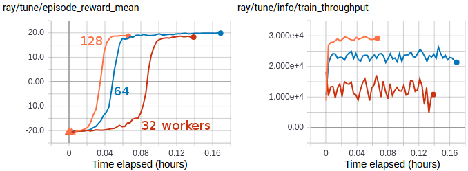

.. include:: /_includes/rllib/announcement.rst

.. include:: /_includes/rllib/we_are_hiring.rst

Algorithms
==========

.. tip::

    Check out the `environments <rllib-env.html>`__ page to learn more about different environment types.

Available Algorithms - Overview
~~~~~~~~~~~~~~~~~~~~~~~~~~~~~~~

============================== ========== ============================= ================== =========== ============================================================= ===============
Algorithm                      Frameworks Discrete Actions              Continuous Actions Multi-Agent Model Support                                                 Multi-GPU
============================== ========== ============================= ================== =========== ============================================================= ===============
`A2C, A3C`_                    tf + torch **Yes** `+parametric`_        **Yes**            **Yes**     `+RNN`_, `+LSTM auto-wrapping`_, `+Attention`_, `+autoreg`_   A2C: tf + torch
`ARS`_                         tf + torch **Yes**                       **Yes**            No                                                                        No
`Bandits`_ (`TS`_ & `LinUCB`_) torch      **Yes** `+parametric`_        No                 **Yes**                                                                   No
`BC`_                          tf + torch **Yes** `+parametric`_        **Yes**            **Yes**     `+RNN`_                                                       torch
`CQL`_                         tf + torch No                            **Yes**            No                                                                        tf + torch
`ES`_                          tf + torch **Yes**                       **Yes**            No                                                                        No
`DDPG`_, `TD3`_                tf + torch No                            **Yes**            **Yes**                                                                   torch
`APEX-DDPG`_                   tf + torch No                            **Yes**            **Yes**                                                                   torch
`Dreamer`_                     torch      No                            **Yes**            No          `+RNN`_                                                       torch
`DQN`_, `Rainbow`_             tf + torch **Yes** `+parametric`_        No                 **Yes**                                                                   tf + torch
`APEX-DQN`_                    tf + torch **Yes** `+parametric`_        No                 **Yes**                                                                   torch
`IMPALA`_                      tf + torch **Yes** `+parametric`_        **Yes**            **Yes**     `+RNN`_, `+LSTM auto-wrapping`_, `+Attention`_, `+autoreg`_   tf + torch
`MAML`_                        tf + torch No                            **Yes**            No                                                                        torch
`MARWIL`_                      tf + torch **Yes** `+parametric`_        **Yes**            **Yes**     `+RNN`_                                                       torch
`MBMPO`_                       torch      No                            **Yes**            No                                                                        torch
`PG`_                          tf + torch **Yes** `+parametric`_        **Yes**            **Yes**     `+RNN`_, `+LSTM auto-wrapping`_, `+Attention`_, `+autoreg`_   tf + torch
`PPO`_, `APPO`_                tf + torch **Yes** `+parametric`_        **Yes**            **Yes**     `+RNN`_, `+LSTM auto-wrapping`_, `+Attention`_, `+autoreg`_   tf + torch
`R2D2`_                        tf + torch **Yes** `+parametric`_        No                 **Yes**     `+RNN`_, `+LSTM auto-wrapping`_, `+autoreg`_                  torch
`SAC`_                         tf + torch **Yes**                       **Yes**            **Yes**                                                                   torch
`SlateQ`_                      tf + torch **Yes** (multi-discr. slates) No                 No                                                                        torch
`AlphaZero`_                   torch      **Yes** `+parametric`_        No                 No                                                                        No
============================== ========== ============================= ================== =========== ============================================================= ===============

Multi-Agent only Methods

================================ ========== ======================= ================== =========== =====================
Algorithm                        Frameworks Discrete Actions        Continuous Actions Multi-Agent Model Support
================================ ========== ======================= ================== =========== =====================
`QMIX`_                          torch      **Yes** `+parametric`_  No                 **Yes**     `+RNN`_
`MADDPG`_                        tf         **Yes**                 Partial            **Yes**
`Parameter Sharing`_             Depends on bootstrapped algorithm
-------------------------------- ---------------------------------------------------------------------------------------
`Fully Independent Learning`_    Depends on bootstrapped algorithm
-------------------------------- ---------------------------------------------------------------------------------------
`Shared Critic Methods`_         Depends on bootstrapped algorithm
================================ =======================================================================================

Exploration-based plug-ins (can be combined with any algo)

================================ ========== ======================= ================== =========== =====================
Algorithm                        Frameworks Discrete Actions        Continuous Actions Multi-Agent Model Support
================================ ========== ======================= ================== =========== =====================
`Curiosity`_                     tf + torch **Yes** `+parametric`_  No                 **Yes**     `+RNN`_
================================ ========== ======================= ================== =========== =====================

.. _`A2C, A3C`: rllib-algorithms.html#a3c
.. _`APEX-DQN`: rllib-algorithms.html#apex
.. _`APEX-DDPG`: rllib-algorithms.html#apex
.. _`+autoreg`: rllib-models.html#autoregressive-action-distributions
.. _`+LSTM auto-wrapping`: rllib-models.html#built-in-models
.. _`+parametric`: rllib-models.html#variable-length-parametric-action-spaces
.. _`Rainbow`: rllib-algorithms.html#dqn
.. _`+RNN`: rllib-models.html#rnns
.. _`TD3`: rllib-algorithms.html#ddpg
.. _`+Attention`: rllib-models.html#attention
.. _`TS`: rllib-algorithms.html#lints
.. _`LinUCB`: rllib-algorithms.html#lin-ucb

High-throughput architectures
~~~~~~~~~~~~~~~~~~~~~~~~~~~~~

.. _apex:

Distributed Prioritized Experience Replay (Ape-X)
-------------------------------------------------
|pytorch| |tensorflow|
`[paper] <https://arxiv.org/abs/1803.00933>`__
`[implementation] <https://github.com/ray-project/ray/blob/master/rllib/agents/dqn/apex.py>`__
Ape-X variations of DQN and DDPG (`APEX_DQN <https://github.com/ray-project/ray/blob/master/rllib/agents/dqn/apex.py>`__, `APEX_DDPG <https://github.com/ray-project/ray/blob/master/rllib/algorithms/ddpg/apex.py>`__) use a single GPU learner and many CPU workers for experience collection. Experience collection can scale to hundreds of CPU workers due to the distributed prioritization of experience prior to storage in replay buffers.

    Ape-X architecture

Tuned examples: `PongNoFrameskip-v4 <https://github.com/ray-project/ray/blob/master/rllib/tuned_examples/dqn/pong-apex.yaml>`__, `Pendulum-v1 <https://github.com/ray-project/ray/blob/master/rllib/tuned_examples/ddpg/pendulum-apex-ddpg.yaml>`__, `MountainCarContinuous-v0 <https://github.com/ray-project/ray/blob/master/rllib/tuned_examples/ddpg/mountaincarcontinuous-apex-ddpg.yaml>`__, `{BeamRider,Breakout,Qbert,SpaceInvaders}NoFrameskip-v4 <https://github.com/ray-project/ray/blob/master/rllib/tuned_examples/dqn/atari-apex.yaml>`__.

**Atari results @10M steps**: `more details <https://github.com/ray-project/rl-experiments>`__

=============  ================================  ========================================
 Atari env     RLlib Ape-X 8-workers             Mnih et al Async DQN 16-workers
=============  ================================  ========================================
BeamRider      6134                              ~6000
Breakout       123                               ~50
Qbert          15302                             ~1200
SpaceInvaders  686                               ~600
=============  ================================  ========================================

**Scalability**:

=============  ================================  ========================================
 Atari env     RLlib Ape-X 8-workers @1 hour     Mnih et al Async DQN 16-workers @1 hour
=============  ================================  ========================================
BeamRider      4873                              ~1000
Breakout       77                                ~10
Qbert          4083                              ~500
SpaceInvaders  646                               ~300
=============  ================================  ========================================

.. figure:: images/apex.png

    Ape-X using 32 workers in RLlib vs vanilla DQN (orange) and A3C (blue) on PongNoFrameskip-v4.

**Ape-X specific configs** (see also `common configs <rllib-training.html#common-parameters>`__):

.. literalinclude:: ../../../rllib/agents/dqn/apex.py
   :language: python
   :start-after: __sphinx_doc_begin__
   :end-before: __sphinx_doc_end__

.. _impala:

Importance Weighted Actor-Learner Architecture (IMPALA)
-------------------------------------------------------
|pytorch| |tensorflow|
`[paper] <https://arxiv.org/abs/1802.01561>`__
`[implementation] <https://github.com/ray-project/ray/blob/master/rllib/agents/impala/impala.py>`__
In IMPALA, a central learner runs SGD in a tight loop while asynchronously pulling sample batches from many actor processes. RLlib's IMPALA implementation uses DeepMind's reference `V-trace code <https://github.com/deepmind/scalable_agent/blob/master/vtrace.py>`__. Note that we do not provide a deep residual network out of the box, but one can be plugged in as a `custom model <rllib-models.html#custom-models-tensorflow>`__. Multiple learner GPUs and experience replay are also supported.

.. figure:: images/impala-arch.svg

    IMPALA architecture

Tuned examples: `PongNoFrameskip-v4 <https://github.com/ray-project/ray/blob/master/rllib/tuned_examples/impala/pong-impala.yaml>`__, `vectorized configuration <https://github.com/ray-project/ray/blob/master/rllib/tuned_examples/impala/pong-impala-vectorized.yaml>`__, `multi-gpu configuration <https://github.com/ray-project/ray/blob/master/rllib/tuned_examples/impala/pong-impala-fast.yaml>`__, `{BeamRider,Breakout,Qbert,SpaceInvaders}NoFrameskip-v4 <https://github.com/ray-project/ray/blob/master/rllib/tuned_examples/impala/atari-impala.yaml>`__

**Atari results @10M steps**: `more details <https://github.com/ray-project/rl-experiments>`__

=============  ==================================  ====================================
 Atari env     RLlib IMPALA 32-workers             Mnih et al A3C 16-workers
=============  ==================================  ====================================
BeamRider      2071                                ~3000
Breakout       385                                 ~150
Qbert          4068                                ~1000
SpaceInvaders  719                                 ~600
=============  ==================================  ====================================

**Scalability:**

=============  ===============================  =================================
 Atari env     RLlib IMPALA 32-workers @1 hour  Mnih et al A3C 16-workers @1 hour
=============  ===============================  =================================
BeamRider      3181                             ~1000
Breakout       538                              ~10
Qbert          10850                            ~500
SpaceInvaders  843                              ~300
=============  ===============================  =================================

   Multi-GPU IMPALA scales up to solve PongNoFrameskip-v4 in ~3 minutes using a pair of V100 GPUs and 128 CPU workers.
   The maximum training throughput reached is ~30k transitions per second (~120k environment frames per second).

**IMPALA-specific configs** (see also `common configs <rllib-training.html#common-parameters>`__):

.. literalinclude:: ../../../rllib/agents/impala/impala.py
   :language: python
   :start-after: __sphinx_doc_begin__
   :end-before: __sphinx_doc_end__

.. _appo:

Asynchronous Proximal Policy Optimization (APPO)
------------------------------------------------
|pytorch| |tensorflow|
`[paper] <https://arxiv.org/abs/1707.06347>`__
`[implementation] <https://github.com/ray-project/ray/blob/master/rllib/agents/ppo/appo.py>`__
We include an asynchronous variant of Proximal Policy Optimization (PPO) based on the IMPALA architecture. This is similar to IMPALA but using a surrogate policy loss with clipping. Compared to synchronous PPO, APPO is more efficient in wall-clock time due to its use of asynchronous sampling. Using a clipped loss also allows for multiple SGD passes, and therefore the potential for better sample efficiency compared to IMPALA. V-trace can also be enabled to correct for off-policy samples.

.. tip::

    APPO is not always more efficient; it is often better to use :ref:`standard PPO <ppo>` or :ref:`IMPALA <impala>`.

.. figure:: images/impala-arch.svg

    APPO architecture (same as IMPALA)

Tuned examples: `PongNoFrameskip-v4 <https://github.com/ray-project/ray/blob/master/rllib/tuned_examples/ppo/pong-appo.yaml>`__

**APPO-specific configs** (see also `common configs <rllib-training.html#common-parameters>`__):

.. literalinclude:: ../../../rllib/agents/ppo/appo.py
   :language: python
   :start-after: __sphinx_doc_begin__
   :end-before: __sphinx_doc_end__

.. _ddppo:

Decentralized Distributed Proximal Policy Optimization (DD-PPO)
---------------------------------------------------------------
|pytorch|
`[paper] <https://arxiv.org/abs/1911.00357>`__
`[implementation] <https://github.com/ray-project/ray/blob/master/rllib/agents/ppo/ddppo.py>`__
Unlike APPO or PPO, with DD-PPO policy improvement is no longer done centralized in the trainer process. Instead, gradients are computed remotely on each rollout worker and all-reduced at each mini-batch using `torch distributed <https://pytorch.org/docs/stable/distributed.html>`__. This allows each worker's GPU to be used both for sampling and for training.

.. tip::

    DD-PPO is best for envs that require GPUs to function, or if you need to scale out SGD to multiple nodes. If you don't meet these requirements, `standard PPO <#proximal-policy-optimization-ppo>`__ will be more efficient.

.. figure:: images/ddppo-arch.svg

    DD-PPO architecture (both sampling and learning are done on worker GPUs)

Tuned examples: `CartPole-v0 <https://github.com/ray-project/ray/blob/master/rllib/tuned_examples/ppo/cartpole-ddppo.yaml>`__, `BreakoutNoFrameskip-v4 <https://github.com/ray-project/ray/blob/master/rllib/tuned_examples/ppo/atari-ddppo.yaml>`__

**DDPPO-specific configs** (see also `common configs <rllib-training.html#common-parameters>`__):

.. literalinclude:: ../../../rllib/agents/ppo/ddppo.py
   :language: python
   :start-after: __sphinx_doc_begin__
   :end-before: __sphinx_doc_end__

Gradient-based
~~~~~~~~~~~~~~

.. _a3c:

Advantage Actor-Critic (A2C, A3C)
---------------------------------
|pytorch| |tensorflow|
`[paper] <https://arxiv.org/abs/1602.01783>`__ `[implementation] <https://github.com/ray-project/ray/blob/master/rllib/agents/a3c/a3c.py>`__
RLlib implements both A2C and A3C. These algorithms scale to 16-32+ worker processes depending on the environment.

A2C also supports microbatching (i.e., gradient accumulation), which can be enabled by setting the ``microbatch_size`` config. Microbatching allows for training with a ``train_batch_size`` much larger than GPU memory.

.. figure:: images/a2c-arch.svg

    A2C architecture

Tuned examples: `PongDeterministic-v4 <https://github.com/ray-project/ray/blob/master/rllib/tuned_examples/a3c/pong-a3c.yaml>`__, `{BeamRider,Breakout,Qbert,SpaceInvaders}NoFrameskip-v4 <https://github.com/ray-project/ray/blob/master/rllib/tuned_examples/a3c/atari-a2c.yaml>`__

.. tip::
    Consider using `IMPALA <#importance-weighted-actor-learner-architecture-impala>`__ for faster training with similar timestep efficiency.

**Atari results @10M steps**: `more details <https://github.com/ray-project/rl-experiments>`__

=============  ========================  ==============================
 Atari env     RLlib A2C 5-workers       Mnih et al A3C 16-workers
=============  ========================  ==============================
BeamRider      1401                      ~3000
Breakout       374                       ~150
Qbert          3620                      ~1000
SpaceInvaders  692                       ~600
=============  ========================  ==============================

**A3C-specific configs** (see also `common configs <rllib-training.html#common-parameters>`__):

.. literalinclude:: ../../../rllib/agents/a3c/a3c.py
   :language: python
   :start-after: __sphinx_doc_begin__
   :end-before: __sphinx_doc_end__

.. _ddpg:

Deep Deterministic Policy Gradients (DDPG, TD3)
-----------------------------------------------
|pytorch| |tensorflow|
`[paper] <https://arxiv.org/abs/1509.02971>`__ `[implementation] <https://github.com/ray-project/ray/blob/master/rllib/algorithms/ddpg/ddpg.py>`__
DDPG is implemented similarly to DQN (below). The algorithm can be scaled by increasing the number of workers or using Ape-X. The improvements from `TD3 <https://spinningup.openai.com/en/latest/algorithms/td3.html>`__ are available as ``TD3``.

    DDPG architecture (same as DQN)

Tuned examples: `Pendulum-v1 <https://github.com/ray-project/ray/blob/master/rllib/tuned_examples/ddpg/pendulum-ddpg.yaml>`__, `MountainCarContinuous-v0 <https://github.com/ray-project/ray/blob/master/rllib/tuned_examples/ddpg/mountaincarcontinuous-ddpg.yaml>`__, `HalfCheetah-v2 <https://github.com/ray-project/ray/blob/master/rllib/tuned_examples/ddpg/halfcheetah-ddpg.yaml>`__, `TD3 Pendulum-v1 <https://github.com/ray-project/ray/blob/master/rllib/tuned_examples/ddpg/pendulum-td3.yaml>`__, `TD3 InvertedPendulum-v2 <https://github.com/ray-project/ray/blob/master/rllib/tuned_examples/ddpg/invertedpendulum-td3.yaml>`__, `TD3 Mujoco suite (Ant-v2, HalfCheetah-v2, Hopper-v2, Walker2d-v2) <https://github.com/ray-project/ray/blob/master/rllib/tuned_examples/ddpg/mujoco-td3.yaml>`__.

**DDPG-specific configs** (see also `common configs <rllib-training.html#common-parameters>`__):

.. literalinclude:: ../../../rllib/algorithms/ddpg/ddpg.py
   :language: python
   :start-after: __sphinx_doc_begin__
   :end-before: __sphinx_doc_end__

.. _dqn:

Deep Q Networks (DQN, Rainbow, Parametric DQN)
----------------------------------------------
|pytorch| |tensorflow|
`[paper] <https://arxiv.org/abs/1312.5602>`__ `[implementation] <https://github.com/ray-project/ray/blob/master/rllib/algorithms/dqn/dqn.py>`__
DQN can be scaled by increasing the number of workers or using Ape-X. Memory usage is reduced by compressing samples in the replay buffer with LZ4. All of the DQN improvements evaluated in `Rainbow <https://arxiv.org/abs/1710.02298>`__ are available, though not all are enabled by default. See also how to use `parametric-actions in DQN <rllib-models.html#variable-length-parametric-action-spaces>`__.

    DQN architecture

Tuned examples: `PongDeterministic-v4 <https://github.com/ray-project/ray/blob/master/rllib/tuned_examples/dqn/pong-dqn.yaml>`__, `Rainbow configuration <https://github.com/ray-project/ray/blob/master/rllib/tuned_examples/dqn/pong-rainbow.yaml>`__, `{BeamRider,Breakout,Qbert,SpaceInvaders}NoFrameskip-v4 <https://github.com/ray-project/ray/blob/master/rllib/tuned_examples/dqn/atari-dqn.yaml>`__, `with Dueling and Double-Q <https://github.com/ray-project/ray/blob/master/rllib/tuned_examples/dqn/atari-duel-ddqn.yaml>`__, `with Distributional DQN <https://github.com/ray-project/ray/blob/master/rllib/tuned_examples/dqn/atari-dist-dqn.yaml>`__.

.. tip::
    Consider using `Ape-X <#distributed-prioritized-experience-replay-ape-x>`__ for faster training with similar timestep efficiency.

.. hint::
    For a complete `rainbow <https://arxiv.org/pdf/1710.02298.pdf>`__ setup,
    make the following changes to the default DQN config:
    ``"n_step": [between 1 and 10],
    "noisy": True,
    "num_atoms": [more than 1],
    "v_min": -10.0,
    "v_max": 10.0``
    (set ``v_min`` and ``v_max`` according to your expected range of returns).

**Atari results @10M steps**: `more details <https://github.com/ray-project/rl-experiments>`__

=============  ========================  =============================  ==============================  ===============================
 Atari env     RLlib DQN                 RLlib Dueling DDQN             RLlib Dist. DQN                 Hessel et al. DQN
=============  ========================  =============================  ==============================  ===============================
BeamRider      2869                      1910                           4447                            ~2000
Breakout       287                       312                            410                             ~150
Qbert          3921                      7968                           15780                           ~4000
SpaceInvaders  650                       1001                           1025                            ~500
=============  ========================  =============================  ==============================  ===============================

**DQN-specific configs** (see also `common configs <rllib-training.html#common-parameters>`__):

.. literalinclude:: ../../../rllib/algorithms/dqn/dqn.py
   :language: python
   :start-after: __sphinx_doc_begin__
   :end-before: __sphinx_doc_end__

.. _r2d2:

Recurrent Replay Distributed DQN (R2D2)
---------------------------------------
|pytorch| |tensorflow|
`[paper] <https://openreview.net/pdf?id=r1lyTjAqYX>`__ `[implementation] <https://github.com/ray-project/ray/blob/master/rllib/agents/dqn/r2d2.py>`__
R2D2 can be scaled by increasing the number of workers. All of the DQN improvements evaluated in `Rainbow <https://arxiv.org/abs/1710.02298>`__ are available, though not all are enabled by default.

Tuned examples: `CartPole-v0 <https://github.com/ray-project/ray/blob/master/rllib/tuned_examples/dqn/stateless-cartpole-r2d2.yaml>`__

.. _pg:

Policy Gradients
----------------
|pytorch| |tensorflow|
`[paper] <https://papers.nips.cc/paper/1713-policy-gradient-methods-for-reinforcement-learning-with-function-approximation.pdf>`__
`[implementation] <https://github.com/ray-project/ray/blob/master/rllib/algorithms/pg/pg.py>`__
We include a vanilla policy gradients implementation as an example algorithm.

.. figure:: images/a2c-arch.svg

    Policy gradients architecture (same as A2C)

Tuned examples: `CartPole-v0 <https://github.com/ray-project/ray/blob/master/rllib/tuned_examples/pg/cartpole-pg.yaml>`__

**PG-specific configs** (see also `common configs <rllib-training.html#common-parameters>`__):

.. literalinclude:: ../../../rllib/algorithms/pg/pg.py
   :language: python
   :start-after: __sphinx_doc_begin__
   :end-before: __sphinx_doc_end__

.. _ppo:

Proximal Policy Optimization (PPO)
----------------------------------
|pytorch| |tensorflow|
`[paper] <https://arxiv.org/abs/1707.06347>`__
`[implementation] <https://github.com/ray-project/ray/blob/master/rllib/agents/ppo/ppo.py>`__
PPO's clipped objective supports multiple SGD passes over the same batch of experiences. RLlib's multi-GPU optimizer pins that data in GPU memory to avoid unnecessary transfers from host memory, substantially improving performance over a naive implementation. PPO scales out using multiple workers for experience collection, and also to multiple GPUs for SGD.

.. tip::

    If you need to scale out with GPUs on multiple nodes, consider using `decentralized PPO <#decentralized-distributed-proximal-policy-optimization-dd-ppo>`__.

.. figure:: images/ppo-arch.svg

    PPO architecture

Tuned examples:
`Unity3D Soccer (multi-agent: Strikers vs Goalie) <https://github.com/ray-project/ray/blob/master/rllib/tuned_examples/ppo/unity3d-soccer-strikers-vs-goalie-ppo.yaml>`__,
`Humanoid-v1 <https://github.com/ray-project/ray/blob/master/rllib/tuned_examples/ppo/humanoid-ppo-gae.yaml>`__,
`Hopper-v1 <https://github.com/ray-project/ray/blob/master/rllib/tuned_examples/ppo/hopper-ppo.yaml>`__,
`Pendulum-v1 <https://github.com/ray-project/ray/blob/master/rllib/tuned_examples/ppo/pendulum-ppo.yaml>`__,
`PongDeterministic-v4 <https://github.com/ray-project/ray/blob/master/rllib/tuned_examples/ppo/pong-ppo.yaml>`__,
`Walker2d-v1 <https://github.com/ray-project/ray/blob/master/rllib/tuned_examples/ppo/walker2d-ppo.yaml>`__,
`HalfCheetah-v2 <https://github.com/ray-project/ray/blob/master/rllib/tuned_examples/ppo/halfcheetah-ppo.yaml>`__,
`{BeamRider,Breakout,Qbert,SpaceInvaders}NoFrameskip-v4 <https://github.com/ray-project/ray/blob/master/rllib/tuned_examples/ppo/atari-ppo.yaml>`__

**Atari results**: `more details <https://github.com/ray-project/rl-experiments>`__

=============  ==============  ==============  ==================
 Atari env     RLlib PPO @10M  RLlib PPO @25M  Baselines PPO @10M
=============  ==============  ==============  ==================
BeamRider      2807            4480            ~1800
Breakout       104             201             ~250
Qbert          11085           14247           ~14000
SpaceInvaders  671             944             ~800
=============  ==============  ==============  ==================

**Scalability:** `more details <https://github.com/ray-project/rl-experiments>`__

=============  =========================  =============================
MuJoCo env     RLlib PPO 16-workers @ 1h  Fan et al PPO 16-workers @ 1h
=============  =========================  =============================
HalfCheetah    9664                       ~7700
=============  =========================  =============================

.. figure:: images/ppo.png
   :width: 500px

   RLlib's multi-GPU PPO scales to multiple GPUs and hundreds of CPUs on solving the Humanoid-v1 task. Here we compare against a reference MPI-based implementation.

**PPO-specific configs** (see also `common configs <rllib-training.html#common-parameters>`__):

.. literalinclude:: ../../../rllib/agents/ppo/ppo.py
   :language: python
   :start-after: __sphinx_doc_begin__
   :end-before: __sphinx_doc_end__

.. _sac:

Soft Actor Critic (SAC)
------------------------
|pytorch| |tensorflow|
`[original paper] <https://arxiv.org/pdf/1801.01290>`__, `[follow up paper] <https://arxiv.org/pdf/1812.05905.pdf>`__, `[discrete actions paper] <https://arxiv.org/pdf/1910.07207v2.pdf>`__
`[implementation] <https://github.com/ray-project/ray/blob/master/rllib/algorithms/sac/sac.py>`__

    SAC architecture (same as DQN)

RLlib's soft-actor critic implementation is ported from the `official SAC repo <https://github.com/rail-berkeley/softlearning>`__ to better integrate with RLlib APIs.
Note that SAC has two fields to configure for custom models: ``policy_model_config`` and ``q_model_config``, the ``model`` field of the config will be ignored.

Tuned examples (continuous actions):
`Pendulum-v1 <https://github.com/ray-project/ray/blob/master/rllib/tuned_examples/sac/pendulum-sac.yaml>`__,
`HalfCheetah-v3 <https://github.com/ray-project/ray/blob/master/rllib/tuned_examples/sac/halfcheetah-sac.yaml>`__,
Tuned examples (discrete actions):
`CartPole-v0 <https://github.com/ray-project/ray/blob/master/rllib/tuned_examples/sac/cartpole-sac.yaml>`__

**MuJoCo results @3M steps:** `more details <https://github.com/ray-project/rl-experiments>`__

=============  ==========  ===================
MuJoCo env     RLlib SAC   Haarnoja et al SAC
=============  ==========  ===================
HalfCheetah    13000       ~15000
=============  ==========  ===================

**SAC-specific configs** (see also `common configs <rllib-training.html#common-parameters>`__):

.. literalinclude:: ../../../rllib/algorithms/sac/sac.py
   :language: python
   :start-after: __sphinx_doc_begin__
   :end-before: __sphinx_doc_end__

.. _maml:

Model-Agnostic Meta-Learning (MAML)
-----------------------------------
|pytorch| |tensorflow|
`[paper] <https://arxiv.org/abs/1703.03400>`__ `[implementation] <https://github.com/ray-project/ray/blob/master/rllib/algorithms/maml/maml.py>`__

RLlib's MAML implementation is a meta-learning method for learning and quick adaptation across different tasks for continuous control. Code here is adapted from https://github.com/jonasrothfuss, which outperforms vanilla MAML and avoids computation of the higher order gradients during the meta-update step. MAML is evaluated on custom environments that are described in greater detail `here <https://github.com/ray-project/ray/blob/master/rllib/env/apis/task_settable_env.py>`__.

MAML uses additional metrics to measure performance; ``episode_reward_mean`` measures the agent's returns before adaptation, ``episode_reward_mean_adapt_N`` measures the agent's returns after N gradient steps of inner adaptation, and ``adaptation_delta`` measures the difference in performance before and after adaptation. Examples can be seen `here <https://github.com/ray-project/rl-experiments/tree/master/maml>`__.

Tuned examples: HalfCheetahRandDirecEnv (`Env <https://github.com/ray-project/ray/blob/master/rllib/examples/env/halfcheetah_rand_direc.py>`__, `Config <https://github.com/ray-project/ray/blob/master/rllib/tuned_examples/maml/halfcheetah-rand-direc-maml.yaml>`__), AntRandGoalEnv (`Env <https://github.com/ray-project/ray/blob/master/rllib/examples/env/ant_rand_goal.py>`__, `Config <https://github.com/ray-project/ray/blob/master/rllib/tuned_examples/maml/ant-rand-goal-maml.yaml>`__), PendulumMassEnv (`Env <https://github.com/ray-project/ray/blob/master/rllib/examples/env/pendulum_mass.py>`__, `Config <https://github.com/ray-project/ray/blob/master/rllib/tuned_examples/maml/pendulum-mass-maml.yaml>`__)

**MAML-specific configs** (see also `common configs <rllib-training.html#common-parameters>`__):

.. literalinclude:: ../../../rllib/algorithms/maml/maml.py
   :language: python
   :start-after: __sphinx_doc_begin__
   :end-before: __sphinx_doc_end__

.. _mbmpo:

Model-Based Meta-Policy-Optimization (MB-MPO)
---------------------------------------------
|pytorch|
`[paper] <https://arxiv.org/pdf/1809.05214.pdf>`__ `[implementation] <https://github.com/ray-project/ray/blob/master/rllib/algorithms/mbmpo/mbmpo.py>`__

RLlib's MBMPO implementation is a Dyna-styled model-based RL method that learns based on the predictions of an ensemble of transition-dynamics models. Similar to MAML, MBMPO metalearns an optimal policy by treating each dynamics model as a different task. Code here is adapted from https://github.com/jonasrothfuss/model_ensemble_meta_learning. Similar to the original paper, MBMPO is evaluated on MuJoCo, with the horizon set to 200 instead of the default 1000.

Additional statistics are logged in MBMPO. Each MBMPO iteration corresponds to multiple MAML iterations, and ``MAMLIter$i$_DynaTrajInner_$j$_episode_reward_mean`` measures the agent's returns across the dynamics models at iteration ``i`` of MAML and step ``j`` of inner adaptation. Examples can be seen `here <https://github.com/ray-project/rl-experiments/tree/master/mbmpo>`__.

Tuned examples (continuous actions):
`Pendulum-v1 <https://github.com/ray-project/ray/blob/master/rllib/tuned_examples/mbmpo/pendulum-mbmpo.yaml>`__,
`HalfCheetah <https://github.com/ray-project/ray/blob/master/rllib/tuned_examples/mbmpo/halfcheetah-mbmpo.yaml>`__,
`Hopper <https://github.com/ray-project/ray/blob/master/rllib/tuned_examples/mbmpo/hopper-mbmpo.yaml>`__,
Tuned examples (discrete actions):
`CartPole-v0 <https://github.com/ray-project/ray/blob/master/rllib/tuned_examples/mbmpo/cartpole-mbmpo.yaml>`__

**MuJoCo results @100K steps:** `more details <https://github.com/ray-project/rl-experiments>`__

=============  ============  ====================
MuJoCo env     RLlib MBMPO   Clavera et al MBMPO
=============  ============  ====================
HalfCheetah    520           ~550
Hopper         620           ~650
=============  ============  ====================

**MBMPO-specific configs** (see also `common configs <rllib-training.html#common-parameters>`__):

.. literalinclude:: ../../../rllib/algorithms/mbmpo/mbmpo.py
   :language: python
   :start-after: __sphinx_doc_begin__
   :end-before: __sphinx_doc_end__

.. _dreamer:

Dreamer
-------
|pytorch|
`[paper] <https://arxiv.org/abs/1912.01603>`__ `[implementation] <https://github.com/ray-project/ray/blob/master/rllib/algorithms/dreamer/dreamer.py>`__

Dreamer is an image-only model-based RL method that learns by imagining trajectories in the future and is evaluated on the DeepMind Control Suite `environments <https://github.com/ray-project/ray/blob/master/rllib/examples/env/dm_control_suite.py>`__. RLlib's Dreamer is adapted from the `official Google research repo <https://github.com/google-research/dreamer>`__.

To visualize learning, RLlib Dreamer's imagined trajectories are logged as gifs in TensorBoard. Examples of such can be seen `here <https://github.com/ray-project/rl-experiments>`__.

Tuned examples: `Deepmind Control Environments <https://github.com/ray-project/ray/blob/master/rllib/tuned_examples/dreamer/dreamer-deepmind-control.yaml>`__

**Deepmind Control results @1M steps:** `more details <https://github.com/ray-project/rl-experiments>`__

=============  ==============  ======================
DMC env        RLlib Dreamer   Danijar et al Dreamer
=============  ==============  ======================
Walker-Walk    920             ~930
Cheetah-Run    640             ~800
=============  ==============  ======================

**Dreamer-specific configs** (see also `common configs <rllib-training.html#common-parameters>`__):

.. literalinclude:: ../../../rllib/algorithms/dreamer/dreamer.py
   :language: python
   :start-after: __sphinx_doc_begin__
   :end-before: __sphinx_doc_end__

.. _slateq:

SlateQ
-------
|pytorch|
`[paper] <https://storage.googleapis.com/pub-tools-public-publication-data/pdf/9f91de1fa0ac351ecb12e4062a37afb896aa1463.pdf>`__ `[implementation] <https://github.com/ray-project/ray/blob/master/rllib/algorithms/slateq/slateq.py>`__

SlateQ is a model-free RL method that builds on top of DQN and generates recommendation slates for recommender system environments. Since these types of environments come with large combinatorial action spaces, SlateQ mitigates this by decomposing the Q-value into single-item Q-values and solves the decomposed objective via mixing integer programming and deep learning optimization. SlateQ can be evaluated on Google's RecSim `environment <https://github.com/google-research/recsim>`__. `An RLlib wrapper for RecSim can be found here < <https://github.com/ray-project/ray/blob/master/rllib/env/wrappers/recsim_wrapper.py>`__.

RecSim environment wrapper: `Google RecSim <https://github.com/ray-project/ray/blob/master/rllib/env/wrappers/recsim_wrapper.py>`__

**SlateQ-specific configs** (see also `common configs <rllib-training.html#common-parameters>`__):

.. literalinclude:: ../../../rllib/algorithms/slateq/slateq.py
   :language: python
   :start-after: __sphinx_doc_begin__
   :end-before: __sphinx_doc_end__

.. _cql:

Conservative Q-Learning (CQL)
-----------------------------------
|pytorch| |tensorflow|
`[paper] <https://arxiv.org/abs/2006.04779>`__ `[implementation] <https://github.com/ray-project/ray/blob/master/rllib/algorithms/cql/cql.py>`__

In offline RL, the algorithm has no access to an environment, but can only sample from a fixed dataset of pre-collected state-action-reward tuples.
In particular, CQL (Conservative Q-Learning) is an offline RL algorithm that mitigates the overestimation of Q-values outside the dataset distribution via
conservative critic estimates. It does so by adding a simple Q regularizer loss to the standard Bellman update loss.
This ensures that the critic does not output overly-optimistic Q-values. This conservative
correction term can be added on top of any off-policy Q-learning algorithm (here, we provide this for SAC).

RLlib's CQL is evaluated against the Behavior Cloning (BC) benchmark at 500K gradient steps over the dataset. The only difference between the BC- and CQL configs is the ``bc_iters`` parameter in CQL, indicating how many gradient steps we perform over the BC loss. CQL is evaluated on the `D4RL <https://github.com/rail-berkeley/d4rl>`__ benchmark, which has pre-collected offline datasets for many types of environments.

Tuned examples: `HalfCheetah Random <https://github.com/ray-project/ray/blob/master/rllib/tuned_examples/cql/halfcheetah-cql.yaml>`__, `Hopper Random <https://github.com/ray-project/ray/blob/master/rllib/tuned_examples/cql/hopper-cql.yaml>`__

**CQL-specific configs** (see also `common configs <rllib-training.html#common-parameters>`__):

.. literalinclude:: ../../../rllib/algorithms/cql/cql.py
   :language: python
   :start-after: __sphinx_doc_begin__
   :end-before: __sphinx_doc_end__

Derivative-free
~~~~~~~~~~~~~~~

.. _ars:

Augmented Random Search (ARS)
-----------------------------
|pytorch| |tensorflow|
`[paper] <https://arxiv.org/abs/1803.07055>`__ `[implementation] <https://github.com/ray-project/ray/blob/master/rllib/algorithms/ars/ars.py>`__
ARS is a random search method for training linear policies for continuous control problems. Code here is adapted from https://github.com/modestyachts/ARS to integrate with RLlib APIs.

Tuned examples: `CartPole-v0 <https://github.com/ray-project/ray/blob/master/rllib/tuned_examples/ars/cartpole-ars.yaml>`__, `Swimmer-v2 <https://github.com/ray-project/ray/blob/master/rllib/tuned_examples/ars/swimmer-ars.yaml>`__

**ARS-specific configs** (see also `common configs <rllib-training.html#common-parameters>`__):

.. literalinclude:: ../../../rllib/algorithms/ars/ars.py
   :language: python
   :start-after: __sphinx_doc_begin__
   :end-before: __sphinx_doc_end__

.. _es:

Evolution Strategies
--------------------
|pytorch| |tensorflow|
`[paper] <https://arxiv.org/abs/1703.03864>`__ `[implementation] <https://github.com/ray-project/ray/blob/master/rllib/algorithms/es/es.py>`__
Code here is adapted from https://github.com/openai/evolution-strategies-starter to execute in the distributed setting with Ray.

Tuned examples: `Humanoid-v1 <https://github.com/ray-project/ray/blob/master/rllib/tuned_examples/es/humanoid-es.yaml>`__

**Scalability:**

.. figure:: images/es.png
   :width: 500px

   RLlib's ES implementation scales further and is faster than a reference Redis implementation on solving the Humanoid-v1 task.

**ES-specific configs** (see also `common configs <rllib-training.html#common-parameters>`__):

.. literalinclude:: ../../../rllib/algorithms/es/es.py
   :language: python
   :start-after: __sphinx_doc_begin__
   :end-before: __sphinx_doc_end__

.. _marwil:

Monotonic Advantage Re-Weighted Imitation Learning (MARWIL)
-----------------------------------------------------------
|pytorch| |tensorflow|
`[paper] <http://papers.nips.cc/paper/7866-exponentially-weighted-imitation-learning-for-batched-historical-data>`__
`[implementation] <https://github.com/ray-project/ray/blob/master/rllib/algorithms/marwil/marwil.py>`__

MARWIL is a hybrid imitation learning and policy gradient algorithm suitable for training on batched historical data.
When the ``beta`` hyperparameter is set to zero, the MARWIL objective reduces to vanilla imitation learning (see `BC`_).
MARWIL requires the `offline datasets API <rllib-offline.html>`__ to be used.

Tuned examples: `CartPole-v0 <https://github.com/ray-project/ray/blob/master/rllib/tuned_examples/marwil/cartpole-marwil.yaml>`__

**MARWIL-specific configs** (see also `common configs <rllib-training.html#common-parameters>`__):

.. literalinclude:: ../../../rllib/algorithms/marwil/marwil.py
   :language: python
   :start-after: __sphinx_doc_begin__
   :end-before: __sphinx_doc_end__

.. _bc:

Behavior Cloning (BC; derived from MARWIL implementation)
---------------------------------------------------------
|pytorch| |tensorflow|
`[paper] <http://papers.nips.cc/paper/7866-exponentially-weighted-imitation-learning-for-batched-historical-data>`__
`[implementation] <https://github.com/ray-project/ray/blob/master/rllib/algorithms/marwil/bc.py>`__

Our behavioral cloning implementation is directly derived from our `MARWIL`_ implementation,
with the only difference being the ``beta`` parameter force-set to 0.0. This makes
BC try to match the behavior policy, which generated the offline data, disregarding any resulting rewards.
BC requires the `offline datasets API <rllib-offline.html>`__ to be used.

Tuned examples: `CartPole-v0 <https://github.com/ray-project/ray/blob/master/rllib/tuned_examples/marwil/cartpole-bc.yaml>`__

**BC-specific configs** (see also `common configs <rllib-training.html#common-parameters>`__):

.. literalinclude:: ../../../rllib/algorithms/marwil/bc.py
   :language: python
   :start-after: __sphinx_doc_begin__
   :end-before: __sphinx_doc_end__

.. _bandits:

Contextual Bandits
~~~~~~~~~~~~~~~~~~

The Multi-armed bandit (MAB) problem provides a simplified RL setting that
involves learning to act under one situation only, i.e. the context (observation/state) and arms (actions/items-to-select) are both fixed.
Contextual bandit is an extension of the MAB problem, where at each
round the agent has access not only to a set of bandit arms/actions but also
to a context (state) associated with this iteration. The context changes
with each iteration, but, is not affected by the action that the agent takes.
The objective of the agent is to maximize the cumulative rewards, by
collecting  enough information about how the context and the rewards of the
arms are related to each other. The agent does this by balancing the
trade-off between exploration and exploitation.

Contextual bandit algorithms typically consist of an action-value model (Q
model) and an exploration strategy (epsilon-greedy, LinUCB, Thompson Sampling etc.)

RLlib supports the following online contextual bandit algorithms,
named after the exploration strategies that they employ:

.. _lin-ucb:

Linear Upper Confidence Bound (BanditLinUCBTrainer)
---------------------------------------------------
|pytorch|
`[paper] <http://rob.schapire.net/papers/www10.pdf>`__ `[implementation]
<https://github.com/ray-project/ray/blob/master/rllib/algorithms/bandit/bandit.py>`__
LinUCB assumes a linear dependency between the expected reward of an action and
its context. It estimates the Q value of each action using ridge regression.
It constructs a confidence region around the weights of the linear
regression model and uses this confidence ellipsoid to estimate the
uncertainty of action values.

Tuned examples:
`SimpleContextualBandit <https://github.com/ray-project/ray/blob/master/rllib/algorithms/bandit/tests/test_bandits.py>`__,
`UCB Bandit on RecSim <https://github.com/ray-project/ray/blob/master/rllib/examples/bandit/tune_lin_ucb_train_recsim_env.py>`__.
`ParametricItemRecoEnv <https://github.com/ray-project/ray/blob/master/rllib/examples/bandit/tune_lin_ucb_train_recommendation.py>`__.

**LinUCB-specific configs** (see also `common configs <rllib-training
.html#common-parameters>`__):

.. literalinclude:: ../../../rllib/algorithms/bandit/bandit.py
   :language: python
   :start-after: __sphinx_doc_begin__
   :end-before: __sphinx_doc_end__

.. _lints:

Linear Thompson Sampling (BanditLinTSTrainer)
---------------------------------------------
|pytorch|
`[paper] <http://proceedings.mlr.press/v28/agrawal13.pdf>`__
`[implementation] <https://github.com/ray-project/ray/blob/master/rllib/algorithms/bandit/bandit.py>`__
Like LinUCB, LinTS also assumes a linear dependency between the expected
reward of an action and its context and uses online ridge regression to
estimate the Q values of actions given the context. It assumes a Gaussian
prior on the weights and a Gaussian likelihood function. For deciding which
action to take, the agent samples weights for each arm, using
the posterior distributions, and plays the arm that produces the highest reward.

Tuned examples:
`SimpleContextualBandit <https://github.com/ray-project/ray/blob/master/rllib/algorithms/bandit/tests/test_bandits.py>`__,
`WheelBandit <https://github.com/ray-project/ray/blob/master/rllib/examples/bandit/tune_lin_ts_train_wheel_env.py>`__.

**LinTS-specific configs** (see also `common configs <rllib-training.html#common-parameters>`__):

.. literalinclude:: ../../../rllib/algorithms/bandit/bandit.py
   :language: python
   :start-after: __sphinx_doc_begin__
   :end-before: __sphinx_doc_end__

.. _alphazero:

Single-Player Alpha Zero (AlphaZero)
------------------------------------
|pytorch|
`[paper] <https://arxiv.org/abs/1712.01815>`__ `[implementation] <https://github.com/ray-project/ray/blob/master/rllib/algorithms/alpha_zero>`__ AlphaZero is an RL agent originally designed for two-player games. This version adapts it to handle single player games. The code can be scaled to any number of workers. It also implements the ranked rewards `(R2) <https://arxiv.org/abs/1807.01672>`__ strategy to enable self-play even in the one-player setting. The code is mainly purposed to be used for combinatorial optimization.

Tuned examples: `Sparse reward CartPole <https://github.com/ray-project/ray/blob/master/rllib/tuned_examples/alpha_zero/cartpole-sparse-rewards-alpha-zero.yaml>`__

**AlphaZero-specific configs** (see also `common configs <rllib-training.html#common-parameters>`__):

.. literalinclude:: ../../../rllib/algorithms/alpha_zero/alpha_zero.py
   :language: python
   :start-after: __sphinx_doc_begin__
   :end-before: __sphinx_doc_end__

Multi-Agent Methods
~~~~~~~~~~~~~~~~~~~

.. _qmix:

QMIX Monotonic Value Factorisation (QMIX, VDN, IQN)
---------------------------------------------------
|pytorch|
`[paper] <https://arxiv.org/abs/1803.11485>`__ `[implementation] <https://github.com/ray-project/ray/blob/master/rllib/algorithms/qmix/qmix.py>`__ Q-Mix is a specialized multi-agent algorithm. Code here is adapted from https://github.com/oxwhirl/pymarl_alpha  to integrate with RLlib multi-agent APIs. To use Q-Mix, you must specify an agent `grouping <rllib-env.html#grouping-agents>`__ in the environment (see the `two-step game example <https://github.com/ray-project/ray/blob/master/rllib/examples/two_step_game.py>`__). Currently, all agents in the group must be homogeneous. The algorithm can be scaled by increasing the number of workers or using Ape-X.

Tuned examples: `Two-step game <https://github.com/ray-project/ray/blob/master/rllib/examples/two_step_game.py>`__

**QMIX-specific configs** (see also `common configs <rllib-training.html#common-parameters>`__):

.. literalinclude:: ../../../rllib/algorithms/qmix/qmix.py
   :language: python
   :start-after: __sphinx_doc_begin__
   :end-before: __sphinx_doc_end__

.. _maddpg:

Multi-Agent Deep Deterministic Policy Gradient (MADDPG)
-------------------------------------------------------
|tensorflow|
`[paper] <https://arxiv.org/abs/1706.02275>`__ `[implementation] <https://github.com/ray-project/ray/blob/master/rllib/algorithms/maddpg/maddpg.py>`__ MADDPG is a DDPG centralized/shared critic algorithm. Code here is adapted from https://github.com/openai/maddpg to integrate with RLlib multi-agent APIs. Please check `justinkterry/maddpg-rllib <https://github.com/jkterry1/maddpg-rllib>`__ for examples and more information. Note that the implementation here is based on OpenAI's, and is intended for use with the discrete MPE environments. Please also note that people typically find this method difficult to get to work, even with all applicable optimizations for their environment applied. This method should be viewed as for research purposes, and for reproducing the results of the paper introducing it.

**MADDPG-specific configs** (see also `common configs <rllib-training.html#common-parameters>`__):

Tuned examples: `Multi-Agent Particle Environment <https://github.com/wsjeon/maddpg-rllib/tree/master/plots>`__, `Two-step game <https://github.com/ray-project/ray/blob/master/rllib/examples/two_step_game.py>`__

.. literalinclude:: ../../../rllib/algorithms/maddpg/maddpg.py
   :language: python
   :start-after: __sphinx_doc_begin__
   :end-before: __sphinx_doc_end__

.. _parameter:

Parameter Sharing
-----------------

`[paper] <http://ala2017.it.nuigalway.ie/papers/ALA2017_Gupta.pdf>`__, `[paper] <https://arxiv.org/abs/2005.13625>`__ and `[instructions] <rllib-env.html#multi-agent-and-hierarchical>`__. Parameter sharing refers to a class of methods that take a base single agent method, and use it to learn a single policy for all agents. This simple approach has been shown to achieve state of the art performance in cooperative games, and is usually how you should start trying to learn a multi-agent problem.

Tuned examples: `PettingZoo <https://github.com/PettingZoo-Team/PettingZoo>`__, `waterworld <https://github.com/ray-project/ray/blob/master/rllib/examples/multi_agent_parameter_sharing.py>`__, `rock-paper-scissors <https://github.com/ray-project/ray/blob/master/rllib/examples/rock_paper_scissors_multiagent.py>`__, `multi-agent cartpole <https://github.com/ray-project/ray/blob/master/rllib/examples/multi_agent_cartpole.py>`__

.. _fil:

Fully Independent Learning
--------------------------
`[instructions] <rllib-env.html#multi-agent-and-hierarchical>`__ Fully independent learning involves a collection of agents learning independently of each other via single agent methods. This typically works, but can be less effective than dedicated multi-agent RL methods, since they do not account for the non-stationarity of the multi-agent environment.

Tuned examples: `waterworld <https://github.com/ray-project/ray/blob/master/rllib/examples/multi_agent_independent_learning.py>`__, `multiagent-cartpole <https://github.com/ray-project/ray/blob/master/rllib/examples/multi_agent_cartpole.py>`__

.. _sc:

Shared Critic Methods
---------------------

`[instructions] <https://docs.ray.io/en/master/rllib-env.html#implementing-a-centralized-critic>`__ Shared critic methods are when all agents use a single parameter shared critic network (in some cases with access to more of the observation space than agents can see). Note that many specialized multi-agent algorithms such as MADDPG are mostly shared critic forms of their single-agent algorithm (DDPG in the case of MADDPG).

Tuned examples: `TwoStepGame <https://github.com/ray-project/ray/blob/master/rllib/examples/centralized_critic_2.py>`__

Exploration-based plug-ins (can be combined with any algo)
~~~~~~~~~~~~~~~~~~~~~~~~~~~~~~~~~~~~~~~~~~~~~~~~~~~~~~~~~~

.. _curiosity:

Curiosity (ICM: Intrinsic Curiosity Module)
-------------------------------------------

|pytorch|
`[paper] <https://arxiv.org/pdf/1705.05363.pdf>`__
`[implementation] <https://github.com/ray-project/ray/blob/master/rllib/utils/exploration/curiosity.py>`__

Tuned examples:
`Pyramids (Unity3D) <https://github.com/ray-project/ray/blob/master/rllib/examples/unity3d_env_local.py>`__ (use ``--env Pyramids`` command line option)
`Test case with MiniGrid example <https://github.com/ray-project/ray/blob/master/rllib/utils/exploration/tests/test_curiosity.py#L184>`__ (UnitTest case: ``test_curiosity_on_partially_observable_domain``)

**Activating Curiosity**
The curiosity plugin can be easily activated by specifying it as the Exploration class to-be-used
in the main Trainer config. Most of its parameters usually do not have to be specified
as the module uses the values from the paper by default. For example:

.. code-block:: python

    config = ppo.DEFAULT_CONFIG.copy()
    config["num_workers"] = 0
    config["exploration_config"] = {
        "type": "Curiosity",  # <- Use the Curiosity module for exploring.
        "eta": 1.0,  # Weight for intrinsic rewards before being added to extrinsic ones.
        "lr": 0.001,  # Learning rate of the curiosity (ICM) module.
        "feature_dim": 288,  # Dimensionality of the generated feature vectors.
        # Setup of the feature net (used to encode observations into feature (latent) vectors).
        "feature_net_config": {
            "fcnet_hiddens": [],
            "fcnet_activation": "relu",
        },
        "inverse_net_hiddens": [256],  # Hidden layers of the "inverse" model.
        "inverse_net_activation": "relu",  # Activation of the "inverse" model.
        "forward_net_hiddens": [256],  # Hidden layers of the "forward" model.
        "forward_net_activation": "relu",  # Activation of the "forward" model.
        "beta": 0.2,  # Weight for the "forward" loss (beta) over the "inverse" loss (1.0 - beta).
        # Specify, which exploration sub-type to use (usually, the algo's "default"
        # exploration, e.g. EpsilonGreedy for DQN, StochasticSampling for PG/SAC).
        "sub_exploration": {
            "type": "StochasticSampling",
        }
    }

**Functionality**
RLlib's Curiosity is based on `"ICM" (intrinsic curiosity module) described in this paper here <https://arxiv.org/pdf/1705.05363.pdf>`__.
It allows agents to learn in sparse-reward- or even no-reward environments by
calculating so-called "intrinsic rewards", purely based on the information content that is incoming via the observation channel.
Sparse-reward environments are envs where almost all reward signals are 0.0, such as these `[MiniGrid env examples here] <https://github.com/maximecb/gym-minigrid>`__.
In such environments, agents have to navigate (and change the underlying state of the environment) over long periods of time, without receiving much (or any) feedback.
For example, the task could be to find a key in some room, pick it up, find a matching door (matching the color of the key), and eventually unlock this door with the key to reach a goal state,
all the while not seeing any rewards.
Such problems are impossible to solve with standard RL exploration methods like epsilon-greedy or stochastic sampling.
The Curiosity module - when configured as the Exploration class to use via the Trainer's config (see above on how to do this) - automatically adds three simple models to the Policy's ``self.model``:
a) a latent space learning ("feature") model, taking an environment observation and outputting a latent vector, which represents this observation and
b) a "forward" model, predicting the next latent vector, given the current observation vector and an action to take next.
c) a so-called "inverse" net, only used to train the "feature" net. The inverse net tries to predict the action taken between two latent vectors (obs and next obs).

All the above extra Models are trained inside the modified ``Exploration.postprocess_trajectory()`` call.

Using the (ever changing) "forward" model, our Curiosity module calculates an artificial (intrinsic) reward signal, weights it via the ``eta`` parameter, and then adds it to the environment's (extrinsic) reward.
Intrinsic rewards for each env-step are calculated by taking the euclidian distance between the latent-space encoded next observation ("feature" model) and the **predicted** latent-space encoding for the next observation
("forward" model).
This allows the agent to explore areas of the environment, where the "forward" model still performs poorly (are not "understood" yet), whereas exploration to these areas will taper down after the agent has visited them
often: The "forward" model will eventually get better at predicting these next latent vectors, which in turn will diminish the intrinsic rewards (decrease the euclidian distance between predicted and actual vectors).

.. _re3:

RE3 (Random Encoders for Efficient Exploration)
-----------------------------------------------

|tensorflow|
`[paper] <https://arxiv.org/pdf/2102.09430.pdf>`__
`[implementation] <https://github.com/ray-project/ray/blob/master/rllib/utils/exploration/random_encoder.py>`__

Examples:
`LunarLanderContinuous-v2 <https://github.com/ray-project/ray/blob/master/rllib/examples/re3_exploration.py>`__ (use ``--env LunarLanderContinuous-v2`` command line option)
`Test case with Pendulum-v1 example <https://github.com/ray-project/ray/blob/master/rllib/utils/exploration/tests/test_random_encoder.py>`__

**Activating RE3**
The RE3 plugin can be easily activated by specifying it as the Exploration class to-be-used
in the main Trainer config and inheriting the `RE3UpdateCallbacks` as shown in this `example <https://github.com/ray-project/ray/blob/c9c3f0745a9291a4de0872bdfa69e4ffdfac3657/rllib/utils/exploration/tests/test_random_encoder.py#L35>`__. Most of its parameters usually do not have to be specified as the module uses the values from the paper by default. For example:

.. code-block:: python

    config = sac.DEFAULT_CONFIG.copy()
    config["env"] = "Pendulum-v1"
    config["seed"] = 12345
    config["callbacks"] = RE3Callbacks
    config["exploration_config"] = {
    	"type": "RE3",
         # the dimensionality of the observation embedding vectors in latent space.
         "embeds_dim": 128, 
         "rho": 0.1, # Beta decay factor, used for on-policy algorithm.
         "k_nn": 50, # Number of neighbours to set for K-NN entropy estimation.
         # Configuration for the encoder network, producing embedding vectors from observations.
         # This can be used to configure fcnet- or conv_net setups to properly process any
         # observation space. By default uses the Policy model configuration.
         "encoder_net_config": {
             "fcnet_hiddens": [],
             "fcnet_activation": "relu",
         },
         # Hyperparameter to choose between exploration and exploitation. A higher value of beta adds
         # more importance to the intrinsic reward, as per the following equation 
         # `reward = r + beta * intrinsic_reward`
         "beta": 0.2,
         # Schedule to use for beta decay, one of constant" or "linear_decay".
         "beta_schedule": 'constant', 
         # Specify, which exploration sub-type to use (usually, the algo's "default"
         # exploration, e.g. EpsilonGreedy for DQN, StochasticSampling for PG/SAC).
         "sub_exploration": {
             "type": "StochasticSampling",
         }
    }

**Functionality**
RLlib's RE3 is based on `"Random Encoders for Efficient Exploration" described in this paper here <https://arxiv.org/pdf/2102.09430.pdf>`__.
RE3 quantifies exploration based on state entropy. The entropy of a state is calculated based on its distance from K nearest neighbor states present in the replay buffer in the latent space (With this implementation, KNN is implemented using training samples from the same batch). 
The state entropy is considered as an intrinsic reward and for policy optimization added to the extrinsic reward when available.  If the extrinsic reward is not available then the state entropy is used as "intrinsic reward" for unsupervised pre-training of the RL agent. 
RE3 further allows agents to learn in sparse-reward or even no-reward environments by
using the state entropy as "intrinsic rewards".

This exploration objective can be used with both model-free and model-based RL algorithms. 
RE3 uses a randomly initialized encoder to get the states latent representation, thus taking away the complexity of training the representation learning method. The encoder weights are fixed during the entire duration of the training process. 

.. |tensorflow| image:: images/tensorflow.png
    :class: inline-figure
    :width: 24

.. |pytorch| image:: images/pytorch.png
    :class: inline-figure
    :width: 24

.. include:: /_includes/rllib/announcement_bottom.rst
