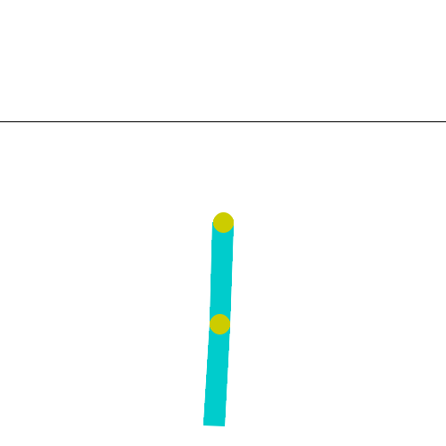

.. include:: /_includes/rllib/we_are_hiring.rst

.. _rllib-callback-docs:

Callbacks
=========

.. include:: /_includes/rllib/new_api_stack.rst

Callbacks are the most straightforward way to inject code into experiments. You can define the code to execute at certain events and pass it to your
:py:class:`~ray.rllib.algorithms.algorithm_config.AlgorithmConfig`.

The following is an example of defining a simple lambda that prints out an episode's return after
the episode terminates:

.. testcode::

    from ray.rllib.algorithms.ppo import PPOConfig

    ppo = config = (
        PPOConfig()
        .environment("CartPole-v1")
        .callbacks(
            on_episode_end=(
                lambda episode, **kw: print(f"Episode done. R={episode.get_return()}")
            )
        )
        .build()
    )
    ppo.train()

.. testcode::
    :hide:

    ppo.stop()

Callback lambdas versus stateful RLlibCallback
----------------------------------------------
There are two ways to define custom code for various callback events to execute.

Callback lambdas
~~~~~~~~~~~~~~~~
If the injected code is rather simple and doesn't need to store temporary information
for reuse in succeeding event calls, you can use a lambda
and pass it to the :py:meth:`~ray.rllib.algorithms.algorithm_config.AlgorithmConfig.callbacks`
method as previously shown.

See ref:`Callback events <rllib-callback-event-overview>` for a complete list.
The names of the events always match the argument names for the
:py:meth:`~ray.rllib.algorithms.algorithm_config.AlgorithmConfig.callbacks` method.

Stateful RLlibCallback
~~~~~~~~~~~~~~~~~~~~~~
If the injected code is stateful and temporarily stores results for reuse
in succeeding calls triggered by the same or a different event, you
need to subclass the :py:class:`~ray.rllib.callbacks.callbacks.RLlibCallback` API and then implement
one or more methods, for example :py:meth:`~ray.rllib.callbacks.callbacks.RLlibCallback.on_algorithm_init`:

The following is the same example that prints out a terminated episode's return, but uses
a subclass of :py:class:`~ray.rllib.callbacks.callbacks.RLlibCallback`.

.. testcode::

    from ray.rllib.algorithms.ppo import PPOConfig
    from ray.rllib.callbacks.callbacks import RLlibCallback

    class EpisodeReturn(RLlibCallback):
        def __init__(self):
            super().__init__()
            # Keep some global state in between individual callback events.
            self.overall_sum_of_rewards = 0.0

        def on_episode_end(self, *, episode, **kwargs):
            self.overall_sum_of_rewards += episode.get_return()
            print(f"Episode done. R={episode.get_return()} Global SUM={self.overall_sum_of_rewards}")

    ppo = (
        PPOConfig()
        .environment("CartPole-v1")
        .callbacks(EpisodeReturn)
        .build()
    )
    ppo.train()

.. testcode::
    :hide:

    ppo.stop()

.. _rllib-callback-event-overview:

Callback events
---------------

During a training iteration, the Algorithm normally walks through the following event tree,
a high-level overview of all supported events in RLlib's callbacks system:

.. code-block:: text

    Algorithm
        .__init__()
            `on_algorithm_init` - After algorithm construction and setup.
        .train()
            `on_train_result` - After a training iteration.
        .evaluate()
            `on_evaluate_start` - Before evaluation starts using the eval ``EnvRunnerGroup``.
            `on_evaluate_end` - After evaluation is finished.
        .restore_from_path()
            `on_checkpoint_loaded` - After a checkpoint's new state has been loaded.

    EnvRunner
        .__init__()
            `on_environment_created` - After the RL environment has been created.
        .sample()
            `on_episode_created` - After a new episode object has been created.
            `on_episode_start` - After an episode object has started (after ``env.reset()``).
            `on_episode_step` - After an episode object has stepped (after ``env.step()``).
            `on_episode_end` - After an episode object has terminated (or truncated).
            `on_sample_end` - At the end of the ``EnvRunner.sample()`` call.

Note that some of the events in the tree happen simultaneously, on different processes through Ray actors.
For example an EnvRunner actor may trigger its ``on_episode_start`` event while at the same time another
EnvRunner actor may trigger its ``on_sample_end`` event and the main Algorithm process triggers
``on_train_result``.

.. note::

    RLlib only invokes callbacks in :py:class:`~ray.rllib.algorithms.algorithm.Algorithm`
    and :py:class:`~ray.rllib.env.env_runner.EnvRunner` actors.
    The Ray team is considering expanding callbacks onto :py:class:`~ray.rllib.core.learner.learner.Learner`
    actors and possibly :py:class:`~ray.rllib.core.rl_module.rl_module.RLModule` instances as well.

.. currentmodule:: ray.rllib.callbacks.callbacks

.. dropdown:: Algorithm-bound methods of ``RLlibCallback``

    .. autosummary::

        RLlibCallback.on_algorithm_init
        RLlibCallback.on_evaluate_start
        RLlibCallback.on_evaluate_end
        RLlibCallback.on_env_runners_recreated
        RLlibCallback.on_checkpoint_loaded

.. dropdown:: EnvRunner-bound methods of ``RLlibCallback``

    .. autosummary::

        RLlibCallback.on_environment_created
        RLlibCallback.on_episode_created
        RLlibCallback.on_episode_start
        RLlibCallback.on_episode_step
        RLlibCallback.on_episode_end
        RLlibCallback.on_sample_end

Chaining callbacks
------------------

You can define more than one :py:class:`~ray.rllib.callbacks.callbacks.RLlibCallback` class and send them in a list to the
:py:meth:`~ray.rllib.algorithms.algorithm_config.AlgorithmConfig.callbacks` method.
You can also send lists of callables, instead of a single callable, to the different
arguments of that method.

For example, if you already wrote a subclass of :py:class:`~ray.rllib.callbacks.callbacks.RLlibCallback`
and want to reuse it in different experiments. Because one of your experiments
requires some debug callback code, you want to inject it only temporarily for a couple of runs.

Resolution order of chained callbacks
~~~~~~~~~~~~~~~~~~~~~~~~~~~~~~~~~~~~~

RLlib resolves all available callback methods and callables for a given event
as follows:

Subclasses of :py:class:`~ray.rllib.callbacks.callbacks.RLlibCallback` take precedence
over individual or lists of callables that you provide through the various arguments of
the :py:meth:`~ray.rllib.algorithms.algorithm_config.AlgorithmConfig.callbacks` method.

For example, assume the callback event is ``on_train_result``, which fires at the end of
a training iteration and inside the algorithm's process:

- RLlib loops through the list of all given :py:class:`~ray.rllib.callbacks.callbacks.RLlibCallback`
  subclasses and calls their ``on_train_result`` method. Thereby, it keeps the exact order the user
  provided in the list.
- RLlib then loops through the list of all defined ``on_train_result`` callables. You configured these
  by calling the :py:meth:`~ray.rllib.algorithms.algorithm_config.AlgorithmConfig.callbacks` method
  and defining the ``on_train_result`` argument in this call.

.. code-block:: python

    class MyCallbacks(RLlibCallback):
        def on_train_result(self, *, algorithm, metrics_logger, result, **kwargs):
            print("RLlibCallback subclass")

    class MyDebugCallbacks(RLlibCallback):
        def on_train_result(self, *, algorithm, metrics_logger, result, **kwargs):
            print("debug subclass")

    # Define the callbacks order through the config.
    # Subclasses first, then individual `on_train_result` (or other events) callables:
    config.callbacks(
        callbacks_class=[MyDebugCallbacks, MyCallbacks],  # <- note: debug class first
        on_train_result=[
            lambda algorithm, **kw: print('lambda 1'),
            lambda algorithm, **kw: print('lambda 2'),
        ],
    )

    # When training the algorithm, after each training iteration, you should see
    # something like:
    # > debug subclass
    # > RLlibCallback subclass
    # > lambda 1
    # > lambda 2

Examples
--------

The following are two examples showing you how to setup custom callbacks on the
:ref:`Algorithm <rllib-key-concepts-algorithms>` process as well as on the
:ref:`EnvRunner <rllib-key-concepts-env-runners>` processes.

.. _rllib-callback-example-on-train-result:

Example 1: `on_train_result`
~~~~~~~~~~~~~~~~~~~~~~~~~~~~

The following example demonstrates how to implement a simple custom function writing the replay buffer
contents to disk from time to time.

You normally don't want to write the contents of buffers along with your
:ref:`Algorithm checkpoints <rllib-checkpoints-docs>`, so writing less often, in a more
controlled fashion through a custom callback could be a good compromise.

.. testcode::

    import ormsgpack
    from ray.rllib.algorithms.dqn import DQNConfig

    def _write_buffer_if_necessary(algorithm, metrics_logger, result):
        # Write the buffer contents only every ith iteration.
        if algorithm.training_iteration % 2 == 0:
            # python dict
            buffer_contents = algorithm.local_replay_buffer.get_state()

            # binary
            msgpacked = ormsgpack.packb(
               buffer_contents,
               option=ormsgpack.OPT_SERIALIZE_NUMPY,
            )

            # Open some file and write the buffer contents into it using `ormsgpack`.
            with open("replay_buffer_contents.msgpack", "wb") as f:
               f.write(msgpacked)

    config = (
        DQNConfig()
        .environment("CartPole-v1")
        .callbacks(
           on_train_result=_write_buffer_if_necessary,
        )
    )
    dqn = config.build()

    # Train n times. Expect RLlib to write buffer every ith iteration.
    for _ in range(4):
        print(dqn.train())

See :ref:`Callbacks invoked in Algorithm <rllib-callback-reference-algorithm-bound>` for the exact call signatures of all available callbacks and the argument types that they expect.

.. _rllib-callback-example-on-episode-step-and-end:

Example 2: `on_episode_step` and `on_episode_end`
~~~~~~~~~~~~~~~~~~~~~~~~~~~~~~~~~~~~~~~~~~~~~~~~~

The following example demonstrates how to implement a custom :py:class:`~ray.rllib.callbacks.callbacks.RLlibCallback` class
computing the average "first-joint angle" of the
`Acrobot-v1 RL environment <https://github.com/Farama-Foundation/Gymnasium/blob/main/gymnasium/envs/classic_control/acrobot.py>`__:

    **The Acrobot-v1 environment**: The env code describes the angle you are about to
    compute and log through your custom callback as:

    .. code-block:: text

        `theta1` is the angle of the first joint, where an angle of 0.0 indicates that the first
        link is pointing directly downwards.

This example utilizes RLlib's :py:class:`~ray.rllib.utils.metrics.metrics_logger.MetricsLogger` API to log the custom computations
of the injected code. See :ref:`rllib-metric-logger-docs` for more details about the MetricsLogger API.

Also, see this more complex example that
`generates and logs a PacMan heatmap (image) to WandB <https://github.com/ray-project/ray/blob/master/rllib/examples/metrics/custom_metrics_in_env_runners.py>`__.

.. testcode::

    import math
    import numpy as np
    from ray.rllib.algorithms.ppo import PPOConfig
    from ray.rllib.callbacks.callbacks import RLlibCallback

    class LogAcrobotAngle(RLlibCallback):
        def on_episode_created(self, *, episode, **kwargs):
            # Initialize an empty list in the `custom_data` property of `episode`.
            episode.custom_data["theta1"] = []

        def on_episode_step(self, *, episode, env, **kwargs):
            # First get the angle from the env (note that `env` is a VectorEnv).
            # See https://github.com/Farama-Foundation/Gymnasium/blob/main/gymnasium/envs/classic_control/acrobot.py
            # for the env source code.
            cos_theta1, sin_theta1 = env.envs[0].unwrapped.state[0], env.envs[0].unwrapped.state[1]
            # Convert cos/sin/tan into degree.
            deg_theta1 = math.degrees(math.atan2(sin_theta1, cos_theta1))

            # Log the theta1 degree value in the episode object, temporarily.
            episode.custom_data["theta1"].append(deg_theta1)

        def on_episode_end(self, *, episode, metrics_logger, **kwargs):
            # Get all the logged theta1 degree values and average them.
            theta1s = episode.custom_data["theta1"]
            avg_theta1 = np.mean(theta1s)

            # Log the final result - per episode - to the MetricsLogger.
            # Report with a sliding/smoothing window of 50.
            metrics_logger.log_value("theta1_mean", avg_theta1, reduce="mean", window=50)

    config = (
        PPOConfig()
        .environment("Acrobot-v1")
        .callbacks(
            callbacks_class=LogAcrobotAngle,
        )
    )
    ppo = config.build()

    # Train n times. Expect to find `theta1_mean` in the results under:
    # `env_runners/theta1_mean`
    for i in range(10):
        results = ppo.train()
        print(
            f"iter={i} "
            f"theta1_mean={results['env_runners']['theta1_mean']} "
            f"R={results['env_runners']['episode_return_mean']}"
        )

.. tip::
    You can base your custom logic on whether the calling EnvRunner is a regular "training"
    EnvRunner, used to collect training samples, or an evaluation EnvRunner, used to play
    through episodes for evaluation only.
    Access the ``env_runner.config.in_evaluation`` boolean flag, which is True on
    evaluation ``EnvRunner`` actors and False on ``EnvRunner`` actors used to collect
    training data.

See :ref:`Callbacks invoked in Algorithm <rllib-callback-reference-algorithm-bound>`
for the exact call signatures of all available callbacks and the argument types they expect.
