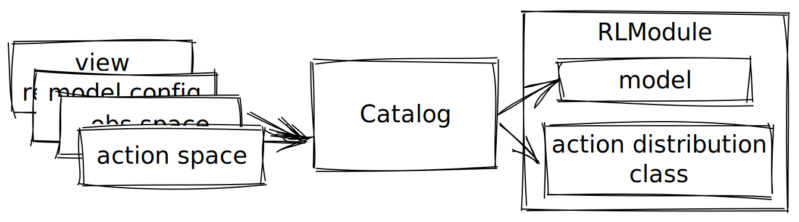
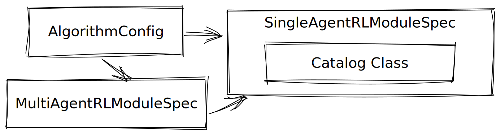

.. include:: /_includes/rllib/announcement.rst

.. include:: /_includes/rllib/we_are_hiring.rst

.. include:: /_includes/rllib/rlmodules_rollout.rst

Catalog (Alpha)
===============

Catalog is a utility abstraction that modularizes the construction of components for `RLModules <rllib-rlmodule.html>`__.
It includes information such how input observation spaces should be encoded,
what action distributions should be used, and so on.
:py:class:`~ray.rllib.core.models.catalog.Catalog`. For example,
:py:class:`~ray.rllib.algorithms.ppo.ppo_torch_rl_module.PPOTorchRLModule` has the
:py:class:`~ray.rllib.algorithms.ppo.ppo_catalog.PPOCatalog`.
To customize existing RLModules either change the RLModule directly by inheriting the class and changing the
:py:meth:`~ray.rllib.core.rl_module.rl_module.RLModule.setup` method or, alternatively, extend the Catalog class
attributed to that `RLModule`. Use Catalogs only if your customizations fits the abstractions provided by Catalog.

.. note::
    Modifying Catalogs signifies advanced use cases so you should only consider this if modifying an RLModule or writing one does not cover your use case.
    We recommend to modify Catalogs only when making deeper customizations to the decision trees that determine what :py:class:`~ray.rllib.core.models.base.Model` and :py:class:`~ray.rllib.models.distributions.Distribution` RLlib creates by default.

.. note::
    If you simply want to modify a Model by changing its default values,
    have a look at the model config dict:

    .. dropdown:: ``MODEL_DEFAULTS``
        :animate: fade-in-slide-down

        This dict (or an overriding sub-set) is part of :py:class:`~ray.rllib.algorithms.algorithm_config.AlgorithmConfig`
        and therefore also part of any algorithm-specific config.
        To change the behavior RLlib's default models, override it and pass it to an AlgorithmConfig.
        to change the behavior RLlib's default models.

        .. literalinclude:: ../../../rllib/models/catalog.py
            :language: python
            :start-after: __sphinx_doc_begin__
            :end-before: __sphinx_doc_end__

While Catalogs have a base class Catalog, you mostly interact with
Algorithm-specific Catalogs.
Therefore, this doc also includes examples around PPO from which you can extrapolate to other algorithms.
Prerequisites for this user guide is a rough understanding of `RLModules <rllib-rlmodule.html>`__.
This user guide covers the following topics:

- What are Catalogs
- Catalog design and ideas
- Catalog and AlgorithmConfig
- Basic usage
- Inject your custom models into RLModules
- Inject your custom action distributions into RLModules
- Write a Catalog from scratch

What are Catalogs
~~~~~~~~~~~~~~~~~

Catalogs have two primary roles: Choosing the right :py:class:`~ray.rllib.core.models.base.Model` and choosing the right :py:class:`~ray.rllib.models.distributions.Distribution`.
By default, all catalogs implement decision trees that decide model architecture based on a combination of input configurations.
These mainly include the ``observation space`` and ``action space`` of the :py:class:`~ray.rllib.core.rl_module.rl_module.RLModule`, the ``model config dict`` and the ``deep learning framework backend``.

The following diagram shows the break down of the information flow towards ``models`` and ``distributions`` within an RLModule.
An RLModule creates an instance of the Catalog class they receive as part of their constructor.
It then create its internal ``models`` and ``distributions`` with the help of this Catalog.

.. note::
    You can also modify Model or Distribution in an RLModule directly by overriding the RLModule's constructor!

The following diagram shows a concrete case in more detail.

.. dropdown:: **Example of catalog in a PPORLModule**
    :animate: fade-in-slide-down

    The :py:class:`~ray.rllib.algorithms.ppo.ppo_catalog.PPOCatalog` is fed an ``observation space``, ``action space``,
    a ``model config dict`` and the ``view requirements`` of the :py:class:`~ray.rllib.core.rl_module.rl_module.RLModule`.
    The ``model config dicts`` and the ``view requirements`` are only of interest in special cases, such as
    recurrent networks or attention networks. A PPORLModule has four components that are created by the PPOCatalog:
    ``Encoder``, ``value function head``, ``policy head``, and ``action distribution``.

    .. image:: images/catalog/ppo_catalog_and_rlm_diagram.svg
        :align: center

Catalog design and ideas
~~~~~~~~~~~~~~~~~~~~~~~~

Since the main use cases for this component involve deep modifications of it, we explain the design and ideas behind Catalogs in this section.

What problems do Catalogs solve?
--------------------------------

RL algorithms need neural network ``models`` and ``distributions``.
Within an algorithm, many different architectures for such sub-components are valid.
Moreover, models and distributions vary with environments.
However, most algorithms require models that have similarities.
The problem is finding sensible sub-components for a wide range of use cases while sharing this functionality
across algorithms.

How do Catalogs solve this?
----------------------------

As states above, Catalogs implement decision-trees for sub-components of `RLModules`.
Models and distributions from a Catalog object are meant to fit together.
Since we mostly build RLModules out of :py:class:`~ray.rllib.core.models.base.Encoder` s, Heads and :py:class:`~ray.rllib.models.distributions.Distribution` s, Catalogs also generally reflect this.
For example, the PPOCatalog will output Encoders that output a latent vector and two Heads that take this latent vector as input.
(That's why Catalogs have a ``latent_dims`` attribute). Heads and distributions behave accordingly.
Whenever you create a Catalog, the decision tree is executed to find suitable configs for models and classes for distributions.
By default this happens in :py:meth:`~ray.rllib.core.models.catalog.Catalog.get_encoder_config` and :py:meth:`~ray.rllib.core.models.catalog.Catalog._get_dist_cls_from_action_space`.
Whenever you build a model, the config is turned into a model.
Distributions are instantiated per forward pass of an `RLModule` and are therefore not built.

API philosophy
--------------

Catalogs attempt to encapsulate most complexity around models inside the :py:class:`~ray.rllib.core.models.base.Encoder`.
This means that recurrency, attention and other special cases are fully handles inside the Encoder and are transparent
to other components.
Encoders are the only components that the Catalog base class builds.
This is because many algorithms require custom heads and distributions but most of them can use the same encoders.
The Catalog API is designed such that interaction usually happens in two stages:

- Instantiate a Catalog. This executes the decision tree.
- Generate arbitrary number of decided components through Catalog methods.

The two default methods to access components on the base class are...

- :py:meth:`~ray.rllib.core.models.catalog.Catalog.build_encoder`
- :py:meth:`~ray.rllib.core.models.catalog.Catalog.get_action_dist_cls`

You can override these to quickly hack what models RLModules build.
Other methods are private and should only be overridden to make deep changes to the decision tree to enhance the capabilities of Catalogs.
Additionally, :py:meth:`~ray.rllib.core.models.catalog.Catalog.get_tokenizer_config` is a method that can be used when tokenization
is required. Tokenization means single-step-embedding. Encoding also means embedding but can span multiple timesteps.
In fact, RLlib's tokenizers used in its recurrent Encoders (e.g. :py:class:`~ray.rllib.core.models.torch.encoder.TorchLSTMEncoder`),
are instances of non-recurrent Encoder classes.

Catalog and AlgorithmConfig
~~~~~~~~~~~~~~~~~~~~~~~~~~~

Since Catalogs effectively control what ``models`` and ``distributions`` RLlib uses under the hood,
they are also part of RLlib’s configurations. As the primary entry point for configuring RLlib,
:py:class:`~ray.rllib.algorithms.algorithm_config.AlgorithmConfig` is the place where you can configure the
Catalogs of the RLModules that are created.
You set the ``catalog class`` by going through the :py:class:`~ray.rllib.core.rl_module.rl_module.SingleAgentRLModuleSpec`
or :py:class:`~ray.rllib.core.rl_module.marl_module.MultiAgentRLModuleSpec` of an AlgorithmConfig.
For example, in heterogeneous multi-agent cases, you modify the MultiAgentRLModuleSpec.

The following example shows how to configure the Catalog of an :py:class:`~ray.rllib.core.rl_module.rl_module.RLModule`
created by PPO.

.. literalinclude:: doc_code/catalog_guide.py
    :language: python
    :start-after: __sphinx_doc_algo_configs_begin__
    :end-before: __sphinx_doc_algo_configs_end__

Basic usage
~~~~~~~~~~~

In the following three examples, we play with Catalogs to illustrate their API.

High-level API
--------------

The first example showcases the general API for interacting with Catalogs.

.. literalinclude:: doc_code/catalog_guide.py
   :language: python
   :start-after: __sphinx_doc_basic_interaction_begin__
   :end-before: __sphinx_doc_basic_interaction_end__

Creating models and distributions
---------------------------------

The second example showcases how to use the base :py:class:`~ray.rllib.core.models.catalog.Catalog`
to create an ``model`` and an ``action distribution``.
Besides these, we create a ``head network`` by hand that fits these two by hand.

.. dropdown:: **Customize a policy head**
    :animate: fade-in-slide-down

    .. literalinclude:: doc_code/catalog_guide.py
       :language: python
       :start-after: __sphinx_doc_modelsworkflow_begin__
       :end-before: __sphinx_doc_modelsworkflow_end__

Creating models and distributions for PPO
-----------------------------------------

The third example showcases how to use the :py:class:`~ray.rllib.algorithms.ppo.ppo_catalog.PPOCatalog`
to create a ``encoder`` and an ``action distribution``.
This is more similar to what RLlib does internally.

.. dropdown:: **Use catalog-generated models**
    :animate: fade-in-slide-down

    .. literalinclude:: doc_code/catalog_guide.py
       :language: python
       :start-after: __sphinx_doc_ppo_models_begin__
       :end-before: __sphinx_doc_ppo_models_end__

Note that the above two examples illustrate in principle what it takes to implement a Catalog.
In this case, we see the difference between `Catalog` and `PPOCatalog`.
In most cases, we can reuse the capabilities of the base :py:class:`~ray.rllib.core.models.catalog.Catalog` base class
and only need to add methods to build head networks that we can then use in the appropriate `RLModule`.

Inject your custom model or action distributions into Catalogs
~~~~~~~~~~~~~~~~~~~~~~~~~~~~~~~~~~~~~~~~~~~~~~~~~~~~~~~~~~~~~~~

You can make a :py:class:`~ray.rllib.core.models.catalog.Catalog` build custom ``models`` by overriding the Catalog’s methods used by RLModules to build ``models``.
Have a look at these lines from the constructor of the :py:class:`~ray.rllib.algorithms.ppo.ppo_torch_rl_module.PPOTorchRLModule` to see how Catalogs are being used by an :py:class:`~ray.rllib.core.rl_module.rl_module.RLModule`:

.. literalinclude:: ../../../rllib/algorithms/ppo/ppo_rl_module.py
    :language: python
    :start-after: __sphinx_doc_begin__
    :end-before: __sphinx_doc_end__

Note that what happens inside the constructor of PPOTorchRLModule is similar to the earlier example `Creating models and distributions for PPO <rllib-catalogs.html#creating-models-and-distributions-for-ppo>`__.

Consequently, in order to build a custom :py:class:`~ray.rllib.core.models.Model` compatible with a PPORLModule,
you can override methods by inheriting from :py:class:`~ray.rllib.algorithms.ppo.ppo_catalog.PPOCatalog`
or write a :py:class:`~ray.rllib.core.models.catalog.Catalog` that implements them from scratch.
The following examples showcase such modifications:

.. tab-set::

    .. tab-item:: Adding a custom Encoder

        This example shows two modifications:

        - How to write a custom :py:class:`~ray.rllib.models.base.Encoder`
        - How to inject the custom Encoder into a :py:class:`~ray.rllib.core.models.catalog.Catalog`

        Note that, if you only want to inject your Encoder into a single :py:class:`~ray.rllib.core.rl_module.rl_module.RLModule`, the recommended workflow is to inherit
        from an existing RL Module and place the Encoder there.

        .. literalinclude:: ../../../rllib/examples/catalog/mobilenet_v2_encoder.py
           :language: python
           :start-after: __sphinx_doc_begin__
           :end-before: __sphinx_doc_end__

    .. tab-item:: Adding a custom action distribution

        This example shows two modifications:

        - How to write a custom :py:class:`~ray.rllib.models.distributions.Distribution`
        - How to inject the custom action distribution into a :py:class:`~ray.rllib.core.models.catalog.Catalog`

        .. literalinclude:: ../../../rllib/examples/catalog/custom_action_distribution.py
           :language: python
           :start-after: __sphinx_doc_begin__
           :end-before: __sphinx_doc_end__

These examples target PPO but the workflows apply to all RLlib algorithms.
Note that PPO adds the :py:class:`from ray.rllib.core.models.base.ActorCriticEncoder` and two heads (policy- and value-head) to the base class.
You can override these similarly to the above.
Other algorithms may add different sub-components or override default ones.

Write a Catalog from scratch
~~~~~~~~~~~~~~~~~~~~~~~~~~~~

You only need this when you want to write a new Algorithm under RLlib.
Note that writing an Algorithm does not strictly require writing a new Catalog but you can use Catalogs as a tool to create
the fitting default sub-components, such as models or distributions.
The following are typical requirements and steps for writing a new Catalog:

- Does the Algorithm need a special Encoder? Overwrite :py:meth:`~ray.rllib.core.models.catalog.Catalog._get_encoder_config`.
- Does the Algorithm need an additional network? Write a method to build it. You can use RLlib's model configurations to build models from dimensions.
- Does the Algorithm need a custom distribution? Overwrite :py:meth:`~ray.rllib.core.models.catalog.Catalog._get_dist_cls_from_action_space`.
- Does the Algorithm need a special tokenizer? Overwrite :py:meth:`~ray.rllib.core.models.catalog.Catalog.get_tokenizer_config`.
- Does the Algorithm not need an Encoder at all? Overwrite :py:meth:`~ray.rllib.core.models.catalog.Catalog._determine_components_hook`.

The following example shows our implementation of a Catalog for PPO that follows the above steps:

.. dropdown:: **Catalog for PPORLModules**

    .. literalinclude:: ../../../rllib/algorithms/ppo/ppo_catalog.py
               :language: python
               :start-after: __sphinx_doc_begin__
               :end-before: __sphinx_doc_end__