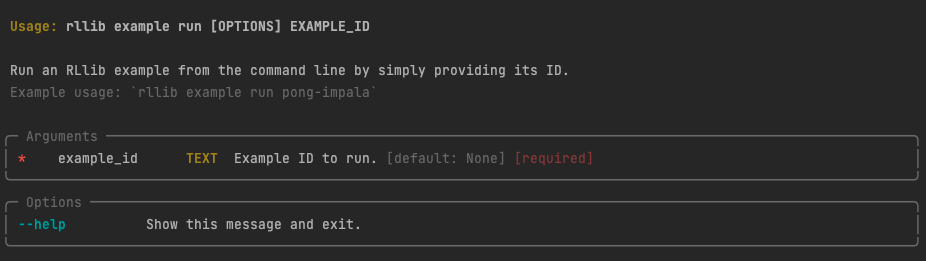

---
jupytext:
    text_representation:
        extension: .md
        format_name: myst
kernelspec:
    display_name: Python 3
    language: python
    name: python3
---

(rllib-cli-doc)=

# Working with the RLlib CLI

RLlib is built in Python and if you're an advanced user, you will primarily use its 
Python API to build and run your experiments. 
But RLlib also comes with a command line interface (CLI)[^typer] that allows you to quickly 
run and evaluate experiments without having to write any code.

You can also run pre-defined RLlib examples with it.
This is useful for quickly testing out RLlib, or for running experiments that are
simple enough that they don't require any custom code.

## Running your first example

Let's say you want to run an RLlib experiment on the `CartPole` gym environment,
using an example built for you by the RLlib team.

### Searching for examples

The first thing you can to is filter the list of all available examples by the 
environment name you want to use:

```{margin}
You can run this command without the `--filter` option to see the full list of almost
100 examples that come with RLlib.
```

```{raw} html

<div class="termynal" data-termynal>
    <span data-ty="input">rllib example list --filter cartpole</span>
</div>

```

This will return a list of Example IDs and their descriptions.
You can pick any example you want, but for this tutorial we'll use the `PPO` algorithm
and go with the example ID `cartpole-ppo`.

### Inspecting examples

If you're interested in checking out the specification of this example, you can do so
by typing the following CLI command:

```{raw} html

<div class="termynal" data-termynal>
    <span data-ty="input">rllib example get cartpole-ppo</span>
</div>

```

The output will be a prompt in the YAML format that contains the configuration of 
the example.[^formats]
We're not going to go into the details of the configuration here, but you should know
that it's a _tuned example_, meaning that you can expect it to train well out of
the box.

Here's the output of the above command (parsed as YAML for readability):

```{literalinclude} ../../../rllib/tuned_examples/ppo/cartpole-ppo.yaml
:language: yaml
```

```{margin}
Note that some of these tuned examples may require resource specifications, like
multiple GPUs, that you might not have available on your machine.
To "solve" some of the more advanced environments out there _efficiently_ and provide
a tuned example for it, we sometimes have to use the full power of a cluster.
After all, running on Ray Clusters is what RLlib was built for.
```

### Running tuned examples

Let's run the example next!
After showing how to start the training run, we give you some sample output of it below.
Note that by default, RLlib will create an indicative experiment name for you, and logs
important metrics such as the `reward`, the `episode_reward_max`, or the 
`episode_reward_min`.

```{raw} html

<div class="termynal" data-termynal>
    <span data-ty="input">rllib example run cartpole-ppo</span>

    <span data-ty>
    ... Number of trials: 1/1 (1 RUNNING) ...
    </span>
    <span data-ty>
    ... | Trial name                  | status  | ...
    |   reward |   episode_reward_max |   episode_reward_min | ...
    </span>
    <span data-ty>
    ... | PPO_CartPole-v0_9931e_00000 | RUNNING | ... 
    | 23.9756  |                   71 |                   10 | ...
    </span>
</div>

```

In the output of the training run, you should also see information about the machine
(`loc`, host name and port), as well as the `status` of your training runs.
If your run is `TERMINATED`, but you've never seen a successfully `RUNNING` experiment
in the log, something must have gone wrong.

```text
+-----------------------------+----------+----------------+
| Trial name                  | status   | loc            |
|-----------------------------+----------+----------------|
| PPO_CartPole-v0_9931e_00000 | RUNNING  | 127.0.0.1:8683 |
+-----------------------------+----------+----------------+
```

Also, when the training run finishes, you should see the following output:

```text
Your training finished.
Best available checkpoint for each trial:
  <path-to-a-checkpoint>/checkpoint_000008

You can now evaluate your trained algorithm from any checkpoint, e.g. by running:
╭────────────────────────────────────────────────────────────────────────────────────────────╮
│   rllib evaluate <path-to-a-checkpoint>/checkpoint_000008 --algo PPO                       │
╰────────────────────────────────────────────────────────────────────────────────────────────╯
```

In other words, you can now evaluate your trained algorithm from this (or any other)
checkpoint with the `rllib evaluate` command.
We'll come back to this command later.

This completes your first example with the RLlib CLI.
You now know about the `list`, `get`, and `run` sub-commands, and how to use them
to run _tuned_ examples with RLlib.

## Getting help

You can request help for the RLlib CLI simply by adding `--help` at the
end of any command, for instance by typing
`rllib example --help`, or `rllib example run --help`.
If you run the latter, you'll see the following output:



This output clearly shows you that the`run` sub-command has one mandatory argument,
namely an `example_id`.

Many other commands have many more arguments and options, so it can be a good idea
to check out the help output for them occasionally.

## Starting training runs

If you want to do more than just use the examples that come with RLlib,
you can also run your own algorithm configurations with `rllib`.
That's what you use the `rllib train` command for.

```{margin}
Internally the `rllib example run` command uses the same functionality as
`rllib train`.
The only difference is the usage of pre-defined configurations in the former.
```

There are two basic ways to run training.
You can either provide all the necessary information via the command line, or simply
point to a configuration file (like the YAML we've already seen in the 
previous section).
Let's briefly go over both options, starting with the recommended one.

### Training from file

To train from a configuration file, you can use the `rllib train file` sub-command.
It works by either providing a path to a local file, or a URL to a remote file.
Here's an example that uses one of the examples hosted in the Ray GitHub repository:

```{raw} html

<div class="termynal" data-termynal>
    <span data-ty="input">rllib train file https://raw.githubusercontent.com/\
    </span>
    <span data-ty="input">ray-project/ray/master/rllib/tuned_examples/\
    </span>
    <span data-ty="input">simple_q/cartpole_simpleq_test.py -t python
    </span>
</div>

```

The `-t` or `--type` option is used to specify the type of the configuration file,
in this case `python`, since we're using a Python file.
This is what the Python configuration of this example looks like:

```{literalinclude} ../../../rllib/tuned_examples/simple_q/cartpole_simpleq_test.py
:language: python
```

You can define your own Python examples by creating a Python file that contains
a variable called `config` of type `AlgorithmConfig` and an optional Python dictionary
called `stop` that defines stopping conditions.[^tune]

If you're interested in other configuration file types, you can check out the
following drop-down.
Apart from Python, you can also use YAML or JSON.

:::{dropdown} Here's the same configuration of our example expressed in YAML and JSON
:animate: fade-in-slide-down


You can run this file with `rllib train file <path-to-file> -t yaml`:

```{literalinclude} ../../../rllib/tuned_examples/simple_q/cartpole-simpleq-test.yaml
:language: python
```

and this one with `rllib train file <path-to-file> -t json`:

```{literalinclude} ../../../rllib/tuned_examples/simple_q/cartpole-simpleq-test.json
:language: python
```

Currently, `yaml` is the default type and many of the tuned examples in the RLlib
repository use it.
So, if you're running a YAML file with `rllib train file`, you don't need to specify
the `-t` option.

:::

Training from a file is the recommended way to run training with RLlib, because you
can just modify the file and run the same command again.
For quick tests and experiments, however, you can directly provide the configuration
via the command line.

### Training from configuration options

By dropping the `file` sub-command, you can directly provide the configuration options
of your experiment as command line arguments.
For instance, to run training with PPO on a CartPole environment, you can use the
following command directly:

```{raw} html

<div class="termynal" data-termynal>
    <span data-ty="input">rllib train --algo PPO --env CartPole-v1 --config {}</span>
</div>

```

The advantage is that you don't need to create a configuration file, but the downside
is that your CLI command can get quite long and complicated.
The `--config` option is used to provide a JSON string that contains the configuration
that you would otherwise put in your YAML or JSON config files.

The `train` command has many more options that we don't discuss in detail here,
but you can use the following dropdown to read more about their definition: 

:::{dropdown} Click here to see all `train` command line options
:animate: fade-in-slide-down

The `train` command is fed the following Typer variables, most of them are optional:

```{literalinclude} ../../../rllib/common.py
:language: python
:start-after: __cli_common_start__
:end-before: __cli_common_end__
```

```{literalinclude} ../../../rllib/common.py
:language: python
:start-after: __cli_train_start__
:end-before: __cli_train_end__
```

As you might infer, the set of options roughly splits into two categories, namely
those that are used to configure the training run, and those that are used to configure
your Ray cluster.

:::

Probably the best way to get familiar with `rllib train` is to run
`rllib train --help` and play with your own experiments. 

## Evaluating your experiments

Successful training runs generate _checkpoints_ whose performance you can evaluate
with the `rllib evaluate` command.
By default, checkpoints are generated in `~/ray_results/<experiment>/checkpoints/...`,
and you can use can provide the full path to a checkpoint as argument to the evaluate
command.

```{margin}
As you've seen earlier, every successful `rllib example run` generates an 
`rllib evaluate` command automatically for you from a checkpoint.
The same holds true for `rllib train` runs.
```

If you've run an `rllib train` run locally, you could use such a checkpoint to evaluate
its performance, but for testing purposes you can also evaluate an untrained algorithm
by simply omitting the checkpoint argument:

```{raw} html

<div class="termynal" data-termynal>
    <span data-ty="input"> rllib evaluate --algo PPO --env CartPole-v1</span>
    <span data-ty>Episode #10: reward: 19.1</span>
    <span data-ty>Episode #20: reward: 30.5</span>
    <span data-ty>Episode #30: reward: 19.8</span>
    <span data-ty>Episode #40: reward: 31.2</span>
    <span data-ty>Episode #50: reward: 23.0</span>
</div>

```

Note that the `evaluate` command needs to know about the algorithm and environment
you want to evaluate. 
The overall structure of the command itself is slightly simpler than its `train`
counterpart, as there are simply fewer options to configure.

:::{dropdown} See all `evaluation` command line options
:animate: fade-in-slide-down

```{literalinclude} ../../../rllib/common.py
:language: python
:start-after: __cli_eval_start__
:end-before: __cli_eval_end__
```

:::

## Where to go from here?

Now that you know the three basic commands of the RLlib CLI, namely `train`, `evaluate`
and `example`, you have all the tools you need to run simple RLlib experiments from
the command line.

If you want to learn more about the capabilities of RLlib, you have to learn more about
its [Python API](rllib-training-api) and how to 
[configure algorithms](rllib-algo-configuration) in the first place.


[^typer]: The RLlib CLI is built with [Typer](https://typer.tiangolo.com/) and uses
    [Rich](https://rich.readthedocs.io/en/stable/introduction.html) text formatting for
    convenience.

[^formats]: Many of the pre-defined examples are written in YAML,
    but you can also use JSON or Python files.
    The CLI will automatically detect the format of the file you're using.

[^tune]: These stopping conditions are internally picked up by Ray Tune,
    which is used by RLlib under the hood. 