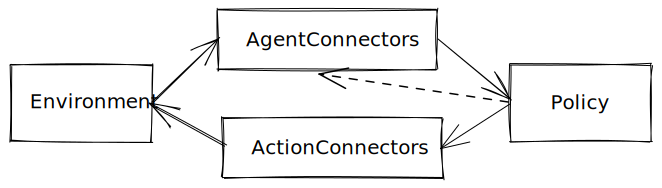

.. include:: /_includes/rllib/announcement.rst

.. include:: /_includes/rllib/we_are_hiring.rst

Connectors (Alpha)
==================

Connector are components that handle transformations on inputs and outputs of a given RL policy, with the goal of improving
the durability and maintainability of :ref:`RLlib's Policy checkpoints <rllib-saving-and-loading-algos-and-policies-docs>`.

RLlib algorithms usually require one or more *user environments* and *policies* (usually a neural network).

Data observed from the environments usually go through multiple steps of preprocessing before they reach
the policy, while the output of the policy also gets transformed multiple times before they are used to control
specific agents in the environments.

By consolidating these transformations under the framework of connectors, users of RLlib will be able to:

- Restore and deploy individual RLlib policies without having to restore training-related logics of RLlib Algorithms.
- Ensure policies are more durable than the algorithms they get trained with.
- Allow policies to be adapted to work with different versions of an environment.
- Run inference with RLlib policies without worrying about the exact trajectory view requirements or state inputs.

Connectors can be enabled by setting the ``enable_connectors`` parameter to ``True`` with ``AlgorithmConfig.rollouts()`` API.

Key Concepts
------------

We have two classes of connectors. The first is an ``AgentConnector``, which is used to transform observed data from environments to the policy.
The second is an ``ActionConnector``, which is used to transform the outputs from the policy to actions.

AgentConnector
~~~~~~~~~~~~~~

``AgentConnectors`` handle the job of transforming environment observation data into a format that is understood by
the policy (e.g., flattening complex nested observations into a flat tensor). The high-level APIs are:

.. code-block:: python

    class AgentConnector(Connector):
        def __call__(
            self, acd_list: List[AgentConnectorDataType]
        ) -> List[AgentConnectorDataType]:
            ...

        def transform(
            self, ac_data: AgentConnectorDataType
        ) -> AgentConnectorDataType:
            ...

        def reset(self, env_id: str):
            ...

        def on_policy_output(self, output: ActionConnectorDataType):
            ...

AgentConnector operates on a list of observation data.
The list is constructed by grouping together observations from agents that are mapped to a same policy.

This setup is useful for certain multi-agent use cases where individual observations may need to be
modified based on data from other agents.
This can also be useful if users who need to construct meta-observations, e.g., build a graph as input
to the policy from individual agent observations.

For convenience, if an ``AgentConnector`` does not operate on the full list of agent data, it can be
implemented by simply overriding the ``transform()`` API.

AgentConnectors also provide a way for recording the output of the policy at the current time step
(prior to transformation via ActionConnectors) to be later used for inference in the next time step.
This is done through the ``on_policy_output()`` API call and is useful when your policy is a
recurrent network, attention network, or auto-regressive model.

ActionConnector
~~~~~~~~~~~~~~~

``ActionConnector`` has a simpler API, which operates on individual actions:

.. code-block:: python

    class ActionConnector(Connector):
        def __call__(
            self, ac_data: ActionConnectorDataType
        ) -> ActionConnectorDataType:
            ...

        def transform(
            self, ac_data: ActionConnectorDataType
        ) -> ActionConnectorDataType:
            ...

In this case, ``__call__`` and ``transform`` are equivalent. Users may choose to override either
API to implement an ActionConnector.

Common Data Types
-----------------

AgentConnectorDataType
~~~~~~~~~~~~~~~~~~~~~~

Per-agent observation data that goes through an ``AgentConnector`` is in the format of ``AgentConnectorDataType``.

.. literalinclude:: ../../../rllib/utils/typing.py
   :language: python
   :start-after: __sphinx_doc_begin_agent_connector_data_type__
   :end-before: __sphinx_doc_end_agent_connector_data_type__

AgentConnectorsOutput
~~~~~~~~~~~~~~~~~~~~~

The output from RLlib's default agent connector pipeline is in ``AgentConnectorsOutput`` format.

.. literalinclude:: ../../../rllib/utils/typing.py
   :language: python
   :start-after: __sphinx_doc_begin_agent_connector_output__
   :end-before: __sphinx_doc_end_agent_connector_output__

Note that in addition to the processed sample batch, which can be used for running the policy
forward pass, ``AgentConnectorsOutput`` also provides the original raw input dict, because it
sometimes contains data required for downstream processing (e.g. action masks).

ActionConnectorDataType
~~~~~~~~~~~~~~~~~~~~~~~

``ActionConnectorDataType`` is the data type ``ActionConnector`` deals with.
It is basically env and agent IDs, input_dict, and ``PolicyOutputType``.
The raw input dict is made available for action connectors in case some of the
data fields are needed for adapting action outputs, for example action masks.

.. literalinclude:: ../../../rllib/utils/typing.py
   :language: python
   :start-after: __sphinx_doc_begin_action_connector_output__
   :end-before: __sphinx_doc_end_action_connector_output__

Before, users of RLlib policies would have to come up with the right observation and state inputs
before they can call a policy. With agent connectors, this task is taken care of automatically.

.. literalinclude:: ../../../rllib/utils/typing.py
   :language: python
   :start-after: __sphinx_doc_begin_policy_output_type__
   :end-before: __sphinx_doc_end_policy_output_type__

Advanced Connectors
-------------------

Lambda Connector helps turn simple transformation functions into agent or action
connectors without having users worry about the high-level list or non-list APIs.
Lambda Connector has separate agent and action versions, for example:

.. tab-set::

    .. tab-item:: Lambda Agent Connector

        .. code-block:: python

            # An example agent connector that filters INFOS column out of
            # observation data.
            def filter(d: ActionConnectorDataType):
                del d.data[SampleBatch.INFOS]
                return d

            FilterInfosColumnAgentConnector = register_lambda_agent_connector(
                "FilterInfosColumnAgentConnector", filter
            )

    .. tab-item:: Lambda Action Connector

        .. code-block:: python

            # An example action connector that scales actions output by the
            # policy by a factor of 2.
            ScaleActionConnector = register_lambda_action_connector(
                "ScaleActionConnector",
                lambda actions, states, fetches: 2 * actions, states, fetches
            )

Multiple connectors can be composed into a ``ConnectorPipeline``, which handles
proper running of all children connectors in sequence and provides basic operations to modify and update the composition of connectors.

``ConnectorPipeline`` also has agent and action versions:

.. tab-set::

    .. tab-item:: AgentConnectorPipeline

        .. code-block:: python

            # Example construction of an AgentConnectorPipeline.
            pipeline = ActionConnectorPipeline(
                ctx,
                [ClipRewardAgentConnector(), ViewRequirementAgentConnector()]
            )

            # For demonstration purpose, we will add an ObsPreprocessorConnector
            # in front of the ViewRequirementAgentConnector.
            pipeline.insert_before("ViewRequirementAgentConnector", ObsPreprocessorConnector())

    .. tab-item:: Action Lambda Connector

        .. code-block:: python

            # Example construction of an ActionConnectorPipeline.
            pipeline = ActionConnectorPipeline(
                ctx,
                [ConvertToNumpyConnector(), ClipActionsConnector(), ImmutableActionsConnector()]
            )

            # For demonstration purpose, we will drop the last ImmutableActionsConnector here.
            pipeline.remove("ImmutableActionsConnector")

Policy Checkpoint
-----------------

If connectors are enabled, RLlib will try to save policy checkpoints in properly serialized formats instead of
relying on python pickling. Eventually, the goal is to save policy checkpoints in serialized JSON files
to ensure maximum compatibility between RLlib and python versions.

When enabled, the configurations of agent and action connectors will get serialized and saved with checkpointed
policy states.
These connectors, together with the specific transformations they represent,
can be easily recovered (by RLlib-provided utils) to simplify deployment and inference use cases.

You can read more on :ref:`Policy checkpoints here <rllib-saving-and-loading-algos-and-policies-docs>`.

Serving and Inference
---------------------

With connectors essentially checkpointing all the transformations used during training,
policies can be easily restored without the original algorithm for local inference,
as demonstrated by the following Cartpole example:

.. literalinclude:: ../../../rllib/examples/connectors/run_connector_policy.py
   :language: python
   :start-after: __sphinx_doc_begin__
   :end-before: __sphinx_doc_end__

RLlib will also provide utils soon to make server/client deployment of trained policies much easier.
See `Notable TODOs`_.

Adapting a Policy for Different Environments
--------------------------------------------

It is not uncommon for user environments to go through active development iterations.
Policies trained with an older version of an environment may be rendered useless for updated environments.
While env wrapper helps with this problem in many cases, connectors allow policies trained with
different environments to work together at the same time.

Here is an example demonstrating adaptation of a policy trained for the standard Cartpole environment
for a new mock Cartpole environment that returns additional features and requires extra action inputs.

.. literalinclude:: ../../../rllib/examples/connectors/adapt_connector_policy.py
   :language: python
   :start-after: __sphinx_doc_begin__
   :end-before: __sphinx_doc_end__

End-to-end Example
------------------

TODO: End-to-end case study: adapting an old policy to bootstrap the training of new LSTM policies,
then serve the newly trained policy in a server/client setup.

Notable TODOs
-------------

- Bring connectors to offline algorithms.
- Migrate rollout worker filters to connector.
- Migrate episode building and traning sample collection into connector.
- Examples and utilities demostrating deployment of RLlib policies in a client-server remote environment.
