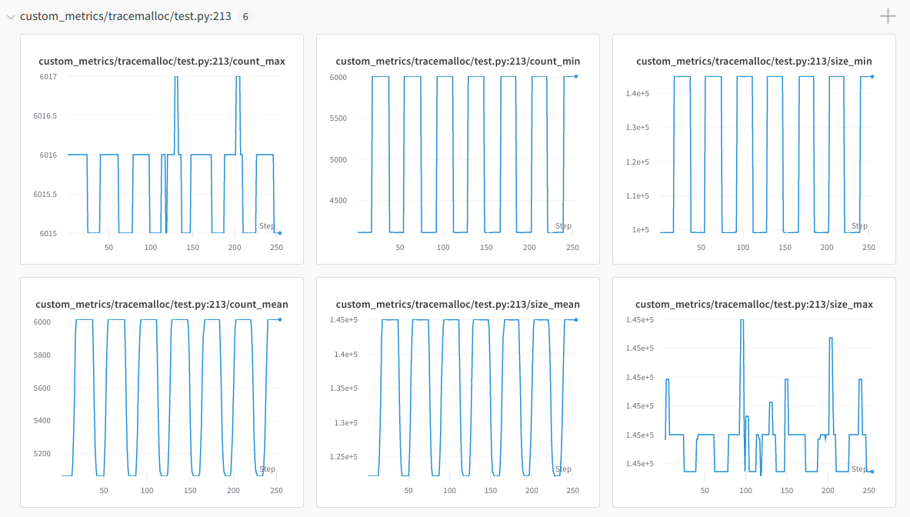

.. include:: /_includes/rllib/we_are_hiring.rst

.. include:: /_includes/rllib/new_api_stack.rst

Install RLlib for Development
=============================

You can develop RLlib locally without needing to compile Ray by using the `setup-dev.py script <https://github.com/ray-project/ray/blob/master/python/ray/setup-dev.py>`__.
This sets up symlinks between the ``ray/rllib`` dir in your local git clone and the respective directory bundled with the pip-installed ``ray`` package.
This way, every change you make in the source files in your local git clone will immediately be reflected in your installed ``ray`` as well.

However if you have installed ray from source using `these instructions <https://docs.ray.io/en/master/ray-overview/installation.html>`__ then don't use this,
as these steps should have already created the necessary symlinks.

When using the `setup-dev.py script <https://github.com/ray-project/ray/blob/master/python/ray/setup-dev.py>`__,
make sure that your git branch is in sync with the installed Ray binaries, meaning you are up-to-date on `master <https://github.com/ray-project/ray>`__
and have the latest `wheel <https://docs.ray.io/en/master/ray-overview/installation.html#daily-releases-nightlies>`__ installed.

.. code-block:: bash

    # Clone your fork onto your local machine, e.g.:
    git clone https://github.com/[your username]/ray.git
    cd ray
    # Only enter 'Y' at the first question on linking RLlib.
    # This leads to the most stable behavior and you won't have to re-install ray as often.
    # If you anticipate making changes to e.g. Tune or Train quite often, consider also symlinking Ray Tune or Train here
    # (say 'Y' when asked by the script about creating the Tune or Train symlinks).
    python python/ray/setup-dev.py

Contributing to RLlib
=====================

Contributing Fixes and Enhancements
-----------------------------------

Feel free to file new RLlib-related PRs through `Ray's github repo <https://github.com/ray-project/ray/pulls>`__.
The RLlib team is very grateful for any external help they can get from the open-source community. If you are unsure about how to structure your
bug-fix or enhancement-PRs, create a small PR first, then ask us questions within its conversation section.
`See here for an example of a good first community PR <https://github.com/ray-project/ray/pull/46317>`__.

Contributing Algorithms
-----------------------

These are the guidelines for merging new algorithms into RLlib.
We distinguish between two levels of contributions: As an `example script <https://github.com/ray-project/ray/tree/master/rllib/examples>`__
(possibly with additional classes in other files)
or as a fully-integrated RLlib Algorithm in `rllib/algorithms <https://github.com/ray-project/ray/tree/master/rllib/algorithms>`__.

* Example Algorithms:
    - must subclass Algorithm and implement the ``training_step()`` method
    - must include the main example script, in which the algo is demoed, in a CI test, which proves that the algo is learning a certain task.
    - should offer functionality not present in existing algorithms

* Fully integrated Algorithms have the following additional requirements:
    - must offer substantial new functionality not possible to add to other algorithms
    - should support custom RLModules
    - should use RLlib abstractions and support distributed execution
    - should include at least one `tuned hyperparameter example <https://github.com/ray-project/ray/tree/master/rllib/tuned_examples>`__, testing of which is part of the CI

Both integrated and contributed algorithms ship with the ``ray`` PyPI package, and are tested as part of Ray's automated tests.

New Features
------------

New feature developments, discussions, and upcoming priorities are tracked on the `GitHub issues page <https://github.com/ray-project/ray/issues>`__
(note that this may not include all development efforts).

API Stability
=============

API Decorators in the Codebase
------------------------------

Objects and methods annotated with ``@PublicAPI`` (new API stack),
``@DeveloperAPI`` (new API stack), or ``@OldAPIStack`` (old API stack)
have the following API compatibility guarantees:

.. autofunction:: ray.util.annotations.PublicAPI
    :noindex:

.. autofunction:: ray.util.annotations.DeveloperAPI
    :noindex:

.. autofunction:: ray.rllib.utils.annotations.OldAPIStack
    :noindex:

Benchmarks
==========

A number of training run results are available in the `rl-experiments repo <https://github.com/ray-project/rl-experiments>`__,
and there is also a list of working hyperparameter configurations in `tuned_examples <https://github.com/ray-project/ray/tree/master/rllib/tuned_examples>`__, sorted by algorithm.
Benchmark results are extremely valuable to the community, so if you happen to have results that may be of interest, consider making a pull request to either repo.

Debugging RLlib
===============

Finding Memory Leaks In Workers
-------------------------------

Keeping the memory usage of long running workers stable can be challenging. The ``MemoryTrackingCallbacks`` class can be used to track memory usage of workers.

.. autoclass:: ray.rllib.callbacks.callbacks.MemoryTrackingCallbacks

The objects with the top 20 memory usage in the workers are added as custom metrics. These can then be monitored using tensorboard or other metrics integrations like Weights & Biases:

Troubleshooting
---------------

If you encounter errors like
`blas_thread_init: pthread_create: Resource temporarily unavailable` when using many workers,
try setting ``OMP_NUM_THREADS=1``. Similarly, check configured system limits with
`ulimit -a` for other resource limit errors.

For debugging unexpected hangs or performance problems, you can run ``ray stack`` to dump
the stack traces of all Ray workers on the current node, ``ray timeline`` to dump
a timeline visualization of tasks to a file, and ``ray memory`` to list all object
references in the cluster.
