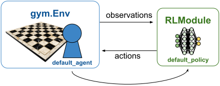

.. include:: /_includes/rllib/we_are_hiring.rst

.. _rllib-environments-doc:

Environments
============

.. toctree::
    :hidden:

    multi-agent-envs
    hierarchical-envs
    external-envs

.. include:: /_includes/rllib/new_api_stack.rst

.. grid:: 1 2 3 4
    :gutter: 1
    :class-container: container pb-3

    .. grid-item-card::
        :img-top: /rllib/images/envs/single_agent_env_logo.svg
        :class-img-top: pt-2 w-75 d-block mx-auto fixed-height-img

        .. button-ref:: rllib-single-agent-env-doc

            Single-Agent Environments (this page)

    .. grid-item-card::
        :img-top: /rllib/images/envs/multi_agent_env_logo.svg
        :class-img-top: pt-2 w-75 d-block mx-auto fixed-height-img

        .. button-ref:: rllib-multi-agent-environments-doc

            Multi-Agent Environments

    .. grid-item-card::
        :img-top: /rllib/images/envs/external_env_logo.svg
        :class-img-top: pt-2 w-75 d-block mx-auto fixed-height-img

        .. button-ref:: rllib-external-env-setups-doc

            External Environments and Applications

    .. grid-item-card::
        :img-top: /rllib/images/envs/hierarchical_env_logo.svg
        :class-img-top: pt-2 w-75 d-block mx-auto fixed-height-img

        .. button-ref:: rllib-hierarchical-environments-doc

            Hierarchical Environments

.. _rllib-single-agent-env-doc:

In online reinforcement learning (RL), an algorithm trains a policy
neural network by collecting data on-the-fly using an RL environment or simulator.
The agent navigates within the environment choosing actions governed by this policy and collecting
the environment's observations and rewards.
The goal of the algorithm is to train the policy on the collected data such that the policy's
action choices eventually maximize the cumulative reward over the agent's lifetime.

    **Single-agent setup:** One agent lives in the environment and takes actions computed by a single policy.
    The mapping from agent to policy is fixed ("default_agent" maps to "default_policy").
    See :ref:`Multi-Agent Environments <rllib-multi-agent-environments-doc>` for how this setup generalizes in the multi-agent case.

.. _gymnasium:

Farama Gymnasium
----------------

RLlib relies on `Farama's Gymnasium API <https://gymnasium.farama.org/>`__
as its main RL environment interface for **single-agent** training
(:ref:`see here for multi-agent <rllib-multi-agent-environments-doc>`).
To implement custom logic with `gymnasium` and integrate it into an RLlib config, see
this `SimpleCorridor example
<https://github.com/ray-project/ray/blob/master/rllib/examples/envs/custom_gym_env.py>`__.

.. tip::

    Not all action spaces are compatible with all RLlib algorithms. See the
    `algorithm overview <rllib-algorithms.html#available-algorithms-overview>`__
    for details. In particular, pay attention to which algorithms support discrete
    and which support continuous action spaces or both.

For more details on building a custom `Farama Gymnasium
<https://gymnasium.farama.org/>`__ environment, see the
`gymnasium.Env class definition <https://github.com/Farama-Foundation/Gymnasium/blob/main/gymnasium/core.py>`__.

For **multi-agent** training, see :ref:`RLlib's multi-agent API and supported third-party APIs <rllib-multi-agent-environments-doc>`.

.. _configuring-environments:

Configuring Environments
------------------------

To specify which RL environment to train against, you can provide either a string name or a
Python class that has to subclass `gymnasium.Env <https://github.com/Farama-Foundation/Gymnasium/blob/main/gymnasium/core.py>`__.

Specifying by String
~~~~~~~~~~~~~~~~~~~~

RLlib interprets string values as `registered gymnasium environment names <https://gymnasium.farama.org/>`__
by default.

For example:

.. testcode::
    from ray.rllib.algorithms.ppo import PPOConfig

    config = (
        PPOConfig()
        # Configure the RL environment to use as a string (by name), which
        # is registered with Farama's gymnasium.
        .environment("Acrobot-v1")
    )
    algo = config.build()
    print(algo.train())

.. testcode::
    :hide:

    algo.stop()

.. tip::

    For all supported environment names registered with Farama, refer to these
    resources (by env category):

    * `Toy Text <https://gymnasium.farama.org/environments/toy_text/>`__
    * `Classic Control <https://gymnasium.farama.org/environments/classic_control/>`__
    * `Atari <https://gymnasium.farama.org/environments/atari/>`__
    * `MuJoCo <https://gymnasium.farama.org/environments/mujoco/>`__
    * `Box2D <https://gymnasium.farama.org/environments/box2d/>`__

Specifying by Subclass of gymnasium.Env
~~~~~~~~~~~~~~~~~~~~~~~~~~~~~~~~~~~~~~~

If you're using a custom subclass of `gymnasium.Env class <https://github.com/Farama-Foundation/Gymnasium/blob/main/gymnasium/core.py>`__,
you can pass the class itself rather than a registered string. Your subclass must accept
a single ``config`` argument in its constructor (which may default to `None`).

For example:

.. testcode::

    import gymnasium as gym
    import numpy as np
    from ray.rllib.algorithms.ppo import PPOConfig

    class MyDummyEnv(gym.Env):
        # Write the constructor and provide a single `config` arg,
        # which may be set to None by default.
        def __init__(self, config=None):
            # As per gymnasium standard, provide observation and action spaces in your
            # constructor.
            self.observation_space = gym.spaces.Box(-1.0, 1.0, (1,), np.float32)
            self.action_space = gym.spaces.Discrete(2)

        def reset(self, seed=None, options=None):
            # Return (reset) observation and info dict.
            return np.array([1.0]), {}

        def step(self, action):
            # Return next observation, reward, terminated, truncated, and info dict.
            return np.array([1.0]), 1.0, False, False, {}

    config = (
        PPOConfig()
        .environment(
            MyDummyEnv,
            env_config={},  # `config` to pass to your env class
        )
    )
    algo = config.build()
    print(algo.train())

.. testcode::
    :hide:

    algo.stop()

Specifying by Tune-Registered Lambda
~~~~~~~~~~~~~~~~~~~~~~~~~~~~~~~~~~~~

A third option for providing environment information to your config is to register an
environment creator function (or lambda) with Ray Tune. The creator function must take a
single ``config`` parameter and return a single non-vectorized
`gymnasium.Env <https://github.com/Farama-Foundation/Gymnasium/blob/main/gymnasium/core.py>`__ instance.

For example:

.. testcode::

    from ray.tune.registry import register_env

    def env_creator(config):
        return MyDummyEnv(config)  # Return a gymnasium.Env instance.

    register_env("my_env", env_creator)
    config = (
        PPOConfig()
        .environment("my_env")  # <- Tune registered string pointing to your custom env creator.
    )
    algo = config.build()
    print(algo.train())

.. testcode::
    :hide:

    algo.stop()

For a complete example using a custom environment, see the
`custom_gym_env.py example script <https://github.com/ray-project/ray/blob/master/rllib/examples/envs/custom_gym_env.py>`__.

.. warning::

    Due to Ray's distributed nature, gymnasium's own registry is incompatible
    with Ray. Always use the registration method documented here to ensure
    remote Ray actors can access your custom environments.

In the preceding example, the ``env_creator`` function takes a ``config`` argument.
This config is primarily a dictionary containing required settings.
However, you can also access additional properties within the ``config`` variable. For example,
use ``config.worker_index`` to get the remote EnvRunner index or ``config.num_workers``
for the total number of EnvRunners used. This approach can help customize environments
within an ensemble and make environments running on some EnvRunners behave differently from
those running on other EnvRunners.

For example:

.. code-block:: python

    class EnvDependingOnWorkerAndVectorIndex(gym.Env):
        def __init__(self, config):
            # Pick actual env based on worker and env indexes.
            self.env = gym.make(
                choose_env_for(config.worker_index, config.vector_index)
            )
            self.action_space = self.env.action_space
            self.observation_space = self.env.observation_space

        def reset(self, seed, options):
            return self.env.reset(seed, options)

        def step(self, action):
            return self.env.step(action)

    register_env("multi_env", lambda config: MultiEnv(config))

.. tip::

    When using logging within an environment, the configuration must be done
    inside the environment (running within Ray workers). Pre-Ray logging
    configurations will be ignored. Use the following code to connect to Ray's
    logging instance:

    .. testcode::

        import logging
        logger = logging.getLogger("ray.rllib")

Performance and Scaling
-----------------------

.. figure:: images/envs/env_runners.svg
    :width: 600
    :align: left

    **EnvRunner with gym.Env setup:** Environments in RLlib are located within the :py:class:`~ray.rllib.envs.env_runner.EnvRunner` actors, whose number
    (`n`) you can scale through the `config.env_runners(num_env_runners=..)` setting. Each :py:class:`~ray.rllib.envs.env_runner.EnvRunner` actor
    can hold more than one `gymnasium <https://gymnasium.farama.org>`__ environment (vectorized). You can set the number
    of individual environment copies per EnvRunner through `config.env_runners(num_envs_per_env_runner=..)`.

There are two methods to scale sample collection with RLlib and `gymnasium <https://gymnasium.farama.org>`__ environments. You can use both
in combination.

1. **Distribute across multiple processes:** RLlib creates multiple
   :py:class:`~ray.rllib.envs.env_runner.EnvRunner` instances, each a Ray actor, for experience collection,
   controlled through your :py:class:`~ray.rllib.algorithms.algorithm_config.AlgorithmConfig`:
   ``config.env_runners(num_env_runners=..)``.

1. **Vectorization within a single process:** Many environments achieve high
   frame rates per core but are limited by policy inference latency. To address
   this limitation, create multiple environments per process to batch the policy forward pass
   across these vectorized environments. Set ``config.env_runners(num_envs_per_env_runner=..)``
   to create more than one environment copy per :py:class:`~ray.rllib.envs.env_runner.EnvRunner`
   actor. Additionally, you can make the individual sub-environments within a vector
   independent processes through Python's multiprocessing used by gymnasium.
   Set `config.env_runners(remote_worker_envs=True)` to create individual subenvironments as separate processes
   and step them in parallel.

.. note::

    Multi-agent setups aren't vectorizable yet. The Ray team is working on a solution for
    this restriction by using the `gymnasium >= 1.x` custom vectorization feature.

.. tip::

    See the :ref:`scaling guide <rllib-scaling-guide>` for more on RLlib training at scale.

Expensive Environments
~~~~~~~~~~~~~~~~~~~~~~

Some environments may require substantial resources to initialize and run. If your environments require
more than 1 CPU per :py:class:`~ray.rllib.envs.env_runner.EnvRunner`, you can provide more resources for each
actor by setting the following config options:
``config.env_runners(num_cpus_per_env_runner=.., num_gpus_per_env_runner=..)``
