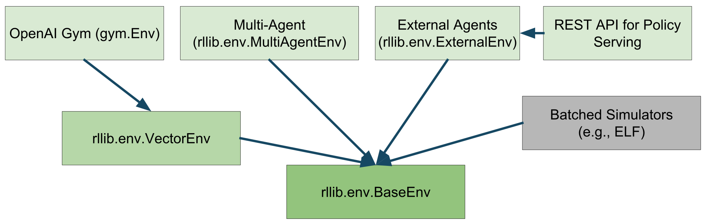
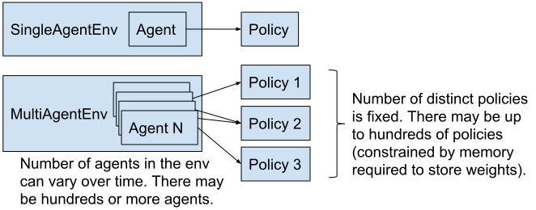
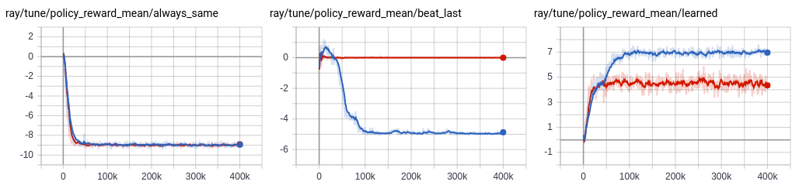

.. include:: /_includes/rllib/announcement.rst

.. include:: /_includes/rllib/we_are_hiring.rst

Environments
============

RLlib works with several different types of environments, including `OpenAI Gym <https://www.gymlibrary.ml/>`__, user-defined, multi-agent, and also batched environments.

.. tip::

    Not all environments work with all algorithms. Check out the `algorithm overview <rllib-algorithms.html#available-algorithms-overview>`__ for more information.

Configuring Environments
------------------------

You can pass either a string name or a Python class to specify an environment. By default, strings will be interpreted as a gym `environment name <https://www.gymlibrary.ml/>`__.
Custom env classes passed directly to the algorithm must take a single ``env_config`` parameter in their constructor:

.. code-block:: python

    import gym, ray
    from ray.rllib.algorithms import ppo

    class MyEnv(gym.Env):
        def __init__(self, env_config):
            self.action_space = <gym.Space>
            self.observation_space = <gym.Space>
        def reset(self):
            return <obs>
        def step(self, action):
            return <obs>, <reward: float>, <done: bool>, <info: dict>

    ray.init()
    algo = ppo.PPO(env=MyEnv, config={
        "env_config": {},  # config to pass to env class
    })

    while True:
        print(algo.train())

You can also register a custom env creator function with a string name. This function must take a single ``env_config`` (dict) parameter and return an env instance:

.. code-block:: python

    from ray.tune.registry import register_env

    def env_creator(env_config):
        return MyEnv(...)  # return an env instance

    register_env("my_env", env_creator)
    algo = ppo.PPO(env="my_env")

For a full runnable code example using the custom environment API, see `custom_env.py <https://github.com/ray-project/ray/blob/master/rllib/examples/custom_env.py>`__.

.. warning::

   The gym registry is not compatible with Ray. Instead, always use the registration flows documented above to ensure Ray workers can access the environment.

In the above example, note that the ``env_creator`` function takes in an ``env_config`` object.
This is a dict containing options passed in through your algorithm.
You can also access ``env_config.worker_index`` and ``env_config.vector_index`` to get the worker id and env id within the worker (if ``num_envs_per_worker > 0``).
This can be useful if you want to train over an ensemble of different environments, for example:

.. code-block:: python

    class MultiEnv(gym.Env):
        def __init__(self, env_config):
            # pick actual env based on worker and env indexes
            self.env = gym.make(
                choose_env_for(env_config.worker_index, env_config.vector_index))
            self.action_space = self.env.action_space
            self.observation_space = self.env.observation_space
        def reset(self):
            return self.env.reset()
        def step(self, action):
            return self.env.step(action)

    register_env("multienv", lambda config: MultiEnv(config))

.. tip::

   When using logging in an environment, the logging configuration needs to be done inside the environment, which runs inside Ray workers. Any configurations outside the environment, e.g., before starting Ray will be ignored.

OpenAI Gym
----------

RLlib uses Gym as its environment interface for single-agent training. For more information on how to implement a custom Gym environment, see the `gym.Env class definition <https://github.com/openai/gym/blob/master/gym/core.py>`__. You may find the `SimpleCorridor <https://github.com/ray-project/ray/blob/master/rllib/examples/custom_env.py>`__ example useful as a reference.

Performance
~~~~~~~~~~~

.. tip::

    Also check out the `scaling guide <rllib-training.html#scaling-guide>`__ for RLlib training.

There are two ways to scale experience collection with Gym environments:

    1. **Vectorization within a single process:** Though many envs can achieve high frame rates per core, their throughput is limited in practice by policy evaluation between steps. For example, even small TensorFlow models incur a couple milliseconds of latency to evaluate. This can be worked around by creating multiple envs per process and batching policy evaluations across these envs.

      You can configure ``{"num_envs_per_worker": M}`` to have RLlib create ``M`` concurrent environments per worker. RLlib auto-vectorizes Gym environments via `VectorEnv.wrap() <https://github.com/ray-project/ray/blob/master/rllib/env/vector_env.py>`__.

    2. **Distribute across multiple processes:** You can also have RLlib create multiple processes (Ray actors) for experience collection. In most algorithms this can be controlled by setting the ``{"num_workers": N}`` config.

.. image:: images/throughput.png

You can also combine vectorization and distributed execution, as shown in the above figure. Here we plot just the throughput of RLlib policy evaluation from 1 to 128 CPUs. PongNoFrameskip-v4 on GPU scales from 2.4k to ∼200k actions/s, and Pendulum-v1 on CPU from 15k to 1.5M actions/s. One machine was used for 1-16 workers, and a Ray cluster of four machines for 32-128 workers. Each worker was configured with ``num_envs_per_worker=64``.

Expensive Environments
~~~~~~~~~~~~~~~~~~~~~~

Some environments may be very resource-intensive to create. RLlib will create ``num_workers + 1`` copies of the environment since one copy is needed for the driver process. To avoid paying the extra overhead of the driver copy, which is needed to access the env's action and observation spaces, you can defer environment initialization until ``reset()`` is called.

Vectorized
----------

RLlib will auto-vectorize Gym envs for batch evaluation if the ``num_envs_per_worker`` config is set, or you can define a custom environment class that subclasses `VectorEnv <https://github.com/ray-project/ray/blob/master/rllib/env/vector_env.py>`__ to implement ``vector_step()`` and ``vector_reset()``.

Note that auto-vectorization only applies to policy inference by default. This means that policy inference will be batched, but your envs will still be stepped one at a time. If you would like your envs to be stepped in parallel, you can set ``"remote_worker_envs": True``. This will create env instances in Ray actors and step them in parallel. These remote processes introduce communication overheads, so this only helps if your env is very expensive to step / reset.

When using remote envs, you can control the batching level for inference with ``remote_env_batch_wait_ms``. The default value of 0ms means envs execute asynchronously and inference is only batched opportunistically. Setting the timeout to a large value will result in fully batched inference and effectively synchronous environment stepping. The optimal value depends on your environment step / reset time, and model inference speed.

Multi-Agent and Hierarchical
----------------------------

In a multi-agent environment, there are more than one "agent" acting simultaneously, in a turn-based fashion, or in a combination of these two.

For example, in a traffic simulation, there may be multiple "car" and "traffic light" agents in the environment,
acting simultaneously. Whereas in a board game, you may have two or more agents acting in a turn-base fashion.

The mental model for multi-agent in RLlib is as follows:
(1) Your environment (a sub-class of :py:class:`~ray.rllib.env.multi_agent_env.MultiAgentEnv`) returns dictionaries mapping agent IDs (e.g. strings; the env can chose these arbitrarily) to individual agents' observations, rewards, and done-flags.
(2) You define (some of) the policies that are available up front (you can also add new policies on-the-fly throughout training), and
(3) You define a function that maps an env-produced agent ID to any available policy ID, which is then to be used for computing actions for this particular agent.

This is summarized by the below figure:

When implementing your own :py:class:`~ray.rllib.env.multi_agent_env.MultiAgentEnv`, note that you should only return those
agent IDs in an observation dict, for which you expect to receive actions in the next call to `step()`.

This API allows you to implement any type of multi-agent environment, from `turn-based games <https://github.com/ray-project/ray/blob/master/rllib/examples/self_play_with_open_spiel.py>`__
over environments, in which `all agents always act simultaneously <https://github.com/ray-project/ray/blob/master/rllib/examples/env/multi_agent.py>`__, to anything in between.

Here is an example of an env, in which all agents always step simultaneously:

.. code-block:: python

    # Env, in which all agents (whose IDs are entirely determined by the env
    # itself via the returned multi-agent obs/reward/dones-dicts) step
    # simultaneously.
    env = MultiAgentTrafficEnv(num_cars=2, num_traffic_lights=1)

    # Observations are a dict mapping agent names to their obs. Only those
    # agents' names that require actions in the next call to `step()` should
    # be present in the returned observation dict (here: all, as we always step
    # simultaneously).
    print(env.reset())
    # ... {
    # ...   "car_1": [[...]],
    # ...   "car_2": [[...]],
    # ...   "traffic_light_1": [[...]],
    # ... }

    # In the following call to `step`, actions should be provided for each
    # agent that returned an observation before:
    new_obs, rewards, dones, infos = env.step(
        actions={"car_1": ..., "car_2": ..., "traffic_light_1": ...})

    # Similarly, new_obs, rewards, dones, etc. also become dicts.
    print(rewards)
    # ... {"car_1": 3, "car_2": -1, "traffic_light_1": 0}

    # Individual agents can early exit; The entire episode is done when
    # dones["__all__"] = True.
    print(dones)
    # ... {"car_2": True, "__all__": False}

An another example, where agents step one after the other (turn-based game):

.. code-block:: python

    # Env, in which two agents step in sequence (tuen-based game).
    # The env is in charge of the produced agent ID. Our env here produces
    # agent IDs: "player1" and "player2".
    env = TicTacToe()

    # Observations are a dict mapping agent names to their obs. Only those
    # agents' names that require actions in the next call to `step()` should
    # be present in the returned observation dict (here: one agent at a time).
    print(env.reset())
    # ... {
    # ...   "player1": [[...]],
    # ... }

    # In the following call to `step`, only those agents' actions should be
    # provided that were present in the returned obs dict:
    new_obs, rewards, dones, infos = env.step(actions={"player1": ...})

    # Similarly, new_obs, rewards, dones, etc. also become dicts.
    # Note that only in the `rewards` dict, any agent may be listed (even those that have
    # not(!) acted in the `step()` call). Rewards for individual agents will be added
    # up to the point where a new action for that agent is needed. This way, you may
    # implement a turn-based 2-player game, in which player-2's reward is published
    # in the `rewards` dict immediately after player-1 has acted.
    print(rewards)
    # ... {"player1": 0, "player2": 0}

    # Individual agents can early exit; The entire episode is done when
    # dones["__all__"] = True.
    print(dones)
    # ... {"player1": False, "__all__": False}

    # In the next step, it's player2's turn. Therefore, `new_obs` only container
    # this agent's ID:
    print(new_obs)
    # ... {
    # ...   "player2": [[...]]
    # ... }

If all the agents will be using the same algorithm class to train, then you can setup multi-agent training as follows:

.. code-block:: python

    algo = pg.PGAgent(env="my_multiagent_env", config={
        "multiagent": {
            "policies": {
                # Use the PolicySpec namedtuple to specify an individual policy:
                "car1": PolicySpec(
                    policy_class=None,  # infer automatically from Algorithm
                    observation_space=None,  # infer automatically from env
                    action_space=None,  # infer automatically from env
                    config={"gamma": 0.85},  # use main config plus <- this override here
                    ),  # alternatively, simply do: `PolicySpec(config={"gamma": 0.85})`

                # Deprecated way: Tuple specifying class, obs-/action-spaces,
                # config-overrides for each policy as a tuple.
                # If class is None -> Uses Algorithm's default policy class.
                "car2": (None, car_obs_space, car_act_space, {"gamma": 0.99}),

                # New way: Use PolicySpec() with keywords: `policy_class`,
                # `observation_space`, `action_space`, `config`.
                "traffic_light": PolicySpec(
                    observation_space=tl_obs_space,  # special obs space for lights?
                    action_space=tl_act_space,  # special action space for lights?
                    ),
            },
            "policy_mapping_fn":
                lambda agent_id, episode, worker, **kwargs:
                    "traffic_light"  # Traffic lights are always controlled by this policy
                    if agent_id.startswith("traffic_light_")
                    else random.choice(["car1", "car2"])  # Randomly choose from car policies
        },
    })

    while True:
        print(algo.train())

To exclude some policies in your ``multiagent.policies`` dictionary, you can use the ``multiagent.policies_to_train`` setting.
For example, you may want to have one or more random (non learning) policies interact with your learning ones:

.. code-block:: python

    # Example for a mapping function that maps agent IDs "player1" and "player2" to either
    # "random_policy" or "learning_policy", making sure that in each episode, both policies
    # are always playing each other.
    def policy_mapping_fn(agent_id, episode, worker, **kwargs):
        agent_idx = int(agent_id[-1])  # 0 (player1) or 1 (player2)
        # agent_id = "player[1|2]" -> policy depends on episode ID
        # This way, we make sure that both policies sometimes play player1
        # (start player) and sometimes player2 (player to move 2nd).
        return "learning_policy" if episode.episode_id % 2 == agent_idx else "random_policy"

    algo = pg.PGAgent(env="two_player_game", config={
        "multiagent": {
            "policies": {
                "learning_policy": PolicySpec(),  # <- use default class & infer obs-/act-spaces from env.
                "random_policy": PolicySpec(policy_class=RandomPolicy),  # infer obs-/act-spaces from env.
            },
            # Example for a mapping function that maps agent IDs "player1" and "player2" to either
            # "random_policy" or "learning_policy", making sure that in each episode, both policies
            # are always playing each other.
            "policy_mapping_fn": policy_mapping_fn,
            # Specify a (fixed) list (or set) of policy IDs that should be updated.
            "policies_to_train": ["learning_policy"],

            # Alternatively, you can provide a callable that returns True or False, when provided
            # with a policy ID and an (optional) SampleBatch:

            # "policies_to_train": lambda pid, batch: ... (<- return True or False)

            # This allows you to more flexibly update (or not) policies, based on
            # who they played with in the episode (or other information that can be
            # found in the given batch, e.g. rewards).
        },
    })

RLlib will create three distinct policies and route agent decisions to its bound policy using the given ``policy_mapping_fn``.
When an agent first appears in the env, ``policy_mapping_fn`` will be called to determine which policy it is bound to.
RLlib reports separate training statistics for each policy in the return from ``train()``, along with the combined reward.

Here is a simple `example training script <https://github.com/ray-project/ray/blob/master/rllib/examples/multi_agent_cartpole.py>`__
in which you can vary the number of agents and policies in the environment.
For how to use multiple training methods at once (here DQN and PPO),
see the `two-trainer example <https://github.com/ray-project/ray/blob/master/rllib/examples/multi_agent_two_trainers.py>`__.
Metrics are reported for each policy separately, for example:

.. code-block:: bash
   :emphasize-lines: 6,14,22

    Result for PPO_multi_cartpole_0:
      episode_len_mean: 34.025862068965516
      episode_reward_max: 159.0
      episode_reward_mean: 86.06896551724138
      info:
        policy_0:
          cur_lr: 4.999999873689376e-05
          entropy: 0.6833480000495911
          kl: 0.010264254175126553
          policy_loss: -11.95590591430664
          total_loss: 197.7039794921875
          vf_explained_var: 0.0010995268821716309
          vf_loss: 209.6578826904297
        policy_1:
          cur_lr: 4.999999873689376e-05
          entropy: 0.6827034950256348
          kl: 0.01119876280426979
          policy_loss: -8.787769317626953
          total_loss: 88.26161193847656
          vf_explained_var: 0.0005457401275634766
          vf_loss: 97.0471420288086
      policy_reward_mean:
        policy_0: 21.194444444444443
        policy_1: 21.798387096774192

To scale to hundreds of agents (if these agents are using the same policy), MultiAgentEnv batches policy evaluations across multiple agents internally.
Your ``MultiAgentEnvs`` are also auto-vectorized (as can be normal, single-agent envs, e.g. gym.Env) by setting ``num_envs_per_worker > 1``.

PettingZoo Multi-Agent Environments
~~~~~~~~~~~~~~~~~~~~~~~~~~~~~~~~~~~

`PettingZoo <https://github.com/Farama-Foundation/PettingZoo>`__ is a repository of over 50 diverse multi-agent environments. However, the API is not directly compatible with rllib, but it can be converted into an rllib MultiAgentEnv like in this example

.. code-block:: python

    from ray.tune.registry import register_env
    # import the pettingzoo environment
    from pettingzoo.butterfly import prison_v3
    # import rllib pettingzoo interface
    from ray.rllib.env import PettingZooEnv
    # define how to make the environment. This way takes an optional environment config, num_floors
    env_creator = lambda config: prison_v3.env(num_floors=config.get("num_floors", 4))
    # register that way to make the environment under an rllib name
    register_env('prison', lambda config: PettingZooEnv(env_creator(config)))
    # now you can use `prison` as an environment
    # you can pass arguments to the environment creator with the env_config option in the config
    config['env_config'] = {"num_floors": 5}

A more complete example is here: `rllib_pistonball.py <https://github.com/Farama-Foundation/PettingZoo/blob/master/tutorials/rllib_pistonball.py>`__

Rock Paper Scissors Example
~~~~~~~~~~~~~~~~~~~~~~~~~~~

The `rock_paper_scissors_multiagent.py <https://github.com/ray-project/ray/blob/master/rllib/examples/rock_paper_scissors_multiagent.py>`__ example demonstrates several types of policies competing against each other: heuristic policies of repeating the same move, beating the last opponent move, and learned LSTM and feedforward policies.

    TensorBoard output of running the rock-paper-scissors example, where a learned policy faces off between a random selection of the same-move and beat-last-move heuristics. Here the performance of heuristic policies vs the learned policy is compared with LSTM enabled (blue) and a plain feed-forward policy (red). While the feedforward policy can easily beat the same-move heuristic by simply avoiding the last move taken, it takes a LSTM policy to distinguish between and consistently beat both policies.

Variable-Sharing Between Policies
~~~~~~~~~~~~~~~~~~~~~~~~~~~~~~~~~

.. note::

    With `ModelV2 <rllib-models.html#tensorflow-models>`__, you can put layers in global variables and straightforwardly share those layer objects between models instead of using variable scopes.

RLlib will create each policy's model in a separate ``tf.variable_scope``. However, variables can still be shared between policies by explicitly entering a globally shared variable scope with ``tf.VariableScope(reuse=tf.AUTO_REUSE)``:

.. code-block:: python

        with tf.variable_scope(
                tf.VariableScope(tf.AUTO_REUSE, "name_of_global_shared_scope"),
                reuse=tf.AUTO_REUSE,
                auxiliary_name_scope=False):
            <create the shared layers here>

There is a full example of this in the `example training script <https://github.com/ray-project/ray/blob/master/rllib/examples/multi_agent_cartpole.py>`__.

Implementing a Centralized Critic
~~~~~~~~~~~~~~~~~~~~~~~~~~~~~~~~~

Here are two ways to implement a centralized critic compatible with the multi-agent API:

**Strategy 1: Sharing experiences in the trajectory preprocessor**:

The most general way of implementing a centralized critic involves defining the ``postprocess_fn`` method of a custom policy. ``postprocess_fn`` is called by ``Policy.postprocess_trajectory``, which has full access to the policies and observations of concurrent agents via the ``other_agent_batches`` and ``episode`` arguments. The batch of critic predictions can then be added to the postprocessed trajectory. Here's an example:

.. code-block:: python

    def postprocess_fn(policy, sample_batch, other_agent_batches, episode):
        agents = ["agent_1", "agent_2", "agent_3"]  # simple example of 3 agents
        global_obs_batch = np.stack(
            [other_agent_batches[agent_id][1]["obs"] for agent_id in agents],
            axis=1)
        # add the global obs and global critic value
        sample_batch["global_obs"] = global_obs_batch
        sample_batch["central_vf"] = self.sess.run(
            self.critic_network, feed_dict={"obs": global_obs_batch})
        return sample_batch

To update the critic, you'll also have to modify the loss of the policy. For an end-to-end runnable example, see `examples/centralized_critic.py <https://github.com/ray-project/ray/blob/master/rllib/examples/centralized_critic.py>`__.

**Strategy 2: Sharing observations through an observation function**:

Alternatively, you can use an observation function to share observations between agents. In this strategy, each observation includes all global state, and policies use a custom model to ignore state they aren't supposed to "see" when computing actions. The advantage of this approach is that it's very simple and you don't have to change the algorithm at all -- just use the observation func (i.e., like an env wrapper) and custom model. However, it is a bit less principled in that you have to change the agent observation spaces to include training-time only information. You can find a runnable example of this strategy at `examples/centralized_critic_2.py <https://github.com/ray-project/ray/blob/master/rllib/examples/centralized_critic_2.py>`__.

Grouping Agents
~~~~~~~~~~~~~~~

It is common to have groups of agents in multi-agent RL. RLlib treats agent groups like a single agent with a Tuple action and observation space. The group agent can then be assigned to a single policy for centralized execution, or to specialized multi-agent policies such as :ref:`Q-Mix <qmix>` that implement centralized training but decentralized execution. You can use the ``MultiAgentEnv.with_agent_groups()`` method to define these groups:

.. literalinclude:: ../../../rllib/env/multi_agent_env.py
   :language: python
   :start-after: __grouping_doc_begin__
   :end-before: __grouping_doc_end__

For environments with multiple groups, or mixtures of agent groups and individual agents, you can use grouping in conjunction with the policy mapping API described in prior sections.

Hierarchical Environments
~~~~~~~~~~~~~~~~~~~~~~~~~

Hierarchical training can sometimes be implemented as a special case of multi-agent RL. For example, consider a three-level hierarchy of policies, where a top-level policy issues high level actions that are executed at finer timescales by a mid-level and low-level policy. The following timeline shows one step of the top-level policy, which corresponds to two mid-level actions and five low-level actions:

.. code-block:: text

   top_level ---------------------------------------------------------------> top_level --->
   mid_level_0 -------------------------------> mid_level_0 ----------------> mid_level_1 ->
   low_level_0 -> low_level_0 -> low_level_0 -> low_level_1 -> low_level_1 -> low_level_2 ->

This can be implemented as a multi-agent environment with three types of agents. Each higher-level action creates a new lower-level agent instance with a new id (e.g., ``low_level_0``, ``low_level_1``, ``low_level_2`` in the above example). These lower-level agents pop in existence at the start of higher-level steps, and terminate when their higher-level action ends. Their experiences are aggregated by policy, so from RLlib's perspective it's just optimizing three different types of policies. The configuration might look something like this:

.. code-block:: python

    "multiagent": {
        "policies": {
            "top_level": (custom_policy or None, ...),
            "mid_level": (custom_policy or None, ...),
            "low_level": (custom_policy or None, ...),
        },
        "policy_mapping_fn":
            lambda agent_id:
                "low_level" if agent_id.startswith("low_level_") else
                "mid_level" if agent_id.startswith("mid_level_") else "top_level"
        "policies_to_train": ["top_level"],
    },

In this setup, the appropriate rewards for training lower-level agents must be provided by the multi-agent env implementation.
The environment class is also responsible for routing between the agents, e.g., conveying `goals <https://arxiv.org/pdf/1703.01161.pdf>`__ from higher-level
agents to lower-level agents as part of the lower-level agent observation.

See this file for a runnable example: `hierarchical_training.py <https://github.com/ray-project/ray/blob/master/rllib/examples/hierarchical_training.py>`__.

External Agents and Applications
--------------------------------

In many situations, it does not make sense for an environment to be "stepped" by RLlib. For example, if a policy is to be used in a web serving system, then it is more natural for an agent to query a service that serves policy decisions, and for that service to learn from experience over time. This case also naturally arises with **external simulators** (e.g. Unity3D, other game engines, or the Gazebo robotics simulator) that run independently outside the control of RLlib, but may still want to leverage RLlib for training.

.. figure:: images/rllib-training-inside-a-unity3d-env.png
    :scale: 75 %

    A Unity3D soccer game being learnt by RLlib via the ExternalEnv API.

RLlib provides the `ExternalEnv <https://github.com/ray-project/ray/blob/master/rllib/env/external_env.py>`__ class for this purpose.
Unlike other envs, ExternalEnv has its own thread of control. At any point, agents on that thread can query the current policy for decisions via ``self.get_action()`` and reports rewards, done-dicts, and infos via ``self.log_returns()``.
This can be done for multiple concurrent episodes as well.

Take a look at the examples here for a `simple "CartPole-v0" server <https://github.com/ray-project/ray/blob/master/rllib/examples/serving/cartpole_server.py>`__
and `n client(s) <https://github.com/ray-project/ray/blob/master/rllib/examples/serving/cartpole_client.py>`__
scripts, in which we setup an RLlib policy server that listens on one or more ports for client connections
and connect several clients to this server to learn the env.

Another `example <https://github.com/ray-project/ray/blob/master/rllib/examples/serving/unity3d_server.py>`__ shows,
how to run a similar setup against a Unity3D external game engine.

Logging off-policy actions
~~~~~~~~~~~~~~~~~~~~~~~~~~

ExternalEnv provides a ``self.log_action()`` call to support off-policy actions. This allows the client to make independent decisions, e.g., to compare two different policies, and for RLlib to still learn from those off-policy actions. Note that this requires the algorithm used to support learning from off-policy decisions (e.g., DQN).

.. seealso::

    `Offline Datasets <rllib-offline.html>`__ provide higher-level interfaces for working with off-policy experience datasets.

External Application Clients
~~~~~~~~~~~~~~~~~~~~~~~~~~~~

For applications that are running entirely outside the Ray cluster (i.e., cannot be packaged into a Python environment of any form), RLlib provides the ``PolicyServerInput`` application connector, which can be connected to over the network using ``PolicyClient`` instances.

You can configure any Algorithm to launch a policy server with the following config:

.. code-block:: python

    config = {
        # An environment class is still required, but it doesn't need to be runnable.
        # You only need to define its action and observation space attributes.
        # See examples/serving/unity3d_server.py for an example using a RandomMultiAgentEnv stub.
        "env": YOUR_ENV_STUB,
        # Use the policy server to generate experiences.
        "input": (
            lambda ioctx: PolicyServerInput(ioctx, SERVER_ADDRESS, SERVER_PORT)
        ),
        # Use the existing algorithm process to run the server.
        "num_workers": 0,
        # Disable OPE, since the rollouts are coming from online clients.
        "off_policy_estimation_methods": {},
    }

Clients can then connect in either *local* or *remote* inference mode.
In local inference mode, copies of the policy are downloaded from the server and cached on the client for a configurable period of time.
This allows actions to be computed by the client without requiring a network round trip each time.
In remote inference mode, each computed action requires a network call to the server.

Example:

.. code-block:: python

    client = PolicyClient("http://localhost:9900", inference_mode="local")
    episode_id = client.start_episode()
    ...
    action = client.get_action(episode_id, cur_obs)
    ...
    client.end_episode(episode_id, last_obs)

To understand the difference between standard envs, external envs, and connecting with a ``PolicyClient``, refer to the following figure:

.. https://docs.google.com/drawings/d/1hJvT9bVGHVrGTbnCZK29BYQIcYNRbZ4Dr6FOPMJDjUs/edit
.. image:: images/rllib-external.svg

Try it yourself by launching either a
`simple CartPole server <https://github.com/ray-project/ray/blob/master/rllib/examples/serving/cartpole_server.py>`__ (see below), and connecting it to any number of clients
(`cartpole_client.py <https://github.com/ray-project/ray/blob/master/rllib/examples/serving/cartpole_client.py>`__) or
run a `Unity3D learning sever <https://github.com/ray-project/ray/blob/master/rllib/examples/serving/unity3d_server.py>`__
against distributed Unity game engines in the cloud.

CartPole Example:

.. code-block:: bash

    # Start the server by running:
    >>> python rllib/examples/serving/cartpole_server.py --run=PPO
    --
    -- Starting policy server at localhost:9900
    --

    # To connect from a client with inference_mode="remote".
    >>> python rllib/examples/serving/cartpole_client.py --inference-mode=remote
    Total reward: 10.0
    Total reward: 58.0
    ...
    Total reward: 200.0
    ...

    # To connect from a client with inference_mode="local" (faster).
    >>> python rllib/examples/serving/cartpole_client.py --inference-mode=local
    Querying server for new policy weights.
    Generating new batch of experiences.
    Total reward: 13.0
    Total reward: 11.0
    ...
    Sending batch of 1000 steps back to server.
    Querying server for new policy weights.
    ...
    Total reward: 200.0
    ...

For the best performance, we recommend using ``inference_mode="local"`` when possible.

Advanced Integrations
---------------------

For more complex / high-performance environment integrations, you can instead extend the low-level `BaseEnv <https://github.com/ray-project/ray/blob/master/rllib/env/base_env.py>`__ class. This low-level API models multiple agents executing asynchronously in multiple environments. A call to ``BaseEnv:poll()`` returns observations from ready agents keyed by 1) their environment, then 2) agent ids. Actions for those agents are sent back via ``BaseEnv:send_actions()``. BaseEnv is used to implement all the other env types in RLlib, so it offers a superset of their functionality. For example, ``BaseEnv`` is used to implement dynamic batching of observations for inference over `multiple simulator actors <https://github.com/ray-project/ray/blob/master/rllib/env/remote_vector_env.py>`__.

.. include:: /_includes/rllib/announcement_bottom.rst
