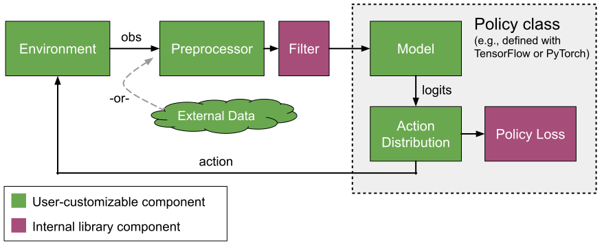
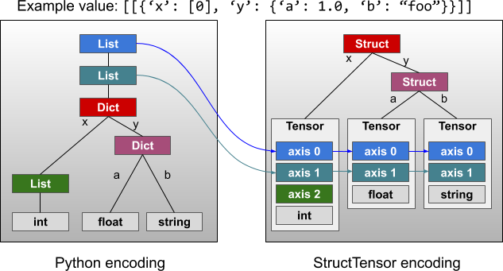

.. include:: /_includes/rllib/announcement.rst

.. include:: /_includes/rllib/we_are_hiring.rst

Models, Preprocessors, and Action Distributions
===============================================

The following diagram provides a conceptual overview of data flow between different components in RLlib.
We start with an ``Environment``, which - given an action - produces an observation.
The observation is preprocessed by a ``Preprocessor`` and ``Filter`` (e.g. for running mean normalization)
before being sent to a neural network ``Model``. The model output is in turn
interpreted by an ``ActionDistribution`` to determine the next action.



The components highlighted in green can be replaced with custom user-defined
implementations, as described in the next sections. The purple components are
RLlib internal, which means they can only be modified by changing the algorithm
source code.

Default Behaviors
-----------------

Built-in Preprocessors
~~~~~~~~~~~~~~~~~~~~~~

RLlib tries to pick one of its built-in preprocessors based on the environment's
observation space. Thereby, the following simple rules apply:

- Discrete observations are one-hot encoded, e.g. ``Discrete(3) and value=1 -> [0, 1, 0]``.

- MultiDiscrete observations are encoded by one-hot encoding each discrete element
  and then concatenating the respective one-hot encoded vectors. 
  e.g. ``MultiDiscrete([3, 4]) and value=[1, 3] -> [0 1 0 0 0 0 1]`` because
  the first ``1`` is encoded as ``[0 1 0]`` and the second ``3`` is encoded as
  ``[0 0 0 1]``; these two vectors are then concatenated to ``[0 1 0 0 0 0 1]``.

- Tuple and Dict observations are flattened, thereby, Discrete and MultiDiscrete
  sub-spaces are handled as described above.
  Also, the original dict/tuple observations are still available inside a) the Model via the input
  dict's "obs" key (the flattened observations are in "obs_flat"), as well as b) the Policy
  via the following line of code (e.g. put this into your loss function to access the original
  observations: ``dict_or_tuple_obs = restore_original_dimensions(input_dict["obs"], self.obs_space, "tf|torch")``

For Atari observation spaces, RLlib defaults to using the `DeepMind preprocessors <https://github.com/ray-project/ray/blob/master/rllib/env/wrappers/atari_wrappers.py>`__
(``preprocessor_pref=deepmind``). However, if the Algorithm's config key ``preprocessor_pref`` is set to "rllib",
the following mappings apply for Atari-type observation spaces:

- Images of shape ``(210, 160, 3)`` are downscaled to ``dim x dim``, where
  ``dim`` is a model config key (see default Model config below). Also, you can set
  ``grayscale=True`` for reducing the color channel to 1, or ``zero_mean=True`` for
  producing -1.0 to 1.0 values (instead of 0.0 to 1.0 values by default).

- Atari RAM observations (1D space of shape ``(128, )``) are zero-averaged
  (values between -1.0 and 1.0).

In all other cases, no preprocessor will be used and the raw observations from the environment
will be sent directly into your model.


Default Model Config Settings
~~~~~~~~~~~~~~~~~~~~~~~~~~~~~

In the following paragraphs, we will first describe RLlib's default behavior for automatically constructing
models (if you don't setup a custom one), then dive into how you can customize your models by changing these
settings or writing your own model classes.

By default, RLlib will use the following config settings for your models.
These include options for the ``FullyConnectedNetworks`` (``fcnet_hiddens`` and ``fcnet_activation``),
``VisionNetworks`` (``conv_filters`` and ``conv_activation``), auto-RNN wrapping, auto-Attention (`GTrXL <https://arxiv.org/abs/1910.06764>`__) wrapping,
and some special options for Atari environments:

.. literalinclude:: ../../../rllib/models/catalog.py
   :language: python
   :start-after: __sphinx_doc_begin__
   :end-before: __sphinx_doc_end__

The dict above (or an overriding sub-set) is handed to the Algorithm via the ``model`` key within
the main config dict like so:

.. code-block:: python

    algo_config = {
        # All model-related settings go into this sub-dict.
        "model": {
            # By default, the MODEL_DEFAULTS dict above will be used.

            # Change individual keys in that dict by overriding them, e.g.
            "fcnet_hiddens": [512, 512, 512],
            "fcnet_activation": "relu",
        },

        # ... other Algorithm config keys, e.g. "lr" ...
        "lr": 0.00001,
    }


Built-in Models
~~~~~~~~~~~~~~~

After preprocessing (if applicable) the raw environment outputs, the processed observations are fed through the policy's model.
In case, no custom model is specified (see further below on how to customize models), RLlib will pick a default model
based on simple heuristics:

- A vision network (`TF <https://github.com/ray-project/ray/blob/master/rllib/models/tf/visionnet.py>`__ or `Torch <https://github.com/ray-project/ray/blob/master/rllib/models/torch/visionnet.py>`__)
  for observations that have a shape of length larger than 2, for example, ``(84 x 84 x 3)``.
- A fully connected network (`TF <https://github.com/ray-project/ray/blob/master/rllib/models/tf/fcnet.py>`__ or `Torch <https://github.com/ray-project/ray/blob/master/rllib/models/torch/fcnet.py>`__)
  for everything else.

These default model types can further be configured via the ``model`` config key inside your Algorithm config (as discussed above).
Available settings are `listed above <#default-model-config-settings>`__ and also documented in the `model catalog file <https://github.com/ray-project/ray/blob/master/rllib/models/catalog.py>`__.

Note that for the vision network case, you'll probably have to configure ``conv_filters``, if your environment observations
have custom sizes. For example, ``"model": {"dim": 42, "conv_filters": [[16, [4, 4], 2], [32, [4, 4], 2], [512, [11, 11], 1]]}`` for 42x42 observations.
Thereby, always make sure that the last Conv2D output has an output shape of ``[B, 1, 1, X]`` (``[B, X, 1, 1]`` for PyTorch), where B=batch and
X=last Conv2D layer's number of filters, so that RLlib can flatten it. An informative error will be thrown if this is not the case.


.. _auto_lstm_and_attention:

Built-in auto-LSTM, and auto-Attention Wrappers
~~~~~~~~~~~~~~~~~~~~~~~~~~~~~~~~~~~~~~~~~~~~~~~

In addition, if you set ``"use_lstm": True`` or ``"use_attention": True`` in your model config,
your model's output will be further processed by an LSTM cell
(`TF <https://github.com/ray-project/ray/blob/master/rllib/models/tf/recurrent_net.py>`__ or `Torch <https://github.com/ray-project/ray/blob/master/rllib/models/torch/recurrent_net.py>`__),
or an attention (`GTrXL <https://arxiv.org/abs/1910.06764>`__) network
(`TF <https://github.com/ray-project/ray/blob/master/rllib/models/tf/attention_net.py>`__ or
`Torch <https://github.com/ray-project/ray/blob/master/rllib/models/torch/attention_net.py>`__), respectively.
More generally, RLlib supports the use of recurrent/attention models for all
its policy-gradient algorithms (A3C, PPO, PG, IMPALA), and the necessary sequence processing support
is built into its policy evaluation utilities.

See above for which additional config keys to use to configure in more detail these two auto-wrappers
(e.g. you can specify the size of the LSTM layer by ``lstm_cell_size`` or the attention dim by ``attention_dim``).

For fully customized RNN/LSTM/Attention-Net setups see the `Recurrent Models <#rnns>`_ and
`Attention Networks/Transformers <#attention>`_ sections below.

.. note::
    It is not possible to use both auto-wrappers (lstm and attention) at the same time. Doing so will create an error.


Customizing Preprocessors and Models
------------------------------------

Custom Preprocessors and Environment Filters
~~~~~~~~~~~~~~~~~~~~~~~~~~~~~~~~~~~~~~~~~~~~

.. warning::

    Custom preprocessors are deprecated, since they sometimes conflict with the built-in preprocessors for handling complex observation spaces.
    Please use `wrapper classes <https://github.com/openai/gym/tree/master/gym/wrappers>`__ around your environment instead of preprocessors.
    Note that the built-in **default** Preprocessors described above will still be used and won't be deprecated.

Instead of using the deprecated custom Preprocessors, you should use ``gym.Wrappers`` to preprocess your environment's output (observations and rewards),
but also your Model's computed actions before sending them back to the environment.

For example, for manipulating your env's observations or rewards, do:

.. code-block:: python

    import gym
    from ray.rllib.utils.numpy import one_hot

    class OneHotEnv(gym.core.ObservationWrapper):
        # Override `observation` to custom process the original observation
        # coming from the env.
        def observation(self, observation):
            # E.g. one-hotting a float obs [0.0, 5.0[.
            return one_hot(observation, depth=5)


    class ClipRewardEnv(gym.core.RewardWrapper):
        def __init__(self, env, min_, max_):
            super().__init__(env)
            self.min = min_
            self.max = max_

        # Override `reward` to custom process the original reward coming
        # from the env.
        def reward(self, reward):
            # E.g. simple clipping between min and max.
            return np.clip(reward, self.min, self.max)


Custom Models: Implementing your own Forward Logic
~~~~~~~~~~~~~~~~~~~~~~~~~~~~~~~~~~~~~~~~~~~~~~~~~~

If you would like to provide your own model logic (instead of using RLlib's built-in defaults), you
can sub-class either ``TFModelV2`` (for TensorFlow) or ``TorchModelV2`` (for PyTorch) and then
register and specify your sub-class in the config as follows:

.. _tensorflow-models:

Custom TensorFlow Models
````````````````````````

Custom TensorFlow models should subclass `TFModelV2 <https://github.com/ray-project/ray/blob/master/rllib/models/tf/tf_modelv2.py>`__ and implement the ``__init__()`` and ``forward()`` methods.
``forward()`` takes a dict of tensor inputs (mapping str to Tensor types), whose keys and values depend on
the `view requirements <rllib-sample-collection.html>`__ of the model.
Normally, this input dict contains only the current observation ``obs`` and an ``is_training`` boolean flag, as well as an optional list of RNN states.
``forward()`` should return the model output (of size ``self.num_outputs``) and - if applicable - a new list of internal
states (in case of RNNs or attention nets). You can also override extra methods of the model such as ``value_function`` to implement
a custom value branch.

Additional supervised/self-supervised losses can be added via the ``TFModelV2.custom_loss`` method:

.. autoclass:: ray.rllib.models.tf.tf_modelv2.TFModelV2
    :members:
    :noindex:

Once implemented, your TF model can then be registered and used in place of a built-in default one:

.. code-block:: python

    import ray
    import ray.rllib.algorithms.ppo as ppo
    from ray.rllib.models import ModelCatalog
    from ray.rllib.models.tf.tf_modelv2 import TFModelV2

    class MyModelClass(TFModelV2):
        def __init__(self, obs_space, action_space, num_outputs, model_config, name): ...
        def forward(self, input_dict, state, seq_lens): ...
        def value_function(self): ...

    ModelCatalog.register_custom_model("my_tf_model", MyModelClass)

    ray.init()
    algo = ppo.PPO(env="CartPole-v0", config={
        "model": {
            "custom_model": "my_tf_model",
            # Extra kwargs to be passed to your model's c'tor.
            "custom_model_config": {},
        },
    })

See the `keras model example <https://github.com/ray-project/ray/blob/master/rllib/examples/custom_keras_model.py>`__ for a full example of a TF custom model.

More examples and explanations on how to implement custom Tuple/Dict processing models
(also check out `this test case here <https://github.com/ray-project/ray/blob/master/rllib/tests/test_nested_observation_spaces.py>`__),
custom RNNs, custom model APIs (on top of default models) follow further below.

.. _torch-models:

Custom PyTorch Models
`````````````````````

Similarly, you can create and register custom PyTorch models by subclassing
`TorchModelV2 <https://github.com/ray-project/ray/blob/master/rllib/models/torch/torch_modelv2.py>`__ and implement the ``__init__()`` and ``forward()`` methods.
``forward()`` takes a dict of tensor inputs (mapping str to PyTorch tensor types), whose keys and values depend on
the `view requirements <rllib-sample-collection.html>`__ of the model.
Usually, the dict contains only the current observation ``obs`` and an ``is_training`` boolean flag, as well as an optional list of RNN states.
``forward()`` should return the model output (of size ``self.num_outputs``) and - if applicable - a new list of internal
states (in case of RNNs or attention nets). You can also override extra methods of the model such as ``value_function`` to implement
a custom value branch.

Additional supervised/self-supervised losses can be added via the ``TorchModelV2.custom_loss`` method:

See these examples of `fully connected <https://github.com/ray-project/ray/blob/master/rllib/models/torch/fcnet.py>`__, `convolutional <https://github.com/ray-project/ray/blob/master/rllib/models/torch/visionnet.py>`__, and `recurrent <https://github.com/ray-project/ray/blob/master/rllib/models/torch/recurrent_net.py>`__ torch models.

.. autoclass:: ray.rllib.models.torch.torch_modelv2.TorchModelV2
    :members:
    :noindex:

Once implemented, your PyTorch model can then be registered and used in place of a built-in model:

.. code-block:: python

    import torch.nn as nn

    import ray
    from ray.rllib.algorithms import ppo
    from ray.rllib.models import ModelCatalog
    from ray.rllib.models.torch.torch_modelv2 import TorchModelV2

    class CustomTorchModel(TorchModelV2):
        def __init__(self, obs_space, action_space, num_outputs, model_config, name): ...
        def forward(self, input_dict, state, seq_lens): ...
        def value_function(self): ...

    ModelCatalog.register_custom_model("my_torch_model", CustomTorchModel)

    ray.init()
    algo = ppo.PPO(env="CartPole-v0", config={
        "framework": "torch",
        "model": {
            "custom_model": "my_torch_model",
            # Extra kwargs to be passed to your model's c'tor.
            "custom_model_config": {},
        },
    })

See the `torch model examples <https://github.com/ray-project/ray/blob/master/rllib/examples/models/>`__ for various examples on how to build a custom
PyTorch model (including recurrent ones).

More examples and explanations on how to implement custom Tuple/Dict processing models (also check out `this test case here <https://github.com/ray-project/ray/blob/master/rllib/tests/test_nested_observation_spaces.py>`__),
custom RNNs, custom model APIs (on top of default models) follow further below.


Wrapping a Custom Model (TF and PyTorch) with an LSTM- or Attention Net
```````````````````````````````````````````````````````````````````````

You can also use a custom (TF or PyTorch) model with our auto-wrappers for LSTMs (``use_lstm=True``) or Attention networks (``use_attention=True``).
For example, if you would like to wrap some non-default model logic with an LSTM, simply do:

.. literalinclude:: ../../../rllib/examples/lstm_auto_wrapping.py
   :language: python
   :start-after: __sphinx_doc_begin__
   :end-before: __sphinx_doc_end__


.. _rnns:

Implementing custom Recurrent Networks
``````````````````````````````````````

Instead of using the ``use_lstm: True`` option, it may be preferable to use a custom recurrent model.
This provides more control over postprocessing the LSTM's output and can also allow the use of multiple LSTM cells to process different portions of the input.
For an RNN model it is recommended to subclass ``RecurrentNetwork`` (either the `TF <https://github.com/ray-project/ray/blob/master/rllib/models/tf/recurrent_net.py>`__
or `PyTorch <https://github.com/ray-project/ray/blob/master/rllib/models/torch/recurrent_net.py>`__ versions) and then implement ``__init__()``,
``get_initial_state()``, and ``forward_rnn()``.

.. autoclass:: ray.rllib.models.tf.recurrent_net.RecurrentNetwork

    .. automethod:: __init__
    .. automethod:: get_initial_state
    .. automethod:: forward_rnn

Note that the ``inputs`` arg entering ``forward_rnn`` is already a time-ranked single tensor (not an ``input_dict``!) with shape ``(B x T x ...)``.
If you further want to customize and need more direct access to the complete (non time-ranked) ``input_dict``, you can also override
your Model's ``forward`` method directly (as you would do with a non-RNN ModelV2). In that case, though, you are responsible for changing your inputs
and add the time rank to the incoming data (usually you just have to reshape).

You can check out the `rnn_model.py <https://github.com/ray-project/ray/blob/master/rllib/examples/models/rnn_model.py>`__ models as examples to implement
your own (either TF or Torch).


.. _attention:

Implementing custom Attention Networks
``````````````````````````````````````

Similar to the RNN case described above, you could also implement your own attention-based networks, instead of using the
``use_attention: True`` flag in your model config.

Check out RLlib's `GTrXL (Attention Net) <https://arxiv.org/abs/1910.06764>`__ implementations
(for `TF <https://github.com/ray-project/ray/blob/master/rllib/models/tf/attention_net.py>`__ and `PyTorch <https://github.com/ray-project/ray/blob/master/rllib/models/torch/attention_net.py>`__)
to get a better idea on how to write your own models of this type. These are the models we use
as wrappers when ``use_attention=True``.

You can run `this example script <https://github.com/ray-project/ray/blob/master/rllib/examples/attention_net.py>`__ to run these nets within some of our algorithms.
`There is also a test case <https://github.com/ray-project/ray/blob/master/rllib/models/tests/test_attention_nets.py>`__, which confirms their learning capabilities in PPO and IMPALA.

Batch Normalization
```````````````````

You can use ``tf.layers.batch_normalization(x, training=input_dict["is_training"])`` to add batch norm layers to your custom model
(see a `code example here <https://github.com/ray-project/ray/blob/master/rllib/examples/batch_norm_model.py>`__).
RLlib will automatically run the update ops for the batch norm layers during optimization
(see `tf_policy.py <https://github.com/ray-project/ray/blob/master/rllib/policy/tf_policy.py>`__ and
`multi_gpu_impl.py <https://github.com/ray-project/ray/blob/master/rllib/execution/multi_gpu_impl.py>`__ for the exact handling of these updates).

In case RLlib does not properly detect the update ops for your custom model, you can override the ``update_ops()`` method to return the list of ops to run for updates.


Custom Model APIs (on Top of Default- or Custom Models)
```````````````````````````````````````````````````````

So far we talked about a) the default models that are built into RLlib and are being provided
automatically if you don't specify anything in your Algorithm's config and b) custom Models through
which you can define any arbitrary forward passes.

Another typical situation in which you would have to customize a model would be to
add a new API that your algorithm needs in order to learn, for example a Q-value
calculating head on top of your policy model. In order to expand a Model's API, simply
define and implement a new method (e.g. ``get_q_values()``) in your TF- or TorchModelV2 sub-class.

You can now wrap this new API either around RLlib's default models or around
your custom (``forward()``-overriding) model classes. Here are two examples that illustrate how to do this:

**The Q-head API: Adding a dueling layer on top of a default RLlib model**.

The following code adds a ``get_q_values()`` method to the automatically chosen
default Model (e.g. a ``FullyConnectedNetwork`` if the observation space is a 1D Box
or Discrete):

.. literalinclude:: ../../../rllib/examples/models/custom_model_api.py
   :language: python
   :start-after: __sphinx_doc_model_api_1_begin__
   :end-before: __sphinx_doc_model_api_1_end__

Now, for your algorithm that needs to have this model API to work properly (e.g. DQN),
you use this following code to construct the complete final Model using the
``ModelCatalog.get_model_v2`` factory function (`code here <https://github.com/ray-project/ray/blob/master/rllib/models/catalog.py>`__):

.. literalinclude:: ../../../rllib/examples/custom_model_api.py
   :language: python
   :start-after: __sphinx_doc_model_construct_1_begin__
   :end-before: __sphinx_doc_model_construct_1_end__

With the model object constructed above, you can get the underlying intermediate output (before the dueling head)
by calling ``my_dueling_model`` directly (``out = my_dueling_model([input_dict])``), and then passing ``out`` into
your custom ``get_q_values`` method: ``q_values = my_dueling_model.get_q_values(out)``.


**The single Q-value API for SAC**.

Our DQN model from above takes an observation and outputs one Q-value per (discrete) action.
Continuous SAC - on the other hand - uses Models that calculate one Q-value only
for a single (**continuous**) action, given an observation and that particular action.

Let's take a look at how we would construct this API and wrap it around a custom model:

.. literalinclude:: ../../../rllib/examples/models/custom_model_api.py
   :language: python
   :start-after: __sphinx_doc_model_api_2_begin__
   :end-before: __sphinx_doc_model_api_2_end__

Now, for your algorithm that needs to have this model API to work properly (e.g. SAC),
you use this following code to construct the complete final Model using the
``ModelCatalog.get_model_v2`` factory function (`code here <https://github.com/ray-project/ray/blob/master/rllib/models/catalog.py>`__):

.. literalinclude:: ../../../rllib/examples/custom_model_api.py
   :language: python
   :start-after: __sphinx_doc_model_construct_2_begin__
   :end-before: __sphinx_doc_model_construct_2_end__

With the model object constructed above, you can get the underlying intermediate output (before the q-head)
by calling ``my_cont_action_q_model`` directly (``out = my_cont_action_q_model([input_dict])``), and then passing ``out``
and some action into your custom ``get_single_q_value`` method:
``q_value = my_cont_action_q_model.get_signle_q_value(out, action)``.


More examples for Building Custom Models
````````````````````````````````````````

**A multi-input capable model for Tuple observation spaces (for PPO)**

RLlib's default preprocessor for Tuple and Dict spaces is to flatten incoming observations
into one flat **1D** array, and then pick a fully connected network (by default) to
process this flattened vector. This is usually ok, if you have only 1D Box or
Discrete/MultiDiscrete sub-spaces in your observations.

However, what if you had a complex observation space with one or more image components in
it (besides 1D Boxes and discrete spaces). You would probably want to preprocess each of the
image components using some convolutional network, and then concatenate their outputs
with the remaining non-image (flat) inputs (the 1D Box and discrete/one-hot components).

Take a look at this model example that does exactly that:

.. literalinclude:: ../../../rllib/models/tf/complex_input_net.py
   :language: python
   :start-after: __sphinx_doc_begin__
   :end-before: __sphinx_doc_end__


**Using the Trajectory View API: Passing in the last n actions (or rewards or observations) as inputs to a custom Model**

It is sometimes helpful for learning not only to look at the current observation
in order to calculate the next action, but also at the past n observations.
In other cases, you may want to provide the most recent rewards or actions to the model as well
(like our LSTM wrapper does if you specify: ``use_lstm=True`` and ``lstm_use_prev_action/reward=True``).
All this may even be useful when not working with partially observable environments (PO-MDPs)
and/or RNN/Attention models, as for example in classic Atari runs, where we usually use framestacking of
the last four observed images.

The `trajectory view API <rllib-sample-collection.html#trajectory-view-api>`__ allows your models
to specify these more complex "view requirements".

Here is a simple (non-RNN/Attention) example of a Model that takes as input
the last 3 observations (very similar to the recommended "framestacking" for
learning in Atari environments):

.. literalinclude:: ../../../rllib/examples/models/trajectory_view_utilizing_models.py
   :language: python
   :start-after: __sphinx_doc_begin__
   :end-before: __sphinx_doc_end__

A PyTorch version of the above model is also `given in the same file <https://github.com/ray-project/ray/blob/master/rllib/examples/models/trajectory_view_utilizing_models.py>`__.


Custom Action Distributions
---------------------------

Similar to custom models and preprocessors, you can also specify a custom action distribution class as follows. The action dist class is passed a reference to the ``model``, which you can use to access ``model.model_config`` or other attributes of the model. This is commonly used to implement `autoregressive action outputs <#autoregressive-action-distributions>`__.

.. code-block:: python

    import ray
    import ray.rllib.algorithms.ppo as ppo
    from ray.rllib.models import ModelCatalog
    from ray.rllib.models.preprocessors import Preprocessor

    class MyActionDist(ActionDistribution):
        @staticmethod
        def required_model_output_shape(action_space, model_config):
            return 7  # controls model output feature vector size

        def __init__(self, inputs, model):
            super(MyActionDist, self).__init__(inputs, model)
            assert model.num_outputs == 7

        def sample(self): ...
        def logp(self, actions): ...
        def entropy(self): ...

    ModelCatalog.register_custom_action_dist("my_dist", MyActionDist)

    ray.init()
    algo = ppo.PPO(env="CartPole-v0", config={
        "model": {
            "custom_action_dist": "my_dist",
        },
    })

Supervised Model Losses
-----------------------

You can mix supervised losses into any RLlib algorithm through custom models. For example, you can add an imitation learning loss on expert experiences, or a self-supervised autoencoder loss within the model. These losses can be defined over either policy evaluation inputs, or data read from `offline storage <rllib-offline.html#input-pipeline-for-supervised-losses>`__.

**TensorFlow**: To add a supervised loss to a custom TF model, you need to override the ``custom_loss()`` method. This method takes in the existing policy loss for the algorithm, which you can add your own supervised loss to before returning. For debugging, you can also return a dictionary of scalar tensors in the ``metrics()`` method. Here is a `runnable example <https://github.com/ray-project/ray/blob/master/rllib/examples/custom_loss.py>`__ of adding an imitation loss to CartPole training that is defined over a `offline dataset <rllib-offline.html#input-pipeline-for-supervised-losses>`__.

**PyTorch**: There is no explicit API for adding losses to custom torch models. However, you can modify the loss in the policy definition directly. Like for TF models, offline datasets can be incorporated by creating an input reader and calling ``reader.next()`` in the loss forward pass.

Self-Supervised Model Losses
----------------------------

You can also use the ``custom_loss()`` API to add in self-supervised losses such as VAE reconstruction loss and L2-regularization.

Variable-length / Complex Observation Spaces
--------------------------------------------

RLlib supports complex and variable-length observation spaces, including ``gym.spaces.Tuple``, ``gym.spaces.Dict``, and ``rllib.utils.spaces.Repeated``. The handling of these spaces is transparent to the user. RLlib internally will insert preprocessors to insert padding for repeated elements, flatten complex observations into a fixed-size vector during transit, and unpack the vector into the structured tensor before sending it to the model. The flattened observation is available to the model as ``input_dict["obs_flat"]``, and the unpacked observation as ``input_dict["obs"]``.

To enable batching of struct observations, RLlib unpacks them in a `StructTensor-like format <https://github.com/tensorflow/community/blob/master/rfcs/20190910-struct-tensor.md>`__. In summary, repeated fields are "pushed down" and become the outer dimensions of tensor batches, as illustrated in this figure from the StructTensor RFC.



For further information about complex observation spaces, see:
  * A custom environment and model that uses `repeated struct fields <https://github.com/ray-project/ray/blob/master/rllib/examples/complex_struct_space.py>`__.
  * The pydoc of the `Repeated space <https://github.com/ray-project/ray/blob/master/rllib/utils/spaces/repeated.py>`__.
  * The pydoc of the batched `repeated values tensor <https://github.com/ray-project/ray/blob/master/rllib/models/repeated_values.py>`__.
  * The `unit tests <https://github.com/ray-project/ray/blob/master/rllib/tests/test_nested_observation_spaces.py>`__ for Tuple and Dict spaces.

Variable-length / Parametric Action Spaces
------------------------------------------

Custom models can be used to work with environments where (1) the set of valid actions `varies per step <https://neuro.cs.ut.ee/the-use-of-embeddings-in-openai-five>`__, and/or (2) the number of valid actions is `very large <https://arxiv.org/abs/1811.00260>`__. The general idea is that the meaning of actions can be completely conditioned on the observation, i.e., the ``a`` in ``Q(s, a)`` becomes just a token in ``[0, MAX_AVAIL_ACTIONS)`` that only has meaning in the context of ``s``. This works with algorithms in the `DQN and policy-gradient families <rllib-env.html>`__ and can be implemented as follows:

1. The environment should return a mask and/or list of valid action embeddings as part of the observation for each step. To enable batching, the number of actions can be allowed to vary from 1 to some max number:

.. code-block:: python

   class MyParamActionEnv(gym.Env):
       def __init__(self, max_avail_actions):
           self.action_space = Discrete(max_avail_actions)
           self.observation_space = Dict({
               "action_mask": Box(0, 1, shape=(max_avail_actions, )),
               "avail_actions": Box(-1, 1, shape=(max_avail_actions, action_embedding_sz)),
               "real_obs": ...,
           })

2. A custom model can be defined that can interpret the ``action_mask`` and ``avail_actions`` portions of the observation. Here the model computes the action logits via the dot product of some network output and each action embedding. Invalid actions can be masked out of the softmax by scaling the probability to zero:

.. code-block:: python

    class ParametricActionsModel(TFModelV2):
        def __init__(self,
                     obs_space,
                     action_space,
                     num_outputs,
                     model_config,
                     name,
                     true_obs_shape=(4,),
                     action_embed_size=2):
            super(ParametricActionsModel, self).__init__(
                obs_space, action_space, num_outputs, model_config, name)
            self.action_embed_model = FullyConnectedNetwork(...)

        def forward(self, input_dict, state, seq_lens):
            # Extract the available actions tensor from the observation.
            avail_actions = input_dict["obs"]["avail_actions"]
            action_mask = input_dict["obs"]["action_mask"]

            # Compute the predicted action embedding
            action_embed, _ = self.action_embed_model({
                "obs": input_dict["obs"]["cart"]
            })

            # Expand the model output to [BATCH, 1, EMBED_SIZE]. Note that the
            # avail actions tensor is of shape [BATCH, MAX_ACTIONS, EMBED_SIZE].
            intent_vector = tf.expand_dims(action_embed, 1)

            # Batch dot product => shape of logits is [BATCH, MAX_ACTIONS].
            action_logits = tf.reduce_sum(avail_actions * intent_vector, axis=2)

            # Mask out invalid actions (use tf.float32.min for stability)
            inf_mask = tf.maximum(tf.log(action_mask), tf.float32.min)
            return action_logits + inf_mask, state


Depending on your use case it may make sense to use just the masking, just action embeddings, or both. For a runnable example of this in code, check out `parametric_actions_cartpole.py <https://github.com/ray-project/ray/blob/master/rllib/examples/parametric_actions_cartpole.py>`__. Note that since masking introduces ``tf.float32.min`` values into the model output, this technique might not work with all algorithm options. For example, algorithms might crash if they incorrectly process the ``tf.float32.min`` values. The cartpole example has working configurations for DQN (must set ``hiddens=[]``), PPO (must disable running mean and set ``model.vf_share_layers=True``), and several other algorithms. Not all algorithms support parametric actions; see the `algorithm overview <rllib-algorithms.html#available-algorithms-overview>`__.


Autoregressive Action Distributions
-----------------------------------

In an action space with multiple components (e.g., ``Tuple(a1, a2)``), you might want ``a2`` to be conditioned on the sampled value of ``a1``, i.e., ``a2_sampled ~ P(a2 | a1_sampled, obs)``. Normally, ``a1`` and ``a2`` would be sampled independently, reducing the expressivity of the policy.

To do this, you need both a custom model that implements the autoregressive pattern, and a custom action distribution class that leverages that model. The `autoregressive_action_dist.py <https://github.com/ray-project/ray/blob/master/rllib/examples/autoregressive_action_dist.py>`__ example shows how this can be implemented for a simple binary action space. For a more complex space, a more efficient architecture such as a `MADE <https://arxiv.org/abs/1502.03509>`__ is recommended. Note that sampling a `N-part` action requires `N` forward passes through the model, however computing the log probability of an action can be done in one pass:

.. code-block:: python

    class BinaryAutoregressiveOutput(ActionDistribution):
        """Action distribution P(a1, a2) = P(a1) * P(a2 | a1)"""

        @staticmethod
        def required_model_output_shape(self, model_config):
            return 16  # controls model output feature vector size

        def sample(self):
            # first, sample a1
            a1_dist = self._a1_distribution()
            a1 = a1_dist.sample()

            # sample a2 conditioned on a1
            a2_dist = self._a2_distribution(a1)
            a2 = a2_dist.sample()

            # return the action tuple
            return TupleActions([a1, a2])

        def logp(self, actions):
            a1, a2 = actions[:, 0], actions[:, 1]
            a1_vec = tf.expand_dims(tf.cast(a1, tf.float32), 1)
            a1_logits, a2_logits = self.model.action_model([self.inputs, a1_vec])
            return (Categorical(a1_logits, None).logp(a1) + Categorical(
                a2_logits, None).logp(a2))

        def _a1_distribution(self):
            BATCH = tf.shape(self.inputs)[0]
            a1_logits, _ = self.model.action_model(
                [self.inputs, tf.zeros((BATCH, 1))])
            a1_dist = Categorical(a1_logits, None)
            return a1_dist

        def _a2_distribution(self, a1):
            a1_vec = tf.expand_dims(tf.cast(a1, tf.float32), 1)
            _, a2_logits = self.model.action_model([self.inputs, a1_vec])
            a2_dist = Categorical(a2_logits, None)
            return a2_dist

    class AutoregressiveActionsModel(TFModelV2):
        """Implements the `.action_model` branch required above."""

        def __init__(self, obs_space, action_space, num_outputs, model_config,
                     name):
            super(AutoregressiveActionsModel, self).__init__(
                obs_space, action_space, num_outputs, model_config, name)
            if action_space != Tuple([Discrete(2), Discrete(2)]):
                raise ValueError(
                    "This model only supports the [2, 2] action space")

            # Inputs
            obs_input = tf.keras.layers.Input(
                shape=obs_space.shape, name="obs_input")
            a1_input = tf.keras.layers.Input(shape=(1, ), name="a1_input")
            ctx_input = tf.keras.layers.Input(
                shape=(num_outputs, ), name="ctx_input")

            # Output of the model (normally 'logits', but for an autoregressive
            # dist this is more like a context/feature layer encoding the obs)
            context = tf.keras.layers.Dense(
                num_outputs,
                name="hidden",
                activation=tf.nn.tanh,
                kernel_initializer=normc_initializer(1.0))(obs_input)

            # P(a1 | obs)
            a1_logits = tf.keras.layers.Dense(
                2,
                name="a1_logits",
                activation=None,
                kernel_initializer=normc_initializer(0.01))(ctx_input)

            # P(a2 | a1)
            # --note: typically you'd want to implement P(a2 | a1, obs) as follows:
            # a2_context = tf.keras.layers.Concatenate(axis=1)(
            #     [ctx_input, a1_input])
            a2_context = a1_input
            a2_hidden = tf.keras.layers.Dense(
                16,
                name="a2_hidden",
                activation=tf.nn.tanh,
                kernel_initializer=normc_initializer(1.0))(a2_context)
            a2_logits = tf.keras.layers.Dense(
                2,
                name="a2_logits",
                activation=None,
                kernel_initializer=normc_initializer(0.01))(a2_hidden)

            # Base layers
            self.base_model = tf.keras.Model(obs_input, context)
            self.register_variables(self.base_model.variables)
            self.base_model.summary()

            # Autoregressive action sampler
            self.action_model = tf.keras.Model([ctx_input, a1_input],
                                               [a1_logits, a2_logits])
            self.action_model.summary()
            self.register_variables(self.action_model.variables)


.. note::

   Not all algorithms support autoregressive action distributions; see the `algorithm overview table <rllib-algorithms.html#available-algorithms-overview>`__ for more information.

.. include:: /_includes/rllib/announcement_bottom.rst
