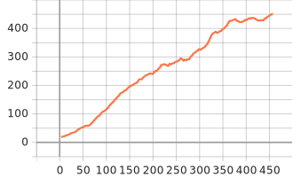
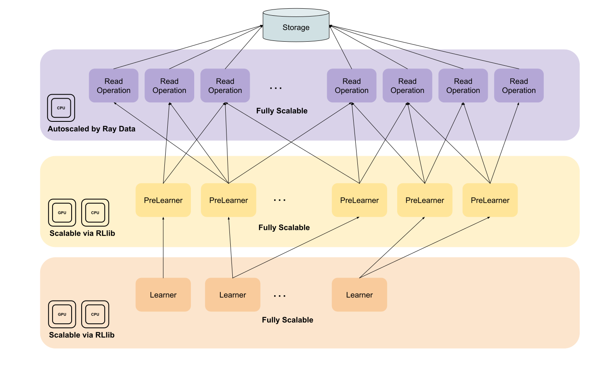
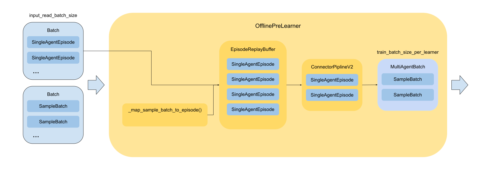

.. include:: /_includes/rllib/we_are_hiring.rst

Working with offline data
=========================

.. include:: /_includes/rllib/new_api_stack.rst

RLlib's offline RL API enables you to work with experiences read from offline storage (for example, disk, cloud storage,
streaming systems, Hadoop Distributed File System (HDFS). For example, you might want to read experiences saved from previous training runs, collected
from experts, or gathered from policies deployed in `web applications <https://arxiv.org/abs/1811.00260>`__. You can
also log new agent experiences produced during online training for future use.

RLlib represents trajectory sequences (for example, ``(s, a, r, s', ...)`` tuples) with :py:class:`~ray.rllib.env.single_agent_episode.SingleAgentEpisode`
objects (multi-agent offline training is currently not supported). Using this episode format
allows for efficient encoding and compression of experiences, rewriting trajectories, and user-friendly data access through getter methods.
During online training, RLlib uses :py:class:`~ray.rllib.env.single_agent_env_runner.SingleAgentEnvRunner` actors to generate episodes of experiences
in parallel using the current policy. However, RLlib uses this same episode format for reading experiences from and writing experiences to offline storage (see :py:class:`~ray.rllib.offline.offline_env_runner.OfflineSingleAgentEnvRunner`).

You can store experiences either directly in RLlib's episode format or in table (columns)
format. You should use the episode format when

#. You need experiences grouped by their trajectory and ordered in time (for example, to train stateful modules).
#. You want to use recorded experiences exclusively within RLlib (for example for offline RL or behavior cloning).

Contrary, you should prefer the table (columns) format, if

#. You need to read the data easily with other data tools or ML libraries.

.. note:: RLlib's new API stack incorporates principles that support standalone applications. Consequently, the
    :py:class:`~ray.rllib.env.single_agent_episode.SingleAgentEpisode` class is usable outside of an RLlib context. To enable faster
    access through external data tools (for example, for data transformations), it's recommended to use the table record format.

Most importantly, RLlib's offline RL API builds on top of :ref:`Ray Data <data>` and therefore features in general all read and
write methods supported by Ray Data (for example :py:class:`~ray.data.read_parquet`, :py:class:`~ray.data.read_json`, etc.) with
:py:class:`~ray.data.read_parquet` and :py:class:`~ray.data.Dataset.write_parquet` being the default read and write methods. A core design principle
of the API is to apply as many data transformations as possible on-the-fly prior to engaging the learner, allowing the latter to focus exclusively on model updates.

.. hint:: During the transition phase from old- to new API stack you can use the new offline RL API also with your
    :py:class:`~ray.rllib.policy.sample_batch.SampleBatch` data recorded with the old API stack. To enable this feature set
    ``config.offline_data(input_read_sample_batches=True)``.

Example: Training an expert policy
----------------------------------
In this example you train a PPO agent on the ``CartPole-v1`` environment until it reaches an episode mean return of ``450.0``. You checkpoint
this agent and then use its policy to record expert data to local disk.

.. testsetup::

    # Define a shared variable to store the path to the
    # best checkpoint.
    best_checkpoint = None

    # Define a shared variable to store the path to the
    # recorded data.
    data_path = None

    # Define another shared variable to store the path to
    # the tabular recording data.
    tabular_data_path = None

.. code-block::

    from ray.rllib.algorithms.ppo import PPOConfig
    from ray.rllib.core.rl_module.default_model_config import DefaultModelConfig
    from ray.rllib.utils.metrics import (
        ENV_RUNNER_RESULTS,
        EVALUATION_RESULTS,
        EPISODE_RETURN_MEAN,
    )
    from ray import tune

    # Configure the PPO algorithm.
    config = (
        PPOConfig()
        .environment("CartPole-v1")
        .training(
            lr=0.0003,
            # Run 6 SGD minibatch iterations on a batch.
            num_epochs=6,
            # Weigh the value function loss smaller than
            # the policy loss.
            vf_loss_coeff=0.01,
        )
        .rl_module(
            model_config=DefaultModelConfig(
                fcnet_hiddens=[32],
                fcnet_activation="linear",
                # Share encoder layers between value network
                # and policy.
                vf_share_layers=True,
            ),
        )
    )

    # Define the metric to use for stopping.
    metric = f"{EVALUATION_RESULTS}/{ENV_RUNNER_RESULTS}/{EPISODE_RETURN_MEAN}"

    # Define the Tuner.
    tuner = tune.Tuner(
        "PPO",
        param_space=config,
        run_config=tune.RunConfig(
            stop={
                metric: 450.0,
            },
            name="docs_rllib_offline_pretrain_ppo",
            verbose=2,
            checkpoint_config=tune.CheckpointConfig(
                checkpoint_frequency=1,
                checkpoint_at_end=True,
            ),
        ),
    )
    results = tuner.fit()

    # Store the best checkpoint to use it later for recording
    # an expert policy.
    best_checkpoint = (
        results
        .get_best_result(
            metric=metric,
            mode="max"
        )
        .checkpoint.path
    )

In this example, you saved a checkpoint from an agent that has become an expert at playing ``CartPole-v1``.  You use this checkpoint in the next
example to record expert data to disk, which is later utilized for offline training to clone another agent.

Example: Record expert data to local disk
-----------------------------------------
After you train an expert policy to play `CartPole-v1` you load its policy here to record expert data during evaluation. You use ``5``
:py:class:`~ray.rllib.offline.offline_env_runner.OfflineSingleAgentEnvRunner` instances to collect ``50`` complete episodes per `sample()` call. In this
example you store experiences directly in RLlib's :py:class:`~ray.rllib.env.single_agent_episode.SingleAgentEpisode` objects with no more than
``25`` episode objects per Parquet file. Altogether you run 10 evaluation runs, which should result in ``500`` recorded episodes from the expert policy.
You use these data in the next example to train a new policy through Offline RL that should reach a return of ``450.0`` when playing ``CartPole-v1``.

.. code-block:: python

    from ray.rllib.algorithms.ppo import PPOConfig
    from ray.rllib.core import (
        COMPONENT_LEARNER_GROUP,
        COMPONENT_LEARNER,
        COMPONENT_RL_MODULE,
        DEFAULT_MODULE_ID,
    )
    from ray.rllib.core.rl_module import RLModuleSpec

    # Store recording data under the following path.
    data_path = "/tmp/docs_rllib_offline_recording"

    # Configure the algorithm for recording.
    config = (
        PPOConfig()
        # The environment needs to be specified.
        .environment(
            env="CartPole-v1",
        )
        # Make sure to sample complete episodes because
        # you want to record RLlib's episode objects.
        .env_runners(
            batch_mode="complete_episodes",
        )
        # Set up 5 evaluation `EnvRunners` for recording.
        # Sample 50 episodes in each evaluation rollout.
        .evaluation(
            evaluation_num_env_runners=5,
            evaluation_duration=50,
            evaluation_duration_unit="episodes",
        )
        # Use the checkpointed expert policy from the preceding PPO training.
        # Note, we have to use the same `model_config` as
        # the one with which the expert policy was trained, otherwise
        # the module state can't be loaded.
        .rl_module(
            model_config=DefaultModelConfig(
                fcnet_hiddens=[32],
                fcnet_activation="linear",
                # Share encoder layers between value network
                # and policy.
                vf_share_layers=True,
            ),
        )
        # Define the output path and format. In this example you
        # want to store data directly in RLlib's episode objects.
        # Each Parquet file should hold no more than 25 episodes.
        .offline_data(
            output=data_path,
            output_write_episodes=True,
            output_max_rows_per_file=25,
        )
    )

    # Build the algorithm.
    algo = config.build()
    # Load now the PPO-trained `RLModule` to use in recording.
    algo.restore_from_path(
        best_checkpoint,
        # Load only the `RLModule` component here.
        component=COMPONENT_RL_MODULE,
    )

    # Run 10 evaluation iterations and record the data.
    for i in range(10):
        print(f"Iteration {i + 1}")
        eval_results = algo.evaluate()
        print(eval_results)

    # Stop the algorithm. Note, this is important for when
    # defining `output_max_rows_per_file`. Otherwise,
    # remaining episodes in the `EnvRunner`s buffer isn't written to disk.
    algo.stop()

.. note:: RLlib formats The stored episode data as ``binary``. Each episode is converted into its dictionary representation and serialized using ``msgpack-numpy``,
    ensuring version compatibility.

RLlib's  recording process is efficient because it utilizes multiple :py:class:`~ray.rllib.offline.offline_env_runner.OfflineSingleAgentEnvRunner` instances during
evaluation, enabling parallel data writing. You can explore the folder to review the stored Parquet data:

.. code-block:: text

    $ ls -la /tmp/docs_rllib_offline_recording/cartpole-v1

    drwxr-xr-x. 22 user user 440 21. Nov 17:23 .
    drwxr-xr-x.  3 user user  60 21. Nov 17:23 ..
    drwxr-xr-x.  2 user user 540 21. Nov 17:23 run-000001-00004
    drwxr-xr-x.  2 user user 540 21. Nov 17:23 run-000001-00009
    drwxr-xr-x.  2 user user 540 21. Nov 17:23 run-000001-00012
    drwxr-xr-x.  2 user user 540 21. Nov 17:23 run-000001-00016
    drwxr-xr-x.  2 user user 540 21. Nov 17:23 run-000002-00004
    drwxr-xr-x.  2 user user 540 21. Nov 17:23 run-000002-00007

.. hint:: RLlib stores records under a folder named by the RL environment. Therein, you see one folder of Parquet files for each :py:class:`~ray.rllib.offline.offline_env_runner.OfflineSingleAgentEnvRunner`
    and write operation. The write operation count is given in the second numbering. For example: above, env-runner 1 has sampled 25 episodes at
    its 4th :py:meth:`~ray.rllib.offline.offline_env_runner.OfflineSingleAgentEnvRunner.sample` call and writes then (because ``output_max_rows_per_file=25``) all sampled episodes
    to disk into file ``run-000001-00004``.

.. note:: The number of write operations per worker may vary because policy rollouts aren't evenly distributed. Faster workers collect more episodes,
    leading to differences in write operation counts. As a result, the second numbering may differ across files generated by different env-runner instances.

Example: Training on previously saved experiences
-------------------------------------------------
In this example you are using behavior cloning with the previously recorded Parquet data from your expert policy playing ``CartPole-v1``. The
data needs to be linked in the configuration of the algorithm (through the ``input_`` attribute).

.. code-block:: python

    from ray import tune
    from ray.rllib.algorithms.bc import BCConfig

    # Setup the config for behavior cloning.
    config = (
        BCConfig()
        .environment(
            # Use the `CartPole-v1` environment from which the
            # data was recorded. This is merely for receiving
            # action and observation spaces and to use it during
            # evaluation.
            env="CartPole-v1",
        )
        .learners(
            # Use a single learner.
            num_learners=0,
        )
        .training(
            # This has to be defined in the new offline RL API.
            train_batch_size_per_learner=1024,
        )
        .offline_data(
            # Link the data.
            input_=[data_path],
            # You want to read in RLlib's episode format b/c this
            # is how you recorded data.
            input_read_episodes=True,
            # Read smaller batches from the data than the learner
            # trains on. Note, each batch element is an episode
            # with multiple timesteps.
            input_read_batch_size=512,
            # Create exactly 2 `DataWorkers` that transform
            # the data on-the-fly. Give each of them a single
            # CPU.
            map_batches_kwargs={
                "concurrency": 2,
                "num_cpus": 1,
            },
            # When iterating over the data, prefetch two batches
            # to improve the data pipeline. Don't shuffle the
            # buffer (the data is too small).
            iter_batches_kwargs={
                "prefetch_batches": 2,
                "local_shuffle_buffer_size": None,
            },
            # You must set this for single-learner setups.
            dataset_num_iters_per_learner=1,
        )
        .evaluation(
            # Run evaluation to see how well the learned policy
            # performs. Run every 3rd training iteration an evaluation.
            evaluation_interval=3,
            # Use a single `EnvRunner` for evaluation.
            evaluation_num_env_runners=1,
            # In each evaluation rollout, collect 5 episodes of data.
            evaluation_duration=5,
            # Evaluate the policy parallel to training.
            evaluation_parallel_to_training=True,
        )
    )

    # Set the stopping metric to be the evaluation episode return mean.
    metric = f"{EVALUATION_RESULTS}/{ENV_RUNNER_RESULTS}/{EPISODE_RETURN_MEAN}"

    # Configure Ray Tune.
    tuner = tune.Tuner(
        "BC",
        param_space=config,
        run_config=tune.RunConfig(
            name="docs_rllib_offline_bc",
            # Stop behavior cloning when we reach 450 in return.
            stop={metric: 450.0},
            checkpoint_config=tune.CheckpointConfig(
                # Only checkpoint at the end to be faster.
                checkpoint_frequency=0,
                checkpoint_at_end=True,
            ),
            verbose=2,
        )
    )
    # Run the experiment.
    analysis = tuner.fit()

Behavior cloning in RLlib is highly performant, completing a single training iteration in approximately 2 milliseconds. The experiment's
results should resemble the following:

It should take you around ``98`` seconds (``456`` iterations) to achieve the same episode return mean as the PPO agent. While this may not seem
impressive compared to the PPO training time, it's important to note that ``CartPole-v1`` is a very simple environment to learn. In more
complex environments, which require more sophisticated agents and significantly longer training times, pre-training through behavior cloning
can be highly beneficial. Combining behavior cloning with subsequent fine-tuning using a reinforcement learning algorithm can substantially
reduce training time, resource consumption, and associated costs.

Using external expert experiences
---------------------------------
Your expert data is often already available, either recorded from an operational system or directly provided by human experts. Typically,
you might store this data in a tabular (columnar) format. RLlib's new Offline RL API simplifies the use of such data by allowing direct ingestion
through a specified schema that organizes the expert data. The API default schema for reading data is provided in
:py:data:`~ray.rllib.offline.offline_prelearner.SCHEMA`.

Lets consider a simple example in which your expert data is stored with the schema: ``(o_t, a_t, r_t, o_tp1, d_t, i_t, logprobs_t)``. In this case
you provide this schema as follows:

.. code-block:: python

    from ray.rllib.algorithms.bc import BCConfig
    from ray.rllib.core.columns import Columns

    config = (
        BCConfig()
        ...
        .offline_data(
            input_=[<input_path>],
            # Provide the schema of your data (map to column names known to RLlib).
            input_read_schema={
                Columns.OBS: "o_t",
                Columns.ACTIONS: "a_t",
                Columns.REWARDS: "r_t",
                Columns.NEXT_OBS: "o_tp1",
                Columns.INFOS: "i_t",
                "done": "d_t",
            },
        )
    )

.. note:: Internally, the legacy ``gym``'s ``done`` signals are mapped to ``gymnasium``'s ``terminated`` signals, with ``truncated`` values defaulting to
    ``False``. RLlib's :py:class:`~ray.rllib.env.single_agent_episode.SingleAgentEpisode` structures align with ``gymnasium``, adhering to the updated environment API standards in reinforcement learning.

Converting tabular data to RLlib's episode format
-------------------------------------------------
While the tabular format is widely compatible and seamlessly integrates with RLlib's new Offline RL API, there are cases where you may prefer to use RLlib's native episode format.
As briefly mentioned earlier, such scenarios typically arise when full expert trajectories are required.

.. note::
    RLlib processes tabular data in batches, converting each row into a *single-step episode*. This approach is primarily for procedural simplicity, as data can't
    generally be assumed to arrive in time-ordered rows grouped by episodes, though this may occasionally be the case (however knowledge of such a structure resides
    with the user as RLlib can't easily infer it automatically). While it's possible to concatenate consecutive :py:class:`~ray.rllib.env.single_agent_episode.SingleAgentEpisode`
    chunks, this can't be done with chunks arriving in some scrambled order.

If you require full trajectories you can transform your tabular data into :py:class:`~ray.rllib.env.single_agent_episode.SingleAgentEpisode` objects and store these in Parquet format. The next example shows
how to do this.
First, you store experiences of the preceding trained expert policy in tabular format (note the `output_write_episodes=False` setting below to activate tabular data output):

.. code-block:: python

    from ray.rllib.algorithms.ppo import PPOConfig
    from ray.rllib.core import (
        COMPONENT_LEARNER_GROUP,
        COMPONENT_LEARNER,
        COMPONENT_RL_MODULE,
        DEFAULT_MODULE_ID,
    )
    from ray.rllib.core.rl_module import RLModuleSpec

    # Set up a path for the tabular data records.
    tabular_data_path = "tmp/docs_rllib_offline_recording_tabular"

    # Configure the algorithm for recording.
    config = (
        PPOConfig()
        # The environment needs to be specified.
        .environment(
            env="CartPole-v1",
        )
        # Make sure to sample complete episodes because
        # you want to record RLlib's episode objects.
        .env_runners(
            batch_mode="complete_episodes",
        )
        # Set up 5 evaluation `EnvRunners` for recording.
        # Sample 50 episodes in each evaluation rollout.
        .evaluation(
            evaluation_num_env_runners=5,
            evaluation_duration=50,
        )
        # Use the checkpointed expert policy from the preceding PPO training.
        # Note, we have to use the same `model_config` as
        # the one with which the expert policy was trained, otherwise
        # the module state can't be loaded.
        .rl_module(
            model_config=DefaultModelConfig(
                fcnet_hiddens=[32],
                fcnet_activation="linear",
                # Share encoder layers between value network
                # and policy.
                vf_share_layers=True,
            ),
        )
        # Define the output path and format. In this example you
        # want to store data directly in RLlib's episode objects.
        .offline_data(
            output=tabular_data_path,
            # You want to store for this example tabular data.
            output_write_episodes=False,
        )
    )

    # Build the algorithm.
    algo = config.build()
    # Load the PPO-trained `RLModule` to use in recording.
    algo.restore_from_path(
        best_checkpoint,
        # Load only the `RLModule` component here.
        component=COMPONENT_RL_MODULE,
    )

    # Run 10 evaluation iterations and record the data.
    for i in range(10):
        print(f"Iteration {i + 1}")
        res_eval = algo.evaluate()
        print(res_eval)

    # Stop the algorithm. Note, this is important for when
    # defining `output_max_rows_per_file`. Otherwise,
    # remaining episodes in the `EnvRunner`s buffer isn't written to disk.
    algo.stop()

You may have noticed that recording data in tabular format takes significantly longer than recording in episode format. This slower performance is due to the additional post-processing
required to convert episode data into a columnar format. To confirm that the recorded data is now in columnar format, you can print its schema:

.. code-block:: python

    from ray import data

    # Read the tabular data into a Ray dataset.
    ds = ray.data.read_parquet(tabular_data_path)
    # Now, print its schema.
    print("Tabular data schema of expert experiences:\n")
    print(ds.schema())

    # Column              Type
    # ------              ----
    # eps_id              string
    # agent_id            null
    # module_id           null
    # obs                 numpy.ndarray(shape=(4,), dtype=float)
    # actions             int32
    # rewards             double
    # new_obs             numpy.ndarray(shape=(4,), dtype=float)
    # terminateds         bool
    # truncateds          bool
    # action_dist_inputs  numpy.ndarray(shape=(2,), dtype=float)
    # action_logp         float
    # weights_seq_no      int64

.. note::
    ``infos`` aren't stored to disk when they're all empty.

If your expert data is given in columnar format and you need to train on full expert trajectories you can follow the code in the following example to convert
your own data into RLlib's :py:class:`~ray.rllib.env.single_agent_episode.SingleAgentEpisode` objects:

.. code-block:: python

    import gymnasium as gym
    import msgpack
    import msgpack_numpy as mnp

    from collections import defaultdict

    from ray import data
    from ray.rllib.env.single_agent_episode import SingleAgentEpisode

    # Load the dataset with the tabular data.
    ds = data.read_parquet(tabular_data_path)

    # Build the environment from which the data was sampled to get the
    # spaces.
    env = gym.make("CartPole-v1")
    # Define buffers for episode data.
    eps_obs = []
    eps_actions = []
    eps_rewards = []
    # Note, extra-model-outputs needs to be a dictionary with list
    # values.
    eps_extra_model_outputs = defaultdict(list)
    # Define a buffer for unwritten episodes.
    episodes = []

    # Start iterating over the rows of your experience data.
    for i, row in enumerate(ds.iter_rows(prefetch_batches=10)):
        # If the episode isn't terminated nor truncated, buffer the data.
        if not row["terminateds"] and not row["truncateds"]:
            eps_obs.append(row["obs"])
            eps_actions.append(row["actions"])
            eps_rewards.append(row["rewards"])
            eps_extra_model_outputs["action_dist_inputs"].append(row["action_dist_inputs"])
            eps_extra_model_outputs["action_logp"].append(row["action_logp"])
        # Otherwise, build the episode.
        else:
            eps_obs.append(row["new_obs"])
            episode = SingleAgentEpisode(
                id_=row["eps_id"],
                agent_id=row["agent_id"],
                module_id=row["module_id"],
                observations=eps_obs,
                # Use the spaces from the environment.
                observation_space=env.observation_space,
                action_space=env.action_space,
                actions=eps_actions,
                rewards=eps_rewards,
                # Set the starting timestep to zero.
                t_started=0,
                # You don't want to have a lookback buffer.
                len_lookback_buffer=0,
                terminated=row["terminateds"],
                truncated=row["truncateds"],
                extra_model_outputs=eps_extra_model_outputs,
            )
            # Store the ready-to-write episode to the episode buffer.
            episodes.append(msgpack.packb(episode.get_state(), default=mnp.encode))
            # Clear all episode data buffers.
            eps_obs.clear()
            eps_actions.clear()
            eps_rewards.clear()
            eps_extra_model_outputs = defaultdict(list)

        # Write episodes to disk when the episode buffer holds 50 episodes.
        if len(episodes) > 49:
            # Generate a Ray dataset from episodes.
            episodes_ds = data.from_items(episodes)
            # Write the Parquet data and compress it.
            episodes_ds.write_parquet(
                f"/tmp/test_converting/file-{i}".zfill(6),
                compression="gzip",
            )
            # Delete the dataset in memory and clear the episode buffer.
            del episodes_ds
            episodes.clear()

    # If we are finished and have unwritten episodes, write them now.
    if len(episodes) > 0:
        episodes_ds = data.from_items(episodes)
        episodes_ds.write_parquet(
            f"/tmp/test_converting/file-{i}".zfill(6),
            compression="gzip",
        )
        del episodes_ds
        episodes.clear()

Using old API stack ``SampleBatch`` recordings
----------------------------------------------
If you have expert data previously recorded using RLlib's old API stack, it can be seamlessly utilized in the new stack's Offline RL API by setting ``input_read_sample_batches=True``. Alternatively,
you can convert your ``SampleBatch`` recordings into :py:class:`~ray.rllib.env.single_agent_episode.SingleAgentEpisode` format using RLlib's
:py:class:`~ray.rllib.offline.offline_prelearner.OfflinePreLearner` as demonstrated below:

.. code-block:: python

    import msgpack
    import msgpack_numpy as mnp

    from ray import data
    from ray.rllib.offline.offline_prelearner import OfflinePreLearner

    # Set up the data path to your `SampleBatch` expert data.
    data_path = ...
    # Set up the write path for the Parquet episode data.
    output_data_path = "/tmp/sample_batch_data"

    # Load the `SampleBatch` recordings.
    ds = data.read_json(data_path)

    # Iterate over batches (of `SampleBatch`es) and convert them to episodes.
    for i, batch in enumerate(ds.iter_batches(batch_size=100, prefetch_batches=2)):
        # Use the RLlib's `OfflinePreLearner` to convert `SampleBatch`es to episodes.
        episodes = OfflinePreLearner._map_sample_batch_to_episode(False, batch)["episodes"]

        # Create a dataset from the episodes. Note, for storing episodes you need to
        # serialize them through `msgpack-numpy`.
        episode_ds = data.from_items([msgpack.packb(eps.get_state(), default=mnp.encode) for eps in episodes])
        # Write the batch of episodes to local disk.
        episode_ds.write_parquet(output_data_path + f"/file-{i}".zfill(6), compression="gzip")

    print("Finished converting `SampleBatch` data to episode data.")

.. note:: RLlib considers your :py:class:`~ray.rllib.policy.sample_batch.SampleBatch` to represent a terminated/truncated episode and builds its :py:class:`~ray.rllib.env.single_agent_episode.SingleAgentEpisode`
    according to this assumption.

Pre-processing, filtering and post-processing
---------------------------------------------

During recording, your expert policy may utilize pre-processing techniques for observations, such as *frame-stacking*, or filtering methods like *mean-std filtering*. Similarly, actions may undergo pre-processing, such as *action
sampling* or *scaling*. In its ``EnvRunner`` instances, RLlib applies such pre-processing and filtering (through the *env-to-module* connector pipeline) **before** observations are passed to the ``RLModule``. However, raw observations (as received
directly from the environment) are stored in the episodes. Likewise, actions are recorded in their raw form (as output directly from the ``RLModule``) while undergoing pre-processing (through RLlib's *module-to-env* connectors) before being
sent to the environment.

It's crucial to carefully consider the pre-processing and filtering applied during the recording of experiences, as they significantly influence how the expert policy learns and subsequently performs in the environment. For example, if
the expert policy uses *mean-std filtering* for observations, it learns a strategy based on the filtered observations, where the filter itself is highly dependent on the experiences collected during training. When deploying this expert
policy, it's essential to use the exact same filter during evaluation to avoid performance degradation. Similarly, a policy trained through behavior cloning may also require a *mean-std filter* for observations to accurately replicate the
behavior of the expert policy.

Scaling I/O throughput
----------------------

Just as online training can be scaled, offline recording I/O throughput can also be increased by configuring the number of RLlib env-runners. Use the ``num_env_runners`` setting to scale recording during training or ``evaluation_num_env_runners``
for scaling during evaluation-only recording. Each worker operates independently, writing experiences in parallel, enabling linear scaling of I/O throughput for write operations. Within each :py:class:`~ray.rllib.offline.offline_env_runner.OfflineSingleAgentEnvRunner`, episodes
are sampled and serialized before being written to disk.

Offline RL training in RLlib is highly parallelized, encompassing data reading, post-processing, and, if applicable, updates. When training on offline data, scalability is achieved by increasing the number of ``DataWorker`` instances used to
transform offline experiences into a learner-compatible format (:py:class:`~ray.rllib.policy.sample_batch.MultiAgentBatch`). Ray Data optimizes reading operations under the hood by leveraging file metadata, predefined concurrency settings for batch post-processing, and available
system resources. It's strongly recommended not to override these defaults, as doing so may disrupt this optimization process.

Data processing in RLlib involves three key layers, all of which are highly scalable:

#. **Read Operations:** This layer handles data ingestion from files in a specified folder. It's automatically optimized by Ray Data and shouldn't be manually scaled or adjusted.
#. **Post-processing (PreLearner):** In this stage, batches are converted, if necessary, into RLlib's :py:class:`~ray.rllib.env.single_agent_episode.SingleAgentEpisode` format and passed through the *learner connector pipeline*. The processed data is then transformed into :py:class:`~ray.rllib.policy.sample_batch.MultiAgentBatch` objects for updating. This layer can be scaling the ``DataWorker`` instances.
#. **Updating (Learner):** This stage involves updating the policy and associated modules. Scalability is achieved by increasing the number of learners (``num_learners``), enabling parallel processing of batches during updates.

The diagram below illustrates the layers and their scalability:

**Read operations** are executed exclusively on the CPU and are primarily scaled by allocating additional resources (see :ref:`How to tune performance <how-to-tune-performance>` for details), as they're fully managed by Ray Data. **Post-processing** can be scaled by increasing
the concurrency level specified in the keyword arguments for the mapping operation:

.. code-block:: python

    config = (
        AlgorithmConfig()
        .offline_data(
            map_batches_kwargs={
                "concurrency": 10,
                "num_cpus": 4,
            }
        )
    )

This initiates an actor pool with 10 ``DataWorker`` instances, each running an instance of RLlib's callable :py:class:`~ray.rllib.offline.offline_prelearner.OfflinePreLearner` class to post-process batches for updating the
:py:class:`~ray.rllib.core.rl_module.rl_module.RLModule`.

.. note:: The ``num_cpus`` (and similarly the ``num_gpus``) attribute defines the resources **allocated to each** ``DataWorker`` not the full actor pool.

You scale the number of learners in RLlib's :py:meth:`~ray.rllib.algorithms.algorithm_config.AlgorithmConfig.learners` configuration block:

.. code-block:: python

    config = (
        AlgorithmConfig()
        .learners(
            num_learners=4,
            num_gpus_per_learner=1,
        )
    )

With this configuration you start an application with 4 (remote) :py:class:`~ray.rllib.core.learner.learner.Learner`s (see :ref:`Learner (Alpha)` for more details about RLlib's learners)
each of them using a single GPU.

Using cloud storage
-------------------
Unlike RLlib's previous stack, the new Offline RL API is cloud-agnostic and fully integrates with PyArrow. You can utilize any available cloud storage path or PyArrow-compatible filesystem. If
using a PyArrow or compatible filesystem, ensure that your ``input_`` path is a relative path within this filesystem. Similar to Ray Data, you can also use placeholders, lists of files
or folders, or simply specify a single folder to read recursively from.

For example, to read from a storage bucket in GCS, you can specify the folder location as follows:

.. code-block:: python

    config=(
        AlgorithmConfig()
        .offline_data(
            input_="gs://<your-bucket>/dir1",
        )
    )

This configuration allows RLlib to read data recursively from any folder beneath the specified path. If you are using a filesystem for GCS (for instance, due to authentication requirements),
use the following syntax:

.. code-block:: python

    import pyarrow.fs

    # Define the PyArrow filesystem
    gcs = pyarrow.fs.GcsFilesystem(
        # This is needed to resolve the hostname for public buckets.
        anonymous=True,
        retry_time_limit=timedelta(seconds=15)
    )

    # Define the configuration.
    config= (
        AlgorithmConfig()
        .offline_data(
            # NOTE: Use a relative file path now
            input_="<public-bucket>/dir1",
            input_filesystem=gcs,
        )
    )

You can learn more about PyArrow's filesystems, particularly regarding cloud filesystems and required authentication, in `PyArrow Filesystem Interface <https://arrow.apache.org/docs/python/filesystems.html#filesystem-interface>`__.

Using cloud storage for recording
*********************************
You can use cloud storage in a similar way when recording experiences from an expert policy:

.. code-block:: python

    config= (
        AlgorithmConfig()
        .offline_data(
            output="gs://<your-bucket>/dir1",
        )
    )

RLlib writes then directly into the folder in the cloud storage and creates it if not already existent in the bucket. The only difference to reading is that you can't use multiple paths for writing.
So something like

.. code-block:: python

    config= (
        AlgorithmConfig()
        .offline_data(
            output=["gs://<your-bucket>/dir1", "gs://<your-bucket>/dir2"],
        )
    )

would not work. If the storage requires special permissions for creating folders and/or writing files, ensure that the cluster user is granted the necessary permissions. Failure to do so results
in denied write access, causing the recording process to stop.

.. note:: When using cloud storage, Ray Data typically streams data, meaning it's consumed in chunks. This allows postprocessing and training to begin after a brief warmup phase. More specifically, even if your cloud storage is large, the same amount of
    space isn't required on the nodes running RLlib.

.. _how-to-tune-performance:

How to tune performance
-----------------------

In RLlib's Offline RL API the various key layers are managed by distinct modules and configurations, making it non-trivial to scale these layers effectively. It's important to understand the specific parameters and their respective impact on system performance.

.. _how-to-tune-reading-operations:

How to tune reading operations
******************************
As noted earlier, the **Reading Operations** layer is automatically handled and dynamically optimized by :ref:`Ray Data <data>`. It's strongly recommended to avoid modifying this process. However, there are certain parameters that can enhance performance on this
layer to some extent, including:

#. Available resources (dedicated to the job).
#. Data locality.
#. Data sharding.
#. Data pruning.

Available resources
~~~~~~~~~~~~~~~~~~~
The scheduling strategy employed by :ref:`Ray Data <data>` operates independently of any existing placement group, scheduling tasks and actors separately. Consequently, it's essential to reserve adequate resources for other tasks and actors within your job. To
optimize :ref:`Ray Data <data>`'s scalability for read operations and improve reading performance, consider increasing the available resources in your cluster while preserving the resource allocation for existing tasks and actors. The key resources to monitor and
provision are CPUs and object store memory. Insufficient object store memory, especially under heavy backpressure, may lead to objects being spilled to disk, which can severely impact application performance.

Bandwidth is a crucial factor influencing the throughput within your cluster. In some cases, scaling the number of nodes can increase bandwidth, thereby enhancing the flow of data from storage to consuming processes. Scenarios where this approach is beneficial
include:

- Independent connections to the network backbone: Nodes utilize dedicated bandwidth, avoiding shared up-links and potential bottlenecks (see for ex. `here <https://docs.aws.amazon.com/AWSEC2/latest/UserGuide/ec2-instance-network-bandwidth.html>`__ for AWS and `here <https://cloud.google.com/compute/docs/network-bandwidth?hl=en>`__ for GCP network bandwidth documentations).
- Optimized cloud access: Employing features like `S3 Transfer Acceleration <https://aws.amazon.com/s3/transfer-acceleration/>`__, `Google Cloud Storage FUSE <https://cloud.google.com/storage/docs/cloud-storage-fuse/file-caching#configure-parallel-downloads>`__ , or parallel and accelerated data transfer methods to enhance performance.

Data locality
~~~~~~~~~~~~~
Data locality is a critical factor in achieving fast data processing. For instance, if your data resides on GCP, running a Ray cluster on AWS S3 or a local machine inevitably results in low transfer rates and slow data processing. To ensure optimal performance, storing data within the same region, same zone and cloud provider as the Ray cluster is generally
sufficient to enable efficient streaming for RLlib's Offline RL API. Additional adjustments to consider include:

- Multi-Region Buckets: Use multi-region storage to improve data availability and potentially enhance access speeds for distributed systems.
- Storage class optimization within buckets: Use **standard storage** for frequent access and low-latency streaming. Avoid archival storage classes like AWS Glacier or GCP Archive for streaming workloads due to high retrieval times.

Data sharding
~~~~~~~~~~~~~
Data sharding improves the efficiency of fetching, transferring, and reading data by balancing chunk sizes. If chunks are too large, they can cause delays during transfer and processing, leading to bottlenecks. Conversely, chunks that are too small can result in high metadata fetching overhead, slowing down overall performance. Finding an optimal chunk size is
critical for balancing these trade-offs and maximizing throughput.

- As a rule-of-thumb keep data file sizes in between 64MiB to 256MiB.

Data pruning
~~~~~~~~~~~~
If your data is in **Parquet** format (the recommended offline data format for RLlib), you can leverage data pruning to optimize performance. :ref:`Ray Data <data>` supports pruning in its :py:meth:`~ray.data.read_parquet` method through projection pushdown (column filtering) and filter pushdown (row filtering). These filters are applied directly during file
scans, reducing the amount of unnecessary data loaded into memory.

For instance, if you only require specific columns from your offline data (for example, to avoid loading the ``infos`` column):

.. code-block:: python

    from ray.rllib.algorithms.algorithm_config import AlgorithmConfig
    from ray.rllib.core.columns import Columns

    config = (
        AlgorithmConfig()
        .offline_Data(
            input_read_method_kwargs={
                "columns": [
                    Columns.EPS_ID,
                    Columns.AGENT_ID,
                    Columns.OBS,
                    Columns.NEXT_OBS,
                    Columns.REWARDS,
                    Columns.ACTIONS,
                    Columns.TERMINATED,
                    Columns.TRUNCATED,
                ],
            },
        )
    )

Similarly, if you only require specific rows from your dataset, you can apply pushdown filters as shown below:

.. code-block:: python

    import pyarrow.dataset

    from ray.rllib.algorithms.algorithm_config import AlgorithmConfig
    from ray.rllib.core.columns import Columns

    config = (
        AlgorithmConfig()
        .offline_data(
            input_read_method_kwargs={
                "filter": pyarrow.dataset.field(Columns.AGENT_ID) == "agent_1",
            },
        )
    )

How to tune post-processing (PreLearner)
****************************************
When enabling high throughput in Read Operations, it's essential to ensure sufficient processing capacity in the Post-Processing (Pre-Learner) stage. Insufficient capacity in this stage can cause backpressure, leading to increased memory usage and, in severe cases,
object spilling to disk or even Out-Of-Memory (see :ref:`Out-Of-Memory Prevention <ray-oom-prevention>`) errors.

Tuning the **Post-Processing (Pre-Learner)** layer is generally more straightforward than optimizing the **Read Operations** layer. Tuning the Post-Processing (Pre-Learner) layer is generally more straightforward than optimizing the Read Operations layer. The following parameters can be adjusted to optimize its performance:

- Actor Pool Size
- Allocated Resources
- Read Batch and Buffer Sizes.

Actor pool size
~~~~~~~~~~~~~~~
Internally, the **Post-Processing (PreLearner)** layer is defined by a :py:meth:`~ray.data.Dataset.map_batches` operation that starts an :py:class:`~ray.data._internal.execution.operators.actor_pool_map_operator._ActorPool`. Each actor in this pool runs an :py:class:`~ray.rllib.offline.offline_prelearner.OfflinePreLearner`
instances to transform batches on their way from disk to RLlib's :py:class:`~ray.rllib.core.learner.learner.Learner`. Obviously, the size of this :py:class:`~ray.data._internal.execution.operators.actor_pool_map_operator._ActorPool` defines the throughput of this layer and needs to be fine-tuned in regard to the previous layer's
throughput to avoid backpressure. You can use the ``concurrency`` in RLlib's ``map_batches_kwargs`` parameter to define this pool size:

.. code-block:: python

    from ray.rllib.algorithm_config import AlgorithmConfig

    config = (
        AlgorithmConfig()
        .offline_data(
            map_batches_kwargs={
                "concurrency": 4,
            },
        )
    )

With the preceding code you would enable :ref:`Ray Data <data>` to start up to ``4`` parallel :py:class:`~ray.rllib.offline.offline_prelearner.OfflinePreLearner` actors that can post-process your data for training.

.. note:: :ref:`Ray Data <data>` dynamically adjusts its read operations based on the parallelism of your **Post-Processing (Pre-Learner)** layer. It scales read operations up or down depending on the backpressure
    in the **Post-Processing (Pre-Learner)** stage. This means the throughput of your entire streaming pipeline is determined by the performance of the downstream tasks and the resources allocated to the
    **Reading Operations** layer (see :ref:`How to tune reading operations <how-to-tune-reading-operations>`). However, due to the overhead associated with scaling reading operations up or down, backpressure - and
    in severe cases, object spilling or Out-Of-Memory (OOM) errors - can't always be entirely avoided.

You can also enable auto-scaling in your **Post-Processing (PreLearner)** by providing an interval instead of a straight number:

.. code-block:: python

    from ray.rllib.algorithm_config import AlgorithmConfig

    config = (
        AlgorithmConfig()
        .offline_data(
            map_batches_kwargs={
                "concurrency": (4, 8),
            },
        )
    )

This allows :ref:`Ray Data <data>` to start up to ``8`` post-processing actors to downstream data faster, for example in case of backpressure.

.. note:: Implementing an autoscaled actor pool in the **Post-Processing (Pre-Learner)** layer doesn't guarantee you the elimination of backpressure. Adding more :py:class:`~ray.rllib.offline.offline_prelearner.OffLinePreLearner` instances introduces additional overhead to the system. RLlib's offline RL pipeline is
    optimized for streaming data, which typically exhibits stable throughput and resource usage, except in cases of imbalances between upstream and downstream tasks. As a rule of thumb, consider using autoscaling only under the following conditions: (1) throughput is expected to be highly variable, (2) Cluster resources
    are subject to fluctuations (for example, in shared or dynamic environments), and/or (3) workload characteristics are highly unpredictable.

Allocated resources
~~~~~~~~~~~~~~~~~~~
Other than the number of post-processing actors you can tune performance on the **Post-Processing (PreLearner)** layer through defining resources to be allocated to each :py:class:`~ray.rllib.offline.offline_prelearner.OffLinePreLearner` in the actor pool. Such resources can be defined either through ``num_cpus`` and ``num_gpus``
or in the ``ray_remote_args``.

.. note:: Typically, increasing the number of CPUs is sufficient for performance tuning in the post-processing stage of your pipeline. GPUs are only needed in specialized cases, such as in customized pipelines. For example, RLlib’s :py:class:`~ray.rllib.algorithms.marwil.marwil.MARWIL` implementation uses the
    :py:class:`~ray.rllib.connectors.learner.general_advantage_estimation.GeneralAdvantageEstimation` connector in its :py:class:`~ray.rllib.connectors.connector_pipeline_v2.ConnectorPipelineV2` to apply `General Advantage Estimation <https://arxiv.org/abs/1506.02438>`__ on experience batches. In these calculations, the value model of the algorithm's
    :py:class:`~ray.rllib.core.rl_module.RLModule` is applied, which you can accelerate by running on a GPU.

As an example, to provide each of your ``4`` :py:class:`~ray.rllib.offline.offline_prelearner.OfflinePreLearner` in the **Post-Processing (PreLearner)** ``2`` CPUs you can use the following syntax:

.. code-block:: python

    from ray.rllib.algorithms.algorithm_config import AlgorithmConfig

    config = (
        AlgorithmConfig()
        .offline_data(
            map_batches_kwargs={
                "concurrency": 4,
                "num_cpus": 2,
            },
        )
    )

.. warning:: Don't override the ``batch_size`` in RLlib's ``map_batches_kwargs``. This usually leads to high performance degradations. Note, this ``batch_size`` differs from the `train_batch_size_per_learner`: the former specifies the batch size in transformations of
    the streaming pipeline, while the latter defines the batch size used for training within each :py:class:`~ray.rllib.core.learner.learner.Learner` (the batch size of the actual model forward- and backward passes performed for training).

Read batch- and buffer sizes
~~~~~~~~~~~~~~~~~~~~~~~~~~~~
When working with data from :py:class:`~ray.rllib.env.single_agent_episode.SingleAgentEpisode` or the legacy :py:class:`~ray.rllib.policy.sample_batch.SampleBatch` format, fine-tuning the `input_read_batch_size` parameter provides additional optimization opportunities. This parameter controls the size of batches retrieved from data
files. Its effectiveness is particularly notable when handling episodic or legacy :py:class:`~ray.rllib.policy.sample_batch.SampleBatch` data because the streaming pipeline utilizes for these data an :py:class:`~ray.rllib.utils.replay_buffers.episode_replay_buffer.EpisodeReplayBuffer` to handle the multiple timesteps contained in each
data row. All incoming data is converted into :py:class:`~ray.rllib.env.single_agent_episode.SingleAgentEpisode` instances - if not already in this format - and stored in an episode replay buffer, which precisely manages the sampling of `train_batch_size_per_learner` for training.

Achieving an optimal balance between data ingestion efficiency and sampling variation in your streaming pipeline is crucial. Consider the following example: suppose each :py:class:`~ray.rllib.env.single_agent_episode.SingleAgentEpisode` has a length of ``100`` timesteps, and your `train_batch_size_per_learner` is configured to be ``1000``.
Each :py:class:`~ray.rllib.utils.replay_buffers.episode_replay_buffer.EpisodeReplayBuffer` instance is set with a capacity of ``1000``:

.. code-block:: python

    from ray.rllib.algorithms.algorithm_config import AlgorithmConfig

    config = (
        AlgorithmConfig()
        .training(
            # Train on a batch of 1000 timesteps each iteration.
            train_batch_size_per_learner=1000,
        )
        .offline_data(
            # Read in RLlib's new stack `SingleAgentEpisode` data.
            input_read_episodes=True
            # Define an input read batch size of 10 episodes.
            input_read_batch_size=10,
            # Set the replay buffer in the `OfflinePrelearner`
            # to 1,000 timesteps.
            prelearner_buffer_kwargs={
                "capacity": 1000,
            },
        )
    )

If you configure `input_read_batch_size` to ``10`` as shown in the code, each of the ``10`` :py:class:`~ray.rllib.env.single_agent_episode.SingleAgentEpisode` fit into the buffer, enabling sampling across a wide variety of timesteps from multiple episodes. This results in high sampling variation. Now, consider the case where the buffer
capacity is reduced to ``500``:

.. code-block:: python

    from ray.rllib.algorithms.algorithm_config import AlgorithmConfig

    config = (
        AlgorithmConfig()
        .training(
            # Train on a batch of 1000 timesteps each iteration.
            train_batch_size_per_learner=1000,
        )
        .offline_data(
            # Read in RLlib's new stack `SingleAgentEpisode` data.
            input_read_episodes=True
            # Define an input read batch size of 10 episodes.
            input_read_batch_size=10,
            # Set the replay buffer in the `OfflinePrelearner`
            # to 500 timesteps.
            prelearner_buffer_kwargs={
                "capacity": 500,
            },
        )
    )

With the same `input_read_batch_size`, only ``5`` :py:class:`~ray.rllib.env.single_agent_episode.SingleAgentEpisode` can be buffered at a time, causing inefficiencies as more data is read than can be retained for sampling.

In another scenario, if each :py:class:`~ray.rllib.env.single_agent_episode.SingleAgentEpisode` still has a length of ``100`` timesteps and the `train_batch_size_per_learner` is set to ``4000`` timesteps as in the code below, the buffer holds ``10`` :py:class:`~ray.rllib.env.single_agent_episode.SingleAgentEpisode` instances. This configuration
results in lower sampling variation because many timesteps are repeatedly sampled, reducing diversity across training batches. These examples highlight the importance of tuning these parameters to balance data ingestion and sampling diversity in your offline streaming pipeline effectively.

.. code-block:: python

    from ray.rllib.algorithms.algorithm_config import AlgorithmConfig

    config = (
        AlgorithmConfig()
        .training(
            # Train on a batch of 4000 timesteps each iteration.
            train_batch_size_per_learner=4000,
        )
        .offline_data(
            # Read in RLlib's new stack `SingleAgentEpisode` data.
            input_read_episodes=True
            # Define an input read batch size of 10 episodes.
            input_read_batch_size=10,
            # Set the replay buffer in the `OfflinePrelearner`
            # to 1,000 timesteps.
            prelearner_buffer_kwargs={
                "capacity": 500,
            },
        )
    )

.. tip:: To choose an adequate `input_read_batch_size` take a look at the length of your recorded episodes. In some cases each single episode is long enough to fulfill the `train_batch_size_per_learner` and you could choose a `input_read_batch_size` of ``1``. Most times it's not and you need to consider how many episodes should be buffered to balance
    the amount of data digested from read input and the variation of data sampled from the :py:class:`~ray.rllib.utils.replay_buffers.episode_replay_buffer.EpisodeReplayBuffer` instances in the :py:class:`~ray.rllib.offline.offline_prelearner.OfflinePreLearner`.

How to tune updating (Learner)
******************************

**Updating (Learner)**  is the final downstream task in RLlib's Offline RL pipeline, and its consumption speed determines the overall throughput of the data pipeline. If the learning process is slow, it can cause backpressure in upstream layers, potentially leading to object spilling or Out-Of-Memory (OOM) errors. Therefore, it's essential to fine-tune this
layer in coordination with the upstream components. Several parameters can be adjusted to optimize the learning speed in your Offline algorithm:

- Actor Pool Size
- Allocated Resources
- Scheduling Strategy
- Batch Sizing
- Batch Prefetching
- Learner Iterations.

.. _actor-pool-size:

Actor pool size
***************

RLlib supports scaling :py:class:`~ray.rllib.core.learner.learner.Learner` instances through the parameter `num_learners`. When this value is ``0``, RLlib uses a Learner instance in the local process, whereas for values ``>0``, RLlib scales out using a :py:class:`~ray.train._internals.backend_executor_BackendExecutor`. This executor spawns your specified
number of :py:class:`~ray.rllib.core.learner.learner.Learner` instances, manages distributed training and aggregates intermediate results across :py:class:`~ray.rllib.core.learner.learner.Learner` actors. :py:class:`~ray.rllib.core.learner.learner.Learner` scaling increases training throughput and you should only apply it, if the upstream components in your
Offline Data pipeline can supply data at a rate sufficient to match the increased training capacity. RLlib's Offline API offers powerful scalability at its final layer by utilizing :py:class:`~ray.data.Dataset.streaming_split`. This functionality divides the data stream into multiple substreams, which are then processed by individual
:py:class:`~ray.rllib.core.learner.learner.Learner` instances, enabling efficient parallel consumption and enhancing overall throughput.

For example to set the number of learners to ``4``, you use the following syntax:

.. code-block:: python

    from ray.rllib.algorithms.algorithm_config import AlgorithmConfig

    config = (
        AlgorithmConfig()
        .learners(num_learners=4)
    )

.. tip::For performance optimization you should choose between using a single local :py:class:`~ray.rllib.core.learner.learner.Learner` or multiple remote ones :py:class:`~ray.rllib.core.learner.learner.Learner`. In case your dataset is small, use scaling of :py:class:`~ray.rllib.core.learner.learner.Learner` instances with caution as it produces significant
    overhead and splits the data pipeline into multiple streams.

Allocated resources
~~~~~~~~~~~~~~~~~~~
Just as with the Post-Processing (Pre-Learner) layer, allocating additional resources can help address slow training issues. The primary resource to leverage is the GPU, as training involves forward and backward passes through the :py:class:`~ray.rllib.core.rl_module.rl_module.RLModule`, which GPUs can accelerate significantly. If your training
already utilizes GPUs and performance still remains an issue, consider scaling up by either adding more GPUs to each :py:class:`~ray.rllib.core.learner.learner.Learner` to increase GPU memory and computational capacity (set `config.learners(num_gpus_per_learner=...)`), or by adding additional :py:class:`~ray.rllib.core.learner.learner.Learner` workers to further distribute the workload (by setting `config.learners(num_learners=...)`). Additionally, ensure that data
throughput and upstream components are optimized to keep the learners fully utilized, as insufficient upstream capacity can bottleneck the training process.

.. warning::Currently, you can't set both `num_gpus_per_learner` and `num_cpus_per_learner` due to placement group (PG) fragmentation in Ray.

To provide your learners with more compute use ``num_gpus_per_learner`` or ``num_cpus_per_learner`` as follows:

.. code-block:: python

    from ray.rllib.algorithms.algorithm_config import AlgorithmConfig

    config = (
        AlgorithmConfig()
        .learners(num_learners=4, num_gpus_per_learner=2)
    )

.. tip::If you experience backpressure in the **Post-Processing (Pre-Learner)** stage of your pipeline, consider enabling GPU training before scaling up the number of your :py:class:`~ray.rllib.core.learner.learner.Learner` instances.

Scheduling strategy
~~~~~~~~~~~~~~~~~~~
The scheduling strategy in Ray plays a key role in task and actor placement by attempting to distribute them across multiple nodes in a cluster, thereby maximizing resource utilization and fault tolerance. When running on a single-node cluster (that's: one large head node), the scheduling strategy has little to no noticeable impact. However, in a multi-node cluster,
scheduling can significantly influence the performance of your Offline Data pipeline due to the importance of data locality. Data processing occurs across all nodes, and maintaining data locality during training can enhance performance.

In such scenarios, you can improve data locality by changing RLlib's default scheduling strategy from ``"PACK"`` to ``"SPREAD"``. This strategy distributes the :py:class:`~ray.rllib.core.learner.learner.Learner` actors across the cluster, allowing `Ray Data <data>` to take advantage of locality-aware bundle selection, which can improve efficiency.

Here is an example of how you can change the scheduling strategy:

.. code-block:: python

    """Just for show-casing, don't run."""
    import os
    from ray import data
    from ray.rllib.algorithms.algorithm_config.AlgorithmConfig

    # Configure a "SPREAD" scheduling strategy for learners.
    os.environ["TRAIN_ENABLE_WORKER_SPREAD_ENV"] = "1"

    # Get the current data context.
    data_context = data.DataContext.get_current()
    # Set the execution options such that the Ray Data tries to match
    # the locality of an output stream with where learners are located.
    data_context.execution_options = data.ExecutionOptions(
        locality_with_output=True,
    )

    # Build the config.
    config = (
        AlgorithmConfig()
        .learners(
            # Scale the learners.
            num_learners=4,
            num_gpus_per_learner=2,
        )
        .offline_data(
            ...,
            # Run in each RLlib training iteration 10
            # iterations per learner (each of them with
            # `train_batch_size_per_learner`).
            dataset_num_iters_per_learner=20,
        )
    )

    # Build the algorithm from the config.
    algo = config.build()

    # Train for 10 iterations.
    for _ in range(10)
        res = algo.train()

.. warning::Changing scheduling strategies in RLlib's Offline RL API is experimental; use with caution.

Batch size
~~~~~~~~~~
Batch size is one of the simplest parameters to adjust for optimizing performance in RLlib's new Offline RL API. Small batch sizes may under-utilize hardware, leading to inefficiencies, while overly large batch sizes can exceed memory limits. In a streaming pipeline, the selected batch size impacts how data is partitioned and processed across parallel workers. Larger
batch sizes reduce the overhead of frequent task coordination, but if they exceed hardware constraints, they can slow down the entire pipeline. You can configure the training batch size using the `train_batch_size_per_learner` attribute as shown below.

.. code-block:: python

    from ray.rllib.algorithms.algorithm_config import AlgorithmConfig

    config = (
        AlgorithmConfig()
        .training(
            train_batch_size_per_learner=1024,
        )
    )

.. tip::A good starting point for batch size tuning is ``2048``.

In `Ray Data <data>`, it's common practice to use batch sizes that are powers of two. However, you are free to select any integer value for the batch size based on your needs.

Batch prefetching
~~~~~~~~~~~~~~~~~
Batch prefetching allows you to control data consumption on the downstream side of your offline data pipeline. The primary goal is to ensure that learners remain active, maintaining a continuous flow of data. This is achieved by preparing the next batch while the learner processes the current one. Prefetching determines how many batches are kept ready for learners
and should be tuned based on the time required to produce the next batch and the learner's update speed. Prefetching too many batches can lead to memory inefficiencies and, in some cases, backpressure in upstream tasks.

.. tip::The default in RLlib's Offline RL API is to prefetch ``2`` batches per learner instance, which works well with most tested applications.

You can configure batch prefetching in the `iter_batches_kwargs`:

.. code-block:: python

    from ray.rllib.algorithms.algorithm_config import AlgorithmConfig

    config = (
        AlgorithmConfig()
        .offline_data(
            iter_batches_kwargs={
                "prefetch_batches": 2,
            }
        )
    )

.. warning:: Don't override the ``batch_size`` in RLlib's `map_batches_kwargs`. This usually leads to high performance degradations. Note, this ``batch_size`` differs from the `train_batch_size_per_learner`: the former specifies the batch size
    in iterating over data output of the streaming pipeline, while the latter defines the batch size used for training within each :py:class:`~ray.rllib.core.learner.learner.Learner`.

Learner iterations
~~~~~~~~~~~~~~~~~~
This tuning parameter is available only when using multiple instances of ::py:class:`~ray.rllib.core.learner.learner.Learner`. In distributed learning, each :py:class:`~ray.rllib.core.learner.learner.Learner` instance processes a sub-stream of the offline streaming pipeline, iterating over batches from that sub-stream. You can control the number of iterations each
:py:class:`~ray.rllib.core.learner.learner.Learner` instance runs per RLlib training iteration. Result reporting occurs after each RLlib training iteration. Setting this parameter too low results in inefficiencies, while excessively high values can hinder training monitoring and, in some cases - such as in RLlib's :py:class:`~ray.rllib.algorithms.marwil.marwil.MARWIL`
implementation - lead to stale training data. This happens because some data transformations rely on the same :py:class:`~ray.rllib.core.rl_module.rl_module.RLModule` that the :py:class:`~ray.rllib.core.learner.learner.Learner` instances are training on. The number of iterations per sub-stream is controlled by the attribute
:py:class:`~ray.rllib.algorithms.algorithm_config.AlgorithmConfig.dataset_num_iters_per_learner`, which has a default value of ``None``, meaning it runs one epoch on the sub-stream.

You can modify this value as follows:

.. code-block:: python

    from ray.rllib.algorithms.algorithm_config import AlgorithmConfig

    config = (
        AlgorithmConfig()
        .offline_data(
            # Train on 20 batches from the substream in each learner.
            dataset_num_iters_per_learner=20,
        )
    )

.. note::The default value of :py:class:`~ray.rllib.algorithms.algorithm_config.AlgorithmConfig.dataset_num_iters_per_learner` is None, which allows each :py:class:`~ray.rllib.core.learner.learner.Learner` instance to process a full epoch on its data substream. While this setting works well for small datasets, it may not be suitable for larger datasets. It's important
    to tune this parameter according to the size of your dataset to ensure optimal performance.

Customization
-------------

Customization of the Offline RL components in RLlib, such as the :py:class:`~ray.rllib.algorithms.algorithm.Algorithm`, :py:class:`~ray.rllib.core.learner.learner.Learner`, or :py:class:`~ray.rllib.core.rl_module.rl_module.RLModule`, follows a similar process to that of their Online RL counterparts. For detailed guidance, refer to the documentation on :ref:`Algorithms <rllib-algorithms-doc>`,
:ref:`Learners <learner-guide>`, and RLlib's :ref:`RLModule <rlmodule-guide>`. The new stack Offline RL streaming pipeline in RLlib supports customization at various levels and locations within the dataflow, allowing for tailored solutions to meet the specific requirements of your offline RL algorithm.

- Connector Level
- PreLearner Level
- Pipeline Level.

Connector level
***************
Small data transformations on instances of :py:class:`~ray.rllib.env.single_agent_episode.SingleAgentEpisode` can be easily implemented by modifying the :py:class:`~ray.rllib.connectors.connector_pipeline_v2.ConnectorPipelineV2`, which is part of the :py:class:`~ray.rllib.offline.offline_prelearner.OfflinePreLearner` and prepares episodes for training. You can leverage any connector from
RLlib's library (see `RLlib's default connectors <https://github.com/ray-project/ray/blob/master/rllib/connectors>`__) or create a custom connector (see `RLlib's ConnectorV2 examples <https://github.com/ray-project/ray/blob/master/rllib/examples/connectors>`__) to integrate into the :py:class:`~ray.rllib.core.learner.learner.Learner`'s :py:class:`~ray.rllib.connectors.connector_pipeline_v2.ConnectorPipelineV2`.
Careful consideration must be given to the order in which :py:class:`~ray.rllib.connectors.connector_v2.ConnectorV2` instances are applied, as demonstrated in the implementation of `RLlib's MARWIL algorithm <https://github.com/ray-project/ray/blob/master/rllib/algorithms/marwil>`__ (see the `MARWIL paper <https://www.nematilab.info/bmijc/assets/012819_paper.pdf>`__).

The `MARWIL algorithm <https://github.com/ray-project/ray/blob/master/rllib/algorithms/marwil>`__ computes a loss that extends beyond behavior cloning by improving the expert's strategy during training using advantages. These advantages are calculated through `General Advantage Estimation (GAE) <https://arxiv.org/abs/1506.02438>`__ using a value model. GAE is computed on-the-fly through the
:py:class:`~ray.rllib.connectors.learner.general_advantage_estimation.GeneralAdvantageEstimation` connector. This connector has specific requirements: it processes a list of :py:class:`~ray.rllib.env.single_agent_episode.SingleAgentEpisode` instances and must be one of the final components in the :py:class:`~ray.rllib.connectors.connector_pipeline_v2.ConnectorPipelineV2`. This is because
it relies on fully prepared batches containing `OBS`, `REWARDS`, `NEXT_OBS`, `TERMINATED`, and `TRUNCATED` fields. Additionally, the incoming :py:class:`~ray.rllib.env.single_agent_episode.SingleAgentEpisode` instances must already include one artificially elongated timestep.

To meet these requirements, the pipeline must include the following sequence of :py:class:`~ray.rllib.connectors.connector_v2.ConnectorV2` instances:

1. :py:class:`ray.rllib.connectors.learner.add_one_ts_to_episodes_and_truncate.AddOneTsToEpisodesAndTruncate` ensures the :py:class:`~ray.rllib.env.single_agent_episode.SingleAgentEpisode` objects are elongated by one timestep.
2. :py:class:`ray.rllib.connectors.common.add_observations_from_episodes_to_batch.AddObservationsFromEpisodesToBatch` incorporates the observations (`OBS`) into the batch.
3. :py:class:`ray.rllib.connectors.learner.add_next_observations_from_episodes_to_train_batch.AddNextObservationsFromEpisodesToTrainBatch` adds the next observations (`NEXT_OBS`).
4. Finally, the :py:class:`ray.rllib.connectors.learner.general_advantage_estimation.GeneralAdvantageEstimation` connector piece is applied.

Below is the example code snippet from `RLlib's MARWIL algorithm <https://github.com/ray-project/ray/blob/master/rllib/algorithms/marwil>`__ demonstrating this setup:

.. code-block:: python

    @override(AlgorithmConfig)
    def build_learner_connector(
        self,
        input_observation_space,
        input_action_space,
        device=None,
    ):
        pipeline = super().build_learner_connector(
            input_observation_space=input_observation_space,
            input_action_space=input_action_space,
            device=device,
        )

        # Before anything, add one ts to each episode (and record this in the loss
        # mask, so that the computations at this extra ts aren't used to compute
        # the loss).
        pipeline.prepend(AddOneTsToEpisodesAndTruncate())

        # Prepend the "add-NEXT_OBS-from-episodes-to-train-batch" connector piece (right
        # after the corresponding "add-OBS-..." default piece).
        pipeline.insert_after(
            AddObservationsFromEpisodesToBatch,
            AddNextObservationsFromEpisodesToTrainBatch(),
        )

        # At the end of the pipeline (when the batch is already completed), add the
        # GAE connector, which performs a vf forward pass, then computes the GAE
        # computations, and puts the results of this (advantages, value targets)
        # directly back in the batch. This is then the batch used for
        # `forward_train` and `compute_losses`.
        pipeline.append(
            GeneralAdvantageEstimation(gamma=self.gamma, lambda_=self.lambda_)
        )

        return pipeline

Define a primer LearnerConnector pipeline
~~~~~~~~~~~~~~~~~~~~~~~~~~~~~~~~~~~~~~~~~
There are multiple ways to customize the :py:class:`~ray.rllib.connectors.learner.learner_connector_pipeline.LearnerConnectorPipeline`. One approach, as demonstrated above, is to override the `build_learner_connector` method in the :py:class:`~ray.rllib.algorithms.algorithm.Algorithm`. Alternatively, you can directly define a custom :py:class:`~ray.rllib.connectors.connector_v2.ConnectorV2` piece to the
:py:class:`~ray.rllib.connectors.learner.learner_connector_pipeline.LearnerConnectorPipeline` by utilizing the `learner_connector` attribute:

.. code-block:: python

    def _make_learner_connector(input_observation_space, input_action_space):
        # Create the learner connector.
        return CustomLearnerConnector(
            parameter_1=0.3,
            parameter_2=100,
        )

    config = (
        AlgorithmConfig()
        .training(
            # Add the connector pipeline as the starting point for
            # the learner connector pipeline.
            learner_connector=_make_learner_connector,
        )
    )

As noted in the comments, this approach to adding a :py:class:`~ray.rllib.connectors.connector_v2.ConnectorV2` piece to the :py:class:`~ray.rllib.connectors.learner.learner_connector_pipeline.LearnerConnectorPipeline` is suitable only if you intend to manipulate raw episodes, as your :py:class:`~ray.rllib.connectors.connector_v2.ConnectorV2` piece serves as the foundation for building the remainder of the pipeline (including batching and other processing
steps). If your goal is to modify data further along in the :py:class:`~ray.rllib.connectors.learner.learner_connector_pipeline.LearnerConnectorPipeline`, you should either override the :py:class:`~ray.rllib.algorithms.algorithm.Algorithm`'s `build_learner_connector` method or consider the third option: overriding the entire :py:class:`~ray.rllib.offline.offline_prelearner.PreLearner`.

PreLearner level
****************
If you need to perform data transformations at a deeper level - before your data reaches the :py:class:`~ray.rllib.env.single_agent_episode.SingleAgentEpisode` stage - consider overriding the :py:class:`~ray.rllib.offline.offline_prelearner.OfflinePreLearner`. This class orchestrates the complete data transformation pipeline, converting raw input data into
:py:class:`~ray.rllib.policy.sample_batch.MultiAgentBatch` objects ready for training. For instance, if your data is stored in specialized formats requiring pre-parsing and restructuring (for example, XML, HTML, Protobuf, images, or videos), you may need to handle these custom formats directly. You can leverage tools such as `Ray Data's custom datasources <custom_datasource>` (for example, :py:meth:`~ray.data.read_binary_files`) to manage the ingestion process. To ensure
this data is appropriately structured and sorted into :py:class:`~ray.rllib.env.single_agent_episode.SingleAgentEpisode` objects, you can override the :py:meth:`~ray.rllib.offline.offline_prelearner.OfflinePreLearner._map_to_episodes` static method.

For more extensive customization, you can rewrite the `__call__` method to define custom transformation steps, implement a unique :py:class:`~ray.rllib.connectors.learner.learner_connector_pipeline.LearnerConnectorPipeline`, and construct :py:class:`~ray.rllib.policy.sample_batch.MultiAgentBatch` instances for the :py:class:`~ray.rllib.core.learner.learner.Learner`.

The following example demonstrates how to use a custom :py:class:`~ray.rllib.offline.offline_prelearner.OfflinePreLearner` to process text data and construct training batches:

.. testcode::

    import gymnasium as gym
    import numpy as np
    import uuid
    from typing import Any, Dict, List, Optional, Union

    from ray import data
    from ray.rllib.env.single_agent_episode import SingleAgentEpisode
    from ray.rllib.offline.offline_prelearner import OfflinePreLearner, SCHEMA
    from ray.rllib.utils.annotations import override
    from ray.rllib.utils.typing import EpisodeType

    class TextOfflinePreLearner(OfflinePreLearner):

        @staticmethod
        @override(OfflinePreLearner)
        def _map_to_episodes(
            is_multi_agent: bool,
            batch: Dict[str, Union[list, np.ndarray]],
            schema: Dict[str, str] = SCHEMA,
            to_numpy: bool = False,
            input_compress_columns: Optional[List[str]] = None,
            observation_space: gym.Space = None,
            action_space: gym.Space = None,
            vocabulary: Dict[str, Any] = None,
            **kwargs: Dict[str, Any],
        ) -> Dict[str, List[EpisodeType]]:

            # If we have no vocabulary raise an error.
            if not vocabulary:
                raise ValueError(
                    "No `vocabulary`. It needs a vocabulary in form of dictionary ",
                    "mapping tokens to their IDs."
                )
            # Define container for episodes.
            episodes = []

            # Data comes in batches of string arrays under the `"text"` key.
            for text in batch["text"]:
                # Split the text and tokenize.
                tokens = text.split(" ")
                # Encode tokens.
                encoded = [vocabulary[token] for token in tokens]
                one_hot_vectors = np.zeros((len(tokens), len(vocabulary), 1, 1))
                for i, token in enumerate(tokens):
                    if token in vocabulary:
                        one_hot_vectors[i][vocabulary[token] - 1] = 1.0

                # Build the `SingleAgentEpisode`.
                episode = SingleAgentEpisode(
                    # Generate a unique ID.
                    id_=uuid.uuid4().hex,
                    # agent_id="default_policy",
                    # module_id="default_policy",
                    # We use the starting token with all added tokens as observations.
                    observations=[ohv for ohv in one_hot_vectors],
                    observation_space=observation_space,
                    # Actions are defined to be the "chosen" follow-up token after
                    # given the observation.
                    actions=encoded[1:],
                    action_space=action_space,
                    # Rewards are zero until the end of a sequence.
                    rewards=[0.0 for i in range(len(encoded) - 2)] + [1.0],
                    # The episode is always terminated (as sentences in the dataset are).
                    terminated=True,
                    truncated=False,
                    # No lookback. You want the episode to start at timestep zero.
                    len_lookback_buffer=0,
                    t_started=0,
                )

                # If episodes should be numpy'ized. Some connectors need this.
                if to_numpy:
                    episode.to_numpy()

                # Append the episode to the list of episodes.
                episodes.append(episode)

            # Return a batch with key `"episodes"`.
            return {"episodes": episodes}

    # Define the dataset.
    ds = data.read_text("s3://anonymous@ray-example-data/this.txt")

    # Create a vocabulary.
    tokens = []
    for b in ds.iter_rows():
        tokens.extend(b["text"].split(" "))
    vocabulary = {token: idx for idx, token in enumerate(set(tokens), start=1)}

    # Take a small batch of 10 from the dataset.
    batch = ds.take_batch(10)

    # Now use your `OfflinePreLearner`.
    episodes = TextOfflinePreLearner._map_to_episodes(
        is_multi_agent=False,
        batch=batch,
        to_numpy=True,
        schema=None,
        input_compress_columns=False,
        action_space=None,
        observation_space=None,
        vocabulary=vocabulary,
    )

    # Show the constructed episodes.
    print(f"Episodes: {episodes}")

The preceding example illustrates the flexibility of RLlib's Offline RL API for custom data transformation. In this case, a customized :py:class:`~ray.rllib.offline.offline_prelearner.OfflinePreLearner` processes a batch of text data - organized as sentences - and converts each sentence into a :py:class:`~ray.rllib.env.single_agent_episode.SingleAgentEpisode`. The static method returns a dictionary containing a list of these
:py:class:`~ray.rllib.env.single_agent_episode.SingleAgentEpisode` instances. Similarly, you can extend this functionality by overriding the :py:meth:`~ray.rllib.offline.offline_prelearner.OfflinePreLearner.__call__` method. For instance, you could implement a :py:class:`ray.rllib.connectors.learner.learner_connector_pipeline.LearnerConnectorPipeline` that stacks multiple observations (for example, tokens) together. This can be achieved using RLlib's
:py:class:`~ray.rllib.connectors.learner.frame_stacking.FrameStackingLearner` and is shown in the example below.

.. testcode::

    import gymnasium as gym
    import numpy as np
    import uuid
    from typing import Any, Dict, List, Optional, Tuple, Union

    from ray import data
    from ray.actor import ActorHandle
    from ray.rllib.algorithms.algorithm_config import AlgorithmConfig
    from ray.rllib.algorithms.bc.bc_catalog import BCCatalog
    from ray.rllib.algorithms.bc.torch.default_bc_torch_rl_module import DefaultBCTorchRLModule
    from ray.rllib.connectors.common import AddObservationsFromEpisodesToBatch, BatchIndividualItems, NumpyToTensor, AgentToModuleMapping
    from ray.rllib.connectors.learner.add_columns_from_episodes_to_train_batch import AddColumnsFromEpisodesToTrainBatch
    from ray.rllib.connectors.learner.frame_stacking import FrameStackingLearner
    from ray.rllib.connectors.learner.learner_connector_pipeline import LearnerConnectorPipeline
    from ray.rllib.core.learner.learner import Learner
    from ray.rllib.core.rl_module.default_model_config import DefaultModelConfig
    from ray.rllib.core.rl_module.multi_rl_module import MultiRLModuleSpec
    from ray.rllib.core.rl_module.rl_module import RLModuleSpec
    from ray.rllib.env.single_agent_episode import SingleAgentEpisode
    from ray.rllib.policy.sample_batch import MultiAgentBatch, SampleBatch
    from ray.rllib.offline.offline_prelearner import OfflinePreLearner, SCHEMA

    from ray.rllib.utils.annotations import override
    from ray.rllib.utils.typing import EpisodeType, ModuleID

    class TextOfflinePreLearner(OfflinePreLearner):

        @override(OfflinePreLearner)
        def __init__(
            self,
            config: "AlgorithmConfig",
            learner: Union[Learner, List[ActorHandle]] = None,
            locality_hints: Optional[List[str]] = None,
            spaces: Optional[Tuple[gym.Space, gym.Space]] = None,
            module_spec: Optional[MultiRLModuleSpec] = None,
            module_state: Optional[Dict[ModuleID, Any]] = None,
            vocabulary: Dict[str, Any] = None,
            **kwargs: Dict[str, Any],
        ):
            self.config = config
            self.spaces = spaces
            self.vocabulary = vocabulary
            self.vocabulary_size = len(self.vocabulary)

            # Build the `RLModule`.
            self._module = module_spec.build()
            if module_state:
                self._module.set_state(module_state)

            # Build the learner connector pipeline.
            self._learner_connector = LearnerConnectorPipeline(
                connectors=[
                    FrameStackingLearner(
                        num_frames=4,
                    )
                ],
                input_action_space=module_spec.action_space,
                input_observation_space=module_spec.observation_space,
            )
            self._learner_connector.append(
                AddObservationsFromEpisodesToBatch(as_learner_connector=True),
            )
            self._learner_connector.append(
                AddColumnsFromEpisodesToTrainBatch(),
            )
            self._learner_connector.append(
                BatchIndividualItems(multi_agent=False),
            )
            # Let us run exclusively on CPU, then we can convert here to Tensor.
            self._learner_connector.append(
                NumpyToTensor(as_learner_connector=True),
            )

        @override(OfflinePreLearner)
        def __call__(self, batch: Dict[str, np.ndarray]) -> Dict[str, List[EpisodeType]]:

            # Convert raw data to episodes.
            episodes = TextOfflinePreLearner._map_to_episodes(
                is_multi_agent=False,
                batch=batch,
                to_numpy=True,
                schema=None,
                input_compress_columns=False,
                action_space=self.spaces[0],
                observation_space=self.spaces[1],
                vocabulary=self.vocabulary,
            )["episodes"]

            # Run the learner connector pipeline with the
            # `FrameStackLearner` piece.
            batch = self._learner_connector(
                rl_module=self._module,
                batch={},
                episodes=episodes,
                shared_data={},
            )

            # Convert to `MultiAgentBatch` for the learner.
            batch = MultiAgentBatch(
                {
                    module_id: SampleBatch(module_data)
                    for module_id, module_data in batch.items()
                },
                # TODO (simon): This can be run once for the batch and the
                # metrics, but we run it twice: here and later in the learner.
                env_steps=sum(e.env_steps() for e in episodes),
            )

            # Return the `MultiAgentBatch` under the `"batch"` key.
            return {"batch": batch}

        @staticmethod
        @override(OfflinePreLearner)
        def _map_to_episodes(
            is_multi_agent: bool,
            batch: Dict[str, Union[list, np.ndarray]],
            schema: Dict[str, str] = SCHEMA,
            to_numpy: bool = False,
            input_compress_columns: Optional[List[str]] = None,
            observation_space: gym.Space = None,
            action_space: gym.Space = None,
            vocabulary: Dict[str, Any] = None,
            **kwargs: Dict[str, Any],
        ) -> Dict[str, List[EpisodeType]]:

            # If we have no vocabulary raise an error.
            if not vocabulary:
                raise ValueError(
                    "No `vocabulary`. It needs a vocabulary in form of dictionary ",
                    "mapping tokens to their IDs."
                )
            # Define container for episodes.
            episodes = []

            # Data comes in batches of string arrays under the `"text"` key.
            for text in batch["text"]:
                # Split the text and tokenize.
                tokens = text.split(" ")
                # Encode tokens.
                encoded = [vocabulary[token] for token in tokens]
                one_hot_vectors = np.zeros((len(tokens), len(vocabulary), 1, 1))
                for i, token in enumerate(tokens):
                    if token in vocabulary:
                        one_hot_vectors[i][vocabulary[token] - 1] = 1.0

                # Build the `SingleAgentEpisode`.
                episode = SingleAgentEpisode(
                    # Generate a unique ID.
                    id_=uuid.uuid4().hex,
                    # agent_id="default_policy",
                    # module_id="default_policy",
                    # We use the starting token with all added tokens as observations.
                    observations=[ohv for ohv in one_hot_vectors],
                    observation_space=observation_space,
                    # Actions are defined to be the "chosen" follow-up token after
                    # given the observation.
                    actions=encoded[1:],
                    action_space=action_space,
                    # Rewards are zero until the end of a sequence.
                    rewards=[0.0 for i in range(len(encoded) - 2)] + [1.0],
                    # The episode is always terminated (as sentences in the dataset are).
                    terminated=True,
                    truncated=False,
                    # No lookback. You want the episode to start at timestep zero.
                    len_lookback_buffer=0,
                    t_started=0,
                )

                # If episodes should be numpy'ized. Some connectors need this.
                if to_numpy:
                    episode.to_numpy()

                # Append the episode to the list of episodes.
                episodes.append(episode)

            # Return a batch with key `"episodes"`.
            return {"episodes": episodes}

    # Define dataset on sample data.
    ds = data.read_text("s3://anonymous@ray-example-data/this.txt")

    # Create a vocabulary.
    tokens = []
    for b in ds.iter_rows():
        tokens.extend(b["text"].split(" "))
    vocabulary = {token: idx for idx, token in enumerate(set(tokens), start=1)}

    # Specify an `RLModule` and wrap it with a `MultiRLModuleSpec`. Note,
    # on `Learner`` side any `RLModule` is an `MultiRLModule`.
    module_spec = MultiRLModuleSpec(
        rl_module_specs={
            "default_policy": RLModuleSpec(
                model_config=DefaultModelConfig(
                    conv_filters=[[16, 4, 2], [32, 4, 2], [64, 4, 2], [128, 4, 2]],
                    conv_activation="relu",
                ),
                inference_only=False,
                module_class=DefaultBCTorchRLModule,
                catalog_class=BCCatalog,
                action_space = gym.spaces.Discrete(len(vocabulary)),
                observation_space=gym.spaces.Box(0.0, 1.0, (len(vocabulary), 1, 1), np.float32),
            ),
        },
    )

    # Take a small batch.
    batch = ds.take_batch(10)

    # Build and instance your `OfflinePreLearner`.
    oplr = TextOfflinePreLearner(
        config=AlgorithmConfig(),
        spaces=(
            gym.spaces.Discrete(len(vocabulary)),
            gym.spaces.Box(0.0, 1.0, (len(vocabulary), 1, 1), np.float32)),
        module_spec=module_spec,
        vocabulary=vocabulary,
    )

    # Run your `OfflinePreLearner`.
    transformed = oplr(batch)

    # Show the generated batch.
    print(f"Batch: {batch}")

The ability to fully customize the :py:class:`~ray.rllib.offline.offline_prelearner.OfflinePreLearner` empowers you to design tailored data transformation workflows. This includes defining a specific learner connector pipeline and implementing raw data mapping, enabling multi-step processing of text data from its raw format to a :py:class:`~ray.rllib.policy.sample_batch.MultiAgentBatch`.

To integrate your custom :py:class:`~ray.rllib.offline.offline_prelearner.OfflinePreLearner`, simply specify it within your :py:class:`~ray.rllib.algorithms.algorithm_config.AlgorithmConfig`:

.. code-block:: python

    from ray.rllib.algorithms.algorithm_config import AlgorithmConfig

    config = (
        AlgorithmConfig()
        .offline_data(
            # Provide your custom `OfflinePreLearner`.
            prelearner_class=TextOfflinePreLearner,
            # Provide special keyword arguments your `OfflinePreLearner` needs.
            prelearner_kwargs={
                "vocabulary": vocabulary,
            },
        )
    )

If these customization capabilities still don't meet your requirements, consider moving to the **Pipeline Level** for even greater flexibility.

Pipeline level
~~~~~~~~~~~~~~
On this level of RLlib's Offline RL API you can redefine your complete pipeline from data reading to batch iteration by overriding the :py:class:`~®ay.rllib.offline.offline_data.OfflineData` class. In most cases however the other two levels should be sufficient for your requirements. Manipulating the complete pipeline needs sensible handling because it could degrade performance of your
pipeline to a high degree. Study carefully the :py:class:`~ray.rllib.offline.offline_data.OfflineData` class to reach a good understanding of how the default pipeline works before going over to program your own one. There are mainly two methods that define this pipeline:

- The :py:meth:`~ray.rllib.offline.offline_data.OfflineData.__init__` method that defines the data reading process.
- The :py:meth:`~ray.rllib.offline.offline_data.OfflineData.sample` method that defines the data mapping and batch iteration.

For example consider overriding the :py:meth:`~ray.rllib.offline.offline_data.OfflineData.__init__` method, if you have some foundational data transformations as for example transforming image files into numpy arrays.

.. literalinclude:: ../../../rllib/examples/offline_rl/classes/image_offline_data.py
    :language: python

In the code example provided, you define a custom :py:class:`~ray.rllib.offline.offline_data.OfflineData` class to handle the reading and preprocessing of image data, converting it from a binary encoding format into `numpy` arrays. Additionally, you implement a custom :py:class:`~ray.rllib.offline.offline_prelearner.OfflinePreLearner` to process this data further, transforming it into a learner-ready :py:class:`~ray.rllib.policy.sample_batch.MultiAgentBatch` format.

.. literalinclude:: ../../../rllib/examples/offline_rl/classes/image_offline_prelearner.py
    :language: python

This demonstrates how the entire Offline Data Pipeline can be customized with your own logic. You can run the example by using the following code:

.. literalinclude:: ../../../rllib/examples/offline_rl/offline_rl_with_image_data.py
    :language: python

.. tip:: Consider this approach carefully: in many cases, fully transforming your data into a suitable format before engaging RLlib's offline RL API can be more efficient. For instance, in the example above, you could preprocess the entire image dataset into `numpy` arrays beforehand and utilize RLlib's default :py:class:`~ray.rllib.offline.offline_data.OfflineData` class for subsequent steps.

Monitoring
----------
To effectively monitor your offline data pipeline, leverage :ref:`Ray Data's built-in monitoring capacities <monitoring-your-workload>`. Focus on ensuring that all stages of your offline data streaming pipeline are actively processing data. Additionally, keep an eye on the Learner instance, particularly the `learner_update_timer`, which should maintain low values - around `0.02` for small models - to indicate efficient data processing and model updates.

.. note:: RLlib doesn't include :ref:`Ray Data <data>`  metrics in its results or display them in `Tensorboard` through :ref:`Ray Tune <tune-main>`'s :py:class:`~ray.tune.logger.tensorboardx.TBXLoggerCallback`. It's strongly recommended to enable the :ref:`Ray Dashboard <observability-getting-started>`, accessible at `127.0.0.1:8265`, for comprehensive monitoring and insights.

Input API
---------

You can configure experience input for an agent using the following options:

.. code-block:: python

    def offline_data(
        self,
        *,
        # Specify how to generate experiences:
        # - A local directory or file glob expression (for example "/tmp/*.json").
        # - A cloud storage path or file glob expression (for example "gs://rl/").
        # - A list of individual file paths/URIs (for example ["/tmp/1.json",
        #   "s3://bucket/2.json"]).
        # - A file or directory path in a given `input_filesystem`.
        input_: Optional[Union[str, Callable[[IOContext], InputReader]]],
        # Read method for the `ray.data.Dataset` to read in the
        # offline data from `input_`. The default is `read_parquet` for Parquet
        # files. See https://docs.ray.io/en/latest/data/api/input_output.html for
        # more info about available read methods in `ray.data`.
        input_read_method: Optional[Union[str, Callable]],
        # Keyword args for `input_read_method`. These
        # are passed into the read method without checking. Use these
        # keyword args together with `map_batches_kwargs` and
        # `iter_batches_kwargs` to tune the performance of the data pipeline. It
        # is strongly recommended to rely on Ray Data's automatic read performance
        # tuning
        input_read_method_kwargs: Optional[Dict],
        # Table schema for converting offline data to episodes.
        # This schema maps the offline data columns to
        # `ray.rllib.core.columns.Columns`:
        # `{Columns.OBS: 'o_t', Columns.ACTIONS: 'a_t', ...}`. Columns in
        # the data set that aren't mapped through this schema are sorted into
        # episodes' `extra_model_outputs`. If no schema is passed in the default
        # schema used is `ray.rllib.offline.offline_data.SCHEMA`. If your data set
        # contains already the names in this schema, no `input_read_schema` is
        # needed. The same applies, if the offline data is in RLlib's
        # `EpisodeType` or old `SampleBatch` format
        input_read_schema: Optional[Dict[str, str]],
        # Whether offline data is already stored in RLlib's
        # `EpisodeType` format, i.e. `ray.rllib.env.SingleAgentEpisode` (multi
        # -agent is planned but not supported, yet). Reading episodes directly
        # avoids additional transform steps and is usually faster and
        # therefore the recommended format when your application remains fully
        # inside of RLlib's schema. The other format is a columnar format and is
        # agnostic to the RL framework used. Use the latter format, if you are
        # unsure when to use the data or in which RL framework. The default is
        # to read column data, i.e. `False`. `input_read_episodes` and
        # `input_read_sample_batches` can't be `True` at the same time. See
        # also `output_write_episodes` to define the output data format when
        # recording.
        input_read_episodes: Optional[bool],
        # Whether offline data is stored in RLlib's old
        # stack `SampleBatch` type. This is usually the case for older data
        # recorded with RLlib in JSON line format. Reading in `SampleBatch`
        # data needs extra transforms and might not concatenate episode chunks
        # contained in different `SampleBatch`es in the data. If possible avoid
        # to read `SampleBatch`es and convert them in a controlled form into
        # RLlib's `EpisodeType` (i.e. `SingleAgentEpisode`). The default is
        # `False`. `input_read_episodes` and `input_read_sample_batches` can't
        # be True at the same time.
        input_read_sample_batches: Optional[bool],
        # Batch size to pull from the data set. This could
        # differ from the `train_batch_size_per_learner`, if a dataset holds
        # `EpisodeType` (i.e. `SingleAgentEpisode`) or `SampleBatch`, or any
        # other data type that contains multiple timesteps in a single row of the
        # dataset. In such cases a single batch of size
        # `train_batch_size_per_learner` potentially pulls a multiple of
        # `train_batch_size_per_learner` timesteps from the offline dataset. The
        # default is `None` in which the `train_batch_size_per_learner` is pulled.
        input_read_batch_size: Optional[int],
        # A cloud filesystem to handle access to cloud storage when
        # reading experiences. Can be "gcs" for Google Cloud Storage, "s3" for AWS
        # S3 buckets, "abs" for Azure Blob Storage, or any filesystem supported
        # by PyArrow. In general the file path is sufficient for accessing data
        # from public or local storage systems. See
        # https://arrow.apache.org/docs/python/filesystems.html for details.
        input_filesystem: Optional[str],
        # A dictionary holding the kwargs for the filesystem
        # given by `input_filesystem`. See `gcsfs.GCSFilesystem` for GCS,
        # `pyarrow.fs.S3FileSystem`, for S3, and `ablfs.AzureBlobFilesystem` for
        # ABS filesystem arguments.
        input_filesystem_kwargs: Optional[Dict],
        # What input columns are compressed with LZ4 in the
        # input data. If data is stored in RLlib's `SingleAgentEpisode` (
        # `MultiAgentEpisode` not supported, yet). Note the providing
        # `rllib.core.columns.Columns.OBS` also tries to decompress
        # `rllib.core.columns.Columns.NEXT_OBS`.
        input_compress_columns: Optional[List[str]],
        # Whether the raw data should be materialized in memory.
        # This boosts performance, but requires enough memory to avoid an OOM, so
        # make sure that your cluster has the resources available. For very large
        # data you might want to switch to streaming mode by setting this to
        # `False` (default). If your algorithm doesn't need the RLModule in the
        # Learner connector pipeline or all (learner) connectors are stateless
        # you should consider setting `materialize_mapped_data` to `True`
        # instead (and set `materialize_data` to `False`). If your data doesn't
        # fit into memory and your Learner connector pipeline requires an RLModule
        # or is stateful, set both `materialize_data` and
        # `materialize_mapped_data` to `False`.
        materialize_data: Optional[bool],
        # Whether the data should be materialized after
        # running it through the Learner connector pipeline (i.e. after running
        # the `OfflinePreLearner`). This improves performance, but should only be
        # used in case the (learner) connector pipeline doesn't require an
        # RLModule and the (learner) connector pipeline is stateless. For example,
        # MARWIL's Learner connector pipeline requires the RLModule for value
        # function predictions and training batches would become stale after some
        # iterations causing learning degradation or divergence. Also ensure that
        # your cluster has enough memory available to avoid an OOM. If set to
        # `True`, make sure that `materialize_data` is set to `False` to
        # avoid materialization of two datasets. If your data doesn't fit into
        # memory and your Learner connector pipeline requires an RLModule or is
        # stateful, set both `materialize_data` and `materialize_mapped_data` to
        # `False`.
        materialize_mapped_data: Optional[bool],
        # Keyword args for the `map_batches` method. These are
        # passed into the `ray.data.Dataset.map_batches` method when sampling
        # without checking. If no arguments passed in the default arguments
        # `{'concurrency': max(2, num_learners), 'zero_copy_batch': True}` is
        # used. Use these keyword args together with `input_read_method_kwargs`
        # and `iter_batches_kwargs` to tune the performance of the data pipeline.
        map_batches_kwargs: Optional[Dict],
        # Keyword args for the `iter_batches` method. These are
        # passed into the `ray.data.Dataset.iter_batches` method when sampling
        # without checking. If no arguments are passed in, the default argument
        # `{'prefetch_batches': 2}` is used. Use these keyword args
        # together with `input_read_method_kwargs` and `map_batches_kwargs` to
        # tune the performance of the data pipeline.
        iter_batches_kwargs: Optional[Dict],
        # An optional `OfflinePreLearner` class that's used to
        # transform data batches in `ray.data.map_batches` used in the
        # `OfflineData` class to transform data from columns to batches that can
        # be used in the `Learner.update...()` methods. Override the
        # `OfflinePreLearner` class and pass your derived class in here, if you
        # need to make some further transformations specific for your data or
        # loss. The default is `None`` which uses the base `OfflinePreLearner`
        # defined in `ray.rllib.offline.offline_prelearner`.
        prelearner_class: Optional[Type],
        # An optional `EpisodeReplayBuffer` class is
        # used to buffer experiences when data is in `EpisodeType` or
        # RLlib's previous `SampleBatch` type format. In this case, a single
        # data row may contain multiple timesteps and the buffer serves two
        # purposes: (a) to store intermediate data in memory, and (b) to ensure
        # that exactly `train_batch_size_per_learner` experiences are sampled
        # per batch. The default is RLlib's `EpisodeReplayBuffer`.
        prelearner_buffer_class: Optional[Type],
        # Optional keyword arguments for intializing the
        # `EpisodeReplayBuffer`. In most cases this is simply the `capacity`
        # for the default buffer used (`EpisodeReplayBuffer`), but it may
        # differ if the `prelearner_buffer_class` uses a custom buffer.
        prelearner_buffer_kwargs: Optional[Dict],
        # Number of updates to run in each learner
        # during a single training iteration. If None, each learner runs a
        # complete epoch over its data block (the dataset is partitioned into
        # at least as many blocks as there are learners). The default is `None`.
        # This must be set to `1`, if a single (local) learner is used.
        dataset_num_iters_per_learner: Optional[int],
    )

Output API
----------

You can configure experience output for an agent using the following options:

.. code-block:: python

    def offline_data(
        # Specify where experiences should be saved:
        # - None: don't save any experiences
        # - a path/URI to save to a custom output directory (for example, "s3://bckt/")
        output: Optional[str],
        # What sample batch columns to LZ4 compress in the output data.
        # Note that providing `rllib.core.columns.Columns.OBS` also
        # compresses `rllib.core.columns.Columns.NEXT_OBS`.
        output_compress_columns: Optional[List[str]],
        # Max output file size (in bytes) before rolling over to a new
        # file.
        output_max_file_size: Optional[float],
        # Max output row numbers before rolling over to a new file.
        output_max_rows_per_file: Optional[int],
        # Write method for the `ray.data.Dataset` to write the
        # offline data to `output`. The default is `read_parquet` for Parquet
        # files. See https://docs.ray.io/en/latest/data/api/input_output.html for
        # more info about available read methods in `ray.data`.
        output_write_method: Optional[str],
        # Keyword arguments for the `output_write_method`. These are
        # passed into the write method without checking.
        output_write_method_kwargs: Optional[Dict],
        # A cloud filesystem to handle access to cloud storage when
        # writing experiences. Can be "gcs" for Google Cloud Storage, "s3" for AWS
        # S3 buckets, "abs" for Azure Blob Storage, or any filesystem supported
        # by PyArrow. In general the file path is sufficient for accessing data
        # from public or local storage systems. See
        # https://arrow.apache.org/docs/python/filesystems.html for details.
        output_filesystem: Optional[str],
        # A dictionary holding the keyword arguments for the filesystem
        # given by `output_filesystem`. See `gcsfs.GCSFilesystem` for GCS,
        # `pyarrow.fs.S3FileSystem`, for S3, and `ablfs.AzureBlobFilesystem` for
        # ABS filesystem arguments.
        output_filesystem_kwargs: Optional[Dict],
        # If data should be recorded in RLlib's `EpisodeType`
        # format (i.e. `SingleAgentEpisode` objects). Use this format, if you
        # need data to be ordered in time and directly grouped by episodes for
        # example to train stateful modules or if you plan to use recordings
        # exclusively in RLlib. Otherwise data is recorded in tabular (columnar)
        # format. Default is `True`.
        output_write_episodes: Optional[bool],
