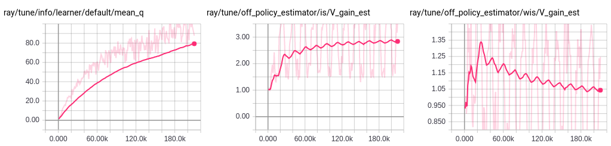

.. include:: /_includes/rllib/announcement.rst

.. include:: /_includes/rllib/we_are_hiring.rst

Working With Offline Data
=========================

Getting started
---------------

RLlib's offline dataset APIs enable working with experiences read from offline storage (e.g., disk, cloud storage, streaming systems, HDFS). For example, you might want to read experiences saved from previous training runs, or gathered from policies deployed in `web applications <https://arxiv.org/abs/1811.00260>`__. You can also log new agent experiences produced during online training for future use.

RLlib represents trajectory sequences (i.e., ``(s, a, r, s', ...)`` tuples) with `SampleBatch <https://github.com/ray-project/ray/blob/master/rllib/policy/sample_batch.py>`__ objects. Using a batch format enables efficient encoding and compression of experiences. During online training, RLlib uses `policy evaluation <rllib-concepts.html#policy-evaluation>`__ actors to generate batches of experiences in parallel using the current policy. RLlib also uses this same batch format for reading and writing experiences to offline storage.

Example: Training on previously saved experiences
~~~~~~~~~~~~~~~~~~~~~~~~~~~~~~~~~~~~~~~~~~~~~~~~~

.. note::

    For custom models and enviroments, you'll need to use the `Python API <rllib-training.html#basic-python-api>`__.

In this example, we will save batches of experiences generated during online training to disk, and then leverage this saved data to train a policy offline using DQN. First, we run a simple policy gradient algorithm for 100k steps with ``"output": "/tmp/cartpole-out"`` to tell RLlib to write simulation outputs to the ``/tmp/cartpole-out`` directory.

.. code-block:: bash

    $ rllib train
        --run=PG \
        --env=CartPole-v0 \
        --config='{"output": "/tmp/cartpole-out", "output_max_file_size": 5000000}' \
        --stop='{"timesteps_total": 100000}'

The experiences will be saved in compressed JSON batch format:

.. code-block:: text

    $ ls -l /tmp/cartpole-out
    total 11636
    -rw-rw-r-- 1 eric eric 5022257 output-2019-01-01_15-58-57_worker-0_0.json
    -rw-rw-r-- 1 eric eric 5002416 output-2019-01-01_15-59-22_worker-0_1.json
    -rw-rw-r-- 1 eric eric 1881666 output-2019-01-01_15-59-47_worker-0_2.json

Then, we can tell DQN to train using these previously generated experiences with ``"input": "/tmp/cartpole-out"``. We disable exploration since it has no effect on the input:

.. code-block:: bash

    $ rllib train \
        --run=DQN \
        --env=CartPole-v0 \
        --config='{
            "input": "/tmp/cartpole-out",
            "off_policy_estimation_methods": {},
            "explore": false}'

.. _is:

**Off-policy estimation:** Since the input experiences are not from running simulations, RLlib cannot report the true policy performance during training. However, you can use ``tensorboard --logdir=~/ray_results`` to monitor training progress via other metrics such as estimated Q-value. Alternatively, `off-policy estimation <https://arxiv.org/pdf/1511.03722.pdf>`__ can be used, which requires both the source and target action probabilities to be available (i.e., the ``action_prob`` batch key). For DQN, this means enabling soft Q learning so that actions are sampled from a probability distribution:

.. code-block:: bash

    $ rllib train \
        --run=DQN \
        --env=CartPole-v0 \
        --config='{
            "input": "/tmp/cartpole-out",
            "off_policy_estimation_methods": {
                "is": {
                    "type": "ImportanceSampling",
                },
                "wis": {
                    "type": "WeightedImportanceSampling",
                }
            },
            "exploration_config": {
                "type": "SoftQ",
                "temperature": 1.0,
            }'

This example plot shows the Q-value metric in addition to importance sampling (IS) and weighted importance sampling (WIS) gain estimates (>1.0 means there is an estimated improvement over the original policy):

**Estimator Python API:** For greater control over the evaluation process, you can create off-policy estimators in your Python code and call ``estimator.estimate(episode_batch)`` to perform counterfactual estimation as needed. The estimators take in a policy object and gamma value for the environment:

.. code-block:: python

    trainer = DQN(...)
    ...  # train policy offline

    from ray.rllib.offline.json_reader import JsonReader
    from ray.rllib.offline.wis_estimator import WeightedImportanceSamplingEstimator

    estimator = WeightedImportanceSamplingEstimator(trainer.get_policy(), gamma=0.99)
    reader = JsonReader("/path/to/data")
    for _ in range(1000):
        batch = reader.next()
        for episode in batch.split_by_episode():
            print(estimator.estimate(episode))

**Simulation-based estimation:** If true simulation is also possible (i.e., your env supports ``step()``), you can also set ``"off_policy_estimation_methods": ["simulation"]`` to tell RLlib to run background simulations to estimate current policy performance. The output of these simulations will not be used for learning. Note that in all cases you still need to specify an environment object to define the action and observation spaces. However, you don't need to implement functions like reset() and step().

Example: Converting external experiences to batch format
~~~~~~~~~~~~~~~~~~~~~~~~~~~~~~~~~~~~~~~~~~~~~~~~~~~~~~~~

When the env does not support simulation (e.g., it is a web application), it is necessary to generate the ``*.json`` experience batch files outside of RLlib. This can be done by using the `JsonWriter <https://github.com/ray-project/ray/blob/master/rllib/offline/json_writer.py>`__ class to write out batches.
This `runnable example <https://github.com/ray-project/ray/blob/master/rllib/examples/saving_experiences.py>`__ shows how to generate and save experience batches for CartPole-v0 to disk:

.. literalinclude:: ../../../rllib/examples/saving_experiences.py
   :language: python
   :start-after: __sphinx_doc_begin__
   :end-before: __sphinx_doc_end__

On-policy algorithms and experience postprocessing
~~~~~~~~~~~~~~~~~~~~~~~~~~~~~~~~~~~~~~~~~~~~~~~~~~

RLlib assumes that input batches are of
`postprocessed experiences <https://github.com/ray-project/ray/blob/master/rllib/policy/policy.py#L434>`__.
This isn't typically critical for off-policy algorithms
(e.g., DQN's `post-processing <https://github.com/ray-project/ray/blob/master/rllib/algorithms/dqn/dqn_tf_policy.py#L434>`__
is only needed if ``n_step > 1`` or ``replay_buffer_config.worker_side_prioritization: True``).
For off-policy algorithms, you can also safely set the ``postprocess_inputs: True`` config to auto-postprocess data.

However, for on-policy algorithms like PPO, you'll need to pass in the extra values added during policy evaluation and postprocessing to ``batch_builder.add_values()``, e.g., ``logits``, ``vf_preds``, ``value_target``, and ``advantages`` for PPO. This is needed since the calculation of these values depends on the parameters of the *behaviour* policy, which RLlib does not have access to in the offline setting (in online training, these values are automatically added during policy evaluation).

Note that for on-policy algorithms, you'll also have to throw away experiences generated by prior versions of the policy. This greatly reduces sample efficiency, which is typically undesirable for offline training, but can make sense for certain applications.

Mixing simulation and offline data
~~~~~~~~~~~~~~~~~~~~~~~~~~~~~~~~~~

RLlib supports multiplexing inputs from multiple input sources, including simulation. For example, in the following example we read 40% of our experiences from ``/tmp/cartpole-out``, 30% from ``hdfs:/archive/cartpole``, and the last 30% is produced via policy evaluation. Input sources are multiplexed using `np.random.choice <https://docs.scipy.org/doc/numpy-1.15.0/reference/generated/numpy.random.choice.html>`__:

.. code-block:: bash

    $ rllib train \
        --run=DQN \
        --env=CartPole-v0 \
        --config='{
            "input": {
                "/tmp/cartpole-out": 0.4,
                "hdfs:/archive/cartpole": 0.3,
                "sampler": 0.3,
            },
            "explore": false}'

Scaling I/O throughput
~~~~~~~~~~~~~~~~~~~~~~

Similar to scaling online training, you can scale offline I/O throughput by increasing the number of RLlib workers via the ``num_workers`` config. Each worker accesses offline storage independently in parallel, for linear scaling of I/O throughput. Within each read worker, files are chosen in random order for reads, but file contents are read sequentially.

Ray Dataset Integration
~~~~~~~~~~~~~~~~~~~~~~~

RLlib has experimental support for reading/writing training samples from/to large offline datasets using
`Ray Dataset <https://docs.ray.io/en/latest/data/dataset.html>`__.
We support JSON and Parquet files today. Other file formats supported by Dataset can also be easily added.

Unlike JSON input, a single dataset can be automatically sharded and replayed by multiple rollout workers
by simply specifying the desired num_workers config.

To load sample data using Dataset, specify input and input_config keys like the following:

.. code-block:: python

    config = {
        ...
        "input"="dataset",
        "input_config"={
            "format": "json",  # json or parquet
	    # Path to data file or directory.
            "path": "/path/to/json_dir/",
	    # Num of tasks reading dataset in parallel, default is num_workers.
            "parallelism": 3,
	    # Dataset allocates 0.5 CPU for each reader by default.
	    # Adjust this value based on the size of your offline dataset.
            "num_cpus_per_read_task": 0.5,
        }
	...
    }

To write sample data to JSON or Parquet files using Dataset, specify output and output_config keys like the following:

.. code-block:: python

    config = {
        "output": "dataset",
        "output_config": {
            "format": "json",  # json or parquet
	    # Directory to write data files.
            "path": "/tmp/test_samples/",
	    # Break samples into multiple files, each containing about this many records.
            "max_num_samples_per_file": 100000,
        }
    }

Writing Environment Data
~~~~~~~~~~~~~~~~~~~~~~~~

To include environment data in the training sample datasets you can use the optional
``store_infos`` parameter that is part of the ``output_config`` dictionary. This parameter
ensures that the ``infos`` dictionary, as returned by the RL environment, is included in the output files.

Note 1: It is the responsibility of the user to ensure that the content of ``infos`` can be serialized
to file.
Note 2: This setting is only relevant for the TensorFlow based agents, for PyTorch agents the ``infos`` data is always stored.

To write the ``infos`` data to JSON or Parquet files using Dataset, specify output and output_config keys like the following:

.. code-block:: python

    config = {
        "output": "dataset",
        "output_config": {
            "format": "json",  # json or parquet
            # Directory to write data files.
            "path": "/tmp/test_samples/",
            # Write the infos dict data
            "store_infos" : True,
        }
    }

Input Pipeline for Supervised Losses
------------------------------------

You can also define supervised model losses over offline data. This requires defining a `custom model loss <rllib-models.html#supervised-model-losses>`__. We provide a convenience function, ``InputReader.tf_input_ops()``, that can be used to convert any input reader to a TF input pipeline. For example:

.. code-block:: python

    def custom_loss(self, policy_loss):
        input_reader = JsonReader("/tmp/cartpole-out")
        # print(input_reader.next())  # if you want to access imperatively

        input_ops = input_reader.tf_input_ops()
        print(input_ops["obs"])  # -> output Tensor shape=[None, 4]
        print(input_ops["actions"])  # -> output Tensor shape=[None]

        supervised_loss = some_function_of(input_ops)
        return policy_loss + supervised_loss

See `custom_model_loss_and_metrics.py <https://github.com/ray-project/ray/blob/master/rllib/examples/custom_model_loss_and_metrics.py>`__ for a runnable example of using these TF input ops in a custom loss.

Input API
---------

You can configure experience input for an agent using the following options:

.. tip::
    Plain python config dicts will soon be replaced by :py:class:`~ray.rllib.agents.trainer_config.TrainerConfig`
    objects, which have the advantage of being type safe, allowing users to set different config settings within
    meaningful sub-categories (e.g. ``my_config.offline_data(input_=[xyz])``), and offer the ability to
    construct a Trainer instance from these config objects (via their ``.build()`` method).
    So far, this is only supported for some Trainer classes, such as :py:class:`~ray.rllib.algorithms.ppo.ppo.PPO`,
    but we are rolling this out right now across all RLlib.

.. code-block:: python

    # Specify how to generate experiences:
    #  - "sampler": Generate experiences via online (env) simulation (default).
    #  - A local directory or file glob expression (e.g., "/tmp/*.json").
    #  - A list of individual file paths/URIs (e.g., ["/tmp/1.json",
    #    "s3://bucket/2.json"]).
    #  - A dict with string keys and sampling probabilities as values (e.g.,
    #    {"sampler": 0.4, "/tmp/*.json": 0.4, "s3://bucket/expert.json": 0.2}).
    #  - A callable that takes an `IOContext` object as only arg and returns a
    #    ray.rllib.offline.InputReader.
    #  - A string key that indexes a callable with tune.registry.register_input
    "input": "sampler",
    # Arguments accessible from the IOContext for configuring custom input
    "input_config": {},
    # True, if the actions in a given offline "input" are already normalized
    # (between -1.0 and 1.0). This is usually the case when the offline
    # file has been generated by another RLlib algorithm (e.g. PPO or SAC),
    # while "normalize_actions" was set to True.
    "actions_in_input_normalized": False,
    # Specify how to evaluate the current policy. This only has an effect when
    # reading offline experiences ("input" is not "sampler").
    # Available options:
    #  - "simulation": Run the environment in the background, but use
    #    this data for evaluation only and not for learning.
    #  - Any subclass of OffPolicyEstimator, e.g.
    #    ray.rllib.offline.estimators.is::ImportanceSampling or your own custom
    #    subclass.
    "off_policy_estimation_methods": {
        ImportanceSampling: None,
        WeightedImportanceSampling: None,
    },
    # Whether to run postprocess_trajectory() on the trajectory fragments from
    # offline inputs. Note that postprocessing will be done using the *current*
    # policy, not the *behavior* policy, which is typically undesirable for
    # on-policy algorithms.
    "postprocess_inputs": False,
    # If positive, input batches will be shuffled via a sliding window buffer
    # of this number of batches. Use this if the input data is not in random
    # enough order. Input is delayed until the shuffle buffer is filled.
    "shuffle_buffer_size": 0,

The interface for a custom input reader is as follows:

.. autoclass:: ray.rllib.offline.InputReader
    :members:
    :noindex:

Example Custom Input API
~~~~~~~~~~~~~~~~~~~~~~~~

You can create a custom input reader like the following:

.. code-block:: python

    from ray.rllib.offline import InputReader, IOContext, ShuffledInput
    from ray.tune.registry import register_input

    class CustomInputReader(InputReader):
        def __init__(self, ioctx: IOContext): ...
        def next(self): ...

    def input_creator(ioctx: IOContext) -> InputReader:
        return ShuffledInput(CustomInputReader(ioctx))

    register_input("custom_input", input_creator)

    config = {
        "input": "custom_input",
        "input_config": {},
        ...
    }

You can pass arguments from the config to the custom input api through the
``input_config`` option which can be accessed with the ``IOContext``.
The interface for the ``IOContext`` is the following:

.. autoclass:: ray.rllib.offline.IOContext
    :members:
    :noindex:

See `custom_input_api.py <https://github.com/ray-project/ray/blob/master/rllib/examples/custom_input_api.py>`__ for a runnable example.

Output API
----------

You can configure experience output for an agent using the following options:

.. tip::
    Plain python config dicts will soon be replaced by :py:class:`~ray.rllib.agents.trainer_config.TrainerConfig`
    objects, which have the advantage of being type safe, allowing users to set different config settings within
    meaningful sub-categories (e.g. ``my_config.offline_data(input_=[xyz])``), and offer the ability to
    construct a Trainer instance from these config objects (via their ``.build()`` method).
    So far, this is only supported for some Trainer classes, such as :py:class:`~ray.rllib.algorithms.ppo.ppo.PPO`,
    but we are rolling this out right now across all RLlib.

.. code-block:: python

    # Specify where experiences should be saved:
    #  - None: don't save any experiences
    #  - "logdir" to save to the agent log dir
    #  - a path/URI to save to a custom output directory (e.g., "s3://bucket/")
    #  - a function that returns a rllib.offline.OutputWriter
    "output": None,
    # Arguments accessible from the IOContext for configuring custom output
    "output_config": {},
    # What sample batch columns to LZ4 compress in the output data.
    "output_compress_columns": ["obs", "new_obs"],
    # Max output file size (in bytes) before rolling over to a new file.
    "output_max_file_size": 64 * 1024 * 1024,

The interface for a custom output writer is as follows:

.. autoclass:: ray.rllib.offline.OutputWriter
    :members:
    :noindex:

.. include:: /_includes/rllib/announcement_bottom.rst
