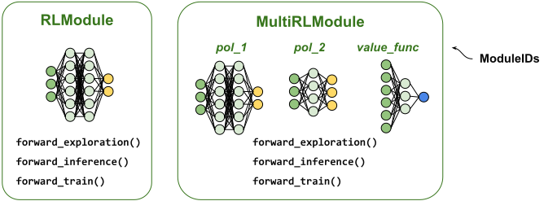

.. include:: /_includes/rllib/we_are_hiring.rst

.. include:: /_includes/rllib/new_api_stack.rst

.. _rlmodule-guide:

RL Modules
==========

The :py:class:`~ray.rllib.core.rl_module.rl_module.RLModule` class in RLlib's new API stack allows you to write custom
models in RLlib, including highly complex multi-network setups, often found in multi-agent- or model-based algorithms.

:py:class:`~ray.rllib.core.rl_module.rl_module.RLModule` is the main neural network class and exposes
three public methods, each corresponding to a distinct phase in the reinforcement learning cycle:
:py:meth:`~ray.rllib.core.rl_module.rl_module.RLModule.forward_exploration` handles the computation of actions during data collection
(if the data is used for a succeeding training step), balancing exploration and exploitation.
:py:meth:`~ray.rllib.core.rl_module.rl_module.RLModule.forward_inference` is used to compute actions during evaluation (for example in production),
often requiring greedy or less stochastic action selection.
Finally, :py:meth:`~ray.rllib.core.rl_module.rl_module.RLModule.forward_train` manages the training phase, performing calculations required to
compute losses, such as Q-values in a DQN model, value function predictions in a PG-style setup,
or world-model predictions in model-based algorithms.

    **RLModule overview**: (*left*) A plain :py:class:`~ray.rllib.core.rl_module.rl_module.RLModule` contains the
    neural network used for computations
    (for example, a policy network written in `PyTorch <pytorch.org>`__) and exposes the three forward methods:
    :py:meth:`~ray.rllib.core.rl_module.rl_module.RLModule.forward_exploration` (sample collection),
    :py:meth:`~ray.rllib.core.rl_module.rl_module.RLModule.forward_inference` (production/deployment), and
    :py:meth:`~ray.rllib.core.rl_module.rl_module.RLModule.forward_train` (preparing loss computations when training).
    (*right*) A :py:class:`~ray.rllib.core.rl_module.multi_rl_module.MultiRLModule` may contain one
    or more sub-RLModules, each identified by a `ModuleID`, allowing you to implement
    arbitrarily complex multi-network and/or multi-agent architectures and algorithms.

Enabling the RLModule API in the AlgorithmConfig
------------------------------------------------

RLModules are used exclusively in the :ref:`new API stack <rllib-new-api-stack-guide>`, which is activated by default in RLlib.

In case you are working with a legacy config or would like to migrate your ``ModelV2`` and/or ``Policy`` classes to the
new API stack, see the :ref:`new API stack migration guide <rllib-new-api-stack-migration-guide>` for more information.

If you have a config that's still set to the old API stack, use the
:py:meth:`~ray.rllib.algorithms.algorithm_config.AlgorithmConfig.api_stack` method to switch:

.. testcode::

    from ray.rllib.algorithms.algorithm_config import AlgorithmConfig

    config = (
        AlgorithmConfig()
        .api_stack(
            enable_rl_module_and_learner=True,
            enable_env_runner_and_connector_v2=True,
        )
    )

.. _rllib_default_rl_modules_docs:

Default RLModules
-----------------

If you don't specify any module-related settings in your
:py:class:`~ray.rllib.algorithms.algorithm_config.AlgorithmConfig`, RLlib uses the respective algorithm's default
RLModule, which is a great choice for initial experimentation and benchmarking. All of the default RLModules support 1D-tensor- and
image observations (``[width] x [height] x [channels]``).

.. note::
    For discrete or more complex input observation spaces (for example dictionaries), use the
    :py:class:`~ray.rllib.connectors.env_to_module.flatten_observations.FlattenObservations` connector
    piece like so:

    .. testcode::
        from ray.rllib.algorithms.ppo import PPOConfig
        from ray.rllib.connectors.env_to_module import FlattenObservations

        config = (
            PPOConfig()
            # FrozenLake has a discrete observation space, ...
            .environment("FrozenLake-v1")
            # ... which `FlattenObservations` converts to one-hot.
            .env_runners(env_to_module_connector=lambda env: FlattenObservations())
        )

    .. TODO (sven): Link here to the connector V2 page and preprocessors once that page is done.

Furthermore, all default models offer configurable architecture choices with respect to the number
and size of the layers used (Dense or CNN), their activations and initializations, and automatic LSTM-wrapping behavior.

Use the :py:class:`~ray.rllib.core.rl_module.default_model_config.DefaultModelConfig` datadict class to configure
any default model in RLlib. Note that you should only use this class for configuring default models.
When writing your own custom RLModules, you should use plain python dicts to define your model configurations.
See here for more information on :ref:`how to write and configure your custom RLModules <rllib-implementing-custom-rl-modules>`.

Configuring default MLP nets
~~~~~~~~~~~~~~~~~~~~~~~~~~~~

If you want to train a simple MLP policy (with only fully connected layers) with PPO and use the default RLModule,
you should configure your experiment like so:

.. testcode::

    from ray.rllib.algorithms.ppo import PPOConfig
    from ray.rllib.core.rl_module.default_model_config import DefaultModelConfig

    config = (
        PPOConfig()
        .environment("CartPole-v1")
        .rl_module(
            # Use a non-default 32,32-stack with ReLU activations.
            model_config=DefaultModelConfig(
                fcnet_hiddens=[32, 32],
                fcnet_activation="relu",
            )
        )
    )

See here for a compete list of all supported ``fcnet_..`` options:

.. literalinclude:: ../../../rllib/core/rl_module/default_model_config.py
        :language: python
        :start-after: __sphinx_doc_default_model_config_fcnet_begin__
        :end-before: __sphinx_doc_default_model_config_fcnet_end__

Configuring default CNN nets
~~~~~~~~~~~~~~~~~~~~~~~~~~~~

For image-based environments (for example `Atari <https://ale.farama.org/environments/>`__), use the
``conv2d_..`` fields in :py:class:`~ray.rllib.core.rl_module.default_model_config.DefaultModelConfig`.
For example:

.. testcode::

    from ray.rllib.algorithms.ppo import PPOConfig
    from ray.rllib.core.rl_module.default_model_config import DefaultModelConfig

    config = (
        PPOConfig()
        .environment("ale_py:ALE/Pong-v5")  # `pip install gymnasium[atari]`
        .rl_module(
            model_config=DefaultModelConfig(
                # Use a DreamerV3-style CNN stack.
                conv2d_filters=[
                    [16, 4, 2],  # 1st CNN layer: num_filters, kernel, stride(, padding)?
                    [32, 4, 2],  # 2nd CNN layer
                    [64, 4, 2],  # etc..
                    [128, 4, 2],
                ],
                conv2d_activation="silu",

                # After the last CNN, the default model flattens, then adds an (optional) MLP.
                head_fcnet_hiddens=[256],
            )
        )
    )

See here for a compete list of all supported ``conv2d_..`` options:

.. literalinclude:: ../../../rllib/core/rl_module/default_model_config.py
        :language: python
        :start-after: __sphinx_doc_default_model_config_conv2d_begin__
        :end-before: __sphinx_doc_default_model_config_conv2d_end__

Other default model settings
~~~~~~~~~~~~~~~~~~~~~~~~~~~~

For LSTM-based configurations and specific settings for continuous action output layers,
see :py:class:`~ray.rllib.core.rl_module.default_model_config.DefaultModelConfig`.

Constructing RLModule instances
-------------------------------

To maintain consistency and usability, RLlib offers a standardized approach for constructing
:py:class:`~ray.rllib.core.rl_module.rl_module.RLModule` instances for both single-module use cases, for example for single-agent,
and multi-module use cases, for example for multi-agent learning or other multi-NN setups.

.. _rllib-constructing-rlmodule-w-class-constructor:

Construction through the class constructor
~~~~~~~~~~~~~~~~~~~~~~~~~~~~~~~~~~~~~~~~~~

The most direct way to construct your :py:class:`~ray.rllib.core.rl_module.rl_module.RLModule` is through its constructor:

.. testcode::

    import gymnasium as gym
    from ray.rllib.algorithms.bc.torch.default_bc_torch_rl_module import DefaultBCTorchRLModule

    # Create an env object to know the spaces.
    env = gym.make("CartPole-v1")

    # Construct the actual RLModule object.
    rl_module = DefaultBCTorchRLModule(
        observation_space=env.observation_space,
        action_space=env.action_space,
        # A custom dict that is accessible inside your class as `self.model_config`.
        model_config={"fcnet_hiddens": [64]},
    )

.. note::
    If you have a checkpoint (from an `py:class:`~ray.rllib.algorithms.algorithm.Algorithm` or an individual
    :py:class:`~ray.rllib.core.rl_module.rl_module.RLModule`,
    :ref:`see here for how to create the stored RLModule instance from disk <rllib-checkpointing-rl-modules-docs>`.

Construction through RLModuleSpecs
~~~~~~~~~~~~~~~~~~~~~~~~~~~~~~~~~~

Since RLlib is a distributed RL library and needs to create more than one copy of
your :py:class:`~ray.rllib.core.rl_module.rl_module.RLModule`, you can use
:py:class:`~ray.rllib.core.rl_module.rl_module.RLModuleSpec` objects to define, how RLlib should construct
each such copy of your :py:class:`~ray.rllib.core.rl_module.rl_module.RLModule` once the algorithm with its many
Ray actors (some holding a model copy) are built.

Creating an :py:class:`~ray.rllib.core.rl_module.rl_module.RLModuleSpec` is straightforward
and analogous to creating an :py:class:`~ray.rllib.core.rl_module.rl_module.RLModule` through a constructor:

.. tab-set::

    .. tab-item:: RLModuleSpec (single model)

        .. testcode::

            import gymnasium as gym
            from ray.rllib.algorithms.bc.torch.default_bc_torch_rl_module import DefaultBCTorchRLModule
            from ray.rllib.core.rl_module.rl_module import RLModuleSpec

            # Create an env object to know the spaces.
            env = gym.make("CartPole-v1")

            # First construct the spec.
            spec = RLModuleSpec(
                module_class=DefaultBCTorchRLModule,
                observation_space=env.observation_space,
                action_space=env.action_space,
                # A custom dict that is accessible inside your class as `self.model_config`.
                model_config={"fcnet_hiddens": [64]},
            )

            # Then, build the RLModule through the spec's `build()` method.
            rl_module = spec.build()

    .. tab-item:: MultiRLModuleSpec (multi model)

        .. testcode::

            import gymnasium as gym
            from ray.rllib.algorithms.bc.torch.default_bc_torch_rl_module import DefaultBCTorchRLModule
            from ray.rllib.core.rl_module.rl_module import RLModuleSpec
            from ray.rllib.core.rl_module.multi_rl_module import MultiRLModuleSpec

            # First construct the MultiRLModuleSpec.
            spec = MultiRLModuleSpec(
                module_specs={
                    "module_1": RLModuleSpec(
                        module_class=DefaultBCTorchRLModule,

                        # Define the spaces for only this sub-module.
                        observation_space=gym.spaces.Box(low=-1, high=1, shape=(10,)),
                        action_space=gym.spaces.Discrete(2),

                        # A custom dict that will be accessible inside your class as
                        # `self.model_config`.
                        model_config={"fcnet_hiddens": [32]},
                    ),
                    "module_2": RLModuleSpec(
                        module_class=DiscreteBCTorchModule,

                        # Define the spaces for only this sub-module.
                        observation_space=gym.spaces.Box(low=-1, high=1, shape=(5,)),
                        action_space=gym.spaces.Discrete(2),

                        # A custom dict that will be accessible inside your class as
                        # `self.model_config`.
                        model_config={"fcnet_hiddens": [16]},
                    ),
                },
            )

            # Construct the actual MultiRLModule instance with .build():
            multi_rl_module = spec.build()

You can now pass the :py:class:`~ray.rllib.core.rl_module.rl_module.RLModuleSpec` instances to your
:py:class:`~ray.rllib.algorithms.algorithm_config.AlgorithmConfig` of choice to
tell RLlib to use the particular module class and constructor arguments:

.. tab-set::

    .. tab-item:: Single-Module (ex. single-agent)

        .. code-block:: python

            from ray.rllib.algorithms.ppo import PPOConfig
            from ray.rllib.core.rl_module.rl_module import RLModuleSpec

            config = (
                PPOConfig()
                .environment("CartPole-v1")
                .rl_module(
                    rl_module_spec=RLModuleSpec(
                        module_class=MyRLModuleClass,
                        model_config={"some_key": "some_setting"},
                    ),
                )
            )
            ppo = config.build()
            print(ppo.get_module())

        .. note::
            Often when creating an `RLModuleSpec`, attributes like `observation_space` or `action_space`
            don't have to be defined, because RLlib automatically infers these based on the used
            environment or other configuration parameters.

    .. tab-item:: Multi-Agent (shared policy net)

        .. code-block:: python

            from ray.rllib.algorithms.ppo import PPOConfig
            from ray.rllib.core.rl_module.rl_module import RLModuleSpec
            from ray.rllib.core.rl_module.multi_rl_module import MultiRLModuleSpec
            from ray.rllib.examples.envs.classes.multi_agent import MultiAgentCartPole

            config = (
                PPOConfig()
                .environment(MultiAgentCartPole, env_config={"num_agents": 2})
                .rl_module(
                    rl_module_spec=MultiRLModuleSpec(
                        # All agents (0 and 1) use the same (single) RLModule.
                        rl_module_specs=RLModuleSpec(
                            module_class=MyRLModuleClass,
                            model_config={"some_key": "some_setting"},
                        )
                    ),
                )
            )
            ppo = config.build()
            print(ppo.get_module())

    .. tab-item:: Multi-Agent (two or more policy nets)

        .. code-block:: python

            from ray.rllib.algorithms.ppo import PPOConfig
            from ray.rllib.core.rl_module.rl_module import RLModuleSpec
            from ray.rllib.core.rl_module.multi_rl_module import MultiRLModuleSpec
            from ray.rllib.examples.envs.classes.multi_agent import MultiAgentCartPole

            config = (
                PPOConfig()
                .environment(MultiAgentCartPole, env_config={"num_agents": 2})
                .multi_agent(
                    policies={"p0", "p1"},
                    # Agent IDs of `MultiAgentCartPole` are 0 and 1, mapping to
                    # "p0" and "p1", respectively.
                    policy_mapping_fn=lambda agent_id, episode, **kw: f"p{agent_id}"
                )
                .rl_module(
                    rl_module_spec=MultiRLModuleSpec(
                        # Agents (0 and 1) use different (single) RLModules.
                        rl_module_specs={
                            "p0": RLModuleSpec(
                                module_class=MyRLModuleClass,
                                # Small network.
                                model_config={"fcnet_hiddens": [32, 32]},
                            ),
                            "p1": RLModuleSpec(
                                module_class=MyRLModuleClass,
                                # Large network.
                                model_config={"fcnet_hiddens": [128, 128]},
                            ),
                        },
                    ),
                )
            )
            ppo = config.build()
            print(ppo.get_module())

.. _rllib-implementing-custom-rl-modules:

Implementing custom RLModules
-----------------------------

To implement your own neural network architecture and computation logic, you should subclass
:py:class:`~ray.rllib.core.rl_module.torch_rl_module.TorchRLModule` for any single-agent learning experiments
or for independent multi-agent learning.

For more advanced multi-agent use cases (for example with shared communication between agents)
or any multi-model use cases, subclass the :py:class:`~ray.rllib.core.rl_module.multi_rl_module.MultiRLModule` class, instead.

.. note::
    An alternative to subclassing :py:class:`~ray.rllib.core.rl_module.torch_rl_module.TorchRLModule` is to
    directly subclass your Algorithm's default RLModule, for example, if you intend to use PPO, you may subclass
    :py:class:`~ray.rllib.algorithms.ppo.torch.default_ppo_torch_rl_module.DefaultPPOTorchRLModule`).
    You should carefully study the existing default model in this case to understand how to override
    the :py:meth:`~ray.rllib.core.rl_module.rl_module.RLModule.setup`, the
    `_forward_()` methods, and possibly some algo-specific API methods
    (see here for :ref:`details on how to find out, which APIs your algorithm requires to be implemented <rllib-algo-specific-rl-module-apis-docs>`).

The setup() method
~~~~~~~~~~~~~~~~~~

You should first implement the :py:meth:`~ray.rllib.core.rl_module.rl_module.RLModule.setup` method,
in which you add needed NN subcomponents and assign these to class attributes of your choice.

Note that you should call `super().setup()` in your implementation.

You also have access to the following attributes anywhere in the class (including in :py:meth:`~ray.rllib.core.rl_module.rl_module.RLModule.setup`):

#. ``self.observation_space``
#. ``self.action_space``
#. ``self.inference_only``
#. ``self.model_config`` (a dict with any custom config settings)

.. testcode::

    import torch
    from ray.rllib.core.rl_module.torch.torch_rl_module import TorchRLModule

    class MyTorchPolicy(TorchRLModule):

        def setup(self):
            # You have access here to the following already set attributes:
            # self.observation_space
            # self.action_space
            # self.inference_only
            # self.model_config  # <- a dict with custom settings

            # Use the observation space (if a Box) to infer the input dimension.
            input_dim = self.observation_space.shape[0]

            # Use the model_config dict to extract the hidden dimension.
            hidden_dim = self.model_config["fcnet_hiddens"][0]

            # Use the action space to infer the number of output nodes.
            output_dim = self.action_space.n

            # Build all the layers and subcomponents here you need for the
            # RLModule's forward passes.
            self._pi_head = torch.nn.Sequential(
                torch.nn.Linear(input_dim, hidden_dim),
                torch.nn.ReLU(),
                torch.nn.Linear(hidden_dim, output_dim),
            )

The forward methods
~~~~~~~~~~~~~~~~~~~

After that, implement the forward computation logic. You can either define a generic forward logic by overriding the
private :py:meth:`~ray.rllib.core.rl_module.rl_module.RLModule._forward` method (which is then used everywhere in the model's lifecycle)
or - if you require more granularity - define the following three private methods:

- :py:meth:`~ray.rllib.core.rl_module.rl_module.RLModule._forward_exploration`: Forward pass for computing exploration actions (for collecting training data).
- :py:meth:`~ray.rllib.core.rl_module.rl_module.RLModule._forward_inference`: Forward pass for action inference (greedy).
- :py:meth:`~ray.rllib.core.rl_module.rl_module.RLModule._forward_train`: Forward pass for training (right before loss computation).

For custom :py:meth:`~ray.rllib.core.rl_module.rl_module.RLModule._forward`,
:py:meth:`~ray.rllib.core.rl_module.rl_module.RLModule._forward_inference`, and
:py:meth:`~ray.rllib.core.rl_module.rl_module.RLModule._forward_exploration` methods, you must return a
dictionary that either contains the key ``actions`` and/or the key ``action_dist_inputs``.

If you return the ``actions`` key from your forward methods:

- RLlib uses the actions provided thereunder as-is.
- If you also return the ``action_dist_inputs`` key: RLlib also creates a :py:class:`~ray.rllib.models.distributions.Distribution`
  instance from the parameters under that key and - in the case of :py:meth:`~ray.rllib.core.rl_module.rl_module.RLModule.forward_exploration` -
  compute action probabilities and log-probabilities for the given actions automatically.
  See :ref:`here for more information on custom action distribution classes <rllib-rl-module-w-custom-action-dists>`.

If you don't return the ``actions`` key from your forward methods:

- You must return the ``action_dist_inputs`` key, instead, from your :py:meth:`~ray.rllib.core.rl_module.rl_module.RLModule._forward_exploration`
  and :py:meth:`~ray.rllib.core.rl_module.rl_module.RLModule._forward_inference` methods.
- RLlib creates a :py:class:`~ray.rllib.models.distributions.Distribution` instance from the parameters under that key and
  sample actions from that distribution. See :ref:`here for more information on custom action distribution classes <rllib-rl-module-w-custom-action-dists>`.
- For :py:meth:`~ray.rllib.core.rl_module.rl_module.RLModule._forward_exploration`, RLlib also computes action probs and
  logp values from the sampled actions automatically.

.. note::

    In case of :py:meth:`~ray.rllib.core.rl_module.rl_module.RLModule._forward_inference`,
    the generated distributions (from returned key ``action_dist_inputs``) are always made deterministic first through
    the :py:meth:`~ray.rllib.models.distributions.Distribution.to_deterministic` utility before a possible action sample step.
    For example, sampling from a Categorical distribution will be reduced to selecting the argmax actions from the distribution's logits/probs.
    If you already return the "actions" key yourself, RLlib skips that sampling step.

.. tab-set::

    .. tab-item:: Returning "actions" key

        .. code-block:: python

            from ray.rllib.core import Columns, TorchRLModule

            class MyTorchPolicy(TorchRLModule):
                ...

                def _forward_inference(self, batch):
                    ...
                    return {
                        Columns.ACTIONS: ...  # actions here are used as-is
                    }

                def _forward_exploration(self, batch):
                    ...
                    return {
                        Columns.ACTIONS: ...  # actions here are used as-is (no sampling step!)
                        Columns.ACTION_DIST_INPUTS: ...  # optional: If provided, used to compute action probs and logp.
                    }

    .. tab-item:: Not returning "actions" key

        .. code-block:: python

            from ray.rllib.core import Columns, TorchRLModule

            class MyTorchPolicy(TorchRLModule):
                ...

                def _forward_inference(self, batch):
                    ...
                    return {
                        # RLlib:
                        # - Generates distribution from ACTION_DIST_INPUTS parameters.
                        # - Converts distribution to a deterministic equivalent.
                        # - Samples from the (deterministic) distribution.
                        Columns.ACTION_DIST_INPUTS: ...
                    }

                def _forward_exploration(self, batch):
                    ...
                    return {
                        # RLlib:
                        # - Generates distribution from ACTION_DIST_INPUTS parameters.
                        # - Samples from the (stochastic) distribution.
                        # - Computes action probs/logs automatically using the sampled
                        #   actions and the distribution.
                        Columns.ACTION_DIST_INPUTS: ...
                    }

You should never override the constructor (`__init__`) itself, however, it might be important for your understanding of this API to know that the
:py:class:`~ray.rllib.core.rl_module.rl_module.RLModule` class's constructor requires the following arguments
(and also receives these properly when a spec's `build()` method is called):

- :py:attr:`~ray.rllib.core.rl_module.rl_module.RLModule.observation_space`: The observation space (after having passed all connectors); This is the actual input space for the model after all preprocessing steps.
- :py:attr:`~ray.rllib.core.rl_module.rl_module.RLModule.action_space`: The action space of the environment.
- :py:attr:`~ray.rllib.core.rl_module.rl_module.RLModule.inference_only`: Whether the RLModule should be built in inference-only mode, dropping subcomponents that are only needed for learning.
- :py:attr:`~ray.rllib.core.rl_module.rl_module.RLModule.model_config`: The model config, which is either a custom dictionary (for custom RLModules) or a :py:class:`~ray.rllib.core.rl_module.default_model_config.DefaultModelConfig` dataclass object (only for RLlib's default models). Model hyper-parameters such as number of layers, type of activation, etc. are defined here.

Also :ref:`see the preceding section on how to create an RLModule through the contructor <rllib-constructing-rlmodule-w-class-constructor>` for more details.

.. _rllib-algo-specific-rl-module-apis-docs:

Algorithm-specific RLModule APIs
~~~~~~~~~~~~~~~~~~~~~~~~~~~~~~~~

The algorithm that you would like to use alongside your RLModule affects - to some
extend - what your final custom module needs to look like.
Each Algorithm class has a fixed set of APIs that all RLModules that are to be trained
by that algorithm need to implement.

To find out, what APIs your Algorithms requires, do this:

.. testcode::

    # Import the config of the algorithm of your choice:
    from ray.rllib.algorithms.sac import PPOConfig

    # Print out the (abstract) APIs, you need to subclass from and whose
    # abstract methods we need to implement (besides `setup()` and the `_forward_..()`
    # methods):
    print(
        PPOConfig()
        .get_default_learner_class()
        .rl_module_required_apis()
    )

.. note::
    The preceding VPG example module isn't required to implement any APIs yet. This is because
    you still haven't considered training it with any particular algorithm.
    However, you can find examples of algorithm-ready (:py:class:`~ray.rllib.algorithms.ppo.PPO`) custom RLModules
    `here <https://github.com/ray-project/ray/blob/master/rllib/examples/rl_modules/classes/tiny_atari_cnn_rlm.py>`__
    and `here <https://github.com/ray-project/ray/blob/master/rllib/examples/rl_modules/classes/lstm_containing_rlm.py>`__.

Putting it all together
~~~~~~~~~~~~~~~~~~~~~~~

With the now implemented elements of your custom :py:class:`~ray.rllib.core.rl_module.rl_module.RLModule`,
you get a working end-to-end example:

.. literalinclude:: ../../../rllib/examples/rl_modules/classes/vpg_rlm.py
        :language: python

.. _rllib-rl-module-w-custom-action-dists:

Custom action distributions
~~~~~~~~~~~~~~~~~~~~~~~~~~~

In the preceding examples, you relied on your RLModule to use the correct action distribution with the computed
``ACTION_DIST_INPUTS`` returned by your forward methods. RLlib picks a default distribution class based on
the action space, which is :py:class:`~ray.rllib.models.torch.torch_distributions.TorchCategorical` for ``Discrete`` action spaces
and :py:class:`~ray.rllib.models.torch.torch_distributions.TorchDiagGaussian` for ``Box`` action spaces.

If you want to use a different distribution class (and return parameters for its constructor from your forward methods),
override the following methods in your :py:class:`~ray.rllib.core.rl_module.rl_module.RLModule` implementation:

- :py:meth:`~ray.rllib.core.rl_module.rl_module.RLModule.get_inference_action_dist_cls`
- :py:meth:`~ray.rllib.core.rl_module.rl_module.RLModule.get_exploration_action_dist_cls`
- and :py:meth:`~ray.rllib.core.rl_module.rl_module.RLModule.get_train_action_dist_cls`

`Commonly used distribution implementations can be found here <https://github.com/ray-project/ray/blob/master/rllib/models/torch/torch_distributions.py>`__.

Implement a deterministic counterpart of your distribution class through the
:py:meth:`~ray.rllib.models.distributions.Distribution.to_deterministic` method.
You can choose to compute deterministic actions, by creating the deterministic counterpart.

Implementing custom MultiRLModules
----------------------------------

For multi-module setups, RLlib provides the :py:class:`~ray.rllib.core.rl_module.multi_rl_module.MultiRLModule` class,
whose default implementation is a dictionary of individual :py:class:`~ray.rllib.core.rl_module.rl_module.RLModule` objects,
one for each submodule and identified by a ``ModuleID``.

The base-class :py:class:`~ray.rllib.core.rl_module.multi_rl_module.MultiRLModule` implementation works for most of those
use cases that need to define independent neural networks . However, for any complex, multi-network or multi-agent use cases, where agents share one or more neural networks,
you should inherit from this class and override the default implementation.

The following code snippets create a custom multi-agent RL module with two simple "policy head" modules, which
share the same encoder (the third network in the MultiRLModule). The encoder receives the raw observations from the env
and outputs embedding vectors that then serve as input for the two policy heads to compute the agents' actions.

.. tab-set::

    .. tab-item:: MultiRLModule (w/ two policy nets and one encoder)

        .. literalinclude:: ../../../rllib/examples/rl_modules/classes/vpg_using_shared_encoder_rlm.py
            :language: python
            :start-after: __sphinx_doc_mrlm_begin__
            :end-before: __sphinx_doc_mrlm_end__

        .. literalinclude:: ../../../rllib/examples/rl_modules/classes/vpg_using_shared_encoder_rlm.py
            :language: python
            :start-after: __sphinx_doc_mrlm_2_begin__
            :end-before: __sphinx_doc_mrlm_2_end__

    .. tab-item:: Policy RLModule

        Within your MultiRLModule, you need to have two policy sub-RLModules. They may be of the same
        class, which can be implemented as follows:

        .. literalinclude:: ../../../rllib/examples/rl_modules/classes/vpg_using_shared_encoder_rlm.py
            :language: python
            :start-after: __sphinx_doc_policy_begin__
            :end-before: __sphinx_doc_policy_end__
        .. literalinclude:: ../../../rllib/examples/rl_modules/classes/vpg_using_shared_encoder_rlm.py
            :language: python
            :start-after: __sphinx_doc_policy_2_begin__
            :end-before: __sphinx_doc_policy_2_end__

    .. tab-item:: Shared encoder RLModule

        Finally, your shared encoder RLModule should look similar to this:

        .. literalinclude:: ../../../rllib/examples/rl_modules/classes/vpg_using_shared_encoder_rlm.py
            :language: python
            :start-after: __sphinx_doc_encoder_begin__
            :end-before: __sphinx_doc_encoder_end__

To plug in the custom MultiRLModule (from the first tab) into your algorithm's config, create a
:py:class:`~ray.rllib.core.rl_module.multi_rl_module.MultiRLModuleSpec` with the new class and its constructor
settings. Also, create one :py:class:`~ray.rllib.core.rl_module.rl_module.RLModuleSpec` for each agent
and the shared encoder RLModule, because RLlib requires their observation- and action spaces and their
model hyper-parameters:

.. literalinclude:: ../../../rllib/examples/rl_modules/classes/vpg_using_shared_encoder_rlm.py
    :language: python
    :start-after: __sphinx_doc_how_to_run_begin__
    :end-before: __sphinx_doc_how_to_run_end__

.. note::
    In order to learn with the preceding setup properly, a specific, multi-agent
    :py:class:`~ray.rllib.core.learner.learner.Learner`, capable of handling the shared encoder
    must be written and used. This Learner should only have a single optimizer, used to train all
    three submodules (encoder and the two policy nets) to stabilize learning.
    If the standard "one-optimizer-per-module" Learners are used, the two optimizers for policy 1 and 2
    take turns updating the same shared encoder, which potentially leads to learning instabilities.

.. _rllib-checkpointing-rl-modules-docs:

Checkpointing RLModules
-----------------------

RL Modules can be checkpointed with their :py:meth:`~ray.rllib.core.rl_module.rl_module.RLModule.save_to_path` method.
If you already have an instantiated RLModule and would like to load a new state (weights) into it from an existing
checkpoint, use the :py:meth:`~ray.rllib.core.rl_module.rl_module.RLModule.restore_from_path` method.

The following examples show how these methods can be used outside of, or in conjunction with, an RLlib Algorithm.

Creating an RLModule checkpoint
~~~~~~~~~~~~~~~~~~~~~~~~~~~~~~~

.. testcode::

    import shutil
    import tempfile

    import gymnasium as gym

    from ray.rllib.algorithms.ppo import PPOConfig
    from ray.rllib.algorithms.ppo.torch.default_ppo_torch_rl_module import DefaultPPOTorchRLModule
    from ray.rllib.core.rl_module.default_model_config import DefaultModelConfig
    from ray.rllib.core.rl_module.rl_module import RLModule

    env = gym.make("CartPole-v1")

    # Create an RLModule to later checkpoint.
    rl_module = DefaultPPOTorchRLModule(
        observation_space=env.observation_space,
        action_space=env.action_space,
        model_config=DefaultModelConfig(fcnet_hiddens=[32]),
    )

    # Finally, write the RLModule checkpoint.
    module_ckpt_path = tempfile.mkdtemp()
    module.save_to_path(module_ckpt_path)

Creating an RLModule from an (RLModule) checkpoint
~~~~~~~~~~~~~~~~~~~~~~~~~~~~~~~~~~~~~~~~~~~~~~~~~~

If you have an RLModule checkpoint saved and would like to create a new RLModule directly from it,
use the :py:meth:`~ray.rllib.core.rl_module.rl_module.RLModule.from_checkpoint` method:

.. testcode::

    # Create a new RLModule from the checkpoint.
    new_module = RLModule.from_checkpoint(module_ckpt_path)

Loading an RLModule checkpoint into a running Algorithm
~~~~~~~~~~~~~~~~~~~~~~~~~~~~~~~~~~~~~~~~~~~~~~~~~~~~~~~

.. testcode::

    # Create a new Algorithm (with the changed module config: 32 units instead of the
    # default 256; otherwise loading the state of `module` will fail due to a shape
    # mismatch).
    config = (
        PPOConfig()
        .environment("CartPole-v1")
        .rl_module(model_config=DefaultModelConfig(fcnet_hiddens=[32]))
    )
    ppo = config.build()

Now you can load the saved RLModule state (from the preceding `module.save_to_path()`) directly
into the running Algorithm's RLModule(s). Note that all RLModules within the algorithm get updated, the ones
in the Learner workers and the ones in the EnvRunners.

.. testcode::

    ppo.restore_from_path(
        module_ckpt_path,  # <- NOT an Algorithm checkpoint, but single-agent RLModule one.

        # Therefore, we have to provide the exact path (of RLlib components) down
        # to the individual RLModule within the algorithm, which is:
        component="learner_group/learner/rl_module/default_policy",
    )

.. testcode::
    :hide:

    ppo.stop()
    shutil.rmtree(module_ckpt_path)
