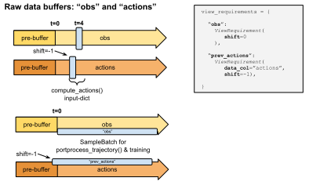

.. include:: /_includes/rllib/announcement.rst

.. include:: /_includes/rllib/we_are_hiring.rst

Sample Collections and Trajectory Views
=======================================

The SampleCollector Class is Used to Store and Retrieve Temporary Data
----------------------------------------------------------------------

RLlib's `RolloutWorkers <https://github.com/ray-project/ray/blob/master/rllib/evaluation/rollout_worker.py>`__,
when running against a live environment, use the ``SamplerInput`` class to interact
with that environment and produce batches of experiences.
The two implemented sub-classes of ``SamplerInput`` are ``SyncSampler`` and ``AsyncSampler``
(residing under the ``RolloutWorker.sampler`` property).

In case the "_use_trajectory_view_api" top-level config key is set to True
(by default since version >=1.1.0), every such sampler object will use the
``SampleCollector`` API to store and retrieve temporary environment-, model-, and other data
during rollouts (see figure below).

.. Edit figure below at: https://docs.google.com/drawings/d/1ZdNUU3ChwiUeT-DBRxvLAsbEPEqEFWSPZcOyVy3KxVg/edit

**Sample collection process implemented by RLlib:**
The Policy's model tells the Sampler and its SampleCollector object, which data to store and
how to present it back to the dependent methods (e.g. `Model.compute_actions()`).
This is done using a dict that maps strings (column names) to `ViewRequirement` objects (details see below).

The exact behavior for a single such rollout and the number of environment transitions therein
are determined by the following ``AlgorithmConfig.rollout(..)`` args:

**batch_mode [truncate_episodes|complete_episodes]**:
    *truncated_episodes (default value)*:
     Rollouts are performed
     over exactly ``rollout_fragment_length`` (see below) number of steps. Thereby, steps are
     counted as either environment steps or as individual agent steps (see ``count_steps_as`` below).
     It does not matter, whether one or more episodes end within this rollout or whether
     the rollout starts in the middle of an already ongoing episode.
    *complete_episodes*:
     Each rollout always only contains **full** episodes (from beginning to terminal), never any episode fragments. The number of episodes in the rollout is 1 or larger.
     The ``rollout_fragment_length`` setting defines the minimum number of
     timesteps that will be covered in the rollout.
     For example, if ``rollout_fragment_length=100`` and your episodes are always 98 timesteps long, then rollouts will happen over two complete episodes and always be 196 timesteps long: 98 < 100 -> too short, keep rollout going; 98+98 >= 100 -> good, stop rollout after 2 episodes (196 timesteps).
     Note that you have to be careful when choosing ``complete_episodes`` as batch_mode: If your environment does not
     terminate easily, this setting could lead to enormous batch sizes.

**rollout_fragment_length [int]**:
  The exact number of environment- or agent steps to
  be performed per rollout, if the ``batch_mode`` setting (see above) is "truncate_episodes".
  If ``batch_mode`` is "complete_episodes", ``rollout_fragment_length`` is ignored,
  The unit to count fragments in is set via ``multiagent.count_steps_by=[env_steps|agent_steps]``
  (within the ``multiagent`` config dict).

.. Edit figure below at: https://docs.google.com/drawings/d/1uRNGImBNq8gv3bBoFX_HernGyeovtCB3wKpZ71c0VE4/edit
.. image:: images/rllib-batch-modes.svg

**Above:** The two supported batch modes in RLlib. For "truncated_episodes",
batches can a) span over more than one episode, b) end in the middle of an episode, and
c) start in the middle of an episode. Also, `Policy.postprocess_trajectory()` is always
called at the end of a rollout-fragment (red lines on right side) as well as at the end
of each episode (arrow heads). This way, RLlib makes sure that the
`Policy.postprocess_trajectory()` method never sees data from more than one episode.

**no_done_at_end [bool]**:
  Never set ``done=True``, at the end of an episode (or when any artificial time-limit horizon is reached, e.g. when using the ``gym.wrappers.TimeLimit`` wrapper).

... as well as ``AlgorithmConfig.multi_agent(count_steps_by=..)``:

**count_steps_by [env_steps|agent_steps]**:
    Within the Algorithm's ``multiagent`` config dict, you can set the unit, by which RLlib will count a) rollout fragment lengths as well as b) the size of the final train_batch (see below). The two supported values are:

    *env_steps (default)*:
     Each call to ``[Env].step()`` is counted as one. It does not
     matter, how many individual agents are stepping simultaneously in this very call
     (not all existing agents in the environment may step at the same time).
    *agent_steps*:
     In a multi-agent environment, count each individual agent's step
     as one. For example, if N agents are in an environment and all these N agents
     always step at the same time, a single env step corresponds to N agent steps.
     Note that in the single-agent case, ``env_steps`` and ``agent_steps`` are the same thing.

To trigger a single rollout, RLlib calls ``RolloutWorker.sample()``, which returns
a SampleBatch or MultiAgentBatch object representing all the data collected during that
rollout. These batches are then usually further concatenated (from the ``num_workers``
parallelized RolloutWorkers) to form a final train batch. The size of that train batch is determined
by the ``train_batch_size`` config parameter. Train batches are usually sent to the Policy's
``learn_on_batch`` method, which handles loss- and gradient calculations, and optimizer stepping.

RLlib's default ``SampleCollector`` class is the ``SimpleListCollector``, which appends single timestep data (e.g. actions)
to lists, then builds SampleBatches from these and sends them to the downstream processing functions.
It thereby tries to avoid collecting duplicate data separately (OBS and NEXT_OBS use the same underlying list).
If you want to implement your own collection logic and data structures, you can sub-class ``SampleCollector``
and specify that new class under the Algorithm's "sample_collector" config key.

Let's now look at how the Policy's Model lets the RolloutWorker and its SampleCollector
know, what data in the ongoing episode/trajectory to use for the different required method calls
during rollouts. These method calls in particular are:
``Policy.compute_actions_from_input_dict()`` to compute actions to be taken in an episode.
``Policy.postprocess_trajectory()``, which is called after an episode ends or a rollout hit its
``rollout_fragment_length`` limit (in ``batch_mode=truncated_episodes``), and ``Policy.learn_on_batch()``,
which is called with a "train_batch" to improve the policy.

Trajectory View API
-------------------

The trajectory view API allows custom models to define what parts of the trajectory they
require in order to execute the forward pass. For example, in the simplest case, a model might
only look at the latest observation. However, an RNN- or attention based model could look
at previous states emitted by the model, concatenate previously seen rewards with the current observation,
or require the entire range of the n most recent observations.

The trajectory view API lets models define these requirements and lets RLlib gather the required
data for the forward pass in an efficient way.

Since the following methods all call into the model class, they are all indirectly using the trajectory view API.
It is important to note that the API is only accessible to the user via the model classes
(see below on how to setup trajectory view requirements for a custom model).

In particular, the methods receiving inputs that depend on a Model's trajectory view rules are:

a) ``Policy.compute_actions_from_input_dict()``
b) ``Policy.postprocess_trajectory()`` and
c) ``Policy.learn_on_batch()`` (and consecutively: the Policy's loss function).

The input data to these methods can stem from either the environment (observations, rewards, and env infos),
the model itself (previously computed actions, internal state outputs, action-probs, etc..)
or the Sampler (e.g. agent index, env ID, episode ID, timestep, etc..).
All data has an associated time axis, which is 0-based, meaning that the first action taken, the
first reward received in an episode, and the first observation (directly after a reset)
all have t=0.

The idea is to allow more flexibility and standardization in how a model defines required
"views" on the ongoing trajectory (during action computations/inference), past episodes (training
on a batch), or even trajectories of other agents in the same episode, some of which
may even use a different policy.

Such a "view requirements" formalism is helpful when having to support more complex model
setups like RNNs, attention nets, observation image framestacking (e.g. for Atari),
and building multi-agent communication channels.

The way to define a set of rules used for making the Model see certain
data is through a "view requirements dict", residing in the ``Policy.model.view_requirements``
property.
View requirements dicts map strings (column names), such as "obs" or "actions" to
a ``ViewRequirement`` object, which defines the exact conditions by which this column
should be populated with data.

View Requirement Dictionaries
~~~~~~~~~~~~~~~~~~~~~~~~~~~~~

View requirements are stored within the ``view_requirements`` property of the ``ModelV2``
class.
You can acccess it like this:

.. code-block:: python

    my_simple_model = ModelV2(...)
    print(my_simple_model.view_requirements)
    >>>{"obs": ViewRequirement(shift=0, space=[observation space])}

    my_lstm_model = LSTMModel(...)
    print(my_lstm_model.view_requirements)
    >>>{
    >>>    "obs": ViewRequirement(shift=0, space=[observation space]),
    >>>    "prev_actions": ViewRequirement(shift=-1, data_col="actions", space=[action space]),
    >>>    "prev_rewards": ViewRequirement(shift=-1, data_col="rewards"),
    >>>}

The ``view_requirements`` property holds a dictionary mapping
string keys (e.g. "actions", "rewards", "next_obs", etc..)
to a ``ViewRequirement`` object. This ``ViewRequirement`` object determines what exact data to
provide under the given key in case a SampleBatch or a single-timestep (action computing) "input dict"
needs to be build and fed into one of the above ModelV2- or Policy methods.

.. Edit figure below at: https://docs.google.com/drawings/d/1YEPUtMrRXmWfvM0E6mD3VsOaRlLV7DtctF-yL96VHGg/edit

**Above:** An example `ViewRequirements` dict that causes the current observation
and the previous action to be available in each compute_action call, as
well as for the Policy's `postprocess_trajectory()` function (and train batch).
A similar setup is often used by LSTM/RNN-based models.

The ViewRequirement class
~~~~~~~~~~~~~~~~~~~~~~~~~

Here is a description of the constructor-settable properties of a ViewRequirement
object and what each of these properties controls.

**data_col**:
  An optional string key referencing the underlying data to use to
  create the view. If not provided, assumes that there is data under the
  dict-key under which this ViewRequirement resides.

  Examples:

.. code-block:: python

  ModelV2.view_requirements = {"rewards": ViewRequirements(shift=0)}
  # -> implies that the underlying data to use are the collected rewards
  # from the environment.

  ModelV2.view_requirements = {"prev_rewards": ViewRequirements(data_col="rewards", shift=-1)}
  # -> means that the actual data used to create the "prev_rewards" column
  # is the "rewards" data from the environment (shifted by 1 timestep).

**space**:
  An optional gym.Space used as a hint for the SampleCollector to know,
  how to fill timesteps before the episode actually started (e.g. if
  shift=-2, we need dummy data at timesteps -2 and -1).

**shift [int]**:
  An int, a list of ints, or a range string (e.g. "-50:-1") to indicate
  which time offsets or ranges of the underlying data to use for the view.

  Examples:

.. code-block:: python

  shift=0 # -> Use the data under ``data_col`` as is.
  shift=1 # -> Use the data under ``data_col``, but shifted by +1 timestep
          # (used by e.g. next_obs views).
  shift=-1 # -> Use the data under ``data_col``, but shifted by -1 timestep
           # (used by e.g. prev_actions views).
  shift=[-2, -1] # -> Use the data under ``data_col``, but always provide 2 values
                 # at each timestep (the two previous ones).
                 # Could be used e.g. to feed the last two actions or rewards into an LSTM.
  shift="-50:-1" # -> Use the data under ``data_col``, but always provide a range of
                 # the last 50 timesteps (used by our attention nets).

**used_for_training [bool]**:
  True by default. If False, the column will not be available inside the train batch (arriving in the
  Policy's loss function).
  RLlib will automatically switch this to False for a given column, if it detects during
  Policy initialization that that column is not accessed inside the loss function (see below).

How does RLlib determine, which Views are required?
~~~~~~~~~~~~~~~~~~~~~~~~~~~~~~~~~~~~~~~~~~~~~~~~~~~

When initializing a Policy, it automatically determines how to later build batches
for postprocessing, loss function calls, and action computations, based on
the Model's ``view_requirements`` dict. It does so by sending generic dummy batches
through its ``compute_actions_from_input_dict``, ``postprocess_trajectory``, and loss functions
and then checks, which fields in these dummy batches get accessed, overwritten, deleted or added.
Based on these test passes, the Policy then throws out those ViewRequirements from an initial
very broad list, that it deems unnecessary. This procedure saves a lot of data copying
during later rollouts, batch transfers (via ray) and loss calculations and makes things like
manually deleting columns from a SampleBatch (e.g. PPO used to delete the "next_obs" column
inside the postprocessing function) unnecessary.
Note that the "rewards" and "dones" columns are never discarded and thus should always
arrive in your loss function's SampleBatch (``train_batch`` arg).

Setting ViewRequirements manually in your Model
~~~~~~~~~~~~~~~~~~~~~~~~~~~~~~~~~~~~~~~~~~~~~~~

If you need to specify special view requirements for your model, you can add
columns to the Model's ``view_requirements`` dict in the
Model's constructor.

For example, our auto-LSTM wrapper classes (tf and torch) have these additional
lines in their constructors (torch version shown here):

.. literalinclude:: ../../../rllib/models/torch/recurrent_net.py
   :language: python
   :start-after: __sphinx_doc_begin__
   :end-before: __sphinx_doc_end__

This makes sure that, if the users requires this via the model config, previous rewards
and/or previous actions are added properly to the ``compute_actions`` input-dicts and SampleBatches
used for postprocessing and training.

Another example are our attention nets, which make sure the last n (memory) model outputs
are always fed back into the model on the next time step (tf version shown here).

.. literalinclude:: ../../../rllib/models/tf/attention_net.py
   :language: python
   :start-after: __sphinx_doc_begin__
   :end-before: __sphinx_doc_end__

Setting ViewRequirements manually after Policy construction
~~~~~~~~~~~~~~~~~~~~~~~~~~~~~~~~~~~~~~~~~~~~~~~~~~~~~~~~~~~

Here is a simple example, of how you can modify and add to the ViewRequirements dict
even after policy (or RolloutWorker) creation. However, note that it's better to
make these modifications to your batches in your postprocessing function:

.. code-block:: python

        # Modify view_requirements in the Policy object.
        action_space = Discrete(2)
        rollout_worker = RolloutWorker(
            env_creator=lambda _: gym.make("CartPole-v1"),
            policy_config=ppo.DEFAULT_CONFIG,
            policy_spec=ppo.PPOTorchPolicy,
        )
        policy = rollout_worker.policy_map["default_policy"]
        # Add the next action to the view reqs of the policy.
        # This should be visible then in postprocessing and train batches.
        policy.view_requirements["next_actions"] = ViewRequirement(
            SampleBatch.ACTIONS, shift=1, space=action_space)
        # Check, whether a sampled batch has the requested `next_actions` view.
        batch = rollout_worker.sample()
        self.assertTrue("next_actions" in batch.data)

        # Doing the same in a custom postprocessing callback function:
        class MyCallback(DefaultCallbacks):
            # ...

            @override(DefaultCallbacks)
            def on_postprocess_trajectory(self, worker, episode, agent_id, policy_id,
                                          policies, postprocessed_batch, original_batches,
                                          **kwargs):
                postprocessed_batch["next_actions"] = np.concatenate(
                    [postprocessed_batch["actions"][1:],
                    np.zeros_like([policies[policy_id].action_space.sample()])])

The above two examples add a "next_action" view to the postprocessed SampleBatche needed
used by the Policy for training. It will not feed the "next_action"
to the Model's ``compute_action`` calls (it can't b/c the next action is of course not known
at that point).

.. include:: /_includes/rllib/announcement_bottom.rst
