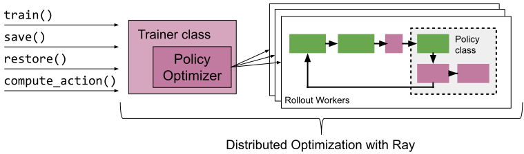
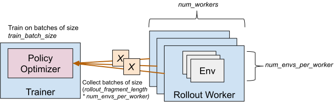

.. include:: /_includes/rllib/announcement.rst

.. include:: /_includes/rllib/we_are_hiring.rst

.. _rllib-getting-started:

Getting Started with RLlib
==========================

At a high level, RLlib provides you with an ``Algorithm`` class which
holds a policy for environment interaction.
Through the algorithm's interface, you can train the policy compute actions, or store
your algorithms.
In multi-agent training, the algorithm manages the querying
and optimization of multiple policies at once.

In this guide, we will first walk you through running your first experiments with
the RLlib CLI, and then discuss our Python API in more detail.

Using the RLlib CLI
-------------------

The quickest way to run your first RLlib algorithm is to use the command line interface.
You can train DQN with the following commands:

.. raw:: html

    

        pip install "ray[rllib]" tensorflow
        rllib train --algo DQN --env CartPole-v1
    

.. margin::

    The ``rllib train`` command (same as the ``train.py`` script in the repo)
    has a number of options you can show by running `rllib train --help`.

Note that you choose any supported RLlib algorithm (``--algo``) and environment (``--env``).
RLlib supports any OpenAI Gym environment, as well as a number of other environments
(see :ref:`rllib-environments-doc`).
It also supports a large number of algorithms (see :ref:`rllib-algorithms-doc`) to
choose from.

Running the above will return one of the `checkpoints` that get generated during training,
as well as a command that you can use to evaluate the trained algorithm.
You can evaluate the trained algorithm with the following command (assuming the checkpoint path is called ``checkpoint``):

.. raw:: html

    

        rllib evaluate checkpoint --algo DQN --env CartPole-v1
    

.. note::

    By default, the results will be logged to a subdirectory of ``~/ray_results``.
    This subdirectory will contain a file ``params.json`` which contains the
    hyper-parameters, a file ``result.json`` which contains a training summary
    for each episode and a TensorBoard file that can be used to visualize
    training process with TensorBoard by running

    .. code-block:: bash

         tensorboard --logdir=~/ray_results

For more advanced evaluation functionality, refer to `Customized Evaluation During Training <#customized-evaluation-during-training>`__.

.. note::

    Each algorithm has specific hyperparameters that can be set with ``--config``,
    see the `algorithms documentation <rllib-algorithms.html>`__ for more information.
    For instance, you can train the A2C algorithm on 8 workers by specifying
    `num_workers: 8` in a JSON string passed to ``--config``:

    .. code-block:: bash

        rllib train --env=PongDeterministic-v4 --run=A2C --config '{"num_workers": 8}'

Running Tuned Examples
----------------------

Some good hyperparameters and settings are available in
`the RLlib repository <https://github.com/ray-project/ray/blob/master/rllib/tuned_examples>`__
(some of them are tuned to run on GPUs).

.. margin::

    If you find better settings or tune an algorithm on a different domain,
    consider submitting a Pull Request!

You can run these with the ``rllib train file`` command as follows:

.. raw:: html

    

        rllib train file /path/to/tuned/example.yaml
    

Note that this works with any local YAML file in the correct format, or with remote URLs
pointing to such files.
If you want to learn more about the RLlib CLI, please check out
the :ref:`RLlib CLI user guide <rllib-cli-doc>`.

.. _rllib-training-api:

Using the Python API
--------------------

The Python API provides the needed flexibility for applying RLlib to new problems.
For instance, you will need to use this API if you wish to use
`custom environments, preprocessors, or models <rllib-models.html>`__ with RLlib.

Here is an example of the basic usage.
We first create a `PPOConfig` and add properties to it, like the `environment` we want
to use, or the `resources` we want to leverage for training.
After we `build` the `algo` from its configuration, we can `train` it for a number of
episodes (here `10`) and `save` the resulting policy periodically
(here every `5` episodes).

.. literalinclude:: ./doc_code/getting_started.py
    :language: python
    :start-after: rllib-first-config-begin
    :end-before: rllib-first-config-end

All RLlib algorithms are compatible with the :ref:`Tune API <tune-api-ref>`.
This enables them to be easily used in experiments with :ref:`Ray Tune <tune-main>`.
For example, the following code performs a simple hyper-parameter sweep of PPO.

.. literalinclude:: ./doc_code/getting_started.py
    :dedent: 4
    :language: python
    :start-after: rllib-tune-config-begin
    :end-before: rllib-tune-config-end

Tune will schedule the trials to run in parallel on your Ray cluster:

::

    == Status ==
    Using FIFO scheduling algorithm.
    Resources requested: 4/4 CPUs, 0/0 GPUs
    Result logdir: ~/ray_results/my_experiment
    PENDING trials:
     - PPO_CartPole-v1_2_lr=0.0001:	PENDING
    RUNNING trials:
     - PPO_CartPole-v1_0_lr=0.01:	RUNNING [pid=21940], 16 s, 4013 ts, 22 rew
     - PPO_CartPole-v1_1_lr=0.001:	RUNNING [pid=21942], 27 s, 8111 ts, 54.7 rew

``Tuner.fit()`` returns an ``ResultGrid`` object that allows further analysis
of the training results and retrieving the checkpoint(s) of the trained agent.

.. literalinclude:: ./doc_code/getting_started.py
    :dedent: 4
    :language: python
    :start-after: rllib-tuner-begin
    :end-before: rllib-tuner-end

.. margin::

    You can find your checkpoint's version by
    looking into the ``rllib_checkpoint.json`` file inside your checkpoint directory.

Loading and restoring a trained algorithm from a checkpoint is simple.
Let's assume you have a local checkpoint directory called ``checkpoint_path``.
To load newer RLlib checkpoints (version >= 1.0), use the following code:

.. code-block:: python

    from ray.rllib.algorithms.algorithm import Algorithm
    algo = Algorithm.from_checkpoint(checkpoint_path)

For older RLlib checkpoint versions (version < 1.0), you can
restore an algorithm via:

.. code-block:: python

    from ray.rllib.algorithms.ppo import PPO
    algo = PPO(config=config, env=env_class)
    algo.restore(checkpoint_path)

Computing Actions
~~~~~~~~~~~~~~~~~

The simplest way to programmatically compute actions from a trained agent is to
use ``Algorithm.compute_single_action()``.
This method preprocesses and filters the observation before passing it to the agent
policy.
Here is a simple example of testing a trained agent for one episode:

.. literalinclude:: ./doc_code/getting_started.py
    :language: python
    :start-after: rllib-compute-action-begin
    :end-before: rllib-compute-action-end

For more advanced usage on computing actions and other functionality,
you can consult the :ref:`RLlib Algorithm API documentation <rllib-algorithm-api>`.

Accessing Policy State
~~~~~~~~~~~~~~~~~~~~~~

It is common to need to access a algorithm's internal state, for instance to set
or get model weights.

In RLlib algorithm state is replicated across multiple *rollout workers* (Ray actors)
in the cluster.
However, you can easily get and update this state between calls to ``train()``
via ``Algorithm.workers.foreach_worker()``
or ``Algorithm.workers.foreach_worker_with_index()``.
These functions take a lambda function that is applied with the worker as an argument.
These functions return values for each worker as a list.

You can also access just the "master" copy of the algorithm state through
``Algorithm.get_policy()`` or ``Algorithm.workers.local_worker()``,
but note that updates here may not be immediately reflected in
your rollout workers (if you have configured ``num_rollout_workers > 0``).
Here's a quick example of how to access state of a model:

.. literalinclude:: ./doc_code/getting_started.py
    :language: python
    :start-after: rllib-get-state-begin
    :end-before: rllib-get-state-end

Accessing Model State
~~~~~~~~~~~~~~~~~~~~~

Similar to accessing policy state, you may want to get a reference to the
underlying neural network model being trained. For example, you may want to
pre-train it separately, or otherwise update its weights outside of RLlib.
This can be done by accessing the ``model`` of the policy.

.. margin::

    To run these examples, you need to install a few extra dependencies, namely
    `pip install "gym[atari]" "gym[accept-rom-license]" atari_py`.

Below you find three explicit examples showing how to access the model state of
an algorithm.

.. dropdown:: **Example: Preprocessing observations for feeding into a model**

    Then for the code:

    .. literalinclude:: doc_code/training.py
        :language: python
        :start-after: __preprocessing_observations_start__
        :end-before: __preprocessing_observations_end__

.. dropdown:: **Example: Querying a policy's action distribution**

    .. literalinclude:: doc_code/training.py
        :language: python
        :start-after: __query_action_dist_start__
        :end-before: __query_action_dist_end__

.. dropdown:: **Example: Getting Q values from a DQN model**

    .. literalinclude:: doc_code/training.py
        :language: python
        :start-after: __get_q_values_dqn_start__
        :end-before: __get_q_values_dqn_end__

    This is especially useful when used with
    `custom model classes <rllib-models.html>`__.

.. _rllib-algo-configuration:

Configuring RLlib Algorithms
----------------------------

You can configure RLlib algorithms in a modular fashion by working with so-called
`AlgorithmConfig` objects.
In essence, you first create a `config = AlgorithmConfig()` object and then call methods
on it to set the desired configuration options.
Each RLlib algorithm has its own config class that inherits from `AlgorithmConfig`.
For instance, to create a `PPO` algorithm, you start with a `PPOConfig` object, to work
with a `DQN` algorithm, you start with a `DQNConfig` object, etc.

.. note::

    Each algorithm has its specific settings, but most configuration options are shared.
    We discuss the common options below, and refer to
    :ref:`the RLlib algorithms guide <rllib-algorithms-doc>` for algorithm-specific
    properties.
    Algorithms differ mostly in their `training` settings.

Below you find the basic signature of the `AlgorithmConfig` class, as well as some
advanced usage examples:

.. autoclass:: ray.rllib.algorithms.algorithm_config.AlgorithmConfig
    :noindex:

As RLlib algorithms are fairly complex, they come with many configuration options.
To make things easier, the common properties of algorithms are naturally grouped into
the following categories:

- :ref:`training options <rllib-config-train>`,
- :ref:`environment options <rllib-config-env>`,
- :ref:`deep learning framework options <rllib-config-framework>`,
- :ref:`rollout worker options <rllib-config-rollouts>`,
- :ref:`evaluation options <rllib-config-evaluation>`,
- :ref:`exploration options <rllib-config-exploration>`,
- :ref:`options for training with offline data <rllib-config-offline_data>`,
- :ref:`options for training multiple agents <rllib-config-multi_agent>`,
- :ref:`reporting options <rllib-config-reporting>`,
- :ref:`options for saving and restoring checkpoints <rllib-config-checkpointing>`,
- :ref:`debugging options <rllib-config-debugging>`,
- :ref:`options for adding callbacks to algorithms <rllib-config-callbacks>`,
- :ref:`Resource options <rllib-config-resources>`
- :ref:`and options for experimental features <rllib-config-experimental>`

Let's discuss each category one by one, starting with training options.

.. _rllib-config-train:

Specifying Training Options
~~~~~~~~~~~~~~~~~~~~~~~~~~~

.. margin::

    For instance, a `DQNConfig` takes a `double_q` `training` argument to specify whether
    to use a double-Q DQN, whereas in a `PPOConfig` this does not make sense.

For individual algorithms, this is probably the most relevant configuration group,
as this is where all the algorithm-specific options go.
But the base configuration for `training` of an `AlgorithmConfig` is actually quite small:

.. automethod:: ray.rllib.algorithms.algorithm_config.AlgorithmConfig.training
    :noindex:

.. _rllib-config-env:

Specifying Environments
~~~~~~~~~~~~~~~~~~~~~~~

.. automethod:: ray.rllib.algorithms.algorithm_config.AlgorithmConfig.environment
    :noindex:

.. _rllib-config-framework:

Specifying Framework Options
~~~~~~~~~~~~~~~~~~~~~~~~~~~~

.. automethod:: ray.rllib.algorithms.algorithm_config.AlgorithmConfig.framework
    :noindex:

.. _rllib-config-rollouts:

Specifying Rollout Workers
~~~~~~~~~~~~~~~~~~~~~~~~~~

.. automethod:: ray.rllib.algorithms.algorithm_config.AlgorithmConfig.rollouts
    :noindex:

.. _rllib-config-evaluation:

Specifying Evaluation Options
~~~~~~~~~~~~~~~~~~~~~~~~~~~~~

.. automethod:: ray.rllib.algorithms.algorithm_config.AlgorithmConfig.evaluation
    :noindex:

.. _rllib-config-exploration:

Specifying Exploration Options
~~~~~~~~~~~~~~~~~~~~~~~~~~~~~~

.. automethod:: ray.rllib.algorithms.algorithm_config.AlgorithmConfig.exploration
    :noindex:

.. _rllib-config-offline_data:

Specifying Offline Data Options
~~~~~~~~~~~~~~~~~~~~~~~~~~~~~~~

.. automethod:: ray.rllib.algorithms.algorithm_config.AlgorithmConfig.offline_data
    :noindex:

.. _rllib-config-multi_agent:

Specifying Multi-Agent Options
~~~~~~~~~~~~~~~~~~~~~~~~~~~~~~

.. automethod:: ray.rllib.algorithms.algorithm_config.AlgorithmConfig.multi_agent
    :noindex:

.. _rllib-config-reporting:

Specifying Reporting Options
~~~~~~~~~~~~~~~~~~~~~~~~~~~~

.. automethod:: ray.rllib.algorithms.algorithm_config.AlgorithmConfig.reporting
    :noindex:

.. _rllib-config-checkpointing:

Specifying Checkpointing Options
~~~~~~~~~~~~~~~~~~~~~~~~~~~~~~~~

.. automethod:: ray.rllib.algorithms.algorithm_config.AlgorithmConfig.checkpointing
    :noindex:

.. _rllib-config-debugging:

Specifying Debugging Options
~~~~~~~~~~~~~~~~~~~~~~~~~~~~

.. automethod:: ray.rllib.algorithms.algorithm_config.AlgorithmConfig.debugging
    :noindex:

.. _rllib-config-callbacks:

Specifying Callback Options
~~~~~~~~~~~~~~~~~~~~~~~~~~~

.. automethod:: ray.rllib.algorithms.algorithm_config.AlgorithmConfig.callbacks
    :noindex:

.. _rllib-config-resources:

Specifying Resources
~~~~~~~~~~~~~~~~~~~~

You can control the degree of parallelism used by setting the ``num_workers``
hyperparameter for most algorithms. The Algorithm will construct that many
"remote worker" instances (`see RolloutWorker class <https://github.com/ray-project/ray/blob/master/rllib/evaluation/rollout_worker.py>`__)
that are constructed as ray.remote actors, plus exactly one "local worker", a ``RolloutWorker`` object that is not a
ray actor, but lives directly inside the Algorithm.
For most algorithms, learning updates are performed on the local worker and sample collection from
one or more environments is performed by the remote workers (in parallel).
For example, setting ``num_workers=0`` will only create the local worker, in which case both
sample collection and training will be done by the local worker.
On the other hand, setting ``num_workers=5`` will create the local worker (responsible for training updates)
and 5 remote workers (responsible for sample collection).

Since learning is most of the time done on the local worker, it may help to provide one or more GPUs
to that worker via the ``num_gpus`` setting.
Similarly, the resource allocation to remote workers can be controlled via ``num_cpus_per_worker``, ``num_gpus_per_worker``, and ``custom_resources_per_worker``.

The number of GPUs can be fractional quantities (e.g. 0.5) to allocate only a fraction
of a GPU. For example, with DQN you can pack five algorithms onto one GPU by setting
``num_gpus: 0.2``. Check out `this fractional GPU example here <https://github.com/ray-project/ray/blob/master/rllib/examples/fractional_gpus.py>`__
as well that also demonstrates how environments (running on the remote workers) that
require a GPU can benefit from the ``num_gpus_per_worker`` setting.

For synchronous algorithms like PPO and A2C, the driver and workers can make use of
the same GPU. To do this for an amount of ``n`` GPUS:

.. code-block:: python

    gpu_count = n
    num_gpus = 0.0001 # Driver GPU
    num_gpus_per_worker = (gpu_count - num_gpus) / num_workers

.. Original image: https://docs.google.com/drawings/d/14QINFvx3grVyJyjAnjggOCEVN-Iq6pYVJ3jA2S6j8z0/edit?usp=sharing

If you specify ``num_gpus`` and your machine does not have the required number of GPUs
available, a RuntimeError will be thrown by the respective worker. On the other hand,
if you set ``num_gpus=0``, your policies will be built solely on the CPU, even if
GPUs are available on the machine.

.. automethod:: ray.rllib.algorithms.algorithm_config.AlgorithmConfig.resources
    :noindex:

.. _rllib-config-experimental:

Specifying Experimental Features
~~~~~~~~~~~~~~~~~~~~~~~~~~~~~~~~

.. automethod:: ray.rllib.algorithms.algorithm_config.AlgorithmConfig.experimental
    :noindex:

.. _rllib-scaling-guide:

RLlib Scaling Guide
-------------------

Here are some rules of thumb for scaling training with RLlib.

1. If the environment is slow and cannot be replicated (e.g., since it requires interaction with physical systems), then you should use a sample-efficient off-policy algorithm such as :ref:`DQN <dqn>` or :ref:`SAC <sac>`. These algorithms default to ``num_workers: 0`` for single-process operation. Make sure to set ``num_gpus: 1`` if you want to use a GPU. Consider also batch RL training with the `offline data <rllib-offline.html>`__ API.

2. If the environment is fast and the model is small (most models for RL are), use time-efficient algorithms such as :ref:`PPO <ppo>`, :ref:`IMPALA <impala>`, or :ref:`APEX <apex>`. These can be scaled by increasing ``num_workers`` to add rollout workers. It may also make sense to enable `vectorization <rllib-env.html#vectorized>`__ for inference. Make sure to set ``num_gpus: 1`` if you want to use a GPU. If the learner becomes a bottleneck, multiple GPUs can be used for learning by setting ``num_gpus > 1``.

3. If the model is compute intensive (e.g., a large deep residual network) and inference is the bottleneck, consider allocating GPUs to workers by setting ``num_gpus_per_worker: 1``. If you only have a single GPU, consider ``num_workers: 0`` to use the learner GPU for inference. For efficient use of GPU time, use a small number of GPU workers and a large number of `envs per worker <rllib-env.html#vectorized>`__.

4. Finally, if both model and environment are compute intensive, then enable `remote worker envs <rllib-env.html#vectorized>`__ with `async batching <rllib-env.html#vectorized>`__ by setting ``remote_worker_envs: True`` and optionally ``remote_env_batch_wait_ms``. This batches inference on GPUs in the rollout workers while letting envs run asynchronously in separate actors, similar to the `SEED <https://ai.googleblog.com/2020/03/massively-scaling-reinforcement.html>`__ architecture. The number of workers and number of envs per worker should be tuned to maximize GPU utilization. If your env requires GPUs to function, or if multi-node SGD is needed, then also consider :ref:`DD-PPO <ddppo>`.

In case you are using lots of workers (``num_workers >> 10``) and you observe worker failures for whatever reasons, which normally interrupt your RLlib training runs, consider using
the config settings ``ignore_worker_failures=True``, ``recreate_failed_workers=True``, or ``restart_failed_sub_environments=True``:

``ignore_worker_failures``: When set to True, your Algorithm will not crash due to a single worker error but continue for as long as there is at least one functional worker remaining.
``recreate_failed_workers``: When set to True, your Algorithm will attempt to replace/recreate any failed worker(s) with newly created one(s). This way, your number of workers will never decrease, even if some of them fail from time to time.
``restart_failed_sub_environments``: When set to True and there is a failure in one of the vectorized sub-environments in one of your workers, the worker will try to recreate only the failed sub-environment and re-integrate the newly created one into your vectorized env stack on that worker.

Note that only one of ``ignore_worker_failures`` or ``recreate_failed_workers`` may be set to True (they are mutually exclusive settings). However,
you can combine each of these with the ``restart_failed_sub_environments=True`` setting.
Using these options will make your training runs much more stable and more robust against occasional OOM or other similar "once in a while" errors on your workers
themselves or inside your environments.

Debugging RLlib Experiments
---------------------------

Gym Monitor
~~~~~~~~~~~

The ``"monitor": true`` config can be used to save Gym episode videos to the result dir. For example:

.. code-block:: bash

    rllib train --env=PongDeterministic-v4 \
        --run=A2C --config '{"num_workers": 2, "monitor": true}'

    # videos will be saved in the ~/ray_results/<experiment> dir, for example
    openaigym.video.0.31401.video000000.meta.json
    openaigym.video.0.31401.video000000.mp4
    openaigym.video.0.31403.video000000.meta.json
    openaigym.video.0.31403.video000000.mp4

Eager Mode
~~~~~~~~~~

Policies built with ``build_tf_policy`` (most of the reference algorithms are)
can be run in eager mode by setting the
``"framework": "tf2"`` / ``"eager_tracing": true`` config options or using
``rllib train --config '{"framework": "tf2"}' [--trace]``.
This will tell RLlib to execute the model forward pass, action distribution,
loss, and stats functions in eager mode.

Eager mode makes debugging much easier, since you can now use line-by-line
debugging with breakpoints or Python ``print()`` to inspect
intermediate tensor values.
However, eager can be slower than graph mode unless tracing is enabled.

Using PyTorch
~~~~~~~~~~~~~

Algorithms that have an implemented TorchPolicy, will allow you to run
`rllib train` using the command line ``--framework=torch`` flag.
Algorithms that do not have a torch version yet will complain with an error in
this case.

Episode Traces
~~~~~~~~~~~~~~

You can use the `data output API <rllib-offline.html>`__ to save episode traces
for debugging. For example, the following command will run PPO while saving episode
traces to ``/tmp/debug``.

.. code-block:: bash

    rllib train --run=PPO --env=CartPole-v0 \
        --config='{"output": "/tmp/debug", "output_compress_columns": []}'

    # episode traces will be saved in /tmp/debug, for example
    output-2019-02-23_12-02-03_worker-2_0.json
    output-2019-02-23_12-02-04_worker-1_0.json

Log Verbosity
~~~~~~~~~~~~~

You can control the log level via the ``"log_level"`` flag. Valid values are "DEBUG",
"INFO", "WARN" (default), and "ERROR". This can be used to increase or decrease the
verbosity of internal logging. You can also use the ``-v`` and ``-vv`` flags.
For example, the following two commands are about equivalent:

.. code-block:: bash

    rllib train --env=PongDeterministic-v4 \
        --run=A2C --config '{"num_workers": 2, "log_level": "DEBUG"}'

    rllib train --env=PongDeterministic-v4 \
        --run=A2C --config '{"num_workers": 2}' -vv

The default log level is ``WARN``. We strongly recommend using at least ``INFO``
level logging for development.

Stack Traces
~~~~~~~~~~~~

You can use the ``ray stack`` command to dump the stack traces of all the
Python workers on a single node. This can be useful for debugging unexpected
hangs or performance issues.
