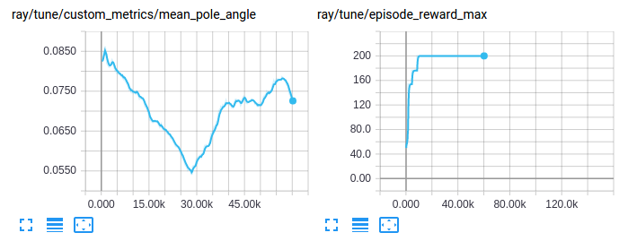

.. include:: /_includes/rllib/announcement.rst

.. include:: /_includes/rllib/we_are_hiring.rst

Training APIs
=============

Getting Started
---------------

At a high level, RLlib provides an ``Algorithm`` class which
holds a policy for environment interaction. Through the algorithm's interface, the policy can
be trained, checkpointed, or an action computed. In multi-agent training, the algorithm manages the querying and optimization of multiple policies at once.

.. image:: images/rllib-api.svg

You can train DQN with the following commands:

.. code-block:: bash

    pip install "ray[rllib]" tensorflow
    rllib train --run DQN --env CartPole-v0  # --config '{"framework": "tf2", "eager_tracing": true}' for eager execution

By default, the results will be logged to a subdirectory of ``~/ray_results``.
This subdirectory will contain a file ``params.json`` which contains the
hyperparameters, a file ``result.json`` which contains a training summary
for each episode and a TensorBoard file that can be used to visualize
training process with TensorBoard by running

.. code-block:: bash

     tensorboard --logdir=~/ray_results

The ``rllib train`` command (same as the ``train.py`` script in the repo) has a number of options you can show by running:

.. code-block:: bash

    rllib train --help
    -or-
    python ray/rllib/train.py --help

The most important options are for choosing the environment
with ``--env`` (any OpenAI gym environment including ones registered by the user
can be used) and for choosing the algorithm with ``--run``
(available options include ``SAC``, ``PPO``, ``PG``, ``A2C``, ``A3C``, ``IMPALA``, ``ES``, ``DDPG``, ``DQN``, ``MARWIL``, ``APEX``, and ``APEX_DDPG``).

Evaluating Trained Policies
~~~~~~~~~~~~~~~~~~~~~~~~~~~

In order to save checkpoints from which to evaluate policies,
set ``--checkpoint-freq`` (number of training iterations between checkpoints)
when running ``rllib train``.
When working with RLlib Algorithms directly (not via ``rllib train``), you can refer to
:ref:`this guide here <rllib-saving-and-loading-algos-and-policies-docs>` on how to produce checkpoints and
restore Algorithms and Policies from them for evaluation.

An example of evaluating a previously trained DQN policy is as follows:

.. code-block:: bash

    rllib rollout \
        ~/ray_results/default/DQN_CartPole-v0_0upjmdgr0/checkpoint_1 \
        --run DQN --env CartPole-v0 --steps 10000

The ``rollout.py`` helper script reconstructs a DQN policy from the checkpoint
located in the directory ``~/ray_results/default/DQN_CartPole-v0_0upjmdgr0/checkpoint_1/``
and renders its behavior in the environment specified by ``--env``.

(Type ``rllib rollout --help`` to see the available evaluation options.)

For more advanced evaluation functionality, refer to `Customized Evaluation During Training <#customized-evaluation-during-training>`__.

Configuration
-------------

Specifying Parameters
~~~~~~~~~~~~~~~~~~~~~

Each algorithm has specific hyperparameters that can be set with ``--config``, in addition to a number of
`common hyperparameters <https://github.com/ray-project/ray/blob/master/rllib/algorithms/algorithm.py>`__
(soon to be replaced by `AlgorithmConfig objects <https://github.com/ray-project/ray/blob/master/rllib/algorithms/algorithm_config.py>`__).

See the `algorithms documentation <rllib-algorithms.html>`__ for more information.

In an example below, we train A2C by specifying 8 workers through the config flag.

.. code-block:: bash

    rllib train --env=PongDeterministic-v4 --run=A2C --config '{"num_workers": 8}'

Specifying Resources
~~~~~~~~~~~~~~~~~~~~

You can control the degree of parallelism used by setting the ``num_workers``
hyperparameter for most algorithms. The Algorithm will construct that many
"remote worker" instances (`see RolloutWorker class <https://github.com/ray-project/ray/blob/master/rllib/evaluation/rollout_worker.py>`__)
that are constructed as ray.remote actors, plus exactly one "local worker", a ``RolloutWorker`` object that is not a
ray actor, but lives directly inside the Algorithm.
For most algorithms, learning updates are performed on the local worker and sample collection from
one or more environments is performed by the remote workers (in parallel).
For example, setting ``num_workers=0`` will only create the local worker, in which case both
sample collection and training will be done by the local worker.
On the other hand, setting ``num_workers=5`` will create the local worker (responsible for training updates)
and 5 remote workers (responsible for sample collection).

Since learning is most of the time done on the local worker, it may help to provide one or more GPUs
to that worker via the ``num_gpus`` setting.
Similarly, the resource allocation to remote workers can be controlled via ``num_cpus_per_worker``, ``num_gpus_per_worker``, and ``custom_resources_per_worker``.

The number of GPUs can be fractional quantities (e.g. 0.5) to allocate only a fraction
of a GPU. For example, with DQN you can pack five algorithms onto one GPU by setting
``num_gpus: 0.2``. Check out `this fractional GPU example here <https://github.com/ray-project/ray/blob/master/rllib/examples/fractional_gpus.py>`__
as well that also demonstrates how environments (running on the remote workers) that
require a GPU can benefit from the ``num_gpus_per_worker`` setting.

For synchronous algorithms like PPO and A2C, the driver and workers can make use of
the same GPU. To do this for an amount of ``n`` GPUS:

.. code-block:: python

    gpu_count = n
    num_gpus = 0.0001 # Driver GPU
    num_gpus_per_worker = (gpu_count - num_gpus) / num_workers

.. Original image: https://docs.google.com/drawings/d/14QINFvx3grVyJyjAnjggOCEVN-Iq6pYVJ3jA2S6j8z0/edit?usp=sharing
.. image:: images/rllib-config.svg

If you specify ``num_gpus`` and your machine does not have the required number of GPUs
available, a RuntimeError will be thrown by the respective worker. On the other hand,
if you set ``num_gpus=0``, your policies will be built solely on the CPU, even if
GPUs are available on the machine.

Scaling Guide
~~~~~~~~~~~~~

.. _rllib-scaling-guide:

Here are some rules of thumb for scaling training with RLlib.

1. If the environment is slow and cannot be replicated (e.g., since it requires interaction with physical systems), then you should use a sample-efficient off-policy algorithm such as :ref:`DQN <dqn>` or :ref:`SAC <sac>`. These algorithms default to ``num_workers: 0`` for single-process operation. Make sure to set ``num_gpus: 1`` if you want to use a GPU. Consider also batch RL training with the `offline data <rllib-offline.html>`__ API.

2. If the environment is fast and the model is small (most models for RL are), use time-efficient algorithms such as :ref:`PPO <ppo>`, :ref:`IMPALA <impala>`, or :ref:`APEX <apex>`. These can be scaled by increasing ``num_workers`` to add rollout workers. It may also make sense to enable `vectorization <rllib-env.html#vectorized>`__ for inference. Make sure to set ``num_gpus: 1`` if you want to use a GPU. If the learner becomes a bottleneck, multiple GPUs can be used for learning by setting ``num_gpus > 1``.

3. If the model is compute intensive (e.g., a large deep residual network) and inference is the bottleneck, consider allocating GPUs to workers by setting ``num_gpus_per_worker: 1``. If you only have a single GPU, consider ``num_workers: 0`` to use the learner GPU for inference. For efficient use of GPU time, use a small number of GPU workers and a large number of `envs per worker <rllib-env.html#vectorized>`__.

4. Finally, if both model and environment are compute intensive, then enable `remote worker envs <rllib-env.html#vectorized>`__ with `async batching <rllib-env.html#vectorized>`__ by setting ``remote_worker_envs: True`` and optionally ``remote_env_batch_wait_ms``. This batches inference on GPUs in the rollout workers while letting envs run asynchronously in separate actors, similar to the `SEED <https://ai.googleblog.com/2020/03/massively-scaling-reinforcement.html>`__ architecture. The number of workers and number of envs per worker should be tuned to maximize GPU utilization. If your env requires GPUs to function, or if multi-node SGD is needed, then also consider :ref:`DD-PPO <ddppo>`.

In case you are using lots of workers (``num_workers >> 10``) and you observe worker failures for whatever reasons, which normally interrupt your RLlib training runs, consider using
the config settings ``ignore_worker_failures=True``, ``recreate_failed_workers=True``, or ``restart_failed_sub_environments=True``:

``ignore_worker_failures``: When set to True, your Algorithm will not crash due to a single worker error but continue for as long as there is at least one functional worker remaining.
``recreate_failed_workers``: When set to True, your Algorithm will attempt to replace/recreate any failed worker(s) with newly created one(s). This way, your number of workers will never decrease, even if some of them fail from time to time.
``restart_failed_sub_environments``: When set to True and there is a failure in one of the vectorized sub-environments in one of your workers, the worker will try to recreate only the failed sub-environment and re-integrate the newly created one into your vectorized env stack on that worker.

Note that only one of ``ignore_worker_failures`` or ``recreate_failed_workers`` may be set to True (they are mutually exclusive settings). However,
you can combine each of these with the ``restart_failed_sub_environments=True`` setting.
Using these options will make your training runs much more stable and more robust against occasional OOM or other similar "once in a while" errors on your workers
themselves or inside your environments.

Common Parameters
~~~~~~~~~~~~~~~~~

.. tip::
    Plain python config dicts will soon be replaced by :py:class:`~ray.rllib.algorithms.algorithm_config.AlgorithmConfig`
    objects, which have the advantage of being type safe, allowing users to set different config settings within
    meaningful sub-categories (e.g. ``my_config.training(lr=0.0003)``), and offer the ability to
    construct an Algorithm instance from these config objects (via their ``build()`` method).

The following is a list of the common algorithm hyper-parameters:

.. code-block:: python

    # === Settings for Rollout Worker processes ===
    # Number of rollout worker actors to create for parallel sampling. Setting
    # this to 0 will force rollouts to be done in the algorithm's actor.
    "num_workers": 2,
    # Number of environments to evaluate vector-wise per worker. This enables
    # model inference batching, which can improve performance for inference
    # bottlenecked workloads.
    "num_envs_per_worker": 1,
    # When `num_workers` > 0, the driver (local_worker; worker-idx=0) does not
    # need an environment. This is because it doesn't have to sample (done by
    # remote_workers; worker_indices > 0) nor evaluate (done by evaluation
    # workers; see below).
    "create_env_on_driver": False,
    # Divide episodes into fragments of this many steps each during rollouts.
    # Sample batches of this size are collected from rollout workers and
    # combined into a larger batch of `train_batch_size` for learning.
    #
    # For example, given rollout_fragment_length=100 and train_batch_size=1000:
    #   1. RLlib collects 10 fragments of 100 steps each from rollout workers.
    #   2. These fragments are concatenated and we perform an epoch of SGD.
    #
    # When using multiple envs per worker, the fragment size is multiplied by
    # `num_envs_per_worker`. This is since we are collecting steps from
    # multiple envs in parallel. For example, if num_envs_per_worker=5, then
    # rollout workers will return experiences in chunks of 5*100 = 500 steps.
    #
    # The dataflow here can vary per algorithm. For example, PPO further
    # divides the train batch into minibatches for multi-epoch SGD.
    "rollout_fragment_length": 200,
    # How to build per-Sampler (RolloutWorker) batches, which are then
    # usually concat'd to form the train batch. Note that "steps" below can
    # mean different things (either env- or agent-steps) and depends on the
    # `count_steps_by` (multiagent) setting below.
    # truncate_episodes: Each produced batch (when calling
    #   RolloutWorker.sample()) will contain exactly `rollout_fragment_length`
    #   steps. This mode guarantees evenly sized batches, but increases
    #   variance as the future return must now be estimated at truncation
    #   boundaries.
    # complete_episodes: Each unroll happens exactly over one episode, from
    #   beginning to end. Data collection will not stop unless the episode
    #   terminates or a configured horizon (hard or soft) is hit.
    "batch_mode": "truncate_episodes",

    # === Settings for the Algorithm process ===
    # Discount factor of the MDP.
    "gamma": 0.99,
    # The default learning rate.
    "lr": 0.0001,
    # Training batch size, if applicable. Should be >= rollout_fragment_length.
    # Samples batches will be concatenated together to a batch of this size,
    # which is then passed to SGD.
    "train_batch_size": 200,
    # Arguments to pass to the policy model. See models/catalog.py for a full
    # list of the available model options.
    "model": MODEL_DEFAULTS,
    # Arguments to pass to the policy optimizer. These vary by optimizer.
    "optimizer": {},

    # === Environment Settings ===
    # Number of steps after which the episode is forced to terminate. Defaults
    # to `env.spec.max_episode_steps` (if present) for Gym envs.
    "horizon": None,
    # Calculate rewards but don't reset the environment when the horizon is
    # hit. This allows value estimation and RNN state to span across logical
    # episodes denoted by horizon. This only has an effect if horizon != inf.
    "soft_horizon": False,
    # Don't set 'done' at the end of the episode.
    # In combination with `soft_horizon`, this works as follows:
    # - no_done_at_end=False soft_horizon=False:
    #   Reset env and add `done=True` at end of each episode.
    # - no_done_at_end=True soft_horizon=False:
    #   Reset env, but do NOT add `done=True` at end of the episode.
    # - no_done_at_end=False soft_horizon=True:
    #   Do NOT reset env at horizon, but add `done=True` at the horizon
    #   (pretending the episode has terminated).
    # - no_done_at_end=True soft_horizon=True:
    #   Do NOT reset env at horizon and do NOT add `done=True` at the horizon.
    "no_done_at_end": False,
    # The environment specifier:
    # This can either be a tune-registered env, via
    # `tune.register_env([name], lambda env_ctx: [env object])`,
    # or a string specifier of an RLlib supported type. In the latter case,
    # RLlib will try to interpret the specifier as either an openAI gym env,
    # a PyBullet env, a ViZDoomGym env, or a fully qualified classpath to an
    # Env class, e.g. "ray.rllib.examples.env.random_env.RandomEnv".
    "env": None,
    # The observation- and action spaces for the Policies of this Algorithm.
    # Use None for automatically inferring these from the given env.
    "observation_space": None,
    "action_space": None,
    # Arguments dict passed to the env creator as an EnvContext object (which
    # is a dict plus the properties: num_workers, worker_index, vector_index,
    # and remote).
    "env_config": {},
    # If using num_envs_per_worker > 1, whether to create those new envs in
    # remote processes instead of in the same worker. This adds overheads, but
    # can make sense if your envs can take much time to step / reset
    # (e.g., for StarCraft). Use this cautiously; overheads are significant.
    "remote_worker_envs": False,
    # Timeout that remote workers are waiting when polling environments.
    # 0 (continue when at least one env is ready) is a reasonable default,
    # but optimal value could be obtained by measuring your environment
    # step / reset and model inference perf.
    "remote_env_batch_wait_ms": 0,
    # A callable taking the last train results, the base env and the env
    # context as args and returning a new task to set the env to.
    # The env must be a `TaskSettableEnv` sub-class for this to work.
    # See `examples/curriculum_learning.py` for an example.
    "env_task_fn": None,
    # If True, try to render the environment on the local worker or on worker
    # 1 (if num_workers > 0). For vectorized envs, this usually means that only
    # the first sub-environment will be rendered.
    # In order for this to work, your env will have to implement the
    # `render()` method which either:
    # a) handles window generation and rendering itself (returning True) or
    # b) returns a numpy uint8 image of shape [height x width x 3 (RGB)].
    "render_env": False,
    # Whether to clip rewards during Policy's postprocessing.
    # None (default): Clip for Atari only (r=sign(r)).
    # True: r=sign(r): Fixed rewards -1.0, 1.0, or 0.0.
    # False: Never clip.
    # [float value]: Clip at -value and + value.
    # Tuple[value1, value2]: Clip at value1 and value2.
    "clip_rewards": None,
    # If True, RLlib will learn entirely inside a normalized action space
    # (0.0 centered with small stddev; only affecting Box components).
    # We will unsquash actions (and clip, just in case) to the bounds of
    # the env's action space before sending actions back to the env.
    "normalize_actions": True,
    # If True, RLlib will clip actions according to the env's bounds
    # before sending them back to the env.
    # TODO: (sven) This option should be obsoleted and always be False.
    "clip_actions": False,
    # Whether to use "rllib" or "deepmind" preprocessors by default
    # Set to None for using no preprocessor. In this case, the model will have
    # to handle possibly complex observations from the environment.
    "preprocessor_pref": "deepmind",

    # === Debug Settings ===
    # Set the ray.rllib.* log level for the agent process and its workers.
    # Should be one of DEBUG, INFO, WARN, or ERROR. The DEBUG level will also
    # periodically print out summaries of relevant internal dataflow (this is
    # also printed out once at startup at the INFO level). When using the
    # `rllib train` command, you can also use the `-v` and `-vv` flags as
    # shorthand for INFO and DEBUG.
    "log_level": "WARN",
    # Callbacks that will be run during various phases of training. See the
    # `DefaultCallbacks` class and `examples/custom_metrics_and_callbacks.py`
    # for more usage information.
    "callbacks": DefaultCallbacks,
    # Whether to attempt to continue training if a worker crashes. The number
    # of currently healthy workers is reported as the "num_healthy_workers"
    # metric.
    "ignore_worker_failures": False,
    # Whether - upon a worker failure - RLlib will try to recreate the lost worker as
    # an identical copy of the failed one. The new worker will only differ from the
    # failed one in its `self.recreated_worker=True` property value. It will have
    # the same `worker_index` as the original one.
    # If True, the `ignore_worker_failures` setting will be ignored.
    "recreate_failed_workers": False,
    # Log system resource metrics to results. This requires `psutil` to be
    # installed for sys stats, and `gputil` for GPU metrics.
    "log_sys_usage": True,
    # Use fake (infinite speed) sampler. For testing only.
    "fake_sampler": False,

    # === Deep Learning Framework Settings ===
    # tf: TensorFlow (static-graph)
    # tf2: TensorFlow 2.x (eager or traced, if eager_tracing=True)
    # torch: PyTorch
    "framework": "tf",
    # Enable tracing in eager mode. This greatly improves performance
    # (speedup ~2x), but makes it slightly harder to debug since Python
    # code won't be evaluated after the initial eager pass.
    # Only supported if framework=tf2.
    "eager_tracing": False,
    # Maximum number of tf.function re-traces before a runtime error is raised.
    # This is to prevent unnoticed retraces of methods inside the
    # `..._eager_traced` Policy, which could slow down execution by a
    # factor of 4, without the user noticing what the root cause for this
    # slowdown could be.
    # Only supported for framework=tf2.
    # Set to None to ignore the re-trace count and never throw an error.
    "eager_max_retraces": 20,

    # === Exploration Settings ===
    # Default exploration behavior, iff `explore`=None is passed into
    # compute_action(s).
    # Set to False for no exploration behavior (e.g., for evaluation).
    "explore": True,
    # Provide a dict specifying the Exploration object's config.
    "exploration_config": {
        # The Exploration class to use. In the simplest case, this is the name
        # (str) of any class present in the `rllib.utils.exploration` package.
        # You can also provide the python class directly or the full location
        # of your class (e.g. "ray.rllib.utils.exploration.epsilon_greedy.
        # EpsilonGreedy").
        "type": "StochasticSampling",
        # Add constructor kwargs here (if any).
    },
    # === Evaluation Settings ===
    # Evaluate with every `evaluation_interval` training iterations.
    # The evaluation stats will be reported under the "evaluation" metric key.
    # Note that for Ape-X metrics are already only reported for the lowest
    # epsilon workers (least random workers).
    # Set to None (or 0) for no evaluation.
    "evaluation_interval": None,
    # Duration for which to run evaluation each `evaluation_interval`.
    # The unit for the duration can be set via `evaluation_duration_unit` to
    # either "episodes" (default) or "timesteps".
    # If using multiple evaluation workers (evaluation_num_workers > 1),
    # the load to run will be split amongst these.
    # If the value is "auto":
    # - For `evaluation_parallel_to_training=True`: Will run as many
    #   episodes/timesteps that fit into the (parallel) training step.
    # - For `evaluation_parallel_to_training=False`: Error.
    "evaluation_duration": 10,
    # The unit, with which to count the evaluation duration. Either "episodes"
    # (default) or "timesteps".
    "evaluation_duration_unit": "episodes",
    # Whether to run evaluation in parallel to a Algorithm.train() call
    # using threading. Default=False.
    # E.g. evaluation_interval=2 -> For every other training iteration,
    # the Algorithm.train() and Algorithm.evaluate() calls run in parallel.
    # Note: This is experimental. Possible pitfalls could be race conditions
    # for weight synching at the beginning of the evaluation loop.
    "evaluation_parallel_to_training": False,
    # Internal flag that is set to True for evaluation workers.
    "in_evaluation": False,
    # Typical usage is to pass extra args to evaluation env creator
    # and to disable exploration by computing deterministic actions.
    # IMPORTANT NOTE: Policy gradient algorithms are able to find the optimal
    # policy, even if this is a stochastic one. Setting "explore=False" here
    # will result in the evaluation workers not using this optimal policy!
    "evaluation_config": {
        # Example: overriding env_config, exploration, etc:
        # "env_config": {...},
        # "explore": False
    },

    # Number of parallel workers to use for evaluation. Note that this is set
    # to zero by default, which means evaluation will be run in the algorithm
    # process (only if evaluation_interval is not None). If you increase this,
    # it will increase the Ray resource usage of the algorithm since evaluation
    # workers are created separately from rollout workers (used to sample data
    # for training).
    "evaluation_num_workers": 0,
    # Customize the evaluation method. This must be a function of signature
    # (algorithm: Algorithm, eval_workers: WorkerSet) -> metrics: dict. See the
    # Algorithm.evaluate() method to see the default implementation.
    # The Algorithm guarantees all eval workers have the latest policy state
    # before this function is called.
    "custom_eval_function": None,
    # Make sure the latest available evaluation results are always attached to
    # a step result dict.
    # This may be useful if Tune or some other meta controller needs access
    # to evaluation metrics all the time.
    "always_attach_evaluation_results": False,
    # Store raw custom metrics without calculating max, min, mean
    "keep_per_episode_custom_metrics": False,

    # === Advanced Rollout Settings ===
    # Use a background thread for sampling (slightly off-policy, usually not
    # advisable to turn on unless your env specifically requires it).
    "sample_async": False,

    # The SampleCollector class to be used to collect and retrieve
    # environment-, model-, and sampler data. Override the SampleCollector base
    # class to implement your own collection/buffering/retrieval logic.
    "sample_collector": SimpleListCollector,

    # Element-wise observation filter, either "NoFilter" or "MeanStdFilter".
    "observation_filter": "NoFilter",
    # Whether to synchronize the statistics of remote filters.
    "synchronize_filters": True,
    # Configures TF for single-process operation by default.
    "tf_session_args": {
        # note: overridden by `local_tf_session_args`
        "intra_op_parallelism_threads": 2,
        "inter_op_parallelism_threads": 2,
        "gpu_options": {
            "allow_growth": True,
        },
        "log_device_placement": False,
        "device_count": {
            "CPU": 1
        },
        # Required by multi-GPU (num_gpus > 1).
        "allow_soft_placement": True,
    },
    # Override the following tf session args on the local worker
    "local_tf_session_args": {
        # Allow a higher level of parallelism by default, but not unlimited
        # since that can cause crashes with many concurrent drivers.
        "intra_op_parallelism_threads": 8,
        "inter_op_parallelism_threads": 8,
    },
    # Whether to LZ4 compress individual observations.
    "compress_observations": False,
    # Wait for metric batches for at most this many seconds. Those that
    # have not returned in time will be collected in the next train iteration.
    "metrics_episode_collection_timeout_s": 180,
    # Smooth metrics over this many episodes.
    "metrics_num_episodes_for_smoothing": 100,
    # Minimum time interval over which to accumulate within a single `train()` call.
    # This value does not affect learning, only the number of times
    # `self.step_attempt()` is called by `self.train()`.
    # If - after one `step_attempt()`, the time limit has not been reached,
    # will perform n more `step_attempt()` calls until this minimum time has been
    # consumed. Set to 0 for no minimum time.
    "min_time_s_per_iteration": 0,
    # Minimum train/sample timesteps to accumulate within a single `train()` call.
    # This value does not affect learning, only the number of times
    # `self.step_attempt()` is called by `self.train()`.
    # If - after one `step_attempt()`, the timestep counts (sampling or
    # training) have not been reached, will perform n more `step_attempt()`
    # calls until the minimum timesteps have been executed.
    # Set to 0 for no minimum timesteps.
    "min_train_timesteps_per_iteration": 0,
    "min_sample_timesteps_per_iteration": 0,

    # This argument, in conjunction with worker_index, sets the random seed of
    # each worker, so that identically configured trials will have identical
    # results. This makes experiments reproducible.
    "seed": None,
    # Any extra python env vars to set in the algorithm process, e.g.,
    # {"OMP_NUM_THREADS": "16"}
    "extra_python_environs_for_driver": {},
    # The extra python environments need to set for worker processes.
    "extra_python_environs_for_worker": {},

    # === Resource Settings ===
    # Number of GPUs to allocate to the algorithm process. Note that not all
    # algorithms can take advantage of GPUs. Support for multi-GPU
    # is currently only available for tf-[PPO/IMPALA/DQN/PG].
    # This can be fractional (e.g., 0.3 GPUs).
    "num_gpus": 0,
    # Set to True for debugging (multi-)?GPU funcitonality on a CPU machine.
    # GPU towers will be simulated by graphs located on CPUs in this case.
    # Use `num_gpus` to test for different numbers of fake GPUs.
    "_fake_gpus": False,
    # Number of CPUs to allocate per worker.
    "num_cpus_per_worker": 1,
    # Number of GPUs to allocate per worker. This can be fractional. This is
    # usually needed only if your env itself requires a GPU (i.e., it is a
    # GPU-intensive video game), or model inference is unusually expensive.
    "num_gpus_per_worker": 0,
    # Any custom Ray resources to allocate per worker.
    "custom_resources_per_worker": {},
    # Number of CPUs to allocate for the algorithm. Note: this only takes effect
    # when running in Tune. Otherwise, the algorithm runs in the main program.
    "num_cpus_for_driver": 1,
    # The strategy for the placement group factory returned by
    # `Algorithm.default_resource_request()`. A PlacementGroup defines, which
    # devices (resources) should always be co-located on the same node.
    # For example, an Algorithm with 2 rollout workers, running with
    # num_gpus=1 will request a placement group with the bundles:
    # [{"gpu": 1, "cpu": 1}, {"cpu": 1}, {"cpu": 1}], where the first bundle is
    # for the driver and the other 2 bundles are for the two workers.
    # These bundles can now be "placed" on the same or different
    # nodes depending on the value of `placement_strategy`:
    # "PACK": Packs bundles into as few nodes as possible.
    # "SPREAD": Places bundles across distinct nodes as even as possible.
    # "STRICT_PACK": Packs bundles into one node. The group is not allowed
    #   to span multiple nodes.
    # "STRICT_SPREAD": Packs bundles across distinct nodes.
    "placement_strategy": "PACK",

    # === Offline Datasets ===
    # Specify how to generate experiences:
    #  - "sampler": Generate experiences via online (env) simulation (default).
    #  - A local directory or file glob expression (e.g., "/tmp/*.json").
    #  - A list of individual file paths/URIs (e.g., ["/tmp/1.json",
    #    "s3://bucket/2.json"]).
    #  - A dict with string keys and sampling probabilities as values (e.g.,
    #    {"sampler": 0.4, "/tmp/*.json": 0.4, "s3://bucket/expert.json": 0.2}).
    #  - A callable that takes an `IOContext` object as only arg and returns a
    #    ray.rllib.offline.InputReader.
    #  - A string key that indexes a callable with tune.registry.register_input
    "input": "sampler",
    # Arguments accessible from the IOContext for configuring custom input
    "input_config": {},
    # True, if the actions in a given offline "input" are already normalized
    # (between -1.0 and 1.0). This is usually the case when the offline
    # file has been generated by another RLlib algorithm (e.g. PPO or SAC),
    # while "normalize_actions" was set to True.
    "actions_in_input_normalized": False,
    # Specify how to evaluate the current policy. This only has an effect when
    # reading offline experiences ("input" is not "sampler").
    # Available options:
    #  - "simulation": Run the environment in the background, but use
    #    this data for evaluation only and not for learning.
    #  - Any subclass of OffPolicyEstimator, e.g.
    #    ray.rllib.offline.estimators.is::ImportanceSampling or your own custom
    #    subclass.
    "off_policy_estimation_methods": {
        "is": {
            "type": ImportanceSampling,
        },
        "wis": {
            "type": WeightedImportanceSampling,
        }
    },
    # Whether to run postprocess_trajectory() on the trajectory fragments from
    # offline inputs. Note that postprocessing will be done using the *current*
    # policy, not the *behavior* policy, which is typically undesirable for
    # on-policy algorithms.
    "postprocess_inputs": False,
    # If positive, input batches will be shuffled via a sliding window buffer
    # of this number of batches. Use this if the input data is not in random
    # enough order. Input is delayed until the shuffle buffer is filled.
    "shuffle_buffer_size": 0,
    # Specify where experiences should be saved:
    #  - None: don't save any experiences
    #  - "logdir" to save to the agent log dir
    #  - a path/URI to save to a custom output directory (e.g., "s3://bucket/")
    #  - a function that returns a rllib.offline.OutputWriter
    "output": None,
    # Arguments accessible from the IOContext for configuring custom output
    "output_config": {},
    # What sample batch columns to LZ4 compress in the output data.
    "output_compress_columns": ["obs", "new_obs"],
    # Max output file size (in bytes) before rolling over to a new file.
    "output_max_file_size": 64 * 1024 * 1024,

    # === Settings for Multi-Agent Environments ===
    "multiagent": {
        # Map of type MultiAgentPolicyConfigDict from policy ids to tuples
        # of (policy_cls, obs_space, act_space, config). This defines the
        # observation and action spaces of the policies and any extra config.
        "policies": {},
        # Keep this many policies in the "policy_map" (before writing
        # least-recently used ones to disk/S3).
        "policy_map_capacity": 100,
        # Where to store overflowing (least-recently used) policies?
        # Could be a directory (str) or an S3 location. None for using
        # the default output dir.
        "policy_map_cache": None,
        # Function mapping agent ids to policy ids.
        "policy_mapping_fn": None,
        # Determines those policies that should be updated.
        # Options are:
        # - None, for all policies.
        # - An iterable of PolicyIDs that should be updated.
        # - A callable, taking a PolicyID and a SampleBatch or MultiAgentBatch
        #   and returning a bool (indicating whether the given policy is trainable
        #   or not, given the particular batch). This allows you to have a policy
        #   trained only on certain data (e.g. when playing against a certain
        #   opponent).
        "policies_to_train": None,
        # Optional function that can be used to enhance the local agent
        # observations to include more state.
        # See rllib/evaluation/observation_function.py for more info.
        "observation_fn": None,
        # When replay_mode=lockstep, RLlib will replay all the agent
        # transitions at a particular timestep together in a batch. This allows
        # the policy to implement differentiable shared computations between
        # agents it controls at that timestep. When replay_mode=independent,
        # transitions are replayed independently per policy.
        "replay_mode": "independent",
        # Which metric to use as the "batch size" when building a
        # MultiAgentBatch. The two supported values are:
        # env_steps: Count each time the env is "stepped" (no matter how many
        #   multi-agent actions are passed/how many multi-agent observations
        #   have been returned in the previous step).
        # agent_steps: Count each individual agent step as one step.
        "count_steps_by": "env_steps",
    },

    # === Logger ===
    # Define logger-specific configuration to be used inside Logger
    # Default value None allows overwriting with nested dicts
    "logger_config": None,

    # === API deprecations/simplifications/changes ===
    # If True, the execution plan API will not be used. Instead,
    # a Algorithm's `training_step()` method will be called on each
    # training iteration.
    "_disable_execution_plan_api": True,

    # Experimental flag.
    # If True, TFPolicy will handle more than one loss/optimizer.
    # Set this to True, if you would like to return more than
    # one loss term from your `loss_fn` and an equal number of optimizers
    # from your `optimizer_fn`.
    # In the future, the default for this will be True.
    "_tf_policy_handles_more_than_one_loss": False,
    # Experimental flag.
    # If True, no (observation) preprocessor will be created and
    # observations will arrive in model as they are returned by the env.
    # In the future, the default for this will be True.
    "_disable_preprocessor_api": False,
    # Experimental flag.
    # If True, RLlib will no longer flatten the policy-computed actions into
    # a single tensor (for storage in SampleCollectors/output files/etc..),
    # but leave (possibly nested) actions as-is. Disabling flattening affects:
    # - SampleCollectors: Have to store possibly nested action structs.
    # - Models that have the previous action(s) as part of their input.
    # - Algorithms reading from offline files (incl. action information).
    "_disable_action_flattening": False,

    # If True, disable the environment pre-checking module.
    "disable_env_checking": False,

Tuned Examples
~~~~~~~~~~~~~~

Some good hyperparameters and settings are available in
`the repository <https://github.com/ray-project/ray/blob/master/rllib/tuned_examples>`__
(some of them are tuned to run on GPUs). If you find better settings or tune
an algorithm on a different domain, consider submitting a Pull Request!

You can run these with the ``rllib train`` command as follows:

.. code-block:: bash

    rllib train -f /path/to/tuned/example.yaml

Basic Python API
----------------

The Python API provides the needed flexibility for applying RLlib to new problems. You will need to use this API if you wish to use `custom environments, preprocessors, or models <rllib-models.html>`__ with RLlib.

Here is an example of the basic usage (for a more complete example, see `custom_env.py <https://github.com/ray-project/ray/blob/master/rllib/examples/custom_env.py>`__):

.. code-block:: python

    import ray
    import ray.rllib.algorithms.ppo as ppo
    from ray.tune.logger import pretty_print

    ray.init()
    config = ppo.DEFAULT_CONFIG.copy()
    config["num_gpus"] = 0
    config["num_workers"] = 1
    algo = ppo.PPO(config=config, env="CartPole-v0")

    # Can optionally call algo.restore(path) to load a checkpoint.

    for i in range(1000):
       # Perform one iteration of training the policy with PPO
       result = algo.train()
       print(pretty_print(result))

       if i % 100 == 0:
           checkpoint_dir = algo.save()
           print(f"Checkpoint saved in directory {checkpoint_dir}")

    # Also, in case you have trained a model outside of ray/RLlib and have created
    # an h5-file with weight values in it, e.g.
    # my_keras_model_trained_outside_rllib.save_weights("model.h5")
    # (see: https://keras.io/models/about-keras-models/)

    # ... you can load the h5-weights into your Algorithm's Policy's ModelV2
    # (tf or torch) by doing:
    algo.import_model("my_weights.h5")
    # NOTE: In order for this to work, your (custom) model needs to implement
    # the `import_from_h5` method.
    # See https://github.com/ray-project/ray/blob/master/rllib/tests/test_model_imports.py
    # for detailed examples for tf- and torch policies/models.

.. note::

    It's recommended that you run RLlib algorithms with :ref:`Ray Tune <tune-main>`, for easy experiment management and visualization of results. Just set ``"run": ALG_NAME, "env": ENV_NAME`` in the experiment config.

All RLlib algorithms are compatible with the :ref:`Tune API <tune-60-seconds>`. This enables them to be easily used in experiments with :ref:`Ray Tune <tune-main>`. For example, the following code performs a simple hyperparam sweep of PPO:

.. code-block:: python

    import ray
    from ray import air, tune

    ray.init()
    tune.Tuner(
        "PPO",
        run_config=air.RunConfig(stop={"episode_reward_mean": 200},),
        param_space={
            "env": "CartPole-v0",
            "num_gpus": 0,
            "num_workers": 1,
            "lr": tune.grid_search([0.01, 0.001, 0.0001]),
        },
    ).fit()

Tune will schedule the trials to run in parallel on your Ray cluster:

::

    == Status ==
    Using FIFO scheduling algorithm.
    Resources requested: 4/4 CPUs, 0/0 GPUs
    Result logdir: ~/ray_results/my_experiment
    PENDING trials:
     - PPO_CartPole-v0_2_lr=0.0001:	PENDING
    RUNNING trials:
     - PPO_CartPole-v0_0_lr=0.01:	RUNNING [pid=21940], 16 s, 4013 ts, 22 rew
     - PPO_CartPole-v0_1_lr=0.001:	RUNNING [pid=21942], 27 s, 8111 ts, 54.7 rew

``Tuner.fit()`` returns an ``ResultGrid`` object that allows further analysis of the training results and retrieving the checkpoint(s) of the trained agent.

.. code-block:: python

    # ``Tuner.fit()`` allows setting a custom log directory (other than ``~/ray-results``)
    results = ray.tune.Tuner(
        ppo.PPO,
        param_space=config,
        run_config=air.RunConfig(
            local_dir=log_dir,
            stop=stop_criteria,
            checkpoint_config=air.CheckpointConfig(checkpoint_at_end=True),
        )).fit()

    # list of lists: one list per checkpoint; each checkpoint list contains
    # 1st the path, 2nd the metric value
    checkpoints = analysis.get_trial_checkpoints_paths(
        trial=analysis.get_best_trial("episode_reward_mean"),
        metric="episode_reward_mean")

    # or simply get the last checkpoint (with highest "training_step")
    last_checkpoint = analysis.get_last_checkpoint()
    # if there are multiple trials, select a specific trial or automatically
    # choose the best one according to a given metric
    last_checkpoint = analysis.get_last_checkpoint(
        metric="episode_reward_mean", mode="max"
    )

Loading and restoring a trained algorithm from a checkpoint is simple.
For RLlib checkpoint versions of >= v1.0 (you can find your checkpoint's version by
looking into the ``rllib_checkpoint.json`` file inside your checkpoint directory), do:

.. code-block:: python

    from ray.rllib.algorithms.algorithm import Algorithm
    algo = Algorithm.from_checkpoint(checkpoint_path)

For older RLlib checkpoint versions (v0.1), you can still restore an algorithm via:

.. code-block:: python

    from ray.rllib.algorithms.ppo import PPO
    algo = PPO(config=config, env=env_class)
    algo.restore(checkpoint_path)

Computing Actions
~~~~~~~~~~~~~~~~~

The simplest way to programmatically compute actions from a trained agent is to use ``Algorithm.compute_action()``.
This method preprocesses and filters the observation before passing it to the agent policy.
Here is a simple example of testing a trained agent for one episode:

.. code-block:: python

    # instantiate env class
    env = env_class(env_config)

    # run until episode ends
    episode_reward = 0
    done = False
    obs = env.reset()
    while not done:
        action = agent.compute_action(obs)
        obs, reward, done, info = env.step(action)
        episode_reward += reward

For more advanced usage, you can access the ``workers`` and policies held by the algorithm
directly as ``compute_action()`` does:

.. code-block:: python

  class Algorithm(Trainable):

    @PublicAPI
    def compute_action(self,
                       observation,
                       state=None,
                       prev_action=None,
                       prev_reward=None,
                       info=None,
                       policy_id=DEFAULT_POLICY_ID,
                       full_fetch=False):
        """Computes an action for the specified policy.

        Note that you can also access the policy object through
        self.get_policy(policy_id) and call compute_actions() on it directly.

        Args:
            observation (obj): observation from the environment.
            state (list): RNN hidden state, if any. If state is not None,
                          then all of compute_single_action(...) is returned
                          (computed action, rnn state, logits dictionary).
                          Otherwise compute_single_action(...)[0] is
                          returned (computed action).
            prev_action (obj): previous action value, if any
            prev_reward (int): previous reward, if any
            info (dict): info object, if any
            policy_id (str): policy to query (only applies to multi-agent).
            full_fetch (bool): whether to return extra action fetch results.
                This is always set to true if RNN state is specified.

        Returns:
            Just the computed action if full_fetch=False, or the full output
            of policy.compute_actions() otherwise.
        """

        if state is None:
            state = []
        preprocessed = self.workers.local_worker().preprocessors[
            policy_id].transform(observation)
        filtered_obs = self.workers.local_worker().filters[policy_id](
            preprocessed, update=False)
        if state:
            return self.get_policy(policy_id).compute_single_action(
                filtered_obs,
                state,
                prev_action,
                prev_reward,
                info,
                clip_actions=self.config["clip_actions"])
        res = self.get_policy(policy_id).compute_single_action(
            filtered_obs,
            state,
            prev_action,
            prev_reward,
            info,
            clip_actions=self.config["clip_actions"])
        if full_fetch:
            return res
        else:
            return res[0]  # backwards compatibility

Accessing Policy State
~~~~~~~~~~~~~~~~~~~~~~
It is common to need to access a algorithm's internal state, e.g., to set or get internal weights.
In RLlib algorithm state is replicated across multiple *rollout workers* (Ray actors) in the cluster.
However, you can easily get and update this state between calls to ``train()`` via ``Algorithm.workers.foreach_worker()`` or ``Algorithm.workers.foreach_worker_with_index()``.
These functions take a lambda function that is applied with the worker as an arg.
You can also return values from these functions and those will be returned as a list.

You can also access just the "master" copy of the algorithm state through ``Algorithm.get_policy()`` or
``Algorithm.workers.local_worker()``, but note that updates here may not be immediately reflected in
remote replicas if you have configured ``num_workers > 0``.
For example, to access the weights of a local TF policy, you can run ``Algorithm.get_policy().get_weights()``.
This is also equivalent to ``Algorithm.workers.local_worker().policy_map["default_policy"].get_weights()``:

.. code-block:: python

    # Get weights of the default local policy
    algo.get_policy().get_weights()

    # Same as above
    algo.workers.local_worker().policy_map["default_policy"].get_weights()

    # Get list of weights of each worker, including remote replicas
    algo.workers.foreach_worker(lambda ev: ev.get_policy().get_weights())

    # Same as above
    algo.workers.foreach_worker_with_index(lambda ev, i: ev.get_policy().get_weights())

Accessing Model State
~~~~~~~~~~~~~~~~~~~~~

Similar to accessing policy state, you may want to get a reference to the underlying neural network model being trained. For example, you may want to pre-train it separately, or otherwise update its weights outside of RLlib. This can be done by accessing the ``model`` of the policy:

**Example: Preprocessing observations for feeding into a model**

First, install the dependencies:

.. code-block:: python

    # The "Pong-v0" Atari environment requires a few additional gym installs:
    pip install "ray[rllib]" tensorflow torch "gym[atari]" "gym[accept-rom-license]" atari_py

Then for the code:

.. literalinclude:: doc_code/training.py
    :language: python
    :start-after: __preprocessing_observations_start__
    :end-before: __preprocessing_observations_end__

**Example: Querying a policy's action distribution**

.. literalinclude:: doc_code/training.py
    :language: python
    :start-after: __query_action_dist_start__
    :end-before: __query_action_dist_end__

**Example: Getting Q values from a DQN model**

.. literalinclude:: doc_code/training.py
    :language: python
    :start-after: __get_q_values_dqn_start__
    :end-before: __get_q_values_dqn_end__

This is especially useful when used with `custom model classes <rllib-models.html>`__.

Advanced Python APIs
--------------------

Custom Training Workflows
~~~~~~~~~~~~~~~~~~~~~~~~~

In the `basic training example <https://github.com/ray-project/ray/blob/master/rllib/examples/custom_env.py>`__, Tune will call ``train()`` on your algorithm once per training iteration and report the new training results.
Sometimes, it is desirable to have full control over training, but still run inside Tune.
Tune supports :ref:`custom trainable functions <trainable-docs>` that can be used to implement `custom training workflows (example) <https://github.com/ray-project/ray/blob/master/rllib/examples/custom_train_fn.py>`__.

For even finer-grained control over training, you can use RLlib's lower-level `building blocks <rllib-concepts.html>`__ directly to implement `fully customized training workflows <https://github.com/ray-project/ray/blob/master/rllib/examples/rollout_worker_custom_workflow.py>`__.

Global Coordination
~~~~~~~~~~~~~~~~~~~
Sometimes, it is necessary to coordinate between pieces of code that live in different processes managed by RLlib. For example, it can be useful to maintain a global average of a certain variable, or centrally control a hyperparameter used by policies. Ray provides a general way to achieve this through *named actors* (learn more about Ray actors `here <actors.html>`__). These actors are assigned a global name and handles to them can be retrieved using these names. As an example, consider maintaining a shared global counter that is incremented by environments and read periodically from your driver program:

.. code-block:: python

    @ray.remote
    class Counter:
       def __init__(self):
          self.count = 0
       def inc(self, n):
          self.count += n
       def get(self):
          return self.count

    # on the driver
    counter = Counter.options(name="global_counter").remote()
    print(ray.get(counter.get.remote()))  # get the latest count

    # in your envs
    counter = ray.get_actor("global_counter")
    counter.inc.remote(1)  # async call to increment the global count

Ray actors provide high levels of performance, so in more complex cases they can be used implement communication patterns such as parameter servers and allreduce.

Callbacks and Custom Metrics
~~~~~~~~~~~~~~~~~~~~~~~~~~~~

You can provide callbacks to be called at points during policy evaluation.
These callbacks have access to state for the current
`episode <https://github.com/ray-project/ray/blob/master/rllib/evaluation/episode.py>`__.
Certain callbacks such as ``on_postprocess_trajectory``, ``on_sample_end``,
and ``on_train_result`` are also places where custom postprocessing can be applied to
intermediate data or results.

User-defined state can be stored for the
`episode <https://github.com/ray-project/ray/blob/master/rllib/evaluation/episode.py>`__
in the ``episode.user_data`` dict, and custom scalar metrics reported by saving values
to the ``episode.custom_metrics`` dict. These custom metrics will be aggregated and
reported as part of training results. For a full example, take a look at
`this example script here <https://github.com/ray-project/ray/blob/master/rllib/examples/custom_metrics_and_callbacks.py>`__
and
`these unit test cases here <https://github.com/ray-project/ray/blob/master/rllib/algorithms/tests/test_callbacks.py>`__.

.. tip::
    You can create custom logic that can run on each evaluation episode by checking if the
    :py:class:`~ray.rllib.evaluation.rollout_worker.RolloutWorker` is in evaluation mode,
    through accessing ``worker.policy_config["in_evaluation"]``. You can then implement this check in
    ``on_episode_start()`` or ``on_episode_end()`` in your subclass of
    :py:class:`~ray.rllib.algorithms.callbacks.DefaultCallbacks`. For running callbacks before and after the evaluation
    runs in whole we provide ``on_evaluate_start()`` and ``on_evaluate_end``.

.. autoclass:: ray.rllib.algorithms.callbacks.DefaultCallbacks
    :members:

Chaining Callbacks
~~~~~~~~~~~~~~~~~~

Use the ``MultiCallbacks`` class to chaim multiple callbacks together.

.. autoclass:: ray.rllib.algorithms.callbacks.MultiCallbacks

Visualizing Custom Metrics
~~~~~~~~~~~~~~~~~~~~~~~~~~

Custom metrics can be accessed and visualized like any other training result:

.. _exploration-api:

Customizing Exploration Behavior
~~~~~~~~~~~~~~~~~~~~~~~~~~~~~~~~

RLlib offers a unified top-level API to configure and customize an agent’s
exploration behavior, including the decisions (how and whether) to sample
actions from distributions (stochastically or deterministically).
The setup can be done via using built-in Exploration classes
(see `this package <https://github.com/ray-project/ray/blob/master/rllib/utils/exploration/>`__),
which are specified (and further configured) inside ``Algorithm.config["exploration_config"]``.
Besides using one of the available classes, one can sub-class any of
these built-ins, add custom behavior to it, and use that new class in
the config instead.

Every policy has-an Exploration object, which is created from the Algorithm’s
``config[“exploration_config”]`` dict, which specifies the class to use via the
special “type” key, as well as constructor arguments via all other keys,
e.g.:

.. code-block:: python

    # in Algorithm.config:
    "exploration_config": {
        "type": "StochasticSampling",  # <- Special `type` key provides class information
        "[c'tor arg]" : "[value]",  # <- Add any needed constructor args here.
        # etc
    }
    # ...

The following table lists all built-in Exploration sub-classes and the agents
that currently use these by default:

.. View table below at: https://docs.google.com/drawings/d/1dEMhosbu7HVgHEwGBuMlEDyPiwjqp_g6bZ0DzCMaoUM/edit?usp=sharing

An Exploration class implements the ``get_exploration_action`` method,
in which the exact exploratory behavior is defined.
It takes the model’s output, the action distribution class, the model itself,
a timestep (the global env-sampling steps already taken),
and an ``explore`` switch and outputs a tuple of a) action and
b) log-likelihood:

.. literalinclude:: ../../../rllib/utils/exploration/exploration.py
   :language: python
   :start-after: __sphinx_doc_begin_get_exploration_action__
   :end-before: __sphinx_doc_end_get_exploration_action__

On the highest level, the ``Algorithm.compute_actions`` and ``Policy.compute_actions``
methods have a boolean ``explore`` switch, which is passed into
``Exploration.get_exploration_action``. If ``explore=None``, the value of
``Algorithm.config[“explore”]`` is used, which thus serves as a main switch for
exploratory behavior, allowing e.g. turning off any exploration easily for
evaluation purposes (see :ref:`CustomEvaluation`).

The following are example excerpts from different Algorithms' configs
(see rllib/algorithms/algorithm.py) to setup different exploration behaviors:

.. code-block:: python

    # All of the following configs go into Algorithm.config.

    # 1) Switching *off* exploration by default.
    # Behavior: Calling `compute_action(s)` without explicitly setting its `explore`
    # param will result in no exploration.
    # However, explicitly calling `compute_action(s)` with `explore=True` will
    # still(!) result in exploration (per-call overrides default).
    "explore": False,

    # 2) Switching *on* exploration by default.
    # Behavior: Calling `compute_action(s)` without explicitly setting its
    # explore param will result in exploration.
    # However, explicitly calling `compute_action(s)` with `explore=False`
    # will result in no(!) exploration (per-call overrides default).
    "explore": True,

    # 3) Example exploration_config usages:
    # a) DQN: see rllib/algorithms/dqn/dqn.py
    "explore": True,
    "exploration_config": {
       # Exploration sub-class by name or full path to module+class
       # (e.g. “ray.rllib.utils.exploration.epsilon_greedy.EpsilonGreedy”)
       "type": "EpsilonGreedy",
       # Parameters for the Exploration class' constructor:
       "initial_epsilon": 1.0,
       "final_epsilon": 0.02,
       "epsilon_timesteps": 10000,  # Timesteps over which to anneal epsilon.
    },

    # b) DQN Soft-Q: In order to switch to Soft-Q exploration, do instead:
    "explore": True,
    "exploration_config": {
       "type": "SoftQ",
       # Parameters for the Exploration class' constructor:
       "temperature": 1.0,
    },

    # c) All policy-gradient algos and SAC: see rllib/algorithms/algorithm.py
    # Behavior: The algo samples stochastically from the
    # model-parameterized distribution. This is the global Algorithm default
    # setting defined in algorithm.py and used by all PG-type algos (plus SAC).
    "explore": True,
    "exploration_config": {
       "type": "StochasticSampling",
       "random_timesteps": 0,  # timesteps at beginning, over which to act uniformly randomly
    },

.. _CustomEvaluation:

Customized Evaluation During Training
~~~~~~~~~~~~~~~~~~~~~~~~~~~~~~~~~~~~~

RLlib will report online training rewards, however in some cases you may want to compute
rewards with different settings (e.g., with exploration turned off, or on a specific set
of environment configurations). You can activate evaluating policies during training (``Algorithm.train()``) by setting
the ``evaluation_interval`` to an int value (> 0) indicating every how many ``Algorithm.train()``
calls an "evaluation step" is run:

.. code-block:: python

    # Run one evaluation step on every 3rd `Algorithm.train()` call.
    {
        "evaluation_interval": 3,
    }

An evaluation step runs - using its own RolloutWorkers - for ``evaluation_duration`` episodes or timesteps, depending
on the ``evaluation_duration_unit`` setting, which can take values of either "episodes" (default) or "timesteps".

.. code-block:: python

    # Every time we run an evaluation step, run it for exactly 10 episodes.
    {
        "evaluation_duration": 10,
        "evaluation_duration_unit": "episodes",
    }
    # Every time we run an evaluation step, run it for (close to) 200 timesteps.
    {
        "evaluation_duration": 200,
        "evaluation_duration_unit": "timesteps",
    }

Note: When using ``evaluation_duration_unit=timesteps`` and your ``evaluation_duration`` setting is NOT dividable
by the number of evaluation workers (configurable via ``evaluation_num_workers``), RLlib will round up the number of
timesteps specified to the nearest whole number of timesteps that is divisible by the number of evaluation workers.
Also, when using ``evaluation_duration_unit=episodes`` and your ``evaluation_duration`` setting is NOT dividable
by the number of evaluation workers (configurable via ``evaluation_num_workers``), RLlib will run the remainder of episodes
on the first n eval RolloutWorkers and leave the remaining workers idle for that time.

For examples:

.. code-block:: python

    # Every time we run an evaluation step, run it for exactly 10 episodes, no matter, how many eval workers we have.
    {
        "evaluation_duration": 10,
        "evaluation_duration_unit": "episodes",

        # What if number of eval workers is non-dividable by 10?
        # -> Run 7 episodes (1 per eval worker), then run 3 more episodes only using
        #    evaluation workers 1-3 (evaluation workers 4-7 remain idle during that time).
        "evaluation_num_workers": 7,
    }

Before each evaluation step, weights from the main model are synchronized to all evaluation workers.

By default, the evaluation step (if there is one in the current iteration) is run right **after** the respective training step.
For example, for ``evaluation_interval=1``, the sequence of events is:
``train(0->1), eval(1), train(1->2), eval(2), train(2->3), ...``. Here, the indices show the version of neural network weights used.
``train(0->1)`` is an update step that changes the weights from version 0 to version 1 and ``eval(1)`` then uses weights version 1.
Weights index 0 represents the randomly initialized weights of our neural network(s).

Another example: For ``evaluation_interval=2``, the sequence is: ``train(0->1), train(1->2), eval(2), train(2->3), train(3->4), eval(4), ...``.

Instead of running ``train``- and ``eval``-steps in sequence, it is also possible to run them in parallel via the ``evaluation_parallel_to_training=True``
config setting. In this case, both training- and evaluation steps are run at the same time via multi-threading.
This can speed up the evaluation process significantly, but leads to a 1-iteration delay between reported
training- and evaluation results. The evaluation results are behind in this case b/c they use slightly outdated
model weights (synchronized after the previous training step).

For example, for ``evaluation_parallel_to_training=True`` and ``evaluation_interval=1``, the sequence is now:
``train(0->1) + eval(0), train(1->2) + eval(1), train(2->3) + eval(2)``, where ``+`` means: "at the same time".
Note: The change in the weights indices with respect to the non-parallel examples above. The evaluation weights indices are now "one behind"
the resulting train weights indices (``train(1->**2**) + eval(**1**)``).

When running with the ``evaluation_parallel_to_training=True`` setting, a special "auto" value
is supported for ``evaluation_duration``. This can be used to make the evaluation step take
roughly as long as the concurrently ongoing training step:

.. code-block:: python

    # Run evaluation and training at the same time via threading and make sure they roughly
    # take the same time, such that the next `Algorithm.train()` call can execute
    # immediately and not have to wait for a still ongoing (e.g. b/c of very long episodes)
    # evaluation step:
    {
        "evaluation_interval": 1,
        "evaluation_parallel_to_training": True,
        "evaluation_duration": "auto",  # automatically end evaluation when train step has finished
        "evaluation_duration_unit": "timesteps",  # <- more fine grained than "episodes"
    }

The ``evaluation_config`` key allows you to override any config settings for
the evaluation workers. For example, to switch off exploration in the evaluation steps,
do:

.. code-block:: python

    # Switching off exploration behavior for evaluation workers
    # (see rllib/algorithms/algorithm.py). Use any keys in this sub-dict that are
    # also supported in the main Algorithm config.
    "evaluation_config": {
       "explore": False
    }

.. note::

    Policy gradient algorithms are able to find the optimal
    policy, even if this is a stochastic one. Setting "explore=False" above
    will result in the evaluation workers not using this stochastic policy.

The level of parallelism within the evaluation step is determined via the ``evaluation_num_workers``
setting. Set this to larger values if you want the desired evaluation episodes or timesteps to
run as much in parallel as possible. For example, if your ``evaluation_duration=10``,
``evaluation_duration_unit=episodes``, and ``evaluation_num_workers=10``, each evaluation RolloutWorker
only has to run 1 episode in each evaluation step.

In case you observe occasional failures in your (evaluation) RolloutWorkers during evaluation (e.g. you have an environment that sometimes crashes),
you can use an (experimental) new setting: ``enable_async_evaluation=True``.
This will run the parallel sampling of all evaluation RolloutWorkers via a fault tolerant, asynchronous manager, such that if one of the workers
takes too long to run through an episode and return data or fails entirely, the other evaluation RolloutWorkers will pick up its task and complete the job.

Note that with or without async evaluation, all :ref:`fault tolerance settings <rllib-scaling-guide>`,
such as ``ignore_worker_failures`` or ``recreate_failed_workers`` will be respected and applied to the failed evaluation workers.

Example:

.. code-block:: python

    # Having an environment that occasionally blocks completely for e.g. 10min would
    # also affect (and block) training:
    {
        "evaluation_interval": 1,
        "evaluation_parallel_to_training": True,
        "evaluation_num_workers": 5,  # each worker runs two episodes
        "evaluation_duration": 10,
        "evaluation_duration_unit": "episodes",
    }

**Problem with the above example:**

In case the environment used by worker 3 blocks for 10min, the entire training+evaluation
pipeline will come to a (10min) halt b/c of this. The next ``train`` step cannot
start before all evaluation has been finished.

**Solution:**

Switch on asynchronous evaluation, meaning, we don't wait for individual
evaluation RolloutWorkers to complete their n episode(s) (or n timesteps), but instead:
any evaluation RolloutWorker can cover the load of another one that failed
or is stuck in a very long lasting environment step.

.. code-block:: python

    {
        # ...
        # same settings as above, plus:
        "enable_async_evaluation": True,  # evaluate asynchronously
    }

In case you would like to entirely customize the evaluation step, set ``custom_eval_function`` in your
config to a callable, which takes the Algorithm object and a WorkerSet object (the Algorithm's ``self.evaluation_workers`` WorkerSet instance)
and returns a metrics dict. See `algorithm.py <https://github.com/ray-project/ray/blob/master/rllib/algorithms/algorithm.py>`__
for further documentation.

There is also an end-to-end example of how to set up a custom online evaluation in `custom_eval.py <https://github.com/ray-project/ray/blob/master/rllib/examples/custom_eval.py>`__.
Note that if you only want to evaluate your policy at the end of training, you can set ``evaluation_interval: [int]``, where ``[int]`` should be the number of training
iterations before stopping.

Below are some examples of how the custom evaluation metrics are reported nested under the ``evaluation`` key of normal training results:

.. code-block:: bash

    ------------------------------------------------------------------------
    Sample output for `python custom_eval.py`
    ------------------------------------------------------------------------

    INFO algorithm.py:623 -- Evaluating current policy for 10 episodes.
    INFO algorithm.py:650 -- Running round 0 of parallel evaluation (2/10 episodes)
    INFO algorithm.py:650 -- Running round 1 of parallel evaluation (4/10 episodes)
    INFO algorithm.py:650 -- Running round 2 of parallel evaluation (6/10 episodes)
    INFO algorithm.py:650 -- Running round 3 of parallel evaluation (8/10 episodes)
    INFO algorithm.py:650 -- Running round 4 of parallel evaluation (10/10 episodes)

    Result for PG_SimpleCorridor_2c6b27dc:
      ...
      evaluation:
        custom_metrics: {}
        episode_len_mean: 15.864661654135338
        episode_reward_max: 1.0
        episode_reward_mean: 0.49624060150375937
        episode_reward_min: 0.0
        episodes_this_iter: 133

.. code-block:: bash

    ------------------------------------------------------------------------
    Sample output for `python custom_eval.py --custom-eval`
    ------------------------------------------------------------------------

    INFO algorithm.py:631 -- Running custom eval function <function ...>
    Update corridor length to 4
    Update corridor length to 7
    Custom evaluation round 1
    Custom evaluation round 2
    Custom evaluation round 3
    Custom evaluation round 4

    Result for PG_SimpleCorridor_0de4e686:
      ...
      evaluation:
        custom_metrics: {}
        episode_len_mean: 9.15695067264574
        episode_reward_max: 1.0
        episode_reward_mean: 0.9596412556053812
        episode_reward_min: 0.0
        episodes_this_iter: 223
        foo: 1

Rewriting Trajectories
~~~~~~~~~~~~~~~~~~~~~~

Note that in the ``on_postprocess_traj`` callback you have full access to the trajectory batch (``post_batch``) and other training state. This can be used to rewrite the trajectory, which has a number of uses including:

 * Backdating rewards to previous time steps (e.g., based on values in ``info``).
 * Adding model-based curiosity bonuses to rewards (you can train the model with a `custom model supervised loss <rllib-models.html#supervised-model-losses>`__).

To access the policy / model (``policy.model``) in the callbacks, note that ``info['pre_batch']`` returns a tuple where the first element is a policy and the second one is the batch itself. You can also access all the rollout worker state using the following call:

.. code-block:: python

    from ray.rllib.evaluation.rollout_worker import get_global_worker

    # You can use this from any callback to get a reference to the
    # RolloutWorker running in the process, which in turn has references to
    # all the policies, etc: see rollout_worker.py for more info.
    rollout_worker = get_global_worker()

Policy losses are defined over the ``post_batch`` data, so you can mutate that in the callbacks to change what data the policy loss function sees.

Curriculum Learning
~~~~~~~~~~~~~~~~~~~

In Curriculum learning, the environment can be set to different difficulties (or "tasks") to allow for learning to progress through controlled phases
(from easy to more difficult). RLlib comes with a basic curriculum learning API utilizing the
`TaskSettableEnv <https://github.com/ray-project/ray/blob/master/rllib/env/apis/task_settable_env.py>`__ environment API.
Your environment only needs to implement the `set_task` and `get_task` methods for this to work. You can then define an `env_task_fn` in your config,
which receives the last training results and returns a new task for the env to be set to:

.. code-block:: python

    from ray.rllib.env.apis.task_settable_env import TaskSettableEnv

    class MyEnv(TaskSettableEnv):
        def get_task(self):
            return self.current_difficulty

        def set_task(self, task):
            self.current_difficulty = task

    def curriculum_fn(train_results, task_settable_env, env_ctx):
        # Very simple curriculum function.
        current_task = task_settable_env.get_task()
        new_task = current_task + 1
        return new_task

    # Setup your Algorithm's config like so:
    config = {
        "env": MyEnv,
        "env_task_fn": curriculum_fn,
    }
    # Train using `Tuner.fit()` or `Algorithm.train()` and the above config stub.
    # ...

There are two more ways to use the RLlib's other APIs to implement `curriculum learning <https://bair.berkeley.edu/blog/2017/12/20/reverse-curriculum/>`__.

Use the Algorithm API and update the environment between calls to ``train()``. This example shows the algorithm being run inside a Tune function.
This is basically the same as what the built-in `env_task_fn` API described above already does under the hood, but allows you to do even more
customizations to your training loop.

.. code-block:: python

    import ray
    from ray import tune
    from ray.rllib.algorithms.ppo import PPO

    def train(config, reporter):
        algo = PPO(config=config, env=YourEnv)
        while True:
            result = algo.train()
            reporter(**result)
            if result["episode_reward_mean"] > 200:
                task = 2
            elif result["episode_reward_mean"] > 100:
                task = 1
            else:
                task = 0
            algo.workers.foreach_worker(
                lambda ev: ev.foreach_env(
                    lambda env: env.set_task(task)))

    num_gpus = 0
    num_workers = 2

    ray.init()
    tune.Tuner(
        tune.with_resources(train, resources=tune.PlacementGroupFactory(
            [{"CPU": 1}, {"GPU": num_gpus}] + [{"CPU": 1}] * num_workers
        ),)
        param_space={
            "num_gpus": num_gpus,
            "num_workers": num_workers,
        },
    ).fit()

You could also use RLlib's callbacks API to update the environment on new training results:

.. code-block:: python

    import ray
    from ray import tune
    from ray.rllib.agents.callbacks import DefaultCallbacks

    class MyCallbacks(DefaultCallbacks):
        def on_train_result(self, algorithm, result, **kwargs):
            if result["episode_reward_mean"] > 200:
                task = 2
            elif result["episode_reward_mean"] > 100:
                task = 1
            else:
                task = 0
            algorithm.workers.foreach_worker(
                lambda ev: ev.foreach_env(
                    lambda env: env.set_task(task)))

    ray.init()
    tune.Tuner(
        "PPO",
        param_space={
            "env": YourEnv,
            "callbacks": MyCallbacks,
        },
    ).fit()

Debugging
---------

Gym Monitor
~~~~~~~~~~~

The ``"monitor": true`` config can be used to save Gym episode videos to the result dir. For example:

.. code-block:: bash

    rllib train --env=PongDeterministic-v4 \
        --run=A2C --config '{"num_workers": 2, "monitor": true}'

    # videos will be saved in the ~/ray_results/<experiment> dir, for example
    openaigym.video.0.31401.video000000.meta.json
    openaigym.video.0.31401.video000000.mp4
    openaigym.video.0.31403.video000000.meta.json
    openaigym.video.0.31403.video000000.mp4

Eager Mode
~~~~~~~~~~

Policies built with ``build_tf_policy`` (most of the reference algorithms are)
can be run in eager mode by setting the
``"framework": "tf2"`` / ``"eager_tracing": true`` config options or using
``rllib train --config '{"framework": "tf2"}' [--trace]``.
This will tell RLlib to execute the model forward pass, action distribution,
loss, and stats functions in eager mode.

Eager mode makes debugging much easier, since you can now use line-by-line
debugging with breakpoints or Python ``print()`` to inspect
intermediate tensor values.
However, eager can be slower than graph mode unless tracing is enabled.

Using PyTorch
~~~~~~~~~~~~~

Algorithms that have an implemented TorchPolicy, will allow you to run
`rllib train` using the command line ``--framework=torch`` flag.
Algorithms that do not have a torch version yet will complain with an error in
this case.

Episode Traces
~~~~~~~~~~~~~~

You can use the `data output API <rllib-offline.html>`__ to save episode traces for debugging. For example, the following command will run PPO while saving episode traces to ``/tmp/debug``.

.. code-block:: bash

    rllib train --run=PPO --env=CartPole-v0 \
        --config='{"output": "/tmp/debug", "output_compress_columns": []}'

    # episode traces will be saved in /tmp/debug, for example
    output-2019-02-23_12-02-03_worker-2_0.json
    output-2019-02-23_12-02-04_worker-1_0.json

Log Verbosity
~~~~~~~~~~~~~

You can control the log level via the ``"log_level"`` flag. Valid values are "DEBUG",
"INFO", "WARN" (default), and "ERROR". This can be used to increase or decrease the
verbosity of internal logging. You can also use the ``-v`` and ``-vv`` flags.
For example, the following two commands are about equivalent:

.. code-block:: bash

    rllib train --env=PongDeterministic-v4 \
        --run=A2C --config '{"num_workers": 2, "log_level": "DEBUG"}'

    rllib train --env=PongDeterministic-v4 \
        --run=A2C --config '{"num_workers": 2}' -vv

The default log level is ``WARN``. We strongly recommend using at least ``INFO`` level logging for development.

Stack Traces
~~~~~~~~~~~~

You can use the ``ray stack`` command to dump the stack traces of all the Python workers on a single node. This can be useful for debugging unexpected hangs or performance issues.

External Application API
------------------------

In some cases (i.e., when interacting with an externally hosted simulator or production environment) it makes more sense to interact with RLlib as if it were an independently running service, rather than RLlib hosting the simulations itself. This is possible via RLlib's external applications interface `(full documentation) <rllib-env.html#external-agents-and-applications>`__.

.. autoclass:: ray.rllib.env.policy_client.PolicyClient
    :members:

.. autoclass:: ray.rllib.env.policy_server_input.PolicyServerInput
    :members:

.. include:: /_includes/rllib/announcement_bottom.rst
