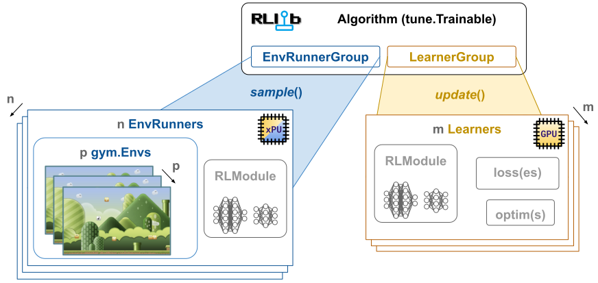

.. include:: /_includes/rllib/we_are_hiring.rst

.. include:: /_includes/rllib/new_api_stack.rst

.. _rllib-scaling-guide-docs:

RLlib Scaling Guide
===================

RLlib is a distributed and scalable RL library, based on `Ray <https://www.ray.io/>`__. An RLlib :py:class:`~ray.rllib.algorithms.algorithm.Algorithm`
makes use of `Ray actors <https://docs.ray.io/en/latest/ray-core/actors.html>`__ where ever parallelization of
its sub-components can speed up sample- and learning throughput.

    **Scalable axes in RLlib**: Three scaling axes are currently available across all RLlib :py:class:`~ray.rllib.algorithms.algorithm.Algorithm` classes:
    The number of :py:class:`~ray.rllib.env.env_runner.EnvRunner` actors in the :py:class:`~ray.rllib.env.env_runner_group.EnvRunnerGroup`,
    settable through ``config.env_runners(num_env_runners=n)``, the number of
    :py:class:`~ray.rllib.core.learner.learner.Learner` actors in the :py:class:`~ray.rllib.core.learner.learner_group.LearnerGroup`,
    settable through ``config.learners(num_learners=m)``, and the number of vectorized sub-environments on each
    :py:class:`~ray.rllib.env.env_runner.EnvRunner` actor, settable through ``config.env_runners(num_envs_per_env_runner=p)``.

Scaling the number of EnvRunner actors
--------------------------------------

You can control the degree of parallelism for the sampling machinery of your
:py:class:`~ray.rllib.algorithms.algorithm.Algorithm` by increasing the number of remote
:py:class:`~ray.rllib.env.env_runner.EnvRunner` actors in the :py:class:`~ray.rllib.env.env_runner_group.EnvRunnerGroup`
through your config as follows.

.. testcode::

    from ray.rllib.algorithms.ppo import PPOConfig

    config = (
        PPOConfig()
        # Use 4 EnvRunner actors (default is 2).
        .env_runners(num_env_runners=4)
    )

To assign resources to each :py:class:`~ray.rllib.env.env_runner.EnvRunner`, use these config settings:

.. code-block:: python

    config.env_runners(
        num_cpus_per_env_runner=..,
        num_gpus_per_env_runner=..,
    )

See here for an
`example of an EnvRunner and RL environment requiring a GPU resource <https://github.com/ray-project/ray/blob/master/rllib/examples/gpus/gpus_on_env_runners.py>`__.

The number of GPUs may be fractional quantities, for example 0.5, to allocate only a fraction of a GPU per
:py:class:`~ray.rllib.env.env_runner.EnvRunner`.

Note that there is always one "local" :py:class:`~ray.rllib.env.env_runner.EnvRunner` in the
:py:class:`~ray.rllib.env.env_runner_group.EnvRunnerGroup`.
If you only want to sample using this local :py:class:`~ray.rllib.env.env_runner.EnvRunner`,
you should set ``num_env_runners=0``. This local :py:class:`~ray.rllib.env.env_runner.EnvRunner` directly sits in the main
:py:class:`~ray.rllib.algorithms.algorithm.Algorithm` process.

.. hint::
    The Ray team may decide to deprecate the local :py:class:`~ray.rllib.env.env_runner.EnvRunner` some time in the future.
    There are historic reasons for why it still exists, however, its arguable, whether it's still of sufficient
    usefulness to keep it in the set.

Scaling the number of envs per EnvRunner actor
----------------------------------------------

RLlib vectorizes :ref:`RL environments <rllib-key-concepts-environments>` on :py:class:`~ray.rllib.env.env_runner.EnvRunner`
actors through the `gymnasium's VectorEnv <https://gymnasium.farama.org/api/vector/>`__ API.
To create more than one environment copy per :py:class:`~ray.rllib.env.env_runner.EnvRunner`, set the following in your config:

.. testcode::

    from ray.rllib.algorithms.ppo import PPOConfig

    config = (
        PPOConfig()
        # Use 10 sub-environments (vector) per EnvRunner.
        .env_runners(num_envs_per_env_runner=10)
    )

.. note::
    Unlike single-agent environments, RLlib can't vectorize multi-agent setups yet.
    The Ray team is working on a solution for this restriction by utilizing
    `gymnasium >= 1.x` custom vectorization feature.

Doing so allows the :py:class:`~ray.rllib.core.rl_module.rl_module.RLModule` on the
:py:class:`~ray.rllib.env.env_runner.EnvRunner` to run inference on a batch of data and
thus compute actions for all sub-environments in parallel.

By default, the individual sub-environments in a vector env step, and reset, in sequence, making only
the action computation part of the env loop parallel. However, `gymnasium <https://gymnasium.farama.org/>`__ supports an asynchronous
vectorization setting, in which each sub-environment receives its own python process.
This way, the entire vector can step, or reset, in parallel. Activate asynchronous vectorization through:

.. testcode::

    import gymnasium as gym

    config.env_runners(
        gym_env_vectorize_mode=gym.envs.registration.VectorizeMode.ASYNC,  # default is `SYNC`
    )

This setting can speed up the sampling process significantly in combination with ``num_envs_per_env_runner > 1``,
especially when your RL environment's stepping process is time consuming.

See here for an `example script demonstrating a massive speedup with async vectorization <https://github.com/ray-project/ray/blob/master/rllib/examples/envs/async_gym_env_vectorization.py>`__.

Scaling the number of Learner actors
------------------------------------

Learning updates happen in the :py:class:`~ray.rllib.core.learner.learner_group.LearnerGroup`, which manages either a single,
local :py:class:`~ray.rllib.core.learner.learner.Learner` instance or any number of remote
:py:class:`~ray.rllib.core.learner.learner.Learner` actors.

Set the number of remote :py:class:`~ray.rllib.core.learner.learner.Learner` actors through:

.. testcode::

    from ray.rllib.algorithms.ppo import PPOConfig

    config = (
        PPOConfig()
        # Use 2 remote Learner actors (default is 0) for distributed data parallelism.
        # Choosing 0 creates a local Learner instance on the main Algorithm process.
        .learners(num_learners=2)
    )

Normally, you use as many :py:class:`~ray.rllib.core.learner.learner.Learner` actors as you have GPUs available for training.
Make sure, you set the number of GPUs per :py:class:`~ray.rllib.core.learner.learner.Learner` to 1:

.. testcode::

    config.learners(num_gpus_per_learner=1)

.. warning::
    For some algorithms, such as IMPALA and APPO, the performance of a single remote
    :py:class:`~ray.rllib.core.learner.learner.Learner` actor (``num_learners=1``) vs a
    single local :py:class:`~ray.rllib.core.learner.learner.Learner` instance (``num_learners=0``),
    depends on whether you have a GPU available or not.
    If exactly one GPU is available, you should run these two algorithms with ``num_learners=0, num_gpus_per_learner=1``,
    if no GPU is available, you should set ``num_learners=1, num_gpus_per_learner=0``. For > 1 GPUs available, you should
    set ``num_learners=.., num_gpus_per_learner=1``.

The number of GPUs may be fractional quantities, for example 0.5, to allocate only a fraction of a GPU per
:py:class:`~ray.rllib.env.env_runner.EnvRunner`. For example, you can pack five :py:class:`~ray.rllib.algorithms.algorithm.Algorithm`
instances onto one GPU by setting ``num_learners=1, num_gpus_per_learner=0.2``.
See `this fractional GPU example here <https://github.com/ray-project/ray/blob/master/rllib/examples/gpus/fractional_gpus.py>`__
for details.

.. note::
    If you specify ``num_gpus_per_learner > 0`` and your machine doesn't have the required number of GPUs
    available, the experiment may stall until the Ray autoscaler brings up enough machines to fulfill the resource request.
    If your cluster has autoscaling turned off, this then results in a seemingly hanging experiment run.

    On the other hand, if you set ``num_gpus_per_learner=0``, RLlib builds your :py:class:`~ray.rllib.core.rl_module.rl_module.RLModule`
    instances solely on CPUs, even if GPUs are available on the cluster.

Outlook: More RLlib elements that should scale
-----------------------------------------------

There are other components and aspects in RLlib that should be able to scale up.
For example, the model size is currently limited to what ever fits on a single GPU, due to
"distributed data parallel" (DDP) being the only way in which RLlib scales :py:class:`~ray.rllib.core.learner.learner.Learner`
actors.

The Ray team is working on closing these gaps.

In particular, future areas of improvements are:

- Enable **training very large models**, such as a "large language model" (LLM). The team is actively working on a
  "Reinforcement Learning from Human Feedback" (RLHF) prototype setup. The main problems to solve are the
  model-parallel and tensor-parallel distribution across multiple GPUs, as well as, a reasonably fast transfer of
  weights between Ray actors.
- Enable training with **thousands of multi-agent policies**. A possible solution for this scaling problem
  could be to split up the :py:class:`~ray.rllib.core.rl_module.multi_rl_module.MultiRLModule` into
  manageable groups of individual policies across the various :py:class:`~ray.rllib.env.env_runner.EnvRunner`
  and :py:class:`~ray.rllib.core.learner.learner.Learner` actors.
- Enabling **vector envs for multi-agent**.
